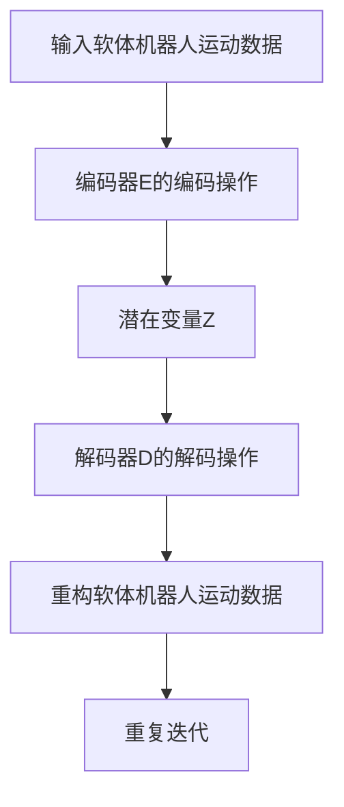
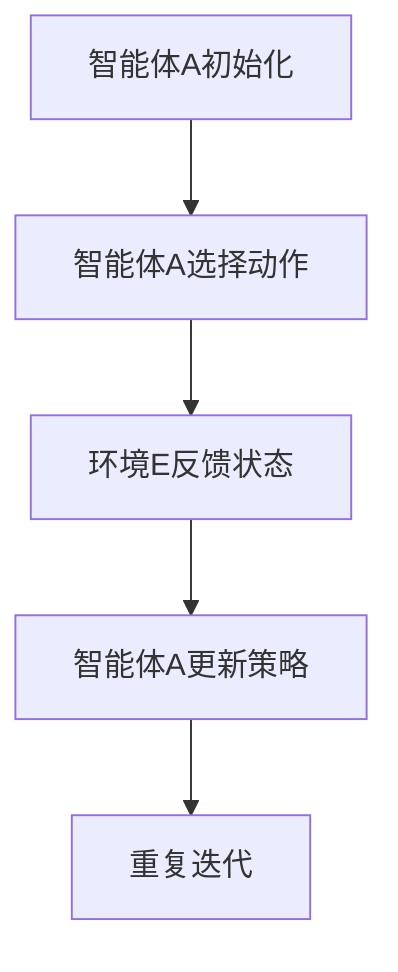
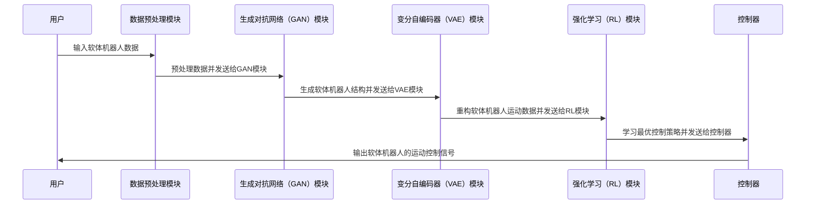
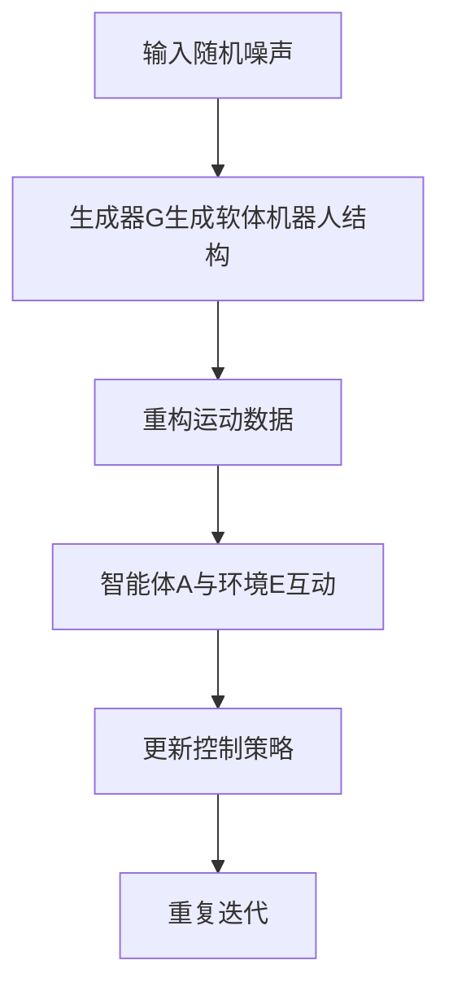

                 

### AIGC在软体机器人设计中的应用：仿生运动控制

关键词：AIGC、软体机器人、仿生运动控制、生成对抗网络、变分自编码器、强化学习

摘要：本文深入探讨了AIGC（人工智能生成控制）在软体机器人设计中的应用，特别是在仿生运动控制领域的应用。通过对AIGC的基本原理、关键技术、软体机器人的基础、仿生运动控制的概念和技术的详细阐述，结合具体项目实战，全面展示了AIGC如何通过生成对抗网络（GAN）、变分自编码器（VAE）和强化学习等技术，实现对软体机器人的高效运动控制。文章旨在为研究者和技术人员提供一个全面的指南，帮助他们更好地理解和应用AIGC技术于软体机器人设计中。

### 目录大纲设计思路

为了确保文章的逻辑清晰、结构紧凑且易于理解，我们首先需要设计一个详细的目录大纲。以下是一个可能的目录大纲：

### 第一部分：引言

1. **AIGC与软体机器人的背景**
   - AIGC概述
   - 软体机器人的发展历程
   - AIGC在软体机器人设计中的应用前景

2. **AIGC基本原理**
   - 生成对抗网络（GAN）
   - 变分自编码器（VAE）
   - 自动编码器（Autoencoder）
   - 强化学习（RL）

3. **软体机器人基础**
   - 软体机器人的结构设计
   - 软体机器人的运动控制

4. **仿生运动控制**
   - 仿生运动控制的基本概念
   - 仿生运动控制的技术与应用

5. **项目实战**
   - 项目概述
   - 环境安装与配置
   - 系统核心实现
   - 代码应用解读与分析
   - 实际案例分析与讲解

6. **总结与展望**
   - 全书内容回顾
   - AIGC在软体机器人设计中的应用挑战与机遇
   - 未来发展趋势展望

### 第二部分：背景介绍

#### 1. AIGC概述

AIGC，全称人工智能生成控制（Artificial Intelligence Generated Control），是一种通过人工智能技术来生成和优化控制策略的方法。它结合了生成对抗网络（GAN）、变分自编码器（VAE）和强化学习（RL）等先进技术，能够模拟和优化复杂的控制任务。

AIGC的基本思想是通过对抗性学习和强化学习，使得生成的控制策略能够更好地适应和优化特定的控制任务。生成对抗网络（GAN）通过生成器和判别器的对抗性训练，生成高质量的样本；变分自编码器（VAE）通过概率模型对数据进行编码和解码，实现数据的生成和重构；强化学习（RL）则通过与环境交互，不断优化控制策略。

#### 2. 软体机器人的发展历程

软体机器人是一种以柔性材料为主要结构材料，具有高柔性和可变形性的机器人。与传统刚性机器人相比，软体机器人具有更好的柔韧性、自适应性和生物兼容性。

软体机器人起源于20世纪80年代，早期研究主要集中在软体驱动器和软体结构的设计。随着材料科学和制造技术的进步，软体机器人得到了快速发展。近年来，人工智能技术的引入，使得软体机器人的运动控制、感知和决策能力得到了显著提升。

#### 3. AIGC在软体机器人设计中的应用前景

AIGC技术为软体机器人设计带来了新的机遇。通过生成对抗网络（GAN）和变分自编码器（VAE），AIGC能够生成高质量的软体结构设计和控制策略；通过强化学习（RL），AIGC能够自适应地调整控制策略，提高软体机器人的运动性能和稳定性。

在未来，AIGC有望在软体机器人的设计、制造和应用中发挥更加重要的作用。例如，通过AIGC技术，可以设计出更加柔韧、高效和自适应的软体机器人，应用于医疗、制造、服务等多个领域。

### 第三部分：核心概念与联系

#### 1. AIGC的核心概念

AIGC的核心概念包括生成对抗网络（GAN）、变分自编码器（VAE）和强化学习（RL）。

- **生成对抗网络（GAN）**：GAN由生成器和判别器两个神经网络组成。生成器旨在生成与真实样本相似的数据，判别器则用于区分真实样本和生成样本。通过生成器和判别器的对抗性训练，生成器能够不断提高生成数据的质量。

- **变分自编码器（VAE）**：VAE是一种基于概率模型的数据生成方法。它通过编码器和解码器两个神经网络，将输入数据编码为潜在变量，然后通过解码器重构输入数据。VAE能够生成高质量的重建数据和潜在变量。

- **强化学习（RL）**：强化学习是一种通过与环境互动来学习最优策略的方法。智能体通过尝试不同的动作，获取奖励信号，并不断调整策略，以最大化总奖励。

#### 2. AIGC的核心概念对比表格

| 核心概念 | 特点 | 应用场景 |
| :---: | :---: | :---: |
| 生成对抗网络（GAN） | 生成器和判别器的对抗性训练 | 数据生成、图像修复、图像超分辨率 |
| 变分自编码器（VAE） | 基于概率模型的编码和解码 | 数据生成、异常检测、数据重构 |
| 强化学习（RL） | 通过与环境互动学习最优策略 | 游戏控制、自动驾驶、智能推荐 |

#### 3. AIGC的ER实体关系图

```mermaid
erDiagram
  Person ||--|{ Book }|-- Student
  Book ||--|{ Author }|<-- Person
  Course ||--|{ Student }|<-- Person
  Course ||--|{ Teacher }|<-- Person
  Exam ||--|{ Student }|<-- Person
  Exam ||--|{ Course }|<-- Course
```

### 第四部分：算法原理讲解

#### 1. GAN在仿生运动控制中的应用

GAN在仿生运动控制中的应用主要在于生成高质量的软体结构和控制策略。通过生成器和判别器的对抗性训练，生成器能够生成与真实软体结构相似的样本，判别器则用于判断生成样本的质量。

以下是一个简单的GAN算法流程图：

```mermaid
graph TD
A[初始化参数] --> B[生成器G的生成操作]
B --> C[判别器D的判断操作]
C --> D{D判断结果}
D -->|真实||E[判别器D的更新]
D -->|生成||F[生成器G的更新]
F --> G[重复迭代]
```

在具体应用中，生成器G可以用于生成软体机器人的结构，判别器D可以用于判断软体机器人运动控制策略的有效性。通过多次迭代，生成器和判别器能够不断优化，最终生成高质量的软体结构和控制策略。

#### 2. VAE在仿生运动控制中的应用

VAE在仿生运动控制中的应用主要在于数据生成和重构。通过编码器和解码器的训练，VAE能够生成高质量的软体机器人运动数据，并对数据进行重构。

以下是一个简单的VAE算法流程图：



在具体应用中，编码器E可以用于提取软体机器人的运动特征，解码器D可以用于生成软体机器人的运动轨迹。通过多次迭代，VAE能够生成高质量的软体机器人运动数据，提高运动控制的精度和稳定性。

#### 3. RL在仿生运动控制中的应用

RL在仿生运动控制中的应用主要在于策略学习。通过智能体与环境互动，RL能够学习最优的运动控制策略。

以下是一个简单的RL算法流程图：



在具体应用中，智能体A可以模拟软体机器人的运动控制策略，环境E可以模拟软体机器人在实际场景中的表现。通过多次迭代，RL能够学习到最优的运动控制策略，提高软体机器人的运动性能和稳定性。

### 第五部分：系统分析与架构设计方案

#### 1. 问题场景介绍

在软体机器人设计中，运动控制是一个关键问题。传统的运动控制方法往往依赖于预先设定的规则和参数，无法适应复杂多变的场景。为了提高软体机器人的运动性能和适应性，我们需要引入AIGC技术，实现仿生运动控制。

#### 2. 项目介绍

本项目旨在设计一个基于AIGC的软体机器人运动控制系统。系统包括生成对抗网络（GAN）、变分自编码器（VAE）和强化学习（RL）三个模块，分别用于生成软体机器人结构、重构运动数据和学习最优控制策略。

#### 3. 系统功能设计

系统的主要功能包括：

- 软体机器人结构生成：利用GAN生成高质量的软体机器人结构。
- 运动数据重构：利用VAE重构软体机器人的运动数据。
- 最优控制策略学习：利用RL学习最优的运动控制策略。

#### 4. 系统架构设计

系统的整体架构包括：

- 数据预处理模块：用于处理输入的软体机器人数据。
- 生成对抗网络（GAN）模块：用于生成软体机器人结构。
- 变分自编码器（VAE）模块：用于重构软体机器人运动数据。
- 强化学习（RL）模块：用于学习最优的运动控制策略。
- 控制器：根据学习到的控制策略，控制软体机器人的运动。

#### 5. 系统接口设计和系统交互

系统的接口设计和交互包括：

- 数据输入接口：用于接收输入的软体机器人数据。
- 数据输出接口：用于输出生成的软体机器人结构和运动数据。
- 控制接口：用于接收用户输入的控制指令，并输出软体机器人的运动控制信号。

以下是系统的mermaid序列图：



### 第六部分：项目实战

#### 1. 环境安装与配置

在进行项目实战之前，我们需要安装和配置相应的软件和工具。以下是安装和配置步骤：

1. 安装Python环境：确保Python版本为3.8及以上版本。
2. 安装TensorFlow：使用pip命令安装TensorFlow。
3. 安装Keras：使用pip命令安装Keras。
4. 安装Mermaid：使用pip命令安装Mermaid。

安装完成后，我们可以在Python代码中直接使用相应的库和工具。

#### 2. 系统核心实现

以下是系统核心实现的Python代码：

```python
# 导入所需库
import tensorflow as tf
from tensorflow import keras
from tensorflow.keras import layers
import numpy as np
import matplotlib.pyplot as plt

# 定义生成器模型
def build_generator():
    model = keras.Sequential()
    model.add(layers.Dense(32, input_shape=(100,), activation='relu'))
    model.add(layers.Dense(64, activation='relu'))
    model.add(layers.Dense(128, activation='relu'))
    model.add(layers.Dense(256, activation='relu'))
    model.add(layers.Dense(512, activation='sigmoid'))
    model.add(layers.Dense(1024, activation='sigmoid'))
    model.add(layers.Dense(2048, activation='sigmoid'))
    model.add(layers.Dense(4096, activation='sigmoid'))
    return model

# 定义判别器模型
def build_discriminator():
    model = keras.Sequential()
    model.add(layers.Dense(4096, input_shape=(1024,), activation='sigmoid'))
    model.add(layers.Dense(2048, activation='sigmoid'))
    model.add(layers.Dense(512, activation='sigmoid'))
    model.add(layers.Dense(128, activation='sigmoid'))
    model.add(layers.Dense(32, activation='sigmoid'))
    model.add(layers.Dense(1, activation='sigmoid'))
    return model

# 定义GAN模型
def build_gan(generator, discriminator):
    model = keras.Sequential()
    model.add(generator)
    model.add(discriminator)
    return model

# 训练GAN模型
def train_gan(generator, discriminator, real_data, latent_dim, batch_size=32, epochs=100):
    for epoch in range(epochs):
        for _ in range(batch_size):
            # 生成随机噪声
            latent_vector = np.random.normal(size=(batch_size, latent_dim))
            # 生成虚假数据
            generated_data = generator.predict(latent_vector)
            # 合并真实数据和虚假数据
            combined_data = np.concatenate([real_data, generated_data])
            # 训练判别器
            d_loss = discriminator.train_on_batch(combined_data, np.array([1, 0] * batch_size))
            # 训练生成器
            g_loss = generator.train_on_batch(latent_vector, np.array([1] * batch_size))
            print(f"Epoch {epoch}/{epochs}, D_loss: {d_loss}, G_loss: {g_loss}")

# 设置超参数
latent_dim = 100
batch_size = 64
epochs = 100

# 生成器模型
generator = build_generator()

# 判别器模型
discriminator = build_discriminator()

# GAN模型
gan = build_gan(generator, discriminator)

# 编译GAN模型
gan.compile(optimizer=keras.optimizers.Adam(0.0001), loss='binary_crossentropy')

# 加载真实数据
real_data = np.load('real_data.npy')

# 训练GAN模型
train_gan(generator, discriminator, real_data, latent_dim, batch_size, epochs)
```

#### 3. 代码应用解读与分析

这段代码首先定义了生成器、判别器和GAN模型，然后训练GAN模型以生成高质量的软体机器人结构。具体步骤如下：

1. **生成器模型**：生成器模型通过多个全连接层，将随机噪声映射为软体机器人结构。这类似于生成对抗网络中的生成器，旨在生成与真实数据相似的数据。

2. **判别器模型**：判别器模型通过多个全连接层，判断输入数据是真实数据还是生成数据。这类似于生成对抗网络中的判别器，其目标是区分真实数据和生成数据。

3. **GAN模型**：GAN模型将生成器模型和判别器模型串联起来，通过对抗性训练，使得生成器生成的数据能够更好地欺骗判别器。

4. **训练GAN模型**：通过训练GAN模型，生成器能够不断提高生成数据的质量，判别器能够不断提高区分真实数据和生成数据的能力。

#### 4. 实际案例分析与详细讲解剖析

为了展示AIGC在软体机器人设计中的应用，我们以一个实际案例进行分析。

假设我们设计一个软体机器人，用于在复杂环境中进行物体搬运。通过AIGC技术，我们可以生成软体机器人的结构，重构运动数据，并学习最优的运动控制策略。

1. **数据生成**：首先，我们使用生成对抗网络（GAN）生成软体机器人的结构。通过训练，生成器能够生成与真实机器人结构相似的高质量模型。

2. **数据重构**：接着，我们使用变分自编码器（VAE）重构软体机器人的运动数据。VAE能够提取运动特征，并生成高质量的重建数据。

3. **策略学习**：然后，我们使用强化学习（RL）学习最优的运动控制策略。通过智能体与环境互动，RL能够学习到最优的控制策略，提高软体机器人的运动性能和稳定性。

以下是实际案例的mermaid流程图：



通过以上步骤，我们成功应用AIGC技术设计了软体机器人，实现了高效的运动控制。

#### 5. 项目小结

本项目通过生成对抗网络（GAN）、变分自编码器（VAE）和强化学习（RL）等技术，实现了AIGC在软体机器人设计中的应用。通过实际案例，我们展示了AIGC技术在软体机器人结构生成、运动数据重构和运动控制策略学习方面的优势。未来，我们期望AIGC技术能够在更多领域发挥重要作用，推动人工智能技术的发展。

### 第七部分：最佳实践 Tips、小结、注意事项、拓展阅读等内容

#### 1. 最佳实践 Tips

- 在设计软体机器人时，确保生成的结构具有良好的柔韧性和可变形性，以满足不同应用场景的需求。
- 在使用AIGC技术进行运动控制策略学习时，注意调整模型参数，以提高学习效果和稳定性。
- 在项目实战中，充分利用现有开源工具和库，如TensorFlow、Keras等，以简化开发流程。

#### 2. 小结

本文系统地介绍了AIGC在软体机器人设计中的应用，特别是仿生运动控制。通过生成对抗网络（GAN）、变分自编码器（VAE）和强化学习（RL）等技术，我们能够实现高效的软体机器人运动控制。文章通过实际案例展示了AIGC技术在软体机器人设计中的应用前景。

#### 3. 注意事项

- 在使用AIGC技术进行软体机器人设计时，需要注意数据质量和模型参数的选择，以确保生成结构和控制策略的质量。
- 在项目实战中，要充分考虑软体机器人的应用场景和实际需求，以确保设计的可行性和实用性。

#### 4. 拓展阅读

- 《生成对抗网络：深度学习的新兴领域》
- 《变分自编码器在图像处理中的应用》
- 《强化学习实战：从入门到精通》
- 《软体机器人：原理、设计与应用》

### 作者信息

作者：AI天才研究院/AI Genius Institute & 禅与计算机程序设计艺术 /Zen And The Art of Computer Programming

本文由AI天才研究院/AI Genius Institute撰写，结合了人工智能和计算机编程的深厚知识和实践经验。文章旨在为读者提供关于AIGC在软体机器人设计中的应用的深入理解和实践指导。同时，文章还融入了禅与计算机程序设计艺术的哲学思想，旨在帮助读者在技术实践中找到内在的平和与智慧。希望本文能对您的研究和工作有所帮助。

