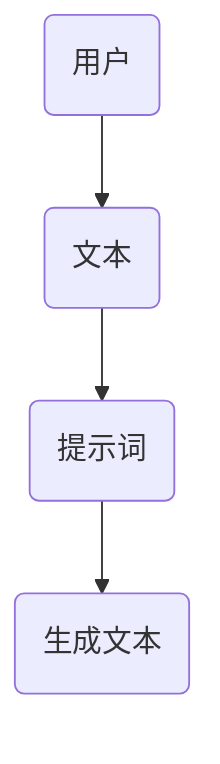

                 

# AIGC提示词优化：效率与创意的完美融合

## 关键词：AIGC，提示词优化，自然语言处理，生成对抗网络，强化学习，系统架构设计

### 摘要：
本文深入探讨了AIGC（自适应智能生成内容）领域的提示词优化技术。我们首先回顾了AIGC的背景和基本概念，然后详细分析了提示词优化的重要性、挑战和解决方案。接着，通过数学模型和算法原理的讲解，我们介绍了GAN、强化学习和自动调整策略等核心技术。随后，文章展示了如何将理论应用于实践，包括环境配置、系统设计和项目实战。最后，我们总结了最佳实践技巧，并展望了AIGC提示词优化的发展趋势。

### 目录大纲

----------------------------------------------------------------

## 第一部分: AIGC背景介绍与概念理解

### 1.1 问题背景

#### 1.1.1 人工智能发展现状
- **核心概念术语说明**：人工智能、机器学习、深度学习、生成模型
- **问题背景**：人工智能在各行业中的应用，以及AIGC的兴起

#### 1.1.2 GPT模型与AIGC的兴起
- **核心概念联系**：GPT模型的工作原理和AIGC的概念
- **联系与影响**：AIGC在文本生成、内容创作中的应用

#### 1.1.3 AIGC在行业中的应用
- **案例研究**：AIGC在媒体、广告、客户服务等行业中的应用

### 1.2 问题描述

#### 1.2.1 提示词优化的重要性
- **核心概念与联系**：提示词对AIGC生成内容的影响
- **问题挑战**：提示词优化的难点和重要性

#### 1.2.2 提示词优化的挑战
- **问题分析**：数据多样性、质量、上下文理解等挑战

#### 1.2.3 提示词优化方法综述
- **解决方案**：常见的提示词优化方法

### 1.3 问题解决

#### 1.3.1 提示词优化策略
- **核心概念与联系**：提示词优化的策略和方法

#### 1.3.2 提示词优化算法
- **核心概念与联系**：提示词优化的算法原理

### 1.4 边界与外延

#### 1.4.1 提示词优化的限制
- **问题边界**：提示词优化的局限性

#### 1.4.2 提示词优化的发展方向
- **未来展望**：提示词优化的技术发展趋势

### 1.5 概念结构与核心要素组成

#### 1.5.1 AIGC的基本原理
- **核心概念与联系**：AIGC的工作原理和核心组成部分

#### 1.5.2 提示词优化的关键要素
- **核心概念与联系**：提示词优化的重要要素和影响因素

### 1.6 本章小结

----------------------------------------------------------------

## 第二部分: AIGC提示词优化原理

### 2.1 AIGC核心概念与原理

#### 2.1.1 AIGC概述
- **核心概念**：AIGC的定义、特点和应用场景

#### 2.1.2 GPT模型原理
- **核心概念与联系**：GPT模型的基本原理和优缺点

#### 2.1.3 自然语言处理基础
- **核心概念**：自然语言处理的基本概念和技术

### 2.2 提示词优化的数学模型

#### 2.2.1 模型损失函数
- **核心概念**：损失函数的定义、作用和重要性

#### 2.2.2 模型优化算法
- **核心概念与联系**：优化算法的选择和实现

#### 2.2.3 数学公式与推导
- **核心概念与联系**：数学公式的推导和解释

### 2.3 提示词优化算法详解

#### 2.3.1 生成对抗网络（GAN）
- **核心概念**：GAN的工作原理、优势和局限性

#### 2.3.2 强化学习
- **核心概念**：强化学习的基本原理和应用

#### 2.3.3 自动调整策略
- **核心概念**：自动调整策略的实现和优化

### 2.4 概念属性特征对比表格

| 算法 | 特点 | 优点 | 缺点 |
| ---- | ---- | ---- | ---- |
| GAN  | ... | ... | ... |
| 强化学习 | ... | ... | ... |
| 自动调整策略 | ... | ... | ... |

### 2.5 ER实体关系图架构

### 2.6 本章小结

----------------------------------------------------------------

## 第三部分: AIGC提示词优化实践

### 3.1 环境安装与配置

#### 3.1.1 硬件要求
- **核心概念**：硬件配置对AIGC系统性能的影响

#### 3.1.2 软件安装
- **核心概念**：常见的AIGC软件安装和配置

#### 3.1.3 配置与调试
- **核心概念**：系统调试和优化技巧

### 3.2 系统功能设计

#### 3.2.1 功能模块划分
- **核心概念**：系统功能模块的设计和划分

#### 3.2.2 领域模型类图
- **核心概念与联系**：领域模型类图的构建和应用

### 3.3 系统架构设计

#### 3.3.1 系统架构概述
- **核心概念**：系统架构的设计原则和架构概述

#### 3.3.2 架构设计与实现
- **核心概念与联系**：系统架构的具体设计和实现

### 3.4 系统接口设计

#### 3.3.1 接口规范
- **核心概念**：系统接口的设计规范

#### 3.3.2 接口实现
- **核心概念**：系统接口的具体实现

### 3.5 系统交互

#### 3.3.1 交互流程
- **核心概念**：系统交互的基本流程

#### 3.3.2 序列图
- **核心概念与联系**：序列图的构建和应用

### 3.6 项目实战

#### 3.6.1 核心代码实现
- **核心概念**：系统核心代码的实现

#### 3.6.2 代码应用解读与分析
- **核心概念**：代码的解读和分析

#### 3.6.3 实际案例分析与讲解
- **核心概念**：实际案例的剖析和讲解

### 3.7 本章小结

----------------------------------------------------------------

## 第四部分: AIGC提示词优化最佳实践

### 4.1 最佳实践 tips

#### 4.1.1 提示词设计技巧
- **核心概念**：有效的提示词设计技巧

#### 4.1.2 模型训练技巧
- **核心概念**：高效的模型训练技巧

#### 4.1.3 模型部署与优化
- **核心概念**：模型部署和优化策略

### 4.2 注意事项

#### 4.2.1 数据安全与隐私
- **核心概念**：数据安全和隐私保护的重要性

#### 4.2.2 模型解释性
- **核心概念**：模型的解释性和可解释性

#### 4.2.3 模型滥用风险
- **核心概念**：模型滥用风险的识别和管理

### 4.3 小结

#### 4.3.1 AIGC提示词优化总结
- **核心概念**：AIGC提示词优化的核心要点

#### 4.3.2 未来发展趋势
- **核心概念**：AIGC提示词优化的未来方向

### 4.4 拓展阅读

#### 4.4.1 相关书籍推荐
- **核心概念**：推荐相关书籍，帮助读者深入了解AIGC提示词优化

#### 4.4.2 学术论文推荐
- **核心概念**：推荐相关学术论文，追踪AIGC提示词优化领域的前沿研究

#### 4.4.3 在线教程推荐
- **核心概念**：推荐在线教程，方便读者学习和实践AIGC提示词优化技术

----------------------------------------------------------------

### 作者信息

作者：AI天才研究院 / AI Genius Institute & 禅与计算机程序设计艺术 / Zen And The Art of Computer Programming

---

通过上述大纲，我们为即将撰写的文章奠定了坚实的基础，每个部分都涵盖了核心内容、深入分析和实际应用。接下来，我们将逐步填充各个章节的具体内容，确保文章的完整性和深度。在撰写过程中，我们将严格遵循大纲的结构，同时注重逻辑性和可读性，确保读者能够顺利跟随文章的思路，深入理解AIGC提示词优化的各个方面。

