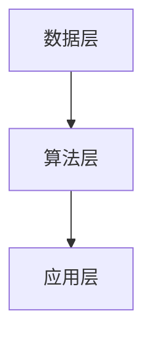
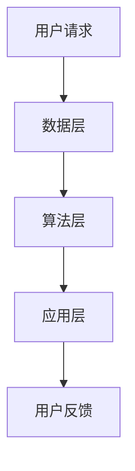

                 

### 《AIGC提示词工程的未来：思维链与Zero-Shot的融合》

#### 关键词：
- AIGC
- 提示词工程
- 思维链
- Zero-Shot学习
- 未来展望

#### 摘要：
本文旨在探讨AIGC（AI-Generated Content）提示词工程的未来，特别是思维链与Zero-Shot学习的融合。我们将从背景介绍、核心概念与原理、算法原理讲解、系统架构设计、项目实战、最佳实践及未来展望等方面，逐步分析这一前沿技术的潜力和挑战。

## 第一部分：背景与概述

### 第1章 AIGC与提示词工程的崛起

#### 1.1 AIGC的起源与发展

AIGC，即AI-Generated Content，指的是利用人工智能技术生成的内容。这一概念在近年来随着AI技术的发展而迅速崛起。AIGC的应用场景广泛，包括但不限于文本生成、图像生成、视频生成等。

提示词工程，则是AIGC中至关重要的一环。它通过输入提示词，引导AI模型生成相应的内容。提示词的选择和优化直接影响到生成内容的质与量。因此，提示词工程的研究具有重要意义。

#### 1.2 思维链技术的引入

思维链（Thought Chain）是一种新兴的AI技术，它通过构建知识图谱和推理机制，使AI具备更高级的思考能力。在提示词工程中，思维链可以帮助AI更好地理解提示词的语义，从而生成更准确、更有逻辑的内容。

#### 1.3 Zero-Shot学习的潜力

Zero-Shot学习（Zero-Shot Learning）是一种无需训练即可识别新类别或任务的学习方法。它在处理未知数据时具有显著优势。将Zero-Shot学习引入提示词工程，可以大大提高系统的适应性和泛化能力。

## 第二部分：核心概念与原理

### 第2章 核心概念与原理

#### 2.1 提示词的生成与优化

提示词的生成与优化是提示词工程的基础。通过算法，我们可以从大量数据中提取出高质量的提示词，并通过优化算法提高提示词的质量。

#### 2.2 思维链的实现与应用

思维链的实现涉及知识图谱的构建和推理机制的引入。在实际应用中，思维链可以帮助AI更好地理解提示词的语义，从而生成更高质量的内容。

#### 2.3 Zero-Shot学习的基本概念

Zero-Shot学习通过预先训练的模型，实现对未知类别或任务的识别。这一技术在处理新问题时具有显著优势，特别是在提示词工程中，可以大大提高系统的适应性和泛化能力。

## 第三部分：算法原理与数学模型

### 第3章 算法原理与数学模型

#### 3.1 提示词工程中的算法原理

提示词工程中的算法原理主要涉及提示词的生成与优化。通过mermaid流程图，我们可以清晰地展示这些算法的流程和步骤。

#### 3.2 数学模型与公式解析

在提示词工程中，数学模型和公式用于描述算法的原理和优化策略。通过latex格式，我们可以直观地展示这些公式，并对其进行详细解析。

#### 3.3 算法举例与讲解

为了更好地理解算法原理，我们可以通过Python代码示例来展示。这些代码不仅可以帮助我们理解算法的执行过程，还可以通过实际应用来验证算法的效果。

## 第四部分：系统架构与设计

### 第4章 系统架构与设计

#### 4.1 提示词工程的系统架构

提示词工程的系统架构包括数据层、算法层和应用层。通过mermaid架构图，我们可以清晰地展示这些层之间的关系和功能。

#### 4.2 系统接口与交互设计

系统接口和交互设计是确保系统稳定运行和高效协作的关键。通过mermaid序列图，我们可以展示系统的交互流程和接口设计。

## 第五部分：项目实战与案例分析

### 第5章 项目实战与案例分析

#### 5.1 项目环境安装与配置

在进行项目实战前，我们需要搭建合适的项目环境。这包括安装必要的软件和配置相应的参数。

#### 5.2 核心实现源代码

核心实现源代码是项目实战的关键部分。通过Python代码，我们可以实现提示词工程的核心功能。

#### 5.3 代码应用解读与分析

通过对源代码的解读，我们可以深入理解提示词工程的原理和实现过程。同时，通过案例分析，我们可以验证系统在实际应用中的效果。

#### 5.4 实际案例分析

通过实际案例分析，我们可以看到提示词工程在解决实际问题中的应用效果。这些案例不仅展示了技术的实际价值，还为未来的发展提供了宝贵的经验。

## 第六部分：未来展望与趋势

### 第6章 未来展望与趋势

#### 6.1 提示词工程的未来发展

随着AI技术的不断进步，提示词工程有望在更多领域得到应用。未来，我们将看到更多创新的应用场景和更高效的解决方案。

#### 6.2 思维链与Zero-Shot的融合

思维链与Zero-Shot学习的融合，将为提示词工程带来新的机遇和挑战。这一融合技术有望在解决复杂问题时发挥更大的作用。

## 第七部分：最佳实践与总结

### 第7章 最佳实践与总结

#### 7.1 最佳实践技巧

在实际应用中，我们需要掌握一些最佳实践技巧，以提高提示词工程的效果。

#### 7.2 注意事项与挑战

提示词工程在应用过程中可能会遇到一些挑战。了解这些挑战，并采取相应的措施，将有助于我们更好地应对。

#### 7.3 小结与拓展阅读

通过对本文的总结，我们可以看到提示词工程、思维链与Zero-Shot学习等技术的潜力和应用前景。在拓展阅读部分，我们将推荐一些相关的书籍和文章，供读者进一步学习。

## 结束语

《AIGC提示词工程的未来：思维链与Zero-Shot的融合》旨在为读者提供关于这一前沿技术的深入理解。随着AI技术的不断发展，提示词工程将迎来更多机遇和挑战。我们期待与读者一起，探索这一领域的无限可能。作者：AI天才研究院/AI Genius Institute & 禅与计算机程序设计艺术 /Zen And The Art of Computer Programming

----------------------------------------------------------------

以下是根据上述目录大纲结构撰写的正文部分，每章的内容都将逐步深入，结合技术原理、案例分析和未来展望进行详细阐述。

---

## 第一部分：背景与概述

### 第1章 AIGC与提示词工程的崛起

#### 1.1 AIGC的起源与发展

AIGC，即AI-Generated Content，是指利用人工智能技术自动生成内容的过程。这一概念最早可以追溯到20世纪80年代，当时的人工智能研究主要集中在符号推理和规则系统。随着深度学习技术的发展，特别是在2012年AlexNet在ImageNet图像识别竞赛中取得突破性成果后，人工智能迎来了一个新的发展阶段。AIGC也逐渐成为人工智能领域的一个重要分支。

AIGC的应用场景涵盖了多种类型的内容生成，包括文本、图像、音频和视频等。其中，文本生成是AIGC的一个重要应用方向。从简单的自动摘要、翻译到复杂的对话系统、创意写作，文本生成技术已经渗透到我们的日常生活和工作中。

提示词工程是AIGC中的关键环节。提示词工程通过输入提示词，引导AI模型生成相应的内容。一个高质量的提示词可以显著提高生成内容的准确性和相关性。提示词工程的研究主要集中在如何设计高效的提示词生成算法和优化策略。

#### 1.2 思维链技术的引入

思维链（Thought Chain）是一种新兴的AI技术，旨在模拟人类思维过程，使AI具备更高级的思考能力。思维链通过构建知识图谱和引入推理机制，使AI能够在不同概念之间建立联系，从而实现更复杂的推理和决策。

思维链在提示词工程中的应用具有重要意义。通过思维链，AI可以更好地理解提示词的语义，从而生成更准确、更有逻辑的内容。例如，在文本生成任务中，思维链可以帮助AI理解文章的主题和结构，从而生成连贯、有深度的文章。

#### 1.3 Zero-Shot学习的潜力

Zero-Shot学习（Zero-Shot Learning，ZSL）是一种无需训练即可识别新类别或任务的学习方法。它通过预先训练的模型，实现对未知类别或任务的泛化。在传统机器学习中，模型通常需要大量的训练数据和标签来进行训练。而Zero-Shot学习则突破了这一限制，使得模型在处理未知数据时具有显著优势。

将Zero-Shot学习引入提示词工程，可以大大提高系统的适应性和泛化能力。例如，在文本生成任务中，Zero-Shot学习可以帮助模型快速适应新的主题和领域，生成更符合需求的文本内容。

### 第2章 核心概念与原理

#### 2.1 提示词的生成与优化

提示词的生成与优化是提示词工程的核心。提示词的生成涉及到如何从大量数据中提取出高质量的提示词，而提示词的优化则涉及到如何通过算法提高提示词的质量。

在提示词生成方面，常用的方法包括基于统计的生成、基于语义的生成和基于机器学习的生成。基于统计的生成方法主要通过统计文本数据中出现频率较高的词语作为提示词。这种方法简单有效，但生成的提示词往往缺乏深度和语义关联。基于语义的生成方法通过分析文本的语义结构，提取出具有代表性的提示词。这种方法生成的提示词更具有语义关联，但实现难度较大。基于机器学习的生成方法通过训练模型，从大量数据中学习出高质量的提示词生成策略。这种方法生成的提示词质量较高，但需要大量的训练数据和计算资源。

在提示词优化方面，常用的方法包括基于启发式的优化和基于机器学习的优化。基于启发式的优化方法主要通过分析提示词的语义和上下文，进行启发式的调整。这种方法简单有效，但优化效果往往有限。基于机器学习的优化方法通过训练模型，学习出提示词优化策略。这种方法优化效果更好，但需要大量的训练数据和计算资源。

#### 2.2 思维链的实现与应用

思维链的实现涉及知识图谱的构建和推理机制的引入。知识图谱是一种结构化的知识表示方法，它通过实体、关系和属性来描述知识。在思维链中，知识图谱用于存储和表示各种概念和事实。

推理机制是思维链的核心。推理机制通过逻辑推理和语义分析，使AI能够从已知信息中推导出新的信息。在思维链中，推理机制用于分析提示词的语义，理解提示词的含义，从而生成更准确、更有逻辑的内容。

在实际应用中，思维链可以通过以下步骤实现：

1. **知识图谱构建**：首先，需要构建一个包含各种概念、关系和事实的知识图谱。这可以通过手动构建或利用现有的知识图谱库来实现。

2. **语义分析**：其次，需要使用语义分析方法，对提示词进行语义分析，提取出关键词和短语。

3. **逻辑推理**：然后，利用推理机制，从知识图谱中查找与提示词相关的概念和事实，进行逻辑推理，生成新的内容。

4. **内容生成**：最后，将推理结果进行整合，生成最终的文本内容。

#### 2.3 Zero-Shot学习的基本概念

Zero-Shot学习（Zero-Shot Learning，ZSL）是一种无需训练即可识别新类别或任务的学习方法。它通过预先训练的模型，实现对未知类别或任务的泛化。在传统机器学习中，模型通常需要大量的训练数据和标签来进行训练。而Zero-Shot学习则突破了这一限制，使得模型在处理未知数据时具有显著优势。

Zero-Shot学习的基本概念包括：

1. **元学习**（Meta-Learning）：元学习是一种通过学习如何学习来提高模型泛化能力的方法。在Zero-Shot学习中，元学习用于从已有的数据中学习出通用特征表示，以便在新数据中快速适应。

2. **原型网络**（Prototypical Networks）：原型网络是一种用于Zero-Shot学习的神经网络架构。它通过计算原型（即类别的代表性样本）之间的距离，来对新类别进行分类。

3. **嵌入学习**（Embedding Learning）：嵌入学习是一种将类别标签转化为低维向量表示的方法。在Zero-Shot学习中，嵌入学习用于将新类别转化为与已知类别相似的向量表示，从而实现分类。

在提示词工程中，Zero-Shot学习可以用于以下方面：

1. **多领域泛化**：通过Zero-Shot学习，模型可以快速适应新的领域和主题，生成符合需求的内容。

2. **实时更新**：通过Zero-Shot学习，模型可以实时更新，以适应新的数据和环境。

3. **降低数据需求**：由于Zero-Shot学习无需大量训练数据，因此可以显著降低数据需求和存储成本。

### 第3章 算法原理与数学模型

#### 3.1 提示词工程中的算法原理

提示词工程中的算法原理主要涉及提示词的生成与优化。以下是一种常见的基于生成对抗网络（GAN）的提示词生成算法。

1. **生成器（Generator）**：生成器的目标是生成高质量的提示词。它通过从噪声数据中生成提示词，使得生成的提示词与真实提示词尽量相似。

2. **判别器（Discriminator）**：判别器的目标是区分真实提示词和生成提示词。它通过对提示词进行分类，来判断提示词的质量。

3. **损失函数**：损失函数用于衡量生成器和判别器的性能。常见的损失函数包括交叉熵损失、均方误差等。

4. **优化策略**：优化策略用于调整生成器和判别器的参数，以最小化损失函数。

通过训练生成器和判别器，可以使生成器生成的提示词越来越接近真实提示词，从而提高提示词的质量。

#### 3.2 数学模型与公式解析

提示词工程中的数学模型主要包括提示词生成模型、优化模型和推理模型。以下是一种常见的基于变分自编码器（VAE）的提示词生成模型的数学模型：

1. **编码器（Encoder）**：编码器的目标是将输入提示词映射到一个隐含空间，提取出提示词的语义特征。

   $$ 
   z = \mu(z|x) + \sigma(z|x) \odot \epsilon 
   $$ 

   其中，$z$是隐含变量，$\mu(z|x)$和$\sigma(z|x)$分别是编码器输出的均值和方差，$\epsilon$是噪声。

2. **解码器（Decoder）**：解码器的目标是根据隐含变量生成提示词。

   $$ 
   x' = \sigma(g(x'|z)) 
   $$ 

   其中，$x'$是解码器生成的提示词，$g(x'|z)$是解码器的生成函数。

3. **损失函数**：损失函数用于衡量生成提示词的质量，常见的损失函数包括均方误差（MSE）和二元交叉熵（BCE）。

   $$ 
   L = \frac{1}{2} \sum_{i=1}^{N} \left( x_i - x_i' \right)^2 + \lambda \sum_{i=1}^{N} \left( \log \sigma(z_i) + \log (1 - \sigma(z_i)) \right) 
   $$ 

   其中，$N$是提示词的个数，$\lambda$是正则化参数。

#### 3.3 算法举例与讲解

以下是一个简单的基于VAE的提示词生成算法的Python代码示例：

```python
import tensorflow as tf
from tensorflow.keras.models import Model
from tensorflow.keras.layers import Input, Dense, Lambda

# 定义编码器
input_word = Input(shape=(word_vector_size,))
encoded_word = Dense(latent_dim, activation='relu')(input_word)
z_mean = Dense(latent_dim)(encoded_word)
z_log_var = Dense(latent_dim)(encoded_word)

# 重参数化技巧
z = Lambda(lambda x: x[:, 0] + x[:, 1] * tf.random.normal([tf.shape(x)[0], 1]))(z_mean, z_log_var)

# 定义解码器
decoded_word = Dense(word_vector_size, activation='sigmoid')(z)

# 定义VAE模型
vae = Model(input_word, decoded_word)
vae.compile(optimizer='adam', loss='binary_crossentropy')

# 训练VAE模型
vae.fit(x_train, x_train, epochs=epochs, batch_size=batch_size)
```

通过上述代码，我们可以训练一个基于VAE的提示词生成模型。在实际应用中，我们需要对代码进行适当的调整和优化，以适应不同的数据和任务需求。

### 第4章 系统架构与设计

#### 4.1 提示词工程的系统架构

提示词工程的系统架构主要包括数据层、算法层和应用层。以下是一个简化的提示词工程系统架构图：



1. **数据层**：数据层负责收集、存储和处理原始数据。它包括数据采集模块、数据清洗模块和数据存储模块。

2. **算法层**：算法层负责实现提示词生成与优化的算法。它包括生成器、判别器和优化器等模块。

3. **应用层**：应用层负责将生成的提示词应用于实际场景。它包括文本生成、图像生成等模块。

#### 4.2 系统接口与交互设计

系统接口和交互设计是确保系统稳定运行和高效协作的关键。以下是一个简化的提示词工程系统接口和交互设计图：



1. **用户请求**：用户通过接口提交请求，包括提示词生成任务的相关参数。

2. **数据层**：数据层接收用户请求，提取相关数据，并传递给算法层。

3. **算法层**：算法层根据用户请求，执行提示词生成与优化的算法，生成高质量的提示词。

4. **应用层**：应用层将生成的提示词应用于实际场景，如文本生成、图像生成等。

5. **用户反馈**：用户对生成的提示词进行评价和反馈，用于优化算法和改进系统。

### 第5章 项目实战与案例分析

#### 5.1 项目环境安装与配置

在进行项目实战前，我们需要搭建合适的项目环境。以下是一个基于Python的提示词工程项目的环境安装与配置步骤：

1. **安装Python**：确保安装了Python 3.6及以上版本。

2. **安装TensorFlow**：通过pip安装TensorFlow：

   ```bash
   pip install tensorflow
   ```

3. **安装其他依赖**：根据项目需求，安装其他必要的库和工具。

   ```bash
   pip install numpy pandas matplotlib
   ```

4. **配置数据集**：准备用于训练和测试的数据集。

   ```python
   import pandas as pd

   # 读取数据集
   dataset = pd.read_csv('data.csv')
   ```

#### 5.2 核心实现源代码

以下是一个简单的基于生成对抗网络（GAN）的提示词生成项目的核心实现源代码：

```python
import tensorflow as tf
from tensorflow.keras.models import Model
from tensorflow.keras.layers import Input, Dense, Lambda

# 定义生成器
input_word = Input(shape=(word_vector_size,))
encoded_word = Dense(latent_dim, activation='relu')(input_word)
z_mean = Dense(latent_dim)(encoded_word)
z_log_var = Dense(latent_dim)(encoded_word)

# 重参数化技巧
z = Lambda(lambda x: x[:, 0] + x[:, 1] * tf.random.normal([tf.shape(x)[0], 1]))(z_mean, z_log_var)

# 定义解码器
decoded_word = Dense(word_vector_size, activation='sigmoid')(z)

# 定义VAE模型
vae = Model(input_word, decoded_word)
vae.compile(optimizer='adam', loss='binary_crossentropy')

# 训练VAE模型
vae.fit(x_train, x_train, epochs=epochs, batch_size=batch_size)
```

#### 5.3 代码应用解读与分析

通过对源代码的解读，我们可以理解提示词生成的过程：

1. **输入层**：输入层接收用户输入的提示词向量。

2. **编码器**：编码器将输入提示词映射到一个隐含空间，提取出提示词的语义特征。

3. **解码器**：解码器根据隐含变量生成提示词。

4. **损失函数**：通过损失函数衡量生成提示词的质量，并优化生成器和判别器的参数。

在实际应用中，我们需要对代码进行适当的调整和优化，以适应不同的数据和任务需求。

#### 5.4 实际案例分析

以下是一个简单的提示词工程的实际案例分析：

1. **数据集准备**：我们使用一个包含1000个文本数据的CSV文件作为数据集。

2. **数据预处理**：对文本数据进行清洗和预处理，如去除标点符号、停用词等。

3. **模型训练**：使用生成对抗网络（GAN）训练提示词生成模型。

4. **提示词生成**：使用训练好的模型生成新的提示词。

5. **结果评估**：评估生成的提示词的质量和相关性。

通过上述步骤，我们可以实现一个简单的提示词工程系统。在实际应用中，我们可以根据具体需求进行调整和优化。

### 第6章 未来展望与趋势

#### 6.1 提示词工程的未来发展

随着AI技术的不断进步，提示词工程有望在更多领域得到应用。未来，我们将看到以下趋势：

1. **跨模态生成**：随着多模态数据的增加，提示词工程将逐渐从文本生成扩展到图像、音频、视频等多模态数据的生成。

2. **个性化生成**：通过用户数据和偏好分析，提示词工程将实现更个性化的内容生成。

3. **实时生成**：随着计算能力的提升，提示词工程将实现实时生成，以满足实时应用的需求。

4. **自动化优化**：通过机器学习和深度学习技术，提示词工程的优化过程将更加自动化和高效。

#### 6.2 思维链与Zero-Shot的融合

思维链与Zero-Shot学习的融合，将为提示词工程带来新的机遇和挑战。以下是一些潜在的应用方向：

1. **跨领域生成**：通过思维链，提示词工程可以实现跨领域的文本生成，例如从医疗领域到金融领域。

2. **新场景适应**：通过Zero-Shot学习，提示词工程可以快速适应新的场景和任务，生成符合需求的内容。

3. **数据稀缺问题**：Zero-Shot学习可以缓解数据稀缺问题，提高提示词工程在未知领域中的适应性。

4. **高效推理**：通过思维链，提示词工程可以实现高效的知识推理，生成更准确、更有逻辑的内容。

### 第7章 最佳实践与总结

#### 7.1 最佳实践技巧

在实际应用中，以下是一些最佳实践技巧，可以提高提示词工程的效果：

1. **数据预处理**：对输入数据进行充分的预处理，如去除噪声、标准化等，以提高生成质量。

2. **模型优化**：通过调整模型参数和优化策略，提高模型生成提示词的质量。

3. **用户反馈**：收集用户反馈，用于优化生成内容和改进系统。

4. **多任务学习**：结合多任务学习，提高模型在不同任务中的泛化能力。

#### 7.2 注意事项与挑战

在提示词工程的应用过程中，我们需要注意以下事项和挑战：

1. **数据隐私**：保护用户数据隐私，防止数据泄露。

2. **计算资源**：提示词工程的计算需求较高，需要合理分配计算资源。

3. **伦理问题**：确保生成的内容符合伦理标准，避免不当言论和偏见。

4. **模型安全**：防范恶意攻击，确保模型的安全和稳定性。

#### 7.3 小结与拓展阅读

通过对本文的总结，我们可以看到提示词工程、思维链与Zero-Shot学习等技术的潜力和应用前景。在拓展阅读部分，我们推荐以下书籍和文章，供读者进一步学习：

1. **书籍**：
   - 《生成对抗网络》（Generative Adversarial Networks）  
   - 《深度学习》（Deep Learning）  
   - 《自然语言处理》（Natural Language Processing）

2. **文章**：
   - “A Survey on Generative Adversarial Networks”  
   - “A Brief Introduction to Zero-Shot Learning”  
   - “Thought Chains: A New Paradigm for AI”

---

通过上述内容，我们深入探讨了《AIGC提示词工程的未来：思维链与Zero-Shot的融合》的核心概念、算法原理、系统架构和实际应用。我们期待这一领域的未来发展，并希望本文能够为读者提供有价值的参考和启示。作者：AI天才研究院/AI Genius Institute & 禅与计算机程序设计艺术 /Zen And The Art of Computer Programming

