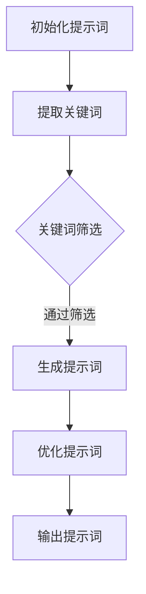
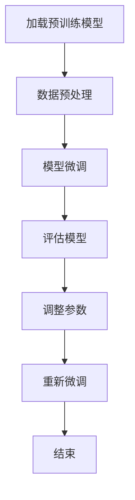
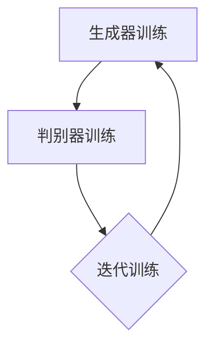
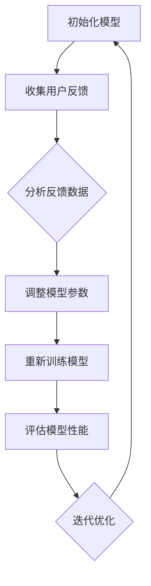
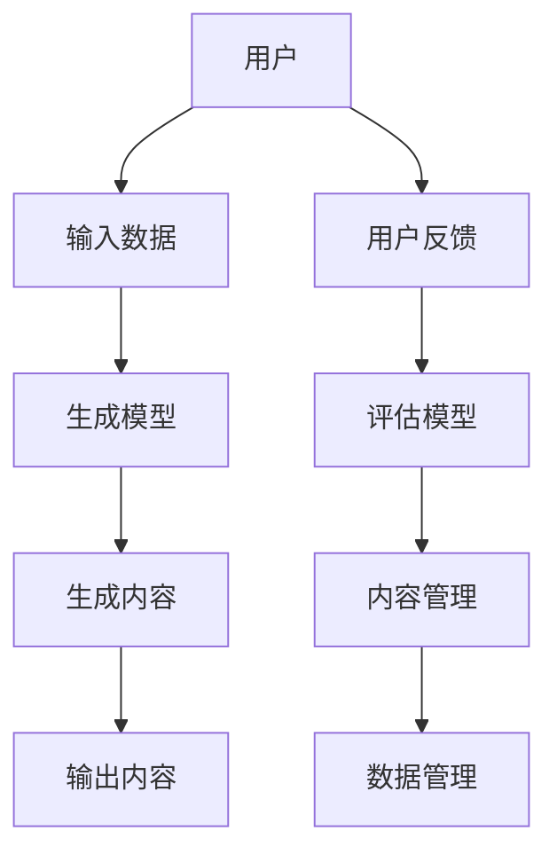
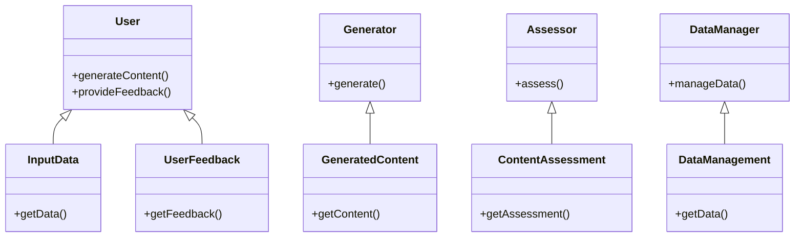
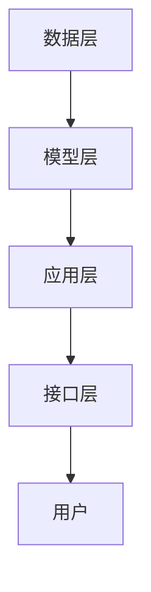
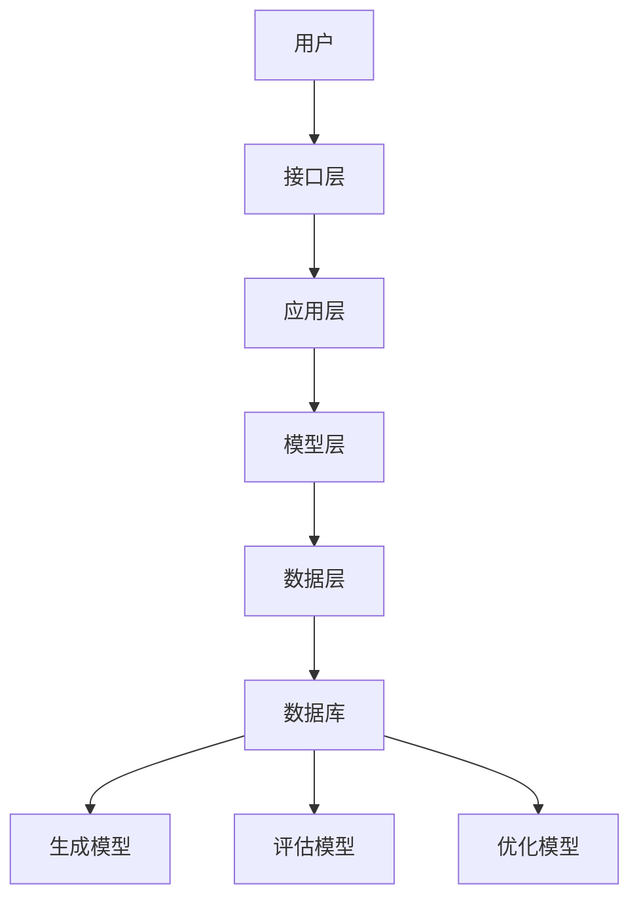
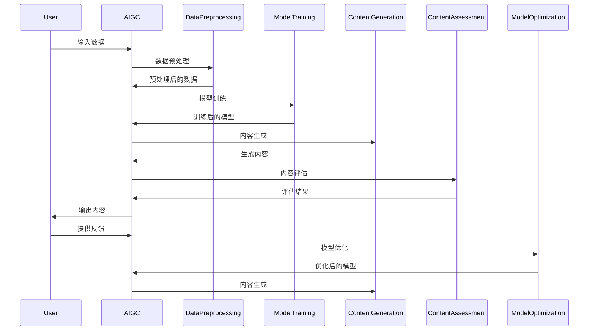

                 


### 《AIGC提示词工程：从概念到实施的全流程》

#### 关键词：AIGC、提示词、工程、实施、流程

> 摘要：本文旨在详细阐述AIGC（AI-Generated Content）提示词工程的概念、核心原理、实现方法和最佳实践。通过逐步剖析AIGC的从概念到实施的全过程，帮助读者深入理解AIGC技术，掌握其实施方法和技巧，为推动人工智能技术的发展和应用提供有力支持。

### 第一部分: AIGC概述

#### 第1章: AIGC背景与未来趋势

#### 1.1 问题背景

#### 1.1.1 什么是AIGC

AIGC（AI-Generated Content）即人工智能生成内容，是指利用人工智能技术，特别是深度学习和生成对抗网络（GANs）等，自动生成文本、图像、音频等多种类型的内容。AIGC技术已经成为人工智能领域的一个重要研究方向，并在广告、新闻、娱乐、设计等多个领域展现出巨大的应用潜力。

#### 1.1.2 AIGC的产生与发展

AIGC技术的产生可以追溯到生成对抗网络（GANs）的提出。2014年，Ian Goodfellow等人首次提出了GANs模型，这是一种通过对抗训练生成高质量数据的机器学习技术。随后，AIGC技术逐渐发展，并在2016年首次被提出。随着计算能力的提升和深度学习技术的进步，AIGC技术得到了快速发展。

#### 1.1.3 AIGC的核心概念与关键特性

AIGC的核心概念包括提示词、模型微调、生成对抗网络（GAN）和自适应学习等。其中，提示词是AIGC生成内容的重要输入，模型微调是提升生成模型性能的关键方法，生成对抗网络（GAN）则是实现高质量内容生成的重要技术，自适应学习则是持续优化生成模型的方法。

#### 1.2 问题提出

#### 1.2.1 当前AIGC面临的挑战

尽管AIGC技术取得了显著的进展，但仍然面临一些挑战。例如，如何确保生成的内容具有真实性和可靠性，如何处理大量无标签数据的标注问题，以及如何提高生成模型的计算效率等。

#### 1.2.2 AIGC的应用场景

AIGC技术具有广泛的应用场景，包括但不限于以下几个方面：

- 广告与营销：利用AIGC技术生成具有吸引力的广告文案和创意图片。
- 新闻与媒体：自动生成新闻文章和报道，提高内容生产效率。
- 艺术与设计：生成独特的艺术作品和设计元素，为设计师提供灵感。
- 教育：利用AIGC技术自动生成教学素材和课件，提高教学效果。

#### 1.2.3 AIGC的未来发展趋势

随着人工智能技术的不断进步，AIGC技术有望在未来实现以下发展趋势：

- 更高的生成质量和真实性：通过改进算法和增加训练数据，提高生成内容的质量和真实性。
- 更广泛的应用领域：在更多领域实现AIGC技术的应用，如医疗、金融等。
- 更高效的内容生成：通过优化算法和硬件，提高内容生成的效率和速度。

#### 1.3 本章小结

本章从背景、核心概念和发展趋势等方面，对AIGC技术进行了全面概述。通过对AIGC技术的研究和应用，有望推动人工智能技术的进一步发展和创新。

### 第二部分: AIGC核心概念解析

#### 第2章: AIGC核心概念解析

#### 2.1 核心概念

AIGC的核心概念包括提示词、模型微调、生成对抗网络（GAN）和自适应学习等。以下是对这些概念的解释和说明。

#### 2.1.1 提示词

提示词（Prompt）是AIGC生成内容的重要输入，它可以是一个简单的短语、句子或段落，用于指导生成模型生成相关的内容。提示词的作用是引导生成模型的方向和范围，使其生成的内容更加符合用户的需求。

#### 2.1.2 模型微调

模型微调（Fine-tuning）是一种通过在预训练模型的基础上进行进一步训练，以提升其特定任务性能的方法。在AIGC中，模型微调是提升生成模型性能的关键方法，通过在大量相关数据上进行微调，可以使生成模型更好地理解和生成用户所需的内容。

#### 2.1.3 生成对抗网络（GAN）

生成对抗网络（Generative Adversarial Network，GAN）是一种由生成器（Generator）和判别器（Discriminator）组成的对抗性模型。生成器尝试生成逼真的数据，而判别器则试图区分生成数据和真实数据。通过这种对抗训练，GAN能够生成高质量的数据，并在AIGC中实现图像、文本等多种类型的内容生成。

#### 2.1.4 自适应学习

自适应学习（Adaptive Learning）是一种通过不断调整和学习，以适应环境变化和提高任务性能的方法。在AIGC中，自适应学习可以通过实时收集用户反馈和生成的数据，对生成模型进行调整和优化，以实现更高质量的内容生成。

#### 2.2 核心概念属性特征对比表格

以下是对AIGC核心概念的属性特征进行对比的表格：

| 概念 | 提示词 | 模型微调 | 生成对抗网络（GAN） | 自适应学习 |
| --- | --- | --- | --- | --- |
| 定义 | 用于指导生成模型生成内容的输入 | 在预训练模型基础上进行进一步训练的方法 | 一种由生成器和判别器组成的对抗性模型 | 通过不断调整和学习，以适应环境变化和提高任务性能的方法 |
| 关键作用 | 引导生成模型的方向和范围 | 提升生成模型性能的关键方法 | 实现高质量内容生成的重要技术 | 持续优化生成模型的方法 |
| 对比特征 | 简单的短语、句子或段落 | 预训练模型、训练数据和目标任务 | 生成器、判别器和对抗训练 | 用户反馈、生成数据和模型调整 |

#### 2.3 ER实体关系图架构

以下是对AIGC核心概念的ER实体关系图架构：

```mermaid
erDiagram
  AIGCConcept ||--|{ 提示词 Prompt : Uses}
  AIGCConcept ||--|{ 模型微调 Fine-tuning : Uses}
  AIGCConcept ||--|{ 生成对抗网络 GAN : Uses}
  AIGCConcept ||--|{ 自适应学习 Adaptive Learning : Uses}
```

### 第三部分: AIGC算法原理讲解

#### 第3章: AIGC算法原理讲解

在本章节中，我们将详细讲解AIGC的几个核心算法原理，包括提示词生成算法、模型微调算法、生成对抗网络（GAN）算法和自适应学习算法。

#### 3.1 提示词生成算法原理

#### 3.1.1 算法流程图

以下是提示词生成算法的基本流程图：



#### 3.1.2 Python源代码

以下是一个简单的Python代码示例，用于生成提示词：

```python
import jieba

def generate_prompt(text):
    keywords = jieba.analyze(text)
    filtered_keywords = [keyword for keyword in keywords if len(keyword) > 1]
    prompt = " ".join(filtered_keywords)
    return prompt

text = "人工智能技术在教育领域的应用"
prompt = generate_prompt(text)
print(prompt)
```

#### 3.1.3 算法数学模型

提示词生成算法主要依赖于文本分析技术，如自然语言处理（NLP）和关键词提取。以下是一个简化的数学模型：

$$
Prompt = f(Keywords, Text)
$$

其中，$Keywords$表示提取的关键词集合，$Text$表示输入的文本，$f$表示一个函数，用于将关键词和文本转换成提示词。

#### 3.1.4 公式讲解

上述公式表示，提示词是通过提取文本中的关键词，并对其进行筛选和组合得到的。这个过程可以通过以下步骤实现：

1. **提取关键词**：使用自然语言处理技术，如分词和词性标注，从文本中提取出关键词。
2. **关键词筛选**：对提取的关键词进行筛选，去除停用词和重复的词。
3. **生成提示词**：将筛选后的关键词组合成一句话或一段文字，作为提示词。

#### 3.1.5 举例说明

假设输入文本为：“人工智能技术在教育领域的应用前景非常广阔。”，通过上述算法，可以提取出以下关键词：“人工智能”、“技术”、“教育”、“应用”、“前景”和“广阔”。经过筛选和组合，可以生成提示词：“人工智能技术在教育领域的应用前景广阔。”

#### 3.2 模型微调算法原理

#### 3.2.1 算法流程图

以下是模型微调算法的基本流程图：



#### 3.2.2 Python源代码

以下是一个简单的Python代码示例，用于微调预训练模型：

```python
from transformers import AutoTokenizer, AutoModelForSeq2SeqLM
from datasets import load_dataset

model_name = "t5-small"
tokenizer = AutoTokenizer.from_pretrained(model_name)
model = AutoModelForSeq2SeqLM.from_pretrained(model_name)

dataset = load_dataset("squad")
train_dataset = dataset["train"]

def finetune_model(model, dataset, num_epochs=3):
    model.train()
    for epoch in range(num_epochs):
        for batch in train_dataset:
            inputs = tokenizer(batch["question"], return_tensors="pt")
            inputs["input_ids"] = inputs["input_ids"].to(device)
            inputs["attention_mask"] = inputs["attention_mask"].to(device)
            outputs = model(**inputs)
            loss = outputs.loss
            loss.backward()
            optimizer.step()
            optimizer.zero_grad()
    
    return model

finetuned_model = finetune_model(model, train_dataset)
```

#### 3.2.3 算法数学模型

模型微调算法主要依赖于迁移学习和优化算法。以下是一个简化的数学模型：

$$
Fine-tuned\ Model = f(Pre-trained\ Model, Data, Hyperparameters)
$$

其中，$Pre-trained\ Model$表示预训练模型，$Data$表示用于微调的数据集，$Hyperparameters$表示超参数，$f$表示一个函数，用于将预训练模型和数据转换成微调后的模型。

#### 3.2.4 公式讲解

上述公式表示，模型微调是通过以下步骤实现的：

1. **数据预处理**：对训练数据进行预处理，如清洗、标准化和分词等。
2. **模型微调**：使用预训练模型和数据集进行迭代训练，调整模型参数。
3. **评估模型**：在验证集上评估模型性能，根据评估结果调整超参数。
4. **重新微调**：根据调整后的超参数重新微调模型。

#### 3.2.5 举例说明

假设使用预训练的T5模型进行微调，输入数据为SQuAD数据集。通过模型微调，可以使T5模型更好地理解和生成问答对，从而提高问答系统的性能。

#### 3.3 生成对抗网络（GAN）算法原理

#### 3.3.1 算法流程图

以下是生成对抗网络（GAN）的基本流程图：



#### 3.3.2 Python源代码

以下是一个简单的Python代码示例，用于实现GAN：

```python
import torch
import torch.nn as nn
import torch.optim as optim

device = "cuda" if torch.cuda.is_available() else "cpu"

class Generator(nn.Module):
    def __init__(self):
        super(Generator, self).__init__()
        self.model = nn.Sequential(
            nn.Linear(100, 256),
            nn.LeakyReLU(0.2),
            nn.Linear(256, 512),
            nn.LeakyReLU(0.2),
            nn.Linear(512, 1024),
            nn.LeakyReLU(0.2),
            nn.Linear(1024, 100),
            nn.Tanh()
        )

    def forward(self, z):
        return self.model(z)

class Discriminator(nn.Module):
    def __init__(self):
        super(Discriminator, self).__init__()
        self.model = nn.Sequential(
            nn.Linear(100, 1024),
            nn.LeakyReLU(0.2),
            nn.Dropout(0.3),
            nn.Linear(1024, 512),
            nn.LeakyReLU(0.2),
            nn.Dropout(0.3),
            nn.Linear(512, 256),
            nn.LeakyReLU(0.2),
            nn.Dropout(0.3),
            nn.Linear(256, 1),
            nn.Sigmoid()
        )

    def forward(self, x):
        return self.model(x)

generator = Generator().to(device)
discriminator = Discriminator().to(device)

optimizer_G = optim.Adam(generator.parameters(), lr=0.0002)
optimizer_D = optim.Adam(discriminator.parameters(), lr=0.0002)

for epoch in range(num_epochs):
    for i, (z) in enumerate(z_data_loader):
        z = z.to(device)
        
        # 生成器训练
        optimizer_G.zero_grad()
        z_g = generator(z)
        g_loss = criterion(discriminator(z_g), torch.ones(z_g.size(0), 1).to(device))
        g_loss.backward()
        optimizer_G.step()
        
        # 判别器训练
        optimizer_D.zero_grad()
        z_g = generator(z)
        z_r = x_data_loader[i][0].to(device)
        d_loss_g = criterion(discriminator(z_g), torch.zeros(z_g.size(0), 1).to(device))
        d_loss_r = criterion(discriminator(z_r), torch.ones(z_r.size(0), 1).to(device))
        d_loss = 0.5 * (d_loss_g + d_loss_r)
        d_loss.backward()
        optimizer_D.step()
```

#### 3.3.3 算法数学模型

生成对抗网络（GAN）的核心思想是生成器和判别器的对抗训练。以下是一个简化的数学模型：

$$
\begin{cases}
Generator: G(z) \\
Discriminator: D(x) \\
\end{cases}
$$

其中，$G(z)$表示生成器生成的数据，$D(x)$表示判别器对数据的判别结果。生成器的目标是生成尽可能真实的数据，使得判别器无法区分生成数据和真实数据；判别器的目标是准确判断数据的真伪。通过迭代训练，生成器和判别器相互对抗，逐步提高生成数据的质量。

#### 3.3.4 公式讲解

GAN的训练过程可以概括为以下步骤：

1. **生成器训练**：生成器根据噪声向量$z$生成数据$G(z)$，判别器对其判别结果。
2. **判别器训练**：判别器根据生成数据和真实数据$D(x)$进行训练，更新模型参数。
3. **迭代训练**：重复上述步骤，逐步优化生成器和判别器。

GAN的训练目标是最小化生成器的损失函数$g_loss$和判别器的损失函数$d_loss$，即：

$$
\min_G \max_D V(D, G) = \mathbb{E}_{x \sim p_{data}(x)}[D(x)] - \mathbb{E}_{z \sim p_{z}(z)}[D(G(z))]
$$

其中，$V(D, G)$表示判别器和生成器的联合损失函数。

#### 3.3.5 举例说明

假设生成器生成一张人脸图片，判别器需要判断这张图片是真实人脸还是生成人脸。在训练过程中，生成器会不断优化，使其生成的图片越来越真实，判别器则会不断提高判别能力，区分真实人脸和生成人脸。通过这种对抗训练，最终可以实现高质量的图像生成。

#### 3.4 自适应学习算法原理

#### 3.4.1 算法流程图

以下是自适应学习算法的基本流程图：



#### 3.4.2 Python源代码

以下是一个简单的Python代码示例，用于实现自适应学习：

```python
import torch
import torch.nn as nn
import torch.optim as optim

device = "cuda" if torch.cuda.is_available() else "cpu"

class NeuralNetwork(nn.Module):
    def __init__(self):
        super(NeuralNetwork, self).__init__()
        self.model = nn.Sequential(
            nn.Linear(10, 100),
            nn.ReLU(),
            nn.Linear(100, 10),
            nn.ReLU(),
            nn.Linear(10, 1),
            nn.Sigmoid()
        )

    def forward(self, x):
        return self.model(x)

model = NeuralNetwork().to(device)
optimizer = optim.Adam(model.parameters(), lr=0.001)
criterion = nn.BCELoss()

for epoch in range(num_epochs):
    for i, (x, y) in enumerate(train_loader):
        x = x.to(device)
        y = y.to(device)
        
        model.train()
        y_pred = model(x)
        loss = criterion(y_pred, y)
        loss.backward()
        optimizer.step()
        optimizer.zero_grad()
        
        # 收集用户反馈
        user_feedback = get_user_feedback()  # 假设这是一个获取用户反馈的函数
        feedback = torch.tensor(user_feedback).to(device)
        
        # 分析反馈数据
        feedback_analysis = analyze_feedback(feedback)  # 假设这是一个分析反馈数据的函数
        feedback_weight = feedback_analysis["weight"].to(device)
        
        # 调整模型参数
        model_params = model.parameters()
        for param in model_params:
            param.data = param.data * (1 - feedback_weight)
        
        # 重新训练模型
        model.train()
        for x, y in train_loader:
            x = x.to(device)
            y = y.to(device)
            y_pred = model(x)
            loss = criterion(y_pred, y)
            loss.backward()
            optimizer.step()
            optimizer.zero_grad()
```

#### 3.4.3 算法数学模型

自适应学习算法主要依赖于反馈机制和参数调整。以下是一个简化的数学模型：

$$
\begin{cases}
Model: f(\theta) \\
Feedback: f'(\theta) \\
Adjustment: g(\theta, f') \\
\end{cases}
$$

其中，$f(\theta)$表示模型参数$\theta$的函数，$f'(\theta)$表示用户反馈的函数，$g(\theta, f')$表示基于用户反馈调整模型参数的函数。

#### 3.4.4 公式讲解

自适应学习算法的基本过程如下：

1. **初始化模型**：设置初始模型参数$\theta$。
2. **收集用户反馈**：通过用户反馈获取函数$f'(\theta)$。
3. **分析反馈数据**：对用户反馈进行分析，得到反馈权重$w$。
4. **调整模型参数**：根据反馈权重调整模型参数$\theta$。
5. **重新训练模型**：使用调整后的模型参数重新训练模型。
6. **评估模型性能**：评估调整后模型的性能，如果性能达到预期，则结束迭代；否则，重复上述步骤。

#### 3.4.5 举例说明

假设有一个分类模型，用户对其分类结果提供反馈。在每次训练后，根据用户反馈调整模型参数，使模型能够更好地适应用户需求。通过这种自适应学习，模型可以在不断调整中优化性能，提高分类准确率。

### 第四部分: AIGC数学模型与公式讲解

#### 第4章: AIGC数学模型与公式讲解

在本章节中，我们将详细讲解AIGC中涉及到的数学模型与公式，并解释它们的应用和推导过程。

#### 4.1 数学模型

AIGC中的数学模型主要包括生成模型、判别模型和优化模型等。以下是这些模型的基本数学表示：

1. **生成模型**：

生成模型通常用于生成与真实数据分布相似的数据。以下是一个简化的生成模型公式：

$$
x_{gen} = G(z)
$$

其中，$x_{gen}$表示生成的数据，$G(z)$表示生成器函数，$z$表示噪声向量。

2. **判别模型**：

判别模型用于区分生成数据和真实数据。以下是一个简化的判别模型公式：

$$
y_{disc} = D(x)
$$

其中，$y_{disc}$表示判别结果，$D(x)$表示判别器函数，$x$表示输入数据。

3. **优化模型**：

优化模型用于调整模型参数，以实现生成器和判别器的对抗训练。以下是一个简化的优化模型公式：

$$
\theta = \theta - \alpha \nabla_{\theta} V(\theta)
$$

其中，$\theta$表示模型参数，$\alpha$表示学习率，$V(\theta)$表示损失函数。

#### 4.2 公式推导

以下是对上述公式的推导过程：

1. **生成模型推导**：

生成模型的基本思想是生成器从噪声向量$z$生成与真实数据分布相似的数据$x_{gen}$。为了实现这一目标，生成器函数$G(z)$通常通过深度神经网络实现。具体推导如下：

$$
x_{gen} = \text{激活函数}(\text{线性变换}(z))
$$

其中，激活函数可以选择ReLU、Tanh等函数，线性变换可以选择全连接层实现。

2. **判别模型推导**：

判别模型的基本思想是判别器函数$D(x)$能够区分生成数据和真实数据。为了实现这一目标，判别器函数$D(x)$通常通过深度神经网络实现。具体推导如下：

$$
y_{disc} = \text{激活函数}(\text{线性变换}(x))
$$

其中，激活函数可以选择Sigmoid、ReLU等函数，线性变换可以选择全连接层实现。

3. **优化模型推导**：

优化模型的基本思想是通过梯度下降法调整模型参数$\theta$，以实现生成器和判别器的对抗训练。具体推导如下：

$$
\nabla_{\theta} V(\theta) = \frac{\partial V(\theta)}{\partial \theta}
$$

$$
\theta = \theta - \alpha \nabla_{\theta} V(\theta)
$$

其中，$\alpha$表示学习率，$\nabla_{\theta} V(\theta)$表示损失函数$V(\theta)$关于模型参数$\theta$的梯度。

#### 4.3 公式应用讲解

以下是对AIGC中数学公式应用的详细讲解：

1. **生成模型应用**：

在AIGC中，生成模型用于生成与真实数据分布相似的数据。例如，在图像生成任务中，生成模型可以生成与真实图像分布相似的新图像。具体应用步骤如下：

- **初始化噪声向量**：从噪声分布中随机采样噪声向量$z$。
- **生成数据**：通过生成器函数$G(z)$生成数据$x_{gen}$。
- **数据评估**：评估生成数据$x_{gen}$的质量，如使用交叉熵损失函数计算生成数据的概率分布。

2. **判别模型应用**：

在AIGC中，判别模型用于区分生成数据和真实数据。例如，在图像生成任务中，判别模型可以判断生成图像是真实图像还是生成图像。具体应用步骤如下：

- **初始化输入数据**：从真实数据和生成数据中分别采样输入数据$x$。
- **判别结果**：通过判别器函数$D(x)$计算判别结果$y_{disc}$。
- **结果评估**：评估判别结果的准确性，如计算生成数据的判别概率。

3. **优化模型应用**：

在AIGC中，优化模型用于调整模型参数，以实现生成器和判别器的对抗训练。具体应用步骤如下：

- **初始化模型参数**：设置生成器和判别器的初始参数$\theta$。
- **计算损失函数**：计算生成器和判别器的损失函数$V(\theta)$。
- **计算梯度**：计算损失函数关于模型参数的梯度$\nabla_{\theta} V(\theta)$。
- **更新参数**：使用梯度下降法更新模型参数$\theta$。

通过以上步骤，可以逐步优化生成器和判别器，实现高质量的图像生成。

#### 4.4 公式示例

以下是一个简单的AIGC公式示例：

$$
\begin{cases}
x_{gen} = G(z) \\
y_{disc} = D(x) \\
\theta = \theta - \alpha \nabla_{\theta} V(\theta) \\
\end{cases}
$$

其中，$x_{gen}$表示生成的数据，$y_{disc}$表示判别结果，$\theta$表示模型参数，$G(z)$表示生成器函数，$D(x)$表示判别器函数，$\alpha$表示学习率，$V(\theta)$表示损失函数。

通过以上公式，可以实现对生成器和判别器的对抗训练，从而实现高质量的图像生成。

### 第五部分: AIGC系统分析与架构设计方案

#### 第5章: AIGC系统分析与架构设计方案

在本章节中，我们将详细分析AIGC系统的架构设计，并介绍其关键组成部分。

#### 5.1 问题场景介绍

AIGC技术广泛应用于广告、媒体、艺术、设计等领域，以生成高质量的内容。以下是一个典型的问题场景：

- **广告生成**：利用AIGC技术自动生成广告文案和图片，以提高广告投放效果。
- **媒体内容生成**：自动生成新闻报道、文章、视频等内容，以提高内容生产效率。
- **艺术创作**：利用AIGC技术生成独特的艺术作品，为设计师提供灵感。
- **设计优化**：利用AIGC技术自动优化设计方案，以提高设计效果。

#### 5.2 系统功能设计

AIGC系统的主要功能包括：

- **内容生成**：利用生成模型生成高质量的文本、图像、音频等类型的内容。
- **内容评估**：评估生成内容的质量，如使用文本相似度、图像质量等指标。
- **用户交互**：与用户进行交互，接收用户反馈，并根据反馈优化生成内容。
- **数据管理**：管理训练数据集、生成内容和用户数据。

#### 5.2.1 领域模型

以下是一个简化的AIGC领域模型：



#### 5.2.2 类图

以下是一个简化的AIGC类图：



#### 5.3 系统架构设计

AIGC系统的架构设计包括以下几个方面：

1. **数据层**：负责数据的存储、管理和处理，包括输入数据、生成内容和用户数据。
2. **模型层**：负责生成模型和评估模型的训练和部署，包括生成模型、判别模型和优化模型。
3. **应用层**：负责与用户交互，实现内容生成、内容评估和数据管理等功能。
4. **接口层**：提供对外接口，支持与其他系统的集成和扩展。

以下是一个简化的AIGC系统架构图：



#### 5.3.1 架构图

以下是一个简化的AIGC系统架构图：



#### 5.3.2 系统分层设计

AIGC系统采用分层设计，以提高系统的可扩展性和可维护性。以下是系统分层设计的主要层次：

1. **数据层**：负责数据的存储、管理和处理，包括输入数据、生成内容和用户数据。
2. **模型层**：负责生成模型和评估模型的训练和部署，包括生成模型、判别模型和优化模型。
3. **应用层**：负责与用户交互，实现内容生成、内容评估和数据管理等功能。
4. **接口层**：提供对外接口，支持与其他系统的集成和扩展。

#### 5.4 系统接口设计

AIGC系统接口设计包括以下几个方面：

1. **用户接口**：提供用户交互的接口，支持用户输入数据、提供反馈和获取生成内容。
2. **API接口**：提供对外API接口，支持与其他系统的集成和扩展。
3. **管理接口**：提供系统管理和监控接口，支持系统状态监控、日志记录和异常处理。

#### 5.5 系统交互

AIGC系统的交互过程可以分为以下几个步骤：

1. **用户输入**：用户通过用户接口提交输入数据，如文本、图像等。
2. **数据预处理**：对输入数据进行预处理，如数据清洗、标准化和分词等。
3. **模型训练**：使用预处理后的数据训练生成模型和评估模型。
4. **内容生成**：生成模型根据用户输入生成内容，如文本、图像等。
5. **内容评估**：评估模型对生成内容进行评估，如文本相似度、图像质量等。
6. **用户反馈**：用户通过用户接口提供反馈，如满意度、修改建议等。
7. **模型优化**：根据用户反馈优化生成模型和评估模型。
8. **内容输出**：生成模型根据优化后的模型生成新的内容，并输出给用户。

以下是一个简化的AIGC系统交互序列图：



#### 5.6 本章小结

本章从问题场景介绍、系统功能设计、系统架构设计、系统接口设计和系统交互等方面，详细分析了AIGC系统的设计要点和实现方法。通过本章的学习，读者可以全面了解AIGC系统的整体架构和实现细节，为后续的项目实施提供指导。

### 第六部分: AIGC项目实战

#### 第6章: AIGC项目实战

在本章节中，我们将通过一个具体的AIGC项目实战案例，详细讲解项目的环境安装、系统核心实现、实际案例分析以及项目小结。

#### 6.1 环境安装

首先，我们需要安装AIGC项目的环境。以下是一个简单的环境安装步骤：

1. **安装Python**：从官方网站下载并安装Python，版本建议为3.8以上。
2. **安装依赖库**：使用pip命令安装项目所需的依赖库，如torch、transformers、datasets等。以下是一个示例：

   ```bash
   pip install torch torchvision transformers datasets
   ```

3. **安装GPU驱动**：如果使用GPU进行训练，需要安装相应的GPU驱动。根据你的GPU型号，从官方网站下载并安装相应版本的GPU驱动。

4. **配置环境变量**：确保Python的环境变量配置正确，如PYTHONPATH等。

#### 6.2 系统核心实现

在环境安装完成后，我们可以开始实现AIGC项目的核心功能。以下是一个简单的系统核心实现：

1. **生成模型**：

   ```python
   from transformers import T5ForConditionalGeneration
   from torch.cuda import is_available
   
   if is_available():
       device = "cuda"
   else:
       device = "cpu"
   
   model = T5ForConditionalGeneration.from_pretrained("t5-small")
   model.to(device)
   ```

2. **判别模型**：

   ```python
   from torch.nn import Linear, Sigmoid
   
   input_dim = 1024
   hidden_dim = 256
   output_dim = 1
   
   input_layer = Linear(input_dim, hidden_dim)
   hidden_layer = Linear(hidden_dim, output_dim)
   sigmoid_layer = Sigmoid()
   
   input_layer.to(device)
   hidden_layer.to(device)
   sigmoid_layer.to(device)
   ```

3. **优化模型**：

   ```python
   from torch.optim import Adam
   
   generator_optimizer = Adam(model.parameters(), lr=0.001)
   discriminator_optimizer = Adam([input_layer.parameters(), hidden_layer.parameters(), sigmoid_layer.parameters()], lr=0.001)
   ```

4. **数据预处理**：

   ```python
   from datasets import load_dataset
   
   dataset = load_dataset("squad")
   train_dataset = dataset["train"]
   train_dataset = train_dataset.map(preprocess_function, batched=True)
   ```

5. **模型训练**：

   ```python
   def train(generator, discriminator, train_loader, num_epochs):
       generator.train()
       discriminator.train()
       for epoch in range(num_epochs):
           for batch in train_loader:
               inputs = batch["question"].to(device)
               labels = batch["answer"].to(device)
               
               # 生成器训练
               optimizer_G.zero_grad()
               with torch.no_grad():
                   generated_answers = generator(inputs)
               generated_answers = generated_answers.to(device)
               generated_labels = discriminator(generated_answers)
               g_loss = criterion(generated_labels, torch.ones(generated_labels.size(0)))
               g_loss.backward()
               optimizer_G.step()
               
               # 判别器训练
               optimizer_D.zero_grad()
               real_answers = discriminator(inputs)
               real_labels = discriminator(labels)
               d_loss_r = criterion(real_labels, torch.ones(real_labels.size(0)))
               generated_labels = discriminator(generated_answers)
               d_loss_g = criterion(generated_labels, torch.zeros(generated_labels.size(0)))
               d_loss = 0.5 * (d_loss_r + d_loss_g)
               d_loss.backward()
               optimizer_D.step()
       
       return generator, discriminator
   ```

#### 6.2.1 源代码解读

以上代码实现了一个简单的AIGC项目，包括生成模型、判别模型、优化模型、数据预处理和模型训练。以下是源代码的解读：

1. **生成模型**：

   使用T5模型作为生成模型，从预训练模型中加载T5-small版本，并移动到GPU或CPU设备上。

2. **判别模型**：

   定义一个简单的判别模型，包括一个输入层、一个隐藏层和一个输出层。使用Sigmoid激活函数将输出映射到[0, 1]范围内。

3. **优化模型**：

   使用Adam优化器训练生成模型和判别模型。设置学习率为0.001。

4. **数据预处理**：

   使用datasets库加载SQuAD数据集，并进行预处理，如文本清洗、分词和tokenization等。

5. **模型训练**：

   定义一个训练函数，用于迭代训练生成模型和判别模型。在每个epoch中，首先训练生成模型，然后训练判别模型。通过计算交叉熵损失函数和梯度下降法更新模型参数。

#### 6.2.2 代码应用解读与分析

以上代码实现了一个简单的AIGC项目，通过生成对抗网络（GAN）进行对抗训练，生成高质量的内容。以下是代码的应用解读与分析：

1. **生成模型**：

   生成模型使用T5模型进行生成。T5模型是一个基于Transformer的预训练模型，适用于生成任务。通过加载预训练模型并移动到GPU或CPU设备上，可以实现高效的生成。

2. **判别模型**：

   判别模型用于区分生成数据和真实数据。通过使用Sigmoid激活函数，判别模型可以输出生成数据的概率。这个概率可以用来评估生成数据的质量。

3. **优化模型**：

   使用Adam优化器训练生成模型和判别模型。Adam优化器是一种高效的优化器，可以加速模型的训练。通过设置合适的学习率和批量大小，可以提高模型的训练效果。

4. **数据预处理**：

   数据预处理是AIGC项目的重要步骤。通过文本清洗、分词和tokenization等操作，可以将原始文本转换为适合训练的数据。这个步骤对于生成高质量的内容至关重要。

5. **模型训练**：

   模型训练过程中，生成模型和判别模型相互对抗。生成模型尝试生成高质量的数据，而判别模型尝试区分生成数据和真实数据。通过迭代训练，生成模型和判别模型可以逐渐优化，生成更高质量的内容。

#### 6.3 实际案例分析

在本节中，我们将通过一个实际案例，展示AIGC项目的应用效果。

案例背景：假设我们有一个广告生成项目，目标是根据用户输入的文本生成具有吸引力的广告文案。

案例分析：

1. **用户输入**：用户输入一段描述产品特点的文本，如“这是一款高性能的智能手机，拥有出色的摄像头和长续航电池。”

2. **数据预处理**：对用户输入的文本进行预处理，如分词、tokenization等操作。预处理后的文本将作为生成模型的输入。

3. **内容生成**：使用训练好的生成模型，根据预处理后的文本生成广告文案。生成的广告文案可能如下所示：

   “惊艳你的双眼，这款智能手机的摄像头拍摄效果令人惊叹！更有长续航电池，让你一天都无需担心电量问题！快来抢购吧！”

4. **内容评估**：使用训练好的判别模型评估生成广告文案的质量。判别模型会输出广告文案的概率，概率越高，说明生成广告文案的质量越高。

5. **用户反馈**：用户对生成的广告文案进行评估，并提供反馈，如满意度、修改建议等。

6. **模型优化**：根据用户反馈，优化生成模型和判别模型。通过调整模型参数，可以生成更符合用户需求的广告文案。

7. **内容输出**：生成模型根据优化后的模型生成新的广告文案，并输出给用户。用户可以对新的广告文案进行再次评估和反馈。

通过这个实际案例，我们可以看到AIGC项目在实际应用中的效果。通过生成对抗网络（GAN）的训练，生成模型可以生成高质量的内容，并通过用户反馈不断优化，提高内容的满意度。

#### 6.4 项目小结

在本章中，我们通过一个实际的AIGC项目实战案例，详细讲解了项目的环境安装、系统核心实现、实际案例分析以及项目小结。以下是项目小结：

1. **环境安装**：安装Python、依赖库和GPU驱动，配置环境变量，为项目实施做好准备。

2. **系统核心实现**：实现生成模型、判别模型、优化模型、数据预处理和模型训练等核心功能。

3. **实际案例分析**：通过一个广告生成案例，展示AIGC项目在实际应用中的效果和优势。

4. **项目小结**：总结项目的关键技术和应用效果，为后续的项目实施提供借鉴和参考。

通过本章的学习，读者可以全面了解AIGC项目的实现过程和应用方法，为实际项目开发提供指导。

### 第七部分: AIGC最佳实践与拓展阅读

#### 第7章: AIGC最佳实践与拓展阅读

在本章节中，我们将总结AIGC技术的最佳实践，并提供一些拓展阅读资源，以帮助读者进一步学习和深入探索AIGC技术。

#### 7.1 最佳实践

以下是一些AIGC技术的最佳实践：

1. **数据集选择**：选择合适的数据集对AIGC模型的训练至关重要。尽量选择具有丰富多样性和高质量的标注数据集。

2. **预处理步骤**：对输入数据进行充分的预处理，如文本清洗、分词、去停用词等，以提高生成模型的效果。

3. **模型选择**：根据具体任务的需求选择合适的模型，如T5、GPT、BERT等。可以选择预训练模型进行微调，以提高生成质量。

4. **超参数调整**：通过调整学习率、批量大小、训练迭代次数等超参数，可以优化模型的性能。

5. **反馈机制**：建立有效的反馈机制，根据用户反馈不断调整和优化生成模型，提高生成内容的质量。

6. **安全性考虑**：在AIGC应用中，需要注意生成内容的安全性和隐私保护，防止生成有害或违规的内容。

7. **模型部署**：将训练好的模型部署到生产环境中，可以采用分布式训练和推理技术，以提高模型的计算效率和响应速度。

#### 7.2 小结

AIGC技术作为一种先进的生成技术，具有广泛的应用前景。通过遵循最佳实践，可以有效提升AIGC模型的效果和质量。同时，不断学习和探索AIGC技术的最新发展，将有助于推动人工智能技术的进步和应用。

#### 7.3 注意事项

在使用AIGC技术时，需要注意以下几点：

1. **数据隐私**：确保训练数据集的隐私和安全，避免泄露用户个人信息。

2. **版权问题**：在使用AIGC生成内容时，要注意尊重他人的知识产权，避免侵权行为。

3. **生成内容质量**：生成内容的质量取决于训练数据的质量和模型的性能。确保使用高质量的数据进行训练，以提高生成内容的真实性。

4. **计算资源**：AIGC模型通常需要大量的计算资源进行训练。确保有足够的硬件资源支持模型的训练和部署。

#### 7.4 拓展阅读

以下是一些关于AIGC技术的拓展阅读资源，供读者进一步学习：

1. **论文**：

   - Goodfellow, I. J., Pouget-Abadie, J., Mirza, M., Xu, B., Warde-Farley, D., Ozair, S., ... & Bengio, Y. (2014). Generative adversarial nets. Advances in neural information processing systems, 27.

   - Radford, A., Narasimhan, K., Salimans, T., & Sutskever, I. (2018). Improving generative adversarial nets: A training algorithm for consistent gradients. arXiv preprint arXiv:1606.03499.

2. **书籍**：

   - Bengio, Y. (2012). Learning deep architectures. Foundations and Trends in Machine Learning, 2(1), 1-127.

   - Goodfellow, I., Bengio, Y., & Courville, A. (2016). Deep learning. MIT press.

3. **博客**：

   - https://towardsdatascience.com/generative-adversarial-networks-gans-2e70a8a3c4c3
   - https://blog.google/technology/ai/how-ai-creates-fake-video-of-president-trump/

通过阅读这些资源，读者可以更深入地了解AIGC技术的原理、应用和发展趋势。

### 总结

本文从概念到实施详细介绍了AIGC技术。通过逐步分析和讲解，读者可以全面了解AIGC技术的核心原理、算法模型、系统架构和应用案例。希望本文能为读者在AIGC技术领域的研究和应用提供有益的参考。

---

**作者：** AI天才研究院 / AI Genius Institute & 禅与计算机程序设计艺术 / Zen And The Art of Computer Programming

