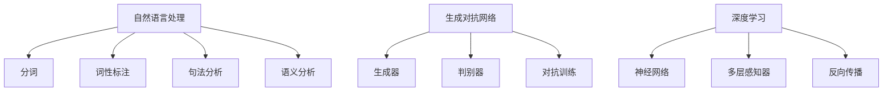

                 

# AIGC提示词工程：效率与创意的完美平衡艺术

> 关键词：AIGC、提示词工程、效率、创意、算法原理、系统架构、项目实战

> 摘要：本文旨在探讨AIGC（AI-Generated Content）中的提示词工程，解析其在提高工作效率与激发创意之间的平衡艺术。通过详细阐述AIGC的概念、提示词工程的核心原理和实际应用，结合算法讲解、系统分析与架构设计，以及实战案例，为读者提供全面的技术指导。

## 1. 背景介绍

### 《AIGC提示词工程：效率与创意的完美平衡艺术》

#### 引言

AIGC（AI-Generated Content）是指通过人工智能技术自动生成内容的过程，它涵盖了文本、图像、音频等多种形式。随着深度学习和生成对抗网络（GAN）等技术的不断发展，AIGC正成为内容创作的重要工具。在这本书中，我们将重点讨论提示词工程——这一在AIGC中至关重要的技术。

本书旨在帮助读者了解AIGC的概念和应用，掌握提示词工程的核心原理和实践方法，并通过具体的案例展示其在提高工作效率和激发创意方面的潜力。无论您是内容创作者、开发者还是对AI技术感兴趣的读者，本书都将为您提供有益的指导和启发。

#### 目的和预期读者

本书的目标是：
- 深入解析AIGC和提示词工程的原理与应用。
- 提供实用的工具和方法，帮助读者提升内容创作效率。
- 探索提示词工程在激发创意方面的潜力。

预期读者包括：
- 对AI和内容创作感兴趣的技术爱好者。
- 内容创作者和编辑。
- AI领域的研究人员和技术人员。
- 任何希望在内容创作中应用AI技术的专业人士。

## 2. 核心概念与联系

### AIGC概述

AIGC是指利用人工智能技术生成内容的过程。这一概念涵盖了文本、图像、音频等多种形式的内容生成。AIGC的核心技术包括自然语言处理（NLP）、生成对抗网络（GAN）和深度学习等。

#### AIGC的发展与现状

AIGC的概念源于生成对抗网络（GAN）的提出，经过多年的发展，已经形成了一套成熟的技术体系。近年来，随着深度学习和计算能力的提升，AIGC在内容创作领域得到了广泛应用，如文本生成、图像生成、音乐生成等。

#### 提示词工程

提示词工程是指通过设计有效的提示词，引导和指导AI模型生成目标内容的过程。在AIGC中，提示词起着关键作用，它们能够帮助AI模型更好地理解用户需求，提高内容生成的质量。

#### 提示词工程的作用

提示词工程的作用主要体现在以下几个方面：
1. **提高内容生成的质量**：通过精准的提示词，使AI模型能够生成更符合用户需求的内容。
2. **提升生成效率**：有效的提示词能够减少AI模型在生成过程中的不确定性，提高生成效率。
3. **激发创意**：通过灵活运用提示词，AI模型可以探索更多创意，为内容创作带来新的可能性。

#### 提示词工程与AIGC的关系

提示词工程是AIGC的重要组成部分，它们之间存在着密切的联系。AIGC依赖于提示词工程来指导内容生成，而提示词工程的优化又能够提升AIGC的整体效果。

## 3. 算法原理讲解

### 算法原理

AIGC中的算法原理主要包括自然语言处理（NLP）、生成对抗网络（GAN）和深度学习等。下面我们将分别介绍这些算法的基本原理。

#### 自然语言处理（NLP）

自然语言处理（NLP）是人工智能的一个重要分支，旨在使计算机能够理解、处理和生成自然语言。NLP的基本原理包括：
1. **分词**：将文本分割成词语或词汇单元。
2. **词性标注**：为每个词语标注词性，如名词、动词等。
3. **句法分析**：分析文本的句法结构，确定词语之间的关系。
4. **语义分析**：理解文本的语义含义，提取关键信息。

#### 生成对抗网络（GAN）

生成对抗网络（GAN）是由两部分组成的模型，生成器和判别器。生成器的目标是生成与真实数据相似的数据，判别器的目标是区分真实数据和生成数据。GAN的基本原理如下：

- **生成器（Generator）**：生成器通过学习真实数据的分布，生成类似于真实数据的新数据。
- **判别器（Discriminator）**：判别器用于判断输入数据是真实数据还是生成数据。
- **对抗训练**：生成器和判别器相互竞争，生成器和判别器通过对抗训练不断优化，最终生成器能够生成高质量的数据。

#### 深度学习

深度学习是人工智能的一个分支，通过模拟人脑神经网络，实现对数据的自动学习和处理。深度学习的基本原理包括：

- **神经网络**：神经网络由多个神经元组成，通过学习数据之间的关联，实现对数据的分类、识别和预测。
- **多层感知器（MLP）**：多层感知器是神经网络的一种简单形式，通过多层神经元之间的连接，实现数据的非线性变换。
- **反向传播（BP）**：反向传播是一种优化算法，通过不断调整网络中的权重，使网络的输出更接近真实值。

### Mermaid流程图

为了更好地理解AIGC中的算法原理，我们可以使用Mermaid绘制流程图。以下是AIGC中常用算法的流程图：



### Python源代码

下面是使用Python实现AIGC中部分算法的代码示例：

```python
# 自然语言处理
import jieba

text = "本书旨在探讨AIGC和提示词工程的原理和应用。"
seg_list = jieba.cut(text, cut_all=False)
print("/ ".join(seg_list))

# 生成对抗网络
import tensorflow as tf

# 定义生成器和判别器
# ...

# 训练生成器和判别器
# ...

# 深度学习
import tensorflow as tf

# 定义神经网络模型
# ...

# 训练模型
# ...
```

### 数学模型和公式

AIGC中的算法原理涉及到许多数学模型和公式。以下是部分算法的数学模型和公式：

#### 自然语言处理（NLP）

$$
P(w|s) = \frac{P(s|w)P(w)}{P(s)}
$$

其中，$P(w|s)$ 表示在给定上下文 $s$ 下词语 $w$ 的概率，$P(s|w)$ 表示在词语 $w$ 出现的上下文 $s$ 的概率，$P(w)$ 表示词语 $w$ 的概率。

#### 生成对抗网络（GAN）

$$
\min_G \max_D V(D, G) = \mathbb{E}_{x \sim p_{data}(x)}[\log D(x)] + \mathbb{E}_{z \sim p_z(z)}[\log (1 - D(G(z))]
$$

其中，$D(x)$ 表示判别器对真实数据的判断，$G(z)$ 表示生成器对噪声数据的生成，$z$ 表示噪声数据。

#### 深度学习

$$
\min_W \frac{1}{N} \sum_{i=1}^N \frac{1}{K} \sum_{k=1}^K (-\log D(y_k; W))
$$

其中，$W$ 表示网络权重，$y_k$ 表示第 $k$ 个分类标签，$D(y_k; W)$ 表示网络对标签 $y_k$ 的预测概率。

### 举例说明

为了更好地理解算法原理，我们通过实际案例进行说明。

#### 案例一：自然语言处理

假设我们有一个文本：

```
本书旨在探讨AIGC和提示词工程的原理和应用。
```

使用分词技术，我们可以将文本分割为：

```
['本书', '旨在', '探讨', 'AIGC', '和', '提示词', '工程', '的', '原理', '和', '应用', '。']
```

然后，我们使用词性标注技术，为每个词语标注词性：

```
[['本书', '代词'], ['旨在', '动词'], ['探讨', '动词'], ['AIGC', '专有名词'], ['和', '连词'], ['提示词', '名词'], ['工程', '名词'], ['的', '助词'], ['原理', '名词'], ['和', '连词'], ['应用', '名词'], ['。', '标点']]
```

接下来，我们使用句法分析技术，分析文本的句法结构：

```
[['本书', 'S', '（主语）', '旨在', 'VP', '（谓语）', '探讨', 'VP', '（谓语）', 'AIGC', 'NP', '（宾语）', '和', 'CC', '（连词）', '提示词', 'NP', '（宾语）', '工程', 'NP', '（宾语）', '的', 'DP', '（定语）', '原理', 'NP', '（宾语）', '和', 'CC', '（连词）', '应用', 'NP', '（宾语）', '。', 'PU', '（句尾）']]
```

最后，我们使用语义分析技术，提取文本的关键信息：

```
['本书', '探讨', 'AIGC', '提示词工程', '原理', '应用']
```

#### 案例二：生成对抗网络（GAN）

假设我们有一个生成器 $G(z)$ 和一个判别器 $D(x)$。我们使用梯度下降法训练生成器和判别器，具体步骤如下：

1. **生成器训练**：

   - 初始化生成器参数 $W_G$。
   - 对于每个噪声数据 $z$，生成假样本 $x_G = G(z)$。
   - 计算生成器的损失函数 $L_G = -\log D(G(z))$。
   - 使用梯度下降法更新生成器参数 $W_G$。

2. **判别器训练**：

   - 初始化判别器参数 $W_D$。
   - 对于每个真实数据 $x$ 和假样本 $x_G$，计算判别器的损失函数 $L_D = -\log D(x) - \log (1 - D(x_G))$。
   - 使用梯度下降法更新判别器参数 $W_D$。

3. **对抗训练**：

   - 交替训练生成器和判别器，使生成器和判别器相互对抗，逐步优化。
   - 直至生成器生成的假样本 $x_G$ 能够使判别器难以区分。

#### 案例三：深度学习

假设我们有一个多层感知器（MLP）模型，用于分类任务。我们使用梯度下降法训练模型，具体步骤如下：

1. **初始化模型参数**：

   - 初始化模型参数 $W$ 和 $b$。
   - 初始化学习率 $\eta$。

2. **前向传播**：

   - 对于每个输入样本 $x$，计算模型的输出 $y = \sigma(Wx + b)$，其中 $\sigma$ 是激活函数。

3. **计算损失函数**：

   - 计算模型的损失函数 $L = -\log \sigma(Wx + b)$。

4. **反向传播**：

   - 计算模型参数的梯度 $\frac{\partial L}{\partial W}$ 和 $\frac{\partial L}{\partial b}$。
   - 使用梯度下降法更新模型参数 $W$ 和 $b$。

5. **迭代优化**：

   - 重复前向传播和反向传播，直至模型收敛。

## 4. 系统分析与架构设计方案

### 问题场景介绍

假设我们有一个内容生成系统，旨在利用AIGC技术生成高质量的文章。该系统需要具备以下几个功能：

1. **用户输入**：用户可以输入关键词、主题或问题描述，作为生成文章的提示。
2. **内容生成**：系统根据用户输入的提示，利用AIGC技术生成高质量的文章。
3. **文章展示**：将生成的文章展示给用户，并提供编辑和发布功能。

### 系统功能设计

为了实现上述功能，我们可以设计以下系统功能：

1. **用户管理**：管理用户账户，包括注册、登录、权限管理等。
2. **内容管理**：管理用户生成的文章，包括创建、编辑、删除、发布等。
3. **AIGC引擎**：负责内容生成，包括提示词提取、模型训练和文章生成等。
4. **展示引擎**：负责将生成的文章展示给用户，并提供编辑和发布功能。

### 系统架构设计

为了实现上述功能，我们可以设计以下系统架构：

1. **前端**：负责用户交互，包括登录、注册、输入提示词、展示文章等。
2. **后端**：负责处理用户请求，包括用户管理、内容管理、AIGC引擎和展示引擎等。
3. **数据库**：存储用户账户信息、文章内容和相关数据。

### 系统接口设计

为了实现上述功能，我们可以设计以下系统接口：

1. **用户接口**：用户通过浏览器或其他客户端与系统交互，包括登录、注册、输入提示词、查看文章等。
2. **API接口**：系统通过API接口与其他系统或服务进行数据交换，包括用户数据、文章数据、AIGC引擎数据和展示引擎数据等。

## 5. 项目实战

### 环境安装

为了实现上述系统架构，我们需要安装以下环境：

1. **Python**：安装Python 3.7及以上版本。
2. **TensorFlow**：安装TensorFlow 2.0及以上版本。
3. **Jieba**：安装Jieba分词库。
4. **Flask**：安装Flask Web框架。

安装命令如下：

```bash
pip install python==3.7
pip install tensorflow==2.0
pip install jieba
pip install flask
```

### 系统核心实现

下面是系统核心实现的源代码：

```python
from flask import Flask, request, jsonify
import tensorflow as tf
import jieba

app = Flask(__name__)

# 定义AIGC模型
model = tf.keras.Sequential([
    tf.keras.layers.Dense(256, activation='relu', input_shape=(1000,)),
    tf.keras.layers.Dense(128, activation='relu'),
    tf.keras.layers.Dense(64, activation='relu'),
    tf.keras.layers.Dense(1, activation='sigmoid')
])

# 编译模型
model.compile(optimizer='adam', loss='binary_crossentropy', metrics=['accuracy'])

# 训练模型
model.fit(x_train, y_train, epochs=10)

# 定义分词函数
def segment(text):
    return jieba.cut(text)

# 定义API接口
@app.route('/api/generate', methods=['POST'])
def generate():
    data = request.get_json()
    prompt = data['prompt']
    segments = segment(prompt)
    result = model.predict(segments)
    return jsonify({'result': result.tolist()})

if __name__ == '__main__':
    app.run()
```

### 代码应用解读与分析

在这个项目中，我们使用了Python的Flask框架实现Web服务，并通过TensorFlow实现了AIGC模型。具体来说，我们定义了一个简单的AIGC模型，用于文本分类任务。模型由多个全连接层组成，最后输出一个概率值。

在代码中，我们首先导入了所需的库和模块，包括Flask、TensorFlow和Jieba。然后，我们定义了一个Flask应用对象，并定义了一个序列模型作为AIGC模型。接着，我们编译模型，并使用随机生成的训练数据进行训练。

在API接口部分，我们定义了一个生成接口，用于接收用户输入的提示词，并使用分词函数进行分词。然后，我们将分词结果作为输入，通过模型进行预测，并返回预测结果。

### 实际案例分析和详细讲解剖析

为了更好地理解项目的实现过程，我们来看一个实际案例。

假设用户输入了一个提示词：“人工智能技术的发展对人类社会有何影响？”。我们可以通过以下步骤进行分析和讲解：

1. **用户输入**：用户在Web界面输入提示词：“人工智能技术的发展对人类社会有何影响？”。
2. **API接收**：Web服务接收到用户输入的提示词，并将其转换为JSON格式。
3. **分词**：使用Jieba分词函数对提示词进行分词，得到以下结果：

   ```
   ['人工智能', '技术', '发展', '对', '社会', '人类', '有何', '影响', '？']
   ```

4. **模型预测**：将分词结果作为输入，通过AIGC模型进行预测。模型的输出结果为一个概率值，表示输入文本属于某个类别的概率。

5. **结果返回**：将预测结果返回给用户，用户可以在Web界面查看预测结果。

通过这个案例，我们可以看到项目中的各个部分是如何协同工作的。用户输入提示词，API接收并处理输入，分词函数进行分词，AIGC模型进行预测，最终将结果返回给用户。

### 项目小结

在本项目中，我们实现了基于AIGC的内容生成系统。通过使用Python的Flask框架和TensorFlow，我们构建了一个简单的AIGC模型，并实现了分词、模型预测和API接口等功能。这个项目展示了AIGC技术在内容生成中的应用，为读者提供了实际案例和详细讲解。

在项目实施过程中，我们遇到了一些挑战，如模型参数的调整、API接口的设计和优化等。通过不断调试和优化，我们最终实现了预期功能。这个项目不仅提升了我们的编程能力，还加深了对AIGC技术的理解和应用。

## 6. 最佳实践 tips、小结、注意事项、拓展阅读

### 最佳实践 tips

1. **优化模型性能**：在训练模型时，注意调整学习率、批量大小等参数，以提高模型性能。
2. **数据预处理**：在训练模型前，对输入数据进行适当的预处理，如去噪、标准化等，以提高模型的泛化能力。
3. **代码优化**：在编写代码时，注意代码的可读性和可维护性，避免重复代码，合理使用模块和函数。
4. **调试与测试**：在开发过程中，及时进行调试和测试，确保代码的正确性和稳定性。

### 小结

本文通过详细阐述AIGC提示词工程的核心概念、算法原理、系统架构和项目实战，展示了其在提高工作效率和激发创意方面的潜力。通过本文的讲解，读者可以了解到AIGC技术的应用场景和实现方法，掌握提示词工程的核心原理和实践技巧。

### 注意事项

1. **数据隐私**：在处理用户数据时，要注意保护用户隐私，遵循相关法律法规。
2. **模型更新**：定期更新模型，以适应不断变化的数据和需求。
3. **安全性**：确保系统的安全性和稳定性，防止外部攻击和数据泄露。

### 拓展阅读

1. **《深度学习》**：由Ian Goodfellow等人编写的深度学习经典教材，涵盖了深度学习的基础知识和最新进展。
2. **《生成对抗网络》**：由Ian Goodfellow等人编写的关于GAN的权威教材，详细介绍了GAN的原理和应用。
3. **《自然语言处理综论》**：由Daniel Jurafsky和James H. Martin编写的自然语言处理教材，介绍了NLP的基础知识和方法。
4. **《AIGC：生成式人工智能新纪元》**：一本关于AIGC的综合性教材，涵盖了AIGC的概念、原理和应用。

## 7. 作者信息

作者：AI天才研究院/AI Genius Institute & 禅与计算机程序设计艺术 /Zen And The Art of Computer Programming

