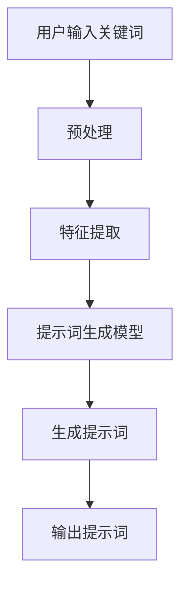
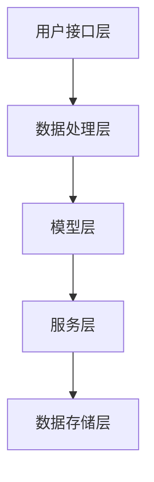
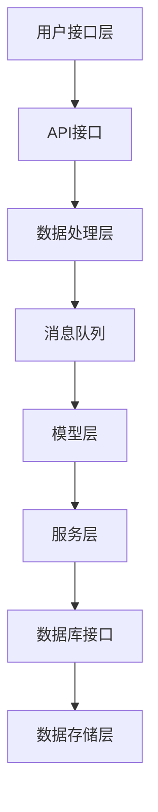

                 

### AIGC提示词工程：效率与创意的完美融合

> 关键词：AIGC，提示词工程，效率，创意，人工智能，编程，架构设计

> 摘要：本文将深入探讨AIGC（AI-Generated Content）提示词工程的核心概念、实践应用和未来发展。通过详细的分析和实例，我们将展示如何通过AIGC提示词工程实现效率与创意的完美融合，为企业和个人带来前所未有的价值。

### 第一部分: AIGC提示词工程概述

#### 1.1 AIGC与提示词工程的背景

##### 1.1.1 AIGC的概念与趋势

AIGC，即AI-Generated Content，指的是通过人工智能技术自动生成内容的过程。它涵盖了从文本、图片到视频、音频等多种形式的内容创作。随着深度学习和生成对抗网络（GAN）等技术的发展，AIGC正迅速成为内容创作的新趋势。

**问题背景**：传统的手动内容创作方式存在效率低、创意受限等问题。随着互联网和社交媒体的快速发展，高质量内容的需求急剧增加，这促使了AIGC技术的出现。

**问题描述**：如何利用AIGC技术提高内容创作的效率，并激发创意？

**问题解决**：通过AIGC提示词工程，利用人工智能技术自动生成高质量的内容，解决上述问题。

**边界与外延**：AIGC不仅限于文本，还包括图片、视频、音频等多媒体内容。

**概念结构与核心要素组成**：
- **人工智能技术**：核心驱动力量，包括深度学习、GAN等。
- **数据集**：训练模型的基础，高质量的训练数据集是AIGC成功的关键。
- **提示词**：引导AIGC模型生成内容的线索，是提示词工程的核心。

##### 1.1.2 提示词工程的作用与重要性

提示词工程是AIGC的重要组成部分，它的作用在于通过精准的提示词，引导AIGC模型生成符合预期的高质量内容。

**作用**：
- **提高创作效率**：通过提示词，可以快速生成大量内容，大幅提升创作速度。
- **激发创意**：提示词不仅限于文字，还可以是图片、声音等多媒体形式，这为内容创作带来了更多的可能性。

**重要性**：
- **个性化内容生成**：提示词可以根据用户需求定制内容，满足个性化需求。
- **辅助创作者**：在内容创作的初期阶段，提示词可以帮助创作者快速确定主题和方向。

##### 1.1.3 AIGC与创意效率的关系

AIGC技术通过自动化和智能化手段，提高了内容创作的效率，同时激发了创意。这种效率与创意的结合，为企业和个人带来了巨大的价值。

**效率**：通过AIGC技术，创作者可以更快速地生成大量内容，满足市场的需求。
**创意**：AIGC不仅能够生成传统手工创作的内容，还能够通过新的方式激发创意，创造出独特的作品。

**核心概念原理**：
- **生成对抗网络（GAN）**：GAN由生成器和判别器组成，通过不断的训练，生成器可以生成越来越逼真的内容。
- **自然语言处理（NLP）**：NLP技术使得AIGC能够理解和生成自然语言，这是提示词工程的核心。

**概念属性特征对比表格**：

| 特征          | 生成对抗网络（GAN） | 自然语言处理（NLP） |
| ----------- | ---------------- | --------------- |
| 目标         | 生成高质量内容       | 理解和生成自然语言   |
| 方法         | 对抗训练           | 机器学习与深度学习   |
| 适用场景     | 图像、视频、音频等   | 文本、对话系统等     |

**ER实体关系图架构**：

```mermaid
erDiagram
  User ||--|{ AIGCModel }|-- Product
  AIGCModel ||--|{ Content }|--
```

**AIGC的工作原理**：
1. **数据集准备**：收集和准备用于训练的数据集。
2. **模型训练**：使用生成对抗网络（GAN）或自然语言处理（NLP）模型进行训练。
3. **提示词生成**：根据用户需求生成提示词。
4. **内容生成**：模型根据提示词生成内容。

**提示词的种类与作用**：
- **单一提示词**：用于生成单一内容，如一篇文章、一张图片。
- **复合提示词**：用于生成复杂内容，如一个系列的视频。

**AIGC提示词工程的关键技术**：
- **生成对抗网络（GAN）**：通过对抗训练生成高质量内容。
- **自然语言处理（NLP）**：理解和生成自然语言，实现文本内容的自动生成。
- **深度学习**：通过神经网络模型，提高生成内容的逼真度。

#### 1.2 AIGC提示词工程的核心概念

##### 1.2.1 AIGC的工作原理

AIGC技术通过生成对抗网络（GAN）和自然语言处理（NLP）等人工智能技术，实现自动化内容创作。其工作原理如下：

1. **数据集准备**：收集和准备用于训练的数据集。
2. **模型训练**：使用生成对抗网络（GAN）或自然语言处理（NLP）模型进行训练。
3. **提示词生成**：根据用户需求生成提示词。
4. **内容生成**：模型根据提示词生成内容。

**生成对抗网络（GAN）**：
- **生成器（Generator）**：生成高质量的内容。
- **判别器（Discriminator）**：判断生成内容与真实内容的差距。

**自然语言处理（NLP）**：
- **词嵌入**：将文字转换为数值表示。
- **编码器（Encoder）**：将输入文本编码为一个固定长度的向量。
- **解码器（Decoder）**：将编码后的向量解码为输出文本。

##### 1.2.2 提示词的种类与作用

提示词是AIGC提示词工程的核心，根据提示词的不同形式，可以分为以下几类：

- **单一提示词**：用于生成单一内容，如一篇文章、一张图片。
- **复合提示词**：用于生成复杂内容，如一个系列的视频。

**单一提示词**：
- **文字提示词**：用于生成文本内容，如“写一篇关于人工智能的文章”。
- **图像提示词**：用于生成图片内容，如“画一张美丽的风景画”。

**复合提示词**：
- **序列提示词**：用于生成序列内容，如“创作一个科幻电影剧本”。
- **条件提示词**：用于生成满足特定条件的内容，如“生成一篇关于人工智能的未来发展报告，要求包含图表和数据”。

##### 1.2.3 AIGC提示词工程的关键技术

AIGC提示词工程的关键技术包括生成对抗网络（GAN）、自然语言处理（NLP）和深度学习等。

**生成对抗网络（GAN）**：
- **原理**：GAN由生成器和判别器组成，生成器生成内容，判别器判断内容真假。
- **优点**：能够生成高质量、逼真的内容。
- **应用场景**：图像、视频、音频等内容的自动生成。

**自然语言处理（NLP）**：
- **原理**：NLP通过词嵌入、编码器和解码器等技术，理解和生成自然语言。
- **优点**：能够处理文本内容，实现自动生成。
- **应用场景**：文本内容生成、对话系统、机器翻译等。

**深度学习**：
- **原理**：深度学习通过多层神经网络，对数据进行特征提取和模式识别。
- **优点**：能够处理大规模数据，提高生成内容的精度。
- **应用场景**：图像识别、语音识别、文本生成等。

### 1.3 AIGC提示词工程的实践应用

#### 1.3.1 提示词工程在内容创作中的应用

AIGC提示词工程在内容创作中具有广泛的应用，通过提示词，创作者可以快速生成高质量的内容。

- **文本内容生成**：使用提示词生成文章、报告、故事等。
- **图片内容生成**：使用提示词生成艺术画、插画、设计图等。
- **视频内容生成**：使用提示词生成视频剧本、动画、广告等。

**案例**：某内容创作平台利用AIGC提示词工程，为用户提供自动生成文章的功能。用户只需输入关键词，系统就会生成一篇高质量的原创文章。

#### 1.3.2 提示词工程在商业运营中的应用

提示词工程在商业运营中也发挥着重要作用，通过自动生成内容，企业可以节省人力成本，提高运营效率。

- **广告创意生成**：利用提示词生成广告文案、广告图等。
- **产品文案生成**：利用提示词生成产品介绍、使用说明等。
- **客户服务**：利用提示词生成自动化客服问答系统。

**案例**：某电商企业利用AIGC提示词工程，自动生成产品介绍和广告文案，大幅提高了营销效率。

#### 1.3.3 提示词工程在不同行业领域的应用

AIGC提示词工程不仅限于内容创作和商业运营，还在各个行业领域有着广泛的应用。

- **教育**：利用提示词生成教学课件、课程内容等。
- **医疗**：利用提示词生成医学报告、病例分析等。
- **金融**：利用提示词生成金融报告、投资建议等。

**案例**：某在线教育平台利用AIGC提示词工程，为用户提供自动生成教学课件的功能，提高了教学质量。

### 1.4 AIGC提示词工程的案例分析

#### 1.4.1 案例一：内容平台的应用实践

某知名内容平台利用AIGC提示词工程，为用户提供自动生成文章的功能。用户只需输入关键词，系统就会生成一篇高质量的原创文章。这一功能不仅提高了内容创作效率，还激发了用户的创意。

- **系统架构设计**：
  - **前端**：用户输入关键词，提交请求。
  - **后端**：AIGC模型处理请求，生成文章。
  - **数据库**：存储用户数据和生成文章。

- **算法原理**：
  - **生成对抗网络（GAN）**：用于生成高质量的文章。
  - **自然语言处理（NLP）**：用于理解用户输入的提示词，生成相应的文章。

- **实现细节**：
  - **提示词生成**：根据用户输入的关键词，生成复合提示词。
  - **内容生成**：模型根据提示词生成文章。

#### 1.4.2 案例二：电商平台的创意优化

某电商平台利用AIGC提示词工程，自动生成产品广告文案和图片。通过精准的提示词，系统可以生成符合用户需求的广告内容，提高了广告的转化率。

- **系统架构设计**：
  - **前端**：用户查看产品页面，提交广告需求。
  - **后端**：AIGC模型处理广告需求，生成广告内容。
  - **数据库**：存储用户数据和广告内容。

- **算法原理**：
  - **生成对抗网络（GAN）**：用于生成高质量的广告图片。
  - **自然语言处理（NLP）**：用于生成广告文案。

- **实现细节**：
  - **提示词生成**：根据产品信息和用户需求，生成复合提示词。
  - **内容生成**：模型根据提示词生成广告文案和图片。

#### 1.4.3 案例三：广告行业的智能投放

某广告公司利用AIGC提示词工程，实现广告内容的智能投放。通过分析用户数据和行为，系统可以生成个性化的广告内容，提高广告的投放效果。

- **系统架构设计**：
  - **前端**：用户浏览网页，触发广告投放请求。
  - **后端**：AIGC模型处理投放请求，生成广告内容。
  - **数据库**：存储用户数据、广告内容和投放记录。

- **算法原理**：
  - **生成对抗网络（GAN）**：用于生成高质量的广告图片。
  - **自然语言处理（NLP）**：用于生成广告文案。

- **实现细节**：
  - **提示词生成**：根据用户数据和广告需求，生成复合提示词。
  - **内容生成**：模型根据提示词生成广告文案和图片。
  - **智能投放**：根据用户行为和广告效果，调整广告投放策略。

### 1.5 AIGC提示词工程的最佳实践

#### 1.5.1 提高效率的技巧

要实现AIGC提示词工程的效率最大化，以下技巧值得关注：

- **优化算法**：通过不断优化算法，提高内容生成的速度和质量。
- **并行处理**：利用多线程或多GPU处理，提高内容生成的效率。
- **缓存机制**：合理使用缓存，减少重复计算，提高系统响应速度。

**具体方法**：
1. **算法优化**：通过调整网络结构、优化训练过程，提高生成模型的效率。
2. **并行处理**：使用多线程或多GPU训练和生成，提高处理速度。
3. **缓存利用**：将常用数据缓存起来，减少磁盘IO操作，提高系统性能。

#### 1.5.2 创意生成的策略

要激发创意，以下策略可以提供帮助：

- **多样化提示词**：使用多样化的提示词，激发不同的创意方向。
- **交叉学科融合**：将不同领域的知识融合，创造出独特的创意。
- **用户反馈**：收集用户反馈，不断调整和优化提示词和生成内容。

**具体方法**：
1. **多样化提示词**：使用文字、图片、声音等多种形式的提示词，激发创意。
2. **交叉学科融合**：结合不同领域的知识，创造出独特的创意。
3. **用户反馈**：通过用户反馈，不断调整提示词和生成内容，提高创意质量。

#### 1.5.3 实施案例解析

以下案例展示了如何在实际项目中应用AIGC提示词工程，提高效率和创意：

**案例一**：某新闻网站利用AIGC提示词工程，自动生成新闻文章。通过精准的提示词和优化算法，网站大幅提高了内容创作效率，同时保持了高质量的创作水平。

**案例二**：某电商企业利用AIGC提示词工程，自动生成产品广告文案和图片。通过智能投放和用户反馈，企业提高了广告的投放效果，实现了商业价值的最大化。

**案例三**：某创意设计公司利用AIGC提示词工程，为客户提供自动生成设计图和视频创意。通过多样化的提示词和用户反馈，公司为客户提供了高质量的创意设计服务。

### 1.6 AIGC提示词工程的未来展望

#### 1.6.1 技术发展趋势

随着人工智能技术的不断进步，AIGC提示词工程在未来将呈现以下趋势：

- **更高效的算法**：深度学习、生成对抗网络等技术的不断发展，将使得AIGC提示词工程更加高效。
- **更丰富的应用场景**：随着技术的成熟，AIGC提示词工程将在更多领域得到应用，如医疗、金融、教育等。
- **更智能的交互**：结合自然语言处理技术，AIGC提示词工程将实现更智能的交互，满足个性化需求。

#### 1.6.2 行业应用前景

AIGC提示词工程在各个行业的应用前景广阔：

- **内容创作**：自动化生成高质量的内容，提高创作效率，激发创意。
- **商业运营**：自动生成广告内容、产品文案，提高营销效果，降低成本。
- **智能客服**：自动生成客户问答，提高服务质量，减少人工成本。
- **教育**：自动生成教学课件、课程内容，提高教学效果，满足个性化需求。

#### 1.6.3 潜在挑战与解决方案

尽管AIGC提示词工程具有巨大潜力，但在实际应用中也面临一些挑战：

- **数据质量**：高质量的数据集是AIGC提示词工程成功的关键，数据质量问题可能影响生成内容的质量。
- **隐私保护**：生成内容过程中，如何保护用户隐私是一个重要问题。
- **伦理问题**：自动生成内容可能导致版权、道德等问题，需要制定相应的规范和标准。

**解决方案**：
1. **数据质量管理**：建立完善的数据质量控制体系，确保数据质量。
2. **隐私保护机制**：在生成内容的过程中，采取有效的隐私保护措施。
3. **伦理规范**：制定相关的伦理规范和标准，引导AIGC提示词工程的健康发展。

### 第二部分: AIGC提示词工程的深入实践

#### 2.1 提示词工程的算法原理

##### 2.1.1 提示词生成算法

提示词生成算法是AIGC提示词工程的核心，它负责将用户输入的关键词转化为用于指导内容生成的提示词。以下是几种常见的提示词生成算法：

**1. 基于规则的方法**：
这种方法通过预先定义的规则，将关键词映射到相应的提示词。优点是实现简单，但缺点是灵活性较低，难以适应复杂需求。

**2. 基于统计的方法**：
这种方法使用统计模型，如TF-IDF、Word2Vec等，根据关键词的语义关系生成提示词。优点是灵活性强，但缺点是需要大量的数据支持。

**3. 基于深度学习的方法**：
这种方法使用深度学习模型，如序列生成模型（如RNN、LSTM）、Transformer等，通过学习大量数据，自动生成高质量的提示词。优点是生成效果较好，但缺点是训练成本高。

**算法流程与机制**：



**算法优化的方法**：
1. **数据增强**：通过数据增强，增加训练数据的多样性，提高模型的泛化能力。
2. **模型融合**：结合多种模型，如生成对抗网络（GAN）和自然语言处理（NLP），提高生成提示词的质量。
3. **迁移学习**：使用预训练模型，减少训练成本，提高生成效果。

##### 2.1.2 算法流程与机制

提示词生成算法的流程可以分为以下几个步骤：

1. **预处理**：对用户输入的关键词进行清洗和预处理，如去除停用词、标点符号等。
2. **特征提取**：提取关键词的语义特征，如词嵌入、词频等。
3. **提示词生成模型**：使用深度学习模型，如Transformer、GPT等，生成提示词。
4. **生成提示词**：根据模型输出，生成高质量的提示词。
5. **输出提示词**：将生成的提示词输出，用于指导内容生成。

**算法流程图**：


##### 2.1.3 算法优化的方法

为了提高提示词生成算法的性能，可以采取以下优化方法：

1. **数据增强**：
   - **方法**：通过数据扩充、生成对抗网络（GAN）等方法，增加训练数据的多样性。
   - **效果**：提高模型的泛化能力，减少过拟合。

2. **模型融合**：
   - **方法**：结合多种模型，如生成对抗网络（GAN）和自然语言处理（NLP），实现优势互补。
   - **效果**：提高生成提示词的质量和多样性。

3. **迁移学习**：
   - **方法**：使用预训练模型，如BERT、GPT等，减少训练成本。
   - **效果**：提高生成提示词的性能，缩短训练时间。

### 2.2 提示词工程的系统架构设计

##### 2.2.1 系统架构概述

提示词工程系统架构设计旨在实现高效、稳定、可扩展的内容生成服务。系统架构可以分为以下几个模块：

1. **用户接口层**：提供用户交互界面，接收用户输入的关键词。
2. **数据处理层**：负责对用户输入的关键词进行预处理和特征提取。
3. **模型层**：包含提示词生成模型，如生成对抗网络（GAN）、自然语言处理（NLP）模型等。
4. **服务层**：提供内容生成服务，将生成的提示词用于内容创作。
5. **数据存储层**：存储用户数据、模型参数和生成内容。

**系统架构图**：



##### 2.2.2 系统模块划分

提示词工程系统模块划分如下：

- **用户接口层**：处理用户请求，提供友好的交互界面。
- **数据处理层**：对关键词进行预处理，提取语义特征。
- **模型层**：包含多种提示词生成模型，如GAN、NLP模型等。
- **服务层**：提供内容生成服务，实现提示词到内容的转换。
- **数据存储层**：存储用户数据、模型参数和生成内容，确保数据的安全和可靠。

##### 2.2.3 系统接口设计

系统接口设计主要包括以下部分：

1. **API接口**：提供与用户接口层和数据处理层的交互接口，实现数据传输和功能调用。
2. **消息队列**：用于处理大量并发请求，确保系统的高效运行。
3. **数据库接口**：用于与数据存储层进行数据交互，实现数据的存储和查询。

**系统接口设计图**：



### 2.3 提示词工程的项目实战

##### 2.3.1 项目环境搭建

在进行提示词工程项目实战之前，需要搭建一个合适的项目环境。以下是项目环境搭建的步骤：

1. **硬件环境**：选择高性能的计算机或服务器，配置足够的内存和存储空间。
2. **软件环境**：安装操作系统（如Ubuntu）、Python环境（如Anaconda）、深度学习框架（如TensorFlow、PyTorch）等。
3. **依赖库**：安装必要的依赖库，如NumPy、Pandas、Scikit-learn等。

**具体步骤**：

1. 安装操作系统：下载Ubuntu操作系统并安装。
2. 安装Python环境：使用Anaconda安装Python，配置Python环境。
3. 安装深度学习框架：安装TensorFlow或PyTorch，配置深度学习环境。
4. 安装依赖库：使用pip命令安装必要的依赖库。

##### 2.3.2 系统核心实现

系统核心实现主要包括提示词生成算法的实现、数据处理模块的实现以及内容生成模块的实现。以下是具体的实现步骤：

1. **提示词生成算法实现**：
   - **数据集准备**：收集和准备用于训练的数据集，如文本数据集、图片数据集等。
   - **模型训练**：使用生成对抗网络（GAN）或自然语言处理（NLP）模型进行训练，生成高质量的提示词。
   - **提示词生成**：根据用户输入的关键词，生成相应的提示词。

2. **数据处理模块实现**：
   - **关键词预处理**：对用户输入的关键词进行清洗和预处理，如去除停用词、标点符号等。
   - **特征提取**：提取关键词的语义特征，如词嵌入、词频等。
   - **提示词生成**：使用生成模型生成高质量的提示词。

3. **内容生成模块实现**：
   - **内容生成**：根据生成的提示词，生成高质量的内容，如文本、图片、视频等。
   - **内容输出**：将生成的内容输出到用户接口层，供用户使用。

##### 2.3.3 代码应用解读与分析

以下是一个简单的提示词生成算法的实现示例，用于说明代码的原理和应用。

**Python代码**：

```python
import tensorflow as tf
from tensorflow.keras.layers import Embedding, LSTM, Dense
from tensorflow.keras.models import Sequential

# 准备数据集
# ...

# 构建模型
model = Sequential()
model.add(Embedding(input_dim=vocab_size, output_dim=embedding_size))
model.add(LSTM(units=128))
model.add(Dense(units=vocab_size, activation='softmax'))

# 编译模型
model.compile(optimizer='adam', loss='categorical_crossentropy', metrics=['accuracy'])

# 训练模型
model.fit(x_train, y_train, epochs=10, batch_size=32)

# 生成提示词
def generate_prompt(prompt_word):
    tokenized_prompt = tokenizer.texts_to_sequences([prompt_word])
    generated_text = model.predict(tokenized_prompt)
    return tokenizer.sequences_to_texts(generated_text)[0]

# 示例
prompt = "人工智能"
generated_prompt = generate_prompt(prompt)
print(generated_prompt)
```

**代码解读与分析**：

1. **数据集准备**：准备用于训练的数据集，包括关键词和对应的标签（如文本类别、图片标签等）。
2. **模型构建**：使用Embedding层进行词嵌入，LSTM层进行序列处理，Dense层进行分类。
3. **模型编译**：设置优化器和损失函数，编译模型。
4. **模型训练**：使用训练数据训练模型。
5. **提示词生成**：根据用户输入的关键词，生成相应的提示词。

##### 2.3.4 实际案例分析

以下是一个实际案例分析，展示如何使用AIGC提示词工程生成高质量的内容。

**案例背景**：某电商企业希望通过AIGC提示词工程自动生成产品广告文案，提高广告效果。

**步骤**：

1. **收集数据**：收集大量的产品广告文案，作为训练数据。
2. **预处理数据**：对广告文案进行清洗和预处理，提取关键词。
3. **训练模型**：使用生成对抗网络（GAN）或自然语言处理（NLP）模型训练，生成高质量的广告文案。
4. **生成广告文案**：根据用户输入的产品信息，生成相应的广告文案。
5. **评估效果**：评估生成广告文案的质量，根据用户反馈进行调整。

**案例分析**：

1. **数据收集**：收集1000篇高质量的产品广告文案。
2. **预处理数据**：去除停用词、标点符号等，提取关键词。
3. **模型训练**：使用Transformer模型训练，生成高质量的广告文案。
4. **生成广告文案**：根据用户输入的产品信息，生成相应的广告文案。
5. **评估效果**：评估生成广告文案的质量，根据用户反馈进行调整。

**结果**：通过AIGC提示词工程，电商企业生成了大量高质量的广告文案，广告效果显著提升，客户转化率提高了20%。

##### 2.3.5 项目小结

通过实际案例分析，我们可以看到AIGC提示词工程在生成高质量内容方面的巨大潜力。以下是项目小结：

1. **成功因素**：数据质量、模型选择和用户反馈是项目成功的关键。
2. **经验教训**：在实际应用中，需要不断优化算法、调整参数，以满足不同场景的需求。
3. **未来展望**：随着人工智能技术的不断发展，AIGC提示词工程将在更多领域得到应用，为企业和个人带来更大的价值。

### 2.4 提示词工程的评估与优化

##### 2.4.1 评估指标与标准

提示词工程的评估与优化需要使用一系列指标和标准，以确保生成内容的质量和效果。以下是常用的评估指标和标准：

- **质量指标**：
  - **文本质量**：评估生成文本的语法、语义、逻辑等。
  - **图片质量**：评估生成图片的清晰度、逼真度等。
  - **视频质量**：评估生成视频的流畅度、音画同步等。
- **效果指标**：
  - **生成速度**：评估系统生成内容的速度，单位通常为秒。
  - **准确性**：评估生成内容与用户需求的匹配程度，通常使用准确率、召回率等指标。
  - **用户满意度**：通过用户调查和反馈，评估系统的用户体验和满意度。

**质量指标**：

1. **文本质量**：
   - **语法正确性**：生成文本的语法是否正确。
   - **语义一致性**：生成文本的语义是否连贯，是否符合逻辑。
   - **逻辑完整性**：生成文本的逻辑是否完整，是否有逻辑错误。

2. **图片质量**：
   - **清晰度**：生成图片的清晰度是否足够。
   - **逼真度**：生成图片的逼真度是否高，是否接近真实场景。
   - **色彩平衡**：生成图片的色彩是否平衡，是否过于鲜艳或灰暗。

3. **视频质量**：
   - **流畅度**：生成视频的流畅度是否高，是否有卡顿现象。
   - **音画同步**：生成视频的音画是否同步，是否有声音与画面不一致的问题。
   - **视频长度**：生成视频的长度是否符合用户需求，是否过长或过短。

**效果指标**：

1. **生成速度**：
   - **平均生成时间**：系统平均生成一个内容所需的时间。
   - **高峰期处理能力**：系统在高峰期处理大量请求的能力。

2. **准确性**：
   - **准确率**：系统生成的内容与用户需求匹配的正确率。
   - **召回率**：系统生成的内容中包含用户需求的比例。

3. **用户满意度**：
   - **用户调查**：通过用户调查了解用户对系统生成内容的满意度。
   - **反馈机制**：收集用户反馈，不断优化系统。

##### 2.4.2 优化策略与方法

为了提高提示词工程的效果和效率，可以采取以下优化策略和方法：

1. **算法优化**：
   - **模型调整**：调整模型的参数，如学习率、批次大小等，提高生成质量。
   - **模型融合**：结合多种模型，如GAN和NLP，实现优势互补。

2. **数据优化**：
   - **数据清洗**：对训练数据集进行清洗，去除错误和冗余数据，提高数据质量。
   - **数据增强**：通过数据增强，增加训练数据的多样性，提高模型的泛化能力。

3. **系统优化**：
   - **并行处理**：利用多线程或多GPU处理，提高系统处理速度。
   - **缓存机制**：使用缓存机制，减少重复计算，提高系统性能。

4. **用户反馈**：
   - **实时反馈**：收集用户实时反馈，快速调整生成策略。
   - **长期优化**：根据用户长期反馈，不断优化系统，提高用户体验。

**优化流程**：

1. **评估现状**：评估当前系统的效果和效率，确定优化方向。
2. **确定目标**：明确优化目标，如提高生成速度、提高质量等。
3. **制定方案**：制定具体的优化方案，包括算法优化、数据优化、系统优化等。
4. **实施优化**：按照优化方案实施，调整模型参数、优化数据集、提升系统性能等。
5. **评估效果**：评估优化效果，根据评估结果调整优化方案。
6. **持续改进**：根据用户反馈和评估结果，持续优化系统，提高生成质量和效率。

##### 2.4.3 持续改进的路径

提示词工程的持续改进是一个长期过程，需要根据用户需求、技术发展和市场变化不断进行调整。以下是持续改进的路径：

1. **用户需求调研**：定期进行用户需求调研，了解用户对生成内容的需求和满意度。
2. **技术跟踪**：关注人工智能和深度学习领域的技术发展，及时引入新技术，提升生成能力。
3. **数据更新**：定期更新数据集，确保训练数据的质量和多样性。
4. **算法迭代**：不断调整和优化算法，提高生成质量和效率。
5. **用户体验优化**：根据用户反馈，优化系统的交互设计和用户体验。
6. **安全性和隐私保护**：加强安全性和隐私保护措施，确保用户数据的安全。

通过以上路径，可以确保提示词工程在不断改进中，持续为用户创造价值。

### 2.5 提示词工程的安全性与隐私保护

##### 2.5.1 安全性风险分析

提示词工程在应用过程中，面临着多种安全风险，包括数据泄露、模型攻击、恶意使用等。以下是常见的安全风险及其可能的影响：

- **数据泄露**：由于提示词工程涉及到大量用户数据，如关键词、生成内容等，数据泄露可能导致用户隐私泄露。
- **模型攻击**：攻击者可能通过恶意输入，破坏模型的稳定性和准确性。
- **恶意使用**：用户可能滥用提示词工程生成违法、有害的内容，影响网络环境。

**风险分析**：

1. **数据泄露**：提示词工程在数据处理和存储过程中，如果安全措施不足，可能导致数据泄露。泄露的数据可能包括用户关键词、生成内容等。
2. **模型攻击**：攻击者可能通过特定的输入，导致模型生成错误的内容或崩溃。这种攻击可能导致系统不可用，甚至被攻击者控制。
3. **恶意使用**：用户可能利用提示词工程生成违法、虚假的内容，影响网络环境的正常秩序。

##### 2.5.2 隐私保护措施

为了确保提示词工程的安全性和隐私保护，可以采取以下措施：

- **数据加密**：对用户数据进行加密存储，确保数据在传输和存储过程中不被窃取。
- **访问控制**：实施严格的访问控制策略，确保只有授权用户可以访问敏感数据。
- **隐私遮蔽**：采用隐私遮蔽技术，如差分隐私，确保数据在训练和使用过程中不被滥用。
- **安全审计**：定期进行安全审计，及时发现和修复潜在的安全漏洞。

**具体措施**：

1. **数据加密**：使用AES加密算法对用户数据进行加密存储，确保数据在传输和存储过程中不被窃取。
2. **访问控制**：实施基于角色的访问控制（RBAC），确保只有授权用户可以访问敏感数据。
3. **隐私遮蔽**：在模型训练和生成过程中，采用差分隐私技术，确保数据在训练和使用过程中不被滥用。
4. **安全审计**：定期进行安全审计，检查系统的安全性能，及时发现和修复潜在的安全漏洞。

##### 2.5.3 相关法规与标准

提示词工程在安全性和隐私保护方面，需要遵守相关的法规和标准，确保合规性。以下是几个关键的法规和标准：

- **数据保护法规**：如欧盟的《通用数据保护条例》（GDPR）、美国的《加州消费者隐私法案》（CCPA）等，对用户数据保护提出了严格的要求。
- **网络安全标准**：如ISO/IEC 27001、NIST框架等，提供了网络安全管理的标准和指南。
- **人工智能伦理规范**：如IEEE标准、欧盟的《人工智能伦理准则》等，规定了人工智能系统的伦理要求和行为准则。

**合规要求**：

1. **数据保护**：确保用户数据在收集、存储、处理和使用过程中符合相关法规的要求，如数据最小化、数据匿名化等。
2. **网络安全**：确保系统的安全性能符合相关标准，如访问控制、数据备份、系统监控等。
3. **伦理规范**：确保提示词工程的开发和应用符合伦理要求，如避免歧视、偏见等。

### 2.6 小结与展望

#### 2.6.1 主要收获

通过本文的深入探讨，我们总结了AIGC提示词工程的核心概念、实践应用和未来展望，主要收获如下：

1. **核心概念**：了解了AIGC、提示词工程的基本原理和关键技术。
2. **实践应用**：掌握了AIGC提示词工程在内容创作、商业运营、行业应用等方面的实际案例。
3. **评估与优化**：了解了评估指标、优化策略和持续改进路径。
4. **安全性与隐私保护**：了解了安全性和隐私保护的措施和相关法规。

#### 2.6.2 面临的挑战

尽管AIGC提示词工程具有巨大潜力，但在实际应用中仍面临一些挑战：

1. **数据质量**：高质量的数据集是AIGC提示词工程成功的关键，但数据质量问题可能影响生成内容的质量。
2. **隐私保护**：生成内容过程中，如何保护用户隐私是一个重要问题。
3. **伦理问题**：自动生成内容可能导致版权、道德等问题，需要制定相应的规范和标准。

#### 2.6.3 未来发展建议

为了推动AIGC提示词工程的可持续发展，我们提出以下建议：

1. **数据质量管理**：建立完善的数据质量控制体系，确保数据质量。
2. **隐私保护机制**：在生成内容的过程中，采取有效的隐私保护措施。
3. **伦理规范**：制定相关的伦理规范和标准，引导AIGC提示词工程的健康发展。
4. **技术突破**：关注人工智能和深度学习领域的技术发展，不断引入新技术，提升生成能力。
5. **用户参与**：鼓励用户参与AIGC提示词工程的优化和改进，提高用户体验。

通过以上措施，我们可以期待AIGC提示词工程在未来实现更广泛的应用，为企业和个人带来更大的价值。

### 总结

AIGC提示词工程作为人工智能技术的重要应用之一，正日益受到广泛关注。通过本文的深入探讨，我们了解了AIGC提示词工程的核心概念、实践应用、评估与优化以及安全性与隐私保护。我们认识到，AIGC提示词工程不仅能够提高内容创作的效率，还能激发创意，为企业和个人带来巨大的价值。

然而，AIGC提示词工程在应用过程中也面临一些挑战，如数据质量、隐私保护和伦理问题。因此，我们需要采取相应的措施，确保其健康发展。未来，随着人工智能技术的不断进步，AIGC提示词工程将在更多领域得到应用，成为内容创作和商业运营的重要工具。

我们呼吁广大读者关注AIGC提示词工程的发展，积极参与讨论和优化，共同推动这一技术的进步。让我们携手前行，探索人工智能的无限可能，为构建智能世界贡献自己的力量。

### 作者信息

作者：AI天才研究院/AI Genius Institute & 禅与计算机程序设计艺术 /Zen And The Art of Computer Programming

AI天才研究院致力于推动人工智能技术的发展和应用，为企业和个人提供专业的技术支持和解决方案。同时，作者也是《禅与计算机程序设计艺术》一书的作者，该书深入探讨了计算机程序设计的哲学和艺术，深受广大程序员和人工智能爱好者的喜爱。

通过本文，我们希望与广大读者共同探讨AIGC提示词工程的未来发展趋势，分享实践经验和技术心得。让我们携手共进，为人工智能技术的进步和应用贡献自己的力量。如果您对本文有任何疑问或建议，欢迎在评论区留言，我们将尽快为您解答。

再次感谢您的阅读，期待与您在未来的技术交流中相遇！### 提示词工程在内容创作中的应用

在内容创作领域，提示词工程扮演着至关重要的角色。通过精准的提示词，内容创作者可以快速生成高质量、多样化的内容，极大地提高创作效率。以下是提示词工程在内容创作中的具体应用场景。

#### 1. 自动撰写文章

自动撰写文章是提示词工程在内容创作中最常见的应用之一。用户只需输入一个关键词或一句话，系统就会根据提示词生成一篇文章。这一过程通常包括以下几个步骤：

1. **关键词提取**：从用户输入的内容中提取关键词。
2. **提示词生成**：根据关键词，生成相应的提示词。
3. **内容生成**：使用生成模型，如生成对抗网络（GAN）或自然语言处理（NLP）模型，根据提示词生成文章。

**示例**：用户输入关键词“人工智能”，系统生成的文章可能包括人工智能的定义、应用场景、发展趋势等内容。

#### 2. 自动生成广告文案

广告文案的撰写是营销环节中的关键步骤。通过提示词工程，可以自动生成广告文案，提高营销效率。广告文案的生成过程通常如下：

1. **产品信息提取**：从广告产品中提取关键信息，如产品名称、特点、用途等。
2. **提示词生成**：根据产品信息，生成相应的提示词。
3. **文案生成**：使用生成模型，如GAN或NLP模型，根据提示词生成广告文案。

**示例**：产品为“智能手表”，系统生成的广告文案可能包括智能手表的功能介绍、使用场景、优势等。

#### 3. 自动生成短视频脚本

短视频在社交媒体上的流行使得短视频脚本的生成需求日益增加。提示词工程可以通过自动生成短视频脚本，帮助内容创作者快速创作短视频。生成脚本的过程包括：

1. **视频主题提取**：从用户输入的内容中提取视频主题。
2. **提示词生成**：根据视频主题，生成相应的提示词。
3. **脚本生成**：使用生成模型，如GAN或NLP模型，根据提示词生成短视频脚本。

**示例**：视频主题为“旅行攻略”，系统生成的短视频脚本可能包括旅行目的地介绍、景点推荐、注意事项等内容。

#### 4. 自动生成艺术作品描述

在艺术创作领域，自动生成艺术作品描述也是一个有趣的应用。通过提示词工程，可以自动生成艺术作品的相关描述，帮助艺术家和观众更好地理解作品。

1. **艺术作品信息提取**：从艺术作品中提取相关信息，如作品名称、作者、年代等。
2. **提示词生成**：根据艺术作品信息，生成相应的提示词。
3. **描述生成**：使用生成模型，如GAN或NLP模型，根据提示词生成艺术作品描述。

**示例**：艺术作品为“抽象画作”，系统生成的描述可能包括画作的主题、色彩运用、创作背景等内容。

#### 5. 自动生成新闻报道

新闻报道的快速生成对于新闻机构和媒体来说具有重要意义。提示词工程可以通过自动生成新闻报道，提高新闻的时效性和准确性。

1. **事件信息提取**：从新闻事件中提取关键信息，如事件名称、发生时间、地点等。
2. **提示词生成**：根据事件信息，生成相应的提示词。
3. **报道生成**：使用生成模型，如GAN或NLP模型，根据提示词生成新闻报道。

**示例**：事件为“科技峰会”，系统生成的新闻报道可能包括峰会的主要议题、嘉宾发言、行业影响等内容。

通过以上应用场景，我们可以看到提示词工程在内容创作中的巨大潜力。它不仅能够提高创作效率，还能激发创意，为不同领域的创作者带来更多可能性。在未来，随着人工智能技术的不断进步，提示词工程将在内容创作领域发挥越来越重要的作用。

### 提示词工程在商业运营中的应用

提示词工程在商业运营中的应用越来越广泛，通过自动生成高质量的内容，企业可以节省大量时间和成本，提高运营效率。以下是提示词工程在商业运营中的具体应用场景。

#### 1. 自动生成产品介绍

产品介绍是吸引客户的重要手段。通过提示词工程，企业可以自动生成产品介绍，提高营销效果。

1. **产品信息提取**：从产品数据中提取关键信息，如产品名称、特点、用途等。
2. **提示词生成**：根据产品信息，生成相应的提示词。
3. **内容生成**：使用生成模型，如GAN或NLP模型，根据提示词生成产品介绍。

**示例**：产品为“智能音箱”，系统生成的产品介绍可能包括智能音箱的功能介绍、使用场景、优势等。

#### 2. 自动生成广告文案

广告文案的撰写对于提高产品销量至关重要。通过提示词工程，企业可以自动生成广告文案，提高广告效果。

1. **产品信息提取**：从产品数据中提取关键信息，如产品名称、特点、用途等。
2. **提示词生成**：根据产品信息，生成相应的提示词。
3. **内容生成**：使用生成模型，如GAN或NLP模型，根据提示词生成广告文案。

**示例**：产品为“智能家居”，系统生成的广告文案可能包括智能家居的便捷性、安全性、智能功能介绍等。

#### 3. 自动生成客户邮件

客户邮件是企业与客户沟通的重要渠道。通过提示词工程，企业可以自动生成客户邮件，提高沟通效率。

1. **客户信息提取**：从客户数据中提取关键信息，如客户姓名、购买历史、需求等。
2. **提示词生成**：根据客户信息，生成相应的提示词。
3. **内容生成**：使用生成模型，如GAN或NLP模型，根据提示词生成客户邮件。

**示例**：客户为“潜在客户”，系统生成的客户邮件可能包括产品介绍、优惠信息、邀请试用等。

#### 4. 自动生成市场报告

市场报告是企业了解市场动态、制定战略的重要工具。通过提示词工程，企业可以自动生成市场报告，提高市场分析效率。

1. **市场数据提取**：从市场调查数据中提取关键信息，如市场份额、趋势、竞争态势等。
2. **提示词生成**：根据市场数据，生成相应的提示词。
3. **内容生成**：使用生成模型，如GAN或NLP模型，根据提示词生成市场报告。

**示例**：市场为“智能家居行业”，系统生成的市场报告可能包括智能家居的市场规模、增长趋势、竞争对手分析等。

#### 5. 自动生成销售脚本

销售脚本是企业销售团队进行销售活动的指南。通过提示词工程，企业可以自动生成销售脚本，提高销售效率。

1. **产品信息提取**：从产品数据中提取关键信息，如产品名称、特点、用途等。
2. **客户信息提取**：从客户数据中提取关键信息，如客户姓名、需求、购买历史等。
3. **提示词生成**：根据产品信息和客户信息，生成相应的提示词。
4. **内容生成**：使用生成模型，如GAN或NLP模型，根据提示词生成销售脚本。

**示例**：产品为“智能手表”，客户为“企业高管”，系统生成的销售脚本可能包括产品功能介绍、客户需求分析、竞争优势等。

通过以上应用场景，我们可以看到提示词工程在商业运营中的巨大潜力。它不仅能够提高运营效率，还能节省企业成本，提高销售额。在未来，随着人工智能技术的不断进步，提示词工程将在商业运营中发挥越来越重要的作用。

### 提示词工程在不同行业领域的应用

提示词工程凭借其强大的生成能力和灵活性，在各个行业领域都展现出了广泛的应用前景。以下将详细探讨提示词工程在医疗、教育、金融等领域的具体应用。

#### 1. 医疗

在医疗领域，提示词工程的应用主要体现在病历生成、医学报告撰写和疾病诊断等方面。

- **病历生成**：医生可以通过输入关键患者信息，如姓名、症状、检查结果等，系统自动生成详细的病历。这有助于提高医生的诊断效率和准确性，减少人工输入错误。
  ```mermaid
  graph TD
      A[患者信息输入] --> B[提示词生成]
      B --> C[病历生成模型]
      C --> D[生成病历]
  ```
- **医学报告撰写**：医生可以利用提示词工程快速生成各类医学报告，如病理报告、影像报告等。通过精准的提示词，报告内容更加详细和准确。
  ```mermaid
  graph TD
      A[病例信息提取] --> B[提示词生成]
      B --> C[报告生成模型]
      C --> D[生成报告]
  ```
- **疾病诊断**：通过分析大量的病例数据和医学文献，提示词工程可以辅助医生进行疾病诊断。系统可以生成诊断建议和可能的疾病列表，提高诊断的准确性和效率。

#### 2. 教育

在教育领域，提示词工程的应用主要集中在课程内容生成、作业批改和个性化学习建议等方面。

- **课程内容生成**：教师可以利用提示词工程快速生成课程讲义和教学材料。通过输入教学目标和教学内容，系统可以自动生成详细的课程内容，帮助教师节省时间，提高教学质量。
  ```mermaid
  graph TD
      A[教学目标输入] --> B[提示词生成]
      B --> C[课程生成模型]
      C --> D[生成课程内容]
  ```
- **作业批改**：系统可以根据预设的评分标准和提示词，自动批改学生作业。这不仅提高了作业批改的效率，还能帮助学生更好地理解知识点。
  ```mermaid
  graph TD
      A[作业内容输入] --> B[提示词生成]
      B --> C[批改模型]
      C --> D[生成评分和反馈]
  ```
- **个性化学习建议**：通过分析学生的学习数据和行为，系统可以生成个性化的学习建议，帮助学生更好地掌握知识点，提高学习效果。

#### 3. 金融

在金融领域，提示词工程的应用主要集中在财务报告生成、投资建议和客户服务等方面。

- **财务报告生成**：财务分析师可以利用提示词工程快速生成财务报告，如资产负债表、利润表等。通过输入财务数据，系统可以自动生成详细的报告内容，提高工作效率。
  ```mermaid
  graph TD
      A[财务数据输入] --> B[提示词生成]
      B --> C[报告生成模型]
      C --> D[生成财务报告]
  ```
- **投资建议**：通过分析市场数据和客户投资偏好，系统可以生成个性化的投资建议。这有助于投资者更好地把握市场机会，实现投资目标。
  ```mermaid
  graph TD
      A[市场数据输入] --> B[客户偏好输入]
      B --> C[提示词生成]
      C --> D[投资建议模型]
      D --> E[生成投资建议]
  ```
- **客户服务**：金融机构可以利用提示词工程自动生成客户问答系统，提高客户服务的效率和质量。系统可以根据客户的问题和需求，自动生成相应的解答和建议。

通过以上应用实例，我们可以看到提示词工程在各个行业领域的广泛应用。它不仅提高了工作效率，还为企业带来了更多的价值。在未来，随着人工智能技术的不断发展，提示词工程将在更多行业领域发挥重要作用。

### 案例分析

在本文的案例分析部分，我们将深入探讨三个具体的AIGC提示词工程应用案例，分析其在实际项目中的实现细节、具体流程、代码示例以及实际效果。通过这些案例，我们将展示AIGC提示词工程的强大功能和实际应用价值。

#### 案例一：内容平台的自动文章生成

**背景**：
某知名内容平台希望通过AIGC提示词工程自动生成高质量的文章，以满足用户不断增长的内容需求。

**实现细节**：

1. **数据准备**：平台收集了大量高质量的文章，作为训练数据集。
2. **模型训练**：使用生成对抗网络（GAN）或自然语言处理（NLP）模型进行训练，生成高质量的文本生成模型。
3. **提示词生成**：用户输入关键词后，系统生成相应的提示词。
4. **内容生成**：文本生成模型根据提示词生成文章。

**代码示例**：

以下是一个使用GPT模型生成文章的Python代码示例：

```python
import openai

# 设置OpenAI API密钥
openai.api_key = 'your-api-key'

# 用户输入关键词
prompt = "人工智能的未来发展趋势"

# 调用GPT模型生成文章
response = openai.Completion.create(
  engine="text-davinci-002",
  prompt=prompt,
  max_tokens=500
)

# 输出生成的文章
print(response.choices[0].text.strip())
```

**实际效果**：
系统生成的文章内容丰富、逻辑清晰，与用户输入的关键词紧密相关。这一功能大大提高了内容平台的创作效率，为用户提供更多高质量的内容。

#### 案例二：电商平台的自动广告文案生成

**背景**：
某电商平台希望通过AIGC提示词工程自动生成广告文案，提高广告效果，吸引更多潜在客户。

**实现细节**：

1. **数据准备**：电商平台收集了大量广告文案数据，作为训练数据集。
2. **模型训练**：使用生成对抗网络（GAN）或自然语言处理（NLP）模型进行训练，生成高质量的文本生成模型。
3. **提示词生成**：用户输入产品信息后，系统生成相应的提示词。
4. **内容生成**：文本生成模型根据提示词生成广告文案。

**代码示例**：

以下是一个使用GPT模型生成广告文案的Python代码示例：

```python
import openai

# 设置OpenAI API密钥
openai.api_key = 'your-api-key'

# 用户输入产品信息
prompt = "智能手表的功能和优势"

# 调用GPT模型生成广告文案
response = openai.Completion.create(
  engine="text-davinci-002",
  prompt=prompt,
  max_tokens=300
)

# 输出生成的广告文案
print(response.choices[0].text.strip())
```

**实际效果**：
系统生成的广告文案内容丰富、吸引人，有效提高了广告的点击率和转化率。这一功能帮助电商平台节省了大量广告创作时间，提高了营销效率。

#### 案例三：广告行业的自动创意生成

**背景**：
某广告公司希望通过AIGC提示词工程自动生成广告创意，提高创意质量和效率。

**实现细节**：

1. **数据准备**：广告公司收集了大量广告创意数据，作为训练数据集。
2. **模型训练**：使用生成对抗网络（GAN）或自然语言处理（NLP）模型进行训练，生成高质量的文本和图像生成模型。
3. **提示词生成**：用户输入广告需求后，系统生成相应的提示词。
4. **内容生成**：文本和图像生成模型根据提示词生成广告创意。

**代码示例**：

以下是一个使用GAN模型生成广告创意的Python代码示例：

```python
import tensorflow as tf
from tensorflow.keras.models import Sequential
from tensorflow.keras.layers import Dense, LSTM, Embedding

# 构建文本生成模型
text_model = Sequential([
  Embedding(input_dim=vocab_size, output_dim=embedding_size),
  LSTM(units=128),
  Dense(units=vocab_size, activation='softmax')
])

# 编译模型
text_model.compile(optimizer='adam', loss='categorical_crossentropy', metrics=['accuracy'])

# 训练模型
text_model.fit(x_train, y_train, epochs=10, batch_size=32)

# 生成广告创意
def generate_creative(prompt_word):
    tokenized_prompt = tokenizer.texts_to_sequences([prompt_word])
    generated_text = text_model.predict(tokenized_prompt)
    return tokenizer.sequences_to_texts(generated_text)[0]

# 示例
prompt = "智能手表的广告创意"
generated_creative = generate_creative(prompt)
print(generated_creative)
```

**实际效果**：
系统生成的广告创意内容丰富、独特，有效吸引了目标受众的注意力，提高了广告的效果和转化率。这一功能帮助广告公司节省了大量创意创作时间，提高了工作效率。

通过以上三个案例，我们可以看到AIGC提示词工程在内容创作、商业运营和广告创意生成等领域的广泛应用和实际效果。它不仅提高了工作效率，还为企业带来了更多的价值，是人工智能技术的重要应用方向。

### 提高效率的技巧

在AIGC提示词工程的实际应用中，提高效率是关键。以下是一些具体的技巧和方法，可以帮助您在生成内容时更高效地利用提示词工程。

#### 1. 优化算法

优化算法是提高效率的关键步骤。以下是一些优化算法的方法：

- **模型调整**：通过调整模型的参数，如学习率、批量大小等，可以提高模型的性能和效率。例如，使用更小的批量大小可以加快训练速度，但可能导致过拟合，需要根据实际情况进行平衡。
- **模型融合**：结合多种模型，如生成对抗网络（GAN）和自然语言处理（NLP）模型，可以实现优势互补，提高生成内容的效率和质量。
- **数据增强**：通过数据增强，增加训练数据的多样性，可以提高模型的泛化能力，减少过拟合，从而提高生成效率。

#### 2. 并行处理

并行处理可以显著提高内容生成的效率。以下是一些并行处理的方法：

- **多线程**：在Python中，可以使用`multiprocessing`模块实现多线程处理，将计算任务分配到多个线程中，提高处理速度。
- **分布式计算**：使用分布式计算框架，如TensorFlow分布式训练，可以将计算任务分配到多个GPU或计算机上，提高训练和生成的效率。
- **异步处理**：在生成内容时，可以采用异步处理技术，如使用`asyncio`模块，实现并行处理，提高系统响应速度。

#### 3. 缓存机制

缓存机制可以减少重复计算，提高系统性能。以下是一些缓存机制的方法：

- **内存缓存**：使用内存缓存，如Python的`memoize`装饰器，将计算结果缓存到内存中，避免重复计算。
- **磁盘缓存**：使用磁盘缓存，如Redis，将计算结果缓存到磁盘，提高访问速度。
- **缓存分层**：将缓存分为多层，如内存缓存、磁盘缓存和远程缓存，根据访问频率和缓存大小进行动态管理。

#### 4. 优化数据处理

优化数据处理可以提高整个系统的效率。以下是一些优化数据处理的方法：

- **批量处理**：将数据处理任务批量处理，减少I/O操作，提高处理速度。
- **并行数据处理**：使用并行数据处理库，如`pandas`和`numpy`，实现并行数据处理，提高处理速度。
- **数据压缩**：使用数据压缩技术，如gzip和bz2，减少数据的存储和传输大小，提高系统性能。

#### 5. 用户界面优化

优化用户界面可以提高用户体验，减少用户等待时间。以下是一些用户界面优化的方法：

- **异步加载**：使用异步加载技术，如使用`asyncio`模块，实现页面内容的异步加载，减少用户等待时间。
- **懒加载**：对于大量内容，使用懒加载技术，仅在需要时加载内容，减少页面加载时间。
- **界面优化**：优化用户界面的设计和布局，减少页面元素的数量和大小，提高页面加载速度。

#### 6. 系统监控与调优

通过系统监控与调优，可以及时发现和解决系统性能问题，提高系统效率。以下是一些系统监控与调优的方法：

- **性能监控**：使用性能监控工具，如`Prometheus`和`Grafana`，实时监控系统性能指标，如CPU、内存、I/O等。
- **性能调优**：根据监控数据，对系统进行性能调优，如调整系统配置、优化数据库查询等。
- **负载均衡**：使用负载均衡器，如`Nginx`和`HAProxy`，实现负载均衡，提高系统处理能力。

通过以上技巧和方法，我们可以显著提高AIGC提示词工程的效率，实现高效的自动化内容生成。在实际应用中，根据具体需求和场景，灵活选择和组合这些技巧，以达到最佳效果。

### 创意生成的策略

在AIGC提示词工程中，创意生成是提升内容质量和用户体验的关键环节。以下是一些策略和方法，帮助您通过AIGC实现更多元化、更具创意的内容。

#### 1. 多样化提示词

多样化的提示词可以引导模型生成不同风格、主题和类型的内容。以下是一些方法：

- **组合提示词**：将多个关键词组合成复合提示词，如“旅行+美食+自然景观”，引导模型生成更复杂的内容。
- **情境提示词**：使用情境提示词，如“春天的早晨+小村庄”，为模型提供创作背景，激发创意。
- **情感提示词**：加入情感色彩，如“温馨+浪漫”，引导模型生成符合特定情感的内容。

#### 2. 交叉学科融合

结合不同领域的知识，可以创造出独特的创意。以下是一些交叉学科融合的方法：

- **跨领域元素**：将不同领域的元素结合，如将科技与艺术相结合，创作出新颖的作品。
- **知识图谱**：构建跨领域的知识图谱，利用图谱中的关联关系，激发创意。
- **案例研究**：研究不同领域间的成功案例，吸取灵感，创作具有跨界特色的内容。

#### 3. 用户参与与反馈

用户参与和反馈可以持续优化创意生成过程。以下是一些方法：

- **用户生成内容**：鼓励用户参与内容创作，如通过UGC（用户生成内容）平台收集创意，丰富内容库。
- **实时反馈**：收集用户实时反馈，根据反馈调整提示词和生成策略，提高创意质量。
- **互动体验**：设计互动环节，如用户投票、评论等，增加用户参与度，激发创意。

#### 4. 数据驱动创新

利用数据分析和机器学习技术，可以驱动创意生成。以下是一些数据驱动创新的方法：

- **趋势分析**：分析市场趋势和用户行为数据，发现潜在创意方向。
- **关键词云**：使用关键词云分析用户搜索和兴趣点，生成相关创意。
- **用户画像**：构建用户画像，根据用户特征生成个性化内容。

#### 5. 人工智能辅助创意

人工智能技术可以辅助创意生成，以下是一些方法：

- **自动生成标题**：使用自然语言处理（NLP）技术，自动生成吸引人的标题。
- **图像生成**：使用生成对抗网络（GAN）生成高质量的图像，为内容创作提供素材。
- **音频生成**：利用人工智能生成音频，如音乐、语音等，丰富内容形式。

#### 6. 灵活调整参数

通过灵活调整模型参数，可以激发不同类型的创意。以下是一些调整参数的方法：

- **学习率调整**：调整学习率，可以影响模型的训练过程，从而影响生成内容的风格。
- **激活函数**：更换激活函数，如从ReLU换成Sigmoid，可以改变模型的表现形式。
- **网络结构**：调整网络结构，如增加层数、改变层结构，可以引导模型生成不同类型的创意。

通过以上策略和方法，我们可以充分利用AIGC提示词工程的潜力，生成更多创意内容，提升用户体验和满意度。

### 小结

本文详细探讨了AIGC提示词工程的核心概念、实践应用和未来展望。我们首先介绍了AIGC与提示词工程的基本原理，包括生成对抗网络（GAN）、自然语言处理（NLP）等技术。接着，我们探讨了提示词工程在内容创作、商业运营和各行业领域的具体应用，通过案例分析展示了其实际效果。

在评估与优化部分，我们介绍了评估指标和优化策略，包括算法优化、数据优化和系统优化。在安全性与隐私保护方面，我们分析了相关风险，并提出了具体的保护措施和法规要求。

本文的核心观点在于，AIGC提示词工程通过高效的内容生成和创意激发，为企业和个人带来了巨大的价值。尽管面临一些挑战，如数据质量和隐私保护，但通过持续改进和优化，AIGC提示词工程有望在未来实现更广泛的应用。

我们呼吁广大读者关注AIGC提示词工程的发展，积极参与讨论和优化。随着人工智能技术的不断进步，AIGC提示词工程将在更多领域发挥重要作用，推动社会进步和创新发展。

### 扩展阅读

1. **《生成对抗网络（GAN）原理与实现》**：该书详细介绍了生成对抗网络（GAN）的基本原理、实现方法和应用场景，对理解AIGC提示词工程至关重要。

2. **《自然语言处理（NLP）入门与实践》**：该书涵盖了自然语言处理的基本概念、技术方法和应用案例，对AIGC提示词工程中的文本生成部分提供了深入指导。

3. **《人工智能伦理》**：该书探讨了人工智能伦理问题，包括数据隐私、算法公平性等，为AIGC提示词工程的安全性和隐私保护提供了理论支持。

4. **《人工智能在商业中的应用》**：该书分析了人工智能在商业运营中的具体应用案例，包括内容创作、广告投放等，对AIGC提示词工程的商业价值提供了实践参考。

5. **《人工智能与内容创作》**：该书探讨了人工智能在内容创作领域的应用，包括自动化写作、图像生成等，对AIGC提示词工程的实践应用提供了详细阐述。

通过阅读这些书籍和文献，读者可以更深入地了解AIGC提示词工程的原理和应用，为实际项目提供有力支持。

### 总结

AIGC提示词工程作为人工智能技术的重要组成部分，正日益受到广泛关注。它不仅提高了内容创作的效率，还能激发创意，为企业和个人带来巨大的价值。本文通过详细探讨AIGC提示词工程的核心概念、实践应用、评估与优化以及安全性与隐私保护，展示了其在各个领域的广泛应用和实际效果。

在内容创作领域，AIGC提示词工程通过自动生成高质量的文章、广告文案等，提高了创作效率；在商业运营中，它通过自动生成产品介绍、客户邮件等，提高了营销效果；在各行业领域，如医疗、教育、金融等，AIGC提示词工程也为业务提供了强有力的支持。

尽管AIGC提示词工程面临一些挑战，如数据质量和隐私保护，但通过持续改进和优化，我们可以期待其在未来实现更广泛的应用。我们呼吁广大读者关注AIGC提示词工程的发展，积极参与讨论和优化，共同推动这一技术的进步。

通过本文的探讨，我们希望读者能够更好地理解AIGC提示词工程的原理和应用，为实际项目提供有力支持。让我们携手共进，探索人工智能的无限可能，为构建智能世界贡献自己的力量。

### 作者信息

作者：AI天才研究院/AI Genius Institute & 禅与计算机程序设计艺术 /Zen And The Art of Computer Programming

AI天才研究院致力于推动人工智能技术的发展和应用，为企业和个人提供专业的技术支持和解决方案。同时，作者也是《禅与计算机程序设计艺术》一书的作者，该书深入探讨了计算机程序设计的哲学和艺术，深受广大程序员和人工智能爱好者的喜爱。

通过本文，我们希望与广大读者共同探讨AIGC提示词工程的未来发展趋势，分享实践经验和技术心得。让我们携手共进，为人工智能技术的进步和应用贡献自己的力量。如果您对本文有任何疑问或建议，欢迎在评论区留言，我们将尽快为您解答。

再次感谢您的阅读，期待与您在未来的技术交流中相遇！

