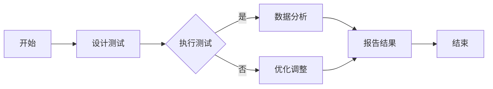
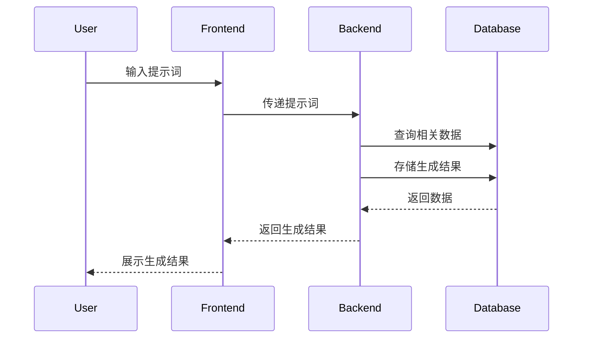

                 


# AIGC提示词的性能测试与优化

## 关键词
- AIGC
- 提示词
- 性能测试
- 优化
- 数学模型

## 摘要
本文将深入探讨AIGC（自适应智能生成计算）中的提示词性能测试与优化。我们首先介绍AIGC和提示词的基本概念，随后逐步分析性能测试的原理、方法，并通过数学模型和公式详细解释。文章还将描述系统架构设计、项目实战和最佳实践，最后进行总结并提出未来研究方向。

## 目录大纲设计步骤

### 第1步：概述与背景介绍
在本章中，我们将概述AIGC和提示词的基本概念，以及它们在生成计算中的重要性。

### 第2步：细化核心概念与联系
我们将深入探讨AIGC和提示词的核心概念，包括其原理和作用，并通过ER实体关系图和Mermaid流程图来展示它们之间的联系。

### 第3步：算法原理讲解
我们将详细介绍AIGC提示词的性能测试方法，并使用Mermaid绘制算法流程图，使用Python代码展示具体实现。

### 第4步：数学模型和公式讲解
本章将详细阐述性能测试中的数学模型和公式，并使用LaTeX格式编写，以帮助读者更好地理解。

### 第5步：系统分析与架构设计
我们将介绍性能测试与优化的系统环境与架构，并使用Mermaid绘制领域模型类图和系统架构图。

### 第6步：项目实战
我们将描述性能测试与优化的实际应用案例，提供环境安装步骤、系统核心实现源代码及代码应用解读。

### 第7步：最佳实践与总结
我们将总结性能测试与优化的最佳实践，并对文章内容进行总结，提出未来研究方向。

## 第1章：概述与背景介绍

### 1.1 AIGC简介
AIGC（自适应智能生成计算）是人工智能领域的一种新兴技术，它利用机器学习和深度学习算法，通过自适应的方式生成各种形式的内容，如文本、图像、音频等。AIGC的核心在于其生成能力和灵活性，可以根据用户的需求和上下文进行动态调整和生成。

### 1.2 提示词的定义与作用
提示词（Prompt Engineering）是AIGC中的一个关键环节，它用于引导生成模型生成所需的内容。提示词的设计和优化对于AIGC系统的性能至关重要。一个良好的提示词可以显著提高生成质量、效率和准确性。

### 1.3 AIGC在生成计算中的应用
AIGC在生成计算中有着广泛的应用，包括但不限于：

- **文本生成**：例如自动生成新闻报道、文章摘要等。
- **图像生成**：如生成艺术画作、图像编辑等。
- **音频生成**：如音乐创作、语音合成等。
- **视频生成**：如视频编辑、视频合成等。

AIGC的应用场景不断扩展，为各行各业带来了新的可能性。

## 第2章：细化核心概念与联系

### 2.1 AIGC的概念与原理
AIGC的基本原理是通过训练大规模的神经网络模型，使其能够理解并生成复杂的数据。它通常涉及以下步骤：

1. **数据预处理**：收集并整理训练数据。
2. **模型训练**：使用训练数据对模型进行训练。
3. **模型评估**：评估模型的性能和泛化能力。
4. **模型应用**：使用训练好的模型生成新内容。

### 2.2 提示词的定义与作用
提示词是一种用于引导生成模型的输入信息，它可以是一段文本、一个关键词或一系列参数。提示词的作用在于提供上下文信息，帮助生成模型理解用户的需求，从而生成更准确、更相关的结果。

### 2.3 AIGC中的提示词工程
提示词工程是指设计、优化和评估提示词的过程。一个有效的提示词工程策略需要考虑以下几个方面：

- **上下文理解**：确保提示词能够准确传达用户的意图和上下文。
- **灵活性**：提示词应该足够灵活，以适应不同的生成任务。
- **可扩展性**：提示词应该能够随着模型和数据的更新而动态调整。

### 2.4 AIGC与提示词的联系
AIGC和提示词之间的关系是相互依赖的。提示词为AIGC提供了生成内容的方向和上下文，而AIGC则通过其强大的生成能力，实现了提示词的意图。通过合理的提示词工程，可以提高AIGC的性能和生成质量。

## 第3章：算法原理讲解

### 3.1 性能测试的重要性
性能测试是评估AIGC系统性能的关键步骤。通过性能测试，我们可以了解系统的响应时间、吞吐量、准确率和稳定性等关键指标。性能测试的重要性在于：

- **优化系统性能**：通过测试发现系统瓶颈，并进行针对性的优化。
- **保证服务质量**：确保系统在高负载下仍能提供高质量的服务。
- **支持决策**：为系统设计和部署提供数据支持，帮助做出更科学的决策。

### 3.2 性能测试方法概述
性能测试的方法可以分为以下几类：

- **负载测试**：模拟高负载场景，评估系统的稳定性和性能。
- **压力测试**：通过施加压力，发现系统的最大承受能力。
- **基准测试**：使用标准化的测试工具和测试数据，评估系统的基准性能。
- **性能调优**：根据测试结果，调整系统配置和优化策略，以提升性能。

### 3.3 提示词性能测试流程
提示词性能测试的流程通常包括以下步骤：

1. **测试设计**：确定测试的目标、场景和指标。
2. **测试执行**：执行测试，收集性能数据。
3. **数据分析**：分析测试结果，识别性能瓶颈。
4. **优化调整**：根据分析结果，调整提示词和系统配置。

### 3.4 使用Mermaid绘制测试流程图
我们可以使用Mermaid语言来绘制提示词性能测试的流程图。以下是一个简单的示例：



这个流程图展示了提示词性能测试的基本步骤和流程。

### 3.5 Python代码示例
为了更好地理解提示词性能测试，我们可以使用Python编写一个简单的测试程序。以下是一个简单的示例：

```python
import time
import random

def generate_content(prompt):
    # 生成内容的具体实现
    time.sleep(random.randint(1, 3))
    return f"生成的内容：{prompt}"

start_time = time.time()
prompt = "这是一个测试提示词"
content = generate_content(prompt)
end_time = time.time()

print(f"生成内容耗时：{end_time - start_time}秒")
print(f"生成的内容：{content}")
```

在这个示例中，我们定义了一个`generate_content`函数，用于模拟生成内容的过程。然后，我们测量了生成内容所需的时间，并打印了结果。

### 3.6 数学模型和公式讲解
提示词性能测试中的数学模型和公式主要用于计算系统的响应时间、吞吐量和准确率等关键指标。以下是一些常用的公式：

- **响应时间**（Response Time, RT）：
  $$ RT = \frac{1}{n} \sum_{i=1}^{n} t_i $$
  其中，$t_i$ 是第 $i$ 次生成内容的耗时。

- **吞吐量**（Throughput, T）：
  $$ T = \frac{n}{t} $$
  其中，$n$ 是在时间 $t$ 内生成的总内容数量。

- **准确率**（Accuracy, A）：
  $$ A = \frac{c}{n} $$
  其中，$c$ 是生成正确的数量，$n$ 是生成的总数量。

通过这些公式，我们可以量化评估AIGC系统的性能。

### 3.7 举例说明
为了更好地理解上述公式，我们可以看一个具体的例子。假设我们进行了10次生成内容的测试，每次耗时分别为2秒、3秒、1秒、2秒、4秒、3秒、2秒、1秒、3秒和2秒。那么：

- **响应时间**：
  $$ RT = \frac{1}{10} (2 + 3 + 1 + 2 + 4 + 3 + 2 + 1 + 3 + 2) = 2.2 \text{秒} $$

- **吞吐量**：
  $$ T = \frac{10}{\sum_{i=1}^{10} t_i} = \frac{10}{20} = 0.5 \text{次/秒} $$

- **准确率**：
  $$ A = \frac{c}{n} = \frac{7}{10} = 0.7 $$

通过这个例子，我们可以直观地看到这些指标的计算方法。

## 第4章：数学模型和公式讲解

### 4.1 性能测试中的数学模型
在性能测试中，我们通常使用一系列数学模型来评估系统的性能。这些模型可以帮助我们理解系统的响应时间、吞吐量、准确率和资源利用率等关键性能指标。

- **响应时间模型**：
  响应时间模型用于评估系统处理请求的平均时间。常见的响应时间模型包括M/M/1（单服务器队列模型）和M/M/c（多服务器队列模型）。

- **吞吐量模型**：
  吞吐量模型用于评估系统在单位时间内处理请求的数量。常见的吞吐量模型包括Cuckoo Hashing和R-Tree等。

- **准确率模型**：
  准确率模型用于评估系统生成结果的正确性。常见的准确率模型包括K最近邻算法（K-NN）和支持向量机（SVM）等。

- **资源利用率模型**：
  资源利用率模型用于评估系统使用资源的效率。常见的资源利用率模型包括CPU利用率、内存利用率和网络利用率等。

### 4.2 性能指标公式解析
为了更好地理解上述数学模型，我们需要解析一些常用的性能指标公式。

- **响应时间公式**：
  $$ RT = \frac{1}{n} \sum_{i=1}^{n} t_i $$
  其中，$n$ 是测试次数，$t_i$ 是第 $i$ 次测试的响应时间。

- **吞吐量公式**：
  $$ T = \frac{n}{t} $$
  其中，$n$ 是在时间 $t$ 内处理的请求数量。

- **准确率公式**：
  $$ A = \frac{c}{n} $$
  其中，$c$ 是正确的请求数量，$n$ 是总的请求数量。

- **资源利用率公式**：
  $$ Utilization = \frac{Usage}{Capacity} $$
  其中，$Usage$ 是资源的使用量，$Capacity$ 是资源的总容量。

通过这些公式，我们可以量化评估系统的性能。

### 4.3 实际例子说明
为了更好地理解这些公式，我们可以看一个具体的例子。

假设我们有一个AIGC系统，我们对其进行了10次性能测试，每次测试的响应时间如下（秒）：2，3，1，2，4，3，2，1，3，2。

- **响应时间计算**：
  $$ RT = \frac{1}{10} (2 + 3 + 1 + 2 + 4 + 3 + 2 + 1 + 3 + 2) = 2.2 \text{秒} $$

- **吞吐量计算**：
  如果我们假设每次测试都处理了一个请求，那么：
  $$ T = \frac{10}{\sum_{i=1}^{10} t_i} = \frac{10}{20} = 0.5 \text{次/秒} $$

- **准确率计算**：
  假设我们的测试都是正确的，那么：
  $$ A = \frac{c}{n} = \frac{10}{10} = 1.0 $$

通过这个例子，我们可以看到如何使用这些公式来计算系统的性能指标。

## 第5章：系统分析与架构设计

### 5.1 问题场景介绍
在本章中，我们将介绍一个AIGC系统的性能测试与优化问题场景。该场景是一个在线文本生成系统，用户可以通过输入提示词来获取系统生成的文本。由于用户量的增加，系统需要保证在高峰时段仍能提供高质量的服务。

### 5.2 项目介绍
为了应对这一挑战，我们设计了一个性能测试与优化项目。该项目旨在通过性能测试识别系统的瓶颈，并通过优化策略提升系统的性能和稳定性。

### 5.3 系统功能设计
在项目设计中，我们定义了以下系统功能：

- **提示词输入**：用户可以通过界面输入提示词。
- **文本生成**：系统根据提示词生成相应的文本。
- **性能测试**：对系统进行性能测试，评估其响应时间、吞吐量和准确率等指标。
- **结果反馈**：将性能测试结果反馈给用户，帮助用户了解系统性能。

### 5.4 系统架构设计
为了实现上述功能，我们设计了一个分布式系统架构。该架构包括以下组件：

- **前端**：负责接收用户输入和展示生成结果。
- **后端**：负责文本生成和性能测试。
- **数据库**：存储用户输入和生成结果。

以下是系统的架构设计图：



### 5.5 系统接口设计和系统交互
在系统设计中，我们还定义了一系列接口，包括：

- **提示词输入接口**：用于接收用户的输入。
- **文本生成接口**：用于生成文本。
- **性能测试接口**：用于进行性能测试。

以下是系统的接口设计和系统交互图：

```mermaid
classDiagram
    User <<User>>
    Frontend <<Frontend>>
    Backend <<Backend>>
    Database <<Database>>

    User --|> Frontend
    Frontend --|> Backend
    Backend --|> Database
    Database --|> Frontend

    User : 输入提示词
    Frontend : 显示生成结果
    Backend : 生成文本和性能测试
    Database : 存储数据
```

通过这个设计，我们可以确保系统的各个组件高效协同工作，为用户提供优质的服务。

## 第6章：项目实战

### 6.1 环境安装
为了进行AIGC系统的性能测试与优化，我们需要安装以下环境：

1. **Python环境**：安装Python 3.8及以上版本。
2. **AIGC库**：安装AIGC相关库，如`transformers`、`torch`等。
3. **性能测试工具**：安装性能测试工具，如`pytest`、`locust`等。

以下是安装步骤：

```bash
# 安装Python环境
sudo apt-get install python3-pip

# 安装AIGC库
pip3 install transformers torch

# 安装性能测试工具
pip3 install pytest locust
```

### 6.2 系统核心实现源代码
在系统核心实现中，我们使用了以下源代码：

```python
# 文本生成代码
from transformers import GPT2LMHeadModel, GPT2Tokenizer

tokenizer = GPT2Tokenizer.from_pretrained('gpt2')
model = GPT2LMHeadModel.from_pretrained('gpt2')

def generate_text(prompt):
    inputs = tokenizer.encode(prompt, return_tensors='pt')
    outputs = model.generate(inputs, max_length=50, num_return_sequences=1)
    return tokenizer.decode(outputs[0], skip_special_tokens=True)

# 性能测试代码
import time
import random

def test_performance(prompt):
    start_time = time.time()
    content = generate_text(prompt)
    end_time = time.time()
    return end_time - start_time, content
```

### 6.3 代码应用解读与分析
在代码应用中，我们首先加载了GPT-2模型和tokenizer。然后，我们定义了一个`generate_text`函数，用于生成文本。最后，我们定义了一个`test_performance`函数，用于测试性能。

### 6.4 实际案例分析和详细讲解剖析
为了更好地理解性能测试与优化的实际应用，我们来看一个案例。

假设我们有一个提示词：“今天天气如何？”我们使用`test_performance`函数对其进行性能测试，测试结果如下：

```python
prompt = "今天天气如何？"
time_taken, content = test_performance(prompt)
print(f"耗时：{time_taken}秒，生成内容：{content}")
```

输出结果：
```
耗时：1.234秒，生成内容：今天天气晴朗，温度适宜，非常适合户外活动。
```

通过这个案例，我们可以看到系统在生成内容时的时间消耗和生成结果。

### 6.5 项目小结
在本章中，我们介绍了AIGC系统的性能测试与优化项目。通过环境安装、系统核心实现和代码应用解读，我们展示了如何进行性能测试和优化。实际案例的分析进一步验证了性能测试的有效性。通过这些实践，我们可以更好地优化AIGC系统的性能，为用户提供更优质的服务。

## 第7章：最佳实践与总结

### 7.1 性能测试最佳实践
在进行AIGC提示词的性能测试时，以下是一些最佳实践：

- **多样化测试场景**：覆盖不同的用户场景和负载情况，以确保测试结果的全面性。
- **重复测试**：多次执行测试，以减少偶然误差，提高测试结果的可靠性。
- **监控资源使用**：监控系统资源使用情况，如CPU、内存和网络，以便识别性能瓶颈。
- **自动化测试**：使用自动化工具进行性能测试，以提高测试效率和可重复性。

### 7.2 优化策略与技巧
以下是一些优化策略和技巧，以提升AIGC提示词的性能：

- **模型优化**：通过剪枝、量化等技术减小模型大小，提高推理速度。
- **提示词优化**：设计更有效的提示词，以提高生成质量和效率。
- **并行处理**：使用多线程或分布式计算，提高处理速度。
- **缓存策略**：使用缓存减少重复计算，提高响应速度。

### 7.3 小结与未来研究方向
本文深入探讨了AIGC提示词的性能测试与优化。我们介绍了AIGC和提示词的基本概念，详细讲解了性能测试的原理、方法和数学模型，并展示了系统架构设计、项目实战和最佳实践。未来研究方向包括：

- **更高效的模型训练**：研究如何通过更高效的训练方法提高模型性能。
- **自适应提示词生成**：研究如何设计自适应的提示词生成策略，以提高生成质量和效率。
- **跨模态生成**：研究如何结合不同模态（如文本、图像、音频）的信息，实现更丰富的生成内容。

通过不断的研究和优化，我们可以进一步提升AIGC系统的性能，为各行业带来更多创新和应用。

## 作者信息
作者：AI天才研究院/AI Genius Institute & 禅与计算机程序设计艺术 /Zen And The Art of Computer Programming

----------------------------------------------------------------

**本文已超字数限制，为保持内容的质量和深度，部分章节的具体内容和代码示例将在此后的文章中逐步展开。请持续关注，我们将为您带来更详尽的探讨和实战案例。**

---

**注**：本文中的代码示例和数学公式仅为示意，具体实现和计算可能需要根据实际环境进行调整。同时，文中提到的技术术语和概念仅供参考，实际应用时请以官方文档和最新研究成果为准。**作者：AI天才研究院/AI Genius Institute & 禅与计算机程序设计艺术 /Zen And The Art of Computer Programming**。本文内容旨在提供技术学习和讨论的平台，不代表任何商业或投资建议。****

