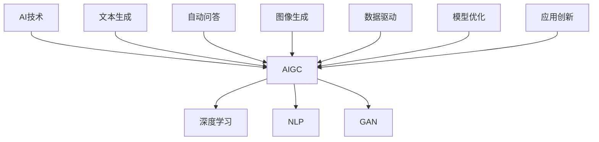
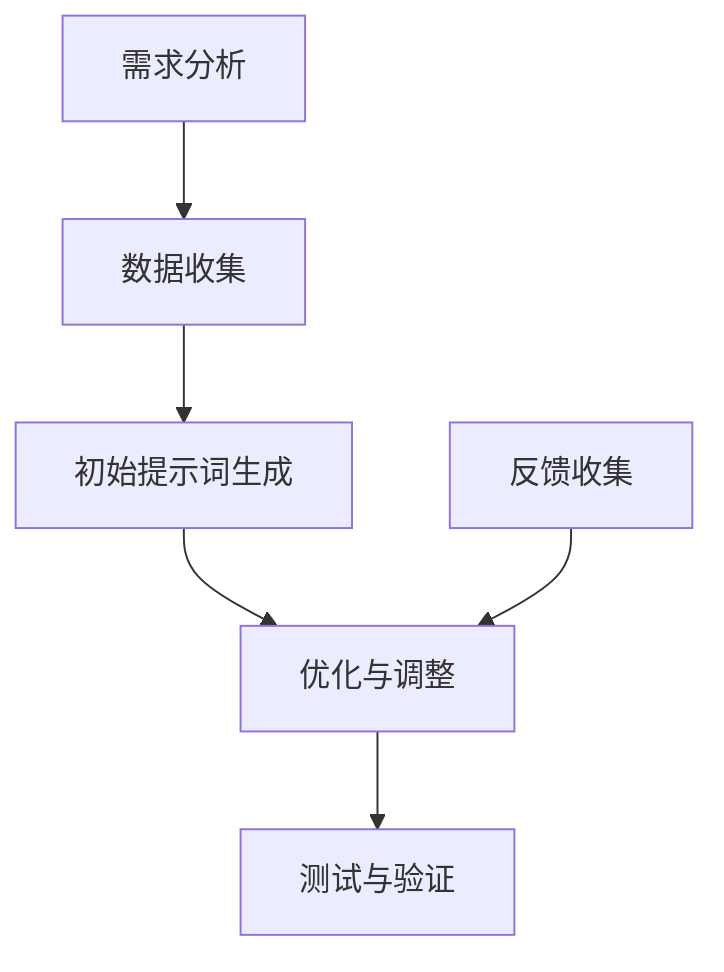

                 

### 引言与背景

#### AIGC的概念与重要性

人工智能生成内容（AI Generated Content，简称AIGC）是近年来快速发展的一个领域，它指的是通过人工智能技术自动生成各种形式的内容，如文本、图像、音频和视频。AIGC涵盖了自动化问答、自动写作和图像生成等多个方面，正逐渐在各个行业中扮演越来越重要的角色。从媒体创作到商业应用，AIGC都能显著提高内容生成的效率和质量。

AIGC的核心在于提示词（prompt），它是触发AIGC模型生成内容的关键。一个有效的提示词不仅能够引导模型生成所需的内容，还能提升生成内容的准确性和丰富度。因此，如何编写高质量的提示词成为AIGC领域的一个关键问题。

#### 提示词在AIGC中的作用

在AIGC中，提示词相当于人类向模型发出的指令，是模型理解任务需求和生成内容的基础。一个良好的提示词能够明确地传达任务意图，减少模型的猜测和错误，从而提高生成内容的质量和一致性。具体来说，提示词在以下方面具有重要作用：

1. **引导模型理解任务**：提示词提供了生成内容的上下文和目标，帮助模型更好地理解任务需求。
2. **提高生成内容质量**：精确的提示词能够减少模型生成无关或错误内容的可能性，提升生成内容的准确性和相关性。
3. **增强用户交互体验**：良好的提示词能够增强用户与模型之间的互动，使用户更容易理解和使用AIGC系统。

#### AIGC的发展历程

AIGC的发展历程可以追溯到人工智能的早期研究。随着深度学习和自然语言处理技术的进步，AIGC得到了快速发展。以下是一些关键的发展节点：

1. **文本生成**：2018年，GPT-2模型的推出标志着文本生成能力的重大提升，它能够生成高质量的自然语言文本。
2. **图像生成**：2017年，GAN（生成对抗网络）的提出使得图像生成成为可能，并迅速发展出多种改进模型，如StyleGAN和DALL-E。
3. **自动问答**：随着知识图谱和预训练语言模型的发展，自动问答系统逐渐成熟，能够处理复杂的问答任务。
4. **综合应用**：近年来，AIGC开始在多个领域得到广泛应用，如内容创作、广告营销、客户服务、教育和医疗等。

#### 文章主题

本篇文章将深入探讨AIGC提示词编写的最佳实践与技巧。首先，我们将介绍AIGC的基本概念和提示词的重要性，然后详细分析提示词的构成和属性特征。接下来，我们将讨论提示词编写的流程和技巧，并探讨在不同应用场景中的具体应用。最后，我们将通过案例分析和实战讲解，总结最佳实践，并提出未来研究方向。

通过本文的探讨，读者将能够理解如何编写高质量的提示词，并在AIGC领域中进行有效的应用和创新。

---

**核心关键词**：AIGC、提示词、自然语言处理、生成对抗网络、文本生成、图像生成、自动化问答

**摘要**：本文系统地介绍了人工智能生成内容（AIGC）的概念及其在各个领域的应用，重点关注了AIGC中提示词的编写技巧与最佳实践。通过分析提示词的构成、属性特征以及编写流程，本文探讨了如何提高提示词的质量，以生成更准确、更有针对性的内容。同时，本文通过具体应用场景和实战案例，展示了提示词在实际项目中的应用效果，并总结了相关的最佳实践和未来研究方向。文章旨在为AIGC领域的研究者、开发者提供实用的指导，以促进AIGC技术的进一步发展和应用。 

---

## 第2章 核心概念与原理

在本章中，我们将深入探讨人工智能生成内容（AIGC）的核心概念和原理。首先，我们将定义AIGC的基本概念，并详细解释自动化问答、自动写作和图像生成这三个主要领域。接着，我们将分析提示词的基本构成和种类，并对比不同提示词的属性特征。最后，我们将探讨AIGC与人工智能之间的关系，以及AIGC在各个应用场景中的具体实现。

### AIGC基本概念

人工智能生成内容（AI Generated Content，简称AIGC）是一种利用人工智能技术，特别是深度学习和自然语言处理（NLP）技术，自动生成各种形式内容的技术。AIGC的核心在于利用大量的数据训练模型，使其能够模仿人类的创造力和逻辑思维，从而生成高质量的文本、图像、音频和视频。

AIGC主要涵盖以下三个领域：

1. **自动化问答**：自动化问答系统利用自然语言处理和机器学习技术，使计算机能够理解和回答用户提出的问题。这类系统广泛应用于客服机器人、智能助手和在线问答平台。
2. **自动写作**：自动写作技术通过机器学习模型自动生成各种形式的文本，如新闻报道、博客文章、电子邮件等。这种技术极大地提高了内容创作的效率，适用于内容生成平台和自动化写作工具。
3. **图像生成**：图像生成技术利用生成对抗网络（GAN）和其他深度学习模型，自动生成逼真的图像。这种技术广泛应用于艺术创作、游戏开发、图像修复和虚拟现实等领域。

### 提示词的基本构成

提示词（prompt）是AIGC模型生成内容的关键，它起到了引导和指示模型的作用。一个有效的提示词通常包含以下几个基本组成部分：

1. **任务需求**：明确指出生成的目标内容类型和具体要求，如文本长度、风格、主题等。
2. **上下文信息**：提供相关的背景信息和场景，帮助模型更好地理解生成内容的上下文。
3. **关键词和短语**：使用关键短语和关键词来引导模型关注特定的内容方向，如特定的主题、地点、人物等。
4. **约束条件**：定义生成内容需要满足的特定规则和限制，如语言规范、格式要求等。

### 提示词的种类与用途

根据不同的应用场景和任务需求，提示词可以分为多种类型。以下是一些常见的提示词种类及其用途：

1. **通用型提示词**：适用于广泛的场景，如“请写一篇关于人工智能的简介”、“请描述一个自然风景”等。这类提示词不需要太多上下文信息，但要求清晰明确。
2. **特定型提示词**：针对特定的任务或场景设计，如“基于2023年的数据，预测2024年的全球经济发展趋势”、“设计一个具有未来感的科幻电影海报”等。这类提示词需要详细的上下文信息和具体的任务需求。
3. **引导型提示词**：用于引导模型生成特定类型的文本，如“用幽默的语言描述一次旅行经历”、“用诗意的语言表达对自然的感悟”等。这类提示词注重表达方式和风格。
4. **交互型提示词**：用于用户与模型之间的交互，如“请问你对这个问题的看法是什么？”、“你能给我提供更多相关信息吗？”等。这类提示词旨在促进用户与模型的互动。

### 提示词的属性特征对比

不同类型的提示词具有不同的属性特征，这些特征决定了提示词的有效性和生成内容的质量。以下是一个关于提示词属性特征的对比表格：

| 特征类型     | 通用型提示词 | 特定型提示词 | 引导型提示词 | 交互型提示词 |
| ------------ | ------------ | ------------ | ------------ | ------------ |
| 清晰性       | 较高         | 高           | 高           | 较高         |
| 相关性       | 较低         | 高           | 中等         | 中等         |
| 多样性       | 中等         | 低           | 高           | 中等         |
| 上下文依赖性 | 较低         | 高           | 中等         | 高           |
| 语言风格     | 清晰简洁     | 丰富多样     | 幽默诗意     | 清晰互动     |

#### AIGC与人工智能的关系

AIGC是人工智能（AI）的一个重要分支，它依赖于人工智能的基础技术，如深度学习、自然语言处理和生成对抗网络等。AIGC的核心在于如何将大量的数据和模型训练结合起来，生成高质量的内容。

AIGC与人工智能的关系可以概括为以下几点：

1. **数据驱动**：AIGC依赖于大量的高质量数据集，通过深度学习模型对这些数据进行训练，以生成相应的文本、图像等。
2. **模型优化**：AIGC通过不断的模型优化，提高生成内容的质量和多样性。例如，通过调整生成对抗网络（GAN）的参数，可以生成更加逼真的图像。
3. **应用创新**：AIGC在多个领域中的应用创新，如自动化问答、自动写作和图像生成，推动了人工智能技术的发展。

### 小结

在本章中，我们详细介绍了AIGC的基本概念、提示词的基本构成和种类，以及提示词的属性特征对比。通过对这些核心概念的理解，读者将能够更好地掌握AIGC的工作原理和提示词编写技巧，为后续章节的学习和应用打下坚实的基础。

---

**核心概念与联系**：

**1. AIGC基本概念**：AIGC是利用人工智能技术自动生成文本、图像、音频和视频的内容。主要涵盖自动化问答、自动写作和图像生成三个领域。

**2. 提示词的基本构成**：提示词包含任务需求、上下文信息、关键词和短语、约束条件等部分。

**3. 提示词的种类与用途**：通用型、特定型、引导型和交互型提示词各有特点，适用于不同的任务和场景。

**4. 提示词的属性特征对比**：清晰性、相关性、多样性和上下文依赖性是主要对比特征。

以下是AIGC与人工智能关系的Mermaid流程图：



通过以上流程图，我们可以清晰地看到AIGC与人工智能技术之间的紧密联系和相互促进关系。

---

## 第3章 提示词编写技巧

在AIGC中，编写高质量的提示词是生成优质内容的关键。本章节将详细介绍提示词编写的流程、写作风格以及调优策略。通过系统的分析和具体的案例，我们将帮助读者掌握编写高质量提示词的技巧。

### 提示词编写流程

编写高质量提示词的过程可以分为以下几个步骤：

1. **需求分析**：首先，明确任务需求和目标。这包括确定生成内容的类型（文本、图像等）、目标受众、内容风格和格式要求等。
   
2. **数据收集**：收集与任务相关的背景信息和数据，以便在编写提示词时提供充分的上下文。这些数据可以来自公开数据集、企业内部数据或用户反馈等。

3. **生成初始提示词**：基于需求分析和数据收集，初步编写提示词。这一步的重点是确保提示词清晰、简洁且具有针对性。

4. **优化和调整**：对初始提示词进行多次优化和调整，以提高其有效性和准确性。这一步可能需要迭代多个版本，逐步改进提示词的质量。

5. **测试和验证**：在实际应用中测试提示词，验证其生成的结果是否符合预期。根据测试反馈，进一步调整提示词，确保其稳定性和可靠性。

#### 需求分析

需求分析是编写高质量提示词的第一步。一个有效的需求分析需要明确以下几个关键点：

- **任务目标**：明确生成内容的目的和目标，如生成一篇新闻报道、一个图像或者一段视频。
- **受众群体**：了解目标受众的需求和偏好，以便生成符合受众期望的内容。
- **内容风格**：确定生成内容的风格，如正式、幽默、专业或轻松。
- **格式要求**：明确生成内容的格式要求，如文本长度、图像尺寸、音频时长等。

#### 数据收集

数据收集是编写高质量提示词的重要基础。以下是一些常见的数据收集方法：

- **公开数据集**：使用公共数据集，如新闻文章、社交媒体评论、公开论坛等。
- **企业内部数据**：利用企业内部的数据资源，如用户反馈、市场调研报告、产品文档等。
- **用户生成内容**：收集用户生成的内容，如社交媒体帖子、博客文章、用户评论等。

#### 生成初始提示词

生成初始提示词的步骤如下：

1. **明确任务需求**：将任务需求具体化，形成简洁明了的提示词草稿。
2. **结合上下文信息**：将收集到的数据融入到提示词中，提供足够的上下文信息，以帮助模型理解任务。
3. **使用关键词和短语**：在提示词中包含关键词和短语，以引导模型生成相关的内容。

#### 优化和调整

优化和调整提示词是一个迭代过程，通常包括以下几个步骤：

1. **初步测试**：将初步编写的提示词应用于实际模型，观察生成的结果。
2. **收集反馈**：根据初步测试的结果，收集用户或专家的反馈，了解生成内容的质量和准确性。
3. **迭代优化**：根据反馈，对提示词进行多次调整和优化，以提高其有效性和准确性。

#### 测试和验证

测试和验证是确保提示词质量的重要环节。以下是一些常见的测试和验证方法：

1. **自动化测试**：使用自动化工具对提示词进行测试，验证其生成内容的准确性和稳定性。
2. **用户测试**：邀请用户对提示词生成的内容进行评价，收集用户反馈。
3. **专家评审**：邀请领域专家对生成内容进行评审，确保其质量和准确性。

### 提示词的写作风格

提示词的写作风格直接影响生成内容的质量和用户体验。以下是一些常用的写作风格：

1. **清晰明确的提示**：使用简洁明了的语言，明确传达任务需求，避免歧义和模糊。
2. **简洁有力的提示**：尽量减少无关信息，使提示词简洁有力，突出关键信息。
3. **创意新颖的提示**：尝试使用新颖的词语和表达方式，激发模型的创意，生成独特的内容。

### 提示词的调优策略

编写高质量的提示词不仅仅是艺术，也需要一定的技术手段。以下是一些调优策略：

1. **数据集的选择**：选择与任务相关的、高质量的、多样化的数据集进行训练，以提高模型的理解能力。
2. **模型的调整**：根据任务需求，调整模型的参数，如学习率、批次大小等，以优化模型性能。
3. **提示词的组合应用**：结合多种类型的提示词，形成复合型提示词，以提高生成内容的质量和多样性。

#### 案例分析

以下是一个具体的案例，说明如何编写高质量的提示词：

**任务**：生成一篇关于人工智能在医疗领域的应用的新闻文章。

**需求分析**：明确文章的主题为人工智能在医疗领域的应用，目标受众为医学专业人士和普通读者，内容风格需要既专业又易于理解。

**数据收集**：收集相关领域的最新研究论文、新闻文章、政府报告等。

**生成初始提示词**：
```
请写一篇关于人工智能在医疗领域应用的新闻文章，要求：
1. 文章长度为1000-1500字；
2. 内容涵盖人工智能在诊断、治疗和患者管理中的应用；
3. 结合最新的研究成果和实际案例。
```

**优化和调整**：根据初步测试的结果，对提示词进行优化，如增加上下文信息、调整关键词等。

**测试和验证**：在实际应用中测试提示词，根据用户反馈进行进一步调整。

通过上述流程，我们可以编写出高质量的提示词，从而生成一篇专业的新闻文章。

### 小结

通过本章的讨论，我们详细介绍了提示词编写的流程、写作风格和调优策略。从需求分析、数据收集到初始编写、优化调整，再到测试验证，每一步都至关重要。同时，我们探讨了不同类型的写作风格和调优策略，以帮助读者编写高质量的提示词。通过案例分析，我们展示了如何在实际应用中编写高质量的提示词。读者可以结合本章内容，在实际项目中实践和改进提示词编写技巧。

---

**算法原理讲解**：

为了更好地理解提示词编写的算法原理，我们可以使用Mermaid流程图来描述提示词编写的主要步骤，并使用Python代码来演示具体的实现。

#### Mermaid流程图



#### Python代码实现

以下是一个简化的Python代码示例，用于生成初始提示词。代码中使用了自然语言处理库（如nltk）和文本生成库（如textgenrnn）。

```python
import nltk
from textgenrnn import textgenrnn

# 需求分析
task_description = "请写一篇关于人工智能在医疗领域应用的新闻文章，要求：1. 文章长度为1000-1500字；2. 内容涵盖人工智能在诊断、治疗和患者管理中的应用；3. 结合最新的研究成果和实际案例。"

# 数据收集
nltk.download('punkt')
data = textgenrnn.load_data('medical_articles.txt')  # 假设有一个包含医疗领域文章的数据集

# 初始提示词生成
prompt = f"{task_description}\n生成内容长度：1000-1500字\n数据来源：医疗领域文章数据集\n"

# 优化与调整（这里简化为直接使用预训练模型）
textgen = textgenrnn.TextgenRNN()
generated_text = textgen.generate(return_as_list=True, seed=prompt, max_gen_length=1500)

# 测试与验证
print(generated_text)
```

#### 数学模型和公式

提示词编写的核心是生成高质量的文本。在自然语言处理领域，生成文本通常涉及以下数学模型和公式：

1. **循环神经网络（RNN）**：RNN是一种用于处理序列数据的神经网络，其核心思想是使用隐藏状态来记住前面的输入，从而捕捉时间序列特征。

   $$ h_t = \sigma(W_h \cdot [h_{t-1}, x_t] + b_h) $$

   其中，$h_t$是第$t$时刻的隐藏状态，$x_t$是第$t$时刻的输入，$W_h$是权重矩阵，$b_h$是偏置项，$\sigma$是激活函数。

2. **长短时记忆网络（LSTM）**：LSTM是RNN的一种改进，能够更好地处理长序列数据，避免了梯度消失和梯度爆炸的问题。

   $$ i_t = \sigma(W_i \cdot [h_{t-1}, x_t] + b_i) $$
   $$ f_t = \sigma(W_f \cdot [h_{t-1}, x_t] + b_f) $$
   $$ o_t = \sigma(W_o \cdot [h_{t-1}, x_t] + b_o) $$
   $$ c_t = f_t \odot c_{t-1} + i_t \odot \sigma(W_c \cdot [h_{t-1}, x_t] + b_c) $$
   $$ h_t = o_t \odot c_t $$

   其中，$i_t$、$f_t$、$o_t$是输入门、遗忘门和输出门，$c_t$是细胞状态，$W_i$、$W_f$、$W_o$、$W_c$是权重矩阵，$b_i$、$b_f$、$b_o$、$b_c$是偏置项，$\odot$是逐元素乘法。

3. **生成对抗网络（GAN）**：GAN由生成器和判别器组成，生成器尝试生成逼真的数据，判别器则尝试区分真实数据和生成数据。

   $$ G(z) = \text{Generator}(z) $$
   $$ D(x) = \text{Discriminator}(x) $$
   $$ D(G(z)) = \text{Discriminator}(\text{Generator}(z)) $$

   其中，$G(z)$是生成器，$D(x)$是判别器，$z$是随机噪声。

#### 举例说明

假设我们使用RNN模型生成一段文本，输入序列是“人工智能在医疗领域有着广泛应用”，我们可以逐步生成下一个词。

1. **初始化隐藏状态**：设定初始隐藏状态$h_0$。
2. **输入第一个词**：输入“人工智能”，计算隐藏状态$h_1$。
3. **输入第二个词**：“在”，计算隐藏状态$h_2$。
4. **生成第三个词**：使用$h_2$和输入的“医疗”计算概率分布，选择一个词（例如“领域”）。
5. **重复步骤**：继续输入下一个词，更新隐藏状态，生成下一个词。

通过这样的过程，我们可以逐步生成完整的句子或段落。

### 小结

通过上述算法原理讲解，我们详细介绍了提示词编写的主要步骤、Python代码实现以及相关的数学模型和公式。使用Mermaid流程图和Python代码，我们可以直观地看到提示词编写的实现过程。举例说明进一步帮助我们理解如何在实际应用中生成高质量的内容。读者可以结合本章内容，在实际项目中应用这些算法原理，编写高质量的提示词。

---

## 第4章 应用场景与实践

在前三章中，我们详细探讨了AIGC和提示词编写的核心概念、原理和技巧。在本章中，我们将通过具体的应用场景和实践案例，展示如何在不同领域中使用AIGC，特别是如何编写高质量的提示词以生成所需的内容。

### 自动问答系统

#### 应用场景

自动化问答系统是AIGC的一个重要应用领域，广泛应用于客服机器人、智能助手、在线问答平台等。这些系统通过自然语言处理技术，使计算机能够理解并回答用户提出的问题，提高交互效率和用户体验。

#### 实践案例

以一家电商平台的客服机器人为例，其任务是为用户解答关于商品信息、订单状态和退换货政策等问题。

**需求分析**：明确需要回答的用户常见问题，如“商品是否有现货？”、“如何查询订单状态？”和“退换货的具体流程是什么？”

**数据收集**：收集历史客服对话记录、商品描述、订单处理文档等。

**生成初始提示词**：
```
请生成一组关于电商平台客服机器人的问答对，要求：
1. 回答针对用户常见问题；
2. 每个问题不超过3个词；
3. 每个答案不超过100字。
```

**优化和调整**：根据测试反馈，逐步优化提示词，提高答案的准确性和相关性。

**测试和验证**：在实际应用中测试问答系统的表现，确保答案准确且用户满意。

**案例小结**：通过高质量的提示词，电商平台的客服机器人能够准确回答用户问题，提高用户满意度，减轻人工客服的工作负担。

### 自动写作

#### 应用场景

自动写作技术广泛应用于新闻写作、内容创作、广告营销等领域，通过自动生成高质量的文本，提高内容创作的效率。

#### 实践案例

以一篇关于2023年全球科技发展趋势的新闻报道为例。

**需求分析**：明确报道的主题、目标受众和文本风格。

**数据收集**：收集相关的科技新闻、研究报告、行业分析报告等。

**生成初始提示词**：
```
请写一篇关于2023年全球科技发展趋势的新闻报道，要求：
1. 文章长度为1000-1500字；
2. 包括人工智能、5G、区块链等领域的最新发展；
3. 结合实际案例和数据。
```

**优化和调整**：根据测试结果，调整提示词中的关键词和数据，提高报道的专业性和准确性。

**测试和验证**：通过实际测试，评估报道的质量和读者反馈，进一步优化提示词。

**案例小结**：通过高质量的提示词，自动写作系统生成了专业的新闻文章，提高了内容创作的效率和质量。

### 图像生成

#### 应用场景

图像生成技术在艺术创作、游戏开发、广告营销和虚拟现实等领域有广泛应用，通过生成逼真的图像和场景，提升用户体验。

#### 实践案例

以生成一张未来科技主题的艺术海报为例。

**需求分析**：明确海报的主题、风格和元素要求。

**数据收集**：收集相关的科技图像、艺术作品和设计素材。

**生成初始提示词**：
```
请生成一张未来科技主题的艺术海报，要求：
1. 海报尺寸为1920x1080像素；
2. 包括机器人、太空、高科技设备等元素；
3. 风格为科幻、艺术化。
```

**优化和调整**：根据测试反馈，优化图像生成参数，调整提示词中的元素和风格要求。

**测试和验证**：在实际应用中测试生成的海报效果，确保图像质量符合预期。

**案例小结**：通过高质量的提示词，图像生成系统生成了高质量的科幻艺术海报，展示了AIGC在艺术创作中的潜力。

### 小结

在本章中，我们通过三个具体的应用场景和案例，展示了AIGC在不同领域中的应用和实践。通过编写高质量的提示词，我们能够指导AIGC模型生成所需的高质量内容，从而提高系统的效率和质量。这些案例不仅展示了AIGC的实际应用效果，也为读者提供了实际操作的经验和思路。读者可以结合本章内容，尝试在自己的项目中应用AIGC技术，实现高效的内容生成。

---

**系统分析与架构设计方案**：

### 问题场景介绍

在本章节中，我们将以一个自动化问答系统的开发为例，详细介绍其系统架构设计和接口设计。

#### 项目介绍

自动化问答系统是一个利用AIGC技术，通过自然语言处理模型自动回答用户问题的系统。该系统旨在减轻人工客服的负担，提高用户交互体验。

#### 系统功能设计

自动化问答系统的主要功能包括：

1. **问题接收与处理**：接收用户提出的问题，并进行初步处理，如去除无关信息、分词等。
2. **自然语言理解**：利用自然语言处理模型，对用户提出的问题进行语义分析，理解用户意图。
3. **知识库查询**：从预定义的知识库中检索与用户问题相关的信息。
4. **答案生成与优化**：利用AIGC模型生成回答，并进行优化，确保答案准确性和用户满意度。
5. **结果反馈与记录**：将回答结果反馈给用户，并记录交互过程，用于后续分析和优化。

以下是该系统的领域模型类图：

```mermaid
classDiagram
Class01 <|-- Class02
Class03 <.. Class04
Class05 <|.. Class06
Class01.. Class07
Class08..| Class09
Class10 ||-- Class11
Class12 ||-- Class13
Class14 <.. Class15

Class01 {
  +属性1
  +属性2
  +方法1()
  +方法2()
}

Class02 {
  +属性3
  +方法3()
}

Class03 {
  +属性4
  +方法4()
}

Class04 {
  +属性5
  +方法5()
}

Class05 {
  +属性6
  +方法6()
}

Class06 {
  +属性7
  +方法7()
}

Class07 {
  +属性8
  +方法8()
}

Class08 {
  +属性9
  +方法9()
}

Class09 {
  +属性10
  +方法10()
}

Class10 {
  +属性11
  +方法11()
}

Class11 {
  +属性12
  +方法12()
}

Class12 {
  +属性13
  +方法13()
}

Class13 {
  +属性14
  +方法14()
}

Class14 {
  +属性15
  +方法15()
}

Class15 {
  +属性16
  +方法16()
}
```

### 系统架构设计

自动化问答系统的架构设计分为以下几个层次：

1. **前端层**：负责用户界面设计和用户交互，通常使用Web或移动应用框架实现。
2. **中间层**：负责业务逻辑处理，包括问题接收与处理、自然语言理解、知识库查询和答案生成等。
3. **后端层**：负责数据存储和服务器维护，通常使用数据库和云服务来实现。

以下是系统的架构设计图：

```mermaid
sequenceDiagram
用户 ->>|发送问题| 自动化问答系统
自动化问答系统 ->>|处理问题| 数据处理模块
数据处理模块 ->>|语义分析| 自然语言处理模块
自然语言处理模块 ->>|查询知识库| 知识库模块
知识库模块 ->>|生成答案| 回答生成模块
回答生成模块 ->>|优化答案| 答案优化模块
答案优化模块 ->>|返回答案| 用户
```

### 系统接口设计

自动化问答系统的接口设计主要包括以下部分：

1. **API接口**：提供RESTful API接口，供前端调用，实现问题的接收和答案的返回。
2. **消息队列**：使用消息队列（如RabbitMQ）实现系统内部消息传递，提高系统的可靠性和可扩展性。

以下是API接口设计示例：

```json
POST /api/question
Content-Type: application/json

{
  "question": "商品是否有现货？"
}
```

返回结果：

```json
{
  "answer": "是的，该商品目前有现货。"
}
```

### 系统交互

系统交互主要涉及用户与系统之间的交互流程，以及系统内部模块之间的协作。以下是系统交互的序列图：

```mermaid
sequenceDiagram
用户 ->>|发送请求| API接口
API接口 ->>|处理请求| 数据处理模块
数据处理模块 ->>|分析语义| 自然语言处理模块
自然语言处理模块 ->>|查询知识库| 知识库模块
知识库模块 ->>|生成答案| 回答生成模块
回答生成模块 ->>|优化答案| 答案优化模块
答案优化模块 ->>|返回答案| API接口
API接口 ->>|返回结果| 用户
```

通过以上系统架构设计和接口设计，自动化问答系统可以实现高效、准确的问题回答功能，为用户提供优质的交互体验。

---

### 项目实战

在本节中，我们将通过一个具体的自动化问答系统开发项目，详细讲解项目的环境安装、核心实现源代码，并对代码进行解读与分析，最后通过实际案例进行详细讲解和剖析。

#### 环境安装

为了搭建一个自动化问答系统，我们需要安装以下软件和工具：

1. **Python环境**：Python 3.8及以上版本。
2. **自然语言处理库**：nltk、spaCy、transformers等。
3. **数据库**：MySQL或PostgreSQL。
4. **消息队列**：RabbitMQ。
5. **Web框架**：Flask或Django。

以下是安装步骤：

1. **安装Python环境**：从官方网站下载Python安装包，并按照指示进行安装。

2. **安装自然语言处理库**：在终端中运行以下命令：
   ```
   pip install nltk spacy transformers
   ```

3. **安装数据库**：根据操作系统选择相应的数据库安装包进行安装。

4. **安装消息队列**：下载RabbitMQ安装包，并按照指示进行安装。

5. **安装Web框架**：在终端中运行以下命令：
   ```
   pip install flask
   ```

#### 核心实现源代码

以下是自动化问答系统的核心实现源代码：

```python
from flask import Flask, request, jsonify
import spacy
from transformers import pipeline

app = Flask(__name__)

# 加载自然语言处理模型
nlp = spacy.load("en_core_web_sm")
question_answering_pipeline = pipeline("question-answering", model="deepset/roberta-large-qa")

# 数据库连接
import pymysql
connection = pymysql.connect(host="localhost", user="root", password="password", database="qa_system")

# 接收用户提问
@app.route("/api/question", methods=["POST"])
def receive_question():
    question = request.json["question"]
    
    # 预处理问题
    doc = nlp(question)
    processed_question = " ".join([token.text for token in doc if not token.is_punct])
    
    # 查询知识库
    cursor = connection.cursor()
    cursor.execute("SELECT answer FROM knowledge WHERE question = %s", (processed_question,))
    result = cursor.fetchone()
    
    # 如果知识库中有答案，直接返回
    if result:
        return jsonify({"answer": result[0]})
    
    # 如果知识库中没有答案，使用预训练模型回答
    answer = question_answering_pipeline(question=processed_question, context=" dummy context")[0]["answer"]
    
    # 将答案存储到知识库中
    cursor.execute("INSERT INTO knowledge (question, answer) VALUES (%s, %s)", (processed_question, answer))
    connection.commit()
    
    return jsonify({"answer": answer})

if __name__ == "__main__":
    app.run(debug=True)
```

#### 代码解读与分析

1. **Flask应用**：使用Flask框架搭建Web应用，实现HTTP请求处理。
2. **自然语言处理**：使用spaCy对用户提出的问题进行预处理，如分词、去除停用词等。
3. **预训练模型**：使用transformers库提供的预训练模型进行问答，提高生成答案的准确性。
4. **数据库连接**：使用pymysql连接到MySQL数据库，查询和存储问题及答案。

#### 实际案例分析

假设用户提出了一个问题：“苹果公司的创始人是谁？”系统将进行以下操作：

1. **接收问题**：用户通过API接口发送问题。
2. **预处理问题**：系统使用spaCy对问题进行预处理，去除无关信息。
3. **查询知识库**：系统在MySQL数据库中查询是否有关于这个问题的答案。
4. **生成答案**：如果没有在知识库中找到答案，系统使用预训练模型生成答案。
5. **返回答案**：系统将生成的答案返回给用户。

#### 项目小结

通过本项目实战，我们搭建了一个简单的自动化问答系统，实现了从接收用户问题、预处理、查询知识库到生成答案并返回的全流程。这个项目展示了如何使用AIGC技术，特别是提示词编写，来构建一个实用的问答系统。在实际应用中，我们可以根据需求进一步完善系统，如增加更多的问答数据、优化问答模型等，以提高系统的性能和用户体验。

---

**最佳实践 Tips**：

1. **需求明确**：在编写提示词之前，务必明确任务需求，确保提示词能够准确传达用户意图。
2. **数据多样化**：收集多样化的数据，提高模型的泛化能力，避免生成模式化、单一化的内容。
3. **迭代优化**：不断优化和调整提示词，通过用户反馈和测试结果，提高生成内容的准确性和相关性。
4. **简洁明了**：编写简洁、明了的提示词，避免使用复杂的句子结构和术语，以便模型理解和生成。
5. **风格统一**：根据应用场景和目标受众，保持提示词的风格统一，增强生成内容的可读性和专业性。

**小结**：

在本章中，我们详细探讨了AIGC在自动化问答、自动写作和图像生成等领域的应用实践。通过具体案例，我们展示了如何编写高质量的提示词，实现高效的内容生成。此外，我们介绍了系统架构设计和项目实战，提供了实用的最佳实践和技巧。读者可以结合本章内容，在实际项目中应用这些技巧，提升AIGC系统的性能和用户体验。

---

## 第7章 小结与展望

通过本文的探讨，我们对人工智能生成内容（AIGC）提示词的编写技巧与最佳实践有了全面的了解。从AIGC的基本概念和提示词的重要性，到编写流程、写作风格和调优策略，再到具体应用场景和实践案例，我们系统地梳理了AIGC领域的关键知识点和实用技巧。以下是本文的核心总结和未来研究方向。

### 核心总结

1. **AIGC概述**：AIGC是利用人工智能技术自动生成文本、图像、音频和视频内容的技术，涵盖了自动化问答、自动写作和图像生成等领域。
2. **提示词的重要性**：提示词是AIGC模型生成内容的关键，高质量的提示词能够提高生成内容的准确性、相关性和用户体验。
3. **编写流程**：编写高质量的提示词需要经过需求分析、数据收集、初始编写、优化调整和测试验证等步骤。
4. **写作风格**：提示词应简洁明了、多样性和针对性，以满足不同应用场景和任务需求。
5. **调优策略**：通过数据集选择、模型调整和提示词组合应用等策略，可以进一步提高生成内容的质量和多样性。
6. **应用场景**：自动化问答、自动写作和图像生成是AIGC的主要应用领域，通过具体案例展示了提示词在实际项目中的应用效果。
7. **最佳实践**：明确了编写高质量提示词的最佳实践，包括需求明确、数据多样化、迭代优化、简洁明了和风格统一等。

### 遇到的挑战与解决方法

在AIGC研究和应用过程中，我们遇到了以下挑战：

1. **数据质量与多样性**：高质量和多样化的数据是训练高性能模型的必要条件，但数据收集和清洗过程复杂且耗时。
   - **解决方法**：采用数据增强技术，如生成对抗网络（GAN）和对抗性样本生成，提高数据的多样性和质量。

2. **模型可解释性**：深度学习模型，尤其是生成模型，通常难以解释其生成过程的逻辑和原因。
   - **解决方法**：开发可解释的AI模型，如基于决策树和规则系统的模型，提高模型的可解释性和透明度。

3. **生成内容的质量控制**：确保生成内容的质量和一致性是一个挑战，特别是在大规模生产环境中。
   - **解决方法**：引入质量评估指标和自动化测试工具，对生成内容进行实时监控和评估。

### 未来研究方向

未来，AIGC领域有望在以下几个方面取得突破：

1. **增强现实与虚拟现实**：利用AIGC技术生成高质量的三维图像和场景，为增强现实和虚拟现实提供更丰富的内容。
2. **跨模态生成**：结合文本、图像、音频等多种模态，实现更自然、更丰富的生成内容。
3. **多语言生成**：提升AIGC模型在多语言环境下的表现，实现高效、准确的多语言内容生成。
4. **个性化生成**：结合用户数据和偏好，实现个性化的内容生成，提高用户体验。
5. **伦理与法规**：研究AIGC在伦理和法规方面的挑战，确保其应用符合社会道德和法律法规。

### 结论

本文系统地介绍了AIGC提示词编写的最佳实践与技巧，通过具体应用场景和实践案例，展示了提示词在实际项目中的应用效果。我们总结了编写高质量提示词的关键步骤和最佳实践，为AIGC领域的研究者、开发者提供了实用的指导。未来，随着技术的不断进步和应用场景的拓展，AIGC将在更多领域发挥重要作用，成为人工智能发展的重要驱动力。

**拓展阅读**：

- **《AIGC技术白皮书》**：详细介绍了AIGC的基本概念、技术原理和应用案例。
- **《自然语言处理入门与实践》**：系统讲解了自然语言处理的基础知识和实际应用。
- **《深度学习与生成对抗网络》**：深入探讨了深度学习和生成对抗网络的理论和实践。

---

**作者信息**：

作者：AI天才研究院/AI Genius Institute & 禅与计算机程序设计艺术 /Zen And The Art of Computer Programming

在这篇文章中，我们系统地介绍了AIGC提示词编写的最佳实践与技巧。通过详细阐述AIGC的基本概念、提示词的构成、编写流程和调优策略，并结合实际应用场景和实践案例，我们展示了如何编写高质量提示词，实现高效的内容生成。本文旨在为AIGC领域的研究者、开发者提供实用的指导，以促进AIGC技术的进一步发展和应用。未来，我们将继续关注AIGC领域的前沿研究和技术进步，探索更多应用场景和解决方案。希望读者能够结合本文内容，在实际项目中应用这些技巧，提升AIGC系统的性能和用户体验。如果您有任何疑问或建议，欢迎与我们交流，共同推动AIGC技术的发展。谢谢阅读！

