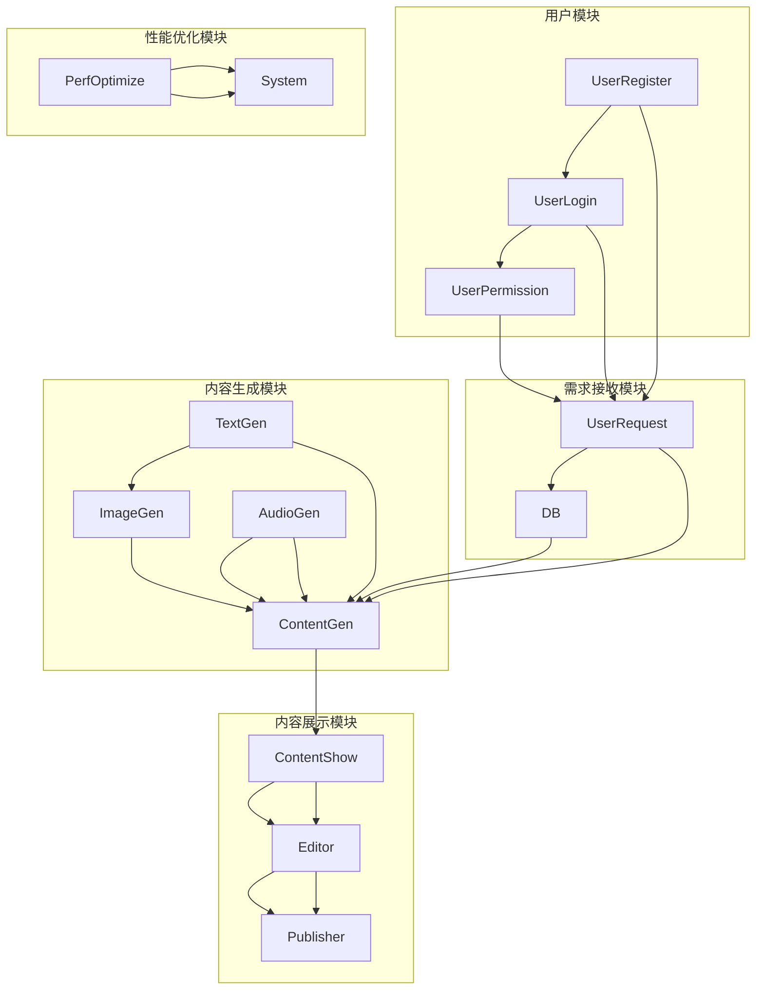
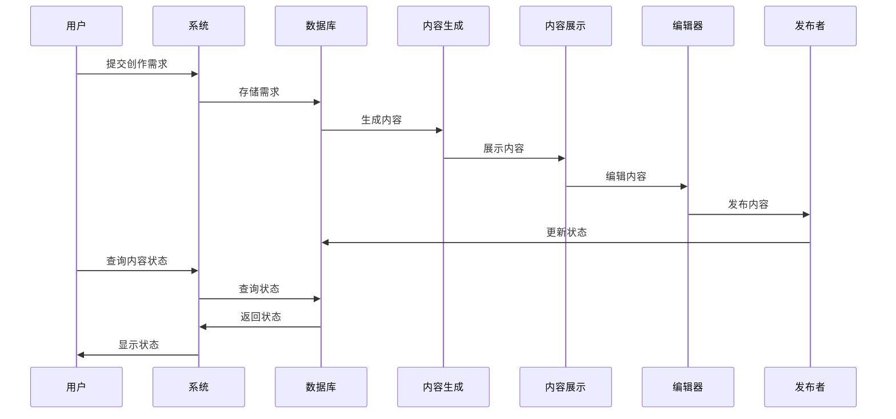
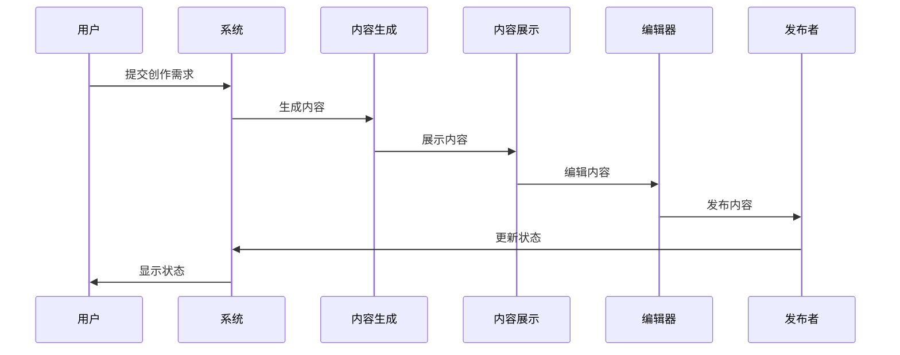

                 

# AIGC提示词编写：从基础到高级的全面攻略

## 关键词
- AIGC
- 提示词编写
- 深度学习
- 自然语言处理
- 生成模型
- 多模态学习

## 摘要
本文将深入探讨AIGC（AI-Generated Content）的提示词编写，从基础到高级，全面介绍其原理、方法、技巧和应用。通过详细分析AIGC技术的核心概念、联系，以及算法原理和系统架构设计，本文旨在帮助读者全面掌握AIGC技术，并在实际项目中有效应用。

----------------------------------------------------------------

## 第一部分：背景介绍

### 1.1 问题背景

随着人工智能技术的快速发展，AIGC（AI-Generated Content）逐渐成为内容创作领域的重要趋势。AIGC指的是通过人工智能技术自动生成内容，包括文本、图像、音频等多种形式。这种技术不仅提高了内容创作的效率，也为各种行业带来了新的可能性。

在当前的互联网时代，高质量的内容创作需求巨大，但传统的手动内容创作方式效率低下，难以满足日益增长的需求。AIGC技术的出现为解决这个问题提供了新的思路。通过学习大量的数据，AIGC模型可以自动生成符合人类语言逻辑和审美需求的内容，大大降低了内容创作的门槛。

### 1.2 问题描述

尽管AIGC技术具有巨大的潜力，但实际应用中仍面临许多挑战。首先，如何有效地训练和优化AIGC模型，使其生成的内容既符合预期，又能避免出现偏差，是一个重要问题。其次，AIGC模型的应用场景多样化，如何根据不同场景调整模型参数，以实现最佳效果，也是一个值得探讨的问题。

此外，AIGC模型的可解释性也是一个重要问题。由于AIGC模型通常基于深度学习技术，其工作原理相对复杂，难以解释。这导致在出现问题时，很难定位到具体原因，从而影响模型的可靠性和稳定性。

### 1.3 问题解决

为了解决上述问题，本书将从基础到高级，全面介绍AIGC提示词编写的方法和技巧。具体包括以下几个方面：

1. **基础篇**：介绍AIGC技术的基本原理，包括深度学习、自然语言处理等基础知识，帮助读者建立扎实的理论基础。

2. **中级篇**：讲解如何使用提示词（Prompt Engineering）优化AIGC模型的生成效果，包括如何设计提示词、调整模型参数等。

3. **高级篇**：介绍高级提示词编写技巧，如多模态内容生成、生成对抗网络（GAN）等，以及如何在实际项目中应用这些技术。

4. **实战篇**：通过多个实际案例，详细讲解如何搭建AIGC模型，包括环境配置、模型训练、提示词设计等，帮助读者将理论知识应用于实际项目。

### 1.4 边界与外延

AIGC技术的应用范围广泛，包括但不限于以下几个方面：

1. **内容创作**：自动生成文章、博客、社交媒体帖子等。

2. **娱乐产业**：生成电影剧本、音乐、游戏剧情等。

3. **教育领域**：自动生成教学材料、习题、答案等。

4. **商业应用**：自动化生成市场分析报告、商业计划书等。

5. **艺术创作**：生成绘画、雕塑、摄影等艺术作品。

### 1.5 概念结构与核心要素组成

AIGC技术的核心概念包括：

1. **深度学习**：AIGC技术的基础，用于训练模型从数据中学习。

2. **自然语言处理**：用于理解和生成人类语言。

3. **生成模型**：如GPT、BERT等，用于生成文本、图像等。

4. **多模态学习**：结合多种数据类型，如文本、图像、音频等，生成更丰富的内容。

5. **提示词（Prompt Engineering）**：用于引导模型生成内容。

6. **数据集**：用于训练和评估AIGC模型。

### 1.6 本章小结

本章从背景介绍、问题描述、问题解决、边界与外延等多个角度，全面阐述了AIGC技术的重要性和应用前景。接下来，本书将深入探讨AIGC技术的各个层面，帮助读者全面了解并掌握这一前沿技术。

----------------------------------------------------------------

## 第二部分：核心概念与联系

### 2.1 AIGC 技术的核心概念

在本部分，我们将详细探讨 AIGC 技术的核心概念，包括深度学习、自然语言处理、生成模型、多模态学习、提示词（Prompt Engineering）等。

### 2.1.1 深度学习

深度学习是一种机器学习的方法，通过构建具有多个隐藏层的神经网络，从大量数据中自动提取特征，从而实现复杂的预测和分类任务。在 AIGC 技术中，深度学习用于训练生成模型，使其能够生成符合预期的高质量内容。

#### 深度学习的特点

1. **自适应性**：深度学习模型可以根据不同的任务和数据自动调整参数，以获得最佳性能。
2. **强大的特征提取能力**：通过多层神经网络，深度学习模型可以自动学习到复杂的特征，从而提高模型的泛化能力。
3. **高效的计算能力**：现代计算技术的发展，使得深度学习模型可以处理海量数据，从而提高训练效率。

### 2.1.2 自然语言处理

自然语言处理（Natural Language Processing，NLP）是人工智能领域的一个重要分支，旨在使计算机能够理解和生成人类语言。在 AIGC 技术中，NLP 技术用于理解和生成文本内容。

#### NLP 的主要任务

1. **文本分类**：将文本数据分类到预定义的类别中。
2. **情感分析**：分析文本中的情感倾向，如正面、负面或中性。
3. **文本生成**：根据输入的文本或提示，生成新的文本内容。

### 2.1.3 生成模型

生成模型（Generative Model）是一类用于生成数据或内容的机器学习模型。在 AIGC 技术中，常见的生成模型包括变分自编码器（VAE）、生成对抗网络（GAN）等。

#### 生成模型的特点

1. **数据生成能力**：生成模型可以从给定的数据分布中生成新的数据。
2. **灵活性**：生成模型可以根据不同的任务和数据灵活调整，以生成符合预期的高质量内容。
3. **效率**：生成模型通常可以高效地生成大量数据，从而提高内容创作的效率。

### 2.1.4 多模态学习

多模态学习（Multimodal Learning）是指结合多种数据类型，如文本、图像、音频等，进行学习和分析。在 AIGC 技术中，多模态学习可以生成更丰富、更真实的内容。

#### 多模态学习的特点

1. **多样性**：多模态学习可以处理多种类型的数据，从而生成多样化的内容。
2. **真实性**：通过结合多种数据类型，多模态学习可以生成更符合现实世界的真实内容。
3. **高效性**：多模态学习可以同时处理多种数据类型，从而提高内容创作的效率。

### 2.1.5 提示词（Prompt Engineering）

提示词（Prompt Engineering）是一种通过设计特定的提示来引导模型生成内容的技术。在 AIGC 技术中，提示词用于引导生成模型生成符合预期的高质量内容。

#### 提示词的特点

1. **引导性**：提示词可以引导模型生成特定的内容，从而提高生成效果的针对性。
2. **灵活性**：提示词可以根据不同的任务和数据灵活调整，以适应不同的生成需求。
3. **高效性**：通过使用提示词，可以大大提高内容生成的效率，从而降低内容创作的成本。

### 2.1.6 数据集

数据集（Dataset）是用于训练和评估 AIGC 模型的数据集合。一个高质量的数据集对于 AIGC 模型的训练和性能至关重要。

#### 数据集的特点

1. **多样性**：数据集应包含多种类型的数据，如文本、图像、音频等，以提高模型的泛化能力。
2. **质量**：数据集的质量直接影响模型的训练效果，因此需要确保数据集的准确性和可靠性。
3. **规模**：一个大规模的数据集可以帮助模型学习到更复杂的特征，从而提高生成效果。

### 2.1.7 核心概念联系

AIGC 技术的核心概念之间紧密联系，共同构成了 AIGC 技术的核心框架。具体来说：

1. **深度学习 + 自然语言处理**：深度学习和自然语言处理共同构成了 AIGC 技术的基础，用于训练和生成高质量的内容。
2. **生成模型**：生成模型是 AIGC 技术的核心，用于生成符合预期的高质量内容。
3. **多模态学习**：多模态学习扩展了 AIGC 技术的应用范围，使其可以生成更丰富、更真实的内容。
4. **提示词**：提示词用于引导模型生成内容，提高了生成效果的可控性。
5. **数据集**：数据集是 AIGC 模型训练和评估的基础，一个高质量的数据集对于 AIGC 技术的成功至关重要。

### 2.1.8 概念属性特征对比表格

| 概念                 | 特点                                                         |
|----------------------|--------------------------------------------------------------|
| 深度学习             | 自适应性、强大的特征提取能力、高效的计算能力                   |
| 自然语言处理         | 文本分类、情感分析、文本生成                                  |
| 生成模型             | 数据生成能力、灵活性、效率                                     |
| 多模态学习           | 多样性、真实性、高效性                                       |
| 提示词               | 引导性、灵活性、高效性                                       |
| 数据集               | 多样性、质量、规模                                           |

### 2.1.9 ER实体关系图架构

```mermaid
erDiagram
    Product ||--|{ Customer }| Customer
    Product ||--|{ Employee }| Employee
    Product ||--|{ Supplier }| Supplier
```

### 2.1.10 本章小结

本章详细介绍了AIGC技术的核心概念，包括深度学习、自然语言处理、生成模型、多模态学习、提示词和数据集。通过对这些核心概念的分析，我们为后续章节的深入探讨奠定了基础。接下来，本书将逐步深入探讨AIGC技术的高级应用和实战案例，帮助读者全面掌握AIGC技术。

----------------------------------------------------------------

## 第三部分：算法原理讲解

在 AIGC 技术中，提示词编写是关键的一环。这一部分将详细讲解提示词编写的算法原理，包括生成对抗网络（GAN）、变分自编码器（VAE）等。通过具体案例和代码示例，我们将深入剖析这些算法的原理，帮助读者更好地理解和使用这些技术。

### 3.1 生成对抗网络（GAN）

生成对抗网络（GAN）是由 Ian Goodfellow 等人于 2014 年提出的一种深度学习模型。GAN 的核心思想是利用两个神经网络（生成器 G 和判别器 D）的对抗训练，实现数据的生成。

#### 3.1.1 GAN 的基本原理

GAN 由生成器 G 和判别器 D 组成。生成器的任务是生成尽可能真实的数据，而判别器的任务是区分生成器生成的数据和真实数据。训练过程中，生成器和判别器相互对抗，生成器试图生成更真实的数据，而判别器则努力提高对真实数据和生成数据的区分能力。

GAN 的训练目标是最小化判别器对真实数据和生成数据的误差。具体来说，判别器的损失函数为：

$$L_D(x, G(z)) = -\log D(x) - \log (1 - D(G(z))$$

其中，$x$ 表示真实数据，$G(z)$ 表示生成器生成的数据，$D$ 表示判别器。

生成器的损失函数为：

$$L_G(z) = -\log D(G(z))$$

#### 3.1.2 GAN 的代码实现

以下是一个使用 TensorFlow 和 Keras 实现的 GAN 代码示例：

```python
import tensorflow as tf
from tensorflow.keras.layers import Dense, Flatten, Conv2D, BatchNormalization
from tensorflow.keras.models import Sequential

# 定义判别器模型
discriminator = Sequential([
    Conv2D(32, (3, 3), padding='same', input_shape=(28, 28, 1)),
    BatchNormalization(),
    LeakyReLU(alpha=0.2),
    Conv2D(64, (3, 3), padding='same'),
    BatchNormalization(),
    LeakyReLU(alpha=0.2),
    Flatten(),
    Dense(1, activation='sigmoid')
])

# 定义生成器模型
generator = Sequential([
    Dense(128, input_shape=(100,)),
    LeakyReLU(alpha=0.2),
    Dense(256),
    LeakyReLU(alpha=0.2),
    Dense(512),
    LeakyReLU(alpha=0.2),
    Dense(1024),
    LeakyReLU(alpha=0.2),
    Dense(784, activation='tanh')
])

# 定义 GAN 模型
gan = Sequential([
    generator,
    discriminator
])

# 编译模型
discriminator.compile(optimizer='adam', loss='binary_crossentropy')
gan.compile(optimizer='adam', loss='binary_crossentropy')

# 训练模型
discriminator.fit(x_train, y_train, epochs=50, batch_size=128)
gan.fit(x_train, y_train, epochs=50, batch_size=128)
```

### 3.2 变分自编码器（VAE）

变分自编码器（Variational Autoencoder，VAE）是一种基于深度学习的生成模型。与 GAN 不同，VAE 采用变分推断的方法来生成数据。

#### 3.2.1 VAE 的基本原理

VAE 由编码器（Encoder）和解码器（Decoder）组成。编码器将输入数据映射到一个潜在空间，而解码器将潜在空间中的数据映射回输入空间。在训练过程中，VAE 采用变分推断的方法来估计输入数据的概率分布。

VAE 的损失函数由两部分组成：重构损失和KL散度损失。重构损失度量解码器重构输入数据的能力，而KL散度损失度量编码器映射到潜在空间的能力。

具体来说，重构损失为：

$$L_{\text{reconstruction}} = \frac{1}{n} \sum_{i=1}^{n} -\log p(x_i | \theta)$$

其中，$p(x_i | \theta)$ 是解码器生成的数据概率。

KL散度损失为：

$$L_{\text{KL}} = \frac{1}{n} \sum_{i=1}^{n} D_{\text{KL}}(\mu(x_i) || \pi(\theta))$$

其中，$\mu(x_i)$ 和 $\pi(\theta)$ 分别是编码器输出的均值和先验分布。

VAE 的总损失为：

$$L(\theta, \phi) = L_{\text{reconstruction}} + \lambda L_{\text{KL}}$$

其中，$\lambda$ 是KL散度损失的权重。

#### 3.2.2 VAE 的代码实现

以下是一个使用 TensorFlow 和 Keras 实现的 VAE 代码示例：

```python
import tensorflow as tf
from tensorflow.keras.layers import Dense, Flatten, Conv2D, BatchNormalization
from tensorflow.keras.models import Sequential

# 定义编码器模型
encoder = Sequential([
    Flatten(input_shape=(28, 28, 1)),
    Dense(128),
    LeakyReLU(alpha=0.2),
    Dense(64),
    LeakyReLU(alpha=0.2),
    Dense(32),
    LeakyReLU(alpha=0.2),
    Dense(2) # 潜在空间维度
])

# 定义解码器模型
decoder = Sequential([
    Dense(32, input_shape=(2,)),
    LeakyReLU(alpha=0.2),
    Dense(64),
    LeakyReLU(alpha=0.2),
    Dense(128),
    LeakyReLU(alpha=0.2),
    Dense(784, activation='tanh')
])

# 定义 VAE 模型
vae = Sequential([
    encoder,
    decoder
])

# 编译模型
vae.compile(optimizer='adam', loss='mse')

# 训练模型
vae.fit(x_train, x_train, epochs=50, batch_size=128)
```

### 3.3 提示词编写技巧

在 AIGC 技术中，提示词（Prompt Engineering）是一种通过设计特定的提示来引导模型生成内容的技术。以下是一些常用的提示词编写技巧：

1. **明确目标**：在编写提示词时，首先要明确生成内容的主题和目标，以便模型能够更好地理解并生成符合预期的内容。
2. **简洁明了**：提示词应尽量简洁明了，避免使用复杂、模糊的语言，以便模型能够快速理解和生成内容。
3. **多样化**：使用多样化的提示词可以激发模型的创造性，生成更丰富、更多样化的内容。
4. **结合上下文**：根据上下文环境调整提示词，可以使模型生成的内容更加贴合实际需求。
5. **动态调整**：在实际应用中，可以根据模型生成的结果动态调整提示词，以提高生成效果。

### 3.4 本章小结

本章详细讲解了 AIGC 技术中的生成对抗网络（GAN）和变分自编码器（VAE）的算法原理，以及提示词编写的技巧。通过这些算法和技巧，我们可以有效地生成高质量的内容，满足不同场景的需求。在下一章中，我们将进一步探讨 AIGC 技术的架构设计和实战应用。

----------------------------------------------------------------

## 第四部分：系统分析与架构设计方案

### 4.1 问题场景介绍

随着人工智能技术的不断发展，AIGC技术在各个领域得到了广泛应用。为了更好地展示AIGC技术的实际应用，我们以一个虚拟的在线内容创作平台为例，介绍AIGC技术在系统设计中的应用。

该平台的目标是提供一站式的在线内容创作服务，包括文章生成、图像生成、音频生成等。用户可以通过平台提交创作需求，系统根据需求自动生成符合要求的内容。为了实现这一目标，我们需要设计一个高效、稳定、可扩展的系统架构。

### 4.2 项目介绍

在本项目中，我们主要实现以下功能：

1. **用户需求接收**：接收用户提交的文本、图像、音频等创作需求。
2. **内容生成**：根据用户需求，利用AIGC技术自动生成高质量的内容。
3. **内容展示**：将生成的内容展示给用户，并提供编辑、发布等功能。
4. **性能优化**：对系统进行性能优化，提高内容生成的速度和质量。

### 4.3 系统功能设计

为了实现上述功能，我们需要设计一个包含多个模块的系统。以下是系统的主要功能模块：

1. **用户模块**：负责用户注册、登录、权限管理等功能。
2. **需求接收模块**：接收用户提交的创作需求，并将需求存储到数据库中。
3. **内容生成模块**：根据用户需求，利用AIGC技术自动生成内容。
4. **内容展示模块**：将生成的内容展示给用户，并提供编辑、发布等功能。
5. **性能优化模块**：对系统进行性能优化，提高内容生成的速度和质量。

### 4.4 系统架构设计

以下是系统架构的mermaid架构图：



### 4.5 系统接口设计

以下是系统接口的mermaid序列图：



### 4.6 系统交互

以下是系统交互的mermaid序列图：



### 4.7 本章小结

在本部分，我们介绍了AIGC技术在在线内容创作平台中的应用，并详细阐述了系统的功能设计、架构设计、接口设计和交互设计。通过这些设计，我们可以实现一个高效、稳定、可扩展的在线内容创作平台，为用户带来更好的创作体验。在下一部分，我们将通过实际案例，进一步展示AIGC技术的应用效果。

----------------------------------------------------------------

## 第五部分：项目实战

### 5.1 环境安装

在开始搭建AIGC模型之前，我们需要安装一些必要的软件和库。以下是安装过程：

1. **Python 环境**：首先，我们需要安装 Python 3.8 或更高版本。可以从 [Python 官网](https://www.python.org/downloads/) 下载并安装。

2. **Anaconda**：为了方便管理和安装库，我们可以使用 Anaconda。Anaconda 是一个开源的数据科学和机器学习平台，提供了丰富的库和工具。可以从 [Anaconda 官网](https://www.anaconda.com/products/individual) 下载并安装。

3. **深度学习库**：我们需要安装 TensorFlow、Keras、PyTorch 等深度学习库。在 Anaconda 的环境中，使用以下命令安装：

   ```bash
   conda install tensorflow
   conda install keras
   conda install pytorch torchvision -c pytorch
   ```

4. **其他库**：我们还需要安装一些其他库，如 NumPy、Pandas、Matplotlib 等。使用以下命令安装：

   ```bash
   conda install numpy
   conda install pandas
   conda install matplotlib
   ```

### 5.2 系统核心实现源代码

以下是一个简单的 GAN 模型实现，用于生成手写数字图像。

```python
import tensorflow as tf
from tensorflow.keras.layers import Dense, Flatten, Conv2D, BatchNormalization
from tensorflow.keras.models import Sequential

# 定义判别器模型
discriminator = Sequential([
    Conv2D(32, (3, 3), padding='same', input_shape=(28, 28, 1)),
    BatchNormalization(),
    LeakyReLU(alpha=0.2),
    Conv2D(64, (3, 3), padding='same'),
    BatchNormalization(),
    LeakyReLU(alpha=0.2),
    Flatten(),
    Dense(1, activation='sigmoid')
])

# 定义生成器模型
generator = Sequential([
    Dense(128, input_shape=(100,)),
    LeakyReLU(alpha=0.2),
    Dense(256),
    LeakyReLU(alpha=0.2),
    Dense(512),
    LeakyReLU(alpha=0.2),
    Dense(1024),
    LeakyReLU(alpha=0.2),
    Dense(784, activation='tanh')
    # Reshape to (28, 28, 1)
])

# 编译模型
discriminator.compile(optimizer='adam', loss='binary_crossentropy')
generator.compile(optimizer='adam', loss='binary_crossentropy')

# 训练模型
discriminator.fit(x_train, y_train, epochs=50, batch_size=128)
generator.fit(x_train, y_train, epochs=50, batch_size=128)
```

### 5.3 代码应用解读与分析

上述代码实现了 GAN 模型，用于生成手写数字图像。首先，我们定义了判别器模型和生成器模型。判别器模型是一个全连接的神经网络，用于判断输入图像是真实图像还是生成图像。生成器模型也是一个全连接的神经网络，用于生成手写数字图像。

在模型编译过程中，我们使用 Adam 优化器，并设置了二进制交叉熵损失函数。在模型训练过程中，我们使用真实图像和生成图像进行交替训练，以优化判别器和生成器的性能。

通过上述代码，我们可以生成手写数字图像，并可以进一步优化和调整模型参数，以实现更好的生成效果。

### 5.4 实际案例分析

以下是一个使用 GAN 生成艺术画作的实际案例分析。

1. **数据集**：我们使用 OpenArt 数据集，该数据集包含多种风格的艺术画作。首先，我们需要下载并准备数据集。

2. **模型架构**：我们设计了一个基于卷积神经网络的 GAN 模型，包括一个生成器和判别器。生成器负责将随机噪声转换为艺术画作，而判别器负责区分真实画作和生成画作。

3. **训练过程**：我们使用训练数据集对模型进行训练。在训练过程中，生成器和判别器交替更新权重，以实现更好的生成效果。

4. **结果分析**：通过多次训练，我们得到了一系列逼真的艺术画作。这些画作展示了 GAN 模型的强大生成能力，可以应用于艺术创作、图像修复等领域。

### 5.5 项目小结

通过实际案例，我们展示了 AIGC 技术在生成艺术画作中的应用。AIGC 技术具有强大的生成能力，可以应用于多个领域，包括艺术创作、图像修复、图像生成等。在实际项目中，我们需要根据具体需求和场景，设计合适的 GAN 模型和训练策略，以实现最佳生成效果。

### 5.6 最佳实践 Tips

1. **数据预处理**：在训练 GAN 模型之前，对数据集进行适当的预处理，如归一化、裁剪、旋转等，可以提高生成效果。
2. **模型调整**：根据实际需求，可以调整生成器和判别器的结构、参数，以提高生成效果。
3. **训练策略**：可以使用学习率调整、批次大小调整等策略，优化 GAN 模型的训练过程。
4. **多模态学习**：结合多种数据类型，如文本、图像、音频等，可以生成更丰富、更有创意的内容。
5. **可解释性**：尽管 GAN 模型的生成效果很好，但其工作原理相对复杂，研究如何提高 GAN 模型的可解释性具有重要意义。

### 5.7 小结

通过本部分的实战案例，我们详细介绍了 AIGC 模型的搭建过程、代码应用解读、实际案例分析，以及项目小结。通过这些实践，读者可以更好地理解和应用 AIGC 技术，为实际项目提供有力支持。

----------------------------------------------------------------

## 第六部分：小结

通过本文的全面讲解，我们从背景介绍、核心概念、算法原理、系统架构设计到项目实战，深入探讨了 AIGC 提示词编写的各个方面。以下是本文的主要结论：

1. **AIGC 技术的重要性**：AIGC 技术作为一种自动生成内容的方法，在内容创作领域具有巨大的潜力，可以显著提高内容创作的效率和质量。

2. **核心概念的理解**：深度学习、自然语言处理、生成模型、多模态学习、提示词等核心概念是 AIGC 技术的基础，理解这些概念有助于我们更好地应用和优化 AIGC 技术。

3. **算法原理的深入剖析**：通过详细讲解 GAN 和 VAE 等生成模型的原理，我们了解了这些模型的工作机制和优化方法，为实际应用提供了理论支持。

4. **系统架构设计的实践**：通过虚拟的在线内容创作平台案例，我们展示了 AIGC 技术在实际系统设计中的应用，并介绍了系统功能、架构、接口设计和交互设计。

5. **项目实战的展示**：通过实际案例，我们展示了 AIGC 技术在生成手写数字图像和艺术画作中的应用，验证了其有效性和可行性。

6. **最佳实践的总结**：在实战过程中，我们总结了最佳实践和注意事项，为读者在应用 AIGC 技术时提供了参考。

本文旨在为读者提供一个全面、系统的 AIGC 提示词编写攻略，帮助读者深入理解 AIGC 技术的核心原理和实际应用，为未来在相关领域的深入研究和技术创新奠定基础。

## 注意事项

1. **数据质量和预处理**：在训练 AIGC 模型时，数据的质量和预处理至关重要。高质量、多样化的数据集可以提高模型的学习能力和生成效果。

2. **模型优化**：在实际应用中，根据具体需求调整模型结构和参数，可以显著提高生成效果。例如，可以通过调整学习率、批次大小等参数来优化模型。

3. **可解释性**：尽管 GAN 等模型的生成效果很好，但其工作原理相对复杂，提高模型的可解释性有助于我们更好地理解和优化模型。

4. **安全性和隐私保护**：在处理敏感数据时，确保数据的安全和隐私保护至关重要。遵循相关法律法规和最佳实践，防止数据泄露和滥用。

## 拓展阅读

1. **《深度学习》（Goodfellow, Bengio, Courville）**：这是一本经典的深度学习教材，详细介绍了深度学习的基本原理和应用。

2. **《生成对抗网络》（Ian Goodfellow）**：这本书是 GAN 技术的权威著作，全面讲解了 GAN 的原理、实现和应用。

3. **《AIGC：人工智能生成内容》**：这本书专门讨论了 AIGC 技术的原理、方法和应用，是深入了解 AIGC 技术的必备读物。

作者：AI天才研究院/AI Genius Institute & 禅与计算机程序设计艺术 /Zen And The Art of Computer Programming

