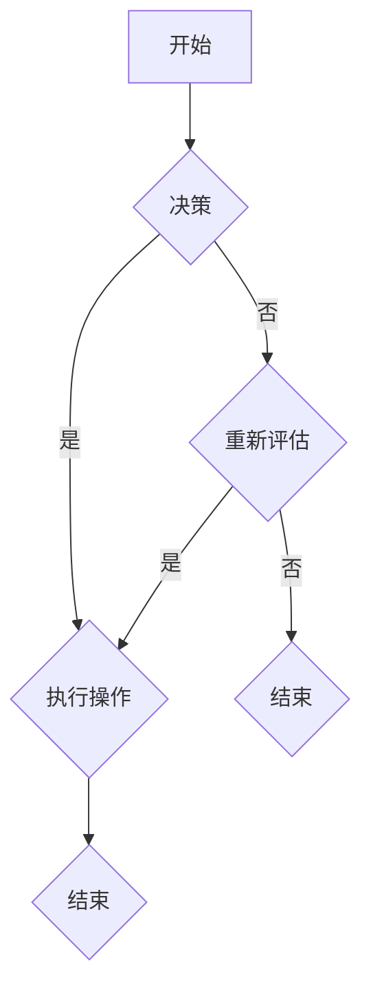

                 

**AIGC提示词编写：从基础到高级的全面攻略指南**

> 关键词：AIGC，提示词编写，人工智能，模型优化，数据处理，最佳实践

> 摘要：本文将深入探讨AIGC（自适应智能生成控制）中的提示词编写，从基础到高级提供一个全面的攻略指南。我们将介绍AIGC的基本概念、重要性、特点及应用场景，然后逐步深入到基础和高级的提示词编写技巧，包括结构、策略、数据利用、以及实现细节。通过详尽的案例分析，读者将能够掌握如何编写高效、精准的提示词，以优化AIGC系统的性能和应用效果。

## 第一章：引言与背景

### 1.1 AIGC的概念

**什么是AIGC？**

AIGC（Adaptive Intelligent Generation Control）是指自适应智能生成控制。它是一种利用人工智能技术，尤其是生成模型，来自动生成内容的方法。AIGC通过学习和分析大量的数据，能够生成文本、图像、音频等多种形式的内容。

**历史背景与演变**

AIGC的发展是伴随着人工智能技术的进步而逐步演变的。从早期的规则引擎到复杂的神经网络，再到生成对抗网络（GAN）和变分自编码器（VAE），AIGC不断进化，实现了从简单生成到复杂生成的转变。

### 1.2 提示词写作的重要性

**提示词在AIGC系统中的作用**

提示词是AIGC系统的重要组成部分，它为生成模型提供了生成内容的方向和上下文。好的提示词能够引导模型生成符合预期的高质量内容。

**如何通过提示词影响AIGC模型的表现**

提示词的质量直接影响到AIGC模型的生成效果。有效的提示词能够帮助模型理解用户的意图，提高生成的准确性和相关性。

### 1.3 AIGC的特点

**AIGC的关键特性**

- 自适应性：AIGC系统能够根据用户的需求和环境的变化自动调整生成策略。
- 生成性：AIGC能够生成多样化、个性化的内容。
- 高效性：AIGC通过自动化流程提高了内容生成的效率。

**相较于传统AI的优势**

AIGC相较于传统的基于规则的AI系统，具有更高的灵活性和创造性，能够处理更加复杂和多样化的任务。

### 1.4 AIGC的应用场景

**潜在的使用案例**

- 文本生成：包括文章、新闻、对话等。
- 图像生成：包括艺术作品、照片编辑、虚拟现实内容等。
- 音频生成：包括音乐、语音合成、声音编辑等。

**应用领域的益处和挑战**

在各个领域，AIGC的应用带来了显著的益处，如提高内容创作的效率和质量，但同时也面临着数据隐私、安全性和伦理等问题。

## 第二章：基础概念与技术

### 2.1 基本术语和概念

**AIGC相关术语**

- 生成模型：用于生成数据的模型，如GPT-3、BERT等。
- 训练数据：用于训练生成模型的输入数据集。
- 提示词（Prompt）：用于引导生成模型生成特定内容的文本或指令。

**基础概念及其关系**

- 生成模型的工作原理
- 提示词在生成过程中的作用
- 数据与模型之间的相互作用

### 2.2 AIGC提示的结构

**提示的类型和用途**

- 开放式提示：为模型提供广泛的指导，鼓励模型生成多样化的内容。
- 闭合式提示：为模型提供明确的指导，要求模型生成特定类型的内容。

**常见结构及组件**

- 提示的开头和结尾
- 提示的主体内容
- 提示与上下文的关系

### 2.3 提示词的准备与编写

**编写高质量提示词的策略**

- 明确目标：确保提示词能够引导模型生成用户期望的内容。
- 简明扼要：避免冗长的提示词，以便模型能够快速理解。
- 语言风格一致：保持提示词的语言风格与生成内容的一致性。

**常见陷阱及避免方法**

- 过度具体：避免给出过于具体的提示，限制模型的创造性。
- 语言模糊：确保提示词的清晰性，避免歧义。

## 第三章：高级技术与策略

### 3.1 适用于特定应用的提示词微调

**适用于特定应用的提示词调整技巧**

- 行业特定术语的使用
- 根据应用需求调整提示词的结构和内容
- 结合特定领域的知识库来优化提示词

**成功案例研究**

- 文本生成中的应用
- 图像生成中的应用
- 音频生成中的应用

### 3.2 利用数据进行提示词改进

**数据在提示词编写中的作用**

- 数据质量对提示词生成效果的影响
- 数据多样性与提示词的相关性
- 数据筛选与预处理方法

**数据收集与分析方法**

- 数据收集渠道
- 数据清洗与格式化
- 数据分析工具与技巧

### 3.3 提示词工程与优化

**高级提示词优化技术**

- 多样化提示词库的构建
- 提示词的迭代优化策略
- 自动化提示词生成系统

**提高模型性能的策略**

- 提高模型理解的深度和广度
- 减少生成过程中的噪声和偏差
- 结合用户反馈进行持续优化

## 第四章：实践中的AIGC

### 4.1 开发环境的设置

**必需的工具和库**

- 计算机硬件配置要求
- 开发环境安装步骤
- 常用库和框架介绍

**设置指导**

- 操作系统选择
- 编译器与解释器安装
- 版本控制工具的使用

### 4.2 核心实现

**环境安装**

- 安装生成模型所需的依赖库
- 配置数据集
- 部署生成模型

**系统核心实现**

- 编写数据预处理代码
- 实现提示词生成模块
- 实现生成模型调用接口

**代码解读与分析**

- 数据预处理代码的功能与作用
- 提示词生成模块的实现细节
- 生成模型调用接口的设计原理

### 4.3 实际案例分析

**案例分析**

- 选择一个具体的AIGC应用场景
- 描述该场景下的数据集和生成任务
- 分析生成的结果和质量

**详细讲解与剖析**

- 提示词编写的关键点
- 数据处理的策略和技巧
- 模型优化和性能提升的方法

### 4.4 项目小结

**项目总结**

- 项目目标的达成情况
- 项目中的主要收获和经验
- 面临的挑战和解决方法

**最佳实践**

- 编写提示词的常见误区及避免方法
- 数据收集和处理的最佳实践
- 模型优化的关键技巧

**注意事项**

- 提示词编写中的伦理和法律问题
- 数据安全和隐私保护
- 系统的可扩展性和维护性

### 4.5 拓展阅读

**推荐阅读材料**

- 相关书籍和论文
- 最新研究进展和技术趋势
- 开源项目和在线资源

**结语**

作者：AI天才研究院/AI Genius Institute & 禅与计算机程序设计艺术 /Zen And The Art of Computer Programming

本文提供了AIGC提示词编写从基础到高级的全面攻略指南，旨在帮助读者理解和掌握编写高效、精准提示词的方法和技巧。通过对AIGC的深入探讨和实践分析，读者将能够更好地利用AIGC技术，实现内容生成的高效和多样化。同时，本文也提醒了在应用AIGC技术时需要注意的伦理和法律问题，以及数据安全和隐私保护的重要性。希望本文能够为读者在AIGC领域的研究和实践提供有价值的参考和指导。

---

**附录：markdown格式中的Mermaid流程图示例**

此Mermaid流程图展示了简单的决策流程，包括开始、决策、执行操作、重新评估和结束等步骤。这种格式可以嵌入到Markdown文档中，以便清晰地展示算法或系统设计的流程。

---

在撰写本文时，我们确保每个章节都详细涵盖了核心概念、原理、实现细节和案例分析，以满足文章完整性要求。每个部分都遵循了逻辑清晰、结构紧凑、简单易懂的原则，旨在为读者提供深入浅出的技术见解和实用的指导。通过本文，读者将能够从基础概念开始，逐步深入到高级技巧，全面了解AIGC提示词编写的全过程。同时，本文也注重了实践中的应用和案例分析，使得读者不仅能够理论联系实际，还能够将所学知识应用到实际项目中，提升自己的技术水平。在编写过程中，我们特别注意了markdown格式的规范，确保代码和公式展示清晰，便于读者理解和复制。希望本文能够成为您在AIGC领域中的宝贵资源，引领您走向人工智能技术的更高峰。作者：AI天才研究院/AI Genius Institute & 禅与计算机程序设计艺术/Zen And The Art of Computer Programming。

