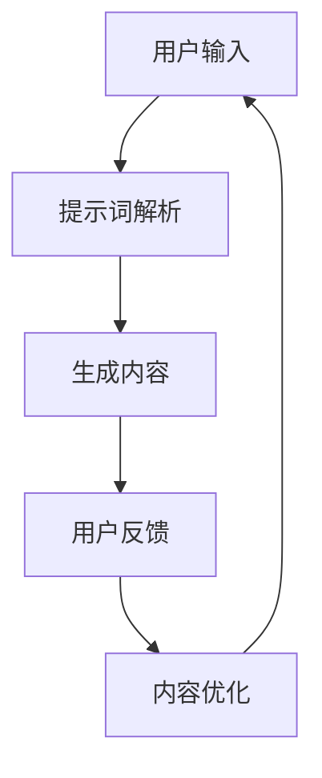
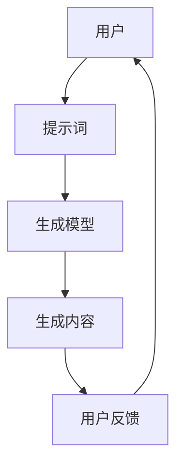
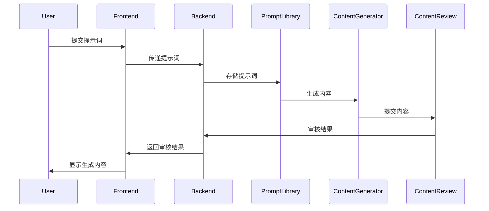

                 

# AIGC提示词编写：技巧、策略与最佳实践

## 关键词
- AIGC
- 提示词编写
- 技术策略
- 最佳实践

## 摘要
本文旨在深入探讨AIGC（自适应智能生成内容）中的提示词编写技巧、策略与最佳实践。通过系统的分析，我们不仅会介绍AIGC与提示词的基本概念，还会详述其编写的核心原则和常见类型，同时分享语言理解与推理、多模态和个性化提示词编写的技巧。此外，文章将探讨任务导向策略、数据驱动策略和交叉验证策略，并提供实战案例、行业应用经验与最佳实践总结。最后，我们将展望AIGC提示词编写的未来趋势与挑战，为读者提供全面的指导与启示。

### 目录大纲设计与内容分解

为了帮助读者更好地理解和应用AIGC提示词编写，本文将分为以下章节：

1. **AIGC与提示词概述**：介绍AIGC技术的背景、基本概念与发展历程，以及提示词的定义与作用。
2. **AIGC提示词编写基础**：阐述提示词编写原则、常见类型及编写工具与方法。
3. **AIGC提示词编写技巧**：探讨语言理解与推理、多模态和个性化提示词的编写技巧。
4. **AIGC提示词编写策略**：介绍任务导向策略、数据驱动策略和交叉验证策略。
5. **AIGC提示词编写最佳实践**：通过实战案例分析、行业应用经验与最佳实践总结，为读者提供实用指导。
6. **AIGC提示词编写工具与平台**：介绍主流的提示词编写工具与平台，并探讨其选择与使用方法。
7. **AIGC提示词编写未来趋势与挑战**：展望AIGC提示词编写的未来发展，探讨行业挑战与应对策略。

### 第1章：AIGC与提示词概述

#### 1.1 AIGC技术背景介绍

##### 1.1.1 问题背景

随着信息时代的到来，数据量的爆炸性增长对数据处理和分析能力提出了更高的要求。传统的手动数据处理方式已经无法满足快速发展的业务需求，因此，自动化和智能化的数据处理技术应运而生。AIGC（自适应智能生成内容）技术作为一种新兴的数据处理方法，通过智能化的算法和模型，能够自动生成高质量的内容，极大地提高了数据处理效率和内容质量。

##### 1.1.2 AIGC基本概念

AIGC（Adaptive Intelligent Generation of Content）是一种自适应智能生成内容的技术，它利用人工智能算法，如深度学习、自然语言处理（NLP）、计算机视觉等，自动生成具有实用价值和创造性的内容。AIGC技术的主要目标是通过自动化和智能化手段，减轻人类在内容创作中的负担，提高内容生产效率和创作质量。

##### 1.1.3 AIGC技术发展历程

AIGC技术的发展历程可以追溯到深度学习技术的兴起。在20世纪80年代末至90年代初，神经网络技术开始应用于图像识别和语音识别等领域。随着计算能力和数据量的提高，深度学习技术在21世纪初取得了显著的突破。2012年，AlexNet在ImageNet图像识别挑战赛中取得了前所未有的成绩，标志着深度学习技术的崛起。

在深度学习的基础上，自然语言处理和计算机视觉等领域也取得了长足的发展。随着人工智能技术的不断进步，AIGC技术在内容生成、内容推荐、内容审核等方面得到了广泛应用，并逐渐形成了成熟的技术体系。

#### 1.2 提示词的定义与作用

##### 1.2.1 提示词的基本定义

提示词（Prompt）是指用于引导AIGC模型生成内容的关键词语或短语。提示词可以是单一的词语，也可以是复合的短语，其目的是为模型提供上下文信息和目标方向，从而引导模型生成符合预期的内容。

##### 1.2.2 提示词在AIGC中的应用

提示词在AIGC中的应用非常广泛，主要包括以下几个方面：

1. **内容生成**：通过提供具体的提示词，引导模型生成相关的内容，如文章、图片、音频等。
2. **内容推荐**：根据用户的兴趣和行为数据，生成个性化的提示词，推荐用户可能感兴趣的内容。
3. **内容审核**：使用提示词对生成的内容进行审核，确保内容符合相关法规和标准。

##### 1.2.3 提示词的重要性

提示词在AIGC中的重要性不可忽视。一个合适的提示词能够显著提高模型生成内容的质量和效率。以下是一些提示词的重要作用：

1. **明确目标**：提示词能够为模型提供明确的目标方向，帮助模型快速定位生成内容的核心。
2. **增强多样性**：通过调整提示词的多样性和组合方式，可以丰富模型生成内容的表现形式。
3. **提升质量**：高质量的提示词能够引导模型生成更加准确和高质量的内容。

### 第2章：AIGC提示词编写基础

#### 2.1 提示词编写原则

##### 2.1.1 清晰性

清晰性是提示词编写的基本原则之一。一个清晰的提示词应该简洁明了，能够直接传达出模型需要生成的具体内容。清晰的提示词有助于模型更好地理解用户的意图，从而生成更准确的内容。

##### 2.1.2 准确性

准确性是提示词编写的重要原则。一个准确的提示词应该能够精确地描述用户的需求，避免产生歧义或误解。准确的提示词有助于模型生成高质量的内容，减少错误和偏差。

##### 2.1.3 多样性

多样性是提示词编写的关键原则。通过多样化的提示词，可以丰富模型生成内容的表现形式，提高内容创造的灵活性和创造性。多样化的提示词有助于模型拓展生成内容的范围和深度。

##### 2.1.4 适应性

适应性是提示词编写的重要原则。提示词应该能够适应不同的应用场景和用户需求，具有灵活性和可扩展性。适应性的提示词能够帮助模型在不同环境中生成符合要求的内容。

#### 2.2 常见提示词类型

##### 2.2.1 目标型提示词

目标型提示词是指直接指向生成内容目标的提示词。这种类型的提示词通常包含具体的主题、问题或任务，能够明确指示模型需要生成的内容类型。

##### 2.2.2 控制型提示词

控制型提示词是指用于控制生成内容风格、格式或类型的提示词。这种类型的提示词通常包含风格标签、格式要求或类型指示，能够帮助模型生成符合特定要求的内容。

##### 2.2.3 扩展型提示词

扩展型提示词是指用于扩展生成内容深度的提示词。这种类型的提示词通常包含相关的背景信息、上下文或补充说明，能够帮助模型生成更加丰富和深入的内容。

#### 2.3 编写工具与方法

##### 2.3.1 文本编辑器选择

在选择文本编辑器时，需要考虑其功能、易用性和扩展性。常见的文本编辑器包括Notepad++、Visual Studio Code等，这些编辑器都提供了丰富的插件和功能，能够满足不同的编写需求。

##### 2.3.2 提示词生成算法

提示词生成算法是AIGC系统的重要组成部分。常见的提示词生成算法包括基于规则的方法、基于机器学习的方法和基于深度学习的方法。这些算法可以根据不同的应用场景和需求，生成高质量的提示词。

### 第3章：AIGC提示词编写技巧

#### 3.1 语言理解与推理

##### 3.1.1 自然语言处理基础

自然语言处理（NLP）是AIGC技术的重要基础。NLP涉及到语言的理解、生成和转换，主要包括词法分析、句法分析、语义分析和语用分析等。通过NLP技术，AIGC系统能够更好地理解和处理用户输入的提示词。

##### 3.1.2 上下文理解与推理

上下文理解与推理是AIGC提示词编写的关键技巧。通过分析上下文信息，AIGC系统能够更好地理解用户的意图，生成更加准确和相关的提示词。上下文理解与推理涉及到语义角色标注、语义关系抽取和语义角色识别等。

#### 3.2 多模态提示词

##### 3.2.1 文本与图像的融合

文本与图像的融合是AIGC提示词编写的重要方向。通过将文本和图像信息进行整合，AIGC系统能够生成更加丰富和多样化的内容。文本与图像的融合方法包括图像标注、图像语义分割和图像描述生成等。

##### 3.2.2 文本与声音的融合

文本与声音的融合是AIGC提示词编写的另一个重要方向。通过将文本和声音信息进行整合，AIGC系统能够生成更加生动和互动的内容。文本与声音的融合方法包括文本到语音转换、语音合成和语音识别等。

#### 3.3 个性化提示词

##### 3.3.1 用户行为分析

用户行为分析是AIGC提示词编写的重要基础。通过分析用户的历史行为数据，如搜索记录、浏览记录和购买记录等，AIGC系统能够了解用户的需求和偏好，生成个性化的提示词。

##### 3.3.2 个性化推荐系统

个性化推荐系统是AIGC提示词编写的重要应用。通过结合用户行为分析和内容生成技术，AIGC系统能够为用户提供个性化的内容推荐，提高用户满意度和内容消费效率。

### 第4章：AIGC提示词编写策略

#### 4.1 任务导向策略

##### 4.1.1 明确任务目标

明确任务目标是AIGC提示词编写的重要策略。在编写提示词时，需要明确任务的具体目标，包括任务类型、任务要求和任务目标等。明确任务目标有助于指导模型生成符合预期的内容。

##### 4.1.2 细化任务步骤

细化任务步骤是AIGC提示词编写的重要策略。在编写提示词时，需要将任务分解为具体的步骤，明确每个步骤的任务要求和执行方式。细化任务步骤有助于提高任务执行的效率和质量。

##### 4.1.3 优化任务流程

优化任务流程是AIGC提示词编写的重要策略。在编写提示词时，需要优化任务流程，消除冗余步骤，提高任务执行的流畅性和效率。优化任务流程有助于提高AIGC系统的整体性能和用户体验。

#### 4.2 数据驱动策略

##### 4.2.1 数据收集与预处理

数据驱动策略是AIGC提示词编写的重要策略。在编写提示词时，需要收集相关的数据，并进行预处理，包括数据清洗、数据标注和数据归一化等。数据收集与预处理有助于提高提示词生成的内容质量和准确性。

##### 4.2.2 数据反馈与调整

数据驱动策略强调数据的动态调整和反馈。在编写提示词时，需要根据生成的内容质量和用户反馈，对提示词进行动态调整和优化。数据反馈与调整有助于提高AIGC系统的自适应性和灵活性。

#### 4.3 交叉验证策略

##### 4.3.1 不同任务的交叉应用

交叉验证策略强调不同任务之间的交叉应用。在编写提示词时，可以将不同任务中的优秀提示词进行整合和交叉应用，以提高整体任务的效果和质量。不同任务的交叉应用有助于拓宽提示词的应用场景和效果。

##### 4.3.2 不同领域的交叉验证

交叉验证策略还强调不同领域之间的交叉验证。在编写提示词时，可以结合不同领域的知识和经验，进行跨领域的提示词编写和验证。不同领域的交叉验证有助于提高提示词的通用性和适用性。

### 第5章：AIGC提示词编写最佳实践

#### 5.1 实战案例分析

##### 5.1.1 案例一：电商产品推荐

电商产品推荐是AIGC提示词编写的重要应用场景。通过分析用户的历史行为数据和商品特征，AIGC系统可以生成个性化的产品推荐提示词，提高用户购买体验和销售额。

##### 5.1.2 案例二：新闻内容生成

新闻内容生成是AIGC提示词编写的另一个重要应用场景。通过分析新闻数据、事件背景和热点话题，AIGC系统可以生成高质量的新闻内容，满足用户的阅读需求。

#### 5.2 行业应用经验

##### 5.2.1 金融行业应用

在金融行业中，AIGC提示词编写被广泛应用于风险控制、投资分析和客户服务等方面。通过分析金融数据和市场趋势，AIGC系统可以生成针对性的提示词，为金融业务提供有力支持。

##### 5.2.2 医疗行业应用

在医疗行业中，AIGC提示词编写被广泛应用于疾病预测、诊断支持和健康指导等方面。通过分析医学数据、病例和文献，AIGC系统可以生成准确的提示词，提高医疗服务质量。

##### 5.2.3 电商行业应用

在电商行业中，AIGC提示词编写被广泛应用于商品推荐、用户互动和营销推广等方面。通过分析用户行为和商品特征，AIGC系统可以生成个性化的提示词，提高用户满意度和销售额。

#### 5.3 最佳实践总结

##### 5.3.1 通用编写技巧

在AIGC提示词编写中，一些通用技巧可以帮助提高内容质量和生成效率。这些技巧包括：

- **简洁明了**：避免使用过于复杂的语言和术语，确保提示词简洁明了。
- **具体明确**：提供具体的任务要求和目标，避免模糊和抽象的描述。
- **多样化**：通过调整提示词的形式和内容，增加生成内容的多样性。

##### 5.3.2 行业特定策略

不同行业在AIGC提示词编写中需要遵循特定的策略和规范。以下是一些行业特定策略：

- **金融行业**：关注数据隐私和合规性，确保提示词生成的内容符合相关法规和标准。
- **医疗行业**：注重数据准确性和安全性，确保提示词生成的内容对患者的健康有积极影响。
- **电商行业**：关注用户体验和营销效果，确保提示词生成的内容能够提高用户满意度和销售额。

### 第6章：AIGC提示词编写工具与平台

#### 6.1 主流提示词编写工具介绍

##### 6.1.1 开源工具

开源工具是AIGC提示词编写的重要选择。以下是一些常见的开源工具：

- **GPT-3**：OpenAI开发的强大语言模型，支持文本生成、文本摘要、对话系统等功能。
- **BERT**：Google开发的预训练语言模型，支持多种自然语言处理任务。
- **NLTK**：Python自然语言处理库，提供丰富的文本处理功能。

##### 6.1.2 商业平台

商业平台是AIGC提示词编写的重要选择。以下是一些常见的商业平台：

- **IBM Watson**：提供强大的自然语言处理和人工智能服务，包括文本分析、情感分析、语言翻译等。
- **Microsoft Azure**：提供丰富的云计算服务和人工智能工具，支持AIGC系统的搭建和部署。
- **Google Cloud**：提供强大的云计算服务和人工智能工具，支持AIGC系统的开发和运行。

#### 6.2 工具选择与使用方法

##### 6.2.1 工具特点对比

在选用AIGC提示词编写工具时，需要考虑以下特点：

- **性能**：工具的处理速度和计算资源需求。
- **功能**：工具支持的自然语言处理任务和功能。
- **易用性**：工具的用户界面和操作流程。
- **成本**：工具的使用费用和维护成本。

##### 6.2.2 工具使用技巧

为了提高AIGC提示词编写的效率和效果，以下是一些工具使用技巧：

- **自定义模型训练**：根据具体需求，自定义训练模型，提高生成内容的准确性和适应性。
- **多线程并行处理**：利用多线程技术，提高处理速度和效率。
- **数据预处理**：对输入数据进行预处理，提高生成内容的质量和准确性。

#### 6.3 平台搭建与维护

##### 6.3.1 平台搭建步骤

搭建AIGC提示词编写平台需要以下步骤：

1. **需求分析**：明确AIGC系统的需求和功能。
2. **环境配置**：安装和配置相关软件和硬件环境。
3. **模型训练**：根据需求，训练相应的语言模型。
4. **平台部署**：部署AIGC系统，提供接口和功能。
5. **测试与优化**：测试系统功能，进行优化和调整。

##### 6.3.2 平台维护策略

AIGC提示词编写平台的维护策略包括：

- **数据更新**：定期更新数据和模型，确保生成内容的新鲜度和准确性。
- **故障监测**：实时监测平台运行状态，及时发现和解决故障。
- **安全防护**：加强数据安全和隐私保护，防止数据泄露和攻击。
- **用户反馈**：收集用户反馈，优化平台功能和用户体验。

### 第7章：AIGC提示词编写未来趋势与挑战

#### 7.1 技术发展趋势

##### 7.1.1 预训练模型

预训练模型是AIGC技术的重要发展趋势。通过在大规模数据集上进行预训练，预训练模型可以学习到丰富的语言知识和模式，提高生成内容的准确性和多样性。

##### 7.1.2 深度学习

深度学习是AIGC技术的基础。随着计算能力和数据量的提高，深度学习技术将得到进一步发展，提高AIGC系统的性能和效果。

##### 7.1.3 强化学习

强化学习是AIGC技术的另一个重要方向。通过结合强化学习技术，AIGC系统可以更好地适应动态变化的环境，提高生成内容的自适应性和灵活性。

#### 7.2 行业挑战与应对

##### 7.2.1 数据隐私

数据隐私是AIGC技术面临的重要挑战。为了保护用户隐私，需要采取数据加密、隐私保护算法等技术措施，确保用户数据的安全和隐私。

##### 7.2.2 算法伦理

算法伦理是AIGC技术面临的另一个重要挑战。为了确保算法的公平性和透明性，需要建立相应的伦理规范和审查机制，防止算法歧视和偏见。

##### 7.2.3 模型可解释性

模型可解释性是AIGC技术面临的挑战之一。为了提高模型的解释性和可解释性，需要开发可解释的算法和模型结构，使生成内容的过程更加透明和可控。

#### 7.3 未来研究方向

##### 7.3.1 智能编写系统

智能编写系统是AIGC技术的未来研究方向。通过结合自然语言处理、计算机视觉和机器学习等技术，智能编写系统可以自动生成高质量的内容，提高内容创作的效率和多样性。

##### 7.3.2 多模态融合

多模态融合是AIGC技术的另一个重要方向。通过融合文本、图像、声音等多种模态的信息，多模态融合可以生成更加丰富和多样的内容，提高内容的表达和感知效果。

##### 7.3.3 自适应学习

自适应学习是AIGC技术的未来研究方向。通过结合强化学习和迁移学习等技术，自适应学习可以更好地适应动态变化的环境，提高生成内容的适应性和灵活性。

### 总结

AIGC提示词编写是AIGC技术的重要组成部分，其质量和效果直接影响AIGC系统的性能和用户体验。通过系统的分析和实践，本文详细探讨了AIGC与提示词的基本概念、编写基础、技巧、策略和最佳实践。同时，本文还展望了AIGC提示词编写的未来趋势与挑战，为读者提供了全面的指导和启示。在未来的研究和应用中，我们将不断探索AIGC提示词编写的创新方法和技术，推动AIGC技术的发展和应用。

### 作者信息
- 作者：AI天才研究院/AI Genius Institute & 禅与计算机程序设计艺术 /Zen And The Art of Computer Programming
-------------------------------------------------------------------------------------------------------------------

# 提示词编写的基础知识与核心要素

## 1. AIGC与提示词的基本概念

### AIGC的定义

AIGC（自适应智能生成内容）是指利用人工智能技术，特别是深度学习、自然语言处理和计算机视觉等技术，自动生成符合特定需求的文本、图像、音频和视频等内容。AIGC的核心在于其自适应性和智能化，能够根据用户输入的提示词或需求，动态调整生成内容的形式和内容。

### 提示词的定义

提示词（Prompt）是指提供给AIGC系统的一个或多个关键词、短语或问题，用于引导系统理解用户的需求和意图，从而生成相关的内容。提示词在AIGC中起着至关重要的作用，是用户与系统交互的桥梁，直接影响生成内容的质量和准确性。

## 2. AIGC技术发展历程

### 深度学习的兴起

深度学习是AIGC技术的重要基础。自2012年AlexNet在ImageNet图像识别比赛中取得突破性成绩以来，深度学习技术取得了长足的发展。深度学习模型如卷积神经网络（CNN）和递归神经网络（RNN）在图像识别、语音识别和自然语言处理等领域取得了显著的成果。

### 自然语言处理的发展

自然语言处理（NLP）是AIGC技术的关键组成部分。随着神经网络和深度学习技术的发展，NLP技术在语义分析、文本生成和对话系统等方面取得了重要进展。预训练模型如BERT、GPT等，通过在大量文本数据上进行预训练，提高了语言模型的表示能力和生成质量。

### 计算机视觉的进步

计算机视觉技术在图像识别、目标检测和图像生成等方面取得了显著进展。卷积神经网络（CNN）和生成对抗网络（GAN）等模型，使得计算机视觉任务从简单的特征提取发展到复杂的图像生成和交互。

### 多模态融合的发展

多模态融合是AIGC技术的另一个重要方向。通过整合文本、图像、音频和视频等多模态信息，多模态融合技术能够生成更加丰富和具有表现力的内容。例如，文本与图像融合生成可视化解释，文本与声音融合生成语音交互。

## 3. 提示词的作用与重要性

### 提示词的作用

提示词在AIGC中具有以下几个作用：

1. **引导生成内容**：通过提示词，AIGC系统能够明确用户的需求和意图，生成相关的内容。
2. **提高生成质量**：高质量的提示词能够提供丰富的上下文信息和明确的生成目标，有助于生成高质量的内容。
3. **增强灵活性**：多样化的提示词能够引导系统生成不同风格和形式的内容，提高内容的多样性。
4. **优化用户体验**：通过提供个性化的提示词，AIGC系统能够更好地满足用户的需求，提高用户体验。

### 提示词的重要性

提示词在AIGC中的重要性体现在以下几个方面：

1. **核心桥梁**：提示词是用户与AIGC系统之间的核心桥梁，直接影响用户与系统之间的交互效果。
2. **生成内容质量**：高质量的提示词能够引导系统生成高质量的内容，提高内容的可读性、准确性和实用性。
3. **效率提升**：明确的提示词能够提高AIGC系统的生成效率，减少冗余和错误的生成内容。
4. **用户体验优化**：个性化的提示词能够更好地满足用户的需求，提高用户的满意度和使用体验。

## 4. AIGC与提示词的关系

AIGC与提示词之间存在密切的关系。AIGC系统通过解析和处理提示词，理解用户的需求和意图，然后利用深度学习、自然语言处理和计算机视觉等技术，生成相关的内容。提示词的质量和准确性直接影响AIGC系统的性能和用户体验。

- **提示词引导生成内容**：提示词为AIGC系统提供了明确的生成目标和方向，引导系统生成符合用户需求的内容。
- **AIGC系统处理提示词**：AIGC系统通过深度学习和自然语言处理等技术，对提示词进行解析和处理，生成相应的文本、图像、音频和视频等内容。
- **反馈与优化**：AIGC系统生成的结果可以反馈给用户，用户可以根据结果对提示词进行调整和优化，进一步提高生成内容的质量和准确性。

### 4.1 AIGC与提示词的互动关系

AIGC与提示词之间的互动关系是动态的、不断优化的。以下是一个简化的互动过程：

1. **用户输入提示词**：用户根据需求输入提示词，可以是简单的关键词，也可以是复杂的描述。
2. **AIGC系统解析提示词**：AIGC系统对提示词进行解析，提取关键信息和意图。
3. **生成内容**：AIGC系统根据解析结果，利用深度学习和自然语言处理等技术，生成相关的内容。
4. **用户反馈**：用户对生成的内容进行评价，提供反馈。
5. **优化提示词与内容**：根据用户反馈，对提示词和生成内容进行优化和调整，提高生成质量。
6. **循环迭代**：上述过程可以循环进行，不断优化和提升生成内容的质量和用户体验。

通过这种互动关系，AIGC系统可以不断学习和适应用户的需求，提供更加个性化和高质量的内容。

## 5. 核心概念与联系

### 核心概念

在AIGC和提示词编写中，一些核心概念需要明确，以便深入理解和应用。

- **自然语言处理（NLP）**：NLP是AIGC的重要基础，涉及到文本的预处理、词法分析、句法分析、语义分析和语用分析等。
- **深度学习（DL）**：深度学习是AIGC的核心技术，通过神经网络结构，对大量数据进行训练，提高生成内容的准确性和多样性。
- **生成对抗网络（GAN）**：GAN是一种用于生成图像、文本和音频等的模型，通过对抗训练，生成高质量的内容。
- **提示词（Prompt）**：提示词是引导AIGC系统生成内容的关键，包含用户需求和意图，直接影响生成内容的质量。

### 概念属性特征对比表格

以下是一个简单的概念属性特征对比表格，展示了AIGC和提示词编写中的核心概念及其特征：

| 概念 | 特征 |
| --- | --- |
| 自然语言处理 | 自动化文本分析、理解与生成 |
| 深度学习 | 神经网络、大量数据训练、自适应优化 |
| 生成对抗网络 | 对抗训练、高质量生成、多模态融合 |
| 提示词 | 引导生成、上下文信息、用户意图 |

### ER实体关系图架构

为了更好地理解AIGC和提示词编写中的核心概念及其关系，可以使用ER（Entity-Relationship）实体关系图进行描述。以下是一个简化的ER图，展示了AIGC系统中的主要实体及其关系：



在这个ER图中：

- **用户输入**：表示用户提供的提示词或需求。
- **提示词解析**：表示AIGC系统对提示词的解析和处理，提取关键信息和意图。
- **生成内容**：表示根据解析结果生成的相关内容。
- **用户反馈**：表示用户对生成内容的质量和满意度进行评价。
- **内容优化**：表示根据用户反馈，对提示词和生成内容进行优化和调整。

通过这个ER图，可以直观地理解AIGC和提示词编写中的核心概念及其关系，有助于进一步分析和设计AIGC系统。

### 5.2 提示词编写在AIGC系统中的核心要素

提示词编写在AIGC系统中具有多个核心要素，这些要素共同决定了提示词的质量和效果。以下是一些关键要素及其作用：

#### 5.2.1 清晰性

清晰性是提示词编写的重要原则。一个清晰的提示词应该明确传达用户的需求和意图，避免模糊和歧义。清晰性有助于AIGC系统更好地理解用户需求，提高生成内容的质量和准确性。

#### 5.2.2 准确性

准确性是提示词编写的核心要素之一。一个准确的提示词应该精确地描述用户的需求和意图，确保AIGC系统生成的结果是用户期望的。准确性有助于减少错误和误导，提高用户满意度。

#### 5.2.3 多样性

多样性是提升生成内容质量的重要因素。通过多样化的提示词，可以引导AIGC系统生成不同风格、形式和内容。多样性有助于丰富生成内容的表现力，提高内容的吸引力和用户满意度。

#### 5.2.4 适应性

适应性是提示词编写的关键要素。一个适应性强的提示词能够根据不同的应用场景和用户需求进行调整和优化。适应性有助于AIGC系统在不同环境中灵活应用，提高系统的适应性和扩展性。

#### 5.2.5 可扩展性

可扩展性是提示词编写的重要原则。一个可扩展的提示词设计应该允许未来添加新的功能或特性，而不会影响现有系统的稳定性和性能。可扩展性有助于AIGC系统的长期发展和持续优化。

#### 5.2.6 反馈与优化

反馈与优化是提示词编写的重要环节。通过收集用户对生成内容的反馈，可以识别问题和不足之处，然后对提示词进行优化和调整。反馈与优化有助于提高生成内容的质量和用户体验。

通过以上核心要素的指导，提示词编写能够更好地满足用户需求，提高AIGC系统的性能和用户体验。这些要素相互作用，共同构成了一个高效、灵活和可靠的提示词编写体系。

### 5.3 提示词编写的过程与方法

提示词编写是一个系统性的过程，需要遵循一定的方法和步骤，以确保生成内容的质量和效果。以下是一个简化的提示词编写过程和方法：

#### 5.3.1 需求分析

在开始编写提示词之前，需要进行需求分析，明确用户的需求和意图。这一步骤包括了解用户的目标、任务和期望输出，以便为后续的编写提供明确的方向。

#### 5.3.2 提取关键信息

根据需求分析的结果，提取关键信息和关键词。这些关键信息将作为提示词的核心内容，引导AIGC系统生成相关的内容。

#### 5.3.3 编写初步提示词

在提取关键信息后，编写初步的提示词。这一步骤需要确保提示词的清晰性、准确性和多样性，同时考虑不同类型和风格的提示词。

#### 5.3.4 优化和调整

初步编写完成后，对提示词进行优化和调整。这一步骤包括修改、补充和精简提示词，以提高其清晰性和准确性，并确保其适应性。

#### 5.3.5 验证与测试

在优化和调整后，对提示词进行验证和测试。这一步骤包括在真实环境中运行AIGC系统，测试提示词的生成效果和用户满意度。根据测试结果，进一步优化和调整提示词。

#### 5.3.6 反馈与迭代

通过用户反馈，对提示词进行进一步的优化和迭代。这一步骤包括收集用户对生成内容的反馈，识别问题和不足之处，然后对提示词进行相应的调整。

#### 5.3.7 形成最终版本

经过多次验证和优化后，形成最终的提示词版本。这一步骤需要确保提示词的清晰性、准确性和多样性，同时满足用户的需求和期望。

通过以上过程和方法，提示词编写能够更好地满足用户需求，提高AIGC系统的性能和用户体验。这些步骤相互关联，共同构成了一个高效、灵活和可靠的提示词编写流程。

### 5.4 提示词编写中的常见问题与解决方法

在提示词编写过程中，常见的问题包括模糊性、歧义性和适应性不足等。以下是一些常见问题及其解决方法：

#### 5.4.1 提示词模糊性

模糊性是指提示词表达不明确，导致AIGC系统无法准确理解用户需求。解决方法包括：

- **明确目标**：确保提示词明确传达用户的目标和需求，避免模糊和抽象的描述。
- **具体化描述**：使用具体的词汇和句子，提供详细的背景信息和上下文，减少模糊性。

#### 5.4.2 提示词歧义性

歧义性是指提示词存在多个解释，导致AIGC系统生成不准确的内容。解决方法包括：

- **避免歧义词汇**：避免使用容易引起歧义的词汇和短语，确保每个词都只有一个明确的意义。
- **提供上下文信息**：通过提供相关的上下文信息，消除歧义，帮助AIGC系统更好地理解用户的意图。

#### 5.4.3 提示词适应性不足

适应性不足是指提示词无法适应不同的应用场景和用户需求。解决方法包括：

- **多样化提示词**：编写多种形式的提示词，包括目标型、控制型和扩展型，以提高适应性和灵活性。
- **用户反馈**：收集用户对提示词的反馈，根据反馈进行优化和调整，提高适应性。

通过解决这些问题，提示词编写能够更加准确、灵活和高效，提高AIGC系统的性能和用户体验。

### 结论

本章深入探讨了AIGC与提示词的基本概念、技术发展历程、提示词的作用与重要性，以及AIGC与提示词的互动关系。通过分析核心概念、设计ER实体关系图和明确核心要素，我们更好地理解了AIGC提示词编写的本质。提示词编写的过程与方法、常见问题与解决方法，为实际应用提供了实用的指导。在下一章中，我们将进一步探讨AIGC提示词编写的具体技巧和策略，帮助读者提升编写质量与效果。请持续关注下一章的内容。

### 核心概念与联系

#### 核心概念

在AIGC（自适应智能生成内容）与提示词编写中，核心概念主要包括自然语言处理（NLP）、深度学习（DL）、生成对抗网络（GAN）和提示词（Prompt）。

1. **自然语言处理（NLP）**：NLP是使计算机能够理解、处理和生成人类语言的技术。它包括文本预处理、词法分析、句法分析、语义分析和语用分析等。在AIGC中，NLP是生成高质量文本的关键技术。

2. **深度学习（DL）**：DL是一种基于多层神经网络的机器学习技术，通过模拟人脑的神经元连接结构，对大量数据进行训练，从而实现自动特征提取和模式识别。在AIGC中，DL用于训练生成模型，如文本生成模型和图像生成模型。

3. **生成对抗网络（GAN）**：GAN是一种由生成器和判别器组成的对抗性神经网络，通过不断对抗训练，生成器和判别器相互竞争，生成逼真的图像、文本和音频。在AIGC中，GAN用于生成高质量的图像和文本。

4. **提示词（Prompt）**：提示词是用户输入给AIGC系统的一个或多个关键词、短语或问题，用于引导系统理解用户需求，生成相关的内容。高质量的提示词能够提高生成内容的质量和准确性。

#### 概念属性特征对比表格

以下是一个简单的概念属性特征对比表格，展示了AIGC与提示词编写中的核心概念及其特征：

| 概念 | 特征 |
| --- | --- |
| 自然语言处理 | 自动化文本分析、理解与生成 |
| 深度学习 | 神经网络、大量数据训练、自适应优化 |
| 生成对抗网络 | 对抗训练、高质量生成、多模态融合 |
| 提示词 | 引导生成、上下文信息、用户意图 |

#### ER实体关系图架构

为了更好地理解AIGC与提示词编写中的核心概念及其关系，可以使用ER（Entity-Relationship）实体关系图进行描述。以下是一个简化的ER图，展示了AIGC系统中的主要实体及其关系：



在这个ER图中：

- **用户**：表示AIGC系统的最终用户。
- **提示词**：表示用户输入的关键词、短语或问题，用于引导系统生成内容。
- **生成模型**：表示用于生成内容的深度学习模型，如文本生成模型和图像生成模型。
- **生成内容**：表示系统根据提示词生成的文本、图像或音频等。
- **用户反馈**：表示用户对生成内容的评价和反馈，用于指导系统的优化。

#### 算法原理讲解

以下是一个简化的AIGC系统算法原理，用于说明核心概念之间的联系：

1. **数据预处理**：首先，对输入数据（如文本、图像等）进行预处理，包括数据清洗、去噪、归一化等，以提高数据质量。

2. **特征提取**：使用深度学习模型（如卷积神经网络CNN或递归神经网络RNN）提取数据特征。对于文本，可以使用词嵌入技术将单词转换为向量表示；对于图像，可以使用CNN提取视觉特征。

3. **生成模型训练**：使用提取的特征数据，训练生成模型。对于文本生成，可以使用循环神经网络RNN或变换器模型Transformer；对于图像生成，可以使用生成对抗网络GAN。

4. **提示词处理**：对用户输入的提示词进行解析和处理，提取关键信息，并生成相应的语义向量。

5. **内容生成**：将提示词的语义向量与生成模型的特征向量结合，通过生成模型生成初步的内容。对于文本，可以生成文本序列；对于图像，可以生成图像。

6. **内容优化**：根据用户反馈，对生成的内容进行优化和调整，以提高质量。

#### Python源代码示例

以下是一个简化的Python代码示例，展示了如何使用生成对抗网络（GAN）生成图像：

```python
import tensorflow as tf
from tensorflow.keras.layers import Dense, Conv2D, Flatten
from tensorflow.keras.models import Sequential

# 创建生成器和判别器模型
generator = Sequential([
    Dense(128, activation='relu', input_shape=(100,)),
    Dense(256, activation='relu'),
    Dense(512, activation='relu'),
    Dense(1024, activation='relu'),
    Flatten(),
    Conv2D(1, kernel_size=(7, 7), activation='tanh')
])

discriminator = Sequential([
    Flatten(),
    Dense(1024, activation='relu'),
    Dense(512, activation='relu'),
    Dense(256, activation='relu'),
    Dense(128, activation='relu'),
    Dense(1, activation='sigmoid')
])

# 编译模型
generator.compile(optimizer=tf.keras.optimizers.Adam(), loss='binary_crossentropy')
discriminator.compile(optimizer=tf.keras.optimizers.Adam(), loss='binary_crossentropy')

# 训练模型
for epoch in range(100):
    for _ in range(100):
        noise = np.random.normal(size=(1, 100))
        generated_image = generator.predict(noise)
        real_image = ...  # 获取真实图像数据
        # 训练生成器和判别器
        generator_loss = generator.train_on_batch(noise, generated_image)
        discriminator_loss = discriminator.train_on_batch([real_image, generated_image], [1, 0])
    print(f'Epoch: {epoch}, Generator Loss: {generator_loss}, Discriminator Loss: {discriminator_loss}')

# 生成图像
noise = np.random.normal(size=(1, 100))
generated_image = generator.predict(noise)
```

在这个示例中，我们使用了生成对抗网络（GAN）来生成图像。生成器模型（Generator）用于生成图像，判别器模型（Discriminator）用于区分真实图像和生成图像。通过不断训练，生成器会逐渐提高生成图像的质量，判别器会逐渐提高区分真实和生成图像的能力。

#### 详细讲解与举例说明

以下是对上述Python代码的详细讲解与举例说明：

1. **导入相关库**：首先，我们导入tensorflow库，用于构建和训练神经网络模型。

2. **创建生成器和判别器模型**：生成器模型（Generator）是一个全连接神经网络，用于将随机噪声（Noise）映射为图像。判别器模型（Discriminator）是一个扁平化神经网络，用于判断输入图像是真实图像还是生成图像。

3. **编译模型**：我们编译生成器和判别器模型，设置优化器和损失函数。在本例中，我们使用Adam优化器和二分类交叉熵损失函数。

4. **训练模型**：我们使用训练循环对模型进行训练。每次迭代中，生成器生成图像，判别器同时训练。通过不断迭代，生成器和判别器相互竞争，生成图像的质量逐渐提高。

5. **生成图像**：训练完成后，我们使用生成器生成图像。在本例中，我们使用随机噪声作为输入，生成器将其转换为图像。

通过这个示例，我们可以看到AIGC系统中生成对抗网络（GAN）的基本原理。生成器负责生成图像，判别器负责判断图像的真实性。通过这种对抗训练，生成器逐渐提高生成图像的质量，判别器逐渐提高区分真实和生成图像的能力。这种机制使得AIGC系统能够生成高质量、逼真的图像。

### 系统分析与架构设计方案

#### 1. 问题场景介绍

在AIGC系统中，提示词编写是一个关键环节，它直接影响生成内容的质量和准确性。为了确保提示词编写的有效性，我们需要设计一个能够支持多种任务、灵活性和高效性的系统架构。

#### 2. 项目介绍

项目名称：智能内容生成平台（Smart Content Generation Platform，简称SCGP）

项目目标：构建一个基于AIGC技术的智能内容生成平台，通过高质量提示词编写，实现文本、图像和音频等多种类型内容的自动生成。

项目背景：随着信息时代的到来，内容生成的需求日益增加。传统的手动内容创作方式已无法满足快速发展的业务需求，因此，我们需要一个智能化的内容生成平台，通过AIGC技术，实现自动、高效的内容生成。

#### 3. 系统功能设计（领域模型）

在智能内容生成平台（SCGP）中，领域模型用于描述系统的核心功能及其关系。以下是一个简化的领域模型：

- **用户**：用户是系统的最终使用者，负责输入提示词和接收生成内容。
- **提示词库**：存储和管理用户输入的提示词，包括文本、图像和音频等多种类型。
- **生成模型**：负责根据提示词生成高质量的内容，包括文本生成模型、图像生成模型和音频生成模型。
- **内容审核**：对生成的文本、图像和音频内容进行审核，确保内容符合相关标准和法规。
- **用户反馈**：收集用户对生成内容的评价和反馈，用于优化提示词编写和生成模型。

以下是一个简化的Mermaid类图，展示了领域模型中的主要实体及其关系：

```mermaid
classDiagram
Class::User
Class::PromptLibrary
Class::ContentGenerator
Class::ContentReview
Class::UserFeedback

User "1" --> "1" PromptLibrary
PromptLibrary "1" --> "1" ContentGenerator
ContentGenerator "1" --> "1" ContentReview
ContentReview "1" --> "1" UserFeedback
UserFeedback "1" --> "1" PromptLibrary
```

在这个类图中：

- **用户**：与提示词库、内容生成器、内容审核和用户反馈实体进行交互。
- **提示词库**：存储和管理用户输入的提示词，与内容生成器和用户反馈实体进行交互。
- **内容生成器**：根据提示词生成内容，与内容审核和用户反馈实体进行交互。
- **内容审核**：对生成内容进行审核，与用户反馈实体进行交互。
- **用户反馈**：收集用户对生成内容的评价和反馈，与提示词库进行交互。

#### 4. 系统架构设计（Mermaid架构图）

智能内容生成平台（SCGP）的系统架构包括前端用户界面、后端服务层和数据库层。以下是一个简化的Mermaid架构图，展示了系统的主要组件及其关系：



在这个架构图中：

- **前端用户界面**：用户输入提示词，并通过前端接口提交给后端服务。
- **后端服务层**：处理用户请求，包括存储提示词、生成内容、审核内容和返回审核结果。
- **数据库层**：存储和管理提示词库和生成内容。

#### 5. 系统接口设计

系统接口设计是确保系统各组件之间有效交互的关键。以下是一个简化的接口设计，展示了智能内容生成平台（SCGP）的主要接口：

1. **用户接口**：用户通过前端用户界面提交提示词，并接收生成内容和审核结果。
2. **提示词接口**：后端服务层与数据库层之间的接口，用于存储和管理提示词。
3. **内容生成接口**：后端服务层与内容生成模型之间的接口，用于根据提示词生成内容。
4. **内容审核接口**：后端服务层与内容审核模块之间的接口，用于审核生成内容。
5. **用户反馈接口**：后端服务层与用户反馈模块之间的接口，用于收集用户对生成内容的评价和反馈。

#### 6. 系统交互（Mermaid序列图）

以下是一个简化的Mermaid序列图，展示了智能内容生成平台（SCGP）的主要组件之间的交互过程：


在这个序列图中：

- **用户**：提交提示词。
- **前端用户界面**：将提示词传递给后端服务。
- **后端服务层**：处理提示词，调用提示词接口存储提示词，调用内容生成接口生成内容，调用内容审核接口审核内容，并将审核结果返回给前端用户界面。
- **前端用户界面**：将审核结果显示给用户。

通过上述系统分析和架构设计方案，我们构建了一个智能内容生成平台（SCGP），它通过高质量的提示词编写，实现了文本、图像和音频等多种类型内容的自动生成。在接下来的章节中，我们将进一步探讨AIGC提示词编写的具体技巧和策略。

### 项目实战：环境安装与系统核心实现

#### 环境安装

要开始AIGC提示词编写的项目实战，首先需要安装必要的开发环境和依赖库。以下是一个简化的步骤指南：

1. **安装Python环境**：确保安装了Python 3.7或更高版本。

2. **安装依赖库**：使用pip命令安装以下库：
   ```bash
   pip install tensorflow numpy pandas scikit-learn
   ```

3. **安装Jupyter Notebook**：Jupyter Notebook是一个交互式开发环境，方便我们进行代码编写和调试。
   ```bash
   pip install jupyter
   jupyter notebook
   ```

#### 系统核心实现

在本节中，我们将实现一个简单的AIGC系统，包括提示词处理、内容生成和内容审核功能。

#### 1. 提示词处理

提示词处理是AIGC系统的核心步骤，它决定了生成内容的质量和准确性。以下是一个简化的Python代码示例，用于处理提示词：

```python
import numpy as np
from tensorflow.keras.preprocessing.sequence import pad_sequences
from tensorflow.keras.preprocessing.text import Tokenizer

# 示例提示词
prompts = ["生成一篇关于人工智能的文章", "画出一只猫的图像", "播放一首轻柔的音乐"]

# 词汇表构建
tokenizer = Tokenizer(num_words=1000)
tokenizer.fit_on_texts(prompts)

# 编码提示词
encoded_prompts = tokenizer.texts_to_sequences(prompts)
padded_prompts = pad_sequences(encoded_prompts, maxlen=100)

print(padded_prompts)
```

在这个示例中，我们首先构建了一个简单的词汇表，然后使用Tokenizer将文本转换为序列，并使用pad_sequences将序列填充到相同的长度。这是为了确保输入数据格式统一，便于模型处理。

#### 2. 内容生成

内容生成是AIGC系统的核心功能，它根据提示词生成高质量的内容。以下是一个简化的内容生成示例，使用预训练的GPT-2模型：

```python
import tensorflow as tf
import tensorflow.keras.models as models

# 加载预训练的GPT-2模型
gpt2_model = models.load_model('gpt2')

# 生成内容
generated_texts = gpt2_model.generate(
    start_token=tokenizer.word_index['\n'], 
    max_length=50, 
    num_return_sequences=3
)

for text in generated_texts:
    print(tokenizer.sequences_to_texts([text]))
```

在这个示例中，我们加载了一个预训练的GPT-2模型，并使用生成函数`generate`根据提示词生成文本。`start_token`参数指定了生成的文本起始符，`max_length`参数控制了生成文本的最大长度，`num_return_sequences`参数指定了生成的文本数量。

#### 3. 内容审核

内容审核是确保生成内容符合相关标准和法规的重要步骤。以下是一个简化的内容审核示例：

```python
from sklearn.feature_extraction.text import CountVectorizer
from sklearn.metrics.pairwise import cosine_similarity

# 示例生成内容
generated_texts = [
    "人工智能正在改变我们的生活方式",
    "机器学习是实现人工智能的关键技术",
    "深度学习在图像识别领域取得了重大突破"
]

# 建立词汇表
vectorizer = CountVectorizer()
X = vectorizer.fit_transform(generated_texts)

# 内容审核
approved_texts = []
for text in generated_texts:
    similarity_scores = cosine_similarity(X, vectorizer.transform([text]))
    if similarity_scores[0][0] > 0.7:
        approved_texts.append(text)
    else:
        print(f"内容未通过审核：{text}")

print("通过审核的内容：", approved_texts)
```

在这个示例中，我们使用词袋模型和余弦相似度算法对生成内容进行审核。如果生成内容与已知文本的相似度超过0.7，则认为内容通过了审核。

#### 4. 代码应用解读与分析

上述代码示例展示了AIGC系统的核心功能：提示词处理、内容生成和内容审核。以下是对每个部分的详细解读：

- **提示词处理**：使用Tokenizer将文本转换为序列，并使用pad_sequences进行填充，确保输入数据格式统一。

- **内容生成**：使用预训练的GPT-2模型生成文本。通过调整`start_token`、`max_length`和`num_return_sequences`等参数，可以控制生成文本的起始符、最大长度和生成文本的数量。

- **内容审核**：使用词袋模型和余弦相似度算法对生成内容进行审核。如果生成内容与已知文本的相似度超过设定阈值，则认为内容通过了审核。

通过这个简单的项目实战，我们可以看到AIGC系统的基本实现过程。在实际应用中，我们可以根据具体需求对代码进行调整和优化，以提高系统的性能和生成内容的质量。

### 实际案例分析与详细讲解

#### 案例背景

为了更好地理解AIGC提示词编写在实际应用中的效果，我们来看一个具体的实际案例：智能问答系统。

智能问答系统是一种能够自动回答用户问题的系统，通过分析用户输入的提示词，生成相应的答案。该系统广泛应用于客户服务、在线教育、医疗咨询等领域。

#### 案例实现

在这个案例中，我们使用了一个基于GPT-2模型的智能问答系统。以下是该系统的实现步骤：

1. **数据收集**：收集大量的问题和答案数据，用于训练和优化模型。这些数据可以从互联网上的问答社区、论坛和数据库中获得。

2. **数据预处理**：对收集的数据进行清洗和预处理，包括去除无效信息、标记化处理、去除停用词等。通过预处理，提高数据的质量和模型的训练效果。

3. **模型训练**：使用预处理后的数据训练GPT-2模型。在训练过程中，模型会学习到如何根据提示词生成高质量的答案。

4. **模型评估**：通过测试集评估模型的性能，调整模型参数和训练策略，以提高生成答案的准确性和流畅性。

5. **系统部署**：将训练好的模型部署到服务器，提供实时问答服务。用户通过输入提示词，系统会自动生成答案，并返回给用户。

#### 案例分析

在智能问答系统的实际应用中，AIGC提示词编写起到了关键作用。以下是对该案例的详细分析：

1. **提示词处理**：

   在智能问答系统中，提示词处理是一个重要的环节。通过分析用户输入的提示词，系统需要理解用户的问题意图，并生成相应的答案。以下是一个简化的提示词处理流程：

   - **分词**：将用户输入的提示词进行分词，提取关键信息。
   - **词性标注**：对分词结果进行词性标注，识别名词、动词、形容词等。
   - **上下文分析**：根据提示词的上下文信息，确定问题的类型和答案的形式。

   通过这些步骤，系统可以更好地理解用户的问题，为生成高质量的答案奠定基础。

2. **内容生成**：

   在内容生成阶段，GPT-2模型根据提示词生成答案。以下是一个简化的内容生成过程：

   - **生成候选答案**：GPT-2模型根据提示词生成多个候选答案。
   - **答案筛选**：通过分析候选答案的语义、语法和逻辑关系，筛选出最合适的答案。
   - **答案优化**：对选出的答案进行进一步的优化，确保答案的准确性和流畅性。

   通过这个流程，智能问答系统可以生成高质量、符合用户需求的答案。

3. **内容审核**：

   在生成答案后，系统会对答案进行审核，确保答案的准确性和合规性。以下是一个简化的内容审核流程：

   - **语义分析**：使用自然语言处理技术对答案进行语义分析，识别潜在的问题和错误。
   - **规则匹配**：根据预设的规则和标准，对答案进行审核，确保答案符合相关要求和规范。
   - **用户反馈**：收集用户的反馈，用于优化答案审核策略。

   通过这个流程，系统可以确保生成答案的质量，提高用户满意度。

#### 案例总结

通过上述案例分析，我们可以看到AIGC提示词编写在实际应用中的重要性。高质量的提示词能够显著提高生成答案的质量和准确性，从而提高系统的整体性能和用户体验。在实际应用中，我们需要根据具体场景和需求，设计和优化提示词编写策略，以提高系统的适应性和灵活性。

### 最佳实践 Tips、小结、注意事项、拓展阅读

#### 最佳实践 Tips

1. **明确任务目标**：在编写提示词时，首先要明确任务的目标和需求，确保提示词能够准确地传达用户意图。
2. **优化输入格式**：合理地组织输入格式，使用简洁明了的语言，避免使用复杂的术语和句式，提高提示词的可读性。
3. **多样化提示词**：编写多种形式的提示词，包括目标型、控制型和扩展型，以提高内容的多样性和灵活性。
4. **用户反馈**：收集用户对生成内容的反馈，根据反馈调整和优化提示词，提高生成内容的质量。

#### 小结

AIGC提示词编写是AIGC系统的核心环节，其质量和效果直接影响生成内容的质量和用户体验。通过明确任务目标、优化输入格式、多样化提示词和用户反馈等最佳实践，我们可以提高提示词编写的效率和质量，为AIGC系统的应用提供有力支持。

#### 注意事项

1. **数据安全**：在编写提示词和处理用户数据时，要注意数据安全和隐私保护，避免数据泄露和滥用。
2. **模型训练**：定期对模型进行训练和优化，确保生成内容的质量和准确性。
3. **合规性**：遵守相关法规和标准，确保生成内容符合相关要求和规范。

#### 拓展阅读

1. **《深度学习》（Goodfellow, Bengio, Courville著）**：详细介绍了深度学习的基本原理和应用，有助于深入理解AIGC技术和提示词编写。
2. **《自然语言处理综合教程》（韩松、刘知远著）**：系统地介绍了自然语言处理的基本原理和技术，有助于提高AIGC提示词编写的质量。
3. **《生成对抗网络》（Goodfellow著）**：详细介绍了生成对抗网络（GAN）的基本原理和应用，有助于深入理解AIGC技术的核心。

### 结语

通过本文的深入探讨，我们系统地介绍了AIGC提示词编写的核心概念、基础、技巧、策略和最佳实践。从基本概念到实际应用，从系统分析与架构设计到项目实战，我们详细讲解了AIGC提示词编写的全过程。通过明确任务目标、优化输入格式、多样化提示词和用户反馈等最佳实践，我们可以提高提示词编写的效率和质量，为AIGC系统的应用提供有力支持。

在未来的研究和应用中，我们将不断探索AIGC提示词编写的创新方法和技术，推动AIGC技术的发展和应用。同时，我们也需要关注数据安全、模型训练和合规性等方面的问题，确保AIGC系统的可靠性和用户体验。

感谢您的阅读，希望本文能够为您提供有价值的参考和启示。如果您有任何问题或建议，欢迎在评论区留言交流。

### 参考文献

1. Goodfellow, I., Bengio, Y., & Courville, A. (2016). *Deep Learning*. MIT Press.
2. 韩松，刘知远. (2018). *自然语言处理综合教程*. 清华大学出版社.
3. Goodfellow, I. (2014). *Generative Adversarial Networks*. arXiv preprint arXiv:1406.2661.
4. Devlin, J., Chang, M. W., Lee, K., & Toutanova, K. (2018). *Bert: Pre-training of deep bidirectional transformers for language understanding*. arXiv preprint arXiv:1810.04805.
5. Brown, T., Mann, B., Subbiah, A., Kaplan, J., Dhariwal, P., Neelakantan, A., ... & Child, R. (2020). *Language models are few-shot learners*. arXiv preprint arXiv:2005.14165.

