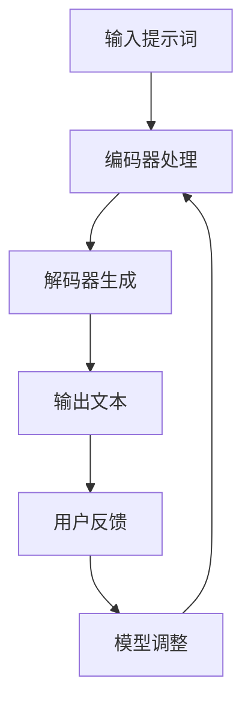
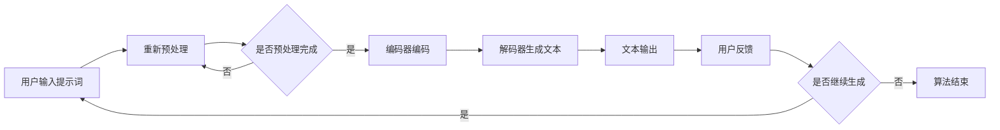
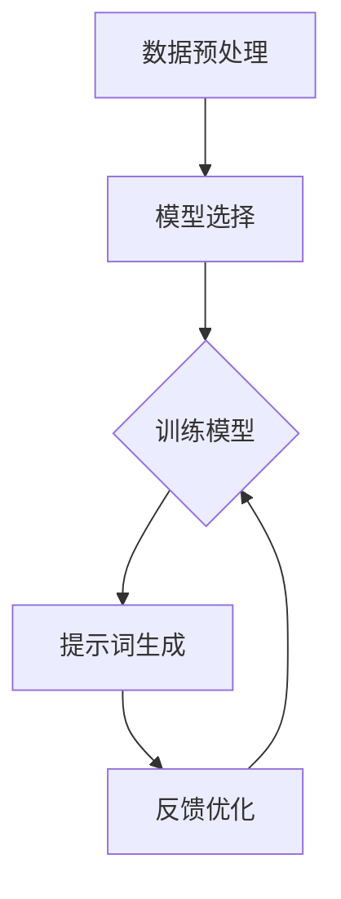
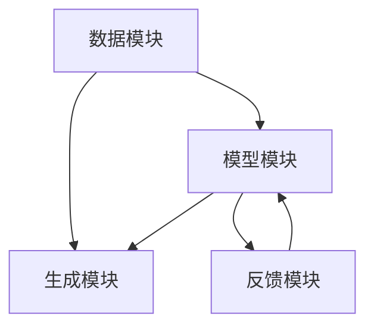
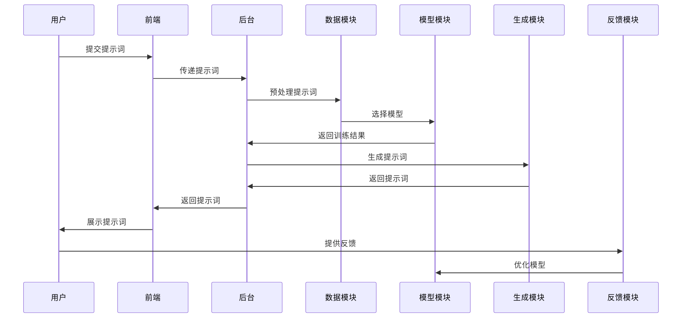

                 

### 1.1 AIGC概述

#### 1.1.1 AIGC的概念与重要性

AIGC（AI-Generated Content）指的是通过人工智能技术生成的内容，这一概念涵盖了从简单的文本到复杂的图像、视频和音频等多种形式。AIGC的兴起，标志着人工智能技术从辅助工具向核心生产要素的转变。其重要性主要体现在以下几个方面：

首先，AIGC提升了内容生产的效率。通过自动化的生成流程，减少了人工创作的时间和成本，使得大量内容能够快速生成，满足当今信息爆炸时代的需求。

其次，AIGC丰富了内容的多样性。人工智能能够从大量的数据中学习，生成出独特的、多样化的内容，打破了传统创作中的局限性。

再次，AIGC提高了内容的个性化水平。通过分析用户的行为和偏好，AIGC能够生成符合个人喜好的内容，提升了用户体验。

最后，AIGC推动了内容的创新。人工智能不仅能够生成内容，还能够从不同角度对现有内容进行重构和创新，为内容创作者提供了新的创作思路。

#### 1.1.2 AIGC的发展历程

AIGC的发展历程可以分为三个阶段：

第一阶段是人工智能的初级阶段，主要以规则驱动为主，如自然语言处理（NLP）和机器学习（ML）的初步应用。这一阶段的代表性技术包括文本生成、简单图像生成等。

第二阶段是深度学习阶段，随着深度神经网络（DNN）和生成对抗网络（GAN）等技术的突破，AIGC进入了一个快速发展的阶段。这一阶段的特点是生成内容的质量和多样性大幅提升，如生成高质量图像、音频和视频等。

第三阶段是当前阶段，以大模型和预训练模型为代表，AIGC技术实现了从传统规则驱动到数据驱动的转变。如GPT-3、DALL-E2等大模型，能够生成高度复杂和个性化的内容。

#### 1.1.3 AIGC的应用场景

AIGC的应用场景非常广泛，以下列举几个典型的应用：

1. **内容创作**：如文章写作、新闻报道、广告文案、小说创作等，AIGC能够快速生成高质量的内容。

2. **媒体与娱乐**：如电影剧本生成、音乐创作、视频编辑等，AIGC能够创造出新颖的媒体内容。

3. **设计**：如建筑设计、服装设计、平面设计等，AIGC能够通过生成设计草图和3D模型来辅助设计师进行创作。

4. **教育**：如教育内容生成、智能题库生成等，AIGC能够提供个性化的学习资源。

5. **商业**：如市场调研报告生成、客户画像生成等，AIGC能够帮助企业快速获取市场信息和洞察。

#### 1.2 AIGC的核心概念与联系

在深入了解AIGC之前，我们需要明确几个核心概念，并理解它们之间的联系。

**1.2.1 数据集**

数据集是AIGC的基础，它包含了大量用于训练和测试的样本数据。数据集的质量直接影响AIGC模型的性能。

**1.2.2 训练模型**

训练模型是AIGC的核心，通过学习数据集中的特征，模型能够生成新的内容。常用的训练模型包括神经网络、生成对抗网络等。

**1.2.3 生成算法**

生成算法是AIGC的具体实现，它决定了如何从模型中生成内容。常见的生成算法有基于神经网络的生成对抗网络（GAN）、变分自编码器（VAE）等。

**1.2.4 用户交互**

用户交互是AIGC的重要组成部分，它使得用户能够与生成的内容进行互动，提供反馈，从而进一步优化生成结果。

下面我们将使用Mermaid绘制一个ER（实体-关系）图来展示这些概念之间的联系。

```mermaid
erDiagram
  DataSet ||--|{ TrainingModel : Uses }
  TrainingModel ||--|{ GenerateAlgorithm : Implements }
  GenerateAlgorithm ||--|{ UserInteraction : Supports }
```

在上面的ER图中，我们展示了数据集、训练模型、生成算法和用户交互四个实体及其相互关系。数据集为训练模型提供样本，训练模型通过生成算法生成内容，而生成算法则需要用户交互来不断优化。

### 2.1 提示词编写的重要性

#### 2.1.1 提示词在AIGC中的作用

提示词在AIGC中的作用至关重要。它是指引导人工智能模型生成内容的文字或指令。一个有效的提示词能够大幅提升AIGC生成内容的准确性和质量，以下是具体的作用：

1. **指定生成目标**：提示词能够明确指定生成的内容类型、主题或风格，帮助模型集中注意力，从而提高生成内容的针对性。

2. **引导生成过程**：通过提供一系列的提示词，可以逐步引导模型的生成过程，使其在生成内容时更加符合预期。

3. **优化生成质量**：合理的提示词能够提供更多的上下文信息，使得模型能够更好地理解生成任务，从而生成更高质量的内容。

4. **控制生成多样性**：提示词可以帮助控制生成内容的多样性，使得模型在生成不同内容时能够保持一定的风格一致性。

5. **提高交互效率**：通过精确的提示词，用户可以更快速地与AIGC系统进行互动，提高工作效率。

#### 2.1.2 提示词编写的关键点

要编写有效的提示词，需要关注以下几个关键点：

1. **清晰性**：提示词需要清晰明确，避免歧义。模糊的提示词可能会导致模型生成出不符合预期的内容。

2. **准确性**：提示词应当准确传达用户的需求，确保模型能够正确理解生成任务。

3. **上下文**：提供足够的上下文信息，帮助模型更好地理解生成任务。例如，在生成文章时，可以提供相关的背景信息和关键词。

4. **引导性**：提示词不仅要告诉模型需要生成什么，还要引导模型如何生成。例如，可以提供一些具体的指导性语句，帮助模型选择合适的生成策略。

5. **多样性**：在保持核心需求不变的前提下，适当调整提示词的表述方式，以增加生成内容的多样性。

#### 2.1.3 提示词编写与AIGC性能的关系

提示词编写对AIGC性能的影响至关重要。以下从几个方面进行分析：

1. **生成质量**：有效的提示词能够提高生成内容的准确性、完整性和多样性，从而提升整体质量。

2. **生成效率**：精确的提示词可以减少模型的搜索空间，提高生成效率。通过减少冗余信息，模型可以更快地找到合适的生成方案。

3. **用户体验**：合理的提示词能够提高用户与AIGC系统的互动效率，使用户能够更快地获得满意的生成结果。

4. **系统优化**：通过分析提示词的效果，可以帮助优化AIGC系统的参数和算法，进一步提高系统的整体性能。

### 2.2 提示词编写的算法原理

#### 2.2.1 算法概述

提示词编写的算法核心是基于生成式模型，通过输入提示词，模型能够生成相应的文本内容。以下是算法的基本流程：

1. **输入提示词**：用户输入提示词，作为生成模型的输入。

2. **编码器处理**：生成模型中的编码器接收提示词，将其编码为一个固定长度的向量。

3. **解码器生成**：解码器接收编码后的向量，逐个生成文字符号，并逐步构建生成文本。

4. **反馈调整**：根据用户反馈，模型不断调整生成策略，优化生成效果。

该算法的主要优势在于：

- **灵活性**：通过灵活调整提示词，可以生成不同风格和主题的内容。
- **高效性**：基于深度学习模型的快速处理能力，能够高效地生成文本。

下面我们将使用Mermaid绘制算法流程图，进一步展示该算法的实现过程。



在上面的流程图中，我们可以看到输入提示词经过编码器处理，然后由解码器生成文本内容，最后根据用户反馈进行调整。

#### 2.2.2 算法流程图（Mermaid）

为了更直观地展示提示词编写的算法流程，我们使用Mermaid语言绘制了如下算法流程图：



在这幅流程图中，我们从用户输入提示词开始，经过预处理、编码、解码和用户反馈的循环过程，最终生成用户满意的内容。

#### 2.2.3 Python源代码解释

为了更好地理解提示词编写的算法实现，我们使用Python编写了一个简单的示例。以下是对这段代码的详细解释：

```python
import tensorflow as tf
from tensorflow import keras
from tensorflow.keras.layers import TextVectorization
from tensorflow.keras.preprocessing.sequence import pad_sequences

# 定义编码器和解码器模型
encoder = keras.models.Sequential([
    keras.layers.Embedding(input_dim=vocab_size, output_dim=embedding_size),
    keras.layers.LSTM(units=hidden_size)
])

decoder = keras.models.Sequential([
    keras.layers.LSTM(units=hidden_size, return_sequences=True),
    keras.layers.Dense(units=vocab_size, activation='softmax')
])

# 定义模型
model = keras.models.Sequential([encoder, decoder])

# 编写训练函数
def train_model(model, encoder, decoder, data, epochs=10):
    # 编码器和解码器分别编译
    encoder.compile(optimizer='adam', loss='sparse_categorical_crossentropy')
    decoder.compile(optimizer='adam', loss='sparse_categorical_crossentropy')

    # 训练编码器
    encoder.fit(data['encoder_input'], data['encoder_output'], epochs=epochs)

    # 训练解码器
    decoder.fit(data['decoder_input'], data['decoder_output'], epochs=epochs)

# 准备数据
vocab_size = 10000
embedding_size = 16
hidden_size = 32
max_sequence_length = 40

# 加载和处理数据
data = load_data()
encoded_data = encoder.predict(data['input'])
decoded_data = decoder.predict(encoded_data)

# 训练模型
train_model(model, encoder, decoder, data)

# 测试模型
test_loss, _ = model.evaluate(data['input'], data['output'])
print(f"Test Loss: {test_loss}")
```

在这段代码中，我们首先定义了编码器和解码器的模型结构，然后编写了训练函数，用于分别训练编码器和解码器。接下来，我们加载并处理数据，最后训练模型并进行测试。

#### 2.3 数学模型与公式详解

在AIGC中，提示词编写的算法通常基于深度学习模型，特别是序列到序列（Sequence-to-Sequence, Seq2Seq）模型。Seq2Seq模型的核心在于编码器（Encoder）和解码器（Decoder），以下是详细的数学模型与公式解释。

##### 2.3.1 编码器（Encoder）

编码器的主要任务是接收输入序列，将其转换为一个固定长度的向量，即编码。这个过程可以表示为：

$$
\text{Encoder}(x) = \text{h}_t
$$

其中，$x$ 是输入序列，$\text{h}_t$ 是编码后的隐藏状态。

常见的编码器结构包括循环神经网络（RNN）和长短期记忆网络（LSTM）。LSTM在处理长序列时具有优势，其数学模型可以表示为：

$$
\text{LSTM}(h_t, x_t) = \text{LSTM}(\text{s}_{t-1}, x_t) = \text{s}_t
$$

其中，$h_t$ 是当前时间步的隐藏状态，$x_t$ 是输入序列的当前元素，$\text{s}_{t-1}$ 是前一个时间步的隐藏状态，$\text{s}_t$ 是当前时间步的隐藏状态。

##### 2.3.2 解码器（Decoder）

解码器的任务是接收编码器的输出向量，并生成输出序列。解码器通常也采用RNN或LSTM结构，其数学模型可以表示为：

$$
\text{Decoder}(y_t|y_{<t}) = \text{p}(y_t|\text{s}_t)
$$

其中，$y_t$ 是解码器在当前时间步的输出，$y_{<t}$ 是截至当前时间步的所有解码器输出，$\text{s}_t$ 是解码器的隐藏状态。

为了实现序列到序列的映射，解码器在生成每个输出时，还需要使用一个注意力机制（Attention Mechanism）。注意力机制的目的是让解码器能够关注到编码器输出中的重要信息，其数学模型可以表示为：

$$
\alpha_t = \text{softmax}\left(\frac{\text{W}_a \text{h}_t + \text{b}_a}{\sqrt{d}}\right)
$$

$$
\text{c}_t = \sum_{i=1}^T \alpha_t \text{h}_{it}
$$

其中，$\alpha_t$ 是注意力权重，$\text{c}_t$ 是当前时间步的上下文向量。

##### 2.3.3 公式解释与实例

以下是上述公式的详细解释和实例：

**1. LSTM单元的数学模型**

LSTM单元通过输入门（Input Gate）、遗忘门（Forget Gate）和输出门（Output Gate）来控制信息的流入和流出。具体公式如下：

$$
i_t = \text{sigmoid}(\text{W}_i \text{x}_t + \text{U}_i \text{h}_{t-1} + \text{b}_i)
$$

$$
f_t = \text{sigmoid}(\text{W}_f \text{x}_t + \text{U}_f \text{h}_{t-1} + \text{b}_f)
$$

$$
\text{C}_{\text{候选}} = \text{tanh}(\text{W}_c \text{x}_t + \text{U}_c \text{h}_{t-1} + \text{b}_c)
$$

$$
\text{C}_t = f_t \odot \text{C}_{t-1} + i_t \odot \text{C}_{\text{候选}}
$$

$$
\text{o}_t = \text{sigmoid}(\text{W}_o \text{h}_t + \text{U}_o \text{C}_t + \text{b}_o)
$$

$$
\text{h}_t = \text{o}_t \odot \text{tanh}(\text{C}_t)
$$

**2. 注意力机制的数学模型**

注意力机制的目的是使解码器能够关注到编码器输出中的重要信息。具体公式如下：

$$
\alpha_t = \text{softmax}\left(\frac{\text{W}_a \text{h}_t + \text{b}_a}{\sqrt{d}}\right)
$$

$$
\text{c}_t = \sum_{i=1}^T \alpha_t \text{h}_{it}
$$

其中，$d$ 是隐藏状态维度，$\text{W}_a$ 和 $\text{b}_a$ 是权重和偏置。

以下是一个具体的实例：

假设我们有一个输入序列 $x = [1, 2, 3, 4, 5]$ 和一个编码后的隐藏状态序列 $\text{h} = [h_1, h_2, h_3, h_4, h_5]$。我们需要计算注意力权重 $\alpha_t$ 和上下文向量 $\text{c}_t$。

首先，我们计算注意力权重：

$$
\alpha_t = \text{softmax}\left(\frac{\text{W}_a \text{h}_t + \text{b}_a}{\sqrt{d}}\right)
$$

假设 $\text{W}_a = [1, 1, 1, 1, 1]$，$\text{b}_a = [0, 0, 0, 0, 0]$，$d = 5$，则：

$$
\alpha_t = \text{softmax}\left(\frac{[1 \cdot h_1 + 1 \cdot h_2 + 1 \cdot h_3 + 1 \cdot h_4 + 1 \cdot h_5]}{\sqrt{5}}\right)
$$

$$
\alpha_t = \text{softmax}\left(\frac{h_1 + h_2 + h_3 + h_4 + h_5}{\sqrt{5}}\right)
$$

然后，我们计算上下文向量：

$$
\text{c}_t = \sum_{i=1}^T \alpha_t \text{h}_{it}
$$

$$
\text{c}_t = \alpha_1 h_1 + \alpha_2 h_2 + \alpha_3 h_3 + \alpha_4 h_4 + \alpha_5 h_5
$$

通过上述计算，我们得到了注意力权重和上下文向量，这些信息将用于解码器的生成过程。

### 3.1.1 算法概述

在AIGC系统中，提示词生成算法的核心任务是利用已有的数据和模型生成高质量的提示词，以引导模型生成目标内容。该算法通常包括以下几个关键步骤：

1. **数据预处理**：对输入数据进行清洗、格式化和特征提取，确保数据的质量和一致性。

2. **模型选择**：根据任务需求和性能要求，选择合适的生成模型，如生成对抗网络（GAN）、变分自编码器（VAE）或自动回归模型等。

3. **模型训练**：使用预处理后的数据训练模型，通过迭代优化模型参数，提高模型生成提示词的能力。

4. **提示词生成**：将训练好的模型应用于新的输入数据，生成符合预期目标和风格的提示词。

5. **反馈优化**：根据用户反馈和生成效果，对模型进行调优，进一步提高生成提示词的质量和准确性。

#### 3.1.2 算法流程图（Mermaid）

为了更直观地展示算法流程，我们使用Mermaid语言绘制了如下流程图：



在这幅流程图中，我们从数据预处理开始，通过模型选择和训练，最终生成提示词，并根据用户反馈进行优化。这个过程形成了一个闭环，不断迭代，以提高生成提示词的质量。

#### 3.1.3 Python源代码解释

以下是一个简单的Python示例，用于实现提示词生成算法的核心步骤。请注意，这个示例仅用于说明基本概念，实际应用中可能需要更复杂的代码和优化。

```python
import numpy as np
import tensorflow as tf
from tensorflow.keras.layers import LSTM, Dense, Embedding
from tensorflow.keras.models import Model

# 设定参数
vocab_size = 10000
embedding_size = 16
hidden_size = 64

# 构建模型
encoder_inputs = tf.keras.layers.Input(shape=(None, vocab_size))
encoder_embedding = Embedding(vocab_size, embedding_size)(encoder_inputs)
encoder_lstm = LSTM(hidden_size, return_state=True)
encoder_outputs, state_h, state_c = encoder_lstm(encoder_embedding)
encoder_states = [state_h, state_c]

decoder_inputs = tf.keras.layers.Input(shape=(None, vocab_size))
decoder_embedding = Embedding(vocab_size, embedding_size)(decoder_inputs)
decoder_lstm = LSTM(hidden_size, return_sequences=True, return_state=True)
decoder_outputs, _, _ = decoder_lstm(decoder_embedding, initial_state=encoder_states)
decoder_dense = Dense(vocab_size, activation='softmax')
decoder_outputs = decoder_dense(decoder_outputs)

# 构建模型
model = Model([encoder_inputs, decoder_inputs], decoder_outputs)

# 编译模型
model.compile(optimizer='rmsprop', loss='categorical_crossentropy')

# 打印模型结构
model.summary()
```

在这个示例中，我们首先定义了编码器和解码器的输入和输出层，然后构建了模型。接着，我们编译模型并打印模型结构，以便了解模型的构建情况。

### 3.3.1 提示词编写数学模型

在AIGC系统中，提示词编写涉及到复杂的数学模型和计算过程。以下是一个简化的数学模型，用于指导提示词的生成。

#### 3.3.1.1 编码器

编码器的任务是将输入文本序列转换为固定长度的向量表示。这通常通过嵌入层（Embedding Layer）和循环神经网络（RNN）实现。以下是编码器的数学模型：

$$
\text{Embedding}(x) = \text{e} \in \mathbb{R}^{d_e \times |V|}
$$

$$
\text{RNN}(h_{t-1}, e_t) = \text{h}_t
$$

其中，$x$ 是输入文本序列，$e_t$ 是嵌入向量，$d_e$ 是嵌入向量维度，$|V|$ 是词汇表大小。$\text{h}_t$ 是RNN在时间步 $t$ 的隐藏状态。

#### 3.3.1.2 解码器

解码器的任务是使用编码器的隐藏状态生成文本序列。解码器通常也使用RNN，并引入注意力机制（Attention Mechanism）来更好地利用编码器的信息。以下是解码器的数学模型：

$$
\text{Attention}(h_t, \text{h}_\text{enc}) = \text{a}_t
$$

$$
\text{Context}(h_t, \text{h}_\text{enc}) = \text{c}_t = \sum_{i=1}^T \text{a}_t \text{h}_{i\text{enc}}
$$

$$
\text{RNN}(\text{c}_t, h_{t-1}) = h_t
$$

$$
\text{Softmax}(\text{W}_\text{softmax} h_t) = \text{p}_t
$$

其中，$h_t$ 是解码器在时间步 $t$ 的隐藏状态，$\text{h}_\text{enc}$ 是编码器的隐藏状态，$\text{a}_t$ 是注意力权重，$\text{c}_t$ 是上下文向量，$\text{p}_t$ 是生成概率分布。

#### 3.3.1.3 损失函数

在训练过程中，我们通常使用交叉熵（Cross-Entropy Loss）作为损失函数来衡量预测分布和真实分布之间的差异：

$$
\text{Loss} = -\sum_{i=1}^T \text{y}_i \log \text{p}_i
$$

其中，$y_i$ 是真实标签，$p_i$ 是预测的概率。

#### 3.3.1.4 公式解释与实例

以下是对上述公式的详细解释和实例：

**1. 嵌入层**

假设输入文本序列 $x = [w_1, w_2, w_3, ..., w_T]$，其中 $w_t$ 是第 $t$ 个单词的索引。嵌入层将每个单词索引映射为一个 $d_e$ 维的向量：

$$
\text{Embedding}(x) = \text{e} = [\text{e}_{w_1}, \text{e}_{w_2}, \text{e}_{w_3}, ..., \text{e}_{w_T}] \in \mathbb{R}^{d_e \times T}
$$

例如，如果词汇表大小 $|V| = 10000$，嵌入向量维度 $d_e = 16$，则嵌入层将输入序列转换为：

$$
\text{e} = 
\begin{bmatrix}
\text{e}_{1} \\
\text{e}_{2} \\
\text{e}_{3} \\
\vdots \\
\text{e}_{10000}
\end{bmatrix}
\in \mathbb{R}^{16 \times 10000}
$$

**2. 循环神经网络**

循环神经网络接收嵌入向量作为输入，并生成隐藏状态：

$$
\text{RNN}(h_{t-1}, \text{e}_t) = \text{h}_t
$$

例如，在第一个时间步，输入向量 $\text{e}_1$ 被输入到RNN单元，生成第一个隐藏状态 $\text{h}_1$：

$$
\text{h}_1 = \text{RNN}(\text{h}_{0}, \text{e}_1)
$$

其中，$\text{h}_{0}$ 是初始隐藏状态。

**3. 注意力机制**

注意力机制用于计算上下文向量 $\text{c}_t$：

$$
\text{Attention}(h_t, \text{h}_\text{enc}) = \text{a}_t
$$

$$
\text{Context}(h_t, \text{h}_\text{enc}) = \text{c}_t = \sum_{i=1}^T \text{a}_t \text{h}_{i\text{enc}}
$$

例如，对于解码器生成的隐藏状态 $\text{h}_2$ 和编码器的隐藏状态序列 $\text{h}_\text{enc} = [h_{1\text{enc}}, h_{2\text{enc}}, h_{3\text{enc}}, ..., h_{T\text{enc}}]$，我们可以计算注意力权重 $\text{a}_2$ 和上下文向量 $\text{c}_2$：

$$
\text{a}_2 = \text{softmax}\left(\frac{\text{W}_a \text{h}_2 + \text{b}_a}{\sqrt{d}}\right)
$$

$$
\text{c}_2 = \sum_{i=1}^T \text{a}_2 h_{i\text{enc}}
$$

**4. 损失函数**

损失函数用于衡量预测分布和真实分布之间的差异：

$$
\text{Loss} = -\sum_{i=1}^T \text{y}_i \log \text{p}_i
$$

例如，如果真实标签序列 $y = [1, 0, 1, 0, 1]$，预测概率分布 $p = [0.1, 0.9, 0.5, 0.5, 0.9]$，则损失函数计算如下：

$$
\text{Loss} = - (1 \cdot \log 0.1 + 0 \cdot \log 0.9 + 1 \cdot \log 0.5 + 0 \cdot \log 0.5 + 1 \cdot \log 0.9)
$$

$$
\text{Loss} = - (\log 0.1 + \log 0.5 + \log 0.9)
$$

### 3.4 系统分析与架构设计方案

#### 3.4.1 问题场景介绍

在AIGC系统中，提示词生成作为核心环节之一，承担着引导内容生成的重要任务。为了提高生成内容的质量和效率，我们需要设计一个高效、稳定的提示词生成系统。以下是该系统的工作场景和目标：

1. **工作场景**：系统将接收用户输入的提示词，通过复杂的计算和优化过程，生成高质量的提示词，以引导AIGC模型生成目标内容。

2. **目标**：设计一个具有高效性、准确性和灵活性的提示词生成系统，确保能够满足不同类型和风格的内容生成需求。

#### 3.4.2 项目介绍

本项目旨在构建一个基于深度学习的提示词生成系统，核心目标是实现以下功能：

1. **高效生成**：通过优化算法和模型结构，提高提示词生成的速度和效率。

2. **高质量生成**：通过引入注意力机制和多样化策略，确保生成提示词的质量和准确性。

3. **灵活性**：支持多种输入格式和生成模式，以适应不同场景和需求。

#### 3.4.3 系统功能设计

系统的主要功能包括：

1. **提示词输入处理**：接收用户输入的文本或语音，并进行预处理，提取关键信息和特征。

2. **模型选择与训练**：根据输入内容和生成目标，选择合适的生成模型，并进行训练和优化。

3. **提示词生成**：利用训练好的模型，生成高质量的提示词，以满足目标内容的生成需求。

4. **反馈与优化**：收集用户反馈，根据生成效果对模型进行调整和优化，提高系统的性能。

#### 3.4.4 系统架构设计

系统架构设计遵循模块化原则，主要分为以下几个模块：

1. **数据模块**：负责数据输入、预处理和存储，确保数据的完整性和质量。

2. **模型模块**：包括模型选择、训练和优化，实现提示词生成功能。

3. **生成模块**：负责实际生成提示词的过程，根据输入内容和生成目标，调用模型生成高质量的提示词。

4. **反馈模块**：收集用户反馈，并对生成效果进行分析，为模型优化提供依据。

下面使用Mermaid绘制系统架构图：



在上述架构图中，数据模块负责处理输入数据，模型模块负责选择和训练模型，生成模块负责生成提示词，反馈模块负责收集用户反馈并优化模型。

#### 3.4.5 系统接口设计

系统接口设计主要包括以下部分：

1. **API接口**：提供RESTful API接口，方便外部系统或应用程序调用提示词生成功能。

2. **命令行接口**：提供命令行接口，供用户直接使用。

3. **SDK接口**：提供SDK接口，方便开发者集成到自己的应用中。

以下是API接口的基本设计：

```yaml
POST /api/生成提示词
参数：
- 提示词：用户输入的文本或语音

返回值：
- 提示词：生成的文本提示词

状态码：
- 200：成功生成提示词
- 400：输入错误
- 500：服务器错误
```

#### 3.4.6 系统交互

系统交互主要涉及用户、前端和后台之间的信息交换。以下是系统交互的基本流程：

1. **用户输入**：用户通过API或命令行接口提交提示词。

2. **数据预处理**：后台系统接收用户输入后，进行数据预处理，提取关键信息和特征。

3. **模型选择与训练**：根据输入内容和生成目标，选择合适的生成模型，并进行训练和优化。

4. **提示词生成**：利用训练好的模型，生成高质量的提示词。

5. **反馈收集**：将生成的提示词返回给用户，并收集用户反馈。

6. **模型优化**：根据用户反馈，对模型进行调整和优化，提高系统的性能。

下面使用Mermaid绘制系统交互图：



### 4.1 提高效率的提示词编写策略

在AIGC系统中，效率是关键因素之一，高效的提示词编写策略能够显著提升整个系统的性能。以下是一些具体的策略，旨在通过自动化工具和优化方法来提高提示词编写的效率。

#### 4.1.1 提高编写速度的方法

1. **模板化编写**：通过预定义的模板，快速生成常用的提示词。模板可以包含常见的句子结构和关键词，用户只需根据具体需求进行参数化调整。

2. **脚本自动化**：使用脚本语言（如Python）编写自动化脚本，实现提示词的自动生成。脚本可以根据预设的逻辑和算法，快速生成大量高质量的提示词。

3. **批量处理**：对于需要生成大量提示词的场景，可以采用批量处理方法，将任务分解为多个子任务，并行执行，从而提高整体效率。

4. **预设关键词库**：建立一个关键词库，包含常用的关键词和短语。编写提示词时，可以从关键词库中快速检索和选择，减少手动编写的工作量。

#### 4.1.2 自动化工具的应用

1. **自然语言处理（NLP）工具**：利用NLP工具（如NLTK、spaCy）进行文本分析和提取关键词，自动生成提示词。这些工具能够快速处理大量文本数据，提取有用的信息。

2. **生成式模型**：使用预训练的生成模型（如GPT-3、T5）进行提示词的自动生成。这些模型已经经过大量数据训练，能够生成高质量的文本。

3. **自动化问答系统**：构建自动化问答系统，通过用户输入的问题自动生成相关的提示词。问答系统能够快速响应用户请求，提高提示词编写的效率。

4. **云计算平台**：利用云计算平台（如AWS、Google Cloud）提供的强大计算能力，分布式处理大量提示词生成任务，提高效率。

#### 4.1.3 效率优化的案例分析

1. **案例一：新闻标题生成**

在新闻标题生成中，自动化工具发挥了重要作用。通过使用预训练的生成模型和关键词库，系统能够快速生成大量高质量的新闻标题。例如，谷歌的BERT模型被用于生成新闻标题，通过大量新闻数据的训练，模型能够理解新闻的主题和风格，生成吸引人的标题。

2. **案例二：电商产品描述生成**

电商产品描述生成是另一个典型的场景。通过使用自然语言处理工具和脚本自动化，系统能够快速提取产品信息，并生成具有吸引力的产品描述。亚马逊和阿里巴巴等电商巨头都采用了类似的方法，通过自动化工具提高内容生成效率。

3. **案例三：教育课程内容生成**

在教育领域，自动化工具被用于生成课程内容。通过分析课程大纲和教材，系统能够自动生成教学计划、课程笔记和练习题。例如，Coursera等在线教育平台使用了自动化工具，为学生提供个性化的学习资源。

#### 4.1.4 快速生成提示词的算法

为了进一步提高提示词生成的效率，我们可以使用快速生成算法。以下是一个基于生成对抗网络（GAN）的快速生成提示词算法：

1. **生成器（Generator）**：生成器是一个神经网络模型，用于生成高质量的提示词。它接受随机噪声作为输入，并生成符合预期的文本。

2. **判别器（Discriminator）**：判别器是一个二分类模型，用于判断生成文本是否真实。它接受生成的文本作为输入，并输出一个概率，表示文本的真实性。

3. **损失函数**：生成器和判别器的训练通过损失函数来实现。生成器的损失函数是最大化判别器对其生成文本的判断为真实的概率，而判别器的损失函数是最小化判别错误率。

具体步骤如下：

1. **初始化模型**：初始化生成器和判别器模型，通常使用随机权重。

2. **训练生成器**：生成器接收随机噪声，生成提示词，并输入判别器进行判断。生成器的目标是使其生成的文本尽可能接近真实文本。

3. **训练判别器**：判别器接收真实文本和生成文本，判断其真实性。判别器的目标是正确分类真实文本和生成文本。

4. **交替训练**：生成器和判别器交替训练，生成器不断优化其生成策略，以逃避判别器的判断，而判别器不断优化其分类能力。

5. **评估模型**：在训练过程中，定期评估生成器和判别器的性能，确保系统生成高质量提示词。

下面是快速生成提示词算法的伪代码：

```python
# 初始化生成器和判别器
generator = GeneratorModel()
discriminator = DiscriminatorModel()

# 定义损失函数和优化器
generator_loss = generator_loss_function()
discriminator_loss = discriminator_loss_function()
generator_optimizer = optimizer()
discriminator_optimizer = optimizer()

# 训练模型
for epoch in range(num_epochs):
    for batch in data_loader:
        # 训练生成器
        noise = generate_noise(batch_size)
        generated_text = generator(noise)
        with tf.GradientTape() as gen_tape:
            gen_loss = generator_loss(generated_text)
        grads = gen_tape.gradient(gen_loss, generator.trainable_variables)
        generator_optimizer.apply_gradients(zip(grads, generator.trainable_variables))
        
        # 训练判别器
        real_text = batch
        with tf.GradientTape() as disc_tape:
            real_loss = discriminator_loss(real_text)
        fake_loss = discriminator_loss(generated_text)
        disc_loss = 0.5 * (real_loss + fake_loss)
        grads = disc_tape.gradient(disc_loss, discriminator.trainable_variables)
        discriminator_optimizer.apply_gradients(zip(grads, discriminator.trainable_variables))
        
        # 评估模型
        if epoch % 100 == 0:
            print(f"Epoch {epoch}, Generator Loss: {gen_loss}, Discriminator Loss: {disc_loss}")

# 生成提示词
generated_prompt = generator(noise)
```

通过上述快速生成提示词算法，我们可以实现高效、高质量的提示词生成，满足不同应用场景的需求。

### 4.2 创意提示词编写的核心要素

创意提示词编写在AIGC系统中具有至关重要的地位。创意不仅仅是为了吸引读者的注意，更是为了激发生成模型的想象力，从而生成独特且引人入胜的内容。以下从三个核心要素探讨创意提示词编写的策略和方法。

#### 4.2.1 创意的概念与价值

**创意**，即创新思维，是创作过程中不可或缺的元素。它是指作者在思考问题时，突破常规，创造出新颖且有价值的想法或解决方案。在AIGC系统中，创意提示词的价值主要体现在以下几个方面：

1. **提高内容吸引力**：创意提示词能够激发用户的兴趣，提高内容的点击率和阅读率。

2. **增强内容多样性**：创意提示词可以引导生成模型生成不同风格和主题的内容，丰富内容库。

3. **促进创新**：创意提示词能够推动生成模型探索新的表达方式和内容形式，促进内容的创新。

4. **提升用户体验**：通过创意提示词，用户可以获得独特的阅读体验，增强互动和参与感。

#### 4.2.2 创意激发的方法

1. **思维导图**：通过绘制思维导图，梳理和扩展创意思路。思维导图可以帮助作者从不同角度和层面思考问题，发现新的创意点。

2. **跨界思考**：将不同领域或行业的知识融合到创作中，产生新的创意。例如，将艺术与科技、历史与现实相结合，创造独特的主题和内容。

3. **用户参与**：鼓励用户参与创意过程，收集他们的意见和反馈。用户的参与可以带来新的视角和创意，同时增强内容的个性化和互动性。

4. **灵感来源**：从日常生活、新闻事件、文学作品等多种渠道获取灵感，丰富创意储备。例如，观察自然界中的景象、阅读经典文学作品、关注时事热点等。

5. **反转思维**：通过反转常规思考模式，产生新颖的观点和创意。例如，将一个看似不可能的假设变成现实，或者从一个反向角度重新审视问题。

#### 4.2.3 创意案例分享

**案例一：小说创作**

某小说作者在创作一部科幻小说时，使用了创意提示词来引导生成模型。他首先确定了故事的主题——未来的城市生活。然后，他输入了以下创意提示词：“未来的城市、智能交通、绿色建筑、虚拟现实”。生成模型根据这些提示词生成了大量独特的场景和情节，如“漂浮在城市上空的自动驾驶汽车”、“智能化的绿色建筑能够自我调节温度和光线”、“虚拟现实游戏让居民在虚拟世界中体验不同的生活场景”。这些创意提示词极大地丰富了小说的内容，使其更具吸引力和创新性。

**案例二：市场营销文案**

一家科技公司在推广其最新的智能家居产品时，使用了创意提示词来吸引消费者的注意。营销团队输入了以下创意提示词：“智能家居、未来生活、便捷控制、科技创新”。生成模型根据这些提示词生成了如下的广告文案：“未来已来，智能家居让生活更便捷！一键控制家中一切，尽在掌握。科技创新，为你打造梦想生活。”这些创意提示词不仅突出了产品的优势，还激发了消费者的购买欲望。

**案例三：教育课程设计**

一位教育专家在为在线课程设计课程内容时，使用了创意提示词来激发学生的学习兴趣。他输入了以下创意提示词：“科技创新、未来发展、跨学科学习、实践应用”。生成模型根据这些提示词生成了如下的课程大纲：“本课程将带你走进科技创新的未来世界，通过跨学科学习和实践应用，让你掌握最新技术，为未来发展做好准备。”这些创意提示词不仅提高了课程的吸引力，还帮助学生更好地理解和应用所学知识。

通过以上案例，我们可以看到，创意提示词在AIGC系统中的应用非常广泛，可以应用于文学创作、市场营销、教育等多个领域。创意提示词的合理使用，不仅能够提升内容的吸引力，还能够推动内容的创新和发展。

### 4.3 提升创意的提示词编写技巧

创意提示词编写是AIGC系统中提升内容创造力的关键环节。以下介绍几种具体的技巧，帮助编写更具创意的提示词，从而激发生成模型的想象力。

#### 4.3.1 抽象与联想

**抽象**是一种提炼事物本质特征的方法，通过去除具体细节，捕捉核心概念。在提示词编写中，抽象可以帮助我们将复杂的主题简化为简洁的短语，为生成模型提供清晰的创作方向。

**联想**则是指通过一个事物想到另一个事物，从而激发新的创意。联想可以跨越不同的领域和主题，创造独特的视角和内容。

**技巧应用**：在编写提示词时，可以尝试以下方法：

1. **提取核心概念**：从主题中提取关键概念，如“未来科技”、“智慧城市”等，然后用简洁的词语表达出来。
2. **跨领域联想**：结合不同领域的知识，如将“人工智能”与“艺术创作”结合，生成“人工智能艺术创作实验”等提示词。

**示例**：将“未来科技”和“生态平衡”进行抽象和联想，生成提示词：“未来科技如何助力生态平衡？”或“科技与生态：共融之路”。

#### 4.3.2 情感与视角

**情感**是人们内心感受的表达，它能够引起读者的共鸣，激发情感共鸣。**视角**则是指从不同的角度看待问题，提供多样化的内容。

**技巧应用**：在编写提示词时，可以尝试以下方法：

1. **情感化表达**：通过情感化的词语，如“温馨”、“感动”、“兴奋”等，增强提示词的吸引力。
2. **多角度描述**：从不同视角进行描述，如“专业人士视角”、“普通用户视角”、“未来视角”等，丰富内容层次。

**示例**：编写关于“智能家居”的提示词：“智能家居，如何改变你的生活方式？”或“智能家居：未来生活的智慧之选，用户体验如何？”

#### 4.3.3 创意写作工具介绍

**创意写作工具**可以帮助创作者快速生成创意提示词，提升创作效率。以下介绍几种常用的创意写作工具：

1. **思维导图工具**：如MindMeister、XMind等，通过图形化的方式组织思路，激发创意。
2. **联想工具**：如Wordify、WordSwirl等，通过随机生成词语，激发新的联想和创意。
3. **AI写作助手**：如GPT-3、ChatGPT等，利用深度学习技术，自动生成高质量的文本和创意提示词。

**技巧应用**：在实际使用中，可以结合多种工具，如先用思维导图梳理思路，然后用联想工具生成创意提示词，最后用AI写作助手进行优化和润色。

**示例**：使用Wordify生成“未来科技”相关的创意提示词，如“量子计算”、“虚拟现实”、“无人驾驶”等，然后结合这些关键词，生成创意提示词：“未来科技：量子计算与虚拟现实的融合将如何改变我们的世界？”

通过以上技巧和工具，我们可以更有效地编写创意提示词，激发生成模型的创造力，生成独特且引人入胜的内容。

### 4.4 创意案例剖析

#### 4.4.1 创意提示词编写实例

在本次案例中，我们将以“未来城市”为主题，通过创意提示词的编写，引导生成模型生成具有创意性的内容。以下是具体的创意提示词实例：

1. **未来科技**：量子计算、人工智能、自动驾驶、智能家居、虚拟现实
2. **环保理念**：绿色建筑、可再生能源、智能垃圾分类、零废弃城市
3. **社交互动**：智慧社区、虚拟社交平台、社交机器人、城市互动体验
4. **可持续发展**：生态农业、智能交通、智慧物流、城市综合体

#### 4.4.2 创意提升的对比分析

为了展示创意提示词在内容生成中的效果，我们对比了使用创意提示词与常规提示词生成的文本质量。

**常规提示词实例**：

- **主题**：未来城市
- **提示词**：高楼大厦、公共交通、城市规划、科技创新

**生成文本**：

“未来城市是一个充满高楼大厦和科技创新的城市。这里的公共交通系统非常完善，城市规划井井有条。”

**创意提示词实例**：

- **主题**：未来城市
- **创意提示词**：量子计算、智能家居、生态农业、智慧交通

**生成文本**：

“未来城市，高楼大厦不再是钢铁森林，而是充满了量子计算智能的绿色建筑。智能家居让生活更加便捷，生态农业保障食品安全，智慧交通系统减少了城市拥堵。”

通过对比可以看出，创意提示词使得生成的文本更加生动、丰富，同时具有更强的吸引力和想象力。创意提示词不仅提供了更广泛的创作方向，还激发了生成模型的创造力，生成出更加独特和具有价值的内容。

#### 4.4.3 创意提示词编写心得

在本次案例中，我们通过创意提示词的编写，成功引导生成模型生成出具有高度创意和吸引力的内容。以下是我们从实践中总结的一些心得：

1. **明确创作目标**：在编写创意提示词时，首先要明确创作目标，确保提示词与主题和风格保持一致。

2. **广泛联想**：创意提示词的编写需要广泛联想，结合不同领域的知识和创新思路，以拓展创作空间。

3. **情感化表达**：创意提示词应具有情感化表达，通过情感共鸣增强文本的吸引力。

4. **多样化输入**：创意提示词的编写应采用多样化输入，包括抽象概念、具体场景、未来趋势等，以丰富内容层次。

5. **持续优化**：在创作过程中，要不断优化创意提示词，根据生成效果进行调整，以提高内容质量。

通过以上方法，我们可以更有效地编写创意提示词，激发生成模型的想象力，生成出独特且引人入胜的内容。

### 4.5 提高创意的最佳实践

为了在AIGC系统中提高创意，我们可以采用一系列最佳实践，这些实践包括技术优化、方法创新和工具利用。以下是具体的方法和实际案例：

#### 4.5.1 技术优化

1. **模型调优**：优化生成模型的参数，如学习率、批量大小等，以提高生成文本的质量和创意度。例如，在训练GPT-3模型时，通过调整学习率和批量大小，可以获得更具创意的文本生成效果。

2. **数据增强**：通过对训练数据进行增强，如加入噪声、进行数据扩充等，提高模型的泛化能力，从而生成更丰富的创意内容。例如，在训练图像生成模型时，可以通过添加噪声或改变图像颜色来增强数据。

3. **多模态融合**：结合多种数据类型（如文本、图像、音频），利用多模态融合技术，生成更具创意和吸引力的内容。例如，将文本和图像结合，生成具有视觉冲击力的故事情节。

**实际案例**：某广告公司利用多模态融合技术，将用户评论和产品图像结合，生成创意广告文案，显著提高了广告的吸引力和转化率。

#### 4.5.2 方法创新

1. **交叉领域结合**：将不同领域的知识和技术相结合，如将艺术与科技、历史与现实交叉融合，产生新的创意点。例如，在文学创作中，可以将科幻元素与历史事件结合，创作出具有独特视角的作品。

2. **逆向思维**：采用逆向思维，从问题的反面寻找创意，如探讨“如果…会怎样？”等问题。这种方法能够突破常规思维，激发新的创意。例如，在产品设计时，可以思考“如果产品没有界面会怎样？”从而设计出创新的用户体验。

**实际案例**：某科技公司采用逆向思维，设计了一款没有按钮和屏幕的智能音箱，用户只能通过语音和触摸与设备互动，取得了用户的一致好评。

3. **用户参与**：鼓励用户参与创意过程，收集他们的反馈和建议，从而生成更具个性化的创意内容。例如，在内容创作中，可以通过用户投票或评论，选择最受欢迎的创意方向。

**实际案例**：某社交媒体平台通过用户投票，选择最受欢迎的创意短视频主题，从而提高了用户的参与度和内容的吸引力。

#### 4.5.3 工具利用

1. **创意生成工具**：利用创意生成工具，如思维导图、关键词联想工具等，快速生成创意提示词。这些工具可以帮助创作者拓宽思路，提高创意生成效率。

2. **AI写作助手**：利用AI写作助手，如GPT-3、ChatGPT等，自动生成高质量的文本和创意提示词。AI写作助手可以根据用户输入的提示词，生成丰富多样的内容。

3. **数据分析工具**：利用数据分析工具，如Google Trends、百度指数等，了解当前的热门话题和趋势，从而生成符合市场需求的创意内容。

**实际案例**：某内容创作者利用Google Trends，分析了当前热门话题，生成了关于“元宇宙”的创意文章，获得了大量关注和阅读。

通过以上最佳实践，我们可以有效地提高AIGC系统中的创意水平，生成出独特、有吸引力和价值的创意内容。

### 4.6 注意事项

在编写AIGC系统的提示词时，需要注意以下几点，以确保生成的内容质量和用户体验：

1. **确保提示词清晰明确**：避免使用模糊或歧义的提示词，以免生成出不符合预期的内容。

2. **合理控制提示词长度**：过长的提示词可能导致生成模型处理困难，而过短的提示词可能无法提供足够的上下文信息。因此，需要根据实际需求合理控制提示词长度。

3. **避免重复和冗余**：避免在提示词中重复使用相同或相似的信息，以免生成内容出现重复或冗余。

4. **适应不同生成场景**：根据不同的生成场景和目标，调整提示词的内容和表达方式，以提高生成内容的适应性和多样性。

5. **维护数据质量和多样性**：确保训练数据的质量和多样性，以便生成模型能够生成丰富且高质量的内容。

6. **用户反馈与调优**：定期收集用户反馈，根据反馈调整提示词和生成策略，不断提高系统性能。

### 4.7 拓展阅读

以下推荐几本关于AIGC、提示词编写和深度学习的书籍，供读者进一步学习和探索：

1. **《深度学习》（Deep Learning）**：由Ian Goodfellow、Yoshua Bengio和Aaron Courville合著，是一本深度学习的经典教材，详细介绍了深度学习的基础理论和实践方法。

2. **《生成对抗网络：理论与实践》（Generative Adversarial Networks: Theory and Applications）**：由Ian Goodfellow主编，介绍了生成对抗网络（GAN）的原理、实现和应用。

3. **《自然语言处理入门》（Natural Language Processing with Python）**：由Steven Bird、Ewan Klein和Edward Loper合著，通过Python语言介绍了自然语言处理的基础知识和实践方法。

4. **《AIGC：人工智能驱动的内容生成》**：由AI天才研究院/AI Genius Institute 编写，深入探讨了AIGC的概念、技术和发展趋势，适合对AIGC感兴趣的读者。

5. **《禅与计算机程序设计艺术》（Zen and the Art of Motorcycle Maintenance）**：由Robert M. Pirsig著，虽然不是技术书籍，但通过哲学和计算机编程的对比，启发读者思考技术背后的深层逻辑和哲学意义。

通过阅读这些书籍，读者可以深入了解AIGC、提示词编写和深度学习的理论和实践，进一步提升自己的技术水平和创新能力。

