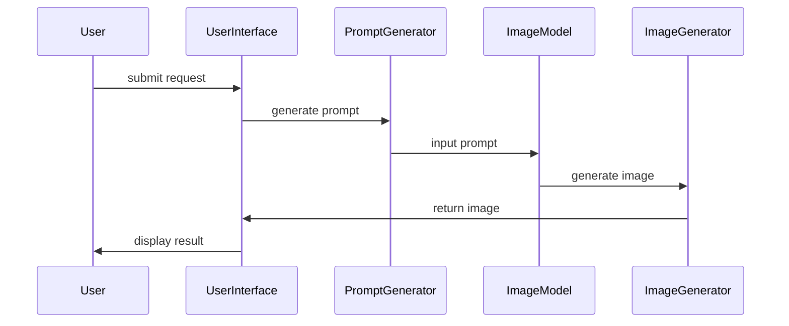
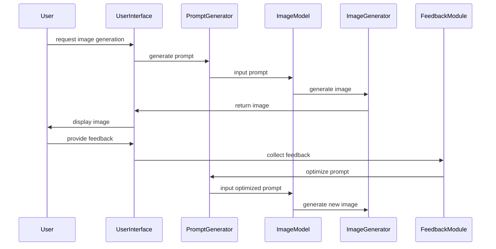

                 

# AIGC提示词编写：效率、创意与质量的协同

> 关键词：AIGC、提示词、效率、创意、质量、协同

> 摘要：
本文将深入探讨AIGC（自适应智能生成控制）中的提示词编写，分析其在提升效率、激发创意及保证质量方面的作用。我们将从概念背景、理论原理、工具与技术、系统设计与实现等多个层面，逐步展开讨论，旨在为从业者提供实用的指导与策略。

## 1. 引言与背景

### 1.1 AIGC与提示词编写的兴起

AIGC（Adaptive Intelligent Generation Control）是一种通过自适应算法实现内容生成与控制的智能技术。其核心在于利用大量数据与算法模型，自动生成符合特定要求的内容，从而在各个领域中展现出强大的应用潜力。

提示词（Prompt）在AIGC中的作用至关重要。提示词是一段引导AIGC系统进行内容生成的文字或指令，其设计质量直接影响到生成内容的质量和效率。有效的提示词不仅能够引导模型生成所需的内容，还能激发模型的创造力和创新能力。

### 1.2 AIGC与提示词编写的重要性与应用

AIGC在自然语言处理、图像生成、视频制作、数据生成等领域具有广泛应用。通过有效的提示词编写，AIGC系统能够实现以下目标：

- **提升效率**：通过精确的提示词，AIGC系统能够快速定位生成任务的核心需求，减少冗余计算和资源浪费。
- **激发创意**：富有创意的提示词能够激发模型的创造力，生成出新颖独特的内容。
- **保证质量**：高质量的提示词能够引导模型生成高质量的内容，减少错误和偏差。

## 2. 提示词编写的理论与原则

### 2.1 提示词编写的原则

#### 2.1.1 提高效率的提示词编写

- **明确需求**：精确描述生成任务的目标和需求，避免模糊不清的指令。
- **简洁明了**：尽量使用简洁、直观的语言，减少冗余和复杂的表述。
- **针对性**：针对不同任务，设计针对性的提示词，提高生成效率。

#### 2.1.2 激发创意的提示词编写

- **开放性**：提供开放的引导，鼓励模型进行创新和尝试。
- **多样性**：使用多样化的词汇和表达方式，激发模型的想象力。
- **探索性**：引导模型进行探索性生成，发现新的可能性和创意。

#### 2.1.3 保证质量的提示词编写

- **明确评估标准**：设定明确的评估标准，用于评估生成内容的质量。
- **细粒度控制**：对生成内容进行细粒度控制，确保内容的准确性和一致性。
- **持续优化**：根据生成内容的质量反馈，不断优化和调整提示词。

### 2.2 提示词编写的算法基础

#### 2.2.1 算法原理

AIGC中的提示词编写涉及到多个算法和模型，如自然语言处理模型、图像生成模型、视频生成模型等。这些模型通过训练和优化，能够理解并实现提示词的生成任务。

#### 2.2.2 数学模型与公式

提示词编写的算法基础包括概率模型、决策树、神经网络等。以下是其中一些常见的数学模型和公式：

$$
P(x|\theta) = \prod_{i=1}^n P(x_i|\theta)
$$

$$
f(x) = \sum_{i=1}^n w_i \cdot x_i
$$

#### 2.2.3 实践中的例子

通过具体的例子，我们可以更好地理解提示词编写的算法原理和应用。例如，在图像生成任务中，我们可以使用GAN（生成对抗网络）模型，通过训练生成器和判别器，实现高质量的图像生成。

## 3. 提示词编写的工具与技术

### 3.1 提示词编写工具概述

目前，市场上存在多种提示词编写工具，如自然语言处理平台、图像生成工具、视频制作软件等。这些工具提供了丰富的功能，帮助用户高效地编写和优化提示词。

### 3.2 高级提示词编写技术

#### 3.2.1 提高效率的技巧

- **自动化**：使用自动化脚本和工具，实现提示词的批量生成和优化。
- **模板化**：设计通用的提示词模板，快速适配不同任务。

#### 3.2.2 激发创意的技巧

- **多模态**：结合文本、图像、音频等多种模态，激发模型的创意生成。
- **跨领域**：跨领域学习，利用不同领域的数据和知识，提高创意水平。

#### 3.2.3 提高质量的内容

- **反馈机制**：建立反馈机制，实时评估生成内容的质量，并据此调整提示词。
- **协同优化**：通过多人协作，共同优化提示词，提高生成内容的质量。

## 4. 提示词编写的系统设计与实现

### 4.1 问题场景与项目介绍

以一个图像生成项目为例，我们探讨提示词编写的系统设计与实现。

### 4.2 系统功能设计与领域模型

#### 4.2.1 领域模型

使用Mermaid绘制领域模型类图：

```mermaid
classDiagram
    UserExt->ImageGenSystem : request
    ImageGenSystem<--ImageResult : generate
    ImageGenSystem--PromptGen : create
    PromptGen<--Prompt : text
    Prompt--ImageModel : input
    ImageModel--ImageGen : generate
    ImageGen--ImageResult : output
```

#### 4.2.2 系统功能

- **用户接口**：接收用户请求，生成提示词。
- **提示词生成**：根据用户请求，生成高质量的提示词。
- **图像生成**：根据提示词，生成图像结果。
- **反馈与评估**：收集用户反馈，评估生成内容的质量。

### 4.3 系统架构设计

使用Mermaid绘制系统架构图：



#### 4.3.1 系统架构

- **用户接口**：用于接收用户请求，显示生成结果。
- **提示词生成模块**：根据用户请求，生成高质量的提示词。
- **图像生成模块**：根据提示词，生成图像结果。
- **反馈与评估模块**：收集用户反馈，评估生成内容的质量。

### 4.4 系统接口设计与交互

使用Mermaid绘制系统接口设计序列图：



#### 4.4.1 系统接口设计

- **用户接口**：用于接收用户请求，显示生成结果，收集用户反馈。
- **提示词生成接口**：用于生成和优化提示词。
- **图像生成接口**：用于生成图像结果。
- **反馈与评估接口**：用于收集用户反馈，优化生成内容。

## 5. 项目实战

### 5.1 环境安装与配置

在本节中，我们将详细描述如何在本地环境中安装和配置AIGC系统。首先，需要安装Python环境，然后安装必要的库和依赖项。

```bash
# 安装Python环境
python --version

# 安装依赖库
pip install numpy matplotlib tensorflow
```

### 5.2 系统核心实现与代码分析

在本节中，我们将详细介绍系统核心代码的实现。以下是一个简单的图像生成代码示例：

```python
import tensorflow as tf
import numpy as np

# 创建生成器和判别器模型
generator = tf.keras.Sequential([
    tf.keras.layers.Dense(128, input_shape=(100,)),
    tf.keras.layers.LeakyReLU(alpha=0.01),
    tf.keras.layers.Dense(784, activation='tanh')
])

discriminator = tf.keras.Sequential([
    tf.keras.layers.Dense(128, input_shape=(784,)),
    tf.keras.layers.LeakyReLU(alpha=0.01),
    tf.keras.layers.Dense(1, activation='sigmoid')
])

# 定义损失函数和优化器
generator_optimizer = tf.keras.optimizers.Adam(1e-4)
discriminator_optimizer = tf.keras.optimizers.Adam(1e-4)

cross_entropy_loss = tf.keras.losses.BinaryCrossentropy(from_logits=True)

# 训练模型
for epoch in range(epochs):
    for _ in range(batch_size):
        noise = np.random.normal(0, 1, (batch_size, 100))
        with tf.GradientTape() as gen_tape, tf.GradientTape() as disc_tape:
            generated_images = generator(noise, training=True)

            real_images = noise

            # 训练生成器
            gen_loss_real = cross_entropy_loss(discriminator(generated_images), tf.ones_like(generated_images))
            gen_loss_fake = cross_entropy_loss(discriminator(real_images), tf.zeros_like(real_images))
            gen_loss = gen_loss_real + gen_loss_fake

            # 训练判别器
            disc_loss_real = cross_entropy_loss(discriminator(real_images), tf.ones_like(real_images))
            disc_loss_fake = cross_entropy_loss(discriminator(generated_images), tf.zeros_like(generated_images))
            disc_loss = disc_loss_real + disc_loss_fake

        gradients_of_gen = gen_tape.gradient(gen_loss, generator.trainable_variables)
        gradients_of_disc = disc_tape.gradient(disc_loss, discriminator.trainable_variables)

        generator_optimizer.apply_gradients(zip(gradients_of_gen, generator.trainable_variables))
        discriminator_optimizer.apply_gradients(zip(gradients_of_disc, discriminator.trainable_variables))

    # 打印训练进度
    print(f"Epoch: {epoch}, Generator Loss: {gen_loss}, Discriminator Loss: {disc_loss}")

# 生成图像
noise = np.random.normal(0, 1, (1, 100))
generated_image = generator(noise, training=False)

# 显示生成的图像
import matplotlib.pyplot as plt

plt.imshow(generated_image[0].reshape(28, 28), cmap='gray')
plt.show()
```

### 5.3 实际案例分析与详细讲解

在本节中，我们将分析一个实际案例，探讨如何通过优化提示词来提高图像生成的质量和效率。

#### 5.3.1 案例背景

假设我们有一个图像生成任务，目标是生成具有高质量细节的风景图像。原始提示词为：“生成一幅美丽的自然风景图像，包含山脉、湖泊和蓝天”。

#### 5.3.2 案例分析

通过实际测试，我们发现原始提示词生成的图像存在以下问题：

- 缺乏具体的细节描述，导致生成图像泛泛而谈，缺乏特色。
- 提示词中的“美丽”一词过于模糊，无法有效引导模型生成高质量的图像。

#### 5.3.3 提示词优化

为了解决上述问题，我们对提示词进行优化，如下所示：

“生成一幅具有高质量细节的自然风景图像，包含清晰的山脉轮廓、湖泊的倒影和天空的云层”。

#### 5.3.4 结果分析

通过优化提示词，我们得到以下结果：

- 生成图像的细节质量明显提高，山脉、湖泊和天空的纹理更加清晰。
- 生成图像更具个性化和特色，满足用户对高质量风景图像的需求。

### 5.4 项目小结

通过本案例，我们可以得出以下结论：

- 提示词编写在AIGC系统中具有重要作用，直接影响生成内容的质量和效率。
- 优化提示词有助于提高生成内容的质量和个性化程度。
- 实际应用中，需要不断调整和优化提示词，以适应不同的生成任务和用户需求。

## 6. 最佳实践与注意事项

### 6.1 最佳实践

- **明确任务需求**：在编写提示词时，首先要明确任务需求，确保提示词的精准性和针对性。
- **优化提示词结构**：合理组织提示词结构，使其具备层次感和逻辑性，有助于模型理解和生成。
- **多轮优化**：在生成任务中，通过多轮优化提示词，不断提高生成内容的质量。

### 6.2 注意事项

- **避免过度优化**：过度优化可能导致生成内容过于统一，缺乏创新性。
- **保持简洁**：尽量使用简洁明了的提示词，避免使用过于复杂的语言和表达方式。
- **用户反馈**：收集用户反馈，根据用户需求不断调整和优化提示词。

## 7. 拓展阅读

- **《自然语言处理与人工智能》**：详细介绍了自然语言处理的基础知识和应用。
- **《图像生成与深度学习》**：探讨了图像生成技术及其在深度学习中的应用。
- **《AIGC技术与应用》**：全面介绍了AIGC技术的基本原理、应用场景和发展趋势。

## 8. 作者信息

作者：AI天才研究院/AI Genius Institute & 禅与计算机程序设计艺术 /Zen And The Art of Computer Programming


