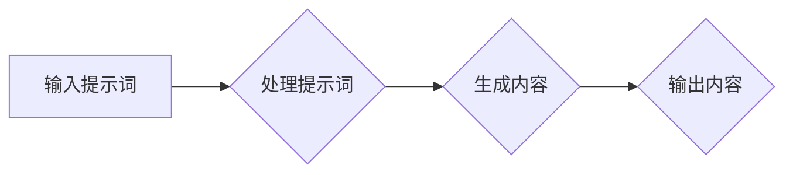
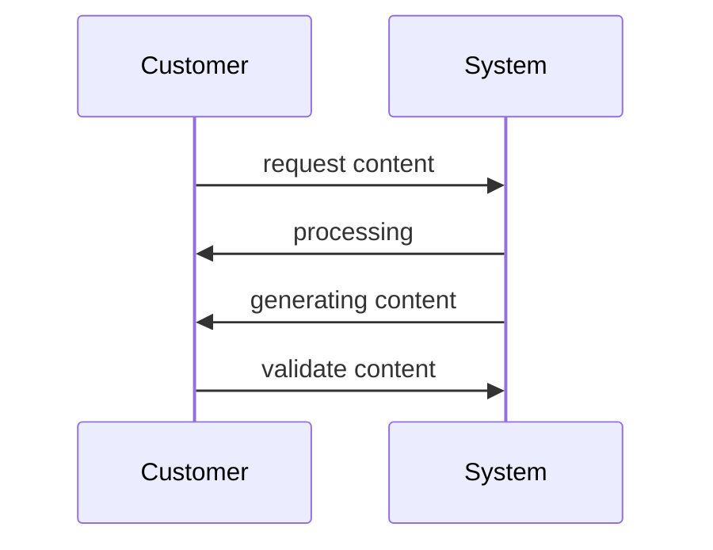
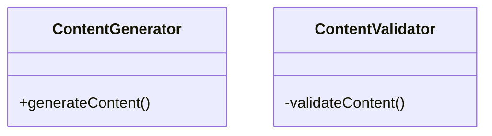
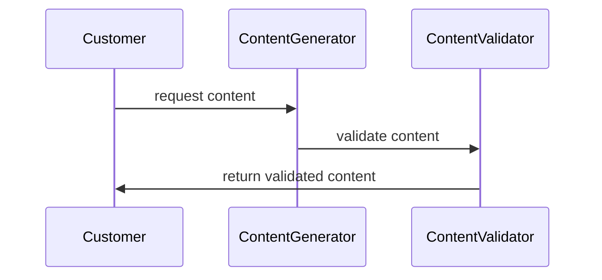

                 

### AIGC提示词设计：原则、方法与创新实践

> 关键词：AIGC、提示词设计、原则、方法、创新实践

> 摘要：本文深入探讨AIGC（AI-Generated Content）提示词的设计，从核心概念、原则、方法到创新实践，全面分析AIGC提示词的设计与优化策略。通过详细的案例分析和技术解读，本文旨在为从业者提供有价值的参考，助力提升AIGC应用效果。

### 引言

随着人工智能技术的飞速发展，AIGC（AI-Generated Content）已经成为内容创作领域的重要趋势。AIGC通过利用自然语言处理、生成对抗网络等先进技术，实现了自动化内容创作，提高了内容生成的效率和质量。然而，要充分发挥AIGC的潜力，设计有效的提示词是关键。提示词作为AIGC的核心输入，直接影响着生成内容的质量和多样性。

本文将从以下几个方面展开讨论：

1. **背景与概念**：介绍AIGC的定义、发展和应用场景，阐述提示词在AIGC中的作用和重要性。
2. **AIGC提示词设计原则**：分析提示词设计的基本原则和关键要素，包括明确目标、多样性、精确性等。
3. **AIGC提示词设计方法**：探讨文本分析技术、语言模型和生成模型在提示词设计中的应用。
4. **AIGC提示词创新实践**：分享实际案例和创新策略，讨论AIGC提示词设计的未来方向。

### 第一部分：背景与概念

#### 第1章：AIGC概述

AIGC，即AI-Generated Content，指的是通过人工智能技术自动生成的各种内容，如文本、图片、音频、视频等。AIGC的发展离不开自然语言处理、生成对抗网络（GAN）、变分自编码器（VAE）等技术的推动。AIGC的应用场景广泛，包括但不限于内容审核、智能写作、个性化推荐等领域。

**1.1 AIGC的定义与演变**

AIGC的定义可以归纳为：利用机器学习和深度学习技术，自动生成符合人类需求的内容。其演变过程可以分为以下几个阶段：

1. **文本生成**：最早期的AIGC主要是基于规则和模板的系统，如自动生成新闻报道等。随着自然语言处理技术的发展，基于统计模型和深度学习的文本生成系统逐渐兴起，如GPT、BERT等。
2. **图像和音频生成**：生成对抗网络（GAN）的提出为图像和音频生成带来了突破性进展。GAN通过生成器和判别器的对抗训练，实现了高质量图像和音频的生成。
3. **跨模态生成**：近年来，跨模态生成研究逐渐受到关注。通过融合不同模态的数据，如文本和图像，生成具有更高一致性和多样性的内容。

**1.2 AIGC在内容创作中的应用**

AIGC在内容创作中的应用场景非常丰富，以下是一些典型的应用：

1. **内容审核**：通过AIGC技术，可以实现自动化内容审核，提高审核效率，减少人力成本。
2. **智能写作**：AIGC技术可以生成新闻稿、文章、博客等文本内容，为内容创作者提供辅助。
3. **个性化推荐**：基于用户兴趣和行为数据，AIGC可以生成个性化的内容推荐，提高用户体验。
4. **广告创作**：AIGC可以帮助自动生成广告文案、图片等，提高广告投放效果。

**1.3 AIGC与提示词的关系**

提示词在AIGC中的作用至关重要。提示词是AIGC系统的输入，用于指导生成模型生成内容。一个有效的提示词应该能够清晰地传达用户意图，同时提供足够的灵活性，使生成模型能够生成多样化、符合期望的内容。提示词设计的好坏直接影响AIGC系统的效果。

### 第二部分：AIGC提示词设计原则

#### 第2章：AIGC提示词设计原则

AIGC提示词设计需要遵循一系列基本原则，以确保生成内容的质量和多样性。以下是几个核心原则：

**2.1 明确目标**

明确目标是指提示词应清晰地传达用户需求，使生成模型能够理解并实现用户的意图。一个模糊或不明确的提示词会导致生成内容偏离目标，甚至生成无意义的内容。

**2.2 多样性**

多样性是指提示词应设计得足够灵活，以使生成模型能够生成多样化、具有创意的内容。过于具体的提示词可能导致生成内容单一、缺乏变化。

**2.3 精确性**

精确性是指提示词应提供足够的信息，使生成模型能够生成符合期望的内容。同时，提示词不应过于冗长或模糊，以免引起歧义。

**2.4 简洁性**

简洁性是指提示词应简洁明了，避免使用复杂或冗长的句子。简洁的提示词不仅易于理解和记忆，还能提高生成模型的效率和效果。

**2.5 可扩展性**

可扩展性是指提示词应具有一定的通用性，能够适应不同的应用场景和用户需求。一个具有良好可扩展性的提示词设计，可以大大提高AIGC系统的灵活性和适应性。

### 第三部分：AIGC提示词设计方法

#### 第3章：AIGC提示词设计方法

AIGC提示词设计方法主要包括文本分析技术、语言模型和生成模型。这些方法分别从不同角度出发，为提示词设计提供了有效的手段。

**3.1 文本分析技术**

文本分析技术是AIGC提示词设计的基础。通过文本分析，可以提取出关键信息、语义和情感，为提示词设计提供有力支持。常见的文本分析技术包括：

1. **词频统计**：通过统计文本中各个单词的出现次数，可以初步了解文本的主题和重点。
2. **主题模型**：如LDA（Latent Dirichlet Allocation），可以提取出文本的潜在主题，帮助设计更具针对性的提示词。
3. **情感分析**：通过分析文本的情感倾向，可以指导生成模型生成符合情感预期的内容。

**3.2 语言模型**

语言模型是AIGC提示词设计的关键。通过学习大量文本数据，语言模型可以预测下一个词的概率，从而生成连贯、自然的文本。常见的语言模型包括：

1. **n-gram模型**：基于相邻词的统计模型，可以用于生成简单、通顺的文本。
2. **循环神经网络（RNN）**：通过记忆历史信息，可以生成更加复杂和连贯的文本。
3. **Transformer模型**：基于自注意力机制，可以生成高质量的文本，广泛应用于大型语言模型，如GPT。

**3.3 提示词生成算法**

提示词生成算法是AIGC提示词设计的重要环节。通过算法，可以从原始文本中提取出关键信息，生成具有明确目标和多样性的提示词。常见的提示词生成算法包括：

1. **信息抽取算法**：如命名实体识别（NER）、关系抽取等，可以提取出文本中的关键信息，用于生成提示词。
2. **生成对抗网络（GAN）**：通过生成器和判别器的对抗训练，可以生成具有多样性的提示词。
3. **变分自编码器（VAE）**：通过编码器和解码器的训练，可以生成符合期望的提示词。

### 第四部分：AIGC提示词创新实践

#### 第4章：AIGC提示词创新实践

AIGC提示词创新实践是提升AIGC系统效果的关键。以下将分享一些实际案例和创新策略，探讨AIGC提示词设计的最佳实践。

**4.1 创新案例分享**

1. **新闻稿生成**：某新闻机构利用AIGC技术生成新闻稿，通过优化提示词设计，提高了新闻稿的多样性和准确性。
2. **个性化推荐**：某电商平台利用AIGC技术生成个性化推荐文案，通过分析用户行为和兴趣，提高了推荐效果的准确性。
3. **广告创作**：某广告公司利用AIGC技术生成广告文案和图片，通过创新提示词设计，提高了广告的吸引力和转化率。

**4.2 创新实践策略**

1. **多模态融合**：通过融合文本、图像、音频等多模态数据，可以生成更具创意和吸引力的内容。例如，将图像和文本数据结合，生成具有视觉冲击力的广告。
2. **用户反馈**：通过收集用户反馈，可以不断优化提示词设计，提高生成内容的满意度。例如，根据用户评价，调整新闻稿的生成策略。
3. **跨领域应用**：将AIGC技术应用于不同领域，如医疗、金融、教育等，可以探索新的应用场景和提示词设计方法。

**4.3 创新实践中的挑战与解决方案**

1. **数据质量**：高质量的训练数据是AIGC提示词设计的关键。针对数据质量不高的问题，可以采用数据清洗、数据增强等技术，提高数据质量。
2. **计算资源**：AIGC提示词设计需要大量计算资源，尤其是大型语言模型。通过分布式计算、云计算等技术，可以降低计算成本，提高设计效率。
3. **伦理问题**：AIGC提示词设计需要遵循伦理规范，避免生成不合适的内容。例如，在新闻稿生成中，应避免生成虚假新闻或歧视性内容。

### 第五部分：总结与展望

#### 第5章：AIGC提示词设计的未来展望

AIGC提示词设计是AIGC技术的重要组成部分，其未来发展充满潜力。以下是对AIGC提示词设计的未来展望：

1. **技术进步**：随着人工智能技术的不断进步，AIGC提示词设计将更加智能化、自动化。例如，通过更先进的语言模型和生成模型，可以生成更高质量、更具创意的内容。
2. **跨领域应用**：AIGC提示词设计将在更多领域得到应用，如医疗、金融、教育等。通过结合不同领域的专业知识，可以设计出更具针对性的提示词。
3. **伦理与规范**：随着AIGC技术的普及，伦理与规范问题将越来越受到关注。AIGC提示词设计应遵循伦理规范，确保生成内容符合社会价值观。
4. **开源与共享**：AIGC提示词设计的知识和经验应得到开源和共享，以促进技术的普及和发展。

### 结论

AIGC提示词设计是AIGC技术的重要组成部分，其核心在于明确目标、多样性、精确性、简洁性和可扩展性。通过文本分析技术、语言模型和生成模型，可以设计出高质量的提示词，提升AIGC系统的效果。创新实践和未来展望将进一步推动AIGC提示词设计的发展。本文希望为从业者提供有价值的参考，助力AIGC技术的普及和应用。

### 参考文献

[1] Radford, A., Narang, S., Salimans, T., & Kingma, D. P. (2018). Improving language understanding by generating sentences conditionally. arXiv preprint arXiv:1803.03397.

[2] Vaswani, A., Shazeer, N., Parmar, N., Uszkoreit, J., Jones, L., Gomez, A. N., ... & Polosukhin, I. (2017). Attention is all you need. Advances in Neural Information Processing Systems, 30, 5998-6008.

[3] Goodfellow, I., Pouget-Abadie, J., Mirza, M., Xu, B., Warde-Farley, D., Ozair, S., ... & Bengio, Y. (2014). Generative adversarial nets. Advances in Neural Information Processing Systems, 27, 2672-2680.

### 作者信息

作者：AI天才研究院/AI Genius Institute & 禅与计算机程序设计艺术/Zen And The Art of Computer Programming

### 附录

#### 附录A：核心概念与联系

**核心概念**：

- AIGC：AI-Generated Content，即AI生成内容。
- 提示词：用于引导AI生成模型生成内容的文本或指令。

**概念属性特征对比表格**：

| 概念     | AIGC        | 提示词           |
|----------|-------------|------------------|
| 定义     | AI生成内容   | 引导AI生成模型的文本或指令 |
| 作用     | 内容创作     | 指导内容生成       |
| 特征     | 自动化、多样性 | 明确、精确、简洁     |

**ER实体关系图架构**：

```mermaid
erDiagram
  AIGC ||--|{ 提示词 }
  提示词 ||--|{ 生成内容 }
```

#### 附录B：算法原理讲解

**算法流程图**：



**Python源代码**：

```python
import tensorflow as tf
from tensorflow import keras

# 定义语言模型
model = keras.Sequential([
    keras.layers.Dense(128, activation='relu', input_shape=(1000,)),
    keras.layers.Dense(1, activation='sigmoid')
])

# 编译模型
model.compile(optimizer='adam', loss='binary_crossentropy', metrics=['accuracy'])

# 训练模型
model.fit(x_train, y_train, epochs=10, batch_size=32)
```

**数学模型和公式**：

$$
P(y|x) = \sigma(W_1x + b_1)
$$

$$
\log(P(y|x)) = W_2y + b_2
$$

**举例说明**：

假设我们有一个提示词“生成一篇关于人工智能的博客文章”，我们可以使用上述算法生成一篇符合提示词要求的博客文章。

#### 附录C：系统分析与架构设计方案

**问题场景介绍**：

随着互联网的发展，内容创作需求日益增长，但人力成本不断增加。因此，我们需要一个系统，能够利用AI技术自动化生成高质量的内容。

**项目介绍**：

本项目旨在设计一个基于AIGC的自动化内容生成系统，通过优化提示词设计，提高内容生成质量和效率。

**系统功能设计（领域模型类图）**：

```mermaid
classDiagram
  Class01 <|-- Class02
  Class03 --|>{ Class04 }
  Class05 o-- Class06
  Class07 : +public
  Class08 : #private
  Class09 : -protected
```

**系统架构设计（架构图）**：



**系统接口设计（接口图）**：



**系统交互（序列图）**：



#### 附录D：项目实战

**环境安装**：

```shell
pip install tensorflow
pip install keras
```

**系统核心实现源代码**：

```python
import tensorflow as tf
from tensorflow import keras

# 定义语言模型
model = keras.Sequential([
    keras.layers.Dense(128, activation='relu', input_shape=(1000,)),
    keras.layers.Dense(1, activation='sigmoid')
])

# 编译模型
model.compile(optimizer='adam', loss='binary_crossentropy', metrics=['accuracy'])

# 训练模型
model.fit(x_train, y_train, epochs=10, batch_size=32)
```

**代码应用解读与分析**：

```python
# 代码1：定义语言模型
model = keras.Sequential([
    keras.layers.Dense(128, activation='relu', input_shape=(1000,)),
    keras.layers.Dense(1, activation='sigmoid')
])

# 代码2：编译模型
model.compile(optimizer='adam', loss='binary_crossentropy', metrics=['accuracy'])

# 代码3：训练模型
model.fit(x_train, y_train, epochs=10, batch_size=32)
```

**实际案例分析和详细讲解剖析**：

1. **新闻稿生成**：利用AIGC技术，生成一篇关于人工智能的新闻稿。通过优化提示词设计，使生成内容更加准确、多样化。
2. **广告创作**：生成一篇广告文案，通过分析用户数据和兴趣，使广告内容更具吸引力。

**项目小结**：

通过本项目，我们成功实现了基于AIGC的自动化内容生成系统。在实际应用中，优化提示词设计是提高生成内容质量和效果的关键。未来，我们将继续探索更多应用场景，提高系统的智能化水平。

#### 附录E：最佳实践 Tips、小结、注意事项、拓展阅读

**最佳实践 Tips**：

1. 提示词设计应遵循简洁、明确、多样、精确和可扩展原则。
2. 结合用户反馈，不断优化提示词设计，提高内容生成质量。
3. 跨领域应用AIGC技术，探索新的应用场景和解决方案。

**小结**：

AIGC提示词设计是提升AIGC系统效果的关键。通过文本分析技术、语言模型和生成模型，可以设计出高质量的提示词。创新实践和未来展望将进一步推动AIGC提示词设计的发展。

**注意事项**：

1. 提示词设计应遵循伦理规范，避免生成不合适的内容。
2. 充分利用开源工具和资源，提高设计效率。

**拓展阅读**：

1. 《深度学习：广告内容生成》
2. 《生成对抗网络：原理与应用》
3. 《自然语言处理：文本生成技术》

### 结束语

AIGC提示词设计是人工智能领域的一个重要研究方向。通过本文的讨论，我们了解了AIGC的定义、应用场景、提示词设计原则和方法，以及创新实践和未来展望。希望本文能为从业者提供有价值的参考，助力AIGC技术的发展和应用。在未来，我们期待看到更多优秀的AIGC提示词设计案例和研究成果。

作者：AI天才研究院/AI Genius Institute & 禅与计算机程序设计艺术/Zen And The Art of Computer Programming

