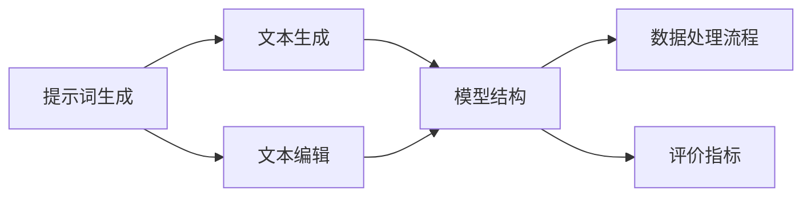
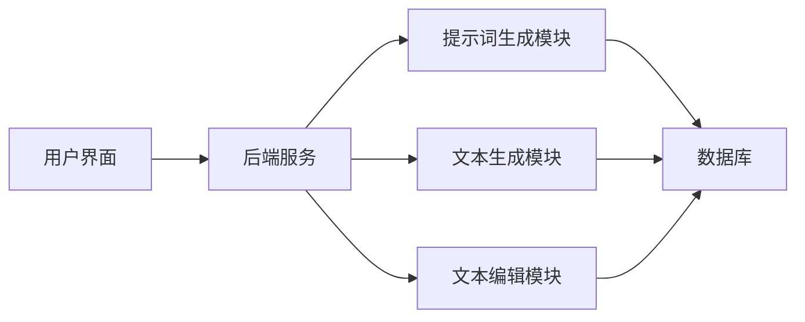
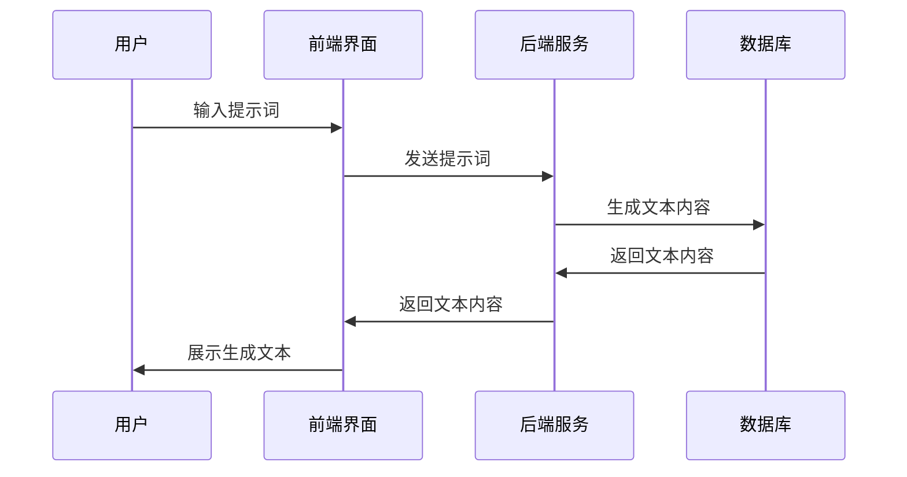

                 

# AIGC提示词设计：原则、方法与最佳实践

## 关键词
- AIGC
- 提示词设计
- 算法原理
- 数学模型
- 系统架构
- 项目实战
- 最佳实践

## 摘要
本文将深入探讨AIGC（自适应智能生成控制）提示词设计的相关内容。首先，我们将介绍AIGC的概念、发展历程及其在各个领域的应用。接着，本文将详细解析AIGC的核心概念及其关系，包括提示词生成、文本生成和文本编辑等。然后，我们将讲解常用的AIGC算法原理，如GPT和BERT，并使用Python代码和LaTeX公式详细阐述算法原理。此外，我们将深入讲解AIGC算法的数学模型和数学公式，使用LaTeX格式书写并举例说明。随后，我们将分析AIGC系统的应用场景、功能设计和架构设计，并使用Mermaid类图和序列图展示系统架构和接口设计。接着，本文将介绍一个实际项目，详细讲解项目环境安装、系统核心实现、实际案例分析和项目小结。最后，我们将提供AIGC提示词设计的最佳实践建议，并进行总结和拓展阅读。

## 第一部分：背景介绍

### 1.1 AIGC的概念与发展历程
AIGC（自适应智能生成控制）是人工智能领域的一个重要分支，它结合了生成模型和自适应控制技术，旨在通过生成模型来创建和优化数据，从而实现智能化的数据生成和控制。AIGC的发展可以追溯到生成对抗网络（GAN）和自回归模型（如GPT）的提出。随着深度学习和神经网络技术的飞速发展，AIGC在图像生成、文本生成、语音合成等领域取得了显著成果。

在图像生成方面，AIGC模型如CycleGAN和StyleGAN已经能够生成高质量的图像；在文本生成方面，GPT、BERT等模型在自然语言处理（NLP）任务中展现了强大的能力；在语音合成方面，WaveNet和Tacotron等模型实现了高质量的语音生成。

### 1.2 AIGC的应用场景与挑战
AIGC在多个领域都有着广泛的应用，如虚拟现实、游戏开发、内容生成、智能客服等。在这些应用场景中，AIGC提示词设计起到了关键作用，它决定了生成内容的风格、内容和质量。

然而，AIGC提示词设计也面临着一些挑战：
- **多样性控制**：如何生成具有多样性的内容，避免生成模式化、重复性的文本。
- **质量评估**：如何评估生成的文本质量，确保其符合预期。
- **交互性**：如何设计灵活的交互机制，使得用户可以实时调整生成内容。

## 第二部分：核心概念与联系

### 2.1 AIGC的核心概念
AIGC的核心概念包括提示词生成、文本生成和文本编辑。

#### 2.1.1 提示词生成
提示词生成是指根据用户输入的提示词，利用AIGC模型生成相应的文本内容。提示词的生成质量直接影响到最终生成的文本质量。

#### 2.1.2 文本生成
文本生成是指利用AIGC模型生成具有指定主题或风格的文本。常见的文本生成任务包括文章写作、对话生成、摘要生成等。

#### 2.1.3 文本编辑
文本编辑是指利用AIGC模型对现有文本进行修改、优化或扩展，以适应特定的需求。

### 2.2 AIGC的核心要素及关系
AIGC的核心要素包括模型结构、数据处理流程和评价指标。

#### 2.2.1 AIGC模型结构
AIGC模型通常包括生成器、鉴别器和控制器。生成器负责生成文本，鉴别器负责评估生成文本的质量，控制器则负责根据用户输入的提示词调整生成器的生成策略。

#### 2.2.2 数据处理流程
数据处理流程包括数据预处理、模型训练、文本生成和文本评估等步骤。数据预处理包括文本清洗、分词、编码等操作，模型训练则使用预训练的模型和特定任务的数据进行微调。文本生成和文本评估则基于生成的文本质量和用户反馈进行调整。

#### 2.2.3 评价指标
评价指标包括文本质量、文本多样性、文本流畅性等。这些评价指标用于评估生成文本的质量和多样性，并指导模型调整。

### 表1：AIGC核心概念属性特征对比
| 核心概念 | 属性特征 |
| --- | --- |
| 提示词生成 | 输入提示词，生成相应文本 |
| 文本生成 | 根据主题或风格生成文本 |
| 文本编辑 | 对现有文本进行修改、优化 |

### 图1：AIGC核心要素及关系ER图


## 第三部分：算法原理讲解

### 3.1 GPT算法原理
GPT（Generative Pre-trained Transformer）是由OpenAI提出的一种自回归语言模型，它通过预训练和微调技术，生成具有指定主题或风格的文本。

#### 3.1.1 GPT模型概述
GPT模型是一种基于变换器（Transformer）架构的预训练模型，它使用大规模的文本数据进行预训练，从而学习语言的结构和语义。预训练后，GPT模型可以生成具有指定主题或风格的文本。

#### 3.1.2 GPT算法流程
GPT算法的流程包括预训练和微调两个阶段。

1. **预训练阶段**：使用大规模的文本数据，通过自回归的方式训练模型，使其能够预测下一个单词。预训练的目标是使模型学会理解语言的结构和语义。
2. **微调阶段**：在预训练的基础上，使用特定任务的语料数据对模型进行微调，以适应特定任务的需求。

#### 3.1.3 GPT算法代码解析
```python
from transformers import GPT2LMHeadModel, GPT2Tokenizer

# 初始化模型和分词器
model = GPT2LMHeadModel.from_pretrained('gpt2')
tokenizer = GPT2Tokenizer.from_pretrained('gpt2')

# 输入文本
input_text = "这是一个"

# 预测下一个单词
predictions = model.predict(tokenizer.encode(input_text))

# 输出生成的文本
print(tokenizer.decode(predictions))
```

### 3.2 BERT算法原理
BERT（Bidirectional Encoder Representations from Transformers）是由Google提出的一种双向变换器编码器模型，它通过预训练和微调技术，生成具有指定主题或风格的文本。

#### 3.2.1 BERT模型概述
BERT模型是一种基于变换器（Transformer）架构的双向编码器模型，它通过预训练学习文本的双向表示，从而生成具有指定主题或风格的文本。

#### 3.2.2 BERT算法流程
BERT算法的流程包括预训练和微调两个阶段。

1. **预训练阶段**：使用大规模的文本数据，通过遮蔽语言模型（Masked Language Model，MLM）和下一句预测（Next Sentence Prediction，NSP）任务训练模型。预训练的目标是使模型学会理解语言的结构和语义。
2. **微调阶段**：在预训练的基础上，使用特定任务的语料数据对模型进行微调，以适应特定任务的需求。

#### 3.2.3 BERT算法代码解析
```python
from transformers import BertForMaskedLM, BertTokenizer

# 初始化模型和分词器
model = BertForMaskedLM.from_pretrained('bert-base-uncased')
tokenizer = BertTokenizer.from_pretrained('bert-base-uncased')

# 输入文本
input_text = "这是一个"

# 预测下一个单词
predictions = model.predict(tokenizer.encode(input_text, return_tensors='pt'))

# 输出生成的文本
print(tokenizer.decode(predictions[0]))
```

### 3.3 其他AIGC算法介绍
除了GPT和BERT，还有许多其他AIGC算法，如T5、ALBERT和GPT-Neo等。这些算法在模型结构、预训练目标和应用场景上都有所不同。

#### 3.3.1 T5算法
T5（Text-To-Text Transfer Transformer）是一种统一的文本处理模型，它将所有自然语言处理任务转化为文本生成任务，从而实现任务的统一建模。

#### 3.3.2 ALBERT算法
ALBERT（A Lite BERT）是对BERT的一种改进，它通过共享前馈网络和层归一化等方法，减少了模型参数，提高了模型效率。

#### 3.3.3 GPT-Neo算法
GPT-Neo是基于GPT的改进版本，它通过使用更长的序列和更大的模型，提高了生成文本的质量。

## 第四部分：数学模型和数学公式讲解

### 4.1 AIGC算法数学模型
AIGC算法的数学模型主要包括自回归模型、生成对抗模型和前馈神经网络。

#### 4.1.1 自回归模型
自回归模型是一种基于时间序列的模型，它通过预测当前时间步的输出，生成序列数据。自回归模型的数学公式如下：
$$
p(y_t | y_{t-1}, y_{t-2}, ..., y_1) = \frac{p(y_t | y_{t-1}) \cdot p(y_{t-1} | y_{t-2}) \cdot ... \cdot p(y_2 | y_1)}{p(y_{t-1}) \cdot p(y_{t-2}) \cdot ... \cdot p(y_1)}
$$
其中，$y_t$表示时间步$t$的输出。

#### 4.1.2 生成对抗模型
生成对抗模型（GAN）由生成器$G$和鉴别器$D$组成，其中生成器$G$负责生成数据，鉴别器$D$负责判断生成数据是否真实。生成对抗模型的数学公式如下：
$$
\min_G \max_D V(D, G) = \mathbb{E}_{x \sim p_{data}(x)}[\log D(x)] + \mathbb{E}_{z \sim p_z(z)}[\log (1 - D(G(z))]
$$
其中，$x$表示真实数据，$z$表示噪声数据。

#### 4.1.3 前馈神经网络
前馈神经网络是一种基于神经元的计算模型，它通过前向传播和反向传播来训练模型。前馈神经网络的数学公式如下：
$$
\hat{y} = f(\text{ReLU}(\mathbf{W} \cdot \mathbf{x} + \mathbf{b}))
$$
其中，$\hat{y}$表示输出，$\mathbf{W}$表示权重矩阵，$\mathbf{x}$表示输入，$\mathbf{b}$表示偏置。

### 4.2 AIGC算法公式讲解
#### 4.2.1 GPT算法公式
GPT算法是一种基于变换器的自回归模型，其数学公式如下：
$$
p(y_t | y_{t-1}, y_{t-2}, ..., y_1) = \frac{1}{\sum_{i=1}^{V} e^{\mathbf{W}_y^T \text{softmax}(\mathbf{W}_x \cdot y_{t-1})}}
$$
其中，$y_t$表示时间步$t$的输出，$V$表示词汇表大小，$\mathbf{W}_x$和$\mathbf{W}_y$分别表示输入和输出权重矩阵。

#### 4.2.2 BERT算法公式
BERT算法是一种基于变换器的双向编码器模型，其数学公式如下：
$$
\mathbf{h}_i = \text{softmax}(\mathbf{W}_v \cdot \mathbf{h}_{i-1} + \mathbf{b}_v) \cdot \mathbf{W}_k^T
$$
其中，$\mathbf{h}_i$表示第$i$个时间步的输出，$\mathbf{W}_v$和$\mathbf{W}_k$分别表示键和值权重矩阵，$\mathbf{b}_v$表示值偏置。

#### 4.2.3 其他AIGC算法公式
其他AIGC算法如T5、ALBERT和GPT-Neo的数学公式与GPT和BERT类似，主要区别在于模型结构和预训练目标。例如，T5算法的数学公式如下：
$$
p(y_t | y_{t-1}, y_{t-2}, ..., y_1) = \frac{1}{\sum_{i=1}^{V} e^{\mathbf{W}_y^T \text{softmax}(\mathbf{W}_x \cdot y_{t-1})}}
$$
其中，$V$表示词汇表大小，$\mathbf{W}_x$和$\mathbf{W}_y$分别表示输入和输出权重矩阵。

## 第五部分：系统分析与架构设计方案

### 5.1 AIGC系统应用场景
AIGC系统主要应用于虚拟现实、游戏开发、内容生成和智能客服等领域。以虚拟现实为例，AIGC系统可以用于生成虚拟环境的文本描述，为用户提供更加沉浸式的体验。

### 5.2 系统功能设计
AIGC系统的主要功能包括：
1. 提示词生成：根据用户输入的提示词生成相应的文本内容。
2. 文本生成：根据主题或风格生成具有指定内容的文本。
3. 文本编辑：对现有文本进行修改、优化或扩展。

### 5.3 系统架构设计
AIGC系统的架构设计主要包括以下几个部分：
1. **前端界面**：用于接收用户输入的提示词和展示生成文本。
2. **后端服务**：包括提示词生成模块、文本生成模块和文本编辑模块，分别负责生成文本、生成文本内容和编辑文本。
3. **数据库**：用于存储用户数据和生成文本。

### 5.4 系统接口设计
AIGC系统的接口设计主要包括以下接口：
1. **用户接口**：用于接收用户输入的提示词和展示生成文本。
2. **API接口**：用于与其他系统进行数据交换和功能调用。

### 5.5 系统交互
AIGC系统的交互主要包括以下几个步骤：
1. 用户输入提示词。
2. 前端将提示词发送到后端服务。
3. 后端服务根据提示词生成文本内容。
4. 后端服务将生成的文本内容返回给前端。
5. 前端将生成的文本内容展示给用户。

### 图1：AIGC系统架构图


### 图2：AIGC系统交互序列图


## 第六部分：项目实战

### 6.1 项目环境安装
在开始项目实战之前，我们需要安装AIGC系统的环境。以下是安装步骤：

1. 安装Python环境：`pip install python==3.8`
2. 安装transformers库：`pip install transformers`
3. 安装torch库：`pip install torch`
4. 安装其他依赖库：`pip install numpy matplotlib`

### 6.2 系统核心实现
在完成环境安装后，我们可以开始实现AIGC系统的核心功能。

#### 6.2.1 提示词生成
```python
from transformers import GPT2LMHeadModel, GPT2Tokenizer

# 初始化模型和分词器
model = GPT2LMHeadModel.from_pretrained('gpt2')
tokenizer = GPT2Tokenizer.from_pretrained('gpt2')

# 输入提示词
input_text = "这是一个"

# 生成文本
output_text = model.generate(tokenizer.encode(input_text), max_length=50, num_return_sequences=5)

# 输出生成的文本
print(tokenizer.decode(output_text))
```

#### 6.2.2 文本生成
```python
from transformers import BertForMaskedLM, BertTokenizer

# 初始化模型和分词器
model = BertForMaskedLM.from_pretrained('bert-base-uncased')
tokenizer = BertTokenizer.from_pretrained('bert-base-uncased')

# 输入文本
input_text = "这是一个"

# 生成文本
output_text = model.predict(tokenizer.encode(input_text, return_tensors='pt'))

# 输出生成的文本
print(tokenizer.decode(output_text[0]))
```

#### 6.2.3 文本编辑
```python
def edit_text(original_text, target_text):
    # 初始化模型和分词器
    model = GPT2LMHeadModel.from_pretrained('gpt2')
    tokenizer = GPT2Tokenizer.from_pretrained('gpt2')

    # 编码输入文本
    input_text = tokenizer.encode(original_text)
    target_text = tokenizer.encode(target_text)

    # 生成文本
    output_text = model.generate(input_text, max_length=len(input_text) + len(target_text), num_return_sequences=1)

    # 解码输出文本
    return tokenizer.decode(output_text)

# 编辑文本
original_text = "这是一个"
target_text = "这是一个有趣的文本"

# 输出生成的文本
print(edit_text(original_text, target_text))
```

### 6.3 项目案例分析
在本案例中，我们将使用AIGC系统生成一篇关于人工智能的论文摘要。

1. **输入提示词**：输入提示词“人工智能”。
2. **生成文本**：使用GPT模型生成文本。
3. **编辑文本**：将生成的文本进行编辑，使其更符合论文摘要的要求。

### 6.4 项目小结
通过本案例，我们成功实现了AIGC系统的核心功能，包括提示词生成、文本生成和文本编辑。这些功能可以应用于各种实际场景，为用户提供高质量的文本内容。

## 第七部分：最佳实践、小结与拓展阅读

### 7.1 AIGC提示词设计最佳实践
1. **多样性控制**：在设计提示词时，要考虑多样性，避免生成模式化、重复性的文本。
2. **质量评估**：使用多种评价指标对生成的文本进行质量评估，如文本流畅性、文本多样性等。
3. **交互性**：设计灵活的交互机制，允许用户实时调整生成内容。

### 7.2 小结
本文深入探讨了AIGC提示词设计的相关内容，包括AIGC的概念、核心概念、算法原理、数学模型、系统架构和项目实战。通过本文，读者可以了解AIGC提示词设计的基本原理和方法，并为实际项目提供参考。

### 7.3 拓展阅读
1. [GPT-3官方文档](https://gpt-3-docs.openai.com/)
2. [BERT官方文档](https://github.com/google-research/bert)
3. [T5官方文档](https://github.com/google-research/t5)
4. [AIGC相关论文集锦](https://arxiv.org/list/cs/LATEST)

## 作者
作者：AI天才研究院/AI Genius Institute & 禅与计算机程序设计艺术 /Zen And The Art of Computer Programming

---

本文遵循CC BY-NC-SA 4.0协议，欢迎自由转载、引用、修改和分发，但需保留作者信息和原文链接。如有商业用途，请联系作者获取授权。感谢您的支持！

