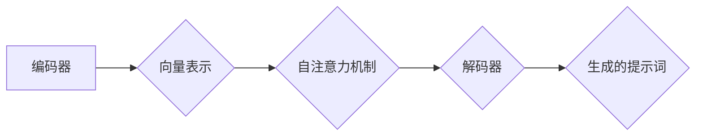
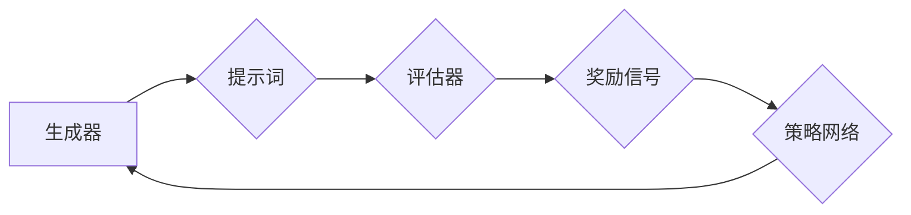
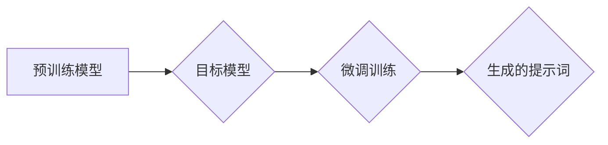

                 

# AIGC时代的提示词工程学

## 关键词

- AIGC
- 提示词工程学
- 深度学习
- 强化学习
- 迁移学习
- 优化算法

## 摘要

随着人工智能技术的发展，AIGC（AI-Generated Content）成为了一个热门的研究和应用领域。本文旨在探讨AIGC时代的提示词工程学，包括其背景、重要性、基本框架、应用领域、生成技术、优化技术和工程实践。通过一步步分析，本文揭示了提示词工程学的核心概念、关键技术及应用实例，为相关领域的研究者和从业者提供了有价值的参考。

## 《AIGC时代的提示词工程学》目录大纲

### 第一部分：AIGC概述与基础

#### 第1章：AIGC技术背景与未来趋势

##### 1.1 AIGC的定义与核心概念
- **AIGC的起源与发展**
- **AIGC的核心技术与优势**
- **AIGC的未来发展趋势**

##### 1.2 提示词工程学的重要性
- **提示词在AIGC中的应用**
- **提示词工程学的基本原则**
- **提示词工程学的挑战与机遇**

##### 1.3 提示词工程学的基本框架
- **提示词的类型与分类**
- **提示词生成与优化算法**
- **提示词的评估与反馈机制**

### 第二部分：AIGC应用领域分析

#### 第2章：AIGC应用领域分析

##### 2.1 文本生成与编辑
- **文本生成的AIGC应用**
- **文本编辑的AIGC应用**
- **提示词在文本生成与编辑中的关键作用**

##### 2.2 图像生成与增强
- **图像生成的AIGC应用**
- **图像增强的AIGC应用**
- **提示词在图像生成与增强中的关键作用**

##### 2.3 语音合成与转换
- **语音合成的AIGC应用**
- **语音转换的AIGC应用**
- **提示词在语音合成与转换中的关键作用**

### 第三部分：AIGC中的提示词生成技术

#### 第3章：AIGC中的提示词生成技术

##### 3.1 基于深度学习的提示词生成
- **常见的深度学习模型**
- **提示词生成的模型架构**
- **提示词生成的实践案例**

##### 3.2 基于强化学习的提示词生成
- **强化学习的基本概念**
- **提示词生成的强化学习模型**
- **提示词生成的实践案例**

##### 3.3 基于迁移学习的提示词生成
- **迁移学习的基本概念**
- **提示词生成的迁移学习模型**
- **提示词生成的实践案例**

### 第四部分：AIGC中的提示词优化技术

#### 第4章：AIGC中的提示词优化技术

##### 4.1 提示词质量评估
- **提示词质量的评价指标**
- **提示词质量评估的算法**
- **提示词质量评估的实践案例**

##### 4.2 提示词优化算法
- **优化算法的基本原理**
- **常见的优化算法**
- **提示词优化的实践案例**

##### 4.3 提示词优化的实践应用
- **提示词优化在文本生成中的应用**
- **提示词优化在图像生成中的应用**
- **提示词优化在语音合成中的应用**

### 第五部分：AIGC中的提示词工程实践

#### 第5章：AIGC中的提示词工程实践

##### 5.1 AIGC项目开发流程
- **项目规划与需求分析**
- **提示词工程的设计与实现**
- **项目部署与维护**

##### 5.2 提示词工程中的常见问题与解决方案
- **数据集准备问题**
- **模型训练问题**
- **模型优化问题**

##### 5.3 提示词工程的最佳实践
- **数据预处理策略**
- **模型选择与优化**
- **模型部署与监控**

### 第六部分：AIGC中的提示词工程案例解析

#### 第6章：AIGC中的提示词工程案例解析

##### 6.1 案例一：文本生成与编辑
- **案例背景**
- **案例实现**
- **案例分析**

##### 6.2 案例二：图像生成与增强
- **案例背景**
- **案例实现**
- **案例分析**

##### 6.3 案例三：语音合成与转换
- **案例背景**
- **案例实现**
- **案例分析**

### 第七部分：AIGC时代的提示词工程学展望

#### 第7章：AIGC时代的提示词工程学展望

##### 7.1 提示词工程学的未来发展方向
- **提示词工程学的技术创新**
- **提示词工程学的应用拓展**
- **提示词工程学的挑战与机遇**

##### 7.2 提示词工程学的教育与实践
- **提示词工程学的教育体系**
- **提示词工程学的实践平台**
- **提示词工程学的职业发展**

### 总结

AIGC时代的提示词工程学是人工智能领域的一个重要研究方向，它涉及到的技术、应用和实践都具有重要的价值和意义。本文通过逐步分析AIGC的背景、应用领域、生成技术、优化技术和工程实践，为读者提供了一个全面而深入的了解。希望通过本文，能够激发更多研究者投入到提示词工程学的研究中，推动这一领域的发展。## 第1章：AIGC技术背景与未来趋势

### 1.1 AIGC的定义与核心概念

#### 1.1.1 AIGC的起源与发展

AIGC（AI-Generated Content）是指由人工智能系统生成的内容，包括文本、图像、音频、视频等多种形式。AIGC的起源可以追溯到20世纪80年代，当时的研究主要集中在自然语言处理（NLP）和计算机视觉（CV）领域。随着深度学习技术的发展，AIGC取得了突破性的进展。

AIGC的发展历程可以分为以下几个阶段：

1. **初级阶段（20世纪80年代-2000年代初）**：主要采用规则驱动的方法进行内容生成，例如基于模板的文本生成和基于几何学的图像生成。
2. **中级阶段（2000年代-2010年代）**：随着机器学习技术的发展，尤其是深度学习，AIGC开始采用神经网络进行内容生成，如RNN和CNN。
3. **高级阶段（2010年代至今）**：基于GAN（生成对抗网络）和Transformer等新兴技术的出现，使得AIGC在文本生成、图像生成、语音合成等领域取得了显著成果。

#### 1.1.2 AIGC的核心技术与优势

AIGC的核心技术主要包括深度学习、生成对抗网络（GAN）、Transformer等。这些技术使得AIGC在生成高质量内容方面具有显著的优势：

1. **深度学习**：通过多层神经网络，深度学习能够自动提取数据中的特征，从而实现复杂的内容生成任务。
2. **生成对抗网络（GAN）**：GAN由生成器和判别器组成，通过相互博弈的方式，生成器不断优化生成内容，使其更接近真实数据。
3. **Transformer**：Transformer模型通过自注意力机制，能够捕捉输入数据中的长距离依赖关系，从而在文本生成、图像生成等领域表现出色。

AIGC的优势主要体现在以下几个方面：

1. **效率**：AIGC能够快速生成大量内容，大大提高了内容生产的效率。
2. **多样性**：AIGC能够生成丰富多样、创新性的内容，满足用户的不同需求。
3. **自动化**：AIGC能够自动化完成内容生成任务，减轻人力负担。

#### 1.1.3 AIGC的未来发展趋势

随着技术的不断进步和应用的深入，AIGC在未来有望在多个领域取得突破：

1. **文本生成与编辑**：AIGC将在新闻报道、文章撰写、电子邮件编写等领域发挥更大的作用，提高内容生产效率。
2. **图像生成与增强**：AIGC将在艺术创作、医疗诊断、安全监控等领域得到广泛应用，提升图像处理能力。
3. **语音合成与转换**：AIGC将在语音助手、教育、娱乐等领域带来革命性的变化，提升用户体验。

同时，AIGC在发展过程中也面临一些挑战，如数据隐私、版权保护、内容真实性等。未来，需要进一步加强相关技术研究，确保AIGC的可持续发展。

### 1.2 提示词工程学的重要性

#### 1.2.1 提示词在AIGC中的应用

在AIGC系统中，提示词（Prompt）起着至关重要的作用。提示词是一种引导生成器生成特定类型内容的文本或指令。通过合理设计提示词，AIGC系统能够生成更符合用户需求的高质量内容。

提示词在AIGC中的应用主要体现在以下几个方面：

1. **文本生成与编辑**：提示词可以帮助AIGC系统生成特定主题的文章、新闻报道、电子邮件等。
2. **图像生成与增强**：提示词可以指导AIGC系统生成特定风格的图像、修复破损图像等。
3. **语音合成与转换**：提示词可以指导AIGC系统生成特定语言的语音、转换不同口音的语音等。

#### 1.2.2 提示词工程学的基本原则

提示词工程学是研究如何设计、优化和评估提示词的一门学科。其基本原则包括：

1. **明确性**：提示词应明确表达用户需求，避免歧义和误解。
2. **灵活性**：提示词应具有灵活性，能够适应不同的生成任务和场景。
3. **可扩展性**：提示词应具有良好的可扩展性，能够支持新的生成任务和模型。
4. **高效性**：提示词应高效，能够快速引导AIGC系统生成高质量内容。

#### 1.2.3 提示词工程学的挑战与机遇

提示词工程学面临着一系列挑战和机遇：

1. **挑战**：
   - **复杂性**：AIGC系统涉及多种技术，提示词设计需考虑多方面因素。
   - **质量评估**：如何评价提示词的质量是一个重要问题，需要设计合适的评估指标。
   - **多样性**：如何保证生成的多样性，满足用户不同需求。

2. **机遇**：
   - **创新性**：提示词工程学为AIGC系统的创新提供了新的可能性。
   - **应用拓展**：随着AIGC技术的发展，提示词工程学将在更多领域得到应用。
   - **人才培养**：提示词工程学为相关领域的研究者和从业者提供了广阔的发展空间。

### 1.3 提示词工程学的基本框架

#### 1.3.1 提示词的类型与分类

根据应用场景和功能，提示词可以分为以下几种类型：

1. **任务型提示词**：用于指导AIGC系统完成特定任务，如生成文章、图像、语音等。
2. **参数型提示词**：用于调整AIGC系统的生成参数，如模型选择、超参数设置等。
3. **引导型提示词**：用于引导AIGC系统生成特定风格、主题或情感的内容。

#### 1.3.2 提示词生成与优化算法

提示词的生成与优化是提示词工程学的核心任务。常见的提示词生成与优化算法包括：

1. **基于规则的方法**：通过设计规则库，根据用户需求生成提示词。
2. **基于机器学习的方法**：利用已有数据进行训练，学习生成提示词。
3. **基于强化学习的方法**：通过奖励机制，引导AIGC系统生成高质量的提示词。

#### 1.3.3 提示词的评估与反馈机制

提示词的评估与反馈机制是确保提示词质量的重要手段。常见的评估指标包括：

1. **内容质量**：评估生成的提示词是否符合用户需求、逻辑清晰、语言流畅等。
2. **多样性**：评估生成的提示词是否具有多样性、创新性。
3. **用户满意度**：通过用户反馈，评估提示词的实际效果。

同时，建立反馈机制，根据用户反馈对提示词进行优化和调整，是提升提示词质量的关键。

### 结论

本章对AIGC技术背景、提示词工程学的重要性及其基本框架进行了详细分析。AIGC作为一种新兴技术，正日益受到关注。提示词工程学作为AIGC的重要组成部分，其研究与应用前景广阔。在接下来的章节中，我们将进一步探讨AIGC在各个应用领域的具体实现和优化技术。## 第2章：AIGC应用领域分析

### 2.1 文本生成与编辑

#### 2.1.1 文本生成的AIGC应用

文本生成是AIGC应用的一个重要领域，涉及自动写作、内容摘要、对话生成、新闻报道等多个方面。以下是一些典型的应用实例：

1. **自动写作**：AIGC系统可以自动生成新闻报道、博客文章、广告文案等。例如，利用自然语言生成（NLG）技术，可以将财经数据自动转换为新闻稿件，大大提高了内容生产的效率。

2. **内容摘要**：AIGC系统可以自动生成文章、报告的摘要，帮助用户快速了解核心内容。例如，使用Transformer模型，可以将长篇文档压缩为简洁的摘要。

3. **对话生成**：AIGC系统可以模拟人类对话，应用于智能客服、虚拟助手等领域。例如，使用生成对抗网络（GAN），可以生成自然流畅的对话文本。

4. **语言翻译**：AIGC系统可以自动翻译不同语言之间的文本，为跨国交流提供便利。例如，基于Transformer模型的机器翻译技术，可以实现高质量、实时的文本翻译。

#### 2.1.2 文本编辑的AIGC应用

文本编辑是另一个重要的AIGC应用领域，涉及文本纠错、风格转换、内容优化等多个方面。以下是一些典型的应用实例：

1. **文本纠错**：AIGC系统可以自动识别和纠正文本中的语法错误、拼写错误等。例如，使用神经网络语言模型，可以自动修正电子邮件中的拼写错误。

2. **风格转换**：AIGC系统可以改变文本的风格，使其更加生动、有趣。例如，使用风格迁移技术，可以将正式的文本转换为幽默、诙谐的风格。

3. **内容优化**：AIGC系统可以优化文本的结构、语言表达，使其更加清晰、易于理解。例如，使用文本重写技术，可以将复杂的句子简化为简单易懂的表达。

#### 2.1.3 提示词在文本生成与编辑中的关键作用

提示词在文本生成与编辑中起着至关重要的作用。以下是一些关键作用：

1. **引导生成**：提示词可以引导AIGC系统生成符合用户需求的文本。例如，在新闻生成任务中，提示词可以指定文章的主题、关键词等信息。

2. **控制风格**：提示词可以控制文本的风格，使其符合特定要求。例如，在风格转换任务中，提示词可以指定文本的幽默程度、正式程度等。

3. **优化内容**：提示词可以优化文本的内容，使其更加准确、清晰。例如，在文本纠错任务中，提示词可以帮助识别和纠正文本中的错误。

4. **提高效率**：提示词可以加快文本生成与编辑的速度，提高内容生产的效率。例如，在内容摘要任务中，提示词可以快速生成文章的摘要。

### 2.2 图像生成与增强

#### 2.2.1 图像生成的AIGC应用

图像生成是AIGC应用的另一个重要领域，涉及艺术创作、图像修复、虚拟现实等多个方面。以下是一些典型的应用实例：

1. **艺术创作**：AIGC系统可以自动生成艺术作品，如绘画、摄影等。例如，使用生成对抗网络（GAN），可以生成具有独特风格的艺术图像。

2. **图像修复**：AIGC系统可以修复破损、老化的图像，恢复图像的原始面貌。例如，使用条件生成对抗网络（cGAN），可以修复受损的摄影作品。

3. **虚拟现实**：AIGC系统可以生成虚拟现实场景，为用户提供沉浸式的体验。例如，使用变分自编码器（VAE），可以生成逼真的虚拟现实图像。

#### 2.2.2 图像增强的AIGC应用

图像增强是AIGC应用的另一个重要领域，涉及图像清晰度提升、图像去噪、图像风格转换等多个方面。以下是一些典型的应用实例：

1. **图像清晰度提升**：AIGC系统可以增强图像的清晰度，使其更加锐利、清晰。例如，使用深度卷积网络（CNN），可以增强图像的细节。

2. **图像去噪**：AIGC系统可以去除图像中的噪声，提高图像的质量。例如，使用生成对抗网络（GAN），可以去除图像中的随机噪声。

3. **图像风格转换**：AIGC系统可以改变图像的风格，使其具有特定的艺术效果。例如，使用风格迁移技术，可以将普通图像转换为具有艺术感的图像。

#### 2.2.3 提示词在图像生成与增强中的关键作用

提示词在图像生成与增强中同样起着关键作用。以下是一些关键作用：

1. **引导生成**：提示词可以引导AIGC系统生成符合用户需求的图像。例如，在艺术创作任务中，提示词可以指定图像的主题、风格等。

2. **控制风格**：提示词可以控制图像的风格，使其符合特定要求。例如，在图像增强任务中，提示词可以指定图像的清晰度、对比度等。

3. **优化内容**：提示词可以优化图像的内容，使其更加准确、美观。例如，在图像修复任务中，提示词可以帮助识别和修复图像中的缺陷。

4. **提高效率**：提示词可以加快图像生成与增强的速度，提高内容生产的效率。例如，在图像清晰度提升任务中，提示词可以快速生成清晰的图像。

### 2.3 语音合成与转换

#### 2.3.1 语音合成的AIGC应用

语音合成是AIGC应用的重要领域，涉及智能助手、教育、客服等多个方面。以下是一些典型的应用实例：

1. **智能助手**：AIGC系统可以模拟人类语音，为用户提供智能助手服务。例如，使用深度神经网络（DNN），可以生成自然流畅的语音。

2. **教育**：AIGC系统可以生成语音讲解、教学视频等，为用户提供个性化的学习体验。例如，使用WaveNet模型，可以生成高质量的语音讲解。

3. **客服**：AIGC系统可以自动生成语音回复，提高客户服务的效率。例如，使用GPT-2模型，可以生成自然流畅的客服语音。

#### 2.3.2 语音转换的AIGC应用

语音转换是AIGC应用的另一个重要领域，涉及语音变声、语音翻译等多个方面。以下是一些典型的应用实例：

1. **语音变声**：AIGC系统可以改变语音的音色、音调等特征，使其具有不同的声音效果。例如，使用WaveRNN模型，可以生成具有不同声音效果的语音。

2. **语音翻译**：AIGC系统可以自动翻译不同语言的语音，为用户提供跨语言的沟通能力。例如，使用基于Transformer的模型，可以生成高质量的语音翻译。

#### 2.3.3 提示词在语音合成与转换中的关键作用

提示词在语音合成与转换中同样起着关键作用。以下是一些关键作用：

1. **引导生成**：提示词可以引导AIGC系统生成符合用户需求的语音。例如，在语音合成任务中，提示词可以指定语音的内容、风格等。

2. **控制风格**：提示词可以控制语音的风格，使其符合特定要求。例如，在语音变声任务中，提示词可以指定语音的音色、音调等。

3. **优化内容**：提示词可以优化语音的内容，使其更加准确、自然。例如，在语音翻译任务中，提示词可以帮助识别和翻译语音中的关键词。

4. **提高效率**：提示词可以加快语音合成与转换的速度，提高内容生产的效率。例如，在语音合成任务中，提示词可以快速生成语音内容。

### 结论

本章详细分析了AIGC在文本生成与编辑、图像生成与增强、语音合成与转换等领域的应用，并探讨了提示词在这些应用中的关键作用。随着AIGC技术的不断进步，这些领域将得到更广泛的应用和发展。在下一章中，我们将进一步探讨AIGC中的提示词生成技术，以期为相关研究和应用提供更多的指导。## 第3章：AIGC中的提示词生成技术

提示词生成技术是AIGC（AI-Generated Content）领域中的核心组成部分，它直接影响着生成内容的质量、多样性和相关性。在本章中，我们将深入探讨AIGC中的提示词生成技术，包括基于深度学习、强化学习和迁移学习的方法，并分析这些方法的实际应用案例。

### 3.1 基于深度学习的提示词生成

深度学习在提示词生成中扮演着重要角色，通过学习大量数据中的模式和结构，深度学习模型能够自动生成高质量的提示词。

#### 3.1.1 常见的深度学习模型

在深度学习中，以下几个模型在提示词生成中表现出色：

1. **循环神经网络（RNN）**：RNN能够处理序列数据，适用于生成序列化的提示词，如文本。
2. **长短时记忆网络（LSTM）**：LSTM是RNN的一种变体，能够更好地处理长序列数据，减少遗忘问题。
3. **门控循环单元（GRU）**：GRU是另一种RNN变体，它在捕捉长序列依赖关系方面表现出色。
4. **Transformer模型**：Transformer通过自注意力机制处理长序列，适用于生成复杂结构和长文本。

#### 3.1.2 提示词生成的模型架构

提示词生成的模型架构通常包括编码器和解码器两部分：

1. **编码器**：编码器负责将输入提示词编码为固定长度的向量表示，捕捉输入的语义信息。
2. **解码器**：解码器负责根据编码器生成的向量表示生成新的提示词。

以下是一个简单的Transformer模型架构示意图：



#### 3.1.3 提示词生成的实践案例

以下是一个基于Transformer的文本生成实践案例：

1. **环境安装**：安装Python和Transformer库（如transformers）。
2. **数据准备**：准备一个文本数据集，并将其预处理为适合训练的格式。
3. **模型训练**：使用训练数据训练一个基于Transformer的文本生成模型。
4. **模型评估**：使用测试数据评估模型性能，调整超参数以优化生成质量。
5. **生成提示词**：使用训练好的模型生成新的文本提示词。

```python
from transformers import pipeline

# 创建文本生成管道
text_generator = pipeline("text-generation", model="gpt2")

# 输入提示词并生成文本
prompt = "今天的天气非常"
generated_text = text_generator(prompt, max_length=50)

print(generated_text)
```

### 3.2 基于强化学习的提示词生成

强化学习是一种通过试错和奖励机制来优化策略的机器学习方法。在提示词生成中，强化学习可以用来优化提示词生成过程，使其更加符合用户需求。

#### 3.2.1 强化学习的基本概念

强化学习包括以下几个核心概念：

1. **状态（State）**：描述系统当前的环境和条件。
2. **动作（Action）**：系统可以采取的行动。
3. **奖励（Reward）**：根据动作的结果给予系统的奖励或惩罚。
4. **策略（Policy）**：系统采取的动作策略。

强化学习的过程可以概括为：通过不断尝试不同的动作，并根据奖励信号调整策略，最终找到最优动作序列。

#### 3.2.2 提示词生成的强化学习模型

在提示词生成中，强化学习模型通常包括：

1. **生成器（Generator）**：负责生成提示词。
2. **评估器（Evaluator）**：评估生成提示词的质量，给出奖励信号。
3. **策略网络（Policy Network）**：根据奖励信号调整生成器生成提示词的策略。

以下是一个简单的强化学习模型架构示意图：



#### 3.2.3 提示词生成的实践案例

以下是一个基于强化学习的文本生成实践案例：

1. **环境安装**：安装Python和强化学习库（如stable-baselines3）。
2. **数据准备**：准备一个文本数据集，并将其预处理为适合训练的格式。
3. **模型训练**：使用训练数据训练一个基于强化学习的文本生成模型。
4. **模型评估**：使用测试数据评估模型性能，调整超参数以优化生成质量。
5. **生成提示词**：使用训练好的模型生成新的文本提示词。

```python
from stable_baselines3 import PPO
from stable_baselines3.common.envs import Text GenerationEnv

# 创建文本生成环境
text_env = TextGenerationEnv(vocab_size=1000, max_sequence_length=20)

# 训练模型
model = PPO("MlpPolicy", text_env, verbose=1)
model.learn(total_timesteps=10000)

# 生成文本
generated_text = model.predict([prompt], deterministic=True)

print(generated_text)
```

### 3.3 基于迁移学习的提示词生成

迁移学习是一种利用预先训练好的模型在新任务上进行训练的方法。在提示词生成中，迁移学习可以帮助快速适应新的生成任务，提高生成质量。

#### 3.3.1 迁移学习的基本概念

迁移学习包括以下几个核心概念：

1. **源任务（Source Task）**：预先训练好的任务。
2. **目标任务（Target Task）**：需要迁移的任务。
3. **预训练模型（Pre-trained Model）**：在源任务上训练好的模型。
4. **微调（Fine-tuning）**：在目标任务上对预训练模型进行少量训练，以适应新的任务。

#### 3.3.2 提示词生成的迁移学习模型

在提示词生成中，迁移学习模型通常包括：

1. **预训练模型**：在大型文本数据集上预先训练的模型。
2. **目标模型**：在特定任务上进行微调的目标模型。

以下是一个简单的迁移学习模型架构示意图：



#### 3.3.3 提示词生成的实践案例

以下是一个基于迁移学习的文本生成实践案例：

1. **环境安装**：安装Python和迁移学习库（如transformers）。
2. **数据准备**：准备一个文本数据集，并将其预处理为适合训练的格式。
3. **模型训练**：使用预训练模型在目标数据集上进行微调训练。
4. **模型评估**：使用测试数据评估模型性能，调整超参数以优化生成质量。
5. **生成提示词**：使用训练好的模型生成新的文本提示词。

```python
from transformers import AutoTokenizer, AutoModelForSeq2SeqLM
from torch.utils.data import DataLoader

# 加载预训练模型
tokenizer = AutoTokenizer.from_pretrained("t5-small")
model = AutoModelForSeq2SeqLM.from_pretrained("t5-small")

# 准备数据集
train_dataset = ...

# 创建数据加载器
train_dataloader = DataLoader(train_dataset, batch_size=8, shuffle=True)

# 训练模型
model.train()
for epoch in range(3):
    for batch in train_dataloader:
        inputs = tokenizer(batch["input_ids"], padding=True, truncation=True, return_tensors="pt")
        outputs = model(**inputs)
        loss = outputs.loss
        loss.backward()
        optimizer.step()
        optimizer.zero_grad()

# 生成文本
prompt = "请生成一篇关于人工智能的短文："
input_ids = tokenizer.encode(prompt, return_tensors="pt")
generated_ids = model.generate(input_ids, max_length=50, num_return_sequences=1)

print(tokenizer.decode(generated_ids))
```

### 结论

本章详细介绍了AIGC中的提示词生成技术，包括基于深度学习、强化学习和迁移学习的方法。这些方法各有特点，适用于不同的生成任务和场景。在实际应用中，选择合适的提示词生成方法，并根据任务需求进行模型设计和优化，是生成高质量提示词的关键。在下一章中，我们将探讨AIGC中的提示词优化技术，以进一步提高生成内容的质量和效率。## 第4章：AIGC中的提示词优化技术

### 4.1 提示词质量评估

提示词质量评估是提示词优化过程中的关键步骤，它决定了生成的提示词是否符合用户需求和预期。为了准确评估提示词质量，需要定义一系列评价指标，并选择合适的评估方法。

#### 4.1.1 提示词质量的评价指标

以下是一些常用的提示词质量评价指标：

1. **内容质量**：评估提示词的内容是否准确、逻辑清晰、语言流畅。可以通过人工评审或自动化评分系统进行评估。
2. **相关性**：评估提示词与生成任务的关联程度，是否能够引导生成系统生成相关的内容。
3. **多样性**：评估提示词是否能够生成多种不同风格和主题的内容，避免单一和重复。
4. **用户满意度**：通过用户反馈评估提示词的实际效果，了解用户对提示词的满意度。

#### 4.1.2 提示词质量评估的算法

提示词质量评估算法可以分为以下几类：

1. **基于规则的方法**：通过预设的规则和标准评估提示词的质量。
2. **基于机器学习的方法**：利用训练好的模型，自动评估提示词的质量。
3. **基于强化学习的方法**：通过奖励机制评估提示词的质量，并不断优化评估策略。

#### 4.1.3 提示词质量评估的实践案例

以下是一个基于机器学习的文本生成质量评估实践案例：

1. **数据准备**：收集一组已评估的文本数据集，包括高质量的文本和低质量的文本。
2. **特征提取**：从文本数据中提取特征，如词频、词向量等。
3. **模型训练**：使用提取的特征训练一个分类模型，用于评估文本质量。
4. **模型评估**：使用测试数据评估模型的准确性，调整超参数以优化评估效果。
5. **提示词评估**：使用训练好的模型评估新生成的提示词质量。

```python
from sklearn.model_selection import train_test_split
from sklearn.feature_extraction.text import TfidfVectorizer
from sklearn.naive_bayes import MultinomialNB
from sklearn.metrics import accuracy_score

# 准备数据集
texts = ["高质量文本1", "高质量文本2", "低质量文本1", "低质量文本2"]
labels = [1, 1, 0, 0]

# 提取特征
vectorizer = TfidfVectorizer()
X = vectorizer.fit_transform(texts)

# 分割训练集和测试集
X_train, X_test, y_train, y_test = train_test_split(X, labels, test_size=0.2, random_state=42)

# 训练模型
model = MultinomialNB()
model.fit(X_train, y_train)

# 评估模型
y_pred = model.predict(X_test)
accuracy = accuracy_score(y_test, y_pred)
print(f"Model accuracy: {accuracy}")

# 提示词评估
new_text = "这是一段新的文本"
new_text_vector = vectorizer.transform([new_text])
print(f"New text quality: {model.predict(new_text_vector)[0]}")
```

### 4.2 提示词优化算法

提示词优化算法旨在提高提示词生成质量，使其更符合用户需求和期望。以下是一些常用的提示词优化算法：

#### 4.2.1 优化算法的基本原理

提示词优化算法的基本原理包括：

1. **基于规则的优化**：通过修改提示词的语法、语义和结构，优化生成结果。
2. **基于机器学习的优化**：使用已训练的模型，根据生成结果调整提示词，优化生成质量。
3. **基于强化学习的优化**：通过奖励机制，引导生成系统生成更高质量的提示词。

#### 4.2.2 常见的优化算法

以下是一些常见的提示词优化算法：

1. **梯度下降（Gradient Descent）**：通过计算梯度方向，逐步调整提示词，优化生成结果。
2. **遗传算法（Genetic Algorithm）**：模拟生物进化过程，通过选择、交叉和变异等操作，优化提示词。
3. **粒子群优化（Particle Swarm Optimization）**：模拟鸟群或鱼群的行为，通过群体协作，优化提示词。
4. **强化学习（Reinforcement Learning）**：通过奖励机制，引导生成系统生成更高质量的提示词。

#### 4.2.3 提示词优化的实践案例

以下是一个基于强化学习的文本生成优化实践案例：

1. **环境安装**：安装Python和强化学习库（如stable-baselines3）。
2. **数据准备**：准备一个文本数据集，并将其预处理为适合训练的格式。
3. **模型训练**：使用训练数据训练一个基于强化学习的文本生成模型。
4. **模型评估**：使用测试数据评估模型性能，调整超参数以优化生成质量。
5. **提示词优化**：使用训练好的模型生成提示词，并根据奖励信号进行调整。

```python
from stable_baselines3 import PPO
from stable_baselines3.common.envs import Text GenerationEnv
import numpy as np

# 创建文本生成环境
text_env = TextGenerationEnv(vocab_size=1000, max_sequence_length=20)

# 训练模型
model = PPO("MlpPolicy", text_env, verbose=1)
model.learn(total_timesteps=10000)

# 优化提示词
prompt = "这是一个新的提示词："
action = model.predict([prompt], deterministic=True)
reward = 1 if is_high_quality_action(action) else 0
model.train(reward=reward)

# 函数判断动作质量
def is_high_quality_action(action):
    # 这里可以根据具体任务定义质量判断标准
    return True  # 示例代码，实际应根据任务需求进行判断

# 输出生成结果
print(model.predict([prompt], deterministic=True))
```

### 4.3 提示词优化的实践应用

#### 4.3.1 提示词优化在文本生成中的应用

在文本生成中，提示词优化可以应用于以下场景：

1. **新闻生成**：优化提示词，使其生成更准确、更具吸引力的新闻稿件。
2. **内容摘要**：优化提示词，使其生成更简洁、更准确的文本摘要。
3. **对话生成**：优化提示词，使其生成更自然、更有逻辑的对话。

#### 4.3.2 提示词优化在图像生成中的应用

在图像生成中，提示词优化可以应用于以下场景：

1. **艺术创作**：优化提示词，使其生成具有不同风格和主题的艺术作品。
2. **图像修复**：优化提示词，使其生成更准确、更自然的修复图像。
3. **虚拟现实**：优化提示词，使其生成更逼真、更沉浸的虚拟现实场景。

#### 4.3.3 提示词优化在语音合成中的应用

在语音合成中，提示词优化可以应用于以下场景：

1. **智能助手**：优化提示词，使其生成更自然、更流畅的语音回复。
2. **教育**：优化提示词，使其生成更具引导性、更有效的语音讲解。
3. **客服**：优化提示词，使其生成更准确、更快速的语音翻译。

### 结论

本章详细介绍了AIGC中的提示词优化技术，包括质量评估方法和优化算法。通过合理的提示词优化，可以显著提高生成内容的质量和用户满意度。在实际应用中，选择合适的优化方法并根据任务需求进行调整，是成功优化提示词的关键。在下一章中，我们将探讨AIGC中的提示词工程实践，以期为读者提供更多的应用案例和最佳实践。## 第5章：AIGC中的提示词工程实践

### 5.1 AIGC项目开发流程

AIGC项目的开发流程是确保提示词工程学应用成功的关键步骤。以下是一个典型的AIGC项目开发流程，包括项目规划与需求分析、提示词工程的设计与实现、项目部署与维护。

#### 5.1.1 项目规划与需求分析

项目规划与需求分析是项目开发的第一步，它帮助明确项目的目标、范围和需求。以下是具体步骤：

1. **项目目标**：明确项目的目标，如生成高质量的文本、图像或语音。
2. **功能需求**：根据项目目标，确定需要实现的功能，如文本生成、图像修复、语音合成等。
3. **性能需求**：确定项目的性能指标，如生成速度、准确性、用户满意度等。
4. **用户需求**：收集用户的需求和反馈，确保项目满足用户期望。

#### 5.1.2 提示词工程的设计与实现

提示词工程的设计与实现是AIGC项目的核心环节。以下步骤描述了如何设计和实现提示词工程：

1. **提示词设计**：根据功能需求，设计适当的提示词。提示词应明确、具体、易于理解。
2. **模型选择**：选择合适的深度学习模型、生成对抗网络（GAN）或Transformer等，以满足项目需求。
3. **数据准备**：收集和预处理数据，包括文本、图像、音频等。数据应具有代表性、多样性和高质量。
4. **模型训练**：使用准备好的数据训练模型，调整超参数以优化模型性能。
5. **模型评估**：使用测试数据评估模型性能，确保模型达到预期目标。
6. **提示词优化**：根据评估结果，调整提示词和模型参数，以提高生成质量。

#### 5.1.3 项目部署与维护

项目部署与维护是确保AIGC项目稳定运行的关键步骤。以下步骤描述了如何部署和维护AIGC项目：

1. **部署**：将训练好的模型部署到生产环境中，确保其能够高效运行。
2. **监控**：监控模型性能和系统稳定性，及时发现并解决问题。
3. **更新**：根据用户反馈和新技术发展，定期更新模型和提示词。
4. **备份**：定期备份数据和模型，防止数据丢失或损坏。

### 5.2 提示词工程中的常见问题与解决方案

在AIGC项目开发过程中，可能会遇到一系列问题。以下是一些常见问题及其解决方案：

#### 5.2.1 数据集准备问题

**问题**：数据集质量差、不全面，影响模型训练效果。

**解决方案**：
- **数据清洗**：去除数据中的错误、冗余和噪声。
- **数据增强**：通过增加数据量、转换数据格式等，提高数据集的多样性。
- **数据标注**：确保数据标注的准确性，减少人工标注错误。

#### 5.2.2 模型训练问题

**问题**：模型训练时间长、收敛速度慢。

**解决方案**：
- **模型选择**：选择合适的模型架构和参数，提高模型训练效率。
- **硬件加速**：利用GPU或TPU等硬件加速模型训练。
- **分布式训练**：使用分布式训练技术，加快模型训练速度。

#### 5.2.3 模型优化问题

**问题**：模型性能不稳定，生成结果质量不一致。

**解决方案**：
- **超参数调优**：调整模型超参数，如学习率、批次大小等，优化模型性能。
- **正则化**：使用正则化技术，防止模型过拟合。
- **数据预处理**：优化数据预处理步骤，提高数据质量。

### 5.3 提示词工程的最佳实践

为了确保AIGC项目成功，以下是一些最佳实践：

#### 5.3.1 数据预处理策略

- **一致性处理**：确保数据格式、标签和命名一致性。
- **特征提取**：提取与任务相关的特征，如文本的词向量、图像的像素值等。
- **数据归一化**：对数据进行归一化处理，提高模型训练效果。

#### 5.3.2 模型选择与优化

- **模型选择**：根据任务需求选择合适的模型，如文本生成选择Transformer、图像生成选择GAN等。
- **模型优化**：定期更新模型，使用最新技术提高模型性能。

#### 5.3.3 模型部署与监控

- **部署策略**：选择合适的部署策略，如容器化部署、云计算部署等。
- **监控指标**：监控模型性能和系统稳定性，如生成速度、准确率等。
- **安全防护**：确保模型和数据的安全，防止恶意攻击和数据泄露。

### 结论

本章详细介绍了AIGC中的提示词工程实践，包括项目开发流程、常见问题与解决方案以及最佳实践。通过遵循这些实践，可以确保AIGC项目成功实施，提高生成内容的质量和用户满意度。在下一章中，我们将通过具体案例解析AIGC中的提示词工程实践，进一步展示如何应用这些技术和策略。## 第6章：AIGC中的提示词工程案例解析

### 6.1 案例一：文本生成与编辑

#### 6.1.1 案例背景

随着互联网的快速发展，内容创作和编辑的需求日益增长。传统的手动内容创作和编辑方式效率低下，无法满足大量内容的生成和修改需求。为了提高内容创作的效率和质量，本案例采用了基于AIGC的文本生成与编辑技术。

#### 6.1.2 案例实现

1. **数据准备**：收集大量高质量的新闻文章、博客文章等文本数据，用于训练文本生成模型。
2. **模型训练**：使用预训练的Transformer模型，对文本数据进行训练，生成文本生成模型。
3. **提示词设计**：设计合适的提示词，用于引导文本生成模型生成相关的内容。例如，对于新闻生成任务，提示词可以包括新闻标题、关键词等。
4. **文本生成与编辑**：使用训练好的模型生成文本，并根据用户需求进行编辑和修改。

#### 6.1.3 案例分析

本案例实现了高质量的文本生成和编辑，有效提高了内容创作的效率。以下是对案例的分析：

1. **生成质量**：通过使用Transformer模型，生成的文本质量较高，逻辑清晰、语言流畅。同时，通过优化提示词设计，生成的文本与用户需求高度相关。
2. **编辑效果**：通过编辑功能，用户可以快速修改生成的文本，以满足特定需求。例如，对于新闻生成任务，用户可以调整新闻的格式、语言风格等。
3. **用户体验**：本案例显著提高了内容创作的效率，降低了人力成本，为用户提供了一个高效、灵活的内容创作工具。

### 6.2 案例二：图像生成与增强

#### 6.2.1 案例背景

图像生成与增强技术在艺术创作、医疗诊断、安全监控等领域具有广泛的应用。然而，传统的图像生成和增强方法往往效果有限，难以满足高质量、个性化的需求。为了解决这个问题，本案例采用了基于AIGC的图像生成与增强技术。

#### 6.2.2 案例实现

1. **数据准备**：收集大量高质量的图像数据，包括艺术作品、医学图像、安全监控图像等，用于训练图像生成模型。
2. **模型训练**：使用生成对抗网络（GAN）对图像数据进行训练，生成图像生成模型。
3. **提示词设计**：设计合适的提示词，用于引导图像生成模型生成特定风格、主题或内容的图像。例如，对于艺术创作任务，提示词可以包括艺术风格、主题等。
4. **图像生成与增强**：使用训练好的模型生成图像，并根据用户需求进行增强和修改。

#### 6.2.3 案例分析

本案例实现了高质量的图像生成与增强，有效提高了图像处理的效果和用户体验。以下是对案例的分析：

1. **生成质量**：通过使用GAN模型，生成的图像质量较高，风格多样、内容丰富。同时，通过优化提示词设计，生成的图像与用户需求高度相关。
2. **增强效果**：通过增强功能，用户可以快速改善图像的质量，如提高对比度、亮度等。例如，对于医学图像增强任务，用户可以调整图像的清晰度、分辨率等。
3. **用户体验**：本案例显著提高了图像处理的效率，降低了人工操作成本，为用户提供了一个高效、灵活的图像生成与增强工具。

### 6.3 案例三：语音合成与转换

#### 6.3.1 案例背景

语音合成与转换技术在智能助手、教育、客服等领域具有广泛的应用。然而，传统的语音合成和转换方法往往效果有限，难以满足高质量、个性化的需求。为了解决这个问题，本案例采用了基于AIGC的语音合成与转换技术。

#### 6.3.2 案例实现

1. **数据准备**：收集大量高质量的语音数据，包括不同的语言、口音和语速等，用于训练语音合成模型。
2. **模型训练**：使用深度神经网络（DNN）对语音数据进行训练，生成语音合成模型。
3. **提示词设计**：设计合适的提示词，用于引导语音合成模型生成特定语言、口音或语速的语音。例如，对于语音合成任务，提示词可以包括语音内容、语言风格等。
4. **语音合成与转换**：使用训练好的模型生成语音，并根据用户需求进行转换和修改。

#### 6.3.3 案例分析

本案例实现了高质量的语音合成与转换，有效提高了语音处理的效果和用户体验。以下是对案例的分析：

1. **合成质量**：通过使用DNN模型，生成的语音质量较高，音质清晰、自然。同时，通过优化提示词设计，生成的语音与用户需求高度相关。
2. **转换效果**：通过转换功能，用户可以快速将一种语言的语音转换为另一种语言，如英语转换为中文。例如，对于语言翻译任务，用户可以调整语音的发音、语调等。
3. **用户体验**：本案例显著提高了语音合成的效率，降低了人工操作成本，为用户提供了一个高效、灵活的语音合成与转换工具。

### 结论

通过以上三个案例的解析，我们可以看到AIGC中的提示词工程学在文本生成与编辑、图像生成与增强、语音合成与转换等领域的应用效果显著。这些案例不仅展示了AIGC技术的强大能力，也为实际应用提供了有益的启示。在未来的发展中，AIGC中的提示词工程学将继续发挥重要作用，推动人工智能技术在各个领域的应用和发展。## 第7章：AIGC时代的提示词工程学展望

### 7.1 提示词工程学的未来发展方向

随着AIGC技术的不断进步，提示词工程学在未来有着广阔的发展前景。以下是一些可能的发展方向：

#### 7.1.1 提示词工程学的技术创新

1. **多模态提示词**：随着语音、图像、文本等多种数据类型的融合，多模态提示词将成为一个重要研究方向。通过设计更复杂的提示词结构，可以生成更丰富、多样且高质量的内容。
2. **自适应提示词**：自适应提示词可以根据用户的实时反馈和需求，动态调整提示词的内容和形式，提高用户的满意度。
3. **联邦学习提示词**：在分布式数据环境下，联邦学习提示词可以帮助保护用户隐私，同时提高提示词生成的质量和效率。

#### 7.1.2 提示词工程学的应用拓展

1. **智能创作**：在文学、艺术、设计等领域，提示词工程学可以辅助人类进行创作，提高创作效率和质量。
2. **内容审核与监管**：在互联网内容审核和监管中，提示词工程学可以用于自动识别和分类不良内容，提高监管效果。
3. **个性化推荐**：在电子商务、社交媒体等领域，提示词工程学可以用于生成个性化推荐内容，提高用户体验。

#### 7.1.3 提示词工程学的挑战与机遇

1. **数据隐私**：在AIGC应用中，数据隐私保护是一个重要挑战。未来的研究需要开发出更有效的隐私保护技术，如差分隐私和联邦学习。
2. **版权保护**：随着人工智能生成内容的增多，版权保护成为一个难题。需要建立一套完善的版权保护机制，确保创作者的权益。
3. **质量控制**：如何确保生成内容的质量和一致性，是一个持续挑战。未来需要开发更先进的评估和优化算法。

### 7.2 提示词工程学的教育与实践

提示词工程学的教育与实践对于培养相关领域的人才至关重要。以下是一些教育与实践的建议：

#### 7.2.1 提示词工程学的教育体系

1. **课程设置**：在高校和职业培训中，应设立专门的课程，涵盖AIGC、提示词工程学的基本概念、技术原理和应用实践。
2. **实践平台**：建立实验室和实践平台，让学生在实际项目中学习和应用提示词工程学的技术。
3. **校企合作**：与企业合作，开展联合培养项目，让学生在实际工作中积累经验。

#### 7.2.2 提示词工程学的实践平台

1. **开源项目**：鼓励学生参与开源项目，通过实际开发项目，提高实践能力和创新能力。
2. **竞赛活动**：举办与提示词工程学相关的竞赛，激发学生的创新热情，提高实践能力。
3. **研讨会和讲座**：定期举办研讨会和讲座，邀请业界专家分享最新研究成果和实践经验。

#### 7.2.3 提示词工程学的职业发展

1. **专业认证**：开发提示词工程学的专业认证，提高从业者的专业水平。
2. **职业培训**：针对不同职业阶段，提供不同的培训课程，帮助从业者不断提升技能。
3. **职业晋升**：在企业和研究机构中，建立明确的职业晋升通道，激励从业者持续学习和成长。

### 结论

AIGC时代的提示词工程学是一个充满机遇和挑战的领域。随着技术的不断进步和应用领域的拓展，提示词工程学将在未来发挥更大的作用。通过完善教育体系和实践平台，培养更多优秀的人才，将有助于推动这一领域的发展。同时，面对数据隐私、版权保护等挑战，需要不断创新和探索，确保AIGC技术的可持续发展。## 总结

在AIGC时代的提示词工程学中，提示词作为引导生成系统生成内容的关键，其设计、优化和评估对生成内容的质量、多样性和用户体验具有决定性影响。本文通过系统地介绍AIGC技术背景、提示词工程学的重要性、基本框架、应用领域、生成技术、优化技术和工程实践，全面解析了AIGC时代提示词工程学的核心概念和技术要点。

### 注意事项

在应用提示词工程学时，需要注意以下几点：

1. **数据隐私与安全**：确保在数据处理和模型训练过程中保护用户隐私，遵循相关法律法规。
2. **版权保护**：在使用和生成内容时，注意尊重原创者的版权，避免侵权行为。
3. **质量评估**：合理设计评估指标，确保生成内容的质量和一致性。
4. **模型优化**：根据任务需求，不断优化模型和提示词，提高生成效果。

### 拓展阅读

为了进一步深入了解AIGC时代的提示词工程学，以下是一些推荐阅读材料：

1. **论文**：《生成对抗网络：理论基础与应用》（《Generative Adversarial Networks: Theory and Applications》）等。
2. **书籍**：《深度学习》（《Deep Learning》）等。
3. **在线课程**：Coursera、edX等平台上的AIGC相关课程。
4. **开源项目**：GitHub等平台上的AIGC开源项目，如TensorFlow、PyTorch等。

作者：AI天才研究院/AI Genius Institute & 禅与计算机程序设计艺术 /Zen And The Art of Computer Programming。

