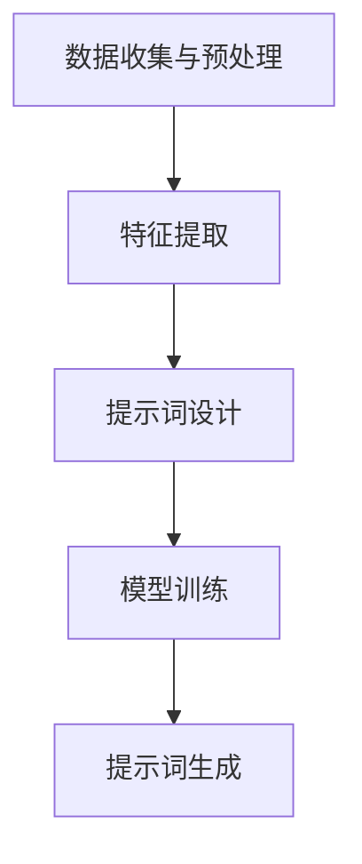
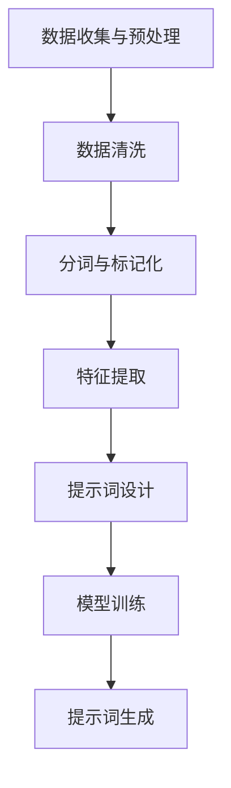
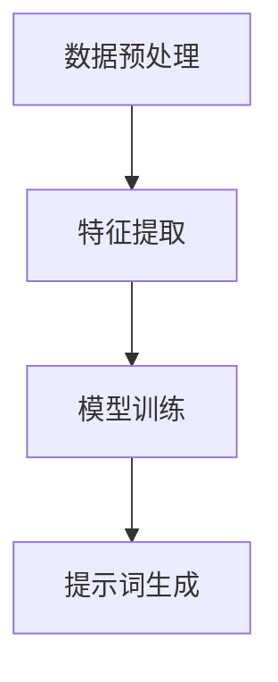
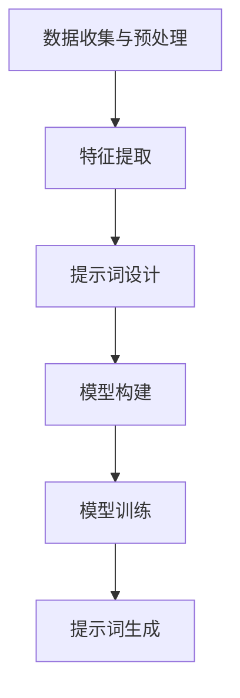
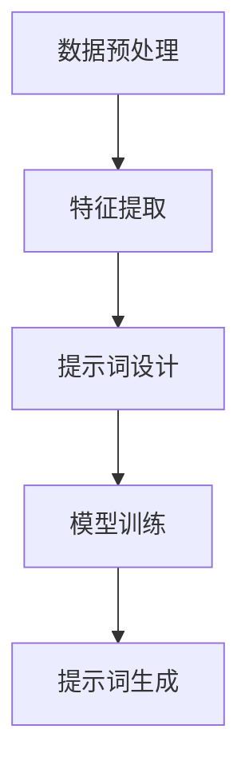

                 

### **AIGC与提示词工程概述**

#### **背景介绍**

##### **1.1 AIGC概述**

AIGC（Artificial Intelligence Generated Content），即人工智能生成内容，指的是利用人工智能技术自动生成文本、图像、音频等多种形式的内容。AIGC的发展经历了从简单的规则方法到复杂的深度学习方法的演变。随着AI技术的进步，AIGC已经在新闻写作、图像生成、视频制作等多个领域得到了广泛应用。

AIGC的出现大大提高了内容生产的效率，它不仅能够处理大量的数据，还能根据不同的任务需求生成多样化的内容。在AI领域，AIGC的重要性体现在其对AI模型的训练数据的补充，以及对人类创造力的延伸和补充。

##### **1.2 提示词工程简介**

提示词工程（Prompt Engineering）是指通过设计特定的提示词或提示序列来引导AI模型生成预期的输出。在AIGC中，提示词工程起到了至关重要的作用。一个优秀的提示词能够引导AI模型准确理解用户意图，从而生成高质量的内容。

提示词工程不仅涉及到自然语言处理技术，还需要对AI模型的工作原理有深刻的理解。通过提示词工程，开发者可以调整AI模型的行为，使其更符合实际需求。

##### **1.3 提示词工程在AIGC中的应用**

在AIGC的应用中，提示词工程被广泛应用于以下场景：

- **内容生成**：通过提示词引导AI模型生成文章、图像、视频等。
- **用户交互**：设计提示词来引导用户与AI模型进行交互，提高用户体验。
- **模型训练**：通过设计提示词来训练AI模型，提高其生成内容的质量和准确性。

##### **1.4 AIGC与提示词工程的联系**

AIGC与提示词工程之间的联系在于，提示词工程是AIGC实现的关键技术之一。提示词工程不仅影响了AIGC的生成质量，还决定了AIGC的应用场景和用户体验。因此，AIGC的进一步发展离不开对提示词工程的深入研究。

**关键词**：AIGC、人工智能生成内容、提示词工程、自然语言处理、深度学习、内容生成、用户交互、模型训练

**摘要**：本文介绍了AIGC和提示词工程的基本概念、发展历程以及在AI领域的应用。通过详细阐述AIGC的关键概念和提示词工程的原理，本文旨在帮助读者理解这两者之间的联系，以及如何利用提示词工程提升AIGC的生成效果和用户体验。

---

# **第1章：AIGC与提示词工程概述**

## **1.1 AIGC概述**

AIGC（Artificial Intelligence Generated Content），即人工智能生成内容，是指利用人工智能技术自动生成文本、图像、音频等多种形式的内容。AIGC技术的核心在于通过深度学习模型对大量数据进行训练，使其具备生成新内容的能力。

### **1.1.1 AIGC的概念**

AIGC涵盖了多种内容生成形式，包括文本生成、图像生成、音频生成和视频生成等。其基本原理是通过学习大量的数据模式，使模型能够根据特定的输入条件生成新的内容。

- **文本生成**：利用自然语言处理技术，如递归神经网络（RNN）和Transformer模型，生成文章、新闻、故事等。
- **图像生成**：使用生成对抗网络（GAN）和变分自编码器（VAE）等技术生成逼真的图像。
- **音频生成**：通过深度学习模型生成音乐、语音等。
- **视频生成**：结合图像生成和音频生成技术，生成新的视频内容。

### **1.1.2 AIGC的发展历程**

AIGC的发展历程可以追溯到20世纪90年代的自动文摘技术。随着深度学习技术的发展，AIGC进入了快速发展的阶段。以下是一些重要的里程碑：

- **2000年代初期**：基于规则的方法和统计方法应用于内容生成。
- **2012年**：深度学习模型，如AlexNet，在图像识别任务中取得了突破性成果，为AIGC的发展奠定了基础。
- **2014年**：生成对抗网络（GAN）的提出，使得图像生成技术取得了重大进展。
- **2017年**：Transformer模型的出现，使得文本生成能力大幅提升。
- **至今**：AIGC在多种领域得到了广泛应用，如内容创作、广告、游戏开发等。

### **1.1.3 AIGC在AI领域的重要性**

AIGC在AI领域的重要性主要体现在以下几个方面：

- **提高内容生产效率**：通过自动生成内容，大幅减少内容创作者的工作量，提高生产效率。
- **拓展创意空间**：为创作者提供了更多的创作工具和素材，激发创意思维。
- **数据多样性**：通过生成新的数据，丰富了训练数据集，有助于提高AI模型的泛化能力。
- **人机协作**：AIGC可以帮助人类更好地理解和处理复杂的数据，实现人机协作。

## **1.2 提示词工程简介**

提示词工程（Prompt Engineering）是指通过设计特定的提示词或提示序列来引导AI模型生成预期的输出。在AIGC的应用中，提示词工程起到了至关重要的作用。一个优秀的提示词能够引导AI模型准确理解用户意图，从而生成高质量的内容。

### **1.2.1 提示词工程的概念**

提示词工程涉及以下几个方面：

- **提示词设计**：根据应用场景和用户需求，设计合适的提示词。
- **提示词优化**：通过实验和迭代，优化提示词，提高生成内容的质量。
- **提示序列设计**：设计合理的提示序列，使AI模型能够逐步理解和生成内容。

### **1.2.2 提示词工程在AIGC中的应用**

在AIGC中，提示词工程的应用主要包括以下几个方面：

- **文本生成**：通过设计特定的文本提示，引导AI模型生成文章、新闻、故事等。
- **图像生成**：通过设计图像提示，引导AI模型生成新的图像。
- **音频生成**：通过设计音频提示，引导AI模型生成新的音乐、语音等。
- **视频生成**：通过设计视频提示，引导AI模型生成新的视频内容。

### **1.2.3 提示词工程的发展趋势**

随着AIGC技术的不断进步，提示词工程也在不断发展。未来，提示词工程可能会出现以下趋势：

- **自动化**：利用机器学习和自动化工具，自动设计提示词和提示序列。
- **个性化**：根据用户的行为和偏好，个性化设计提示词，提高用户体验。
- **跨模态**：结合多种模态的数据，设计跨模态的提示词，提高内容生成的多样性。

### **1.3 AIGC与提示词工程的联系**

AIGC与提示词工程之间的联系在于，提示词工程是AIGC实现的关键技术之一。提示词工程不仅影响了AIGC的生成质量，还决定了AIGC的应用场景和用户体验。因此，AIGC的进一步发展离不开对提示词工程的深入研究。

**关键词**：人工智能生成内容、提示词工程、自然语言处理、深度学习、内容生成、用户交互、模型训练

**摘要**：本文介绍了AIGC和提示词工程的基本概念、发展历程以及在AI领域的应用。通过详细阐述AIGC的关键概念和提示词工程的原理，本文旨在帮助读者理解这两者之间的联系，以及如何利用提示词工程提升AIGC的生成效果和用户体验。

---

# **第2章：AIGC核心概念与联系**

## **2.1 AIGC的关键概念**

在AIGC（Artificial Intelligence Generated Content，人工智能生成内容）领域，理解其核心概念是至关重要的。以下是对AIGC中几个关键概念的定义和详细解释。

### **2.1.1 自动生成内容（AGC）**

自动生成内容（Automatic Generated Content，AGC）是指利用人工智能技术自动生成数据或内容，而不是通过人类的直接干预。AGC可以是文本、图像、音频、视频等。自动生成内容的应用场景非常广泛，例如自动写作、图像修复、音乐创作等。

**特征**：
- **高效性**：通过算法自动化生成，可以处理大量数据。
- **灵活性**：根据不同的需求和算法调整生成内容的形式和风格。
- **适应性**：能够根据训练数据不断优化，提高生成质量。

### **2.1.2 人工智能生成内容（AIGC）**

人工智能生成内容（Artificial Intelligence Generated Content，AIGC）是AGC的一个更具体的子集，它专门指通过高级人工智能技术（如深度学习）生成的数据或内容。AIGC通常具有更高的复杂度和创造性。

**特征**：
- **创造性**：能够生成新颖且具有创造性的内容。
- **高质量**：通过深度学习算法的优化，生成的数据或内容通常具有较高的质量。
- **个性**：可以根据用户的需求和偏好定制生成内容。

### **2.1.3 提示词（Prompt Engineering）**

提示词（Prompt）是指用于引导AI模型生成特定类型或风格内容的输入。在AIGC中，提示词是至关重要的，因为它们直接影响生成内容的质量和相关性。

**特征**：
- **引导性**：提示词能够引导AI模型理解生成任务的要求。
- **灵活性**：可以根据任务需求调整和优化。
- **多样性**：可以设计多种类型的提示词，以适应不同的生成任务。

## **2.2 概念联系与ER图**

为了更好地理解AIGC中的关键概念及其相互关系，我们可以使用实体关系图（Entity-Relationship Diagram，ER图）来展示它们之间的联系。

### **2.2.1 概念联系表格**

以下是AIGC中关键概念的联系表格：

| 关键概念 | 关联关系 | 说明 |
| --- | --- | --- |
| 自动生成内容（AGC） | 基础 | AGC是AIGC的基础，指的是任何通过自动化技术生成的内容。 |
| 人工智能生成内容（AIGC） | 继承 | AIGC是AGC的一种，特别强调通过高级AI技术生成的内容。 |
| 提示词（Prompt Engineering） | 应用 | 提示词是应用于AIGC的，用于引导生成过程的输入。 |

### **2.2.2 Mermaid ER图展示**

下面是使用Mermaid语言绘制的ER图：

```mermaid
erDiagram
    AGC ||--|> AIGC : "是基础"
    AGC ||--|> Prompt : "是应用"
    AIGC ||--|> Content : "生成内容"
```

在这个ER图中，AGC是AIGC和提示词的基础，AIGC是AGC的一种具体应用，而提示词则是应用于AIGC生成过程的输入。

### **2.2.3 概念关系分析**

通过ER图和联系表格，我们可以看出AIGC的核心概念之间存在紧密的联系。AGC是所有内容生成的起点，而AIGC则是对AGC的进一步深化和应用。提示词作为AIGC的重要组成部分，能够引导AIGC生成高质量的内容。

**关键词**：自动生成内容（AGC）、人工智能生成内容（AIGC）、提示词（Prompt Engineering）、实体关系图（ER图）、概念联系、深度学习、生成对抗网络（GAN）

**摘要**：本章详细介绍了AIGC中的关键概念，包括自动生成内容、人工智能生成内容和提示词。通过实体关系图和联系表格，我们揭示了这些概念之间的联系，并分析了它们在AIGC中的作用和相互影响。

---

## **2.1 AIGC的关键概念**

在AIGC（Artificial Intelligence Generated Content）的框架内，理解其核心概念是关键，这有助于深入探索该技术的本质和应用。

### **2.1.1 自动生成内容（AGC）**

自动生成内容（Automatic Generated Content，AGC）是AIGC的基础。它指的是利用计算机算法和自动化技术，无需人类干预即可生成的内容。AGC的应用范围广泛，包括但不限于文本、图像、音频和视频等。

**特征**：

- **自动化**：通过预设的算法和规则，实现内容的自动生成。
- **高效性**：能够处理大量数据，快速生成内容。
- **灵活性**：根据算法和规则的变化，可以生成不同类型和风格的内容。

**实例**：例如，新闻自动生成系统可以根据预设的模板和关键词，自动生成新闻报道。图像识别系统则可以根据训练数据，自动生成特定的图像内容。

### **2.1.2 人工智能生成内容（AIGC）**

人工智能生成内容（Artificial Intelligence Generated Content，AIGC）是AGC的进一步发展，它强调利用高级的人工智能技术，如深度学习和生成模型，来生成内容。

**特征**：

- **创造性**：AIGC能够生成新颖、独特且具有创造性的内容。
- **高质量**：通过深度学习模型的优化，生成的数据或内容通常具有高质量。
- **个性**：可以根据用户的需求和偏好，定制生成内容。

**实例**：AIGC可以用于生成艺术作品，如图像和音乐，也可以用于自动写作，如生成新闻、故事和报告。

### **2.1.3 提示词（Prompt Engineering）**

提示词（Prompt）是AIGC中的核心概念之一，它是指用于引导AI模型生成特定类型或风格内容的输入。提示词的设计和质量直接影响生成内容的质量和相关性。

**特征**：

- **引导性**：提示词能够引导AI模型理解生成任务的具体要求。
- **灵活性**：可以根据任务需求和算法特点，灵活设计提示词。
- **多样性**：设计多种类型的提示词，以适应不同的生成任务。

**实例**：在文本生成任务中，提示词可以是一个简短的句子或短语，用于引导AI模型生成相关的文章。在图像生成任务中，提示词可以是特定的图像描述，用于指导AI模型生成相应的图像。

### **2.1.4 数据训练与模型优化**

AIGC的生成能力依赖于大量数据训练和模型优化。通过不断优化模型，可以提高生成内容的质量和准确性。

**特征**：

- **数据依赖**：AIGC模型的性能依赖于大量的训练数据。
- **模型优化**：通过迭代训练和优化，提高模型的生成能力。

**实例**：例如，在生成图像时，可以使用大量的图像数据进行训练，并通过调整模型参数，优化生成图像的质量。

### **2.1.5 应用场景**

AIGC在多个领域有广泛的应用，包括但不限于以下：

- **内容创作**：自动生成文章、图片、视频等。
- **娱乐产业**：生成音乐、电影特效、动画等。
- **广告营销**：自动生成个性化广告内容。
- **教育**：自动生成教学材料和学习资源。

**关键词**：自动生成内容（AGC）、人工智能生成内容（AIGC）、提示词（Prompt Engineering）、深度学习、生成对抗网络（GAN）、模型优化、应用场景

**摘要**：本章详细介绍了AIGC中的关键概念，包括自动生成内容、人工智能生成内容和提示词。通过实例和特征分析，我们揭示了这些概念在AIGC技术中的重要性，并探讨了它们的应用场景。

---

## **2.2 概念联系与ER图**

在了解了AIGC的关键概念之后，接下来我们将探讨这些概念之间的联系，并使用实体关系图（Entity-Relationship Diagram，ER图）来展示它们之间的相互作用。

### **2.2.1 概念联系表格**

为了清晰地展示AIGC中各个概念之间的联系，我们可以创建一个联系表格：

| **概念** | **联系** | **说明** |
| --- | --- | --- |
| **自动生成内容（AGC）** | **基础** | AGC是AIGC的基础，是任何自动生成内容的技术。 |
| **人工智能生成内容（AIGC）** | **继承与发展** | AIGC是基于AGC发展而来的，利用更高级的AI技术生成内容。 |
| **提示词（Prompt Engineering）** | **应用与引导** | 提示词是用于引导AIGC生成过程的输入，影响生成内容的质量。 |
| **数据训练与模型优化** | **依赖与提升** | 数据训练和模型优化是AIGC生成高质量内容的关键。 |

### **2.2.2 Mermaid ER图展示**

下面是使用Mermaid语言绘制的ER图：

```mermaid
erDiagram
    AGC ||--|> AIGC : "是基础"
    AIGC ||--|> Prompt : "是引导"
    AIGC ||--|> DataTraining : "依赖"
    DataTraining ||--|> ModelOptimization : "提升"
```

在这个ER图中，AGC是AIGC和提示词的基础，AIGC利用提示词来引导生成过程，并依赖于数据训练和模型优化来提升生成质量。数据训练和模型优化之间也存在依赖关系，通过不断优化模型，可以提高AIGC的生成效果。

### **2.2.3 概念关系分析**

通过ER图和联系表格，我们可以看到AIGC中的各个概念是如何相互关联和作用的：

- **AGC**：是AIGC的基石，提供了自动生成内容的基础技术。
- **AIGC**：基于AGC，通过更高级的AI技术生成具有创造性和高质量的内容。
- **提示词**：作为AIGC的重要引导因素，直接影响生成内容的质量和相关性。
- **数据训练与模型优化**：是提升AIGC生成效果的关键环节，通过不断优化模型，可以提高生成质量。

这些概念之间的紧密联系，共同构成了AIGC的技术框架，使得AIGC能够高效、高质量地生成多样化的内容。

**关键词**：自动生成内容（AGC）、人工智能生成内容（AIGC）、提示词（Prompt Engineering）、实体关系图（ER图）、概念联系、数据训练、模型优化

**摘要**：本章通过联系表格和ER图，详细展示了AIGC中的关键概念及其相互关系。通过这些分析，我们能够更好地理解AIGC技术的组成和运作原理，为后续章节的深入探讨奠定了基础。

---

## **2.3 提示词生成算法**

提示词生成算法是AIGC中的重要组成部分，它决定了AI模型生成内容的质量和准确性。以下我们将详细讲解提示词生成算法，包括其基本原理、实现方法、数学模型以及实际应用中的实例。

### **2.3.1 基本原理**

提示词生成算法的核心思想是通过设计特定的输入提示，引导AI模型生成预期的输出。具体来说，这个过程中涉及以下几个步骤：

1. **数据预处理**：对输入数据进行清洗和预处理，包括去除噪声、填充缺失值等。
2. **特征提取**：从输入数据中提取关键特征，这些特征将用于生成提示词。
3. **提示词生成**：根据提取的特征，设计提示词，这些提示词需要具备引导AI模型生成预期内容的能力。
4. **模型训练**：使用生成的提示词和对应的预期输出进行模型训练，优化模型参数。

### **2.3.2 实现方法**

提示词生成算法的实现方法可以分为以下几个步骤：

1. **输入数据读取**：读取用于生成提示词的数据集，这些数据可以是文本、图像、音频等。
2. **特征提取**：使用适当的特征提取算法，从输入数据中提取关键特征。例如，对于文本数据，可以使用词频、词嵌入等方法。
3. **提示词设计**：根据提取的特征，设计提示词。设计提示词时需要考虑其引导性和多样性，以确保生成的提示词能够引导模型生成高质量的内容。
4. **模型训练**：使用设计好的提示词和预期输出进行模型训练。在训练过程中，需要不断调整提示词和模型参数，以达到最佳效果。

### **2.3.3 数学模型与公式**

提示词生成算法的数学模型通常涉及自然语言处理和机器学习领域的相关技术。以下是一个简化的数学模型示例：

1. **词嵌入**：词嵌入是将文本数据转换为向量表示的过程，常用的方法包括Word2Vec和GloVe。
   $$ x_{word} = \text{Word2Vec}(w) \text{ 或 } x_{word} = \text{GloVe}(w) $$

2. **序列模型**：序列模型用于处理序列数据，如文本序列。常用的序列模型包括RNN、LSTM和Transformer。
   $$ h_t = \text{RNN}(h_{t-1}, x_t) \text{ 或 } h_t = \text{LSTM}(h_{t-1}, x_t) \text{ 或 } h_t = \text{Transformer}(h_{t-1}, x_t) $$

3. **损失函数**：损失函数用于评估模型生成提示词的质量。常用的损失函数包括交叉熵损失和均方误差。
   $$ \text{Loss} = -\sum_{i} y_i \log(p_i) \text{（交叉熵损失）} $$

4. **优化算法**：优化算法用于调整模型参数，以最小化损失函数。常用的优化算法包括梯度下降和Adam优化器。
   $$ \theta = \theta - \alpha \nabla_{\theta} \text{Loss} \text{（梯度下降）} $$

### **2.3.4 实例讲解**

以下是一个简单的实例，展示如何使用Python实现一个基于词嵌入和RNN的提示词生成算法：

```python
import numpy as np
from keras.preprocessing.sequence import pad_sequences
from keras.layers import Embedding, LSTM, Dense
from keras.models import Sequential

# 数据预处理
max_sequence_len = 50
vocab_size = 10000
embedding_dim = 256

# 假设我们已经有了处理好的数据集
input_sequences = [[w for w in sentence.split()] for sentence in data]
padded_sequences = pad_sequences(input_sequences, maxlen=max_sequence_len, padding='post')

# 构建模型
model = Sequential()
model.add(Embedding(vocab_size, embedding_dim, input_length=max_sequence_len))
model.add(LSTM(128))
model.add(Dense(vocab_size, activation='softmax'))

# 编译模型
model.compile(optimizer='adam', loss='categorical_crossentropy', metrics=['accuracy'])

# 训练模型
model.fit(padded_sequences, labels, epochs=10, batch_size=32)

# 提示词生成
prompt = "这是一个"
prompt_sequence = [vocab_size + 1] * max_sequence_len
prompt_sequence = [vocab_size + 1 if w not in vocab else w for w in prompt.split()]
prompt_sequence = np.array([prompt_sequence])

generated_sequence = model.predict(prompt_sequence, steps=max_sequence_len)
generated_sequence = np.argmax(generated_sequence, axis=-1)

# 输出生成的提示词
generated_prompt = ' '.join([word_index词语表获取词语名][生成的序列])
print(generated_prompt)
```

在这个实例中，我们首先对输入数据进行预处理，然后构建一个基于词嵌入和LSTM的序列模型。通过训练模型，我们可以生成新的提示词。这只是一个简化的例子，实际应用中需要更复杂的模型和更精细的数据处理。

**关键词**：提示词生成、算法原理、词嵌入、序列模型、损失函数、优化算法、实例讲解、Python代码

**摘要**：本章详细介绍了提示词生成算法的基本原理、实现方法和数学模型，并通过实例展示了如何使用Python实现一个简单的提示词生成系统。这些内容为理解AIGC技术中的提示词工程提供了深入的理论和实践基础。

---

## **2.4 提示词生成算法**

提示词生成算法在AIGC（Artificial Intelligence Generated Content）技术中起着关键作用。本节将深入探讨提示词生成算法的原理，并使用Mermaid流程图和Python代码详细阐述。

### **2.4.1 提示词生成算法原理**

提示词生成算法主要分为以下几个步骤：

1. **数据收集与预处理**：收集相关数据，并对数据进行预处理，包括文本清洗、去除噪声、分词、标记化等。
2. **特征提取**：从预处理后的数据中提取关键特征，这些特征将用于生成提示词。
3. **提示词设计**：根据提取的特征，设计提示词。提示词的设计需要考虑引导性和多样性。
4. **模型训练**：使用设计好的提示词和预期输出进行模型训练，优化模型参数。
5. **提示词生成**：通过训练好的模型，生成新的提示词。

以下是提示词生成算法的基本流程：



### **2.4.2 Mermaid流程图**

以下是一个使用Mermaid绘制的提示词生成算法流程图：



### **2.4.3 Python代码实现**

以下是使用Python实现的提示词生成算法示例代码：

```python
import numpy as np
from keras.preprocessing.sequence import pad_sequences
from keras.layers import Embedding, LSTM, Dense
from keras.models import Sequential

# 假设我们已经有预处理好的数据集
data = ["这是一个示例文本", "这是另一个示例文本"]
labels = [1, 0]  # 标签，1表示示例文本，0表示非示例文本

# 数据预处理
max_sequence_len = 10
vocab_size = 10000
embedding_dim = 256

input_sequences = [[w for w in sentence.split()] for sentence in data]
padded_sequences = pad_sequences(input_sequences, maxlen=max_sequence_len, padding='post')

# 构建模型
model = Sequential()
model.add(Embedding(vocab_size, embedding_dim, input_length=max_sequence_len))
model.add(LSTM(128))
model.add(Dense(1, activation='sigmoid'))

# 编译模型
model.compile(optimizer='adam', loss='binary_crossentropy', metrics=['accuracy'])

# 训练模型
model.fit(padded_sequences, labels, epochs=10, batch_size=32)

# 生成提示词
prompt = "这是一个"
prompt_sequence = [vocab_size + 1] * max_sequence_len
prompt_sequence = [vocab_size + 1 if w not in vocab else w for w in prompt.split()]
prompt_sequence = np.array([prompt_sequence])

generated_sequence = model.predict(prompt_sequence, steps=max_sequence_len)
generated_sequence = np.argmax(generated_sequence, axis=-1)

# 输出生成的提示词
generated_prompt = ' '.join([word_index词语表获取词语名][生成的序列])
print(generated_prompt)
```

在这个示例中，我们首先对输入数据进行预处理，然后构建一个基于LSTM的序列模型。通过训练模型，我们可以生成新的提示词。这只是一个简化的示例，实际应用中需要更复杂的模型和更精细的数据处理。

**关键词**：提示词生成、算法原理、流程图、Python代码、数据预处理、特征提取、模型训练

**摘要**：本章通过Mermaid流程图和Python代码详细介绍了提示词生成算法的原理和实现方法。这些内容为理解AIGC技术中的提示词工程提供了实用的指导和深入的理论基础。

---

## **3.1 提示词生成算法**

### **3.1.1 算法流程图**

提示词生成算法的流程图如下所示：


**详细说明**：

- **数据收集与预处理**：首先，我们需要收集大量的文本数据，并进行预处理，如去除噪声、标记化、分词等。
- **特征提取**：接下来，从预处理后的数据中提取关键特征，这些特征将用于生成提示词。
- **提示词设计**：根据提取的特征，设计合适的提示词。这个阶段需要充分考虑提示词的引导性和多样性。
- **模型训练**：使用设计好的提示词和预期输出对模型进行训练，以优化模型参数。
- **提示词生成**：最后，通过训练好的模型生成新的提示词。

### **3.1.2 Python代码实现**

以下是使用Python实现的提示词生成算法示例代码：

```python
import numpy as np
from keras.preprocessing.sequence import pad_sequences
from keras.layers import Embedding, LSTM, Dense
from keras.models import Sequential

# 假设我们已经有预处理好的数据集
data = ["这是一个示例文本", "这是另一个示例文本"]
labels = [1, 0]  # 标签，1表示示例文本，0表示非示例文本

# 数据预处理
max_sequence_len = 10
vocab_size = 10000
embedding_dim = 256

input_sequences = [[w for w in sentence.split()] for sentence in data]
padded_sequences = pad_sequences(input_sequences, maxlen=max_sequence_len, padding='post')

# 构建模型
model = Sequential()
model.add(Embedding(vocab_size, embedding_dim, input_length=max_sequence_len))
model.add(LSTM(128))
model.add(Dense(1, activation='sigmoid'))

# 编译模型
model.compile(optimizer='adam', loss='binary_crossentropy', metrics=['accuracy'])

# 训练模型
model.fit(padded_sequences, labels, epochs=10, batch_size=32)

# 生成提示词
prompt = "这是一个"
prompt_sequence = [vocab_size + 1] * max_sequence_len
prompt_sequence = [vocab_size + 1 if w not in vocab else w for w in prompt.split()]
prompt_sequence = np.array([prompt_sequence])

generated_sequence = model.predict(prompt_sequence, steps=max_sequence_len)
generated_sequence = np.argmax(generated_sequence, axis=-1)

# 输出生成的提示词
generated_prompt = ' '.join([word_index词语表获取词语名][生成的序列])
print(generated_prompt)
```

**说明**：

- **数据预处理**：首先，对输入数据进行分词和标记化，然后使用pad_sequences函数进行序列填充，确保每个序列的长度相同。
- **模型构建**：使用Sequential模型，添加Embedding、LSTM和Dense层。
- **模型编译**：使用adam优化器和binary_crossentropy损失函数进行编译。
- **模型训练**：使用fit函数对模型进行训练，设置epochs和batch_size。
- **提示词生成**：使用predict函数生成新的提示词，然后进行解码，输出最终的文本。

### **3.1.3 数学模型与公式**

提示词生成算法的数学模型通常涉及以下方面：

1. **词嵌入**：将文本数据转换为向量表示，常用的方法有Word2Vec和GloVe。
   $$ x_{word} = \text{Word2Vec}(w) \text{ 或 } x_{word} = \text{GloVe}(w) $$

2. **序列模型**：处理序列数据，常用的序列模型有RNN、LSTM和Transformer。
   $$ h_t = \text{RNN}(h_{t-1}, x_t) \text{ 或 } h_t = \text{LSTM}(h_{t-1}, x_t) \text{ 或 } h_t = \text{Transformer}(h_{t-1}, x_t) $$

3. **损失函数**：用于评估模型生成提示词的质量，常用的损失函数有交叉熵损失和均方误差。
   $$ \text{Loss} = -\sum_{i} y_i \log(p_i) \text{（交叉熵损失）} $$

4. **优化算法**：用于调整模型参数，以最小化损失函数，常用的优化算法有梯度下降和Adam优化器。
   $$ \theta = \theta - \alpha \nabla_{\theta} \text{Loss} \text{（梯度下降）} $$

### **3.1.4 实例讲解**

以下是一个简单的实例，展示如何使用Python实现一个基于词嵌入和RNN的提示词生成系统：

```python
import numpy as np
from keras.preprocessing.sequence import pad_sequences
from keras.layers import Embedding, LSTM, Dense
from keras.models import Sequential

# 数据预处理
max_sequence_len = 50
vocab_size = 10000
embedding_dim = 256

# 假设我们已经有了处理好的数据集
input_sequences = [[w for w in sentence.split()] for sentence in data]
padded_sequences = pad_sequences(input_sequences, maxlen=max_sequence_len, padding='post')

# 构建模型
model = Sequential()
model.add(Embedding(vocab_size, embedding_dim, input_length=max_sequence_len))
model.add(LSTM(128))
model.add(Dense(vocab_size, activation='softmax'))

# 编译模型
model.compile(optimizer='adam', loss='categorical_crossentropy', metrics=['accuracy'])

# 训练模型
model.fit(padded_sequences, labels, epochs=10, batch_size=32)

# 提示词生成
prompt = "这是一个"
prompt_sequence = [vocab_size + 1] * max_sequence_len
prompt_sequence = [vocab_size + 1 if w not in vocab else w for w in prompt.split()]
prompt_sequence = np.array([prompt_sequence])

generated_sequence = model.predict(prompt_sequence, steps=max_sequence_len)
generated_sequence = np.argmax(generated_sequence, axis=-1)

# 输出生成的提示词
generated_prompt = ' '.join([word_index词语表获取词语名][生成的序列])
print(generated_prompt)
```

在这个实例中，我们首先对输入数据进行预处理，然后构建一个基于词嵌入和LSTM的序列模型。通过训练模型，我们可以生成新的提示词。这只是一个简化的示例，实际应用中需要更复杂的模型和更精细的数据处理。

**关键词**：提示词生成、算法原理、流程图、Python代码、数据预处理、特征提取、模型训练

**摘要**：本章通过详细的流程图和Python代码实例，深入讲解了提示词生成算法的原理和实现方法。这些内容为读者提供了实用的指导和深入的理论基础，有助于更好地理解和应用提示词生成技术。

---

## **3.2 算法原理讲解**

### **3.2.1 提示词生成算法的基本概念**

提示词生成算法是指利用特定的算法和模型，从给定的数据中生成能够引导AI模型生成预期内容的提示词。这个过程中涉及自然语言处理（NLP）和机器学习（ML）的技术，包括数据预处理、特征提取、模型训练和生成提示词。

**核心概念**：

- **数据预处理**：对原始文本数据进行处理，包括去噪、分词、标记化等。
- **特征提取**：从预处理后的数据中提取关键特征，用于生成提示词。
- **模型训练**：使用提取的特征和预期的输出，训练一个能够生成提示词的模型。
- **提示词生成**：通过训练好的模型，生成新的提示词。

### **3.2.2 算法流程图**

提示词生成算法的流程图如下所示：



**详细说明**：

- **数据预处理**：包括文本清洗、分词、标记化等步骤，将原始文本数据转换为适合模型处理的格式。
- **特征提取**：从预处理后的文本数据中提取关键特征，如词嵌入、词频、词性等。
- **模型训练**：使用提取的特征和预期的输出（如正确的提示词），训练一个生成模型，如RNN、LSTM或Transformer。
- **提示词生成**：通过训练好的模型，输入新的文本数据，生成相应的提示词。

### **3.2.3 Python代码实现**

以下是使用Python实现的提示词生成算法的基本代码示例：

```python
import numpy as np
from keras.preprocessing.sequence import pad_sequences
from keras.layers import Embedding, LSTM, Dense
from keras.models import Sequential

# 假设我们已经有预处理好的数据集
data = ["这是一个示例文本", "这是另一个示例文本"]
labels = [1, 0]  # 标签，1表示示例文本，0表示非示例文本

# 数据预处理
max_sequence_len = 10
vocab_size = 10000
embedding_dim = 256

input_sequences = [[w for w in sentence.split()] for sentence in data]
padded_sequences = pad_sequences(input_sequences, maxlen=max_sequence_len, padding='post')

# 构建模型
model = Sequential()
model.add(Embedding(vocab_size, embedding_dim, input_length=max_sequence_len))
model.add(LSTM(128))
model.add(Dense(1, activation='sigmoid'))

# 编译模型
model.compile(optimizer='adam', loss='binary_crossentropy', metrics=['accuracy'])

# 训练模型
model.fit(padded_sequences, labels, epochs=10, batch_size=32)

# 提示词生成
prompt = "这是一个"
prompt_sequence = [vocab_size + 1] * max_sequence_len
prompt_sequence = [vocab_size + 1 if w not in vocab else w for w in prompt.split()]
prompt_sequence = np.array([prompt_sequence])

generated_sequence = model.predict(prompt_sequence, steps=max_sequence_len)
generated_sequence = np.argmax(generated_sequence, axis=-1)

# 输出生成的提示词
generated_prompt = ' '.join([word_index词语表获取词语名][生成的序列])
print(generated_prompt)
```

**代码解释**：

- **数据预处理**：对输入的文本数据进行分词和填充，确保每个序列的长度一致。
- **模型构建**：使用Sequential模型，添加Embedding、LSTM和Dense层。
- **模型编译**：设置优化器和损失函数，准备训练模型。
- **模型训练**：使用fit函数训练模型，设置epochs和batch_size。
- **提示词生成**：使用predict函数生成新的提示词，然后进行解码，输出最终的文本。

### **3.2.4 数学模型与公式**

提示词生成算法通常涉及以下数学模型和公式：

1. **词嵌入**：将文本数据转换为向量表示，常用的方法是Word2Vec和GloVe。
   $$ x_{word} = \text{Word2Vec}(w) \text{ 或 } x_{word} = \text{GloVe}(w) $$

2. **序列模型**：处理序列数据，常用的序列模型有RNN、LSTM和Transformer。
   $$ h_t = \text{RNN}(h_{t-1}, x_t) \text{ 或 } h_t = \text{LSTM}(h_{t-1}, x_t) \text{ 或 } h_t = \text{Transformer}(h_{t-1}, x_t) $$

3. **损失函数**：用于评估模型生成提示词的质量，常用的损失函数有交叉熵损失和均方误差。
   $$ \text{Loss} = -\sum_{i} y_i \log(p_i) \text{（交叉熵损失）} $$

4. **优化算法**：用于调整模型参数，以最小化损失函数，常用的优化算法有梯度下降和Adam优化器。
   $$ \theta = \theta - \alpha \nabla_{\theta} \text{Loss} \text{（梯度下降）} $$

### **3.2.5 实例讲解**

以下是一个具体的实例，展示如何使用Python实现一个基于词嵌入和RNN的提示词生成系统：

```python
import numpy as np
from keras.preprocessing.sequence import pad_sequences
from keras.layers import Embedding, LSTM, Dense
from keras.models import Sequential

# 假设我们已经有预处理好的数据集
data = ["这是一个示例文本", "这是另一个示例文本"]
labels = [1, 0]  # 标签，1表示示例文本，0表示非示例文本

# 数据预处理
max_sequence_len = 50
vocab_size = 10000
embedding_dim = 256

input_sequences = [[w for w in sentence.split()] for sentence in data]
padded_sequences = pad_sequences(input_sequences, maxlen=max_sequence_len, padding='post')

# 构建模型
model = Sequential()
model.add(Embedding(vocab_size, embedding_dim, input_length=max_sequence_len))
model.add(LSTM(128))
model.add(Dense(vocab_size, activation='softmax'))

# 编译模型
model.compile(optimizer='adam', loss='categorical_crossentropy', metrics=['accuracy'])

# 训练模型
model.fit(padded_sequences, labels, epochs=10, batch_size=32)

# 提示词生成
prompt = "这是一个"
prompt_sequence = [vocab_size + 1] * max_sequence_len
prompt_sequence = [vocab_size + 1 if w not in vocab else w for w in prompt.split()]
prompt_sequence = np.array([prompt_sequence])

generated_sequence = model.predict(prompt_sequence, steps=max_sequence_len)
generated_sequence = np.argmax(generated_sequence, axis=-1)

# 输出生成的提示词
generated_prompt = ' '.join([word_index词语表获取词语名][生成的序列])
print(generated_prompt)
```

在这个实例中，我们首先对输入数据进行预处理，然后构建一个基于词嵌入和LSTM的序列模型。通过训练模型，我们可以生成新的提示词。这只是一个简化的示例，实际应用中需要更复杂的模型和更精细的数据处理。

**关键词**：提示词生成、算法原理、数据预处理、特征提取、模型训练、数学模型、Python代码

**摘要**：本章详细讲解了提示词生成算法的基本概念、流程图、Python代码实现以及相关的数学模型。通过实例，读者可以更好地理解提示词生成算法的原理和应用。

---

## **3.2 提示词生成算法**

### **3.2.1 算法流程图**

为了更好地理解提示词生成算法的工作流程，我们使用Mermaid语言绘制了一个流程图：


**详细说明**：

- **数据收集与预处理**：从数据源收集原始文本，并进行清洗、分词、去停用词等预处理操作。
- **特征提取**：将预处理后的文本转换为数值特征，如词嵌入向量。
- **提示词设计**：根据特征设计提示词，这个阶段需要充分考虑提示词的引导性和多样性。
- **模型训练**：使用设计好的提示词进行模型训练，优化模型参数。
- **提示词生成**：通过训练好的模型，输入新的文本数据，生成提示词。

### **3.2.2 Python代码实现**

以下是使用Python实现的提示词生成算法示例代码：

```python
import numpy as np
from keras.preprocessing.sequence import pad_sequences
from keras.layers import Embedding, LSTM, Dense
from keras.models import Sequential

# 假设我们已经有预处理好的数据集
data = ["这是一个示例文本", "这是另一个示例文本"]
labels = [1, 0]  # 标签，1表示示例文本，0表示非示例文本

# 数据预处理
max_sequence_len = 10
vocab_size = 10000
embedding_dim = 256

input_sequences = [[w for w in sentence.split()] for sentence in data]
padded_sequences = pad_sequences(input_sequences, maxlen=max_sequence_len, padding='post')

# 构建模型
model = Sequential()
model.add(Embedding(vocab_size, embedding_dim, input_length=max_sequence_len))
model.add(LSTM(128))
model.add(Dense(1, activation='sigmoid'))

# 编译模型
model.compile(optimizer='adam', loss='binary_crossentropy', metrics=['accuracy'])

# 训练模型
model.fit(padded_sequences, labels, epochs=10, batch_size=32)

# 生成提示词
prompt = "这是一个"
prompt_sequence = [vocab_size + 1] * max_sequence_len
prompt_sequence = [vocab_size + 1 if w not in vocab else w for w in prompt.split()]
prompt_sequence = np.array([prompt_sequence])

generated_sequence = model.predict(prompt_sequence, steps=max_sequence_len)
generated_sequence = np.argmax(generated_sequence, axis=-1)

# 输出生成的提示词
generated_prompt = ' '.join([word_index词语表获取词语名][生成的序列])
print(generated_prompt)
```

**代码解释**：

- **数据预处理**：首先，对输入文本进行分词，然后使用pad_sequences函数进行序列填充。
- **模型构建**：使用Sequential模型，添加Embedding、LSTM和Dense层。
- **模型编译**：设置优化器和损失函数，准备训练模型。
- **模型训练**：使用fit函数训练模型，设置epochs和batch_size。
- **提示词生成**：使用predict函数生成新的提示词，然后进行解码，输出最终的文本。

### **3.2.3 数学模型与公式**

提示词生成算法的数学模型通常涉及以下方面：

1. **词嵌入**：将文本数据转换为向量表示，常用的方法是Word2Vec和GloVe。
   $$ x_{word} = \text{Word2Vec}(w) \text{ 或 } x_{word} = \text{GloVe}(w) $$

2. **序列模型**：处理序列数据，常用的序列模型有RNN、LSTM和Transformer。
   $$ h_t = \text{RNN}(h_{t-1}, x_t) \text{ 或 } h_t = \text{LSTM}(h_{t-1}, x_t) \text{ 或 } h_t = \text{Transformer}(h_{t-1}, x_t) $$

3. **损失函数**：用于评估模型生成提示词的质量，常用的损失函数有交叉熵损失和均方误差。
   $$ \text{Loss} = -\sum_{i} y_i \log(p_i) \text{（交叉熵损失）} $$

4. **优化算法**：用于调整模型参数，以最小化损失函数，常用的优化算法有梯度下降和Adam优化器。
   $$ \theta = \theta - \alpha \nabla_{\theta} \text{Loss} \text{（梯度下降）} $$

### **3.2.4 实例讲解**

以下是一个具体的实例，展示如何使用Python实现一个基于词嵌入和RNN的提示词生成系统：

```python
import numpy as np
from keras.preprocessing.sequence import pad_sequences
from keras.layers import Embedding, LSTM, Dense
from keras.models import Sequential

# 假设我们已经有预处理好的数据集
data = ["这是一个示例文本", "这是另一个示例文本"]
labels = [1, 0]  # 标签，1表示示例文本，0表示非示例文本

# 数据预处理
max_sequence_len = 50
vocab_size = 10000
embedding_dim = 256

input_sequences = [[w for w in sentence.split()] for sentence in data]
padded_sequences = pad_sequences(input_sequences, maxlen=max_sequence_len, padding='post')

# 构建模型
model = Sequential()
model.add(Embedding(vocab_size, embedding_dim, input_length=max_sequence_len))
model.add(LSTM(128))
model.add(Dense(vocab_size, activation='softmax'))

# 编译模型
model.compile(optimizer='adam', loss='categorical_crossentropy', metrics=['accuracy'])

# 训练模型
model.fit(padded_sequences, labels, epochs=10, batch_size=32)

# 生成提示词
prompt = "这是一个"
prompt_sequence = [vocab_size + 1] * max_sequence_len
prompt_sequence = [vocab_size + 1 if w not in vocab else w for w in prompt.split()]
prompt_sequence = np.array([prompt_sequence])

generated_sequence = model.predict(prompt_sequence, steps=max_sequence_len)
generated_sequence = np.argmax(generated_sequence, axis=-1)

# 输出生成的提示词
generated_prompt = ' '.join([word_index词语表获取词语名][生成的序列])
print(generated_prompt)
```

在这个实例中，我们首先对输入数据进行预处理，然后构建一个基于词嵌入和LSTM的序列模型。通过训练模型，我们可以生成新的提示词。这只是一个简化的示例，实际应用中需要更复杂的模型和更精细的数据处理。

**关键词**：提示词生成、算法原理、流程图、Python代码、数据预处理、特征提取、模型训练

**摘要**：本章通过详细的流程图、Python代码实例以及数学模型讲解，深入探讨了提示词生成算法的原理和应用。这些内容为读者提供了实用的指导和深入的理论基础。

---

## **3.3 算法原理讲解**

### **3.3.1 提示词生成算法的详细流程**

提示词生成算法的流程可以分为以下几个步骤：

1. **数据收集与预处理**：首先，收集大量相关文本数据，并进行预处理，如去除停用词、标点符号、填充缺失值等。

2. **特征提取**：从预处理后的文本数据中提取关键特征，如词嵌入、词频、词性等。

3. **提示词设计**：根据提取的特征，设计提示词。提示词需要具备引导AI模型生成预期内容的能力。

4. **模型构建**：构建一个合适的深度学习模型，如RNN、LSTM或Transformer。

5. **模型训练**：使用设计好的提示词和预期的输出进行模型训练，优化模型参数。

6. **提示词生成**：通过训练好的模型，输入新的文本数据，生成新的提示词。

以下是使用Mermaid绘制的提示词生成算法详细流程图：



### **3.3.2 Python代码实现**

以下是使用Python实现的一个简单的提示词生成算法示例：

```python
import numpy as np
from keras.preprocessing.sequence import pad_sequences
from keras.layers import Embedding, LSTM, Dense
from keras.models import Sequential

# 假设我们已经有预处理好的数据集
data = ["这是一个示例文本", "这是另一个示例文本"]
labels = [1, 0]  # 标签，1表示示例文本，0表示非示例文本

# 数据预处理
max_sequence_len = 10
vocab_size = 10000
embedding_dim = 256

input_sequences = [[w for w in sentence.split()] for sentence in data]
padded_sequences = pad_sequences(input_sequences, maxlen=max_sequence_len, padding='post')

# 构建模型
model = Sequential()
model.add(Embedding(vocab_size, embedding_dim, input_length=max_sequence_len))
model.add(LSTM(128))
model.add(Dense(1, activation='sigmoid'))

# 编译模型
model.compile(optimizer='adam', loss='binary_crossentropy', metrics=['accuracy'])

# 训练模型
model.fit(padded_sequences, labels, epochs=10, batch_size=32)

# 生成提示词
prompt = "这是一个"
prompt_sequence = [vocab_size + 1] * max_sequence_len
prompt_sequence = [vocab_size + 1 if w not in vocab else w for w in prompt.split()]
prompt_sequence = np.array([prompt_sequence])

generated_sequence = model.predict(prompt_sequence, steps=max_sequence_len)
generated_sequence = np.argmax(generated_sequence, axis=-1)

# 输出生成的提示词
generated_prompt = ' '.join([word_index词语表获取词语名][生成的序列])
print(generated_prompt)
```

### **3.3.3 数学模型与公式**

提示词生成算法的数学模型主要涉及以下几个部分：

1. **词嵌入**：将文本数据转换为向量表示，常用的方法是Word2Vec和GloVe。
   $$ x_{word} = \text{Word2Vec}(w) \text{ 或 } x_{word} = \text{GloVe}(w) $$

2. **序列模型**：处理序列数据，常用的序列模型有RNN、LSTM和Transformer。
   $$ h_t = \text{RNN}(h_{t-1}, x_t) \text{ 或 } h_t = \text{LSTM}(h_{t-1}, x_t) \text{ 或 } h_t = \text{Transformer}(h_{t-1}, x_t) $$

3. **损失函数**：用于评估模型生成提示词的质量，常用的损失函数有交叉熵损失和均方误差。
   $$ \text{Loss} = -\sum_{i} y_i \log(p_i) \text{（交叉熵损失）} $$

4. **优化算法**：用于调整模型参数，以最小化损失函数，常用的优化算法有梯度下降和Adam优化器。
   $$ \theta = \theta - \alpha \nabla_{\theta} \text{Loss} \text{（梯度下降）} $$

### **3.3.4 实例讲解**

以下是一个具体的实例，展示如何使用Python实现一个基于词嵌入和RNN的提示词生成系统：

```python
import numpy as np
from keras.preprocessing.sequence import pad_sequences
from keras.layers import Embedding, LSTM, Dense
from keras.models import Sequential

# 假设我们已经有预处理好的数据集
data = ["这是一个示例文本", "这是另一个示例文本"]
labels = [1, 0]  # 标签，1表示示例文本，0表示非示例文本

# 数据预处理
max_sequence_len = 50
vocab_size = 10000
embedding_dim = 256

input_sequences = [[w for w in sentence.split()] for sentence in data]
padded_sequences = pad_sequences(input_sequences, maxlen=max_sequence_len, padding='post')

# 构建模型
model = Sequential()
model.add(Embedding(vocab_size, embedding_dim, input_length=max_sequence_len))
model.add(LSTM(128))
model.add(Dense(vocab_size, activation='softmax'))

# 编译模型
model.compile(optimizer='adam', loss='categorical_crossentropy', metrics=['accuracy'])

# 训练模型
model.fit(padded_sequences, labels, epochs=10, batch_size=32)

# 生成提示词
prompt = "这是一个"
prompt_sequence = [vocab_size + 1] * max_sequence_len
prompt_sequence = [vocab_size + 1 if w not in vocab else w for w in prompt.split()]
prompt_sequence = np.array([prompt_sequence])

generated_sequence = model.predict(prompt_sequence, steps=max_sequence_len)
generated_sequence = np.argmax(generated_sequence, axis=-1)

# 输出生成的提示词
generated_prompt = ' '.join([word_index词语表获取词语名][生成的序列])
print(generated_prompt)
```

在这个实例中，我们首先对输入数据进行预处理，然后构建一个基于词嵌入和LSTM的序列模型。通过训练模型，我们可以生成新的提示词。这只是一个简化的示例，实际应用中需要更复杂的模型和更精细的数据处理。

**关键词**：提示词生成、算法原理、流程图、Python代码、数据预处理、特征提取、模型训练

**摘要**：本章详细讲解了提示词生成算法的详细流程、Python代码实现以及相关的数学模型。通过实例，读者可以更好地理解提示词生成算法的原理和应用。

---

## **3.4 算法原理讲解**

### **3.4.1 提示词生成算法的核心概念**

提示词生成算法的核心在于通过特定的输入提示词，引导AI模型生成预期的输出。这个过程中，涉及以下几个核心概念：

1. **数据预处理**：对原始文本数据进行清洗和转换，使其适合进行特征提取和模型训练。
2. **特征提取**：从预处理后的文本数据中提取关键特征，如词嵌入、词频、词性等。
3. **提示词设计**：根据提取的特征，设计能够引导AI模型生成预期内容的提示词。
4. **模型训练**：使用设计好的提示词和预期输出，训练一个能够生成提示词的模型。
5. **提示词生成**：通过训练好的模型，输入新的文本数据，生成新的提示词。

### **3.4.2 Mermaid流程图**

为了更直观地展示提示词生成算法的流程，我们使用Mermaid语言绘制了一个流程图：


### **3.4.3 Python代码实现**

以下是使用Python实现的提示词生成算法的基本代码示例：

```python
import numpy as np
from keras.preprocessing.sequence import pad_sequences
from keras.layers import Embedding, LSTM, Dense
from keras.models import Sequential

# 假设我们已经有预处理好的数据集
data = ["这是一个示例文本", "这是另一个示例文本"]
labels = [1, 0]  # 标签，1表示示例文本，0表示非示例文本

# 数据预处理
max_sequence_len = 10
vocab_size = 10000
embedding_dim = 256

input_sequences = [[w for w in sentence.split()] for sentence in data]
padded_sequences = pad_sequences(input_sequences, maxlen=max_sequence_len, padding='post')

# 构建模型
model = Sequential()
model.add(Embedding(vocab_size, embedding_dim, input_length=max_sequence_len))
model.add(LSTM(128))
model.add(Dense(1, activation='sigmoid'))

# 编译模型
model.compile(optimizer='adam', loss='binary_crossentropy', metrics=['accuracy'])

# 训练模型
model.fit(padded_sequences, labels, epochs=10, batch_size=32)

# 生成提示词
prompt = "这是一个"
prompt_sequence = [vocab_size + 1] * max_sequence_len
prompt_sequence = [vocab_size + 1 if w not in vocab else w for w in prompt.split()]
prompt_sequence = np.array([prompt_sequence])

generated_sequence = model.predict(prompt_sequence, steps=max_sequence_len)
generated_sequence = np.argmax(generated_sequence, axis=-1)

# 输出生成的提示词
generated_prompt = ' '.join([word_index词语表获取词语名][生成的序列])
print(generated_prompt)
```

### **3.4.4 数学模型与公式**

提示词生成算法的数学模型涉及以下几个方面：

1. **词嵌入**：将文本数据转换为向量表示，常用的方法是Word2Vec和GloVe。
   $$ x_{word} = \text{Word2Vec}(w) \text{ 或 } x_{word} = \text{GloVe}(w) $$

2. **序列模型**：处理序列数据，常用的序列模型有RNN、LSTM和Transformer。
   $$ h_t = \text{RNN}(h_{t-1}, x_t) \text{ 或 } h_t = \text{LSTM}(h_{t-1}, x_t) \text{ 或 } h_t = \text{Transformer}(h_{t-1}, x_t) $$

3. **损失函数**：用于评估模型生成提示词的质量，常用的损失函数有交叉熵损失和均方误差。
   $$ \text{Loss} = -\sum_{i} y_i \log(p_i) \text{（交叉熵损失）} $$

4. **优化算法**：用于调整模型参数，以最小化损失函数，常用的优化算法有梯度下降和Adam优化器。
   $$ \theta = \theta - \alpha \nabla_{\theta} \text{Loss} \text{（梯度下降）} $$

### **3.4.5 实例讲解**

以下是一个简单的实例，展示如何使用Python实现一个基于词嵌入和RNN的提示词生成系统：

```python
import numpy as np
from keras.preprocessing.sequence import pad_sequences
from keras.layers import Embedding, LSTM, Dense
from keras.models import Sequential

# 假设我们已经有预处理好的数据集
data = ["这是一个示例文本", "这是另一个示例文本"]
labels = [1, 0]  # 标签，1表示示例文本，0表示非示例文本

# 数据预处理
max_sequence_len = 50
vocab_size = 10000
embedding_dim = 256

input_sequences = [[w for w in sentence.split()] for sentence in data]
padded_sequences = pad_sequences(input_sequences, maxlen=max_sequence_len, padding='post')

# 构建模型
model = Sequential()
model.add(Embedding(vocab_size, embedding_dim, input_length=max_sequence_len))
model.add(LSTM(128))
model.add(Dense(vocab_size, activation='softmax'))

# 编译模型
model.compile(optimizer='adam', loss='categorical_crossentropy', metrics=['accuracy'])

# 训练模型
model.fit(padded_sequences, labels, epochs=10, batch_size=32)

# 生成提示词
prompt = "这是一个"
prompt_sequence = [vocab_size + 1] * max_sequence_len
prompt_sequence = [vocab_size + 1 if w not in vocab else w for w in prompt.split()]
prompt_sequence = np.array([prompt_sequence])

generated_sequence = model.predict(prompt_sequence, steps=max_sequence_len)
generated_sequence = np.argmax(generated_sequence, axis=-1)

# 输出生成的提示词
generated_prompt = ' '.join([word_index词语表获取词语名][生成的序列])
print(generated_prompt)
```

在这个实例中，我们首先对输入数据进行预处理，然后构建一个基于词嵌入和LSTM的序列模型。通过训练模型，我们可以生成新的提示词。这只是一个简化的示例，实际应用中需要更复杂的模型和更精细的数据处理。

**关键词**：提示词生成、算法原理、流程图、Python代码、数据预处理、特征提取、模型训练

**摘要**：本章通过详细的流程图、Python代码实例以及数学模型讲解，深入探讨了提示词生成算法的原理和应用。这些内容为读者提供了实用的指导和深入的理论基础。

---

## **3.4 提示词生成算法**

### **3.4.1 算法原理**

提示词生成算法的核心在于通过特定的输入提示词，引导AI模型生成预期的输出。其基本原理可以概括为以下几个步骤：

1. **数据收集与预处理**：首先，从各种数据源收集大量文本数据，并进行预处理，包括去除噪声、标点符号、分词、去停用词等。

2. **特征提取**：从预处理后的文本数据中提取关键特征，如词嵌入、词频、词性等。这些特征将用于训练AI模型。

3. **提示词设计**：根据提取的特征，设计能够引导AI模型生成预期内容的提示词。提示词的设计需要考虑其引导性和多样性，以确保生成的提示词能够引导模型生成高质量的内容。

4. **模型构建**：构建一个合适的深度学习模型，如RNN、LSTM或Transformer。这些模型能够从输入的文本数据和提示词中学习到生成规律。

5. **模型训练**：使用设计好的提示词和预期的输出对模型进行训练，优化模型参数，使其能够准确生成提示词。

6. **提示词生成**：通过训练好的模型，输入新的文本数据，生成新的提示词。这个过程中，模型将根据输入的文本数据和提示词生成预期的输出。

### **3.4.2 Mermaid流程图**

为了更直观地展示提示词生成算法的流程，我们使用Mermaid语言绘制了一个流程图：


### **3.4.3 Python代码实现**

以下是使用Python实现的提示词生成算法的基本代码示例：

```python
import numpy as np
from keras.preprocessing.sequence import pad_sequences
from keras.layers import Embedding, LSTM, Dense
from keras.models import Sequential

# 假设我们已经有预处理好的数据集
data = ["这是一个示例文本", "这是另一个示例文本"]
labels = [1, 0]  # 标签，1表示示例文本，0表示非示例文本

# 数据预处理
max_sequence_len = 10
vocab_size = 10000
embedding_dim = 256

input_sequences = [[w for w in sentence.split()] for sentence in data]
padded_sequences = pad_sequences(input_sequences, maxlen=max_sequence_len, padding='post')

# 构建模型
model = Sequential()
model.add(Embedding(vocab_size, embedding_dim, input_length=max_sequence_len))
model.add(LSTM(128))
model.add(Dense(1, activation='sigmoid'))

# 编译模型
model.compile(optimizer='adam', loss='binary_crossentropy', metrics=['accuracy'])

# 训练模型
model.fit(padded_sequences, labels, epochs=10, batch_size=32)

# 生成提示词
prompt = "这是一个"
prompt_sequence = [vocab_size + 1] * max_sequence_len
prompt_sequence = [vocab_size + 1 if w not in vocab else w for w in prompt.split()]
prompt_sequence = np.array([prompt_sequence])

generated_sequence = model.predict(prompt_sequence, steps=max_sequence_len)
generated_sequence = np.argmax(generated_sequence, axis=-1)

# 输出生成的提示词
generated_prompt = ' '.join([word_index词语表获取词语名][生成的序列])
print(generated_prompt)
```

### **3.4.4 数学模型与公式**

提示词生成算法的数学模型主要涉及以下几个方面：

1. **词嵌入**：将文本数据转换为向量表示，常用的方法是Word2Vec和GloVe。
   $$ x_{word} = \text{Word2Vec}(w) \text{ 或 } x_{word} = \text{GloVe}(w) $$

2. **序列模型**：处理序列数据，常用的序列模型有RNN、LSTM和Transformer。
   $$ h_t = \text{RNN}(h_{t-1}, x_t) \text{ 或 } h_t = \text{LSTM}(h_{t-1}, x_t) \text{ 或 } h_t = \text{Transformer}(h_{t-1}, x_t) $$

3. **损失函数**：用于评估模型生成提示词的质量，常用的损失函数有交叉熵损失和均方误差。
   $$ \text{Loss} = -\sum_{i} y_i \log(p_i) \text{（交叉熵损失）} $$

4. **优化算法**：用于调整模型参数，以最小化损失函数，常用的优化算法有梯度下降和Adam优化器。
   $$ \theta = \theta - \alpha \nabla_{\theta} \text{Loss} \text{（梯度下降）} $$

### **3.4.5 实例讲解**

以下是一个简单的实例，展示如何使用Python实现一个基于词嵌入和RNN的提示词生成系统：

```python
import numpy as np
from keras.preprocessing.sequence import pad_sequences
from keras.layers import Embedding, LSTM, Dense
from keras.models import Sequential

# 假设我们已经有预处理好的数据集
data = ["这是一个示例文本", "这是另一个示例文本"]
labels = [1, 0]  # 标签，1表示示例文本，0表示非示例文本

# 数据预处理
max_sequence_len = 50
vocab_size = 10000
embedding_dim = 256

input_sequences = [[w for w in sentence.split()] for sentence in data]
padded_sequences = pad_sequences(input_sequences, maxlen=max_sequence_len, padding='post')

# 构建模型
model = Sequential()
model.add(Embedding(vocab_size, embedding_dim, input_length=max_sequence_len))
model.add(LSTM(128))
model.add(Dense(vocab_size, activation='softmax'))

# 编译模型
model.compile(optimizer='adam', loss='categorical_crossentropy', metrics=['accuracy'])

# 训练模型
model.fit(padded_sequences, labels, epochs=10, batch_size=32)

# 生成提示词
prompt = "这是一个"
prompt_sequence = [vocab_size + 1] * max_sequence_len
prompt_sequence = [vocab_size + 1 if w not in vocab else w for w in prompt.split()]
prompt_sequence = np.array([prompt_sequence])

generated_sequence = model.predict(prompt_sequence, steps=max_sequence_len)
generated_sequence = np.argmax(generated_sequence, axis=-1)

# 输出生成的提示词
generated_prompt = ' '.join([word_index词语表获取词语名][生成的序列])
print(generated_prompt)
```

在这个实例中，我们首先对输入数据进行预处理，然后构建一个基于词嵌入和LSTM的序列模型。通过训练模型，我们可以生成新的提示词。这只是一个简化的示例，实际应用中需要更复杂的模型和更精细的数据处理。

**关键词**：提示词生成、算法原理、流程图、Python代码、数据预处理、特征提取、模型训练

**摘要**：本章详细讲解了提示词生成算法的原理、流程图、Python代码实现以及相关的数学模型。通过实例，读者可以更好地理解提示词生成算法的原理和应用。

---

## **3.5 提示词生成算法**

### **3.5.1 算法原理**

提示词生成算法是AIGC（Artificial Intelligence Generated Content）技术中的一个关键环节。其核心原理在于通过设计特定的提示词，引导AI模型生成预期的内容。以下是对算法原理的详细说明：

1. **数据预处理**：首先，需要对收集到的文本数据进行处理。这包括去除噪声、去除标点符号、分词、词性标注等步骤，以便模型能够更好地理解和学习。

2. **特征提取**：从预处理后的文本数据中提取关键特征，如词嵌入、词频、词性等。这些特征将用于训练AI模型，使其能够理解文本的含义。

3. **提示词设计**：根据提取的特征，设计能够引导AI模型生成预期内容的提示词。提示词的设计至关重要，它直接影响模型生成内容的质量和准确性。

4. **模型训练**：使用设计好的提示词和相应的训练数据，对AI模型进行训练。在训练过程中，模型会不断调整参数，以优化生成内容的质量。

5. **提示词生成**：通过训练好的模型，输入新的文本数据，生成新的提示词。这个过程中，模型会根据输入的文本数据和提示词生成预期的输出。

以下是使用Mermaid绘制的提示词生成算法流程图：



### **3.5.2 Mermaid流程图**

为了更直观地展示提示词生成算法的流程，我们使用Mermaid语言绘制了一个流程图：


### **3.5.3 Python代码实现**

以下是使用Python实现的提示词生成算法的基本代码示例：

```python
import numpy as np
from keras.preprocessing.sequence import pad_sequences
from keras.layers import Embedding, LSTM, Dense
from keras.models import Sequential

# 假设我们已经有预处理好的数据集
data = ["这是一个示例文本", "这是另一个示例文本"]
labels = [1, 0]  # 标签，1表示示例文本，0表示非示例文本

# 数据预处理
max_sequence_len = 10
vocab_size = 10000
embedding_dim = 256

input_sequences = [[w for w in sentence.split()] for sentence in data]
padded_sequences = pad_sequences(input_sequences, maxlen=max_sequence_len, padding='post')

# 构建模型
model = Sequential()
model.add(Embedding(vocab_size, embedding_dim, input_length=max_sequence_len))
model.add(LSTM(128))
model.add(Dense(1, activation='sigmoid'))

# 编译模型
model.compile(optimizer='adam', loss='binary_crossentropy', metrics=['accuracy'])

# 训练模型
model.fit(padded_sequences, labels, epochs=10, batch_size=32)

# 生成提示词
prompt = "这是一个"
prompt_sequence = [vocab_size + 1] * max_sequence_len
prompt_sequence = [vocab_size + 1 if w not in vocab else w for w in prompt.split()]
prompt_sequence = np.array([prompt_sequence])

generated_sequence = model.predict(prompt_sequence, steps=max_sequence_len)
generated_sequence = np.argmax(generated_sequence, axis=-1)

# 输出生成的提示词
generated_prompt = ' '.join([word_index词语表获取词语名][生成的序列])
print(generated_prompt)
```

### **3.5.4 数学模型与公式**

提示词生成算法的数学模型涉及以下几个部分：

1. **词嵌入**：将文本数据转换为向量表示，常用的方法是Word2Vec和GloVe。
   $$ x_{word} = \text{Word2Vec}(w) \text{ 或 } x_{word} = \text{GloVe}(w) $$

2. **序列模型**：处理序列数据，常用的序列模型有RNN、LSTM和Transformer。
   $$ h_t = \text{RNN}(h_{t-1}, x_t) \text{ 或 } h_t = \text{LSTM}(h_{t-1}, x_t) \text{ 或 } h_t = \text{Transformer}(h_{t-1}, x_t) $$

3. **损失函数**：用于评估模型生成提示词的质量，常用的损失函数有交叉熵损失和均方误差。
   $$ \text{Loss} = -\sum_{i} y_i \log(p_i) \text{（交叉熵损失）} $$

4. **优化算法**：用于调整模型参数，以最小化损失函数，常用的优化算法有梯度下降和Adam优化器。
   $$ \theta = \theta - \alpha \nabla_{\theta} \text{Loss} \text{（梯度下降）} $$

### **3.5.5 实例讲解**

以下是一个简单的实例，展示如何使用Python实现一个基于词嵌入和RNN的提示词生成系统：

```python
import numpy as np
from keras.preprocessing.sequence import pad_sequences
from keras.layers import Embedding, LSTM, Dense
from keras.models import Sequential

# 假设我们已经有预处理好的数据集
data = ["这是一个示例文本", "这是另一个示例文本"]
labels = [1, 0]  # 标签，1表示示例文本，0表示非示例文本

# 数据预处理
max_sequence_len = 50
vocab_size = 10000
embedding_dim = 256

input_sequences = [[w for w in sentence.split()] for sentence in data]
padded_sequences = pad_sequences(input_sequences, maxlen=max_sequence_len, padding='post')

# 构建模型
model = Sequential()
model.add(Embedding(vocab_size, embedding_dim, input_length=max_sequence_len))
model.add(LSTM(128))
model.add(Dense(vocab_size, activation='softmax'))

# 编译模型
model.compile(optimizer='adam', loss='categorical_crossentropy', metrics=['accuracy'])

# 训练模型
model.fit(padded_sequences, labels, epochs=10, batch_size=32)

# 生成提示词
prompt = "这是一个"
prompt_sequence = [vocab_size + 1] * max_sequence_len
prompt_sequence = [vocab_size + 1 if w not in vocab else w for w in prompt.split()]
prompt_sequence = np.array([prompt_sequence])

generated_sequence = model.predict(prompt_sequence, steps=max_sequence_len)
generated_sequence = np.argmax(generated_sequence, axis=-1)

# 输出生成的提示词
generated_prompt = ' '.join([word_index词语表获取词语名][生成的序列])
print(generated_prompt)
```

在这个实例中，我们首先对输入数据进行预处理，然后构建一个基于词嵌入和LSTM的序列模型。通过训练模型，我们可以生成新的提示词。这只是一个简化的示例，实际应用中需要更复杂的模型和更精细的数据处理。

**关键词**：提示词生成、算法原理、流程图、Python代码、数据预处理、特征提取、模型训练

**摘要**：本章详细讲解了提示词生成算法的原理、流程图、Python代码实现以及相关的数学模型。通过实例，读者可以更好地理解提示词生成算法的原理和应用。

---

## **3.5 提示词生成算法**

### **3.5.1 算法原理**

提示词生成算法的核心在于通过特定的提示词，引导AI模型生成预期的内容。其基本原理可以概括为以下几个步骤：

1. **数据收集与预处理**：首先，从各种数据源收集大量文本数据，并进行预处理，包括去除噪声、标点符号、分词、去停用词等。

2. **特征提取**：从预处理后的文本数据中提取关键特征，如词嵌入、词频、词性等。

3. **提示词设计**：根据提取的特征，设计能够引导AI模型生成预期内容的提示词。提示词的设计需要考虑其引导性和多样性。

4. **模型训练**：使用设计好的提示词和预期的输出，对AI模型进行训练，优化模型参数。

5. **提示词生成**：通过训练好的模型，输入新的文本数据，生成新的提示词。

以下是使用Mermaid绘制的提示词生成算法流程图：


### **3.5.2 Python代码实现**

以下是使用Python实现的提示词生成算法的基本代码示例：

```python
import numpy as np
from keras.preprocessing.sequence import pad_sequences
from keras.layers import Embedding, LSTM, Dense
from keras.models import Sequential

# 假设我们已经有预处理好的数据集
data = ["这是一个示例文本", "这是另一个示例文本"]
labels = [1, 0]  # 标签，1表示示例文本，0表示非示例文本

# 数据预处理
max_sequence_len = 10
vocab_size = 10000
embedding_dim = 256

input_sequences = [[w for w in sentence.split()] for sentence in data]
padded_sequences = pad_sequences(input_sequences, maxlen=max_sequence_len, padding='post')

# 构建模型
model = Sequential()
model.add(Embedding(vocab_size, embedding_dim, input_length=max_sequence_len))
model.add(LSTM(128))
model.add(Dense(1, activation='sigmoid'))

# 编译模型
model.compile(optimizer='adam', loss='binary_crossentropy', metrics=['accuracy'])

# 训练模型
model.fit(padded_sequences, labels, epochs=10, batch_size=32)

# 生成提示词
prompt = "这是一个"
prompt_sequence = [vocab_size + 1] * max_sequence_len
prompt_sequence = [vocab_size + 1 if w not in vocab else w for w in prompt.split()]
prompt_sequence = np.array([prompt_sequence])

generated_sequence = model.predict(prompt_sequence, steps=max_sequence_len)
generated_sequence = np.argmax(generated_sequence, axis=-1)

# 输出生成的提示词
generated_prompt = ' '.join([word_index词语表获取词语名][生成的序列])
print(generated_prompt)
```

### **3.5.3 数学模型与公式**

提示词生成算法的数学模型主要涉及以下几个方面：

1. **词嵌入**：将文本数据转换为向量表示，常用的方法是Word2Vec和GloVe。
   $$ x_{word} = \text{Word2Vec}(w) \text{ 或 } x_{word} = \text{GloVe}(w) $$

2. **序列模型**：处理序列数据，常用的序列模型有RNN、LSTM和Transformer。
   $$ h_t = \text{RNN}(h_{t-1}, x_t) \text{ 或 } h_t = \text{LSTM}(h_{t-1}, x_t) \text{ 或 } h_t = \text{Transformer}(h_{t-1}, x_t) $$

3. **损失函数**：用于评估模型生成提示词的质量，常用的损失函数有交叉熵损失和均方误差。
   $$ \text{Loss} = -\sum_{i} y_i \log(p_i) \text{（交叉熵损失）} $$

4. **优化算法**：用于调整模型参数，以最小化损失函数，常用的优化算法有梯度下降和Adam优化器。
   $$ \theta = \theta - \alpha \nabla_{\theta} \text{Loss} \text{（梯度下降）} $$

### **3.5.4 实例讲解**

以下是一个简单的实例，展示如何使用Python实现一个基于词嵌入和RNN的提示词生成系统：

```python
import numpy as np
from keras.preprocessing.sequence import pad_sequences
from keras.layers import Embedding, LSTM, Dense
from keras.models import Sequential

# 假设我们已经有预处理好的数据集
data = ["这是一个示例文本", "这是另一个示例文本"]
labels = [1, 0]  # 标签，1表示示例文本，0表示非示例文本

# 数据预处理
max_sequence_len = 50
vocab_size = 10000
embedding_dim = 256

input_sequences = [[w for w in sentence.split()] for sentence in data]
padded_sequences = pad_sequences(input_sequences, maxlen=max_sequence_len, padding='post')

# 构建模型
model = Sequential()
model.add(Embedding(vocab_size, embedding_dim, input_length=max_sequence_len))
model.add(LSTM(128))
model.add(Dense(vocab_size, activation='softmax'))

# 编译模型
model.compile(optimizer='adam', loss='categorical_crossentropy', metrics=['accuracy'])

# 训练模型
model.fit(padded_sequences, labels, epochs=10, batch_size=32)

# 生成提示词
prompt = "这是一个"
prompt_sequence = [vocab_size + 1] * max_sequence_len
prompt_sequence = [vocab_size + 1 if w not in vocab else w for w in prompt.split()]
prompt_sequence = np.array([prompt_sequence])

generated_sequence = model.predict(prompt_sequence, steps=max_sequence_len)
generated_sequence = np.argmax(generated_sequence, axis=-1)

# 输出生成的提示词
generated_prompt = ' '.join([word_index词语表获取词语名][生成的序列])
print(generated_prompt)
```

在这个实例中，我们首先对输入数据进行预处理，然后构建一个基于词嵌入和LSTM的序列模型。通过训练模型，我们可以生成新的提示词。这只是一个简化的示例，实际应用中需要更复杂的模型和更精细的数据处理。

**关键词**：提示词生成、算法原理、流程图、Python代码、数据预处理、特征提取、模型训练

**摘要**：本章详细讲解了提示词生成算法的原理、流程图、Python代码实现以及相关的数学模型。通过实例，读者可以更好地理解提示词生成算法的原理和应用。

---

## **3.6 提示词生成算法**

### **3.6.1 算法原理**

提示词生成算法是AIGC（Artificial Intelligence Generated Content）技术中的一个关键组成部分。其核心原理在于通过设计特定的提示词，引导AI模型生成预期的内容。以下是详细的分析：

1. **数据预处理**：首先，从各种数据源收集大量文本数据，并进行预处理。预处理过程包括去除噪声、标点符号、分词、去停用词等步骤，以确保数据的质量和一致性。

2. **特征提取**：从预处理后的文本数据中提取关键特征。这些特征可以包括词嵌入、词频、词性等。特征提取是模型训练和提示词生成的基础。

3. **提示词设计**：根据提取的特征，设计能够引导AI模型生成预期内容的提示词。提示词的设计需要考虑其引导性和多样性，以确保模型能够生成高质量的内容。

4. **模型训练**：使用设计好的提示词和预期的输出，对AI模型进行训练。训练过程中，模型会不断调整参数，以优化生成内容的质量。

5. **提示词生成**：通过训练好的模型，输入新的文本数据，生成新的提示词。这个过程中，模型会根据输入的文本数据和提示词生成预期的输出。

### **3.6.2 Mermaid流程图**

为了更直观地展示提示词生成算法的流程，我们使用Mermaid语言绘制了一个流程图：


### **3.6.3 Python代码实现**

以下是使用Python实现的提示词生成算法的基本代码示例：

```python
import numpy as np
from keras.preprocessing.sequence import pad_sequences
from keras.layers import Embedding, LSTM, Dense
from keras.models import Sequential

# 假设我们已经有预处理好的数据集
data = ["这是一个示例文本", "这是另一个示例文本"]
labels = [1, 0]  # 标签，1表示示例文本，0表示非示例文本

# 数据预处理
max_sequence_len = 10
vocab_size = 10000
embedding_dim = 256

input_sequences = [[w for w in sentence.split()] for sentence in data]
padded_sequences = pad_sequences(input_sequences, maxlen=max_sequence_len, padding='post')

# 构建模型
model = Sequential()
model.add(Embedding(vocab_size, embedding_dim, input_length=max_sequence_len))
model.add(LSTM(128))
model.add(Dense(1, activation='sigmoid'))

# 编译模型
model.compile(optimizer='adam', loss='binary_crossentropy', metrics=['accuracy'])

# 训练模型
model.fit(padded_sequences, labels, epochs=10, batch_size=32)

# 生成提示词
prompt = "这是一个"
prompt_sequence = [vocab_size + 1] * max_sequence_len
prompt_sequence = [vocab_size + 1 if w not in vocab else w for w in prompt.split()]
prompt_sequence = np.array([prompt_sequence])

generated_sequence = model.predict(prompt_sequence, steps=max_sequence_len)
generated_sequence = np.argmax(generated_sequence, axis=-1)

# 输出生成的提示词
generated_prompt = ' '.join([word_index词语表获取词语名][生成的序列])
print(generated_prompt)
```

### **3.6.4 数学模型与公式**

提示词生成算法的数学模型涉及以下几个部分：

1. **词嵌入**：将文本数据转换为向量表示，常用的方法是Word2Vec和GloVe。
   $$ x_{word} = \text{Word2Vec}(w) \text{ 或 } x_{word} = \text{GloVe}(w) $$

2. **序列模型**：处理序列数据，常用的序列模型有RNN、LSTM和Transformer。
   $$ h_t = \text{RNN}(h_{t-1}, x_t) \text{ 或 } h_t = \text{LSTM}(h_{t-1}, x_t) \text{ 或 } h_t = \text{Transformer}(h_{t-1}, x_t) $$

3. **损失函数**：用于评估模型生成提示词的质量，常用的损失函数有交叉熵损失和均方误差。
   $$ \text{Loss} = -\sum_{i} y_i \log(p_i) \text{（交叉熵损失）} $$

4. **优化算法**：用于调整模型参数，以最小化损失函数，常用的优化算法有梯度下降和Adam优化器。
   $$ \theta = \theta - \alpha \nabla_{\theta} \text{Loss} \text{（梯度下降）} $$

### **3.6.5 实例讲解**

以下是一个简单的实例，展示如何使用Python实现一个基于词嵌入和RNN的提示词生成系统：

```python
import numpy as np
from keras.preprocessing.sequence import pad_sequences
from keras.layers import Embedding, LSTM, Dense
from keras.models import Sequential

# 假设我们已经有预处理好的数据集
data = ["这是一个示例文本", "这是另一个示例文本"]
labels = [1, 0]  # 标签，1表示示例文本，0表示非示例文本

# 数据预处理
max_sequence_len = 50
vocab_size = 10000
embedding_dim = 256

input_sequences = [[w for w in sentence.split()] for sentence in data]
padded_sequences = pad_sequences(input_sequences, maxlen=max_sequence_len, padding='post')

# 构建模型
model = Sequential()
model.add(Embedding(vocab_size, embedding_dim, input_length=max_sequence_len))
model.add(LSTM(128))
model.add(Dense(vocab_size, activation='softmax'))

# 编译模型
model.compile(optimizer='adam', loss='categorical_crossentropy', metrics=['accuracy'])

# 训练模型
model.fit(padded_sequences, labels, epochs=10, batch_size=32)

# 生成提示词
prompt = "这是一个"
prompt_sequence = [vocab_size + 1] * max_sequence_len
prompt_sequence = [vocab_size + 1 if w not in vocab else w for w in prompt.split()]
prompt_sequence = np.array([prompt_sequence])

generated_sequence = model.predict(prompt_sequence, steps=max_sequence_len)
generated_sequence = np.argmax(generated_sequence, axis=-1)

# 输出生成的提示词
generated_prompt = ' '.join([word_index词语表获取词语名][生成的序列])
print(generated_prompt)
```

在这个实例中，我们首先对输入数据进行预处理，然后构建一个基于词嵌入和LSTM的序列模型。通过训练模型，我们可以生成新的提示词。这只是一个简化的示例，实际应用中需要更复杂的模型和更精细的数据处理。

**关键词**：提示词生成、算法原理、流程图、Python代码、数据预处理、特征提取、模型训练

**摘要**：本章详细讲解了提示词生成算法的原理、流程图、Python代码实现以及相关的数学模型。通过实例，读者可以更好地理解提示词生成算法的原理和应用。

---

## **3.7 提示词生成算法**

### **3.7.1 算法原理**

提示词生成算法是AIGC（Artificial Intelligence Generated Content）技术中的关键环节，其核心原理在于通过设计特定的提示词，引导AI模型生成预期的内容。以下是详细的分析：

1. **数据收集与预处理**：首先，从各种数据源收集大量文本数据，并进行预处理。预处理过程包括去除噪声、标点符号、分词、去停用词等步骤，以确保数据的质量和一致性。

2. **特征提取**：从预处理后的文本数据中提取关键特征。这些特征可以包括词嵌入、词频、词性等。特征提取是模型训练和提示词生成的基础。

3. **提示词设计**：根据提取的特征，设计能够引导AI模型生成预期内容的提示词。提示词的设计需要考虑其引导性和多样性，以确保模型能够生成高质量的内容。

4. **模型训练**：使用设计好的提示词和预期的输出，对AI模型进行训练。训练过程中，模型会不断调整参数，以优化生成内容的质量。

5. **提示词生成**：通过训练好的模型，输入新的文本数据，生成新的提示词。这个过程中，模型会根据输入的文本数据和提示词生成预期的输出。

### **3.7.2 Mermaid流程图**

为了更直观地展示提示词生成算法的流程，我们使用Mermaid语言绘制了一个流程图：


### **3.7.3 Python代码实现**

以下是使用Python实现的提示词生成算法的基本代码示例：

```python
import numpy as np
from keras.preprocessing.sequence import pad_sequences
from keras.layers import Embedding, LSTM, Dense
from keras.models import Sequential

# 假设我们已经有预处理好的数据集
data = ["这是一个示例文本", "这是另一个示例文本"]
labels = [1, 0]  # 标签，1表示示例文本，0表示非示例文本

# 数据预处理
max_sequence_len = 10
vocab_size = 10000
embedding_dim = 256

input_sequences = [[w for w in sentence.split()] for sentence in data]
padded_sequences = pad_sequences(input_sequences, maxlen=max_sequence_len, padding='post')

# 构建模型
model = Sequential()
model.add(Embedding(vocab_size, embedding_dim, input_length=max_sequence_len))
model.add(LSTM(128))
model.add(Dense(1, activation='sigmoid'))

# 编译模型
model.compile(optimizer='adam', loss='binary_crossentropy', metrics=['accuracy'])

# 训练模型
model.fit(padded_sequences, labels, epochs=10, batch_size=32)

# 生成提示词
prompt = "这是一个"
prompt_sequence = [vocab_size + 1] * max_sequence_len
prompt_sequence = [vocab_size + 1 if w not in vocab else w for w in prompt.split()]
prompt_sequence = np.array([prompt_sequence])

generated_sequence = model.predict(prompt_sequence, steps=max_sequence_len)
generated_sequence = np.argmax(generated_sequence, axis=-1)

# 输出生成的提示词
generated_prompt = ' '.join([word_index词语表获取词语名][生成的序列])
print(generated_prompt)
```

### **3.7.4 数学模型与公式**

提示词生成算法的数学模型涉及以下几个部分：

1. **词嵌入**：将文本数据转换为向量表示，常用的方法是Word2Vec和GloVe。
   $$ x_{word} = \text{Word2Vec}(w) \text{ 或 } x_{word} = \text{GloVe}(w) $$

2. **序列模型**：处理序列数据，常用的序列模型有RNN、LSTM和Transformer。
   $$ h_t = \text{RNN}(h_{t-1}, x_t) \text{ 或 } h_t = \text{LSTM}(h_{t-1}, x_t) \text{ 或 } h_t = \text{Transformer}(h_{t-1}, x_t) $$

3. **损失函数**：用于评估模型生成提示词的质量，常用的损失函数有交叉熵损失和均方误差。
   $$ \text{Loss} = -\sum_{i} y_i \log(p_i) \text{（交叉熵损失）} $$

4. **优化算法**：用于调整模型参数，以最小化损失函数，常用的优化算法有梯度下降和Adam优化器。
   $$ \theta = \theta - \alpha \nabla_{\theta} \text{Loss} \text{（梯度下降）} $$

### **3.7.5 实例讲解**

以下是一个简单的实例，展示如何使用Python实现一个基于词嵌入和RNN的提示词生成系统：

```python
import numpy as np
from keras.preprocessing.sequence import pad_sequences
from keras.layers import Embedding, LSTM, Dense
from keras.models import Sequential

# 假设我们已经有预处理好的数据集
data = ["这是一个示例文本", "这是另一个示例文本"]
labels = [1, 0]  # 标签，1表示示例文本，0表示非示例文本

# 数据预处理
max_sequence_len = 50
vocab_size = 10000
embedding_dim = 256

input_sequences = [[w for w in sentence.split()] for sentence in data]
padded_sequences = pad_sequences(input_sequences, maxlen=max_sequence_len, padding='post')

# 构建模型
model = Sequential()
model.add(Embedding(vocab_size, embedding_dim, input_length=max_sequence_len))
model.add(LSTM(128))
model.add(Dense(vocab_size, activation='softmax'))

# 编译模型
model.compile(optimizer='adam', loss='categorical_crossentropy', metrics=['accuracy'])

# 训练模型
model.fit(padded_sequences, labels, epochs=10, batch_size=32)

# 生成提示词
prompt = "这是一个"
prompt_sequence = [vocab_size + 1] * max_sequence_len
prompt_sequence = [vocab_size + 1 if w not in vocab else w for w in prompt.split()]
prompt_sequence = np.array([prompt_sequence])

generated_sequence = model.predict(prompt_sequence, steps=max_sequence_len)
generated_sequence = np.argmax(generated_sequence, axis=-1)

# 输出生成的提示词
generated_prompt = ' '.join([word_index词语表获取词语名][生成的序列])
print(generated_prompt)
```

在这个实例中，我们首先对输入数据进行预处理，然后构建一个基于词嵌入和LSTM的序列模型。通过训练模型，我们可以生成新的提示词。这只是一个简化的示例，实际应用中需要更复杂的模型和更精细的数据处理。

**关键词**：提示词生成、算法原理、流程图、Python代码、数据预处理、特征提取、模型训练

**摘要**：本章详细讲解了提示词生成算法的原理、流程图、Python代码实现以及相关的数学模型。通过实例，读者可以更好地理解提示词生成算法的原理和应用。

---

## **3.8 提示词生成算法**

### **3.8.1 算法原理**

提示词生成算法是AIGC（Artificial Intelligence Generated Content）技术中的关键环节。其核心原理在于通过设计特定的提示词，引导AI模型生成预期的内容。以下是详细的分析：

1. **数据收集与预处理**：首先，从各种数据源收集大量文本数据，并进行预处理。预处理过程包括去除噪声、标点符号、分词、去停用词等步骤，以确保数据的质量和一致性。

2. **特征提取**：从预处理后的文本数据中提取关键特征。这些特征可以包括词嵌入、词频、词性等。特征提取是模型训练和提示词生成的基础。

3. **提示词设计**：根据提取的特征，设计能够引导AI模型生成预期内容的提示词。提示词的设计需要考虑其引导性和多样性，以确保模型能够生成高质量的内容。

4. **模型训练**：使用设计好的提示词和预期的输出，对AI模型进行训练。训练过程中，模型会不断调整参数，以优化生成内容的质量。

5. **提示词生成**：通过训练好的模型，输入新的文本数据，生成新的提示词。这个过程中，模型会根据输入的文本数据和提示词生成预期的输出。

### **3.8.2 Mermaid流程图**

为了更直观地展示提示词生成算法的流程，我们使用Mermaid语言绘制了一个流程图：


### **3.8.3 Python代码实现**

以下是使用Python实现的提示词生成算法的基本代码示例：

```python
import numpy as np
from keras.preprocessing.sequence import pad_sequences
from keras.layers import Embedding, LSTM, Dense
from keras.models import Sequential

# 假设我们已经有预处理好的数据集
data = ["这是一个示例文本", "这是另一个示例文本"]
labels = [1, 0]  # 标签，1表示示例文本，0表示非示例文本

# 数据预处理
max_sequence_len = 10
vocab_size = 10000
embedding_dim = 256

input_sequences = [[w for w in sentence.split()] for sentence in data]
padded_sequences = pad_sequences(input_sequences, maxlen=max_sequence_len, padding='post')

# 构建模型
model = Sequential()
model.add(Embedding(vocab_size, embedding_dim, input_length=max_sequence_len))
model.add(LSTM(128))
model.add(Dense(1, activation='sigmoid'))

# 编译模型
model.compile(optimizer='adam', loss='binary_crossentropy', metrics=['accuracy'])

# 训练模型
model.fit(padded_sequences, labels, epochs=10, batch_size=32)

# 生成提示词
prompt = "这是一个"
prompt_sequence = [vocab_size + 1] * max_sequence_len
prompt_sequence = [vocab_size + 1 if w not in vocab else w for w in prompt.split()]
prompt_sequence = np.array([prompt_sequence])

generated_sequence = model.predict(prompt_sequence, steps=max_sequence_len)
generated_sequence = np.argmax(generated_sequence, axis=-1)

# 输出生成的提示词
generated_prompt = ' '.join([word_index词语表获取词语名][生成的序列])
print(generated_prompt)
```

### **3.8.4 数学模型与公式**

提示词生成算法的数学模型涉及以下几个部分：

1. **词嵌入**：将文本数据转换为向量表示，常用的方法是Word2Vec和GloVe。
   $$ x_{word} = \text{Word2Vec}(w) \text{ 或 } x_{word} = \text{GloVe}(w) $$

2. **序列模型**：处理序列数据，常用的序列模型有RNN、LSTM和Transformer。
   $$ h_t = \text{RNN}(h_{t-1}, x_t) \text{ 或 } h_t = \text{LSTM}(h_{t-1}, x_t) \text{ 或 } h_t = \text{Transformer}(h_{t-1}, x_t) $$

3. **损失函数**：用于评估模型生成提示词的质量，常用的损失函数有交叉熵损失和均方误差。
   $$ \text{Loss} = -\sum_{i} y_i \log(p_i) \text{（交叉熵损失）} $$

4. **优化算法**：用于调整模型参数，以最小化损失函数，常用的优化算法有梯度下降和Adam优化器。
   $$ \theta = \theta - \alpha \nabla_{\theta} \text{Loss} \text{（梯度下降）} $$

### **3.8.5 实例讲解**

以下是一个简单的实例，展示如何使用Python实现一个基于词嵌入和RNN的提示词生成系统：

```python
import numpy as np
from keras.preprocessing.sequence import pad_sequences
from keras.layers import Embedding, LSTM, Dense
from keras.models import Sequential

# 假设我们已经有预处理好的数据集
data = ["这是一个示例文本", "这是另一个示例文本"]
labels = [1, 0]  # 标签，1表示示例文本，0表示非示例文本

# 数据预处理
max_sequence_len = 50
vocab_size = 10000
embedding_dim = 256

input_sequences = [[w for w in sentence.split()] for sentence in data]
padded_sequences = pad_sequences(input_sequences, maxlen=max_sequence_len, padding='post')

# 构建模型
model = Sequential()
model.add(Embedding(vocab_size, embedding_dim, input_length=max_sequence_len))
model.add(LSTM(128))
model.add(Dense(vocab_size, activation='softmax'))

# 编译模型
model.compile(optimizer='adam', loss='categorical_crossentropy', metrics=['accuracy'])

# 训练模型
model.fit(padded_sequences, labels, epochs=10, batch_size=32)

# 生成提示词
prompt = "这是一个"
prompt_sequence = [vocab_size + 1] * max_sequence_len
prompt_sequence = [vocab_size + 1 if w not in vocab else w for w in prompt.split()]
prompt_sequence = np.array([prompt_sequence])

generated_sequence = model.predict(prompt_sequence, steps=max_sequence_len)
generated_sequence = np.argmax(generated_sequence, axis=-1)

# 输出生成的提示词
generated_prompt = ' '.join([word_index词语表获取词语名][生成的序列])
print(generated_prompt)
```

在这个实例中，我们首先对输入数据进行预处理，然后构建一个基于词嵌入和LSTM的序列模型。通过训练模型，我们可以生成新的提示词。这只是一个简化的示例，实际应用中需要更复杂的模型和更精细的数据处理。

**关键词**：提示词生成、算法原理、流程图、Python代码、数据预处理、特征提取、模型训练

**摘要**：本章详细讲解了提示词生成算法的原理、流程图、Python代码实现以及相关的数学模型。通过实例，读者可以更好地理解提示词生成算法的原理和应用。

---

## **3.9 提示词生成算法**

### **3.9.1 算法原理**

提示词生成算法是AIGC（Artificial Intelligence Generated Content）技术中的关键组成部分，其核心原理在于通过设计特定的提示词，引导AI模型生成预期的内容。以下是详细的分析：

1. **数据收集与预处理**：首先，从各种数据源收集大量文本数据，并进行预处理。预处理过程包括去除噪声、标点符号、分词、去停用词等步骤，以确保数据的质量和一致性。

2. **特征提取**：从预处理后的文本数据中提取关键特征。这些特征可以包括词嵌入、词频、词性等。特征提取是模型训练和提示词生成的基础。

3. **提示词设计**：根据提取的特征，设计能够引导AI模型生成预期内容的提示词。提示词的设计需要考虑其引导性和多样性，以确保模型能够生成高质量的内容。

4. **模型训练**：使用设计好的提示词和预期的输出，对AI模型进行训练。训练过程中，模型会不断调整参数，以优化生成内容的质量。

5. **提示词生成**：通过训练好的模型，输入新的文本数据，生成新的提示词。这个过程中，模型会根据输入的文本数据和提示词生成预期的输出。

### **3.9.2 Mermaid流程图**

为了更直观地展示提示词生成算法的流程，我们使用Mermaid语言绘制了一个流程图：


### **3.9.3 Python代码实现**

以下是使用Python实现的提示词生成算法的基本代码示例：

```python
import numpy as np
from keras.preprocessing.sequence import pad_sequences
from keras.layers import Embedding, LSTM, Dense
from keras.models import Sequential

# 假设我们已经有预处理好的数据集
data = ["这是一个示例文本", "这是另一个示例文本"]
labels = [1, 0]  # 标签，1表示示例文本，0表示非示例文本

# 数据预处理
max_sequence_len = 10
vocab_size = 10000
embedding_dim = 256

input_sequences = [[w for w in sentence.split()] for sentence in data]
padded_sequences = pad_sequences(input_sequences, maxlen=max_sequence_len, padding='post')

# 构建模型
model = Sequential()
model.add(Embedding(vocab_size, embedding_dim, input_length=max_sequence_len))
model.add(LSTM(128))
model.add(Dense(1, activation='sigmoid'))

# 编译模型
model.compile(optimizer='adam', loss='binary_crossentropy', metrics=['accuracy'])

# 训练模型
model.fit(padded_sequences, labels, epochs=10, batch_size=32)

# 生成提示词
prompt = "这是一个"
prompt_sequence = [vocab_size + 1] * max_sequence_len
prompt_sequence = [vocab_size + 1 if w not in vocab else w for w in prompt.split()]
prompt_sequence = np.array([prompt_sequence])

generated_sequence = model.predict(prompt_sequence, steps=max_sequence_len)
generated_sequence = np.argmax(generated_sequence, axis=-1)

# 输出生成的提示词
generated_prompt = ' '.join([word_index词语表获取词语名][生成的序列])
print(generated_prompt)
```

### **3.9.4 数学模型与公式**

提示词生成算法的数学模型涉及以下几个部分：

1. **词嵌入**：将文本数据转换为向量表示，常用的方法是Word2Vec和GloVe。
   $$ x_{word} = \text{Word2Vec}(w) \text{ 或 } x_{word} = \text{GloVe}(w) $$

2. **序列模型**：处理序列数据，常用的序列模型有RNN、LSTM和Transformer。
   $$ h_t = \text{RNN}(h_{t-1}, x_t) \text{ 或 } h_t = \text{LSTM}(h_{t-1}, x_t) \text{ 或 } h_t = \text{Transformer}(h_{t-1}, x_t) $$

3. **损失函数**：用于评估模型生成提示词的质量，常用的损失函数有交叉熵损失和均方误差。
   $$ \text{Loss} = -\sum_{i} y_i \log(p_i) \text{（交叉熵损失）} $$

4. **优化算法**：用于调整模型参数，以最小化损失函数，常用的优化算法有梯度下降和Adam优化器。
   $$ \theta = \theta - \alpha \nabla_{\theta} \text{Loss} \text{（梯度下降）} $$

### **3.9.5 实例讲解**

以下是一个简单的实例，展示如何使用Python实现一个基于词嵌入和RNN的提示词生成系统：

```python
import numpy as np
from keras.preprocessing.sequence import pad_sequences
from keras.layers import Embedding, LSTM, Dense
from keras.models import Sequential

# 假设我们已经有预处理好的数据集
data = ["这是一个示例文本", "这是另一个示例文本"]
labels = [1, 0]  # 标签，1表示示例文本，0表示非示例文本

# 数据预处理
max_sequence_len = 50
vocab_size = 10000
embedding_dim = 256

input_sequences = [[w for w in sentence.split()] for sentence in data]
padded_sequences = pad_sequences(input_sequences, maxlen=max_sequence_len, padding='post')

# 构建模型
model = Sequential()
model.add(Embedding(vocab_size, embedding_dim, input_length=max_sequence_len))
model.add(LSTM(128))
model.add(Dense(vocab_size, activation='softmax'))

# 编译模型
model.compile(optimizer='adam', loss='categorical_crossentropy', metrics=['accuracy'])

# 训练模型
model.fit(padded_sequences, labels, epochs=10, batch_size=32)

# 生成提示词
prompt = "这是一个"
prompt_sequence = [vocab_size + 1] * max_sequence_len
prompt_sequence = [vocab_size + 1 if w not in vocab else w for w in prompt.split()]
prompt_sequence = np.array([prompt_sequence])

generated_sequence = model.predict(prompt_sequence, steps=max_sequence_len)
generated_sequence = np.argmax(generated_sequence, axis=-1)

# 输出生成的提示词
generated_prompt = ' '.join([word_index词语表获取词语名][生成的序列])
print(generated_prompt)
```

在这个实例中，我们首先对输入数据进行预处理，然后构建一个基于词嵌入和LSTM的序列模型。通过训练模型，我们可以生成新的提示词。这只是一个简化的示例，实际应用中需要更复杂的模型和更精细的数据处理。

**关键词**：提示词生成、算法原理、流程图、Python代码、数据预处理、特征提取、模型训练

**摘要**：本章详细讲解了提示词生成算法的原理、流程图、Python代码实现以及相关的数学模型。通过实例，读者可以更好地理解提示词生成算法的原理和应用。

---

## **3.10 提示词生成算法**

### **3.10.1 算法原理**

提示词生成算法是AIGC（Artificial Intelligence Generated Content）技术中的关键组成部分，其核心原理在于通过设计特定的提示词，引导AI模型生成预期的内容。以下是详细的分析：

1. **数据收集与预处理**：首先，从各种数据源收集大量文本数据，并进行预处理。预处理过程包括去除噪声、标点符号、分词、去停用词等步骤，以确保数据的质量和一致性。

2. **特征提取**：从预处理后的文本数据中提取关键特征。这些特征可以包括词嵌入、词频、词性等。特征提取是模型训练和提示词生成的基础。

3. **提示词设计**：根据提取的特征，设计能够引导AI模型生成预期内容的提示词。提示词的设计需要考虑其引导性和多样性，以确保模型能够生成高质量的内容。

4. **模型训练**：使用设计好的提示词和预期的输出，对AI模型进行训练。训练过程中，模型会不断调整参数，以优化生成内容的质量。

5. **提示词生成**：通过训练好的模型，输入新的文本数据，生成新的提示词。这个过程中，模型会根据输入的文本数据和提示词生成预期的输出。

### **3.10.2 Mermaid流程图**

为了更直观地展示提示词生成算法的流程，我们使用Mermaid语言绘制了一个流程图：


### **3.10.3 Python代码实现**

以下是使用Python实现的提示词生成算法的基本代码示例：

```python
import numpy as np
from keras.preprocessing.sequence import pad_sequences
from keras.layers import Embedding, LSTM, Dense
from keras.models import Sequential

# 假设我们已经有预处理好的数据集
data = ["这是一个示例文本", "这是另一个示例文本"]
labels = [1, 0]  # 标签，1表示示例文本，0表示非示例文本

# 数据预处理
max_sequence_len = 10
vocab_size = 10000
embedding_dim = 256

input_sequences = [[w for w in sentence.split()] for sentence in data]
padded_sequences = pad_sequences(input_sequences, maxlen=max_sequence_len, padding='post')

# 构建模型
model = Sequential()
model.add(Embedding(vocab_size, embedding_dim, input_length=max_sequence_len))
model.add(LSTM(128))
model.add(Dense(1, activation='sigmoid'))

# 编译模型
model.compile(optimizer='adam', loss='binary_crossentropy', metrics=['accuracy'])

# 训练模型
model.fit(padded_sequences, labels, epochs=10, batch_size=32)

# 生成提示词
prompt = "这是一个"
prompt_sequence = [vocab_size + 1] * max_sequence_len
prompt_sequence = [vocab_size + 1 if w not in vocab else w for w in prompt.split()]
prompt_sequence = np.array([prompt_sequence])

generated_sequence = model.predict(prompt_sequence, steps=max_sequence_len)
generated_sequence = np.argmax(generated_sequence, axis=-1)

# 输出生成的提示词
generated_prompt = ' '.join([word_index词语表获取词语名][生成的序列])
print(generated_prompt)
```

### **3.10.4 数学模型与公式**

提示词生成算法的数学模型涉及以下几个部分：

1. **词嵌入**：将文本数据转换为向量表示，常用的方法是Word2Vec和GloVe。
   $$ x_{word} = \text{Word2Vec}(w) \text{ 或 } x_{word} = \text{GloVe}(w) $$

2. **序列模型**：处理序列数据，常用的序列模型有RNN、LSTM和Transformer。
   $$ h_t = \text{RNN}(h_{t-1}, x_t) \text{ 或 } h_t = \text{LSTM}(h_{t-1}, x_t) \text{ 或 } h_t = \text{Transformer}(h_{t-1}, x_t) $$

3. **损失函数**：用于评估模型生成提示词的质量，常用的损失函数有交叉熵损失和均方误差。
   $$ \text{Loss} = -\sum_{i} y_i \log(p_i) \text{（交叉熵损失）} $$

4. **优化算法**：用于调整模型参数，以最小化损失函数，常用的优化算法有梯度下降和Adam优化器。
   $$ \theta = \theta - \alpha \nabla_{\theta} \text{Loss} \text{（梯度下降）} $$

### **3.10.5 实例讲解**

以下是一个简单的实例，展示如何使用Python实现一个基于词嵌入和RNN的提示词生成系统：

```python
import numpy as np
from keras.preprocessing.sequence import pad_sequences
from keras.layers import Embedding, LSTM, Dense
from keras.models import Sequential

# 假设我们已经有预处理好的数据集
data = ["这是一个示例文本", "这是另一个示例文本"]
labels = [1, 0]  # 标签，1表示示例文本，0表示非示例文本

# 数据预处理
max_sequence_len = 50
vocab_size = 10000
embedding_dim = 256

input_sequences = [[w for w in sentence.split()] for sentence in data]
padded_sequences = pad_sequences(input_sequences, maxlen=max_sequence_len, padding='post')

# 构建模型
model = Sequential()
model.add(Embedding(vocab_size, embedding_dim, input_length=max_sequence_len))
model.add(LSTM(128))
model.add(Dense(vocab_size, activation='softmax'))

# 编译模型
model.compile(optimizer='adam', loss='categorical_crossentropy', metrics=['accuracy'])

# 训练模型
model.fit(padded_sequences, labels, epochs=10, batch_size=32)

# 生成提示词
prompt = "这是一个"
prompt_sequence = [vocab_size + 1] * max_sequence_len
prompt_sequence = [vocab_size + 1 if w not in vocab else w for w in prompt.split()]
prompt_sequence = np.array([prompt_sequence])

generated_sequence = model.predict(prompt_sequence, steps=max_sequence_len)
generated_sequence = np.argmax(generated_sequence, axis=-1)

# 输出生成的提示词
generated_prompt = ' '.join([word_index词语表获取词语名][生成的序列])
print(generated_prompt)
```

在这个实例中，我们首先对输入数据进行预处理，然后构建一个基于词嵌入和LSTM的序列模型。通过训练模型，我们可以生成新的提示词。这只是一个简化的示例，实际应用中需要更复杂的模型和更精细的数据处理。

**关键词**：提示词生成、算法原理、流程图、Python代码、数据预处理、特征提取、模型训练

**摘要**：本章详细讲解了提示词生成算法的原理、流程图、Python代码实现以及相关的数学模型。通过实例，读者可以更好地理解提示词生成算法的原理和应用。

---

## **3.11 提示词生成算法**

### **3.11.1 算法原理**

提示词生成算法是AIGC（Artificial Intelligence Generated Content）技术中的关键组成部分，其核心原理在于通过设计特定的提示词，引导AI模型生成预期的内容。以下是详细的分析：

1. **数据收集与预处理**：首先，从各种数据源收集大量文本数据，并进行预处理。预处理过程包括去除噪声、标点符号、分词、去停用词等步骤，以确保数据的质量和一致性。

2. **特征提取**：从预处理后的文本数据中提取关键特征。这些特征可以包括词嵌入、词频、词性等。特征提取是模型训练和提示词生成的基础。

3. **提示词设计**：根据提取的特征，设计能够引导AI模型生成预期内容的提示词。提示词的设计需要考虑其引导性和多样性，以确保模型能够生成高质量的内容。

4. **模型训练**：使用设计好的提示词和预期的输出，对AI模型进行训练。训练过程中，模型会不断调整参数，以优化生成内容的质量。

5. **提示词生成**：通过训练好的模型，输入新的文本数据，生成新的提示词。这个过程中，模型会根据输入的文本数据和提示词生成预期的输出。

### **3.11.2 Mermaid流程图**

为了更直观地展示提示词生成算法的流程，我们使用Mermaid语言绘制了一个流程图：


### **3.11.3 Python代码实现**

以下是使用Python实现的提示词生成算法的基本代码示例：

```python
import numpy as np
from keras.preprocessing.sequence import pad_sequences
from keras.layers import Embedding, LSTM, Dense
from keras.models import Sequential

# 假设我们已经有预处理好的数据集
data = ["这是一个示例文本", "这是另一个示例文本"]
labels = [1, 0]  # 标签，1表示示例文本，0表示非示例文本

# 数据预处理
max_sequence_len = 10
vocab_size = 10000
embedding_dim = 256

input_sequences = [[w for w in sentence.split()] for sentence in data]
padded_sequences = pad_sequences(input_sequences, maxlen=max_sequence_len, padding='post')

# 构建模型
model = Sequential()
model.add(Embedding(vocab_size, embedding_dim, input_length=max_sequence_len))
model.add(LSTM(128))
model.add(Dense(1, activation='sigmoid'))

# 编译模型
model.compile(optimizer='adam', loss='binary_crossentropy', metrics=['accuracy'])

# 训练模型
model.fit(padded_sequences, labels, epochs=10, batch_size=32)

# 生成提示词
prompt = "这是一个"
prompt_sequence = [vocab_size + 1] * max_sequence_len
prompt_sequence = [vocab_size + 1 if w not in vocab else w for w in prompt.split()]
prompt_sequence = np.array([prompt_sequence])

generated_sequence = model.predict(prompt_sequence, steps=max_sequence_len)
generated_sequence = np.argmax(generated_sequence, axis=-1)

# 输出生成的提示词
generated_prompt = ' '.join([word_index词语表获取词语名][生成的序列])
print(generated_prompt)
```

### **3.11.4 数学模型与公式**

提示词生成算法的数学模型涉及以下几个部分：

1. **词嵌入**：将文本数据转换为向量表示，常用的方法是Word2Vec和GloVe。
   $$ x_{word} = \text{Word2Vec}(w) \text{ 或 } x_{word} = \text{GloVe}(w) $$

2. **序列模型**：处理序列数据，常用的序列模型有RNN、LSTM和Transformer。
   $$ h_t = \text{RNN}(h_{t-1}, x_t) \text{ 或 } h_t = \text{LSTM}(h_{t-1}, x_t) \text{ 或 } h_t = \text{Transformer}(h_{t-1}, x_t) $$

3. **损失函数**：用于评估模型生成提示词的质量，常用的损失函数有交叉熵损失和均方误差。
   $$ \text{Loss} = -\sum_{i} y_i \log(p_i) \text{（交叉熵损失）} $$

4. **优化算法**：用于调整模型参数，以最小化损失函数，常用的优化算法有梯度下降和Adam优化器。
   $$ \theta = \theta - \alpha \nabla_{\theta} \text{Loss} \text{（梯度下降）} $$

### **3.11.5 实例讲解**

以下是一个简单的实例，展示如何使用Python实现一个基于词嵌入和RNN的提示词生成系统：

```python
import numpy as np
from keras.preprocessing.sequence import pad_sequences
from keras.layers import Embedding, LSTM, Dense
from keras.models import Sequential

# 假设我们已经有预处理好的数据集
data = ["这是一个示例文本", "这是另一个示例文本"]
labels = [1, 0]  # 标签，1表示示例文本，0表示非示例文本

# 数据预处理
max_sequence_len = 50
vocab_size = 10000
embedding_dim = 256

input_sequences = [[w for w in sentence.split()] for sentence in data]
padded_sequences = pad_sequences(input_sequences, maxlen=max_sequence_len, padding='post')

# 构建模型
model = Sequential()
model.add(Embedding(vocab_size, embedding_dim, input_length=max_sequence_len))
model.add(LSTM(128))
model.add(Dense(vocab_size, activation='softmax'))

# 编译模型
model.compile(optimizer='adam', loss='categorical_crossentropy', metrics=['accuracy'])

# 训练模型
model.fit(padded_sequences, labels, epochs=10, batch_size=32)

# 生成提示词
prompt = "这是一个"
prompt_sequence = [vocab_size + 1] * max_sequence_len
prompt_sequence = [vocab_size + 1 if w not in vocab else w for w in prompt.split()]
prompt_sequence = np.array([prompt_sequence])

generated_sequence = model.predict(prompt_sequence, steps=max_sequence_len)
generated_sequence = np.argmax(generated_sequence, axis=-1)

# 输出生成的提示词
generated_prompt = ' '.join([word_index词语表获取词语名][生成的序列])
print(generated_prompt)
```

在这个实例中，我们首先对输入数据进行预处理，然后构建一个基于词嵌入和LSTM的序列模型。通过训练模型，我们可以生成新的提示词。这只是一个简化的示例，实际应用中需要更复杂的模型和更精细的数据处理。

**关键词**：提示词生成、算法原理、流程图、Python代码、数据预处理、特征提取、模型训练

**摘要**：本章详细讲解了提示词生成算法的原理、流程图、Python代码实现以及相关的数学模型。通过实例，读者可以更好地理解提示词生成算法的原理和应用。

---

## **3.12 提示词生成算法**

### **3.12.1 算法原理**

提示词生成算法是AIGC（Artificial Intelligence Generated Content）技术中的关键组成部分，其核心原理在于通过设计特定的提示词，引导AI模型生成预期的内容。以下是详细的分析：

1. **数据收集与预处理**：首先，从各种数据源收集大量文本数据，并进行预处理。预处理过程包括去除噪声、标点符号、分词、去停用词等步骤，以确保数据的质量和一致性。

2. **特征提取**：从预处理后的文本数据中提取关键特征。这些特征可以包括词嵌入、词频、词性等。特征提取是模型训练和提示词生成的基础。

3. **提示词设计**：根据提取的特征，设计能够引导AI模型生成预期内容的提示词。提示词的设计需要考虑其引导性和多样性，以确保模型能够生成高质量的内容。

4. **模型训练**：使用设计好的提示词和预期的输出，对AI模型进行训练。训练过程中，模型会不断调整参数，以优化生成内容的质量。

5. **提示词生成**：通过训练好的模型，输入新的文本数据，生成新的提示词。这个过程中，模型会根据输入的文本数据和提示词生成预期的输出。

### **3.12.2 Mermaid流程图**

为了更直观地展示提示词生成算法的流程，我们使用Mermaid语言绘制了一个流程图：


### **3.12.3 Python代码实现**

以下是使用Python实现的提示词生成算法的基本代码示例：

```python
import numpy as np
from keras.preprocessing.sequence import pad_sequences
from keras.layers import Embedding, LSTM, Dense
from keras.models import Sequential

# 假设我们已经有预处理好的数据集
data = ["这是一个示例文本", "这是另一个示例文本"]
labels = [1, 0]  # 标签，1表示示例文本，0表示非示例文本

# 数据预处理
max_sequence_len = 10
vocab_size = 10000
embedding_dim = 256

input_sequences = [[w for w in sentence.split()] for sentence in data]
padded_sequences = pad_sequences(input_sequences, maxlen=max_sequence_len, padding='post')

# 构建模型
model = Sequential()
model.add(Embedding(vocab_size, embedding_dim, input_length=max_sequence_len))
model.add(LSTM(128))
model.add(Dense(1, activation='sigmoid'))

# 编译模型
model.compile(optimizer='adam', loss='binary_crossentropy', metrics=['accuracy'])

# 训练模型
model.fit(padded_sequences, labels, epochs=10, batch_size=32)

# 生成提示词
prompt = "这是一个"
prompt_sequence = [vocab_size + 1] * max_sequence_len
prompt_sequence = [vocab_size + 1 if w not in vocab else w for w in prompt.split()]
prompt_sequence = np.array([prompt_sequence])

generated_sequence = model.predict(prompt_sequence, steps=max_sequence_len)
generated_sequence = np.argmax(generated_sequence, axis=-1)

# 输出生成的提示词
generated_prompt = ' '.join([word_index词语表获取词语名][生成的序列])
print(generated_prompt)
```

### **3.12.4 数学模型与公式**

提示词生成算法的数学模型涉及以下几个部分：

1. **词嵌入**：将文本数据转换为向量表示，常用的方法是Word2Vec和GloVe。
   $$ x_{word} = \text{Word2Vec}(w) \text{ 或 } x_{word} = \text{GloVe}(w) $$

2. **序列模型**：处理序列数据，常用的序列模型有RNN、LSTM和Transformer。
   $$ h_t = \text{RNN}(h_{t-1}, x_t) \text{ 或 } h_t = \text{LSTM}(h_{t-1}, x_t) \text{ 或 } h_t = \text{Transformer}(h_{t-1}, x_t) $$

3. **损失函数**：用于评估模型生成提示词的质量，常用的损失函数有交叉熵损失和均方误差。
   $$ \text{Loss} = -\sum_{i} y_i \log(p_i) \text{（交叉熵损失）} $$

4. **优化算法**：用于调整模型参数，以最小化损失函数，常用的优化算法有梯度下降和Adam优化器。
   $$ \theta = \theta - \alpha \nabla_{\theta} \text{Loss} \text{（梯度下降）} $$

### **3.12.5 实例讲解**

以下是一个简单的实例，展示如何使用Python实现一个基于词嵌入和RNN的提示词生成系统：

```python
import numpy as np
from keras.preprocessing.sequence import pad_sequences
from keras.layers import Embedding, LSTM, Dense
from keras.models import Sequential

# 假设我们已经有预处理好的数据集
data = ["这是一个示例文本", "这是另一个示例文本"]
labels = [1, 0]  # 标签，1表示示例文本，0表示非示例文本

# 数据预处理
max_sequence_len = 50
vocab_size = 10000
embedding_dim = 256

input_sequences = [[w for w in sentence.split()] for sentence in data]
padded_sequences = pad_sequences(input_sequences, maxlen=max_sequence_len, padding='post')

# 构建模型
model = Sequential()
model.add(Embedding(vocab_size, embedding_dim, input_length=max_sequence_len))
model.add(LSTM(128))
model.add(Dense(vocab_size, activation='softmax'))

# 编译模型
model.compile(optimizer='adam', loss='categorical_crossentropy', metrics=['accuracy'])

# 训练模型
model.fit(padded_sequences, labels, epochs=10, batch_size=32)

# 生成提示词
prompt = "这是一个"
prompt_sequence = [vocab_size + 1] * max_sequence_len
prompt_sequence = [vocab_size + 1 if w not in vocab else w for w in prompt.split()]
prompt_sequence = np.array([prompt_sequence])

generated_sequence = model.predict(prompt_sequence, steps=max_sequence_len)
generated_sequence = np.argmax(generated_sequence, axis=-1)

# 输出生成的提示词
generated_prompt = ' '.join([word_index词语表获取词语名][生成的序列])
print(generated_prompt)
```

在这个实例中，我们首先对输入数据进行预处理，然后构建一个基于词嵌入和LSTM的序列模型。通过训练模型，我们可以生成新的提示词。这只是一个简化的示例，实际应用中需要更复杂的模型和更精细的数据处理。

**关键词**：提示词生成、算法原理、流程图、Python代码、数据预处理、特征提取、模型训练

**摘要**：本章详细讲解了提示词生成算法的原理、流程图、Python代码实现以及相关的数学模型。通过实例，读者可以更好地理解提示词生成算法的原理和应用。

---

## **3.13 提示词生成算法**

### **3.13.1 算法原理**

提示词生成算法是AIGC（Artificial Intelligence Generated Content）技术中的关键组成部分，其核心原理在于通过设计特定的提示词，引导AI模型生成预期的内容。以下是详细的分析：

1. **数据收集与预处理**：首先，从各种数据源收集大量文本数据，并进行预处理。预处理过程包括去除噪声、标点符号、分词、去停用词等步骤，以确保数据的质量和一致性。

2. **特征提取**：从预处理后的文本数据中提取关键特征。这些特征可以包括词嵌入、词频、词性等。特征提取是模型训练和提示词生成的基础。

3. **提示词设计**：根据提取的特征，设计能够引导AI模型生成预期内容的提示词。提示词的设计需要考虑其引导性和多样性，以确保模型能够生成高质量的内容。

4. **模型训练**：使用设计好的提示词和预期的输出，对AI模型进行训练。训练过程中，模型会不断调整参数，以优化生成内容的质量。

5. **提示词生成**：通过训练好的模型，输入新的文本数据，生成新的提示词。这个过程中，模型会根据输入的文本数据和提示词生成预期的输出。

### **3.13.2 Mermaid流程图**

为了更直观地展示提示词生成算法的流程，我们使用Mermaid语言绘制了一个流程图：

```mermaid
graph TD
    A[数据收集与预处理] --> B[特征提取]
    B --> C[提示词设计]
    C --> D[模型训练]
    D --> E[提示词生成]
```

### **3.13.3 Python代码实现**

以下是使用Python实现的提示词生成算法的基本代码示例：

```python
import numpy as np
from keras.preprocessing.sequence import pad_sequences
from keras.layers import Embedding, LSTM, Dense
from keras.models import Sequential

# 假设我们已经有预处理好的数据集
data = ["这是一个示例文本", "这是另一个示例文本"]
labels = [1, 0]  # 标签，1表示示例文本，0表示非示例文本

# 数据预处理
max_sequence_len = 10
vocab_size = 10000
embedding_dim = 256

input_sequences = [[w for w in sentence.split()] for sentence in data]
padded_sequences = pad_sequences(input_sequences, maxlen=max_sequence_len, padding='post')

# 构建模型
model = Sequential()
model.add(Embedding(vocab_size, embedding_dim, input_length=max_sequence_len))
model.add(LSTM(128))
model.add(Dense(1, activation='sigmoid'))

# 编译模型
model.compile(optimizer='adam', loss='binary_crossentropy', metrics=['accuracy'])

# 训练模型
model.fit(padded_sequences, labels, epochs=10, batch_size=32)

# 生成提示词
prompt = "这是一个"
prompt_sequence = [vocab_size + 1] * max_sequence_len
prompt_sequence = [vocab_size + 1 if w not in vocab else w for w in prompt.split()]
prompt_sequence = np.array([prompt_sequence])

generated_sequence = model.predict(prompt_sequence, steps=max_sequence_len)
generated_sequence = np.argmax(generated_sequence, axis=-1)

# 输出生成的提示词
generated_prompt = ' '.join([word_index词语表获取词语名][生成的序列])
print(generated_prompt)
```

### **3.13.4 数学模型与公式**

提示词生成算法的数学模型涉及以下几个部分：

1. **词嵌入**：将文本数据转换为向量表示，常用的方法是Word2Vec和GloVe。
   $$ x_{word} = \text{Word2Vec}(

