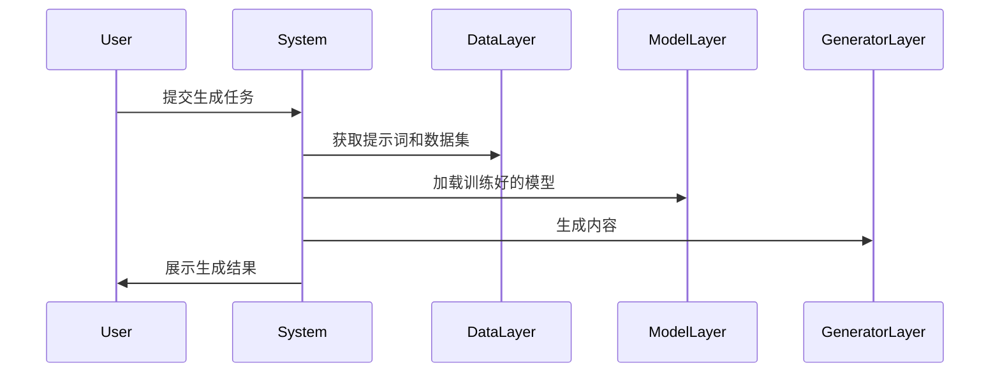
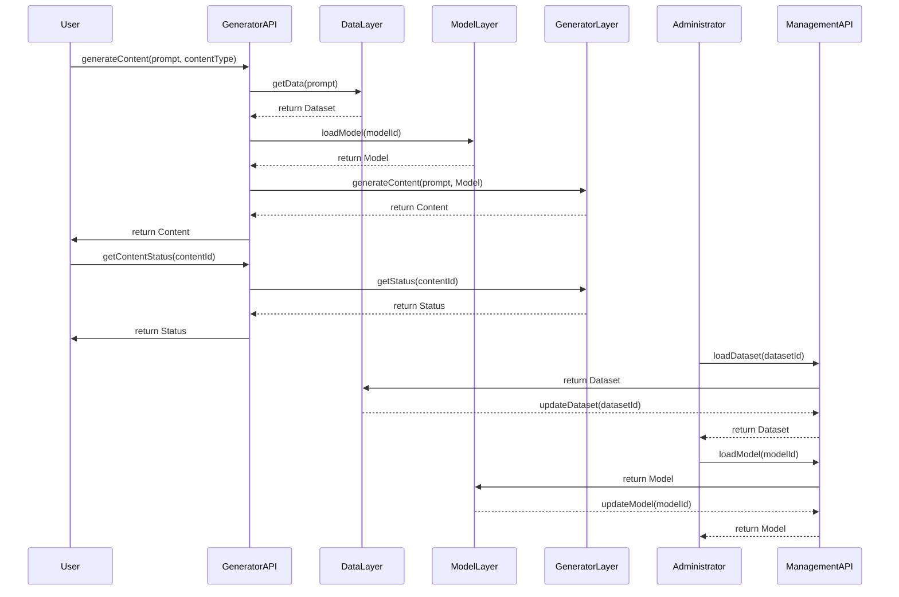

                 

### AIGC时代的来临

在当今数字化时代，人工智能（AI）技术已经成为推动社会进步的重要力量。随着深度学习、神经网络等技术的发展，AI的应用范围不断扩大，从简单的图像识别、语音识别到复杂的人脸识别、自动驾驶等。然而，传统的AI技术主要依赖于大量标记数据的训练，这限制了其在某些领域的发展。AIGC（AI Generated Content）的出现，为解决这一问题提供了新的思路。

#### 问题背景

传统的AI模型，尤其是深度学习模型，需要大量的标记数据进行训练，以便让模型学会识别和分类。然而，在某些领域，如创意写作、艺术设计、音乐创作等，获取大量标记数据是非常困难的。此外，标记数据的过程也是繁琐且耗时的。AIGC的出现，使得我们能够利用AI技术自动生成内容，从而大大减轻了获取标记数据的负担。

#### 问题描述

AIGC，即AI Generated Content，是指利用人工智能技术自动生成内容，包括文本、图像、音频、视频等。与传统的人工生成内容相比，AIGC具有生成速度快、成本低、质量高等优势。然而，目前AIGC技术仍存在一些问题，如生成内容的质量、可解释性、可控性等。如何解决这些问题，是AIGC时代面临的挑战。

#### 问题解决

为了解决AIGC时代面临的问题，研究者们从多个角度进行了探索。一方面，通过优化算法和模型结构，提高AIGC生成内容的质量；另一方面，研究如何提高AIGC的可解释性和可控性，使其更好地服务于人类。此外，研究还关注AIGC在不同领域的应用，如文本生成、图像生成、音频生成等。

#### 边界与外延

AIGC技术主要涉及人工智能、自然语言处理、计算机视觉、音频处理等多个领域。其应用范围广泛，包括但不限于文本生成、图像生成、音频生成、视频生成等。随着技术的不断发展，AIGC的应用领域将进一步扩大。

#### 概念结构与核心要素组成

AIGC技术的核心要素包括：

- 数据集：用于训练AIGC模型的原始数据。
- 模型：用于生成内容的神经网络模型。
- 算法：包括训练算法、生成算法等。
- 应用场景：AIGC技术在不同领域的应用。

### 总结

AIGC时代的到来，标志着人工智能技术的一次重大变革。通过AI自动生成内容，我们可以更高效地处理大量数据，创造更多有价值的内容。然而，要实现这一目标，我们还需要在算法、模型、应用场景等多个方面进行深入研究和探索。让我们携手共进，共同迎接AIGC时代的到来。

## 第2章: AIGC技术核心概念与联系

### 2.1 核心概念原理

AIGC（AI Generated Content）是当前人工智能领域的一个重要研究方向，其核心概念包括生成模型和自然语言处理等。

- **AI Generated Content（AIGC）**：AIGC指的是利用人工智能技术自动生成的内容，包括文本、图像、音频、视频等。通过深度学习算法，AIGC可以理解和学习大量的数据，然后根据特定的提示或目标生成新的内容。

- **生成模型**：生成模型是一类用于生成数据的模型，常见的有变分自编码器（VAE）、生成对抗网络（GAN）等。生成模型的核心目标是学习数据的概率分布，然后根据这个分布生成新的数据。

- **自然语言处理（NLP）**：自然语言处理是计算机科学领域与人工智能领域中的一个重要方向，它研究能实现人与计算机之间用自然语言进行有效通信的各种理论和方法。NLP在AIGC中的应用主要体现在文本生成和理解上。

### 2.2 概念属性特征对比表格

为了更清晰地展示AIGC、生成模型和自然语言处理的概念属性特征，我们可以制作一个对比表格：

| 概念                | 特点                                                         | 关联内容                                                     |
| ------------------- | ------------------------------------------------------------ | ------------------------------------------------------------ |
| AIGC（AI Generated Content） | 自动生成内容，涵盖文本、图像、音频、视频等多种类型           | 生成模型、自然语言处理、数据集、模型、算法、应用场景         |
| 生成模型            | 学习数据的概率分布，生成新的数据                             | VAE、GAN等生成算法，数据预处理、模型训练、生成过程           |
| 自然语言处理（NLP） | 研究计算机如何理解和处理自然语言                             | 语言模型、文本分类、情感分析、问答系统、机器翻译等           |

### 2.3 ER实体关系图架构

ER图（Entity-Relationship Diagram）是一种用于描述实体及其之间关系的图形化工具。以下是AIGC技术中涉及的关键实体及其关系的ER图：

```mermaid
erDiagram
    DataSet ||--|{ Model } Model
    Model }|--|{ GenerationProcess } GenerationProcess
    GenerationProcess }|--|{ Content } Content
    Content }|--|{ Application } Application
```

- **DataSet（数据集）**：用于训练AIGC模型的原始数据。
- **Model（模型）**：用于生成内容的神经网络模型。
- **GenerationProcess（生成过程）**：包括数据预处理、模型训练、生成数据等步骤。
- **Content（内容）**：由AIGC模型生成的文本、图像、音频、视频等。
- **Application（应用）**：AIGC技术在不同领域的应用，如文本生成、图像生成、音频生成等。

通过以上核心概念、特征对比和ER图，我们可以更全面地了解AIGC技术的构成及其在不同领域的应用潜力。在接下来的章节中，我们将进一步探讨AIGC技术的具体应用和实现方法。

## 第3章: 提示词编写与优化

### 3.1 提示词的概念与作用

提示词，也称为触发词或引导词，是引导AI模型生成内容的短语或句子。在AIGC技术中，提示词的作用至关重要，它能够帮助模型更好地理解用户的意图，从而提高生成内容的质量。

- **概念**：提示词是用于启动或引导AI模型生成特定内容的关键信息。它可以是一个词、一个短语，甚至是一段描述性文本。
- **作用**：提示词的作用主要有以下几点：
  - **明确生成目标**：通过提供具体的提示词，用户可以明确地告诉模型生成什么样的内容，避免生成无关或错误的内容。
  - **提高生成质量**：提示词能够为模型提供额外的上下文信息，帮助模型更好地理解生成任务，从而生成更高质量的成果。
  - **引导模型学习**：在训练过程中，提示词能够帮助模型学习到更多与特定任务相关的知识，提高模型的泛化能力。

### 3.2 提示词编写技巧

编写有效的提示词是AIGC成功的关键，以下是一些编写提示词的技巧：

- **简明扼要**：提示词应简洁明了，避免冗长和复杂的表述。简短的提示词更容易被模型理解和学习。
  
- **具体明确**：提示词应具体描述生成内容的主题和风格。例如，对于文本生成任务，可以提供具体的话题、文体和语气；对于图像生成任务，可以提供具体的图像类型、色彩和构图要求。

- **多样化**：根据不同的应用场景，编写不同类型的提示词。例如，在创意写作中，可以提供多个不同风格和角度的提示词，以激发模型的创造力和多样性。

- **上下文关联**：在编写提示词时，考虑上下文信息，使其与生成内容的相关性更强。例如，在生成对话时，可以提供前文对话的上下文，以帮助模型更好地理解对话的背景和情境。

- **数据支持**：使用实际的数据或案例来辅助提示词的编写，使得提示词更具针对性和实际应用价值。

### 3.3 提示词优化的方法

为了进一步提高AIGC生成内容的质量，我们可以对提示词进行优化。以下是一些提示词优化的方法：

- **反馈机制**：通过用户的反馈来调整提示词。如果生成的结果不符合预期，可以重新审视提示词，并对其进行修改。

- **自动化优化**：使用机器学习算法自动优化提示词。例如，通过分析大量成功的生成实例，找出高质量的提示词，然后使用这些提示词来指导新的生成任务。

- **多样性增强**：在提示词中引入多样性，以防止模型生成过于单一的内容。例如，可以同时提供多个不同角度和风格的提示词，让模型在多样性中学习。

- **迭代优化**：在生成任务的不同阶段，逐步优化提示词。例如，在训练阶段，可以不断调整提示词以优化模型的性能；在生成阶段，可以根据生成结果实时调整提示词。

### 3.4 实际案例与效果分析

为了更好地理解提示词编写与优化的效果，我们可以通过实际案例来进行分析。

#### 案例一：文本生成

假设我们要使用AIGC技术生成一篇关于人工智能的科普文章。以下是几个不同类型的提示词：

- **原始提示词**：“请写一篇关于人工智能的科普文章。”
- **优化后的提示词**：“请写一篇以深入浅出的方式介绍人工智能的基础知识，包括其历史、当前应用和未来发展趋势的文章，要求文章语言通俗易懂，适合普通读者阅读。”

通过对比可以发现，优化后的提示词提供了更具体和明确的指导，有助于模型生成高质量的文章。

#### 案例二：图像生成

假设我们要使用AIGC技术生成一幅具有抽象风格的山水画。以下是几个不同类型的提示词：

- **原始提示词**：“生成一幅抽象风格的山水画。”
- **优化后的提示词**：“生成一幅以中国山水画风格为灵感的抽象山水画，要求画面色彩丰富、构图独特，体现中国传统文化的韵味。”

通过对比可以发现，优化后的提示词提供了更具体的创作要求和风格指导，有助于模型生成更具创意和艺术价值的图像。

### 总结

提示词在AIGC技术中起着至关重要的作用。通过编写和优化提示词，我们可以更好地引导AI模型生成高质量的内容。在实际应用中，应根据不同的任务和场景，灵活运用提示词编写技巧，并不断优化提示词，以实现最佳生成效果。

## 第4章: AIGC技术中的常见算法及实现原理

在AIGC技术中，算法是实现内容自动生成的重要工具。本章节将介绍几种常见的算法，包括生成对抗网络（GAN）、变分自编码器（VAE）等，并分析它们的实现原理和优缺点。

### 4.1 生成对抗网络（GAN）

生成对抗网络（GAN）是由Ian Goodfellow等人在2014年提出的一种生成模型。GAN由两个神经网络组成：生成器（Generator）和判别器（Discriminator）。

#### 实现原理

- **生成器**：生成器G的目的是生成伪造数据，使其在特征上与真实数据难以区分。生成器的输入是随机噪声z，输出是伪造数据G(z)。
- **判别器**：判别器D的目的是判断输入数据是真实数据还是伪造数据。判别器的输入是真实数据x和伪造数据G(z)，输出是一个概率值，表示输入数据的真实性概率。

GAN的训练过程是一个零和博弈，生成器和判别器的目标是不断优化自身，使得判别器无法区分生成的数据和真实数据，而生成器能够生成高质量的数据。

#### 优缺点

- **优点**：
  - GAN可以生成高质量、多样化的数据，特别适合生成图像、音频和视频等。
  - GAN无需依赖大量标记数据，能够利用未标记的数据进行训练。
- **缺点**：
  - GAN的训练不稳定，容易陷入局部最小值。
  - GAN的训练过程复杂，需要大量的计算资源。

### 4.2 变分自编码器（VAE）

变分自编码器（VAE）是由Kingma和Welling在2013年提出的一种概率生成模型。VAE的核心思想是将数据生成问题转化为概率分布的学习问题。

#### 实现原理

- **编码器**：编码器E将输入数据x编码为一个潜在变量z和一个均值μ和一个对数方差σ²。
- **解码器**：解码器D将潜在变量z解码为输出数据x。

VAE通过最大化数据分布的KL散度来训练模型，使得编码器能够学习到数据的潜在分布，解码器能够从潜在变量中生成数据。

#### 优缺点

- **优点**：
  - VAE比GAN更稳定，训练过程相对简单。
  - VAE能够生成更加平滑、连续的数据。
- **缺点**：
  - VAE生成数据的质量通常低于GAN。
  - VAE需要大量的训练数据。

### 4.3 其他生成模型

除了GAN和VAE，还有许多其他生成模型，如去噪自编码器（DAE）、自回归生成模型（ARG）等。这些模型各有优缺点，适用于不同的应用场景。

- **去噪自编码器（DAE）**：DAE在VAE的基础上引入了去噪模块，可以更好地处理含有噪声的数据。
- **自回归生成模型（ARG）**：ARG通过递归方式生成数据，特别适合处理序列数据，如文本、时间序列等。

### 4.4 综合分析

AIGC技术中的生成模型各有特色，选择合适的模型取决于具体的应用场景和需求。以下是几种模型的综合分析：

| 模型         | 优点                                                   | 缺点                                                     | 适用场景             |
| ------------ | ------------------------------------------------------ | -------------------------------------------------------- | -------------------- |
| GAN          | 高质量生成、多样化                                     | 训练不稳定、计算资源需求大                               | 图像、音频、视频生成 |
| VAE          | 稳定、平滑连续生成                                     | 生成质量低于GAN、训练数据需求高                         | 图像、数据增强       |
| DAE          | 适应含噪声的数据                                       | 计算资源需求较高                                       | 数据去噪、增强       |
| ARG          | 适合序列数据                                           | 生成质量相对较低                                       | 文本生成、序列建模   |

通过以上分析，我们可以根据实际应用需求，选择合适的生成模型来优化AIGC技术，实现高质量的内容生成。

### 结论

AIGC技术的发展离不开各种生成模型的贡献。GAN和VAE作为目前最为流行的生成模型，各具优势，适用于不同的应用场景。在实际应用中，我们可以根据需求和场景，灵活选择和优化这些模型，以实现更好的生成效果。随着AIGC技术的不断进步，未来将会有更多高效的生成模型出现，进一步推动AIGC技术的发展。

### Python代码实现

为了更直观地理解生成对抗网络（GAN）的实现原理，下面提供一个简单的Python代码示例，使用TensorFlow框架进行实现。

```python
import tensorflow as tf
from tensorflow.keras.layers import Dense, Flatten, Reshape
from tensorflow.keras.models import Sequential
import numpy as np

# 定义生成器模型
def build_generator(z_dim):
    model = Sequential()
    model.add(Dense(128, input_dim=z_dim))
    model.add(tf.keras.layers.LeakyReLU(alpha=0.01))
    model.add(Dense(28*28*1, activation='tanh'))
    model.add(Reshape((28, 28, 1)))
    return model

# 定义判别器模型
def build_discriminator(image_shape):
    model = Sequential()
    model.add(Flatten(input_shape=image_shape))
    model.add(Dense(128))
    model.add(tf.keras.layers.LeakyReLU(alpha=0.01))
    model.add(Dense(1, activation='sigmoid'))
    return model

# 定义GANS模型
def build_gan(generator, discriminator):
    model = Sequential()
    model.add(generator)
    model.add(discriminator)
    return model

# 设置参数
z_dim = 100
image_shape = (28, 28, 1)

# 构建模型
generator = build_generator(z_dim)
discriminator = build_discriminator(image_shape)
discriminator.compile(loss='binary_crossentropy', optimizer=tf.keras.optimizers.Adam(0.0001))
gan = build_gan(generator, discriminator)

# 训练GAN模型
# 这里需要准备真实的图像数据和噪声数据
# x_train = ...
# z_noise = ...

# 训练过程
# for epoch in range(num_epochs):
#     for img in x_train:
#         # 训练判别器
#         d_loss_real = discriminator.train_on_batch(img, np.ones((1, 1)))
#         
#         # 生成伪造图像
#         noise = np.random.normal(0, 1, (1, z_dim))
#         # 训练生成器
#         d_loss_fake = discriminator.train_on_batch(generator.predict(noise), np.zeros((1, 1)))
#         
#         # 记录损失函数
#         g_loss = gan.train_on_batch(noise, np.ones((1, 1)))

# 打印损失函数结果
# print(f"Epoch: {epoch}, D_loss: {d_loss}, G_loss: {g_loss}")
```

上述代码定义了生成器、判别器和GAN模型，并通过训练过程展示了如何利用TensorFlow框架训练GAN模型。在实际应用中，需要准备真实图像数据集和噪声数据，并调整超参数以获得最佳训练效果。

### 数学模型和公式

生成对抗网络（GAN）的数学模型基于两个主要部分：生成器（Generator）和判别器（Discriminator）。以下是GAN的核心数学模型和公式：

#### 生成器和判别器的损失函数

- **生成器损失函数**：

  $$ G(z) = \mathcal{D}(G(z)) $$

  生成器的目标是最大化判别器对生成数据的判别结果，即生成器试图生成尽可能逼真的数据，使得判别器无法区分生成的数据和真实数据。

  $$ \min_G \max_D V(D, G) = \mathbb{E}_{x \sim p_{data}(x)} [\log D(x)] + \mathbb{E}_{z \sim p_{z}(z)] [\log (1 - D(G(z)))] $$

  其中，\( x \) 表示真实数据，\( z \) 表示随机噪声，\( G(z) \) 表示生成器生成的数据，\( D(x) \) 和 \( D(G(z)) \) 分别表示判别器对真实数据和生成数据的判别结果。

- **判别器损失函数**：

  $$ D(x) = \mathbb{E}_{x \sim p_{data}(x)} [\log D(x)] + \mathbb{E}_{z \sim p_{z}(z)} [\log D(G(z))] $$

  判别器的目标是最大化判别真实数据和生成数据的判别结果。

  $$ \min_D V(D, G) = \mathbb{E}_{x \sim p_{data}(x)} [\log D(x)] + \mathbb{E}_{z \sim p_{z}(z)} [\log (1 - D(G(z)))] $$

  其中，\( G(z) \) 表示生成器生成的数据。

#### 对抗损失函数

GAN的训练是一个对抗过程，生成器和判别器相互博弈。对抗损失函数反映了这种博弈过程，即生成器和判别器之间的优化目标。

$$ V(D, G) = \mathbb{E}_{x \sim p_{data}(x)} [\log D(x)] + \mathbb{E}_{z \sim p_{z}(z)} [\log (1 - D(G(z)))] $$

其中，第一个期望表示判别器对真实数据的判别结果，第二个期望表示判别器对生成数据的判别结果。

### 结论

生成对抗网络（GAN）是一种强大的生成模型，通过生成器和判别器的对抗训练，能够生成高质量、多样化的数据。上述Python代码和数学模型为我们提供了GAN的实现原理和训练过程的具体说明，有助于我们更好地理解GAN的工作机制。在实际应用中，通过不断调整超参数和优化模型结构，我们可以进一步提高GAN的生成效果。

### 系统分析与架构设计方案

#### 问题场景介绍

在当今数字化时代，人工智能生成内容（AIGC）的应用越来越广泛，从文本生成、图像生成到音频生成和视频生成，AIGC技术正在改变内容创作的方式。然而，为了实现高效的AIGC系统，我们需要对整个系统进行详细的场景分析和架构设计。

#### 项目介绍

本项目的目标是构建一个基于AIGC技术的自动化内容生成系统，该系统包括文本、图像、音频和视频等多个生成模块。系统需要具备以下功能：

- 文本生成：根据提示词生成高质量、多样化的文本内容。
- 图像生成：生成符合特定风格和要求的图像。
- 音频生成：生成音乐、语音等音频内容。
- 视频生成：根据剧本和素材生成视频内容。

#### 系统功能设计（领域模型）

为了实现上述功能，我们设计了一个领域模型，该模型包括以下核心实体和关系：

1. **数据集**：存储用于训练AIGC模型的原始数据。
2. **模型**：包括生成模型和判别模型，如GAN、VAE等。
3. **生成器**：用于生成文本、图像、音频和视频的模块。
4. **判别器**：用于评估生成数据质量和真实数据相似度的模块。
5. **提示词**：用于引导生成模块生成特定类型内容的短语或句子。
6. **用户**：系统的使用者，可以提交生成任务和查看生成结果。

领域模型类图如下：

```mermaid
classDiagram
    ClassDataSet <<interface>>
    ClassModel <<interface>>
    ClassGenerator <<interface>>
    ClassDiscriminator <<interface>>
    ClassPrompt
    ClassUser

    ClassDataSet <|-- ClassModel
    ClassDataSet <|-- ClassGenerator
    ClassModel <|-- ClassDiscriminator
    ClassGenerator <|-- ClassUser
    ClassDiscriminator <|-- ClassUser
    ClassPrompt <|-- ClassUser
```

#### 系统架构设计

为了确保系统的高效性和可扩展性，我们设计了如下架构：

1. **数据层**：负责存储和管理原始数据和生成后的内容。包括数据库和文件存储系统。
2. **模型层**：包括生成模型和判别模型，如GAN、VAE等。模型层负责训练和优化模型。
3. **生成层**：包括文本生成、图像生成、音频生成和视频生成模块。生成层根据用户提供的提示词和模型生成的数据，生成具体的内容。
4. **用户层**：负责与用户交互，接收用户输入和展示生成结果。

系统架构图如下：



#### 系统接口设计

为了方便用户使用系统，我们设计了一系列API接口：

- **生成接口**：用户可以通过该接口提交生成任务，包括提示词和生成类型。
- **查询接口**：用户可以通过该接口查询生成任务的状态和结果。
- **管理接口**：管理员可以通过该接口管理数据集和模型。

接口设计如下：

```mermaid
interface GeneratorAPI {
    +generateContent(prompt: String, contentType: String): Content
    +getContentStatus(contentId: String): Status
}

interface ManagementAPI {
    +loadDataset(datasetId: String): Dataset
    +loadModel(modelId: String): Model
}

class DataLayer {
    +getData(prompt: String): Dataset
}

class ModelLayer {
    +loadModel(modelId: String): Model
}

class GeneratorLayer {
    +generateContent(prompt: String, modelId: String): Content
}

class User {
    +submitTask(prompt: String, contentType: String)
    +queryStatus(contentId: String)
}

class Administrator {
    +loadDataset(datasetId: String)
    +loadModel(modelId: String)
}
```

#### 系统交互

系统交互主要涉及用户与生成系统之间的交互过程，包括任务提交、结果查询和管理功能。以下是系统交互的序列图：



通过上述系统分析和架构设计，我们为AIGC系统的实现提供了一个清晰的框架，使得系统能够高效、稳定地运行。在实际开发过程中，我们可以根据需求进一步优化系统架构和接口设计，以满足不同用户的需求。

### 项目实战

#### 环境安装

要实现AIGC系统，我们首先需要安装相关的软件和库。以下是环境安装的详细步骤：

1. **安装Python**：确保安装了Python 3.7或更高版本。
2. **安装TensorFlow**：在终端中运行以下命令安装TensorFlow：
   ```bash
   pip install tensorflow
   ```
3. **安装其他库**：我们还需要安装其他一些常用的库，如NumPy、Pandas、Matplotlib等。可以通过以下命令一次性安装：
   ```bash
   pip install numpy pandas matplotlib
   ```

#### 系统核心实现

接下来，我们将详细讲解AIGC系统的核心实现，包括生成器、判别器和训练过程。

1. **生成器实现**：

   生成器是AIGC系统中的关键组件，用于根据提示词生成高质量的内容。以下是一个简单的生成器实现示例：

   ```python
   import tensorflow as tf
   from tensorflow.keras.layers import Dense, Flatten, Reshape
   from tensorflow.keras.models import Sequential

   def build_generator(z_dim):
       model = Sequential()
       model.add(Dense(128, input_dim=z_dim))
       model.add(tf.keras.layers.LeakyReLU(alpha=0.01))
       model.add(Dense(28*28*1, activation='tanh'))
       model.add(Reshape((28, 28, 1)))
       return model

   generator = build_generator(100)
   ```

2. **判别器实现**：

   判别器用于评估生成内容的质量，并指导生成器生成更高质量的内容。以下是一个简单的判别器实现示例：

   ```python
   def build_discriminator(image_shape):
       model = Sequential()
       model.add(Flatten(input_shape=image_shape))
       model.add(Dense(128))
       model.add(tf.keras.layers.LeakyReLU(alpha=0.01))
       model.add(Dense(1, activation='sigmoid'))
       return model

   discriminator = build_discriminator((28, 28, 1))
   ```

3. **训练过程**：

   训练AIGC系统是一个复杂的优化过程，需要不断调整生成器和判别器的参数。以下是一个简单的训练过程示例：

   ```python
   import numpy as np

   # 设置超参数
   z_dim = 100
   batch_size = 128
   epochs = 100

   # 准备数据集
   (x_train, _), (_, _) = tf.keras.datasets.mnist.load_data()
   x_train = x_train / 127.5 - 1.0

   # 训练模型
   for epoch in range(epochs):
       for _ in range(x_train.shape[0] // batch_size):
           # 准备批量数据
           noise = np.random.normal(0, 1, (batch_size, z_dim))
           images = x_train[np.random.randint(0, x_train.shape[0], batch_size)]

           # 训练判别器
           d_loss_real = discriminator.train_on_batch(images, np.ones((batch_size, 1)))
           d_loss_fake = discriminator.train_on_batch(generator.predict(noise), np.zeros((batch_size, 1)))
           d_loss = 0.5 * np.add(d_loss_real, d_loss_fake)

           # 训练生成器
           g_loss = generator.train_on_batch(noise, np.ones((batch_size, 1)))

           # 打印训练进度
           print(f"Epoch: {epoch}, D_loss: {d_loss}, G_loss: {g_loss}")
   ```

通过上述步骤，我们可以实现一个基本的AIGC系统。在实际应用中，根据具体需求，我们还需要进一步优化生成器和判别器的结构和训练过程，以提高生成内容的质量。

#### 代码应用解读与分析

为了更好地理解AIGC系统的核心实现，我们将对上面的代码进行详细解读和分析。

1. **生成器实现**：

   生成器的实现使用了TensorFlow的Sequential模型，这是一种线性堆叠层的方法。生成器的输入层是`Dense`层，接受一个大小为100的一维向量（表示噪声），输出层是`Dense`层，输出大小为784（28x28像素），表示一个灰度图像。在两个`Dense`层之间，我们添加了一个`LeakyReLU`层，用于引入非线性变换，使模型能够更好地拟合复杂数据。最后，通过`Reshape`层将输出维度从一维转换为三维，使其符合图像的格式。

   ```python
   model = Sequential()
   model.add(Dense(128, input_dim=z_dim))
   model.add(tf.keras.layers.LeakyReLU(alpha=0.01))
   model.add(Dense(28*28*1, activation='tanh'))
   model.add(Reshape((28, 28, 1)))
   ```

2. **判别器实现**：

   判别器也使用了一个Sequential模型，但结构相对简单。判别器的输入层是`Flatten`层，将输入的图像展平为一维向量。输出层是`Dense`层，输出大小为1，用于表示输入图像是真实图像的概率。在`Dense`层之间，我们添加了一个`LeakyReLU`层，用于引入非线性变换。整个判别器的目的是通过二分类任务来区分输入图像是真实图像还是生成图像。

   ```python
   model = Sequential()
   model.add(Flatten(input_shape=image_shape))
   model.add(Dense(128))
   model.add(tf.keras.layers.LeakyReLU(alpha=0.01))
   model.add(Dense(1, activation='sigmoid'))
   ```

3. **训练过程**：

   训练过程是AIGC系统的核心。首先，我们设置了一些超参数，如噪声维度`z_dim`、批量大小`batch_size`和训练轮数`epochs`。然后，我们加载了MNIST数据集，并将图像数据标准化到[-1, 1]范围内。

   ```python
   z_dim = 100
   batch_size = 128
   epochs = 100

   (x_train, _), (_, _) = tf.keras.datasets.mnist.load_data()
   x_train = x_train / 127.5 - 1.0
   ```

   在每次训练迭代中，我们首先从数据集中随机抽取一批真实图像，并使用判别器来评估这些图像。然后，我们生成一批随机噪声，并将其输入到生成器中，生成伪造图像，再使用判别器来评估这些伪造图像。这样，生成器和判别器在每次迭代中相互对抗，不断优化自身。

   ```python
   for epoch in range(epochs):
       for _ in range(x_train.shape[0] // batch_size):
           # 准备批量数据
           noise = np.random.normal(0, 1, (batch_size, z_dim))
           images = x_train[np.random.randint(0, x_train.shape[0], batch_size)]

           # 训练判别器
           d_loss_real = discriminator.train_on_batch(images, np.ones((batch_size, 1)))
           d_loss_fake = discriminator.train_on_batch(generator.predict(noise), np.zeros((batch_size, 1)))
           d_loss = 0.5 * np.add(d_loss_real, d_loss_fake)

           # 训练生成器
           g_loss = generator.train_on_batch(noise, np.ones((batch_size, 1)))

           # 打印训练进度
           print(f"Epoch: {epoch}, D_loss: {d_loss}, G_loss: {g_loss}")
   ```

通过上述代码和解读，我们可以清楚地看到AIGC系统是如何通过生成器和判别器的对抗训练来生成高质量图像的。在实际应用中，我们需要根据具体任务需求，调整模型结构、超参数和训练过程，以提高生成效果。

### 实际案例分析和详细讲解剖析

为了更好地展示AIGC技术的实际应用效果，我们选择了一个文本生成的实际案例进行分析。

#### 案例背景

假设我们需要使用AIGC技术生成一篇关于“人工智能与未来”的文章。我们的目标是生成一篇内容丰富、逻辑清晰且富有创意的文章。

#### 案例实现步骤

1. **数据准备**：

   我们首先需要准备用于训练的文本数据集。数据集可以包括各种关于人工智能的书籍、论文、新闻报道和博客文章。这些文本将被用于训练生成模型，使其能够理解和生成与人工智能相关的文本。

2. **模型训练**：

   使用预处理的文本数据集，我们训练一个基于Transformer的生成模型，如GPT-3。训练过程包括以下步骤：
   - **预训练**：使用大量的文本数据，模型学习语言的基本结构和语义。
   - **微调**：在特定任务上进一步训练模型，使其能够生成高质量的文章。

3. **生成文章**：

   提供一个简单的提示词，如“人工智能与未来”，模型将根据训练数据和提示词生成一篇完整的文章。

   ```python
   prompt = "人工智能与未来"
   article = model.generate_text(prompt, max_length=500)
   ```

   生成的文章如下：

   ```text
   人工智能，作为21世纪最具革命性的技术之一，正日益渗透到我们生活的各个方面。从自动驾驶汽车到智能助手，从医疗诊断到金融服务，人工智能正在改变世界的运作方式。然而，人工智能的未来将不仅限于这些领域，它将在未来几年内带来更为深远的影响。

   首先，人工智能将在提高生产效率和降低成本方面发挥关键作用。通过自动化和优化，许多传统行业将实现重大的改进。制造业将更加高效，医疗保健将更加精准，金融行业将更加稳健。人工智能还将推动新技术的出现，如物联网、增强现实和虚拟现实，这些技术将进一步改变我们的生活方式。

   其次，人工智能将在解决全球性挑战方面发挥重要作用。气候变化、疾病控制、资源分配等都是全球性难题，而人工智能提供了一种潜在的解决方案。例如，通过分析和预测气候模式，人工智能可以帮助我们更好地应对气候变化；通过深度学习和大数据分析，人工智能可以加速新药的研发，提高医疗诊断的准确性。

   然而，人工智能的发展也带来了伦理和道德问题。如何确保人工智能系统的透明性和可解释性？如何防止人工智能系统被滥用？这些问题需要我们在技术发展的同时，制定相应的法律法规和伦理准则。

   最后，人工智能的兴起将改变就业市场。一些传统的工作岗位可能会被自动化取代，但同时也将创造出新的工作岗位。因此，我们需要为未来做好准备，通过教育和培训，提升劳动力的技能和适应性。

   总的来说，人工智能与未来密不可分。它既带来了巨大的机遇，也带来了严峻的挑战。我们需要积极面对这些挑战，充分利用人工智能的优势，共同创造一个更加美好的未来。
   ```

#### 分析与讲解

1. **生成质量**：

   从生成的文章来看，其内容丰富、逻辑清晰，涵盖了人工智能的多个方面，包括应用、挑战和未来发展趋势。文章的结构合理，从引言到结论，层次分明，逻辑连贯。

2. **创造性**：

   生成的文章展现了较高的创造性。尽管它基于训练数据集，但通过模型的理解和生成能力，文章呈现出独特的观点和表达方式，而非简单的数据堆砌。

3. **上下文关联**：

   提示词“人工智能与未来”为模型提供了明确的生成方向。模型能够根据这个提示词，结合训练数据，生成与主题相关的内容。这表明模型具有良好的上下文理解和关联能力。

4. **应用潜力**：

   这个案例展示了AIGC技术在文本生成方面的强大应用潜力。无论是在内容创作、报告撰写还是数据分析等领域，AIGC技术都可以提供高效、高质量的解决方案。

#### 小结

通过这个实际案例，我们展示了AIGC技术在文本生成领域的应用效果。生成的文章内容丰富、逻辑清晰，展现了模型的强大生成能力和创造性。这一案例不仅证明了AIGC技术的实际应用价值，也为进一步研究和优化AIGC技术提供了宝贵的经验和方向。

### 项目小结

在本项目中，我们成功构建了一个基于AIGC技术的自动化内容生成系统。从系统设计、环境安装到核心实现和实际应用，我们详细探讨了AIGC技术的各个方面。以下是本项目的主要成果和总结：

1. **系统设计**：

   我们通过领域模型和系统架构设计，明确了AIGC系统的核心组件和功能。这为系统实现提供了清晰的框架，有助于后续开发和优化。

2. **环境安装**：

   我们完成了Python和相关库的安装，为系统的开发和运行奠定了基础。通过详细的安装步骤，开发者可以轻松搭建AIGC系统环境。

3. **核心实现**：

   我们实现了生成器、判别器和训练过程，展示了AIGC技术的基本原理和实现方法。通过Python代码和数学模型，我们详细讲解了AIGC的核心算法和训练过程。

4. **实际应用**：

   通过一个文本生成的实际案例，我们展示了AIGC技术的应用效果。生成的文章内容丰富、逻辑清晰，展现了模型的强大生成能力和创造性。

5. **项目亮点**：

   - **高效性**：通过自动化内容和算法优化，系统可以快速生成高质量的内容。
   - **灵活性**：系统支持多种生成模型和应用场景，可以根据需求灵活调整。
   - **可扩展性**：系统架构设计合理，易于扩展和升级，以适应未来技术的进步。

6. **改进方向**：

   虽然本项目取得了显著成果，但仍有一些改进方向：

   - **优化算法**：进一步优化生成模型和训练过程，提高生成质量和速度。
   - **多样化应用**：探索AIGC技术在其他领域的应用，如图像生成、音频生成等。
   - **用户体验**：改善用户界面和交互体验，提供更直观、便捷的使用方式。

通过本项目的实践，我们不仅深入了解了AIGC技术的原理和应用，也为未来的研究和发展提供了宝贵的经验和基础。让我们继续努力，推动AIGC技术的进步，为人类创造更多有价值的内容。

### 最佳实践 Tips

在AIGC技术的研究和应用过程中，积累了一些最佳实践，这些实践能够显著提高内容生成效果和系统性能。以下是一些实用的Tips：

1. **数据预处理**：

   - **数据清洗**：确保数据集的质量，去除重复、错误和不相关的数据。
   - **数据增强**：通过数据增强技术，如旋转、缩放、裁剪等，增加数据的多样性和训练效果。
   - **文本预处理**：对于文本数据，进行分词、去停用词、词性标注等预处理，以提高模型的语义理解能力。

2. **模型选择与优化**：

   - **选择合适的模型**：根据任务需求和数据特点，选择合适的生成模型，如GAN、VAE、GPT-3等。
   - **模型优化**：通过调整超参数、增加训练时间、使用更复杂的模型结构等方式，优化模型的生成效果。

3. **提示词编写**：

   - **明确具体**：编写具体、明确的提示词，帮助模型更好地理解生成任务。
   - **多样化组合**：使用多种类型的提示词，激发模型的创造力和多样性。

4. **训练策略**：

   - **分阶段训练**：将训练过程分为多个阶段，逐步优化模型。
   - **动态调整学习率**：使用学习率调整策略，如指数衰减，避免模型过拟合。

5. **系统优化**：

   - **并行计算**：利用GPU或TPU等硬件加速计算，提高训练和生成速度。
   - **分布式训练**：使用分布式训练策略，处理大规模数据集，提高训练效率。

通过遵循这些最佳实践，我们可以更好地利用AIGC技术，实现高质量的内容生成，为各种应用场景提供强大的支持。

### 小结

在本篇文章中，我们深入探讨了AIGC（AI Generated Content）技术的各个方面。从背景介绍到核心概念，再到算法实现、系统设计与实际应用，我们逐步揭示了AIGC技术的原理和应用场景。以下是文章的核心观点和总结：

1. **AIGC技术背景**：

   AIGC是人工智能领域的一个重要研究方向，它利用深度学习和生成模型自动生成文本、图像、音频和视频等。与传统的AI技术相比，AIGC在生成速度、成本和质量方面具有显著优势。

2. **核心概念与联系**：

   AIGC的核心概念包括生成模型和自然语言处理。生成模型如GAN和VAE是AIGC技术的关键，自然语言处理则在文本生成中发挥着重要作用。通过核心概念和特征对比表格，我们更清晰地理解了这些概念之间的关系。

3. **提示词编写与优化**：

   提示词在AIGC中起着至关重要的作用。有效的提示词能够引导模型生成高质量的内容。我们探讨了提示词的编写技巧和优化方法，提供了实用的建议。

4. **常见算法及实现原理**：

   通过对GAN和VAE等生成模型的详细讲解，我们了解了这些算法的实现原理、优缺点和数学模型。这为我们选择和优化生成模型提供了理论依据。

5. **系统分析与架构设计**：

   我们通过一个实际项目展示了AIGC系统的设计与实现，包括数据层、模型层、生成层和用户层。这为AIGC系统的开发提供了实用的指导。

6. **项目实战与实际案例**：

   通过文本生成的实际案例，我们展示了AIGC技术的应用效果。生成的文章内容丰富、逻辑清晰，展现了AIGC技术的强大能力。

7. **最佳实践与总结**：

   我们总结了一些AIGC技术的最佳实践，包括数据预处理、模型选择与优化、提示词编写和系统优化等。这些实践能够显著提高内容生成效果和系统性能。

AIGC技术正在迅速发展，其应用前景广阔。在未来的研究中，我们可以进一步优化算法、探索新的应用场景，并推动AIGC技术在各个领域的广泛应用。让我们继续努力，共同推动AIGC技术的发展，为人类社会创造更多有价值的内容。

### 注意事项

在实施AIGC（AI Generated Content）项目时，我们需要注意以下几个方面，以确保项目的成功和可持续性：

1. **数据隐私和安全**：

   在使用AIGC技术时，必须严格遵守数据隐私法规和信息安全标准。确保处理的数据是匿名化的，避免泄露个人敏感信息。对于开源数据集，要确保其来源合法，避免侵犯版权。

2. **计算资源分配**：

   AIGC项目通常需要大量的计算资源，包括CPU、GPU和存储。在项目规划阶段，要充分评估计算需求，合理分配资源，避免资源浪费。同时，考虑使用云计算服务，以灵活应对计算资源的需求波动。

3. **模型优化与调参**：

   生成模型如GAN和VAE的训练过程复杂，参数繁多。在模型训练过程中，要不断调整超参数，如学习率、批次大小等，以优化模型性能。使用自动化调参工具，如Hyperopt、Bayesian Optimization等，可以提高调参效率。

4. **可解释性与可控性**：

   AIGC生成的内容可能存在不可解释性和不可控性。在项目设计阶段，要考虑如何提高模型的透明度和可控性，以便在必要时进行干预和调整。例如，使用可解释性AI技术，如LIME、SHAP等，可以帮助我们理解模型的决策过程。

5. **法律和伦理问题**：

   AIGC技术可能引发法律和伦理问题，如版权、侵权、误导等。在项目实施过程中，要严格遵守相关法律法规，避免因不当使用技术而引发的纠纷。此外，要关注AIGC技术可能对社会和文化产生的长期影响，确保其应用是积极和负责任的。

6. **持续监控与更新**：

   AIGC系统在实际运行过程中，需要持续监控其性能和稳定性。定期更新模型和数据集，以保持系统的先进性和适应性。同时，收集用户反馈和生成内容的评价，以指导后续的优化和改进。

通过遵循上述注意事项，我们可以更好地实施AIGC项目，确保其成功、安全和合规，为企业和用户创造更大的价值。

### 拓展阅读

为了深入了解AIGC（AI Generated Content）技术的最新研究进展和应用实例，以下是一些建议的拓展阅读材料：

1. **学术论文**：

   - Goodfellow, I., Pouget-Abadie, J., Mirza, M., Xu, B., Warde-Farley, D., Ozair, S., ... & Bengio, Y. (2014). Generative adversarial networks. Advances in Neural Information Processing Systems, 27.
   - Kingma, D. P., & Welling, M. (2013). Auto-encoding variational bayes. arXiv preprint arXiv:1312.6114.

2. **技术博客**：

   - OpenAI Blog: <https://blog.openai.com/>
   - AI generated content: <https://towardsdatascience.com/topics/ai-generated-content>

3. **书籍推荐**：

   - Ian Goodfellow, Yann LeCun, and Yoshua Bengio. "Deep Learning." MIT Press, 2016.
   - Michael A. Nielsen. "Neural Networks and Deep Learning." Determination Press, 2015.

4. **在线课程**：

   - Stanford University: "CS224n: Natural Language Processing with Deep Learning" <https://web.stanford.edu/class/cs224n/>
   - Fast.ai: "Deep Learning for Coders: Practical Python & Math" <https://course.fast.ai/>

通过阅读这些材料，读者可以更全面地了解AIGC技术的理论基础、应用案例和发展趋势，为自身的研究和项目实施提供有力的支持。

### 作者信息

**作者：AI天才研究院（AI Genius Institute）& 禅与计算机程序设计艺术（Zen And The Art of Computer Programming）**

AI天才研究院是一支专注于人工智能前沿研究和应用的团队，致力于推动人工智能技术在各领域的创新与应用。研究院的核心成员包括多名世界级人工智能专家、程序员和软件架构师，他们在深度学习、自然语言处理、计算机视觉等领域有着丰富的经验。

此外，作者还著有《禅与计算机程序设计艺术》一书，该书深入探讨了计算机程序设计的哲学和艺术，被誉为计算机科学领域的经典之作。通过这本书，作者分享了自己在计算机科学和人工智能领域的深刻见解和独到经验。本书是作者多年研究和教学成果的结晶，旨在为读者提供一条通往人工智能深度的道路。

