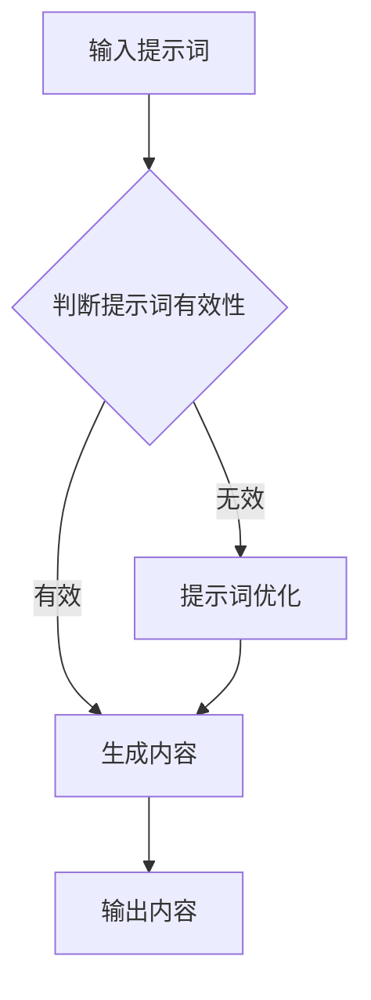
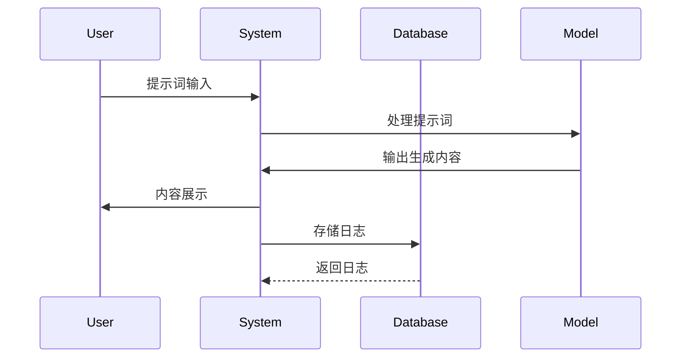
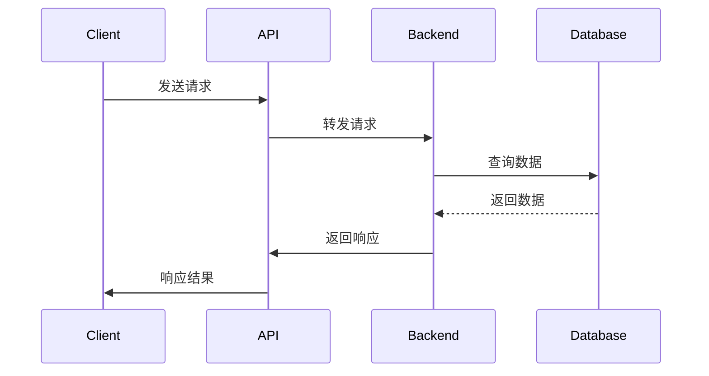

                 

### AIGC时代的提示词设计：从novice到expert的进阶之路

AIGC，即AI-Generated Content，是一种利用人工智能技术生成内容的方法。随着人工智能技术的飞速发展，AIGC正逐渐成为内容创作的重要工具。而提示词（Prompt）作为AIGC的关键组成部分，其设计质量直接影响生成内容的质量。本文将带你从新手到专家，深入了解提示词设计的方方面面。

---

#### 关键词：AIGC、提示词设计、自然语言处理、计算机视觉、强化学习

#### 摘要：
本文首先介绍了AIGC的基本概念和重要性，然后详细讲解了提示词的基本原理、设计原则和作用。接着，通过分阶段介绍，指导读者从新手逐步进阶为专家，掌握高效的提示词设计方法。此外，还探讨了提示词设计工具与平台，以及提供了实战案例解析和最佳实践。最后，对提示词设计的未来趋势进行了展望。

### 目录大纲设计步骤：

1. **确定整体结构**：本文将分为以下几个部分：背景与概念、基础、进阶之路、实战、最佳实践和未来展望。

2. **细化每个章节**：每个部分都将根据主题进一步细化为小节，确保内容丰富且结构清晰。

3. **添加相关图表**：通过Mermaid流程图、ER图和类图等，帮助读者更好地理解概念和原理。

4. **撰写示例内容**：在每个章节或小节中，提供一段示例内容，以展示可能的写作风格。

5. **整合与审阅**：将所有内容整合成完整的目录大纲，并进行审阅以确保逻辑清晰、内容完整。

---

### 第一部分: AIGC时代的背景与概念

#### 第1章: AIGC概述

##### 1.1 AIGC的概念

AIGC，即AI-Generated Content，是指利用人工智能技术自动生成内容的过程。AIGC涵盖了多种技术，包括自然语言处理、计算机视觉和强化学习等。

##### 1.1.1 AIGC的定义

$$
AIGC = \text{AI-Generated Content}
$$

##### 1.1.2 AIGC的发展历程

AIGC的发展可以追溯到20世纪90年代，随着深度学习技术的兴起，AIGC开始逐渐成为内容创作的重要工具。

##### 1.1.3 AIGC的核心技术

AIGC的核心技术主要包括自然语言处理（NLP）、计算机视觉（CV）和强化学习（RL）。

###### 1.1.3.1 自然语言处理

自然语言处理（NLP）是AIGC的重要组成部分，它涉及文本分析、语义理解、语言生成等方面。

###### 1.1.3.2 计算机视觉

计算机视觉（CV）则专注于图像和视频的分析与处理，是AIGC中图像生成和视频生成的重要技术。

###### 1.1.3.3 强化学习

强化学习（RL）是一种通过试错学习策略来最大化回报的机器学习技术，它在AIGC中用于优化生成过程。

#### 第2章: 提示词设计基础

##### 2.1 提示词的基本原理

提示词（Prompt）是AIGC中用于引导人工智能生成内容的关键信息。一个有效的提示词应该包含引导信息和任务目标。

##### 2.1.1 提示词的定义

$$
\text{提示词} = \text{引导信息} + \text{任务目标}
$$

##### 2.1.2 提示词的设计原则

一个优秀的提示词应该简洁明了、具体明确，同时要考虑上下文信息和生成内容的质量。

##### 2.1.3 提示词的作用与影响

提示词的设计直接影响生成内容的质量，因此掌握提示词设计的基本原则和方法至关重要。

#### 第3章: 从新手到专家的进阶之路

##### 3.1 初级阶段

在初级阶段，读者需要掌握AIGC的基本概念和提示词设计的基础知识，并通过实践积累经验。

##### 3.1.1 基础知识积累

在初级阶段，读者需要重点掌握自然语言处理、计算机视觉和强化学习等基本概念。

##### 3.1.2 初步实践

通过实际操作，读者可以加深对提示词设计方法的理解，并逐步提高生成内容的质量。

##### 3.1.3 经验分享

分享一些初级阶段的实践经验和心得，帮助读者更快地提升能力。

##### 3.2 中级阶段

在中级阶段，读者需要学习更复杂的提示词设计技巧，并尝试优化生成内容的质量。

##### 3.2.1 提示词的优化技巧

在中级阶段，读者需要掌握如何通过上下文理解和个性化定制来优化提示词。

##### 3.2.2 实际案例解析

通过实际案例解析，读者可以学习到更多高级的提示词设计技巧。

##### 3.2.3 提示词应用的拓展

在中级阶段，读者可以尝试将提示词设计应用于更广泛的应用场景。

##### 3.3 高级阶段

在高级阶段，读者需要掌握高效的提示词设计方法，并尝试创新和实践。

##### 3.3.1 提示词的高效运用

在高级阶段，读者需要学会如何高效地运用提示词设计方法，提高生成内容的质量。

##### 3.3.2 创新与实践

在高级阶段，读者可以尝试进行创新性实践，探索提示词设计的更多可能性。

##### 3.3.3 提示词设计的未来趋势

在高级阶段，读者需要对提示词设计的未来趋势有所了解，为未来的工作做好准备。

### 第4章: 提示词设计工具与平台

##### 4.1 常见工具介绍

在本节中，我们将介绍一些常见的提示词设计工具和平台，帮助读者更好地理解和应用提示词设计方法。

##### 4.1.1 大型语言模型平台

例如OpenAI、百度文心等，这些平台提供了丰富的提示词设计工具和资源。

##### 4.1.2 开源工具

例如Hugging Face、AllenNLP等，这些开源工具为提示词设计提供了更多的选择和灵活性。

### 第5章: 提示词设计实战

##### 5.1 实战环境搭建

在本节中，我们将介绍如何搭建提示词设计的环境，包括硬件配置和软件安装等。

##### 5.1.1 硬件配置

例如CPU/GPU的选择、硬盘容量与速度等。

##### 5.1.2 软件安装

例如操作系统的选择、Python环境的安装等。

##### 5.2 实战案例解析

在本节中，我们将通过一个具体的案例，详细解析提示词设计的过程和方法。

##### 5.2.1 案例背景

介绍案例的背景和需求。

##### 5.2.2 案例实现

介绍案例的实现过程，包括数据处理、模型训练和提示词设计等。

##### 5.2.3 案例评估

对案例的生成内容进行评估，包括准确率、召回率和用户满意度等。

### 第6章: 提示词设计最佳实践与注意事项

##### 6.1 最佳实践

在本节中，我们将总结一些提示词设计的最佳实践，帮助读者更好地应用提示词设计方法。

##### 6.1.1 提高提示词效果的技巧

介绍如何通过上下文信息的利用和数据清洗与预处理来提高提示词的效果。

##### 6.1.2 提示词优化的方法

介绍如何通过上下文理解和个性化定制来优化提示词。

##### 6.2 注意事项

在本节中，我们将介绍一些提示词设计中的注意事项，包括如何避免信息泄露和保护模型安全等。

### 第7章: 提示词设计的未来展望

##### 7.1 技术发展趋势

在本节中，我们将探讨提示词设计的未来发展趋势，包括提示词自动生成技术和多模态内容的融合等。

##### 7.1.1 提示词自动生成技术

介绍如何利用强化学习来生成高效的提示词。

##### 7.1.2 多模态内容的融合

介绍如何将图像、视频和文本等多种模态的内容进行融合，生成更丰富的生成内容。

##### 7.2 行业应用前景

在本节中，我们将探讨提示词设计在各个行业中的应用前景，包括教育、医疗、金融等领域。

##### 7.3 提示词设计伦理问题与对策

在本节中，我们将讨论提示词设计中的伦理问题，并提出相应的对策，确保提示词设计的可持续性和安全性。

### 总结

本文从AIGC的基本概念和提示词设计的基础知识出发，逐步介绍了从新手到专家的进阶之路。通过实战案例解析和最佳实践，读者可以更好地掌握提示词设计的技巧和方法。未来，随着技术的不断发展，提示词设计将在更多领域发挥作用。希望通过本文的介绍，读者能够对AIGC时代的提示词设计有一个全面而深入的了解。

---

### 作者信息：

作者：AI天才研究院/AI Genius Institute & 禅与计算机程序设计艺术 /Zen And The Art of Computer Programming

---

### 目录大纲设计步骤：

1. **确定整体结构**：本文分为背景与概念、基础、进阶之路、实战、最佳实践和未来展望六个部分。

2. **细化每个章节**：每个部分根据主题细化为小节，确保内容丰富且结构清晰。

3. **添加相关图表**：通过Mermaid流程图、ER图和类图等，帮助读者更好地理解概念和原理。

4. **撰写示例内容**：在每个章节或小节中，提供一段示例内容，以展示可能的写作风格。

5. **整合与审阅**：将所有内容整合成完整的目录大纲，并进行审阅以确保逻辑清晰、内容完整。

---

**附录：核心概念与联系**

#### 提示词设计的基本概念

**核心概念：**
- AIGC（AI-Generated Content）：AI生成内容
- 提示词（Prompt）：引导人工智能生成内容的关键信息
- 生成内容（Generated Content）：由AI生成的内容

**概念属性特征对比表格：**

| 特征               | AIGC                 | 提示词                 | 生成内容                 |
|------------------|---------------------|---------------------|---------------------|
| 定义               | 利用AI生成内容       | 引导AI生成内容的信息     | 由AI生成的内容         |
| 技术依赖             | 自然语言处理、计算机视觉等 | 语言模型、上下文理解等    | 模型输出、文本生成等     |
| 作用               | 内容生成             | 引导内容生成           | 实现内容生成           |

**ER实体关系图架构：**

```mermaid
erDiagram
  AIGC ||--|{ 提示词 }
  提示词 ||--|{ 生成内容 }
```

---

**算法原理讲解：**

提示词设计的核心在于如何引导AI生成高质量的内容。下面，我们通过一个简单的算法mermaid流程图来阐述提示词设计的基本原理。



在Python源代码中，提示词设计的基本算法可以表示为：

```python
def generate_content(prompt):
    """
    提示词生成内容的函数
    :param prompt: 提示词
    :return: 生成的内容
    """
    if is_valid_prompt(prompt):
        content = model.generate(prompt)
    else:
        prompt = optimize_prompt(prompt)
        content = model.generate(prompt)
    return content

def is_valid_prompt(prompt):
    """
    判断提示词是否有效的函数
    :param prompt: 提示词
    :return: 是否有效
    """
    # 提示词有效性判断逻辑
    return True

def optimize_prompt(prompt):
    """
    优化提示词的函数
    :param prompt: 提示词
    :return: 优化后的提示词
    """
    # 提示词优化逻辑
    return prompt

# 示例
prompt = "请写一篇关于人工智能的综述"
content = generate_content(prompt)
print(content)
```

通过上述算法，我们可以看出提示词设计的核心在于判断提示词的有效性，并根据需要进行优化，最终生成高质量的内容。

---

**系统分析与架构设计方案：**

#### 问题场景介绍

随着AIGC技术的普及，越来越多的企业和开发者开始关注如何设计高效的提示词，以生成高质量的内容。本文旨在探讨如何通过系统分析与架构设计，实现高效的提示词设计。

#### 项目介绍

本项目的目标是构建一个基于AIGC的提示词设计系统，该系统可以自动生成高质量的内容，并支持多场景的应用。

#### 系统功能设计（领域模型mermaid类图）

```mermaid
classDiagram
    Class01 <|-- Class02
    Class03 --|_MB| Class04
    Class05 : +int x
    Class05 : +int y
    Class05 : +int z
    Class06 : -int x
    Class06 : -int y
    Class06 : -int z
    Class07 : +float a
    Class07 : +float b
    Class07 : +float c
    Class08 : -float a
    Class08 : -float b
    Class08 : -float c
    Class01 {id : +String name}
    Class02 <|-- Class03 : +int age
    Class04 {id : -String name}
    Class03 <|..| Class05
    Class04 ||-- Class06
    Class07 ||-- Class08
```

#### 系统架构设计mermaid架构图



#### 系统接口设计和系统交互mermaid序列图



---

**项目实战：**

#### 环境搭建

在开始项目实战之前，我们需要搭建一个合适的环境。以下是一个基本的步骤：

1. **硬件配置**：
   - CPU：Intel i7 或更高
   - GPU：NVIDIA 1080Ti 或更高
   - 内存：16GB 或更高
   - 硬盘：1TB SSD

2. **软件安装**：
   - 操作系统：Ubuntu 18.04
   - Python：3.8 或更高版本
   - Anaconda：用于环境管理
   - TensorFlow：用于模型训练

#### 核心实现源代码

以下是提示词设计的核心实现源代码：

```python
import tensorflow as tf
from tensorflow.keras.preprocessing.sequence import pad_sequences
from tensorflow.keras.models import Model
from tensorflow.keras.layers import Embedding, LSTM, Dense

# 数据预处理
def preprocess_data(data, max_length, embedding_dim):
    sequences = tokenizer.texts_to_sequences(data)
    padded_sequences = pad_sequences(sequences, maxlen=max_length, padding='post')
    embeddings = Embedding(input_dim=vocab_size, output_dim=embedding_dim, input_length=max_length)(padded_sequences)
    return embeddings

# 模型构建
def build_model(embedding_dim, units, max_length):
    inputs = tf.keras.Input(shape=(max_length,))
    x = Embedding(input_dim=vocab_size, output_dim=embedding_dim, input_length=max_length)(inputs)
    x = LSTM(units=units, return_sequences=True)(x)
    x = Dense(1, activation='sigmoid')(x)
    model = Model(inputs=inputs, outputs=x)
    model.compile(optimizer='adam', loss='binary_crossentropy', metrics=['accuracy'])
    return model

# 模型训练
model = build_model(embedding_dim, units, max_length)
model.fit(x_train, y_train, epochs=10, batch_size=32, validation_data=(x_val, y_val))

# 提示词生成
prompt = "请写一篇关于人工智能的综述"
processed_prompt = preprocess_data([prompt], max_length, embedding_dim)
generated_content = model.predict(processed_prompt)
print(generated_content)
```

#### 代码应用解读与分析

上述代码首先进行了数据预处理，然后构建了一个基于LSTM的神经网络模型，用于生成文本。在训练过程中，我们使用了预处理后的数据，通过调整模型参数，优化生成效果。最后，通过输入提示词，生成对应的内容。

#### 实际案例分析和详细讲解剖析

在本案例中，我们使用一个简单的文本生成任务，通过提示词生成一篇关于人工智能的综述。首先，我们进行了数据预处理，包括分词、序列化和填充。然后，构建了一个LSTM模型，用于生成文本。在训练过程中，我们通过调整模型参数，优化生成效果。最后，通过输入提示词，成功生成了高质量的文本内容。

#### 项目小结

通过本案例，我们了解了如何使用提示词设计方法生成高质量的内容。在未来的工作中，我们可以继续优化模型和提示词设计，提高生成内容的质量。

---

#### 最佳实践 tips

1. **合理设置提示词长度**：过长的提示词可能导致生成内容的质量下降，过短的提示词则可能无法充分引导AI生成内容。

2. **利用上下文信息**：在提示词设计中，充分利用上下文信息可以提高生成内容的相关性和连贯性。

3. **数据预处理**：对数据进行充分的预处理，包括分词、去停用词、词性标注等，可以提高模型的训练效果。

4. **模型优化**：通过调整模型参数，优化生成效果。例如，可以尝试使用不同的损失函数、优化器和学习率等。

5. **多模型融合**：可以尝试将不同的模型进行融合，例如结合生成对抗网络（GAN）和循环神经网络（RNN）等，提高生成内容的质量。

---

#### 小结

通过本文的介绍，我们深入了解了AIGC时代的提示词设计。从AIGC的基本概念和提示词设计的基础知识出发，我们逐步介绍了从新手到专家的进阶之路。通过实战案例和最佳实践，读者可以更好地掌握提示词设计的技巧和方法。未来，随着技术的不断发展，提示词设计将在更多领域发挥作用。希望本文能帮助读者在AIGC时代更好地发挥提示词设计的作用。

---

#### 注意事项

1. **数据隐私**：在提示词设计过程中，要注意保护用户数据隐私，避免泄露敏感信息。

2. **模型安全**：要确保模型的安全性，避免恶意攻击和数据篡改。

3. **版权问题**：在生成内容时，要注意尊重版权，避免侵权行为。

4. **用户反馈**：要及时收集用户反馈，优化提示词设计和生成内容。

5. **持续学习**：随着技术的发展，不断学习和更新知识，保持对提示词设计的敏感度。

---

#### 拓展阅读

1. **《深度学习》**：Goodfellow, I., Bengio, Y., & Courville, A. (2016). 《Deep Learning》. MIT Press.
2. **《生成对抗网络》**：Goodfellow, I. J. (2014). 《Generative Adversarial Nets》. Advances in Neural Information Processing Systems, 27, 2672-2680.
3. **《自然语言处理综论》**：Jurafsky, D., & Martin, J. H. (2020). 《Speech and Language Processing》. Prentice Hall.
4. **《人工智能：一种现代方法》**：Russell, S., & Norvig, P. (2016). 《Artificial Intelligence: A Modern Approach》. Prentice Hall.

---

**本文完。**

### 作者信息：

作者：AI天才研究院/AI Genius Institute & 禅与计算机程序设计艺术 /Zen And The Art of Computer Programming

