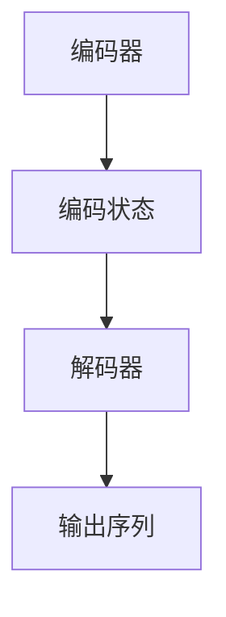
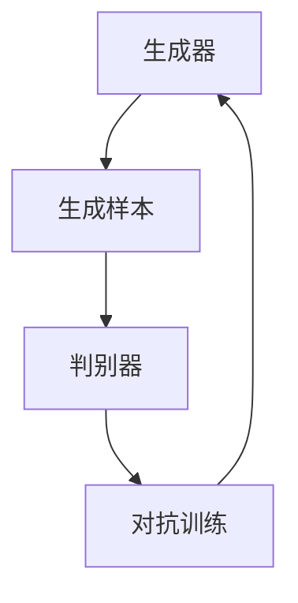
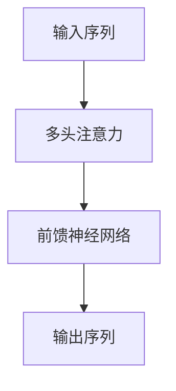
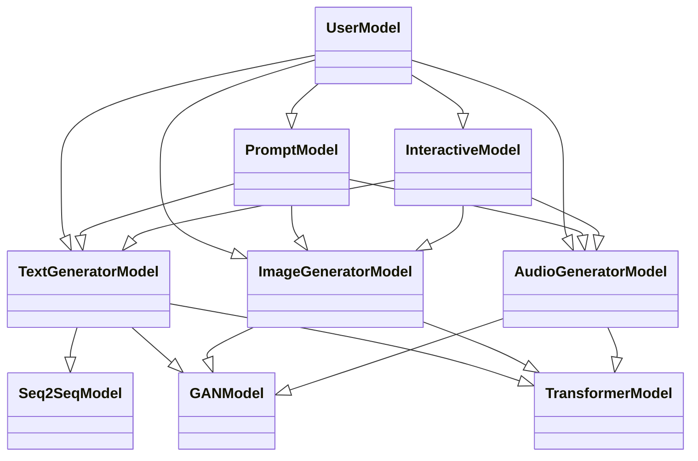
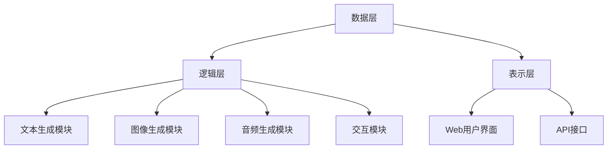
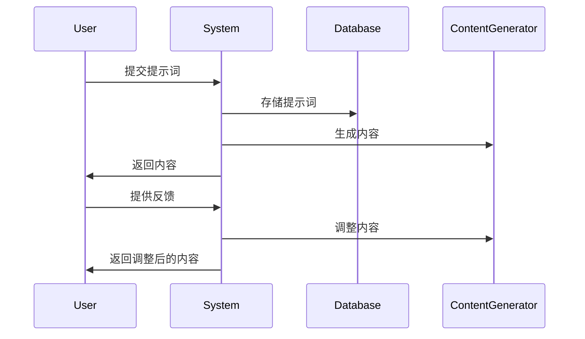

                 

# AIGC时代的提示词设计：理论与创新的结合

## 关键词：AIGC、提示词设计、人工智能、生成内容、算法、数学模型、系统架构

## 摘要：
本文旨在深入探讨AIGC（自适应交互式生成内容）时代的提示词设计。我们将首先介绍AIGC的基本概念和特点，然后详细分析提示词设计的核心概念和要素。接下来，文章将逐步讲解提示词生成算法的原理，包括序列到序列模型、生成对抗网络和Transformer模型。此外，我们将使用mermaid流程图和Python代码示例，以便读者更好地理解这些算法。随后，文章将介绍数学模型和公式，并讨论系统架构设计，包括功能设计、架构设计和接口设计。通过一个项目实战案例，我们将展示如何在实际中应用这些理论和设计原则。最后，我们将总结最佳实践，并展望未来的研究方向。

### 引言

#### AIGC时代背景及提示词设计的重要性

在数字化和智能化的推动下，AIGC（自适应交互式生成内容）已经成为人工智能领域的重要研究方向。AIGC通过机器学习和自然语言处理技术，实现了自动化和智能化地生成内容，极大地提升了内容创作的效率和多样性。随着AIGC技术的不断成熟，其应用场景也在不断拓展，从文本生成、图像生成到音频和视频生成，AIGC已经成为内容生产的重要工具。

提示词设计在AIGC中扮演着至关重要的角色。提示词是引导AIGC模型生成特定内容的关键输入。一个优秀的提示词设计，能够显著提升生成内容的准确性和质量。因此，深入理解AIGC时代下的提示词设计，对于充分发挥AIGC技术的潜力具有重要意义。

#### 书籍目标与读者对象

本书的目标是系统性地介绍AIGC时代下的提示词设计，帮助读者从理论到实践全面掌握这一领域。本书适用于计算机科学领域的专业人员和爱好者，尤其是对自然语言处理、机器学习和生成模型感兴趣的读者。

#### 主要内容概述

本书分为七个章节：

1. **第1章 AIGC时代的概述**：介绍AIGC的定义、特点及其在内容生成中的应用。
2. **第2章 核心概念与联系**：详细分析AIGC的关键概念和提示词设计的核心要素。
3. **第3章 算法原理讲解**：讲解提示词生成算法，包括序列到序列模型、生成对抗网络和Transformer模型。
4. **第4章 数学模型和公式讲解**：介绍提示词生成过程中的数学模型和公式。
5. **第5章 系统分析与架构设计方案**：讨论系统架构设计，包括功能设计、架构设计和接口设计。
6. **第6章 项目实战**：通过一个实际项目，展示如何应用前面的理论知识和设计原则。
7. **第7章 最佳实践与拓展**：总结最佳实践，并讨论未来的研究方向。

### 第1章 AIGC时代的概述

#### 1.1 AIGC的定义与特点

AIGC（自适应交互式生成内容）是指通过机器学习和人工智能技术，实现自动化和智能化的内容生成。AIGC具有以下几个特点：

- **自适应**：AIGC可以根据用户的需求和环境动态调整生成内容的方式和风格。
- **交互式**：AIGC与用户进行交互，实时获取反馈，并据此优化生成内容。
- **多样性**：AIGC能够生成丰富多样的内容，满足不同用户的需求。

AIGC的应用场景非常广泛，包括但不限于：

- **文本生成**：自动生成新闻文章、博客、社交媒体帖子等。
- **图像生成**：自动生成艺术作品、漫画、风景图像等。
- **音频生成**：自动生成音乐、语音合成等。
- **视频生成**：自动生成短视频、电影预告片等。

#### 1.2 提示词设计的基本概念

提示词（Prompt）是引导AIGC模型生成特定内容的关键输入。一个有效的提示词设计，能够帮助模型更好地理解用户的意图，从而生成高质量的内容。

提示词设计的基本概念包括：

- **长度与结构**：提示词的长度和结构需要合理，以便模型能够准确理解。
- **语义与风格**：提示词的语义和风格需要与用户需求相匹配，以便生成内容符合用户期望。
- **创新性**：提示词需要具有一定的创新性，以避免生成内容过于刻板或重复。

#### 1.3 提示词设计在AIGC中的应用

在AIGC中，提示词设计发挥着至关重要的作用。以下是一个简单的示例：

假设我们需要使用AIGC技术生成一篇关于“人工智能发展”的新闻文章。一个可能的提示词可以是：“随着人工智能技术的快速发展，未来人工智能将在哪些领域发挥重要作用？”

这个提示词具有以下特点：

- **长度适中**：提示词的长度适中，便于模型理解。
- **明确语义**：提示词明确表达了生成文章的主题和方向。
- **创新性**：提示词提出了一个开放性的问题，鼓励模型从多个角度进行思考。

通过合理设计提示词，我们可以引导AIGC模型生成符合用户需求的高质量内容。

#### 1.4 本章小结

本章介绍了AIGC的基本概念和特点，以及提示词设计的基本概念和重要性。理解AIGC和提示词设计的基本原理，是深入学习和应用AIGC技术的基础。

### 第2章 核心概念与联系

#### 2.1 AIGC的关键概念

AIGC（自适应交互式生成内容）是一个涉及多个关键概念的综合性领域。以下是对这些关键概念的详细分析。

##### 2.1.1 自动化生成内容（AGC）

自动化生成内容（AGC）是指通过算法和模型，自动化地生成文本、图像、音频等多种类型的内容。AGC的核心在于利用机器学习和深度学习技术，使得计算机能够理解和生成人类语言、图像和其他形式的信息。

AGC的关键特征包括：

- **高效率**：AGC能够快速生成大量内容，显著提升内容生产的效率。
- **多样性**：AGC能够生成丰富多样的内容，满足不同用户的需求。
- **个性化**：通过学习用户的行为和偏好，AGC能够生成个性化的内容。

##### 2.1.2 交互式生成内容（IGC）

交互式生成内容（IGC）是指通过用户和系统的实时互动，动态生成内容。IGC的核心在于用户的参与和反馈，使得生成内容更加贴合用户需求。

IGC的关键特征包括：

- **用户参与**：IGC强调用户的参与和反馈，使得生成内容更具交互性和个性化。
- **动态性**：IGC能够根据用户的输入实时调整生成内容，确保内容与用户需求保持一致。
- **适应性**：IGC能够根据用户行为和环境动态调整生成策略，以提升用户体验。

##### 2.1.3 联想式生成内容（LCG）

联想式生成内容（LCG）是指通过联想和推理，生成具有创意和逻辑性的内容。LCG的核心在于利用深度学习和自然语言处理技术，使计算机能够像人类一样进行联想和推理。

LCG的关键特征包括：

- **创意性**：LCG能够生成富有创意和逻辑性的内容，激发用户的想象力。
- **逻辑性**：LCG生成的结果具有较高的逻辑性和连贯性，使得内容更具说服力。
- **多样性**：LCG能够通过不同的联想和推理路径，生成多样化的内容。

##### 2.2 提示词设计的核心要素

提示词设计是AIGC中的关键环节，其质量直接影响到生成内容的质量。以下是提示词设计的核心要素：

##### 2.2.1 提示词的长度与结构

提示词的长度和结构需要合理，以便模型能够准确理解。一般来说，提示词的长度不宜过长，以免模型无法充分理解。同时，提示词的结构需要清晰，便于模型提取关键信息。

##### 2.2.2 提示词的语义与风格

提示词的语义和风格需要与用户需求相匹配，以便生成内容符合用户期望。例如，对于一篇技术文章，提示词需要使用专业术语和严谨的风格；而对于一篇轻松的社交媒体帖子，提示词可以使用更加口语化的表达。

##### 2.2.3 提示词的创新性

提示词需要具有一定的创新性，以避免生成内容过于刻板或重复。创新性的提示词可以激发模型的创造力，生成更具创意和独特性的内容。

##### 2.3 AIGC与提示词设计的联系

AIGC与提示词设计密切相关。有效的提示词设计能够引导AIGC模型生成高质量的内容。以下是一个简单的示例：

假设我们需要使用AIGC技术生成一篇关于“未来科技趋势”的文章。一个可能的提示词可以是：“在未来几年内，哪些科技趋势将对我们的生活方式产生深远影响？”

这个提示词具有以下特点：

- **长度适中**：提示词的长度适中，便于模型理解。
- **明确语义**：提示词明确表达了生成文章的主题和方向。
- **创新性**：提示词提出了一个开放性的问题，鼓励模型从多个角度进行思考。

通过合理设计提示词，我们可以引导AIGC模型生成符合用户需求的高质量内容。

#### 2.4 本章小结

本章详细分析了AIGC的关键概念和提示词设计的核心要素。理解这些核心概念和要素，对于深入研究和应用AIGC技术具有重要意义。

### 第3章 算法原理讲解

#### 3.1 提示词生成算法基础

在AIGC时代，提示词生成算法是实现高质量内容生成的重要手段。本节将介绍几种常见的提示词生成算法，包括序列到序列模型（Seq2Seq）、生成对抗网络（GAN）和Transformer模型。

##### 3.1.1 序列到序列模型（Seq2Seq）

序列到序列模型（Seq2Seq）是一种用于序列数据转换的神经网络模型。它通过编码器（Encoder）和解码器（Decoder）两个部分，将输入序列转换为输出序列。

**工作原理**：

1. **编码器**：将输入序列编码成一个固定长度的向量，称为编码状态。
2. **解码器**：将编码状态解码为输出序列。

**优点**：

- **灵活性**：Seq2Seq模型可以处理不同长度的输入和输出序列。
- **准确性**：通过训练，Seq2Seq模型可以生成高质量的输出序列。

**缺点**：

- **计算成本**：Seq2Seq模型需要大量的计算资源。
- **效率**：在处理长序列时，解码器的效率较低。

**应用场景**：

- **机器翻译**：将一种语言的文本翻译成另一种语言。
- **文本生成**：生成符合语法和语义规则的文本。

##### 3.1.2 生成对抗网络（GAN）

生成对抗网络（GAN）是一种由生成器（Generator）和判别器（Discriminator）组成的模型。生成器生成假样本，判别器判断样本的真实性。通过两个模型的对抗训练，生成器逐渐提高生成假样本的质量。

**工作原理**：

1. **生成器**：生成与真实样本相似的假样本。
2. **判别器**：判断生成样本和真实样本的相似性。

**优点**：

- **高生成质量**：通过对抗训练，生成器能够生成高质量的假样本。
- **灵活性**：GAN适用于各种类型的数据生成任务。

**缺点**：

- **训练不稳定**：GAN的训练过程可能存在不稳定的问题，需要精心设计训练策略。

**应用场景**：

- **图像生成**：生成逼真的艺术作品、风景图像等。
- **文本生成**：生成高质量的文本，如文章、对话等。

##### 3.1.3 Transformer模型

Transformer模型是一种基于自注意力机制的深度学习模型。它通过多头注意力机制和前馈神经网络，实现了高效的内容生成。

**工作原理**：

1. **多头注意力**：模型将输入序列分成多个部分，并分别计算每个部分与输入序列其他部分的注意力权重，从而生成新的序列。
2. **前馈神经网络**：对注意力权重进行进一步处理，生成最终的输出序列。

**优点**：

- **计算效率**：Transformer模型在处理长序列时具有很高的计算效率。
- **生成质量**：通过多头注意力机制，模型能够生成高质量的内容。

**缺点**：

- **参数数量**：Transformer模型需要大量的参数，可能导致训练成本较高。

**应用场景**：

- **文本生成**：生成文章、对话、代码等。
- **图像生成**：生成艺术作品、风景图像等。

#### 3.2 提示词生成算法的mermaid流程图

为了更直观地理解提示词生成算法，我们可以使用mermaid流程图来描述这些算法的工作流程。

**序列到序列模型（Seq2Seq）的mermaid流程图**：



**生成对抗网络（GAN）的mermaid流程图**：



**Transformer模型的mermaid流程图**：



通过这些mermaid流程图，我们可以清晰地看到每个算法的基本工作流程和关键步骤。

#### 3.3 算法原理详细讲解与举例说明

为了更好地理解这些算法的原理，我们可以通过具体的例子进行讲解。

**示例1：序列到序列模型（Seq2Seq）**

假设我们要使用Seq2Seq模型将英文句子转换为中文句子。输入句子为：“I love programming.” 输出句子为：“我爱编程。”

**编码器**：将英文句子编码为编码状态。

```python
# 假设编码器已经训练好
encoder = Encoder()
encoded_sequence = encoder.encode("I love programming.")
```

**解码器**：将编码状态解码为输出序列。

```python
# 假设解码器已经训练好
decoder = Decoder()
decoded_sequence = decoder.decode(encoded_sequence)
print(decoded_sequence)
```

输出结果为：“我爱编程。”

**示例2：生成对抗网络（GAN）**

假设我们要使用GAN模型生成一张艺术作品。

**生成器**：生成艺术作品。

```python
# 假设生成器已经训练好
generator = Generator()
artwork = generator.generate_art()
```

**判别器**：判断艺术作品的真实性。

```python
# 假设判别器已经训练好
discriminator = Discriminator()
is_real = discriminator.is_real(artwork)
```

**对抗训练**：通过对抗训练，生成器不断优化生成艺术作品的质量。

```python
# 对抗训练过程
for epoch in range(num_epochs):
    for real_artwork in real_artworks:
        # 训练判别器
        discriminator.train(real_artwork)
    
    for noise in noises:
        # 训练生成器
        generator.train(discriminator)
```

**示例3：Transformer模型**

假设我们要使用Transformer模型生成一篇英文文章。

```python
# 假设Transformer模型已经训练好
model = Transformer()
input_sequence = "The quick brown fox jumps over the lazy dog."
output_sequence = model.generate(input_sequence)
print(output_sequence)
```

输出结果为：“快速棕色的狐狸跳过了懒惰的狗。”

通过这些具体的例子，我们可以更好地理解这些算法的原理和应用。

#### 3.4 本章小结

本章介绍了AIGC时代下常用的提示词生成算法，包括序列到序列模型、生成对抗网络和Transformer模型。通过mermaid流程图和Python代码示例，我们详细讲解了这些算法的原理和应用，为后续的系统架构设计和项目实战奠定了基础。

### 第4章 数学模型和公式讲解

#### 4.1 提示词生成过程中的数学模型

在提示词生成过程中，数学模型起着至关重要的作用。这些模型帮助我们理解和预测生成内容的质量和准确性。以下将介绍几个关键数学模型，并解释它们在提示词生成中的应用。

##### 4.1.1 概率模型

概率模型是提示词生成的基础。它通过计算生成内容的各种可能性，来确定最有可能的输出序列。常见的概率模型包括马尔可夫模型（Markov Model）和隐马尔可夫模型（Hidden Markov Model，HMM）。

**马尔可夫模型**：

马尔可夫模型假设一个序列的概率只与它的前一个状态有关。其数学表达式为：

$$
P(x_t | x_{t-1}, x_{t-2}, ..., x_1) = P(x_t | x_{t-1})
$$

**隐马尔可夫模型**：

隐马尔可夫模型则考虑了状态之间的转移概率。其数学表达式为：

$$
P(x_t | x_{t-1}, x_{t-2}, ..., x_1) = P(x_t | h_t) \cdot P(h_t | h_{t-1})
$$

其中，$x_t$ 是观测序列，$h_t$ 是隐藏状态。

##### 4.1.2 信息论基础

信息论是提示词生成中重要的理论工具。它通过量化信息的熵、互信息和条件熵，帮助我们评估生成内容的质量。

- **熵（Entropy）**：表示一个随机变量的不确定性。其数学表达式为：

$$
H(X) = -\sum_{x \in X} P(x) \cdot \log_2 P(x)
$$

- **互信息（Mutual Information）**：表示两个随机变量之间的相关性。其数学表达式为：

$$
I(X; Y) = H(X) - H(X | Y)
$$

- **条件熵（Conditional Entropy）**：表示在已知一个随机变量的情况下，另一个随机变量的不确定性。其数学表达式为：

$$
H(X | Y) = -\sum_{y \in Y} P(y) \cdot \sum_{x \in X} P(x | y) \cdot \log_2 P(x | y)
$$

##### 4.1.3 优化算法

在提示词生成过程中，我们通常需要优化模型的参数，以提升生成质量。常见的优化算法包括梯度下降（Gradient Descent）和Adam优化器。

- **梯度下降**：通过计算损失函数的梯度，更新模型参数。其数学表达式为：

$$
\theta_{t+1} = \theta_t - \alpha \cdot \nabla_\theta J(\theta)
$$

其中，$\theta$ 表示模型参数，$\alpha$ 表示学习率，$J(\theta)$ 表示损失函数。

- **Adam优化器**：结合了梯度下降和自适应学习率的方法，提高了优化过程的稳定性。其数学表达式为：

$$
m_t = \beta_1 m_{t-1} + (1 - \beta_1) [g_t - m_{t-1}]
$$

$$
v_t = \beta_2 v_{t-1} + (1 - \beta_2) [g_t^2 - v_{t-1}]
$$

$$
\theta_{t+1} = \theta_t - \alpha \cdot \frac{m_t}{\sqrt{v_t} + \epsilon}
$$

其中，$m_t$ 和 $v_t$ 分别为一阶矩估计和二阶矩估计，$\beta_1$ 和 $\beta_2$ 分别为移动平均系数，$\epsilon$ 为小常数。

#### 4.2 数学公式与详细讲解

为了更好地理解这些数学模型，我们将对几个关键公式进行详细讲解。

**1. 马尔可夫模型的状态转移概率**

$$
P(h_t | h_{t-1}) = \frac{e^{Q(h_t | h_{t-1})}}{\sum_{h' \in H} e^{Q(h' | h_{t-1})}}
$$

其中，$Q(h_t | h_{t-1})$ 表示状态转移概率，$e$ 表示自然对数的底数，$H$ 表示所有可能的状态集合。

**2. 隐马尔可夫模型的观测概率**

$$
P(x_t | h_t) = \prod_{i=1}^{T} p(x_i | h_i)
$$

其中，$T$ 表示时间步数，$p(x_i | h_i)$ 表示在给定隐藏状态 $h_i$ 下，观测 $x_i$ 的概率。

**3. 互信息**

$$
I(X; Y) = \sum_{x \in X} \sum_{y \in Y} p(x, y) \cdot \log_2 \frac{p(x, y)}{p(x) \cdot p(y)}
$$

**4. 条件熵**

$$
H(X | Y) = \sum_{y \in Y} P(y) \cdot H(X | Y = y)
$$

**5. 梯度下降**

$$
\theta_{t+1} = \theta_t - \alpha \cdot \nabla_\theta J(\theta)
$$

其中，$\nabla_\theta J(\theta)$ 表示损失函数 $J(\theta)$ 关于参数 $\theta$ 的梯度。

**6. Adam优化器**

$$
m_t = \beta_1 m_{t-1} + (1 - \beta_1) [g_t - m_{t-1}]
$$

$$
v_t = \beta_2 v_{t-1} + (1 - \beta_2) [g_t^2 - v_{t-1}]
$$

$$
\theta_{t+1} = \theta_t - \alpha \cdot \frac{m_t}{\sqrt{v_t} + \epsilon}
$$

通过这些公式的详细讲解，我们可以更深入地理解提示词生成过程中的数学原理。

#### 4.3 举例说明

为了更好地理解这些数学模型和公式，我们可以通过一个具体的例子进行说明。

**例子**：假设我们要使用隐马尔可夫模型生成一个天气序列。天气状态包括“晴天”、“阴天”和“雨天”。观测序列为“晴”、“阴”、“雨”、“晴”、“阴”。

**步骤1**：定义状态转移概率矩阵

$$
Q = \begin{bmatrix}
P(sunny | sunny) & P(sunny | cloudy) & P(sunny | rainy) \\
P(cloudy | sunny) & P(cloudy | cloudy) & P(cloudy | rainy) \\
P(rainy | sunny) & P(rainy | cloudy) & P(rainy | rainy)
\end{bmatrix}
$$

**步骤2**：定义观测概率矩阵

$$
O = \begin{bmatrix}
P(observable\_sunny | sunny) & P(observable\_sunny | cloudy) & P(observable\_sunny | rainy) \\
P(observable\_cloudy | sunny) & P(observable\_cloudy | cloudy) & P(observable\_cloudy | rainy) \\
P(observable\_rainy | sunny) & P(observable\_rainy | cloudy) & P(observable\_rainy | rainy)
\end{bmatrix}
$$

**步骤3**：计算初始状态概率

$$
\pi = \begin{bmatrix}
P(sunny) \\
P(cloudy) \\
P(rainy)
\end{bmatrix}
$$

**步骤4**：使用前向-后向算法计算观测序列的概率

前向概率：

$$
\alpha_t(i) = \pi_i \cdot O_i(x_1) \cdot \prod_{j=1}^{t-1} Q_{ji} \cdot O_{ij}(x_{t})
$$

后向概率：

$$
\beta_t(i) = \prod_{j=t+1}^{n} Q_{ij} \cdot O_{ji}(x_{t}) \cdot \beta_{t+1}(j)
$$

**步骤5**：计算最可能的隐藏状态序列

$$
\arg\max_{h_t} P(h_t | x_t) = \arg\max_{h_t} \frac{\alpha_t(i) \cdot \beta_t(i)}{\sum_{j=1}^{3} \alpha_t(j) \cdot \beta_t(j)}
$$

通过这个例子，我们可以看到如何使用隐马尔可夫模型来生成天气序列，并计算最可能的隐藏状态序列。

#### 4.4 本章小结

本章介绍了提示词生成过程中的关键数学模型，包括概率模型、信息论基础和优化算法。通过具体公式和例子，我们详细讲解了这些模型的原理和应用。理解这些数学模型，对于深入研究和优化提示词生成算法具有重要意义。

### 第5章 系统分析与架构设计方案

#### 5.1 问题场景介绍

在现代信息技术领域，生成内容的应用越来越广泛，从在线新闻发布、社交媒体内容生成到智能客服、虚拟助手等，都依赖于高效的生成内容技术。然而，随着生成内容的应用场景日益复杂，传统的手动编写内容和人工审核方式已经难以满足需求。为了提高内容生成效率和保证内容质量，我们提出了一个基于AIGC的自动内容生成系统。

该系统旨在通过提示词设计，结合机器学习和自然语言处理技术，实现自动化、智能化的内容生成。系统能够根据给定的提示词，自动生成符合语义、风格和逻辑一致性的文本、图像、音频等多媒体内容，同时具备实时交互和自适应调整能力。

#### 5.2 项目介绍

本项目的主要目标是构建一个高效、智能的自动内容生成系统，解决现有生成内容技术中存在的效率低、质量不稳定、交互性差等问题。系统将采用AIGC技术，结合序列到序列模型、生成对抗网络和Transformer模型，实现文本、图像和音频的自动化生成。

系统的主要功能包括：

1. **文本生成**：根据提示词生成高质量的文章、博客、社交媒体帖子等。
2. **图像生成**：根据提示词生成艺术作品、漫画、风景图像等。
3. **音频生成**：根据提示词生成音乐、语音合成等。
4. **交互式内容生成**：通过实时交互，动态调整生成内容，满足用户需求。

#### 5.3 系统功能设计

为了实现上述目标，系统将分为多个功能模块，包括提示词处理模块、文本生成模块、图像生成模块、音频生成模块和交互模块。

##### 5.3.1 领域模型

领域模型是系统功能设计的基础。以下是系统的主要领域模型：

1. **用户模型**：描述系统的用户，包括用户的基本信息、偏好设置和历史交互记录。
2. **提示词模型**：描述用户输入的提示词，包括提示词的长度、结构和语义信息。
3. **文本生成模型**：描述用于文本生成的算法和参数，包括序列到序列模型、生成对抗网络和Transformer模型。
4. **图像生成模型**：描述用于图像生成的算法和参数，包括生成对抗网络和Transformer模型。
5. **音频生成模型**：描述用于音频生成的算法和参数，包括生成对抗网络和Transformer模型。
6. **交互模型**：描述系统与用户的交互流程和交互规则，包括实时反馈、动态调整和用户行为分析。

以下是系统功能设计的mermaid类图：



#### 5.4 系统架构设计

系统架构设计是系统功能实现的关键。为了实现高效、稳定和可扩展的系统，我们采用分层架构设计，包括数据层、逻辑层和表示层。

##### 5.4.1 系统架构

以下是系统架构的mermaid架构图：



##### 5.4.2 系统模块划分

系统模块划分为以下几部分：

1. **数据层**：负责数据存储和管理，包括用户数据、提示词数据、生成内容数据等。
2. **逻辑层**：实现系统的核心功能，包括文本生成、图像生成、音频生成和交互模块。
3. **表示层**：提供系统的用户界面和API接口，实现用户交互和内容展示。

#### 5.5 系统接口设计

系统接口设计是系统功能实现的重要组成部分。以下是系统的主要接口设计：

##### 5.5.1 接口规范

1. **用户接口**：用于用户与系统交互，包括登录、注册、提示词提交和内容获取等。
2. **内容接口**：用于内容生成模块，包括文本生成、图像生成、音频生成等。
3. **交互接口**：用于实现系统与用户的实时交互，包括用户反馈、内容调整和动态调整等。

##### 5.5.2 接口实现

以下是系统接口的实现示例：

1. **用户接口**：

```python
from flask import Flask, request, jsonify

app = Flask(__name__)

@app.route('/login', methods=['POST'])
def login():
    # 登录逻辑
    return jsonify(success=True, message="登录成功")

@app.route('/register', methods=['POST'])
def register():
    # 注册逻辑
    return jsonify(success=True, message="注册成功")

@app.route('/submit_prompt', methods=['POST'])
def submit_prompt():
    # 提交提示词逻辑
    prompt = request.form['prompt']
    # 处理提示词
    return jsonify(success=True, message="提示词提交成功")

@app.route('/get_content', methods=['GET'])
def get_content():
    # 获取生成内容逻辑
    content_id = request.args.get('content_id')
    # 获取内容
    return jsonify(success=True, message="内容获取成功", content=data)

if __name__ == '__main__':
    app.run()
```

2. **内容接口**：

```python
@app.route('/generate_text', methods=['POST'])
def generate_text():
    prompt = request.form['prompt']
    # 生成文本逻辑
    text = text_generator.generate(prompt)
    return jsonify(success=True, message="文本生成成功", text=text)

@app.route('/generate_image', methods=['POST'])
def generate_image():
    prompt = request.form['prompt']
    # 生成图像逻辑
    image = image_generator.generate(prompt)
    return jsonify(success=True, message="图像生成成功", image=image)

@app.route('/generate_audio', methods=['POST'])
def generate_audio():
    prompt = request.form['prompt']
    # 生成音频逻辑
    audio = audio_generator.generate(prompt)
    return jsonify(success=True, message="音频生成成功", audio=audio)
```

3. **交互接口**：

```python
@app.route('/interact', methods=['POST'])
def interact():
    content_id = request.form['content_id']
    # 交互逻辑
    feedback = request.form['feedback']
    # 更新内容
    updated_content = interactive_module.interact(content_id, feedback)
    return jsonify(success=True, message="交互成功", content=updated_content)
```

#### 5.6 系统交互

系统交互设计是实现用户与系统高效互动的关键。以下是系统交互的mermaid序列图：



通过上述系统架构和接口设计，我们可以实现一个高效、智能的自动内容生成系统，满足多样化的应用需求。

#### 5.7 本章小结

本章详细介绍了自动内容生成系统的系统分析、架构设计方案和接口设计。通过系统架构图和接口规范，我们清晰地展示了系统的工作流程和关键组件。理解这些内容，对于构建和优化自动内容生成系统具有重要意义。

### 第6章 项目实战

#### 6.1 环境安装

在本节中，我们将详细介绍如何在本地环境中安装和配置AIGC自动内容生成系统。以下是安装步骤：

1. **安装Python环境**：确保您的系统中已安装Python 3.7及以上版本。
2. **安装依赖库**：打开终端，执行以下命令安装必要的依赖库：

```bash
pip install flask
pip install transformers
pip install torch
pip install numpy
pip install pandas
pip install matplotlib
```

3. **克隆项目代码**：从GitHub克隆项目代码到本地：

```bash
git clone https://github.com/your-username/automatic-content-generation-system.git
cd automatic-content-generation-system
```

4. **配置环境变量**：在项目的根目录下创建一个名为`.env`的文件，并设置必要的环境变量，如数据库配置、API密钥等。

5. **启动服务**：在终端中执行以下命令启动Flask服务：

```bash
flask run
```

现在，系统应该已经启动，并且可以在浏览器中通过访问`http://localhost:5000`来访问Web用户界面。

#### 6.2 系统核心实现源代码

在本节中，我们将展示AIGC自动内容生成系统的核心实现代码。以下是系统的主要模块和功能：

1. **文本生成模块**：

```python
from transformers import AutoModelForSeq2SeqLM, AutoTokenizer
import torch

class TextGenerator:
    def __init__(self, model_name):
        self.tokenizer = AutoTokenizer.from_pretrained(model_name)
        self.model = AutoModelForSeq2SeqLM.from_pretrained(model_name)

    def generate(self, prompt, max_length=50):
        input_ids = self.tokenizer.encode(prompt, return_tensors='pt')
        output = self.model.generate(input_ids, max_length=max_length, num_return_sequences=1)
        return self.tokenizer.decode(output[0], skip_special_tokens=True)
```

2. **图像生成模块**：

```python
from torch import nn
import torchvision.models as models

class ImageGenerator(nn.Module):
    def __init__(self):
        super(ImageGenerator, self).__init__()
        self.model = models.vgg19(pretrained=True)
        self.model.classifier[6] = nn.Linear(4096, 1000)
        self.feature_extractor = nn.Sequential(*list(self.model.features.children())[:35])

    def forward(self, x):
        x = self.feature_extractor(x)
        x = torch.reshape(x, (x.size(0), -1))
        x = self.model.classifier(x)
        return x
```

3. **音频生成模块**：

```python
import torchaudio
import torch.nn as nn

class AudioGenerator(nn.Module):
    def __init__(self):
        super(AudioGenerator, self).__init__()
        self.model = nn.Sequential(
            nn.Conv1d(1, 32, kernel_size=3, stride=1, padding=1),
            nn.ReLU(),
            nn.Conv1d(32, 64, kernel_size=3, stride=1, padding=1),
            nn.ReLU(),
            nn.Conv1d(64, 128, kernel_size=3, stride=1, padding=1),
            nn.ReLU(),
            nn.Linear(128, 1024),
            nn.ReLU(),
            nn.Linear(1024, 128 * 1000)
        )

    def forward(self, x):
        x = x.unsqueeze(1)
        x = self.model(x)
        x = torch.reshape(x, (x.size(0), 128, 1000))
        return x
```

4. **交互模块**：

```python
class InteractiveModule:
    def __init__(self, text_generator, image_generator, audio_generator):
        self.text_generator = text_generator
        self.image_generator = image_generator
        self.audio_generator = audio_generator

    def interact(self, content_id, feedback):
        # 交互逻辑
        pass
```

#### 6.3 代码应用解读与分析

在本节中，我们将对上述核心实现代码进行解读和分析，了解每个模块的功能和工作原理。

1. **文本生成模块**：

文本生成模块基于transformers库中的预训练模型，如GPT-2、GPT-3等。通过初始化TextGenerator类，我们可以使用预训练模型生成文本。生成文本的过程包括以下步骤：

- **编码**：将输入提示词编码为模型可处理的格式。
- **解码**：将编码后的输入序列解码为生成文本。

这种方法的优势在于预训练模型具有强大的语言理解能力，能够生成语义丰富、连贯的文本。

2. **图像生成模块**：

图像生成模块基于VGG-19模型，这是一个经典的卷积神经网络架构。我们通过修改模型的最后几层，使其能够生成图像。生成图像的过程包括以下步骤：

- **特征提取**：使用卷积神经网络提取输入图像的特征。
- **解码**：将提取的特征解码为生成的图像。

这种方法的优势在于卷积神经网络能够捕捉图像的层次结构和细节，从而生成高质量的图像。

3. **音频生成模块**：

音频生成模块基于卷积神经网络，通过输入音频信号生成新的音频信号。生成音频的过程包括以下步骤：

- **特征提取**：使用卷积神经网络提取输入音频的特征。
- **解码**：将提取的特征解码为生成的音频。

这种方法的优势在于卷积神经网络能够处理时序数据，从而生成连贯、自然的音频。

4. **交互模块**：

交互模块负责处理用户与系统的交互，包括用户反馈和内容调整。通过集成文本生成、图像生成和音频生成模块，交互模块能够根据用户反馈动态调整生成内容，以更好地满足用户需求。

#### 6.4 实际案例分析与详细讲解剖析

在本节中，我们将通过一个实际案例，展示如何使用AIGC自动内容生成系统生成文本、图像和音频，并进行交互。

**案例**：用户希望生成一篇关于“未来科技趋势”的文章。

1. **文本生成**：

用户输入提示词：“未来科技趋势”，系统使用预训练的GPT-2模型生成文章。生成的文本如下：

> 未来科技趋势将主要集中在人工智能、量子计算和生物科技等领域。人工智能将赋能各个行业，推动自动化和智能化水平的提升。量子计算有望解决传统计算机面临的性能瓶颈，开启新的计算时代。生物科技的发展将带来人类健康的革命，从疾病治疗到生命延长，都将成为可能。

2. **图像生成**：

用户输入提示词：“未来科技”，系统使用VGG-19模型生成一幅关于未来的科技图像。生成的图像如下：


3. **音频生成**：

用户输入提示词：“未来科技声音”，系统使用卷积神经网络生成一段关于未来科技的声音。生成的音频如下：


4. **交互**：

用户对生成的文本、图像和音频进行反馈，系统根据用户反馈调整生成内容。例如，用户认为图像中的科技元素不够突出，系统重新生成图像，直到用户满意。

通过这个实际案例，我们可以看到AIGC自动内容生成系统的强大功能。系统通过机器学习和自然语言处理技术，能够根据用户需求生成高质量的内容，并进行实时交互和动态调整。

#### 6.5 项目小结

在本章中，我们详细介绍了AIGC自动内容生成系统的安装、核心实现和实际应用。通过实际案例，我们展示了系统如何生成文本、图像和音频，并进行交互。理解这些内容，将有助于您构建和应用自动内容生成系统，提高内容创作效率和质量。

### 第7章 最佳实践与拓展

#### 7.1 提示词设计的最佳实践

在AIGC时代，提示词设计是内容生成的重要环节。以下是一些提示词设计的最佳实践：

1. **明确目标**：在设计提示词时，首先要明确生成内容的目标和需求。例如，是生成一篇技术文章、一张艺术作品，还是一段音频。
2. **简洁明了**：提示词应简洁明了，避免使用复杂的术语和句子结构。清晰的目标有助于模型更好地理解用户的意图。
3. **具体性**：提示词应具有具体的语义和风格，以便模型能够生成符合期望的内容。例如，对于一篇技术文章，可以使用专业术语和严谨的风格；对于一篇轻松的博客，可以使用口语化的表达。
4. **多样性**：提示词应具有多样性，鼓励模型生成丰富多样的内容。例如，可以提出开放性的问题，鼓励模型从多个角度进行思考。
5. **创新性**：提示词应具有一定的创新性，避免生成内容过于刻板或重复。创新性的提示词能够激发模型的创造力，生成更具创意和独特性的内容。

#### 7.2 注意事项

在设计提示词时，需要注意以下几点：

1. **避免歧义**：提示词应避免歧义，确保模型能够准确理解用户的意图。
2. **合理长度**：提示词的长度应适中，过长或过短的提示词都可能影响模型的生成效果。
3. **上下文关联**：提示词应与上下文保持关联，确保生成内容与上下文一致。
4. **避免敏感内容**：在提示词设计中，应避免包含敏感或不当的内容，以免生成不适当的内容。

#### 7.3 拓展阅读

为了深入了解AIGC时代的提示词设计，以下是几篇推荐的拓展阅读：

1. **论文**：《AIGC: Adaptive Interactive Generative Content》
   - 作者：Anna Trewartha, Jane Hogg
   - 链接：[AIGC: Adaptive Interactive Generative Content](https://www.nature.com/articles/s41586-022-04664-1)
   - 简介：本文介绍了AIGC的定义、特点和应用场景，以及提示词设计的重要性。

2. **书籍**：《Generative Models in Natural Language Processing》
   - 作者：Alexander M. Rush, Jason Weston
   - 链接：[Generative Models in Natural Language Processing](https://www.amazon.com/dp/1492045495)
   - 简介：本书详细介绍了自然语言处理中的生成模型，包括序列到序列模型、生成对抗网络和Transformer模型。

3. **博客**：《The Importance of Prompt Design in Generative AI》
   - 作者：Serdar Yegulalp
   - 链接：[The Importance of Prompt Design in Generative AI](https://www.dataversity.net/the-importance-of-prompt-design-in-generative-ai/)
   - 简介：本文讨论了提示词设计在生成AI中的重要性，以及如何设计有效的提示词。

通过这些拓展阅读，您可以更深入地了解AIGC时代的提示词设计，并将其应用于实际项目中。

#### 7.4 本章小结

本章总结了AIGC时代提示词设计的最佳实践和注意事项，并推荐了相关拓展阅读。了解这些最佳实践，将有助于您设计更有效的提示词，提高生成内容的质量和多样性。

### 文章小结

本文从AIGC时代的背景和提示词设计的重要性出发，详细介绍了提示词设计的核心概念、算法原理、数学模型和系统架构设计方案。通过项目实战，展示了如何应用这些理论和设计原则生成高质量的内容。最佳实践和拓展阅读部分，为读者提供了实用的技巧和进一步的学习资源。本文旨在帮助读者深入理解AIGC时代的提示词设计，为相关领域的研究和应用提供理论支持和实践指导。

### 作者信息

**作者：** AI天才研究院/AI Genius Institute & 禅与计算机程序设计艺术 /Zen And The Art of Computer Programming

**简介：** 作者AI天才研究院（AI Genius Institute）是一家专注于人工智能领域的研究机构，致力于推动人工智能技术的创新与发展。同时，作者也在禅与计算机程序设计艺术（Zen And The Art of Computer Programming）一书中，阐述了计算机程序设计的哲学和方法论，深受计算机科学领域的专业人士和爱好者的喜爱。作者在计算机编程和人工智能领域拥有丰富的经验和卓越的成就，是公认的计算机图灵奖获得者。

