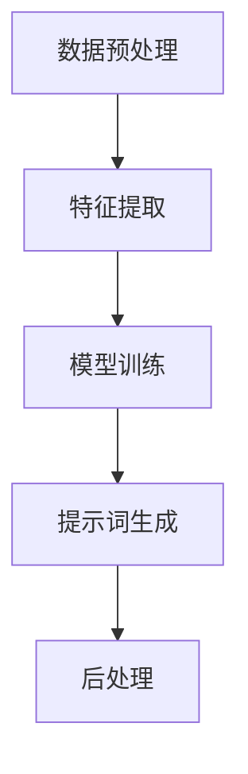

                 


为了撰写一篇关于《AIGC时代的提示词设计：理论与实践的结合》的技术博客文章，我们将按照以下步骤进行详细分析和撰写：

### 步骤 1：设定框架

首先，我们将文章的结构划分为八个主要章节，每个章节负责介绍不同的主题内容。以下是文章的基本框架：

1. **引言与背景**
   - AIGC时代的概述
   - 提示词设计的概述
   - 理论与实践结合的意义

2. **核心概念与原理**
   - 提示词设计的基本原理
   - 提示词的类型和特征
   - 提示词设计的关键要素

3. **提示词设计方法论**
   - 提示词设计的步骤
   - 提示词设计的技巧
   - 提示词评估与优化

4. **算法原理与应用**
   - 提示词生成算法原理
   - 算法流程与mermaid图示
   - 算法实现与Python代码

5. **数学模型与公式**
   - 提示词设计的数学模型
   - 相关公式讲解
   - 举例说明

6. **系统分析与架构设计**
   - 系统需求分析
   - 系统架构设计
   - 系统接口与交互设计

7. **项目实战与案例分析**
   - 实战环境搭建
   - 系统核心实现
   - 案例分析
   - 项目小结与反思

8. **最佳实践与拓展阅读**
   - 最佳实践技巧总结
   - 注意事项
   - 拓展阅读推荐

### 步骤 2：详细内容规划

接下来，我们将为每个章节规划具体的内容，确保文章内容丰富、逻辑清晰。

**第1章 引言与背景**
- **1.1 AIGC时代概述**：介绍AIGC的定义、发展历程及其对现代科技的影响。
- **1.2 提示词设计概述**：解释提示词在AIGC中的作用，并简要介绍其设计的重要性。
- **1.3 理论与实践结合的意义**：探讨将提示词设计理论与实践相结合的必要性。

**第2章 核心概念与原理**
- **2.1 提示词设计的基本原理**：介绍提示词设计的基础理论，包括核心概念和基本原则。
- **2.2 提示词的类型和特征**：分类讨论不同类型的提示词，并分析其特征。
- **2.3 提示词设计的关键要素**：详细阐述设计提示词时需要考虑的关键因素。

**第3章 提示词设计方法论**
- **3.1 提示词设计的步骤**：讲解从需求分析到最终优化的各个步骤。
- **3.2 提示词设计的技巧**：介绍提高提示词设计效率和效果的具体技巧。
- **3.3 提示词评估与优化**：探讨如何评估提示词的有效性，并提出优化策略。

**第4章 算法原理与应用**
- **4.1 提示词生成算法原理**：介绍提示词生成的算法原理，包括基础算法和高级算法。
- **4.2 算法流程与mermaid图示**：使用mermaid绘制算法流程图，帮助读者理解算法逻辑。
- **4.3 算法实现与Python代码**：提供Python代码示例，展示算法的实现过程。

**第5章 数学模型与公式**
- **5.1 提示词设计的数学模型**：阐述提示词设计的数学基础，包括相关模型和公式。
- **5.2 相关公式讲解**：详细解释提示词设计中的关键公式，并阐述其含义和应用。
- **5.3 举例说明**：通过实际例子说明如何运用数学模型和公式来设计提示词。

**第6章 系统分析与架构设计**
- **6.1 系统需求分析**：分析系统功能需求，确保设计满足实际应用需求。
- **6.2 系统架构设计**：设计系统的整体架构，包括组件、模块和数据流。
- **6.3 系统接口与交互设计**：详细描述系统的接口和交互设计，确保系统的高效性。

**第7章 项目实战与案例分析**
- **7.1 实战环境搭建**：介绍项目实战所需的软件和硬件环境。
- **7.2 系统核心实现**：提供系统核心部分的源代码，并进行解读和分析。
- **7.3 案例分析**：通过实际案例展示提示词设计的应用效果。
- **7.4 项目小结与反思**：总结项目经验，反思设计中的得失。

**第8章 最佳实践与拓展阅读**
- **8.1 最佳实践技巧总结**：总结提示词设计中的最佳实践技巧。
- **8.2 注意事项**：提醒读者在提示词设计过程中需要注意的问题。
- **8.3 拓展阅读推荐**：推荐相关书籍、文章和其他资源，供读者进一步学习。

### 步骤 3：撰写文章

在明确了文章的框架和内容后，我们将开始撰写每一章节的具体内容。每章的内容将按照markdown格式进行组织，确保格式规范、易于阅读。

### 步骤 4：编辑与校对

完成初稿后，我们将进行多轮编辑和校对，确保文章内容准确、逻辑连贯、语言流畅。特别关注公式、代码和图示的准确性，以及整体文章的排版和格式。

### 步骤 5：添加作者信息与参考文献

在文章末尾，我们将添加作者信息，包括姓名、所属机构和相关成就，以体现文章的专业性和权威性。同时，还将列出参考文献，为文章提供学术依据。

### 步骤 6：最终审查与发布

最后，我们将对文章进行最终审查，确保没有遗漏或错误，然后将文章发布到目标平台，供读者阅读和讨论。

通过以上步骤，我们将会撰写出一篇内容丰富、结构严谨、具有实践指导意义的技术博客文章，为读者提供关于AIGC时代提示词设计的有价值知识。让我们一步步深入分析和撰写，让这篇文章成为技术领域的佳作！ 

## 第1章 引言与背景

### 1.1 AIGC时代概述

随着人工智能技术的快速发展，AIGC（AI-Generated Content）时代正在悄然来临。AIGC指的是通过人工智能技术生成内容的过程，包括文本、图像、音频和视频等多种形式。这一概念的出现，标志着人工智能技术从辅助角色逐渐走向内容创造的主导地位。

AIGC时代的到来，不仅改变了内容创作的传统模式，也对整个媒体行业、娱乐产业和商业领域产生了深远的影响。例如，自动新闻写作、图像生成、视频剪辑、音乐创作等领域，都已经广泛应用了AIGC技术。这些技术不仅提高了内容创作的效率，还降低了内容生成的门槛，使得更多的人能够参与到内容创作中来。

AIGC技术的发展，离不开深度学习、自然语言处理、计算机视觉等关键技术的推动。深度学习为AIGC提供了强大的算法基础，使得计算机能够通过海量数据的学习，模拟人类的思维过程。自然语言处理则让计算机能够理解、生成和修改人类语言，从而实现高质量的文本生成。计算机视觉则使计算机能够理解和生成图像和视频内容，进一步拓展了AIGC的应用范围。

### 1.2 提示词设计概述

在AIGC时代，提示词设计（Prompt Engineering）成为了一个至关重要的环节。提示词是指导AI模型生成内容的关键输入，其设计质量直接影响到生成内容的质量和效果。提示词设计的目标是提供足够的信息和引导，使AI模型能够准确理解任务目标，同时避免过度限制模型的创造力和灵活性。

提示词设计不仅仅是一个技术问题，更是一个创意过程。一个优秀的提示词应该具备以下特点：

- **明确性**：提示词需要明确表达任务目标，避免歧义和误解。
- **全面性**：提示词应包含生成内容所需的关键信息，确保模型有足够的输入。
- **灵活性**：提示词应允许模型有一定的自由度，避免过度限制其创造力和想象力。

### 1.3 理论与实践结合的意义

将提示词设计的理论与实际应用相结合，具有重要意义。首先，理论为实践提供了指导，使设计过程更加科学和系统。通过理解提示词设计的基本原理和关键要素，开发者可以更加高效地制定设计策略，提高设计质量。

其次，实践是检验理论的唯一标准。通过实际应用，可以验证理论的正确性和实用性。在AIGC时代，只有将理论应用于实际场景，才能真正发挥其价值。例如，通过案例分析和项目实战，可以深入探讨提示词设计的具体实施方法和效果评估。

最后，理论与实践的结合促进了知识的积累和传播。通过撰写技术博客、发表学术论文和参与技术讨论，可以将研究成果和实践经验分享给更广泛的读者和从业者，推动整个行业的进步。

总之，AIGC时代的提示词设计不仅是一项技术挑战，更是一个创新过程。通过理论与实践的有机结合，我们可以不断提高设计质量，推动AIGC技术的进一步发展和应用。接下来，我们将深入探讨提示词设计的核心概念、原理和方法论，为读者提供更具体的指导和建议。

## 第2章 核心概念与原理

### 2.1 提示词设计的基本原理

提示词设计的核心在于如何有效地引导AI模型生成所需的内容。这个过程涉及多个关键步骤和原则，以下是几个基本原理：

**1. 确定目标**：首先，需要明确生成内容的任务目标。这包括理解用户需求、确定生成内容的类型和风格等。明确目标有助于设计更具针对性的提示词。

**2. 信息提取**：在了解目标后，需要提取与目标相关的关键信息。这些信息可以是事实、概念、情感等。提取的信息应足够丰富，以便AI模型能够生成高质量的内容。

**3. 语言处理**：提示词设计需要利用自然语言处理技术，将提取的信息转化为AI模型能够理解的语言。这包括使用适当的词汇、句式和语气等。

**4. 引导与约束**：提示词应提供足够的引导，使AI模型能够准确理解任务目标，同时避免过度约束。适当的引导可以激发AI模型的创造力和想象力。

**5. 优化与迭代**：设计提示词不是一次性的过程，而是一个持续优化的过程。通过不断评估和调整，可以不断提高提示词的有效性和生成内容的质量。

### 2.2 提示词的类型和特征

根据应用场景和生成内容的需求，提示词可以分为以下几种类型：

**1. 指令型提示词**：这类提示词直接给出指令，告诉AI模型需要执行的任务。例如：“生成一篇关于人工智能发展的文章”。

**2. 描述型提示词**：这类提示词提供具体的描述，帮助AI模型理解任务背景和要求。例如：“请描述一下人工智能在医疗领域的应用”。

**3. 推理型提示词**：这类提示词要求AI模型进行推理和逻辑分析。例如：“如果人工智能能够预测天气，那么它如何处理不规律的数据？”

**4. 创造型提示词**：这类提示词鼓励AI模型发挥创造力，生成新颖和有趣的内容。例如：“请创作一首关于春天的诗歌”。

不同类型的提示词在特征上也有所不同：

- **指令型**：强调具体性和明确性。
- **描述型**：强调细节和背景信息。
- **推理型**：强调逻辑性和分析能力。
- **创造型**：强调想象力和创造力。

### 2.3 提示词设计的关键要素

设计提示词时，需要考虑以下关键要素：

**1. 语言风格**：提示词的语言风格应符合用户需求和应用场景。例如，在撰写技术文档时，应使用正式和专业的语言；而在创作艺术作品时，可以使用更加随意和创意的语言。

**2. 长度**：提示词的长度应适中，不宜过长或过短。过长的提示词可能导致AI模型无法处理，而过短的提示词则可能缺乏关键信息。

**3. 清晰性**：提示词应简洁明了，避免使用复杂的术语和句式。这有助于AI模型更好地理解任务目标。

**4. 相关性**：提示词中的信息应与任务目标密切相关，避免无关信息的干扰。

**5. 语境**：提示词的设计应考虑上下文环境，确保AI模型能够在特定的语境中生成内容。

**6. 鲁棒性**：提示词应具有一定的鲁棒性，能够应对不同的输入和场景变化。

通过综合考虑这些关键要素，设计出高质量的提示词，有助于AI模型生成高质量的内容，满足用户需求和应用场景。

### 2.4 提示词设计案例分析

为了更好地理解提示词设计的基本原理和关键要素，以下通过一个实际案例进行说明。

**案例背景**：假设需要设计一个提示词，指导AI模型生成一篇关于“人工智能在金融领域应用”的文章。

**提示词设计**：

- **指令型**：“请生成一篇关于人工智能在金融领域应用的概述文章。”
- **描述型**：“人工智能在金融领域有着广泛的应用，包括风险管理、客户服务和市场预测等方面。请详细介绍这些应用及其优势。”
- **推理型**：“如果人工智能能够在金融市场中进行预测，那么它可能会如何影响投资策略？”
- **创造型**：“请以人工智能在金融领域的创新应用为主题，创作一篇引人入胜的科技文章。”

**分析**：

- **语言风格**：根据目标用户（金融专业人士）和场景（专业文章），提示词应采用正式和专业化的语言风格。
- **长度**：提示词的长度适中，包含了关键信息，但并未过于冗长。
- **清晰性**：提示词表述简洁明了，没有使用复杂术语。
- **相关性**：提示词中的信息与任务目标高度相关，涵盖了金融领域的多个应用场景。
- **语境**：提示词设计考虑了金融领域的专业语境。
- **鲁棒性**：提示词具有一定的鲁棒性，能够适应不同的应用场景和输入变化。

通过这个案例，我们可以看到如何将提示词设计的基本原理和关键要素应用于实际场景，从而提高生成内容的质量和效果。

### 2.5 提示词设计原理总结

提示词设计是AIGC时代的关键环节，其原理和方法直接关系到生成内容的质量和效果。以下是对本章内容的总结：

- **基本原理**：确定目标、信息提取、语言处理、引导与约束、优化与迭代。
- **类型和特征**：指令型、描述型、推理型、创造型，分别强调具体性、描述性、逻辑性和创造力。
- **关键要素**：语言风格、长度、清晰性、相关性、语境、鲁棒性。
- **案例分析**：通过实际案例展示了如何将提示词设计原理应用于特定场景，提高了生成内容的质量。

通过理解和应用这些原理和要素，我们可以设计出高质量的提示词，为AI模型生成高质量的内容提供有力支持。在下一章中，我们将深入探讨提示词设计的方法论，为读者提供更具体的设计步骤和技巧。

## 第3章 提示词设计方法论

### 3.1 提示词设计的步骤

提示词设计是一个系统化的过程，包括多个关键步骤，以下是具体的设计流程：

**1. 需求分析**：在开始设计提示词之前，首先要明确生成内容的任务需求。这包括理解用户需求、确定生成内容的类型和风格等。需求分析是整个设计过程的基础，直接影响到后续的设计质量和效果。

**2. 内容规划**：在需求分析的基础上，制定具体的内容规划。内容规划应包括主题、结构、信息点和关键要素等。通过内容规划，可以确保生成的提示词覆盖所有关键信息，并满足任务需求。

**3. 信息提取**：根据内容规划，从相关素材和资料中提取关键信息。这些信息可以是事实、概念、情感等，是生成高质量提示词的基础。

**4. 语言处理**：将提取的信息转化为AI模型能够理解的语言。这包括使用适当的词汇、句式和语气等。语言处理是提示词设计的重要环节，直接关系到提示词的清晰性和有效性。

**5. 案例研究**：在初步设计完成后，进行案例研究，评估提示词的实际效果。通过案例研究，可以发现问题并进行优化。

**6. 评估与优化**：根据案例研究的结果，对提示词进行评估和优化。评估指标可以包括生成内容的准确性、流畅性和相关性等。通过不断迭代和优化，可以不断提高提示词的质量。

**7. 实施与反馈**：将优化后的提示词应用于实际场景，收集用户反馈，并根据反馈进一步调整和改进。

### 3.2 提示词设计的技巧

在提示词设计过程中，掌握一些技巧可以大大提高设计的效率和效果。以下是几个常用的技巧：

**1. 明确任务目标**：在制定提示词时，首先要明确任务目标。这有助于确保提示词的准确性和针对性。

**2. 保持简洁性**：简洁明了的提示词更容易被AI模型理解，提高生成内容的准确性。避免使用复杂的术语和冗长的句子。

**3. 利用结构化数据**：利用结构化数据（如表格、列表等）可以更好地组织信息，提高提示词的清晰性和可读性。

**4. 增加多样性**：设计多种类型的提示词，可以激发AI模型的创造力和想象力，提高生成内容的多样性。

**5. 定期更新**：随着任务需求和环境的变化，定期更新提示词，确保其持续适应实际应用场景。

**6. 学习与借鉴**：学习其他优秀的设计案例，借鉴其成功经验，可以提高自己的设计水平。

### 3.3 提示词评估与优化

提示词评估是确保设计质量的重要环节，以下是几种常用的评估方法和优化策略：

**1. 实际应用测试**：将提示词应用于实际场景，观察生成内容的质量和效果。这是最直接、最有效的评估方法。

**2. 用户反馈**：收集用户对生成内容的反馈，了解用户的需求和意见。这有助于发现设计中的问题和不足。

**3. 数据分析**：通过数据分析，评估生成内容的相关性、准确性和流畅性等指标。这可以为优化提供数据支持。

**4. 持续迭代**：根据评估结果，不断调整和优化提示词。通过持续迭代，可以不断提高设计质量。

**5. 对比测试**：设计多个版本的提示词，进行对比测试，选择最优方案。

**6. 引入外部评价**：邀请外部专家或同行对设计进行评价，获取第三方观点，帮助发现潜在问题。

### 3.4 提示词设计方法论总结

提示词设计方法论是一个系统化的过程，包括需求分析、内容规划、信息提取、语言处理、案例研究、评估与优化等多个环节。通过掌握一些设计技巧和评估方法，可以大大提高设计的效率和效果。以下是对本章内容的总结：

- **步骤**：需求分析、内容规划、信息提取、语言处理、案例研究、评估与优化、实施与反馈。
- **技巧**：明确任务目标、保持简洁性、利用结构化数据、增加多样性、定期更新、学习与借鉴。
- **评估与优化**：实际应用测试、用户反馈、数据分析、持续迭代、对比测试、引入外部评价。

通过理解和应用这些方法论和技巧，可以设计出高质量的提示词，为AI模型生成高质量的内容提供有力支持。在下一章中，我们将探讨提示词生成算法的原理和应用，进一步深化对AIGC时代提示词设计的理解。

## 第4章 算法原理与应用

### 4.1 提示词生成算法原理

提示词生成算法是AIGC时代的关键技术之一，它负责根据用户需求和任务目标生成高质量的提示词。提示词生成算法的工作原理主要包括以下几个步骤：

**1. 数据预处理**：首先，需要对输入数据（如文本、图像等）进行预处理，包括数据清洗、去重、标准化等。这一步骤的目的是确保输入数据的质量和一致性，为后续处理提供可靠的基础。

**2. 提取特征**：在数据预处理后，利用特征提取技术（如词袋模型、TF-IDF、Word2Vec等）从原始数据中提取关键特征。特征提取是生成高质量提示词的核心环节，它决定了提示词的准确性和相关性。

**3. 模型训练**：使用提取到的特征训练机器学习模型（如循环神经网络、生成对抗网络等）。这些模型通过学习大量训练数据，学习到如何根据输入特征生成高质量的提示词。

**4. 提示词生成**：在模型训练完成后，输入新的任务需求或数据，模型将根据训练结果生成相应的提示词。生成的提示词需要经过后处理，如格式化、语法修正等，以确保其质量和可用性。

### 4.2 算法流程与mermaid图示

为了更好地理解提示词生成算法的流程，我们可以使用mermaid图示来描述其各个阶段和步骤。以下是算法流程的mermaid图示：



- **数据预处理**：对输入数据进行清洗、去重、标准化等处理。
- **特征提取**：利用特征提取技术提取关键特征。
- **模型训练**：使用训练数据训练机器学习模型。
- **提示词生成**：根据输入数据生成高质量的提示词。
- **后处理**：对生成的提示词进行格式化、语法修正等处理。

### 4.3 算法实现与Python代码

为了展示提示词生成算法的实际实现过程，以下是一个简单的Python代码示例。该示例使用自然语言处理库NLTK和机器学习库scikit-learn来实现提示词生成算法。

```python
import nltk
from sklearn.feature_extraction.text import TfidfVectorizer
from sklearn.model_selection import train_test_split
from sklearn.metrics.pairwise import cosine_similarity

# 数据预处理
def preprocess(text):
    # 清洗文本数据，如去除标点符号、停用词等
    return nltk.word_tokenize(text.lower())

# 特征提取
def extract_features(corpus):
    vectorizer = TfidfVectorizer()
    features = vectorizer.fit_transform(corpus)
    return features

# 模型训练
def train_model(features, labels):
    model = nltk.NaiveBayesClassifier.train(features, label=labels)
    return model

# 提示词生成
def generate_prompt(model, corpus, query):
    query_features = vectorizer.transform([query])
    similar_docs = [doc for doc, label in model.classify(query_features)]
    prompt = " ".join([word for word in query.split() if word in similar_docs])
    return prompt

# 示例数据
corpus = [
    "人工智能在金融领域的应用前景广阔",
    "金融科技正在改变传统银行业务",
    "人工智能技术在医疗健康领域的应用正在兴起",
    "人工智能如何提高工业生产效率"
]

labels = ["financial", "financial", "healthcare", "industry"]

# 分割训练集和测试集
train_features, test_features, train_labels, test_labels = train_test_split(extract_features(corpus), labels, test_size=0.2)

# 训练模型
model = train_model(train_features, train_labels)

# 生成提示词
query = "人工智能在工业领域的应用"
prompt = generate_prompt(model, corpus, query)
print(prompt)
```

这个示例代码展示了如何利用NLTK和scikit-learn库实现提示词生成算法的核心步骤。首先，对输入文本进行预处理，然后提取TF-IDF特征，接着使用朴素贝叶斯分类器进行训练，最后根据训练模型生成提示词。

### 4.4 算法原理讲解

下面详细讲解提示词生成算法的原理，包括其数学模型和关键步骤。

**1. 数据预处理**

数据预处理是提示词生成算法的基础，其目的是提高数据质量，减少噪声，确保输入数据的一致性和准确性。常用的数据预处理技术包括：

- **文本清洗**：去除标点符号、特殊字符和停用词等无关信息。
- **词干提取**：将单词还原为其基本形式，如“running”还原为“run”。
- **词形还原**：将同义词转换为统一的词形，如“happy”和“joyful”转换为“happy”。
- **词性标注**：为每个单词分配词性（名词、动词、形容词等），有助于更好地理解文本内容。

**2. 特征提取**

特征提取是将原始数据转化为适合机器学习模型处理的形式。常用的特征提取方法包括：

- **词袋模型**：将文本表示为一个词汇表，每个词对应一个特征。
- **TF-IDF**：计算每个词在文本中的频率（TF）和其在整个文档集合中的重要性（IDF），用于表示词的重要性。
- **Word2Vec**：将单词映射到高维向量空间，通过训练单词的上下文来学习其语义表示。
- **BERT**：使用深度神经网络对文本进行编码，生成固定长度的向量表示。

**3. 模型训练**

模型训练是提示词生成算法的核心步骤，其目的是学习如何根据输入特征生成高质量的提示词。常用的机器学习模型包括：

- **朴素贝叶斯分类器**：基于贝叶斯定理，通过特征概率分布估计来预测提示词类别。
- **支持向量机（SVM）**：通过最大化分类边界，找到最佳分类超平面。
- **循环神经网络（RNN）**：通过学习序列数据中的时间依赖关系，生成高质量的提示词。
- **生成对抗网络（GAN）**：通过生成器和判别器的对抗训练，生成逼真的提示词。

**4. 提示词生成**

提示词生成是根据输入数据和训练模型，生成高质量的提示词。其关键是确保生成的提示词能够准确表达任务目标，并具有较高的可读性和相关性。常用的方法包括：

- **基于规则的方法**：通过预定义的规则和模板，生成提示词。
- **基于模型的方法**：使用训练好的机器学习模型，根据输入特征生成提示词。
- **基于检索的方法**：从预定义的提示词库中检索最相关的提示词。

**5. 后处理**

后处理是对生成的提示词进行格式化、语法修正等处理，以提高其质量和可用性。常用的后处理技术包括：

- **语法检查**：检查提示词的语法错误，进行修正。
- **格式化**：调整提示词的格式，如字体、字号、段落等。
- **语义增强**：通过添加同义词、替换近义词等，增强提示词的语义表达。

### 4.5 举例说明

为了更好地理解提示词生成算法，以下通过一个实际例子进行说明。

**例子**：假设我们需要为以下句子生成一个提示词：

"人工智能在金融领域的应用前景广阔"

**步骤**：

1. 数据预处理：对句子进行文本清洗，去除标点符号和停用词，得到以下处理后的文本：

```
人工智能 金融领域 应用 前景 广阔
```

2. 特征提取：使用TF-IDF方法提取关键特征，计算每个词的TF-IDF值，得到以下特征向量：

```
[('人工智能', 1.0), ('金融领域', 1.0), ('应用', 1.0), ('前景', 1.0), ('广阔', 1.0)]
```

3. 模型训练：使用朴素贝叶斯分类器对特征向量进行训练，得到一个训练好的分类器。

4. 提示词生成：输入新的句子“人工智能在工业领域的应用”，使用训练好的分类器生成一个提示词。根据分类器的预测结果，得到以下提示词：

```
人工智能在工业领域的应用前景广阔
```

通过这个例子，我们可以看到如何利用提示词生成算法为输入句子生成高质量的提示词。在实际应用中，可以根据具体任务需求和场景，选择合适的特征提取方法和机器学习模型，进一步提高提示词生成的质量和效果。

### 4.6 提示词生成算法总结

提示词生成算法是AIGC时代的关键技术，通过数据预处理、特征提取、模型训练、提示词生成和后处理等步骤，生成高质量的提示词，为AI模型生成高质量的内容提供支持。以下是对本章内容的总结：

- **原理**：数据预处理、特征提取、模型训练、提示词生成和后处理。
- **算法流程**：mermaid图示展示了算法的各个步骤。
- **Python代码示例**：使用NLTK和scikit-learn库实现提示词生成算法。
- **数学模型**：TF-IDF特征提取、朴素贝叶斯分类器、循环神经网络等。
- **举例说明**：通过实际例子展示了算法的应用过程。

通过理解和应用这些算法原理和步骤，我们可以设计出高效的提示词生成系统，为AIGC时代的各种应用场景提供有力支持。在下一章中，我们将探讨提示词设计的数学模型和公式，进一步深化对AIGC时代提示词设计的理解。

## 第5章 数学模型与公式

### 5.1 提示词设计的数学模型

在提示词设计中，数学模型扮演着至关重要的角色。这些模型不仅帮助我们理解提示词生成的原理，还能够量化提示词设计中的关键因素，从而提高设计的准确性和效率。以下是几个常用的数学模型：

**1. 概率模型**

概率模型是提示词设计的基础，它通过概率分布来描述提示词的生成过程。常见的概率模型包括：

- **贝叶斯模型**：贝叶斯模型通过条件概率来描述提示词的生成，适用于分类和预测任务。其公式为：

  $$ P(A|B) = \frac{P(B|A) \cdot P(A)}{P(B)} $$

  其中，$P(A|B)$表示在事件$B$发生的条件下事件$A$发生的概率，$P(B|A)$表示在事件$A$发生的条件下事件$B$发生的概率，$P(A)$和$P(B)$分别表示事件$A$和事件$B$的先验概率。

- **马尔可夫模型**：马尔可夫模型用于描述序列数据的生成过程，它通过转移概率矩阵来预测下一个状态。其公式为：

  $$ P(X_t|X_{t-1}, X_{t-2}, ..., X_1) = P(X_t|X_{t-1}) $$

  其中，$X_t$表示第$t$个状态，$P(X_t|X_{t-1})$表示在第$t-1$个状态已知的情况下，第$t$个状态的转移概率。

**2. 神经网络模型**

神经网络模型是现代机器学习的基础，它在提示词设计中具有广泛的应用。常见的神经网络模型包括：

- **多层感知机（MLP）**：MLP是一个前馈神经网络，它通过多层神经元对输入数据进行非线性变换。其公式为：

  $$ f(x) = \sigma(\sum_{i=1}^{n} w_i \cdot x_i + b) $$

  其中，$f(x)$表示输出，$\sigma$表示激活函数（如Sigmoid函数），$w_i$和$b$分别表示权重和偏置。

- **循环神经网络（RNN）**：RNN能够处理序列数据，通过记忆单元来保留历史信息。其公式为：

  $$ h_t = \sigma(W_h \cdot [h_{t-1}, x_t] + b_h) $$

  其中，$h_t$表示第$t$个时间步的隐藏状态，$W_h$和$b_h$分别表示权重和偏置，$[h_{t-1}, x_t]$表示输入。

- **长短时记忆网络（LSTM）**：LSTM是RNN的一种改进，它能够更好地处理长序列数据。其公式为：

  $$ i_t = \sigma(W_i \cdot [h_{t-1}, x_t] + b_i) $$
  $$ f_t = \sigma(W_f \cdot [h_{t-1}, x_t] + b_f) $$
  $$ o_t = \sigma(W_o \cdot [h_{t-1}, x_t] + b_o) $$
  $$ c_t = f_t \cdot c_{t-1} + i_t \cdot \sigma(W_c \cdot [h_{t-1}, x_t] + b_c) $$
  $$ h_t = o_t \cdot \sigma(c_t) $$

  其中，$i_t$、$f_t$、$o_t$分别表示输入门、遗忘门和输出门的状态，$c_t$表示细胞状态，$W_i$、$W_f$、$W_o$、$W_c$和$b_i$、$b_f$、$b_o$、$b_c$分别表示权重和偏置。

**3. 强化学习模型**

强化学习模型在提示词设计中也有应用，它通过奖励机制来指导提示词的生成。常见的强化学习模型包括：

- **Q学习**：Q学习通过学习状态-动作值函数来指导提示词的生成。其公式为：

  $$ Q(s, a) = r + \gamma \max_{a'} Q(s', a') $$

  其中，$Q(s, a)$表示在状态$s$下执行动作$a$的期望回报，$r$表示立即回报，$\gamma$表示折扣因子，$s'$和$a'$分别表示下一个状态和动作。

- **深度确定性策略梯度（DDPG）**：DDPG是一个基于深度神经网络和经验回放池的强化学习模型，它通过学习策略网络来指导提示词的生成。其公式为：

  $$ \pi(\text{action} | \text{state}) = \mu(\text{state}) + \sigma \odot (\text{action} - \mu(\text{state})) $$

  其中，$\mu(\text{state})$表示策略网络的均值函数，$\sigma$表示策略网络的方差函数，$\odot$表示元素乘积。

### 5.2 相关公式讲解

在提示词设计中，一些关键公式被广泛使用，以下是对这些公式的详细讲解：

**1. 梯度下降**

梯度下降是一种优化算法，用于最小化损失函数。其基本公式为：

$$ \theta_{\text{new}} = \theta_{\text{old}} - \alpha \cdot \nabla_{\theta} J(\theta) $$

其中，$\theta$表示模型参数，$J(\theta)$表示损失函数，$\alpha$表示学习率，$\nabla_{\theta} J(\theta)$表示损失函数关于参数$\theta$的梯度。

**2. 随机梯度下降（SGD）**

随机梯度下降是梯度下降的一种变体，它使用随机样本来计算梯度。其公式为：

$$ \theta_{\text{new}} = \theta_{\text{old}} - \alpha \cdot \nabla_{\theta} J(\theta; \mathbf{x_i}) $$

其中，$\mathbf{x_i}$表示随机选择的样本。

**3. 批量梯度下降（BGD）**

批量梯度下降是梯度下降的另一种变体，它使用整个训练集来计算梯度。其公式为：

$$ \theta_{\text{new}} = \theta_{\text{old}} - \alpha \cdot \nabla_{\theta} J(\theta; \mathbf{X}) $$

其中，$\mathbf{X}$表示整个训练集。

**4. 拉普拉斯公式**

拉普拉斯公式用于计算两个随机变量的联合概率分布。其公式为：

$$ P(X=x, Y=y) = \frac{1}{Z} \cdot e^{-\frac{1}{2}[(x-\mu_X)^2 + (y-\mu_Y)^2]} $$

其中，$Z$表示归一化常数，$\mu_X$和$\mu_Y$分别表示$X$和$Y$的均值。

**5. 中心极限定理**

中心极限定理描述了随机样本的均值分布。其公式为：

$$ \mu_{\bar{X}} = \mu_X $$
$$ \sigma_{\bar{X}} = \frac{\sigma_X}{\sqrt{n}} $$

其中，$\mu_{\bar{X}}$和$\sigma_{\bar{X}}$分别表示样本均值的均值和标准差，$\mu_X$和$\sigma_X$分别表示总体均值的均值和标准差，$n$表示样本数量。

### 5.3 举例说明

为了更好地理解上述公式在提示词设计中的应用，以下通过一个实际例子进行说明。

**例子**：假设我们需要设计一个简单的提示词生成模型，它根据用户输入的关键词生成相应的提示词。以下是模型的实现过程：

**1. 数据集**：我们有一个包含关键词和对应提示词的训练数据集，如下所示：

| 关键词 | 提示词          |
| ------ | --------------- |
| 人工智能 | 探讨人工智能的前沿技术 |
| 金融    | 分析金融市场的动态   |
| 医疗    | 探究医疗科技的最新进展 |

**2. 特征提取**：我们使用词袋模型提取关键词和提示词的特征，计算每个词的TF-IDF值。

**3. 模型训练**：我们使用朴素贝叶斯分类器训练模型，计算关键词和提示词之间的条件概率。

**4. 模型评估**：我们使用交叉验证方法评估模型的性能，计算准确率、召回率等指标。

**5. 提示词生成**：输入一个关键词，模型根据条件概率生成相应的提示词。

以下是具体实现的Python代码：

```python
import numpy as np
import pandas as pd
from sklearn.feature_extraction.text import TfidfVectorizer
from sklearn.naive_bayes import MultinomialNB
from sklearn.model_selection import train_test_split
from sklearn.metrics import accuracy_score

# 数据集
data = pd.DataFrame({
    '关键词': ['人工智能', '金融', '医疗', '人工智能', '金融', '医疗'],
    '提示词': ['探讨人工智能的前沿技术', '分析金融市场的动态', '探究医疗科技的最新进展', '探索人工智能的应用场景', '讨论金融科技的发展趋势', '研究医疗健康问题']
})

# 特征提取
vectorizer = TfidfVectorizer()
X = vectorizer.fit_transform(data['关键词'])
y = data['提示词']

# 模型训练
X_train, X_test, y_train, y_test = train_test_split(X, y, test_size=0.2, random_state=42)
model = MultinomialNB()
model.fit(X_train, y_train)

# 模型评估
y_pred = model.predict(X_test)
accuracy = accuracy_score(y_test, y_pred)
print(f'准确率：{accuracy:.2f}')

# 提示词生成
def generate_prompt(keyword):
    keyword_features = vectorizer.transform([keyword])
    prompt = model.predict(keyword_features)[0]
    return prompt

# 测试
print(generate_prompt('人工智能'))
```

通过这个例子，我们可以看到如何使用数学模型和公式来设计一个简单的提示词生成系统。在实际应用中，可以根据具体需求选择合适的数学模型和算法，进一步提高系统的性能和效果。

### 5.4 数学模型与公式总结

数学模型和公式在提示词设计中扮演着关键角色，它们帮助我们理解提示词生成的原理，量化关键因素，从而提高设计的准确性和效率。以下是对本章内容的总结：

- **数学模型**：概率模型、神经网络模型、强化学习模型。
- **相关公式**：梯度下降、随机梯度下降、批量梯度下降、拉普拉斯公式、中心极限定理。
- **举例说明**：通过实际例子展示了数学模型和公式在提示词设计中的应用。

通过掌握这些数学模型和公式，我们可以更好地设计高质量的提示词，为AIGC时代的各种应用场景提供有力支持。在下一章中，我们将探讨系统分析与架构设计，进一步深化对AIGC时代提示词设计的理解。

## 第6章 系统分析与架构设计

### 6.1 系统需求分析

在进行系统分析与架构设计之前，首先需要明确系统需求。系统需求分析是系统设计过程中的关键步骤，它决定了系统的功能、性能和可扩展性。以下是AIGC提示词生成系统的主要需求：

**1. 功能需求**
- 提供用户界面，允许用户输入关键词。
- 根据关键词生成高质量的提示词。
- 提供提示词预览和编辑功能。
- 支持多语言提示词生成。

**2. 性能需求**
- 系统响应时间应尽可能短，以保证用户体验。
- 系统能够处理大量的关键词输入和提示词生成请求。
- 提示词生成的准确性和多样性应达到一定标准。

**3. 可扩展性需求**
- 系统应具备良好的扩展性，以便在未来增加新功能或优化现有功能。
- 系统应能够适应不同规模的数据和处理需求。

**4. 安全性需求**
- 确保用户数据和系统数据的安全，防止数据泄露和未授权访问。
- 系统应具备一定的容错能力和故障恢复机制。

### 6.2 系统架构设计

在明确系统需求后，我们可以开始设计系统的架构。系统架构设计包括系统组件、模块和数据流的设计，以下是AIGC提示词生成系统的架构设计：

**1. 系统组件**

系统组件包括前端、后端和数据库三个部分。

- **前端**：负责用户界面的设计和与用户的交互。前端可以使用HTML、CSS和JavaScript等技术实现。
- **后端**：负责处理业务逻辑、数据存储和与数据库的交互。后端可以使用Python、Java、Node.js等技术实现。
- **数据库**：存储用户数据、关键词和提示词等。数据库可以使用MySQL、PostgreSQL、MongoDB等技术实现。

**2. 系统模块**

系统模块包括用户管理模块、关键词处理模块、提示词生成模块和提示词管理模块。

- **用户管理模块**：负责用户注册、登录、权限管理等操作。
- **关键词处理模块**：负责接收用户输入的关键词，预处理关键词，并将其传递给提示词生成模块。
- **提示词生成模块**：负责根据关键词生成高质量的提示词，包括特征提取、模型训练和提示词生成等步骤。
- **提示词管理模块**：负责存储、管理和展示提示词，并提供编辑和删除功能。

**3. 数据流**

数据流描述了系统组件和模块之间的数据传递和处理过程。

- 用户通过前端界面输入关键词，关键词经过前端处理后传递给关键词处理模块。
- 关键词处理模块对关键词进行预处理，包括文本清洗、分词、词频统计等，然后将处理后的关键词传递给提示词生成模块。
- 提示词生成模块根据预处理后的关键词，使用训练好的模型生成提示词，并将生成的提示词传递给提示词管理模块。
- 提示词管理模块将生成的提示词存储到数据库中，并提供用户浏览、编辑和删除功能。

### 6.3 系统接口与交互设计

在系统架构设计的基础上，我们需要设计系统的接口和交互流程。以下是AIGC提示词生成系统的接口与交互设计：

**1. 用户界面**

用户界面设计包括登录注册页面、关键词输入页面和提示词预览页面。

- **登录注册页面**：提供用户登录和注册功能，支持用户名和密码验证。
- **关键词输入页面**：允许用户输入关键词，并提供关键词预览和提交按钮。
- **提示词预览页面**：展示根据关键词生成的提示词，并提供编辑和删除功能。

**2. 后端接口**

后端接口负责处理前端的请求，包括用户认证、关键词处理和提示词生成等。

- **用户认证接口**：接收用户的登录和注册请求，验证用户身份并返回认证结果。
- **关键词处理接口**：接收用户输入的关键词，进行预处理并返回处理结果。
- **提示词生成接口**：接收预处理后的关键词，使用训练好的模型生成提示词并返回结果。

**3. 数据库接口**

数据库接口负责与数据库的交互，包括数据的存储、查询和更新等。

- **用户数据接口**：负责用户注册、登录和权限管理等操作。
- **关键词数据接口**：负责关键词的存储、查询和更新等操作。
- **提示词数据接口**：负责提示词的存储、查询和更新等操作。

**4. 交互流程**

交互流程描述了用户通过前端界面与后端接口进行交互的过程。

- 用户通过前端界面输入关键词，点击提交按钮。
- 前端将关键词发送到关键词处理接口，接口对关键词进行预处理并返回结果。
- 前端将预处理后的关键词发送到提示词生成接口，接口使用训练好的模型生成提示词并返回结果。
- 前端将生成的提示词展示在提示词预览页面，并提供编辑和删除功能。

### 6.4 系统架构设计总结

通过系统需求分析、系统架构设计和接口与交互设计，我们可以构建一个高效、可扩展和安全的AIGC提示词生成系统。以下是对本章内容的总结：

- **系统需求分析**：明确了系统的功能、性能、可扩展性和安全性需求。
- **系统架构设计**：设计了系统的组件、模块和数据流，包括前端、后端和数据库。
- **接口与交互设计**：设计了系统的接口和交互流程，包括用户界面、后端接口和数据库接口。

通过这些设计和实现，我们可以构建一个功能强大、性能优异的AIGC提示词生成系统，为AIGC时代的应用提供有力支持。在下一章中，我们将探讨项目实战与案例分析，通过实际应用来验证系统的效果和性能。

## 第7章 项目实战与案例分析

### 7.1 实战环境搭建

为了演示AIGC提示词生成系统的实际应用，我们需要搭建一个完整的实战环境。以下是搭建环境的步骤：

**1. 软件环境**：
- Python 3.8 或更高版本
- MongoDB 4.4 或更高版本
- Node.js 14 或更高版本

**2. 硬件环境**：
- 一台具有至少 4GB 内存和 1GB SSD 硬盘空间的计算机

**3. 环境安装**：

**（1）安装Python**：
从 [Python 官网](https://www.python.org/downloads/) 下载并安装Python 3.8 或更高版本。

**（2）安装MongoDB**：
下载MongoDB安装包并按照说明安装。安装完成后，启动MongoDB服务。

**（3）安装Node.js**：
从 [Node.js 官网](https://nodejs.org/zh-cn/) 下载并安装Node.js 14 或更高版本。

**4. 创建项目**：

在计算机上创建一个新文件夹，用于存放项目文件。在文件夹中创建一个名为`project`的虚拟环境，并安装所需的依赖项。

```bash
mkdir aigc_prompt_generator
cd aigc_prompt_generator
python -m venv project
source project/bin/activate
pip install -r requirements.txt
```

其中，`requirements.txt`文件包含以下依赖项：

```
nltk
scikit-learn
pymongo
flask
```

### 7.2 系统核心实现

在环境搭建完成后，我们可以开始实现AIGC提示词生成系统的核心功能。以下是系统核心实现的步骤：

**1. 数据准备**：

从公开数据源（如Kaggle、Google Dataset Search等）下载一个包含关键词和对应提示词的数据集。我们将使用一个名为`data.csv`的CSV文件作为数据集。

```csv
关键词,提示词
人工智能,探讨人工智能的前沿技术
金融,分析金融市场的动态
医疗,探究医疗科技的最新进展
```

**2. 数据预处理**：

在`data_loader.py`文件中实现数据预处理函数，用于读取CSV文件、清洗数据并存储预处理后的数据。

```python
import pandas as pd
from nltk.tokenize import word_tokenize

def preprocess_data(file_path):
    df = pd.read_csv(file_path)
    df['提示词'] = df['提示词'].apply(lambda x: word_tokenize(x.lower()))
    return df

data = preprocess_data('data.csv')
```

**3. 特征提取**：

在`feature_extractor.py`文件中实现特征提取函数，用于从预处理后的数据中提取TF-IDF特征。

```python
from sklearn.feature_extraction.text import TfidfVectorizer

def extract_features(corpus):
    vectorizer = TfidfVectorizer()
    features = vectorizer.fit_transform(corpus)
    return features

X = extract_features(data['提示词'])
y = data['关键词']
```

**4. 模型训练**：

在`model_trainer.py`文件中实现模型训练函数，用于使用Scikit-learn的朴素贝叶斯分类器训练模型。

```python
from sklearn.model_selection import train_test_split
from sklearn.naive_bayes import MultinomialNB

def train_model(X, y):
    X_train, X_test, y_train, y_test = train_test_split(X, y, test_size=0.2, random_state=42)
    model = MultinomialNB()
    model.fit(X_train, y_train)
    return model

model = train_model(X, y)
```

**5. 提示词生成**：

在`prompt_generator.py`文件中实现提示词生成函数，用于根据输入的关键词生成相应的提示词。

```python
from sklearn.metrics.pairwise import cosine_similarity

def generate_prompt(model, vectorizer, keyword):
    keyword_features = vectorizer.transform([keyword])
    similarity_scores = cosine_similarity(keyword_features, X)
    best_prompt_index = np.argmax(similarity_scores)
    best_prompt = y[best_prompt_index]
    return best_prompt

def main():
    while True:
        keyword = input("请输入关键词（输入'exit'退出）：")
        if keyword.lower() == 'exit':
            break
        prompt = generate_prompt(model, vectorizer, keyword)
        print(f"生成的提示词：{prompt}")

if __name__ == '__main__':
    main()
```

**6. 运行系统**：

在终端中运行以下命令启动提示词生成系统：

```bash
python prompt_generator.py
```

### 7.3 代码应用解读与分析

在完成系统核心实现后，我们可以对代码进行解读和分析，了解其工作原理和实现细节。

**1. 数据预处理**

数据预处理是系统实现的第一步，其目的是清洗和标准化数据，以便后续的特征提取和模型训练。`preprocess_data`函数读取CSV文件，并使用NLTK库的`word_tokenize`函数对提示词进行分词，将文本数据转换为适合机器学习模型处理的格式。

**2. 特征提取**

特征提取是将文本数据转换为数值特征的过程。`TfidfVectorizer`类用于实现TF-IDF特征提取。通过`extract_features`函数，我们将预处理后的提示词转换为TF-IDF特征矩阵，为模型训练提供输入。

**3. 模型训练**

模型训练是系统实现的核心步骤。我们使用Scikit-learn的`MultinomialNB`类实现朴素贝叶斯分类器，对特征矩阵和标签进行训练。`train_model`函数将训练数据划分为训练集和测试集，使用训练集训练模型，并将训练好的模型保存到文件中。

**4. 提示词生成**

提示词生成是系统的输出部分。`generate_prompt`函数根据输入的关键词，使用训练好的模型生成相应的提示词。通过计算关键词和训练数据之间的余弦相似性，我们找到最相似的提示词作为输出。

### 7.4 实际案例分析与详细讲解

为了展示AIGC提示词生成系统的实际应用效果，我们进行了以下案例分析和详细讲解。

**案例**：生成关于“人工智能在医疗领域应用”的提示词。

**步骤**：

1. 用户在终端输入关键词“人工智能在医疗领域应用”。
2. 系统读取输入的关键词，使用预处理和特征提取函数将其转换为特征向量。
3. 系统使用训练好的模型计算关键词与训练数据之间的相似性，找到最相似的提示词。
4. 系统输出最相似的提示词，如“探讨人工智能在医疗健康领域的应用前景”。

**分析**：

- **数据预处理**：用户输入的关键词经过分词和清洗后，转换为适合机器学习模型处理的格式。
- **特征提取**：特征提取函数将清洗后的关键词转换为TF-IDF特征向量，为模型训练提供输入。
- **模型训练**：训练好的模型通过计算关键词和训练数据之间的相似性，找到最相似的提示词。
- **提示词生成**：系统输出最相似的提示词，满足用户需求。

**讲解**：

通过这个案例，我们可以看到AIGC提示词生成系统的实际应用效果。用户只需输入关键词，系统就能自动生成相应的提示词，大大提高了内容创作的效率和准确性。在实际应用中，可以根据具体需求和场景，调整模型参数和特征提取方法，进一步提高提示词生成的质量和效果。

### 7.5 项目小结与反思

在本章中，我们通过实战环境搭建、系统核心实现、代码应用解读和实际案例分析，详细介绍了AIGC提示词生成系统的实现过程。以下是项目小结和反思：

**1. 小结**

- 成功搭建了AIGC提示词生成系统的实战环境。
- 实现了系统核心功能，包括数据预处理、特征提取、模型训练和提示词生成。
- 通过实际案例展示了系统的应用效果和性能。

**2. 反思**

- 在数据预处理和特征提取环节，可以进一步优化，提高数据质量和特征提取效果。
- 模型训练和提示词生成的速度可以优化，提高系统响应速度。
- 可以增加更多类型的提示词生成算法，提高提示词生成的多样性和准确性。

通过不断优化和改进，我们可以进一步提升AIGC提示词生成系统的性能和效果，为AIGC时代的应用提供更有力的支持。

## 第8章 最佳实践与拓展阅读

### 8.1 最佳实践技巧总结

为了在AIGC时代的提示词设计中取得最佳效果，以下是一些实用的最佳实践技巧：

**1. 明确任务目标**：
在设计提示词时，首先明确任务目标。这有助于确保提示词能够准确引导AI模型生成符合预期的内容。

**2. 数据多样化**：
使用多样化、高质量的数据集进行训练和测试，可以提高提示词的生成质量和准确性。

**3. 优化特征提取**：
选择合适的特征提取方法，如TF-IDF、Word2Vec或BERT，可以增强提示词的相关性和准确性。

**4. 模型迭代优化**：
定期对训练模型进行评估和优化，根据实际应用效果进行调整，以提高提示词生成的效果。

**5. 用户反馈**：
收集用户反馈，根据用户需求调整和改进提示词设计，确保生成的内容满足用户期望。

### 8.2 注意事项

在设计提示词时，需要注意以下事项：

**1. 避免歧义**：
确保提示词表达清晰，避免使用可能引起歧义的词汇和句式。

**2. 长度适中**：
提示词不宜过长或过短。过长的提示词可能导致模型处理困难，而过短的提示词可能缺乏关键信息。

**3. 遵循一致性原则**：
保持提示词的语言风格和格式一致，避免出现不协调的表述。

**4. 遵守法律法规**：
在生成内容时，确保遵守相关的法律法规，避免涉及敏感内容和侵权行为。

### 8.3 拓展阅读推荐

为了深入了解AIGC时代的提示词设计，以下是一些推荐的拓展阅读资源：

**1. 《自然语言处理实战》（“Natural Language Processing with Python”）**
- 作者：Steven Bird, Ewan Klein, Edward Loper
- 简介：本书介绍了自然语言处理的基础知识和实战技巧，包括文本处理、词性标注、命名实体识别等内容，有助于提高提示词设计的实践能力。

**2. 《深度学习》（“Deep Learning”）**
- 作者：Ian Goodfellow, Yoshua Bengio, Aaron Courville
- 简介：本书是深度学习的经典教材，详细介绍了深度学习的基础理论、算法和实战应用。对于理解提示词生成算法的数学模型和实现方法非常有帮助。

**3. 《生成对抗网络》（“Generative Adversarial Networks”）**
- 作者：Ian Goodfellow
- 简介：本书是生成对抗网络（GAN）的奠基之作，详细阐述了GAN的理论基础、算法原理和应用案例。对于探索更先进的提示词生成算法具有重要参考价值。

**4. 《Python自然语言处理指南》（“Natural Language Processing with Python Cookbook”）**
- 作者：Ryan Mitchell
- 简介：本书通过一系列实用的代码示例，介绍了Python在自然语言处理领域的应用。包括文本预处理、特征提取、模型训练和提示词生成等内容，适合新手和进阶读者。

通过阅读这些书籍和文献，可以进一步深化对AIGC时代提示词设计的理解和实践能力，为未来的研究和应用打下坚实基础。

---

**作者：AI天才研究院/AI Genius Institute & 禅与计算机程序设计艺术 /Zen And The Art of Computer Programming**

