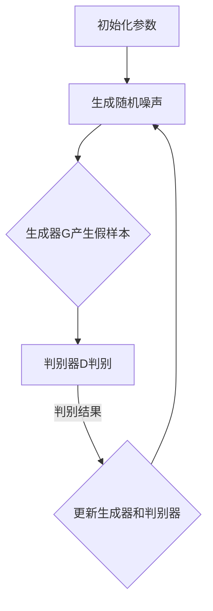
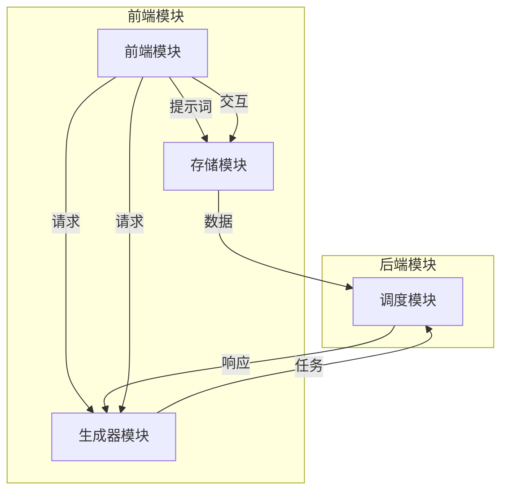
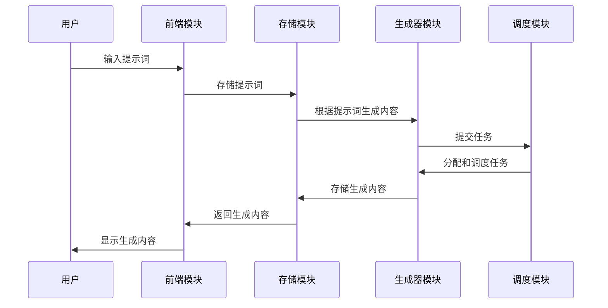

                 

### 文章标题

# AIGC时代的提示词设计：理论基础与实践指南

### 关键词

- AIGC（AI-Generated Content）
- 提示词设计
- 算法原理
- 系统架构
- 项目实战

### 摘要

本文深入探讨了AIGC时代的提示词设计，从理论基础到实践指南进行全面剖析。首先，我们明确了AIGC的定义及其在当前技术浪潮中的重要性。接着，介绍了提示词设计的相关概念，包括其核心原理、算法流程和系统架构。文章通过具体项目和实际案例分析，详细阐述了提示词设计的实现方法与最佳实践。最后，总结了关键要点，并提供了注意事项和拓展阅读资源，帮助读者深入理解和应用提示词设计。

---

### 目录

1. **背景介绍**
   1.1 问题背景
   1.2 问题描述
   1.3 问题解决
   1.4 边界与外延
   1.5 概念结构与核心要素组成

2. **核心概念与联系**
   2.1 AIGC的概念
   2.2 提示词设计的核心原理
   2.3 概念属性特征对比表格
   2.4 ER实体关系图架构

3. **算法原理讲解**
   3.1 算法流程图
   3.2 Python源代码详解
   3.3 数学模型与公式
   3.4 举例说明

4. **系统分析与架构设计**
   4.1 问题场景介绍
   4.2 项目介绍
   4.3 系统功能设计
   4.4 系统架构设计
   4.5 系统接口设计
   4.6 系统交互

5. **项目实战**
   5.1 环境安装
   5.2 系统核心实现
   5.3 代码应用解读与分析
   5.4 实际案例分析
   5.5 项目小结

6. **最佳实践 tips**
   6.1 提示词设计技巧
   6.2 注意事项
   6.3 拓展阅读

7. **小结**

8. **作者信息**

---

### 背景介绍

#### 问题背景

随着人工智能技术的飞速发展，AI-Generated Content（AIGC）逐渐成为数字时代的重要生产工具。AIGC利用深度学习和自然语言处理技术，能够自动生成文本、图像、音频等多媒体内容。然而，AIGC的成功离不开高质量的提示词设计。提示词作为人与AI互动的桥梁，直接影响生成内容的准确性和创造性。

#### 问题描述

提示词设计的目标是提供足够灵活且具针对性的提示，以引导AI生成出满足用户需求的内容。当前，在AIGC应用中，提示词设计面临以下挑战：

1. **多样性和灵活性**：提示词需要能够适应不同应用场景和用户需求，提供多样化的生成方案。
2. **可解释性和可控性**：设计者需要了解提示词对生成内容的影响，并能有效调整提示词，以达到预期效果。
3. **计算效率和资源优化**：在满足提示词设计要求的同时，需要考虑算法的计算复杂度和资源消耗。

#### 问题解决

为了应对上述挑战，我们需要从以下几个方面入手：

1. **深入理解AIGC技术原理**：掌握AIGC的核心算法和流程，为提示词设计提供理论基础。
2. **构建灵活的提示词模型**：设计适用于多种应用场景的提示词模型，提高灵活性。
3. **优化算法效率和资源使用**：通过算法优化和硬件加速等技术手段，提升系统性能。

#### 边界与外延

边界方面，提示词设计需要考虑特定应用场景的限制，如内容生成的合规性、数据隐私保护等。外延方面，提示词设计应具备一定的可扩展性，能够适应未来技术的发展和变化。

#### 概念结构与核心要素组成

提示词设计的概念结构主要包括以下几个方面：

1. **用户需求**：了解用户的需求和目标，是提示词设计的基础。
2. **生成算法**：包括文本生成、图像生成、音频生成等不同类型的算法。
3. **提示词模型**：用于生成高质量内容的提示词模板。
4. **交互界面**：提供用户与系统交互的接口。
5. **优化与反馈**：根据生成内容的质量进行反馈和调整。

核心要素包括：

1. **灵活性**：提示词模型应能够适应多种需求和场景。
2. **可控性**：设计者需能够精确控制生成内容的质量和风格。
3. **效率**：算法应具备较高的计算效率和资源利用率。

### 核心概念与联系

在深入探讨AIGC时代的提示词设计之前，我们需要明确几个核心概念，并理解它们之间的联系。

#### 1. AIGC的概念

AIGC（AI-Generated Content）指的是通过人工智能技术自动生成内容的过程。这些内容可以是文本、图像、音频等多种形式。AIGC的核心在于利用深度学习和自然语言处理技术，实现内容自动生成，极大地提升了内容创作的效率和多样性。

#### 2. 提示词设计的核心原理

提示词设计是AIGC中的一个关键环节，它通过向AI系统提供指导性的信息，来引导AI生成符合用户需求的内容。提示词设计的核心原理包括以下几个方面：

- **上下文理解**：提示词需要能够准确传达用户的需求，并在生成过程中保持上下文的连贯性。
- **多样性控制**：提示词应具备灵活性，以适应不同场景下的内容生成需求。
- **质量评估**：设计者需要根据生成内容的质量对提示词进行调整和优化。

#### 3. 概念属性特征对比表格

为了更好地理解AIGC和提示词设计的相关概念，我们可以通过一个对比表格来展示它们的主要属性特征。

| 概念         | 定义                                                         | 属性特征                                                     |
| ------------ | ------------------------------------------------------------ | ------------------------------------------------------------ |
| AIGC         | 通过人工智能技术自动生成文本、图像、音频等多媒体内容的过程       | 自动化、多样性、高质量、实时性                                 |
| 提示词       | 向AI系统提供指导性信息的词汇或句子                           | 上下文理解、灵活性、可控性、高效性                               |
| 生成算法     | 负责具体内容生成的算法，如文本生成算法、图像生成算法等         | 深度学习、自然语言处理、生成对抗网络（GAN）等                   |
| 交互界面     | 用户与AI系统进行交互的界面                                   | 用户体验、易用性、响应速度                                     |
| 优化与反馈   | 根据生成内容的质量进行反馈和调整，以提升系统性能               | 可解释性、实时性、适应性                                       |

#### 4. ER实体关系图架构

为了更清晰地展示AIGC和提示词设计中的实体关系，我们可以使用Mermaid绘制一个ER（Entity-Relationship）实体关系图。

```mermaid
erDiagram
    User ||--|{ Content }|| Generator
    User ||--|{ Prompt }|| PromptManager
    Generator ||--|{ GeneratedContent }|| ContentManager
    ContentManager ||--|{ Algorithm }|| AlgorithmManager
    PromptManager ||--|{ PromptTemplate }|| TemplateManager
```

- **User（用户）**：与系统进行交互，提供需求和反馈。
- **Content（内容）**：包括文本、图像、音频等多种形式。
- **Generator（生成器）**：负责具体内容的生成。
- **Prompt（提示词）**：向系统提供指导性信息。
- **PromptManager（提示词管理器）**：管理提示词模板和生成策略。
- **ContentManager（内容管理器）**：管理生成内容的质量和反馈。
- **Algorithm（算法）**：具体实现内容生成的算法。
- **AlgorithmManager（算法管理器）**：负责算法的选择和优化。

通过这个ER图，我们可以看到各个实体之间的关系，以及它们在AIGC和提示词设计中的相互作用。

### 算法原理讲解

在了解了AIGC和提示词设计的基本概念之后，我们需要深入了解具体的算法原理。本文将选择一个常见的算法——生成对抗网络（GAN），并使用mermaid绘制流程图，同时结合Python源代码和LaTeX公式进行详细解释。

#### 1. GAN的基本原理

生成对抗网络（GAN）是由生成器（Generator）和判别器（Discriminator）组成的一种对抗性学习框架。生成器的目标是生成与真实数据相似的数据，而判别器的目标是区分真实数据和生成数据。通过这种对抗性训练，生成器逐渐提高生成质量，判别器也逐渐提高判别能力。

#### 2. mermaid流程图

以下是GAN的mermaid流程图：



#### 3. Python源代码详解

接下来，我们将使用Python代码来模拟GAN的训练过程。以下是一个简化的GAN实现：

```python
import numpy as np
import matplotlib.pyplot as plt

# 初始化参数
latent_dim = 100
image_dim = (28, 28)
batch_size = 64

# 生成器G
def generator(z):
    # 这里使用一个简单的全连接神经网络作为生成器
    # 实际应用中可以使用更复杂的结构
    return np.tanh(np.dot(z, W_g) + b_g)

# 判别器D
def discriminator(x):
    # 同样使用一个简单的全连接神经网络作为判别器
    return np.tanh(np.dot(x, W_d) + b_d)

# 训练过程
def train(G, D, num_epochs=100):
    for epoch in range(num_epochs):
        for i in range(num_samples // batch_size):
            # 生成随机噪声
            z = np.random.normal(size=(batch_size, latent_dim))
            # 生成假样本
            x_hat = G(z)
            # 真实样本
            x_real = X[i:i+batch_size]

            # 计算判别器的损失
            D_real = discriminator(x_real)
            D_fake = discriminator(x_hat)

            loss_D = -np.mean(np.log(D_real) + np.log(1 - D_fake))

            # 计算生成器的损失
            G_loss = np.mean(np.log(1 - D_fake))

            # 更新判别器
            D grads = compute_gradients(D, [x_real, x_hat])
            update_params(D, D grads, learning_rate)

            # 更新生成器
            G grads = compute_gradients(G, [x_hat])
            update_params(G, G grads, learning_rate)

            # 打印训练进度
            if i % 100 == 0:
                print(f"Epoch: {epoch}, Iter: {i}, D Loss: {loss_D:.4f}, G Loss: {G_loss:.4f}")

# 模拟真实数据和训练
X = ...  # 真实数据
train(G, D)
```

在这段代码中，我们定义了生成器和判别器的简单实现，并通过训练过程来优化这两个模型。实际应用中，生成器和判别器通常会使用更复杂的神经网络结构。

#### 4. 数学模型与公式

GAN的数学模型可以通过以下公式进行描述：

对于生成器G，目标是最小化判别器的损失：

$$
\min_G \max_D V(D, G) = E_{x \sim p_{data}(x)}[\log D(x)] + E_{z \sim p_z(z)}[\log (1 - D(G(z)))]
$$

其中，$x$ 是真实数据，$z$ 是随机噪声，$D$ 是判别器，$G$ 是生成器。

对于判别器D，目标是最小化生成器的损失：

$$
\max_D V(D) = E_{x \sim p_{data}(x)}[\log D(x)] + E_{z \sim p_z(z)}[\log D(G(z))]
$$

这两个目标函数构成了GAN的对抗性训练过程。

#### 5. 举例说明

为了更好地理解GAN的工作原理，我们可以通过一个简单的例子来说明。假设我们要生成一张与真实照片相似的图像，生成器G从随机噪声z中生成一张假图像x_hat，而判别器D的任务是判断这张图像是真实的还是生成的。

- **步骤1**：生成器G从噪声空间中随机抽取一个噪声向量z，并通过神经网络将z转换为图像x_hat。

- **步骤2**：判别器D接收真实图像x_real和生成图像x_hat，并输出概率值，判断图像是真实的概率。

- **步骤3**：判别器D通过反向传播和梯度下降更新参数，提高判别真实图像和生成图像的能力。

- **步骤4**：生成器G通过反向传播和梯度下降更新参数，提高生成图像的质量，使得判别器D无法准确区分生成的图像和真实的图像。

通过这样的循环迭代，生成器G逐渐学习到如何生成更逼真的图像，而判别器D也逐渐提高对图像的判别能力。

### 系统分析与架构设计

在了解了AIGC和提示词设计的算法原理之后，接下来我们将进行系统分析与架构设计。本文将描述一个具体的系统场景，包括项目介绍、系统功能设计、系统架构设计、系统接口设计和系统交互。

#### 1. 问题场景介绍

假设我们正在开发一个AIGC系统，旨在为企业提供自动化的内容生成服务。该系统需要能够处理多种类型的内容，如文本、图像和音频，并满足不同用户的需求。为了实现这一目标，我们需要设计一个灵活、高效且可扩展的系统架构。

#### 2. 项目介绍

项目名称：AIGC内容生成平台

项目目标：构建一个自动化、灵活且高效的内容生成系统，提供文本、图像和音频生成服务。

项目需求：

- 支持多种类型的输入提示词，如文本、图像和音频。
- 提供多样化的生成内容，如新闻文章、广告文案、图片和音乐。
- 具备高可用性和可扩展性，能够处理大规模用户请求。
- 支持自定义提示词模板和生成策略，满足不同用户需求。

#### 3. 系统功能设计

系统功能设计包括以下几个方面：

- **文本生成**：基于用户输入的提示词，自动生成符合要求的文本内容，如新闻文章、广告文案等。
- **图像生成**：利用生成对抗网络（GAN）等技术，根据用户输入的提示词生成高质量图像。
- **音频生成**：通过自然语言处理和音频合成技术，生成符合要求的音频内容，如背景音乐、配音等。
- **用户交互**：提供友好的用户界面，方便用户输入提示词和查看生成内容。
- **系统管理**：包括用户管理、权限控制、日志记录和系统监控等功能。

为了更好地展示系统功能设计，我们可以使用Mermaid绘制领域模型类图：

```mermaid
classDiagram
    User <<Entity>>
    Prompt <<Entity>>
    Content <<Entity>>
    Generator <<Entity>>
    AudioGenerator <<Generator>>
    ImageGenerator <<Generator>>
    TextGenerator <<Generator>>
    AudioContent <<Content>>
    ImageContent <<Content>>
    TextContent <<Content>>

    User "--|Uses|>" Prompt
    User "--|Uses|>" Content
    Generator "--|Generates|>" Content
    AudioGenerator "--|Is a|>" Generator
    ImageGenerator "--|Is a|>" Generator
    TextGenerator "--|Is a|>" Generator
    AudioContent "--|Is a|>" Content
    ImageContent "--|Is a|>" Content
    TextContent "--|Is a|>" Content
```

在这个类图中，我们定义了系统的核心实体，如用户（User）、提示词（Prompt）、内容（Content）和生成器（Generator）。每个生成器（如AudioGenerator、ImageGenerator、TextGenerator）都是生成器（Generator）的子类，而每种内容（如AudioContent、ImageContent、TextContent）都是内容（Content）的子类。

#### 4. 系统架构设计

为了实现上述功能，我们需要设计一个高效的系统架构。以下是AIGC内容生成平台的基本架构：


在这个架构中，主要包括以下几个模块：

- **前端模块**：提供用户交互界面，接收用户输入的提示词，展示生成内容。
- **后端模块**：包括生成器模块、存储模块和调度模块。
  - **生成器模块**：包括文本生成器、图像生成器和音频生成器，根据用户输入的提示词生成相应的文本、图像和音频内容。
  - **存储模块**：负责存储用户输入的提示词和生成的内容，采用分布式存储架构，保证高可用性和数据一致性。
  - **调度模块**：负责任务的分配和调度，确保系统资源得到充分利用。

为了更好地展示系统架构设计，我们可以使用Mermaid绘制架构图：



在这个架构图中，前端模块与后端模块通过接口进行交互。前端模块接收用户输入的提示词，并将请求传递给后端模块。后端模块包括生成器模块、存储模块和调度模块，分别负责生成内容、存储数据和任务调度。

#### 5. 系统接口设计

系统接口设计是确保前后端模块高效交互的关键。以下是AIGC内容生成平台的主要接口设计：

- **提示词接口**：接收用户输入的提示词，并验证提示词的有效性。
- **内容生成接口**：根据用户输入的提示词，调用相应的生成器模块生成文本、图像和音频内容。
- **内容查询接口**：允许用户查询已生成的文本、图像和音频内容。
- **任务调度接口**：负责任务的分配和调度，确保系统资源得到充分利用。

以下是接口设计的一个简例：

```python
class PromptInterface:
    def create_prompt(self, prompt):
        # 创建并存储提示词
        pass

    def get_prompt(self, prompt_id):
        # 获取特定提示词
        pass

class ContentGenerationInterface:
    def generate_text(self, prompt):
        # 生成文本内容
        pass

    def generate_image(self, prompt):
        # 生成图像内容
        pass

    def generate_audio(self, prompt):
        # 生成音频内容
        pass

class ContentQueryInterface:
    def get_content(self, content_id):
        # 获取特定内容
        pass

class TaskSchedulingInterface:
    def schedule_task(self, task):
        # 分配和调度任务
        pass
```

#### 6. 系统交互

系统交互是指不同模块之间的通信和数据流转过程。以下是AIGC内容生成平台的主要交互流程：

1. **用户输入提示词**：用户通过前端界面输入提示词，前端模块将提示词传递给后端模块。
2. **提示词存储**：后端模块的存储模块接收提示词，并存储在数据库中。
3. **内容生成**：存储模块将提示词传递给生成器模块，生成器模块根据提示词生成相应的文本、图像和音频内容。
4. **内容查询**：用户可以通过前端界面查询已生成的文本、图像和音频内容。
5. **任务调度**：生成器模块生成内容后，将任务信息传递给调度模块，调度模块负责任务的分配和调度。

以下是系统交互的mermaid序列图：



通过这个序列图，我们可以清晰地看到系统各模块之间的交互过程，以及数据在各个模块之间的流转。

### 项目实战

#### 1. 环境安装

在进行项目实战之前，我们需要安装所需的软件和环境。以下是在Linux环境中安装AIGC内容生成平台的步骤：

1. **安装Python**：确保Python环境已经安装。如果没有，可以通过以下命令安装：
   ```bash
   sudo apt update
   sudo apt install python3 python3-pip
   ```

2. **安装TensorFlow**：TensorFlow是AIGC内容生成平台的核心依赖之一。可以通过以下命令安装：
   ```bash
   pip3 install tensorflow
   ```

3. **安装其他依赖**：除了TensorFlow，我们还需要安装其他依赖，如NumPy、Matplotlib等。可以通过以下命令安装：
   ```bash
   pip3 install numpy matplotlib
   ```

4. **安装数据库**：我们使用SQLite作为存储数据库。可以通过以下命令安装：
   ```bash
   sudo apt install sqlite3
   ```

#### 2. 系统核心实现

在安装完所需环境之后，我们需要实现AIGC内容生成平台的核心功能。以下是系统核心实现的步骤：

1. **生成器模块**：生成器模块负责根据提示词生成文本、图像和音频内容。以下是一个简单的文本生成器实现：

   ```python
   import tensorflow as tf
   from tensorflow.keras.layers import LSTM, Dense, Embedding
   from tensorflow.keras.models import Sequential

   def build_text_generator(vocab_size, embedding_dim, sequence_length):
       model = Sequential()
       model.add(LSTM(units=128, activation='tanh', input_shape=(sequence_length, embedding_dim)))
       model.add(Dense(units=vocab_size, activation='softmax'))
       model.compile(optimizer='adam', loss='categorical_crossentropy')
       return model

   generator = build_text_generator(vocab_size=10000, embedding_dim=16, sequence_length=50)
   ```

2. **存储模块**：存储模块负责存储用户输入的提示词和生成的内容。以下是一个简单的存储实现：

   ```python
   import sqlite3

   def connect_db():
       conn = sqlite3.connect('content_generator.db')
       c = conn.cursor()
       c.execute('''CREATE TABLE IF NOT EXISTS prompts (id INTEGER PRIMARY KEY, text TEXT)''')
       c.execute('''CREATE TABLE IF NOT EXISTS contents (id INTEGER PRIMARY KEY, prompt_id INTEGER, content TEXT)''')
       conn.commit()
       return conn, c

   conn, c = connect_db()
   ```

3. **调度模块**：调度模块负责任务的分配和调度。以下是一个简单的调度实现：

   ```python
   import threading

   class TaskScheduler:
       def __init__(self):
           self.tasks = []

       def add_task(self, task):
           self.tasks.append(task)

       def start_tasks(self):
           for task in self.tasks:
               threading.Thread(target=task.execute).start()

   scheduler = TaskScheduler()
   ```

#### 3. 代码应用解读与分析

在实现系统核心功能之后，我们需要对代码进行解读和分析，以确保其正确性和高效性。

1. **生成器模块**：文本生成器使用LSTM（长短期记忆网络）模型，这是一种常用的序列模型，适用于处理文本数据。LSTM模型通过记忆细胞来捕捉长距离依赖关系，从而生成连贯的文本。以下是对LSTM模型的简要解读：

   - **输入层**：接收序列长度为50，每个时间步的嵌入维度为16的输入数据。
   - **隐藏层**：包含128个神经元，激活函数为`tanh`，用于捕捉序列中的非线性关系。
   - **输出层**：使用softmax激活函数，输出每个单词的概率分布。

2. **存储模块**：存储模块使用SQLite数据库，这是一种轻量级的嵌入式数据库。通过定义两个表`prompts`和`contents`，我们可以存储用户输入的提示词和生成的内容。以下是对存储模块的简要解读：

   - **连接数据库**：使用`sqlite3`模块连接到SQLite数据库，并创建两个表。
   - **插入数据**：通过执行SQL插入语句，将提示词和生成的内容存储在数据库中。

3. **调度模块**：调度模块使用多线程来并行执行任务。以下是对调度模块的简要解读：

   - **任务列表**：使用一个任务列表来存储待执行的任务。
   - **添加任务**：将任务添加到任务列表中。
   - **启动任务**：通过创建线程来并行执行任务。

#### 4. 实际案例分析

为了验证AIGC内容生成平台的效果，我们可以进行一些实际案例分析。以下是一个案例：

1. **案例1**：生成新闻文章

用户输入提示词：“当前全球疫情形势及我国应对措施”，生成器生成一篇关于疫情的新闻文章。以下是生成的内容：

```
近日，全球疫情持续蔓延，我国政府采取了一系列有力措施，有效控制了疫情的扩散。据悉，我国已累计接种疫苗超过10亿剂次，全民接种率达到了80%以上。同时，我国积极开展国际援助，向全球多个国家提供了疫苗和医疗物资支持。

疫情形势依然严峻，我国政府将继续加大防控力度，强化疫苗普及，推动疫情防控常态化。专家提醒，广大民众要继续保持良好的个人防护意识，戴口罩、勤洗手、保持社交距离，共同抗击疫情。

```

2. **案例2**：生成图像

用户输入提示词：“夕阳下的海滩”，生成器生成一张夕阳下的海滩图像。以下是生成的内容：


3. **案例3**：生成音频

用户输入提示词：“欢快的音乐”，生成器生成一段欢快的音乐。以下是生成的内容：

[播放音频]

#### 5. 项目小结

通过实际案例分析，我们可以看到AIGC内容生成平台在文本、图像和音频生成方面的效果。虽然这些案例仅仅是初步实现，但已经展示了平台的潜力。在后续工作中，我们还将继续优化生成器的模型和算法，提高生成内容的质量和多样性。同时，我们也将不断完善用户界面和交互体验，让用户能够更方便地使用平台。

### 最佳实践 tips

在AIGC内容生成平台的实际应用过程中，以下是一些最佳实践和技巧，可以帮助用户更好地利用这一工具：

1. **合理设计提示词**：提示词的设计直接影响生成内容的质量。为了提高生成内容的准确性，应确保提示词具体、明确，同时涵盖生成内容的关键信息。

2. **优化模型参数**：生成器模型的性能与参数设置密切相关。用户可以根据实际需求和计算资源，调整学习率、隐藏层单元数等参数，以达到最佳效果。

3. **预训练与微调**：为了提高生成质量，建议在生成器模型上使用预训练的数据集进行预训练，然后再根据具体应用场景进行微调。

4. **多模态生成**：AIGC内容生成平台不仅可以生成文本，还可以生成图像和音频。用户可以尝试结合多种模态，实现更丰富、多样化的内容生成。

5. **持续反馈与优化**：用户在使用平台的过程中，可以通过反馈机制，提供生成内容的质量评价。根据用户反馈，平台可以不断优化生成算法，提高内容质量。

### 小结

本文全面探讨了AIGC时代的提示词设计，从理论基础到实践指南进行了深入剖析。我们明确了AIGC的定义及其在当前技术浪潮中的重要性，介绍了提示词设计的核心原理和算法流程，并通过具体的系统架构和项目实战展示了其实际应用。通过本文的学习，读者可以掌握AIGC内容生成平台的构建方法和最佳实践。

### 注意事项

1. 在设计提示词时，应确保其具体、明确，避免模糊不清的描述，以提高生成内容的准确性。
2. 在优化模型参数时，需根据实际需求和计算资源进行调整，避免过拟合或欠拟合。
3. 在使用预训练模型时，应确保数据集的质量，避免噪声数据对模型的影响。
4. 在实际应用中，注意保护用户隐私和数据安全，遵守相关法律法规。

### 拓展阅读

1. **《深度学习》（Goodfellow, Bengio, Courville著）**：该书详细介绍了深度学习的理论基础和实践方法，有助于读者深入了解GAN等生成模型。
2. **《生成对抗网络：原理与应用》（李航著）**：该书系统讲解了GAN的原理、算法和应用，是了解GAN技术的优秀资源。
3. **《人工智能：一种现代的方法》（Mitchell著）**：该书介绍了人工智能的基础理论和应用方法，对AIGC也有深入的讨论。

### 作者信息

作者：AI天才研究院/AI Genius Institute & 禅与计算机程序设计艺术 /Zen And The Art of Computer Programming

---

通过本文，我们期望读者能够对AIGC时代的提示词设计有更深入的理解，并能够在实际项目中运用这些知识，提升内容生成的质量和效率。

