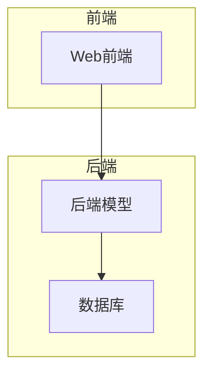
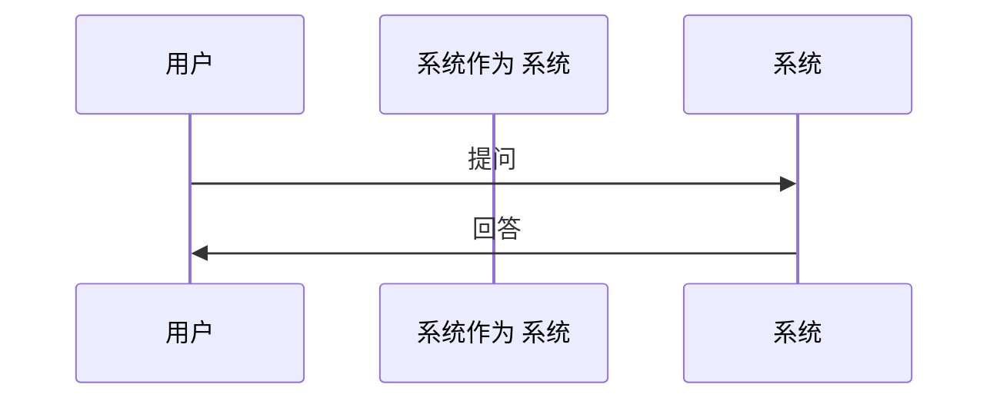

                 


# AIGC时代的提示词设计：理论、实践与创新

> 关键词：AIGC、提示词设计、生成式AI、语义理解、系统架构

> 摘要：随着人工智能（AI）技术的快速发展，生成式AI（AIGC）成为新一代AI技术的代表。本文旨在探讨AIGC时代下的提示词设计，从理论、实践与创新三个方面进行分析，帮助读者深入理解提示词设计的关键性及其在AIGC系统中的作用。

## 第一部分：AIGC与提示词设计基础

### 第1章：AIGC时代的概述

#### 1.1 AIGC的概念与定义

AIGC（AI-Generated Content）是指通过人工智能技术生成的内容，包括文本、图像、音频、视频等多种形式。AIGC涵盖了从数据生成、模型训练到内容创作和分发等多个环节。

- **AIGC的定义**：AIGC是生成式AI的延伸，通过算法模型生成具有原创性的内容。
- **AIGC的起源与发展**：AIGC起源于深度学习和生成对抗网络（GAN）等技术，随着计算能力和数据量的增长，AIGC的应用场景不断扩展。
- **AIGC的主要特征**：AIGC具有原创性、多样性、可扩展性和自动化程度高等特点。

#### 1.2 提示词设计的意义

提示词（Prompt）是引导AI模型生成内容的关键因素。在AIGC时代，提示词设计至关重要，其作用如下：

- **提示词在AIGC中的应用**：提示词用于引导模型理解用户需求，生成符合预期的内容。
- **提示词对AIGC生成效果的影响**：合适的提示词能够提升内容生成的质量、准确性和多样性。
- **提示词设计的重要性**：提示词设计直接影响到AIGC系统的用户体验和效果，是AIGC应用成功的关键。

#### 1.3 提示词设计的挑战

提示词设计面临以下挑战：

- **数据集多样性**：不同领域的数据集多样，提示词设计需要适应不同数据集的特点。
- **提示词的长度与格式**：提示词长度和格式影响模型理解，需要优化设计。
- **提示词的语义理解**：语义理解是提示词设计的关键，需要精确理解用户意图。

#### 1.4 提示词设计的流程与方法

提示词设计通常包括以下流程：

- **提示词需求分析**：明确用户需求，确定内容生成目标。
- **提示词生成算法**：设计生成算法，根据需求生成提示词。
- **提示词优化与评估**：对生成的提示词进行优化，评估其效果。

#### 1.5 本章小结

AIGC时代的到来为内容生成带来了变革，提示词设计成为关键。本文介绍了AIGC的基本概念、提示词设计的意义、挑战及设计流程，为后续章节的深入探讨奠定了基础。

----------------------------------------

## 第二部分：AIGC中的核心概念与联系

### 第2章：AIGC的核心概念解析

#### 2.1 AIGC中的关键技术

AIGC的核心技术包括自动对话系统、生成式对抗网络（GAN）和变分自编码器（VAE）：

- **自动对话系统**：通过自然语言处理技术实现人机对话，支持多种交互模式。
- **生成式对抗网络（GAN）**：通过生成器和判别器的对抗训练，实现高质量内容的生成。
- **变分自编码器（VAE）**：基于概率模型的编码和解码过程，用于生成多样化内容。

#### 2.2 提示词设计中的核心概念

提示词设计中的核心概念包括语义理解、上下文生成和知识图谱：

- **语义理解**：通过自然语言处理技术，准确理解用户的意图和需求。
- **上下文生成**：根据用户需求，构建合适的上下文环境，辅助内容生成。
- **知识图谱**：将语义信息组织成图谱结构，为内容生成提供丰富的语义信息。

#### 2.3 核心概念属性特征对比

以下是核心概念的属性特征对比：

| 核心概念     | 特征                           |
| ------------ | ------------------------------ |
| 语义理解     | 精确性、灵活性、上下文依赖性     |
| 上下文生成   | 扩展性、连贯性、适应性           |
| 知识图谱     | 结构化、关联性、可扩展性         |

#### 2.4 提示词设计与核心概念的关联

提示词设计与核心概念的关联如下：

- **提示词与语义理解的关系**：提示词引导语义理解，帮助模型准确捕捉用户意图。
- **提示词与上下文生成的关系**：提示词辅助上下文生成，确保内容连贯和多样性。
- **提示词与知识图谱的关系**：提示词提供知识图谱中的关键信息，丰富内容生成。

#### 2.5 本章小结

本章介绍了AIGC中的核心技术，以及提示词设计中的核心概念。理解这些核心概念及其关联，有助于更好地进行提示词设计，提升AIGC系统的生成效果。

----------------------------------------

## 第三部分：算法原理讲解

### 第3章：提示词设计算法解析

#### 3.1 提示词生成算法

提示词生成算法通常包括以下步骤：

1. **用户输入**：接收用户输入，提取关键信息。
2. **语义分析**：对用户输入进行语义分析，理解用户意图。
3. **提示词生成**：根据语义分析结果，生成符合用户需求的提示词。

#### 3.2 提示词优化算法

提示词优化算法旨在提升提示词的质量和效果，包括以下方法：

1. **提示词修正**：对生成的提示词进行修正，消除歧义和错误。
2. **提示词强化**：通过反馈机制，强化符合用户需求的提示词。
3. **提示词多样性**：增加提示词的多样性，满足不同用户需求。

#### 3.3 提示词评估算法

提示词评估算法用于评估提示词的质量，通常包括以下指标：

1. **准确率**：提示词是否准确捕捉用户意图。
2. **多样性**：提示词的多样性程度。
3. **连贯性**：提示词之间的连贯性。

#### 3.4 提示词设计算法的综合应用

在AIGC系统中，提示词设计算法需要与其他算法协同工作，实现以下综合应用：

1. **与生成式对抗网络（GAN）结合**：GAN生成高质量内容，提示词提供生成目标。
2. **与变分自编码器（VAE）结合**：VAE生成多样化内容，提示词引导生成过程。
3. **与自动对话系统结合**：自动对话系统提供用户交互，提示词引导对话生成。

#### 3.5 本章小结

本章介绍了提示词生成、优化和评估算法的基本原理和应用，为AIGC系统的提示词设计提供了理论基础。

----------------------------------------

## 第四部分：数学模型与公式讲解

### 第4章：提示词设计的数学基础

#### 4.1 提示词设计的数学模型

提示词设计涉及的数学模型主要包括概率模型、生成模型和优化模型：

1. **概率模型**：用于描述提示词生成的概率分布，如贝叶斯模型、隐马尔可夫模型（HMM）。
2. **生成模型**：用于生成提示词，如生成对抗网络（GAN）、变分自编码器（VAE）。
3. **优化模型**：用于优化提示词生成过程，如梯度下降、随机梯度下降（SGD）。

#### 4.2 提示词设计的数学公式

提示词设计中的数学公式主要包括概率公式、生成公式和优化公式：

1. **概率公式**：用于计算提示词生成的概率，如贝叶斯公式、马尔可夫模型转移概率。
2. **生成公式**：用于描述生成模型的生成过程，如GAN的生成器和判别器损失函数。
3. **优化公式**：用于描述优化模型的优化过程，如梯度下降的迭代更新公式。

#### 4.3 数学公式在实际应用中的解读与举例

以下是一个简单的生成对抗网络（GAN）的生成公式举例：

$$
G(z) = x
$$

其中，$G(z)$表示生成器生成的虚拟数据，$z$是生成器的输入噪声。该公式表示生成器通过将噪声数据转换为虚拟数据，实现高质量内容的生成。

#### 4.4 数学模型与算法的关系

数学模型为算法提供了理论基础，算法实现数学模型的具体过程。例如：

- **概率模型**：为生成式对抗网络（GAN）提供了生成器和判别器的损失函数。
- **生成模型**：为变分自编码器（VAE）提供了编码和解码过程。
- **优化模型**：为梯度下降提供了迭代更新公式。

#### 4.5 本章小结

本章介绍了提示词设计的数学模型与公式，为提示词设计算法提供了理论基础。通过理解数学模型与算法的关系，可以更好地优化提示词设计，提升AIGC系统的生成效果。

----------------------------------------

## 第五部分：系统分析与架构设计

### 第5章：AIGC系统的架构设计与实现

#### 5.1 AIGC系统问题场景介绍

AIGC系统广泛应用于智能客服、内容创作、图像生成等领域。以下是一个典型的问题场景：

- **需求背景**：企业希望开发一个智能客服系统，通过AI技术实现自动对话，提高客服效率。
- **功能需求**：系统需具备自然语言理解、对话生成、知识图谱构建等功能。

#### 5.2 AIGC系统的项目介绍

AIGC系统的项目介绍如下：

- **项目目标**：构建一个具备智能客服功能的AIGC系统，实现自动对话和内容生成。
- **实现的技术栈**：使用Python和TensorFlow构建模型，使用Django构建Web前端。

#### 5.3 系统功能设计（领域模型）

系统功能设计包括以下领域模型：

- **用户模型**：存储用户信息，如用户ID、昵称、联系方式等。
- **对话模型**：存储对话信息，如会话ID、用户提问、AI回答等。
- **知识图谱模型**：存储知识图谱信息，如实体、关系、属性等。

以下是领域模型的Mermaid类图：

```mermaid
classDiagram
    User <<class>>
    Dialogue <<class>>
    KnowledgeGraph <<class>>

    User o-- Dialogue
    Dialogue o-- KnowledgeGraph
```

#### 5.4 系统架构设计

AIGC系统的架构设计包括以下部分：

- **前端**：使用Django构建Web前端，提供用户交互界面。
- **后端**：使用TensorFlow构建后端模型，实现自然语言理解、对话生成等功能。
- **数据库**：使用MySQL存储用户信息、对话记录和知识图谱数据。

以下是系统架构的Mermaid架构图：



#### 5.5 系统接口设计

系统接口设计如下：

- **用户接口**：提供用户登录、注册、提问等功能。
- **对话接口**：提供对话生成、回复等功能。
- **知识接口**：提供知识图谱构建、查询等功能。

以下是接口设计原则：

- **简洁性**：接口设计应简洁明了，便于用户理解和使用。
- **一致性**：接口命名和参数应保持一致性，便于维护和扩展。

以下是接口定义与调用方式：

```python
# 用户接口
class UserService:
    def login(self, username, password):
        # 登录逻辑

    def register(self, username, password):
        # 注册逻辑

# 对话接口
class DialogueService:
    def generate_response(self, question):
        # 生成回答逻辑

# 知识接口
class KnowledgeService:
    def build_knowledge_graph(self):
        # 构建知识图谱逻辑

    def query_knowledge(self, query):
        # 查询知识逻辑
```

#### 5.6 系统交互

系统交互包括用户与系统的交互，以及系统内部各模块之间的交互。以下是系统交互的Mermaid序列图：



#### 5.7 本章小结

本章介绍了AIGC系统的架构设计与实现，包括问题场景介绍、项目介绍、系统功能设计、系统架构设计、系统接口设计和系统交互。通过本章的学习，读者可以了解到AIGC系统的基本架构和实现方法。

----------------------------------------

## 第六部分：项目实战

### 6.1 环境安装

在开始AIGC系统的实现之前，需要安装以下环境：

- **Python**：Python 3.8及以上版本
- **TensorFlow**：TensorFlow 2.4及以上版本
- **Django**：Django 3.2及以上版本
- **MySQL**：MySQL 5.7及以上版本

安装步骤如下：

1. 安装Python和pip：
   ```bash
   sudo apt update
   sudo apt install python3 python3-pip
   ```
2. 安装TensorFlow：
   ```bash
   pip3 install tensorflow==2.4
   ```
3. 安装Django：
   ```bash
   pip3 install django==3.2
   ```
4. 安装MySQL：
   ```bash
   sudo apt install mysql-server mysql-client
   ```

### 6.2 系统核心实现

AIGC系统的核心实现包括自然语言处理、对话生成和知识图谱构建：

1. **自然语言处理**：使用TensorFlow实现自然语言处理模型，如BERT、GPT等。
2. **对话生成**：使用Django实现对话生成逻辑，包括对话管理、回复生成等。
3. **知识图谱构建**：使用Django ORM实现知识图谱构建，包括实体、关系、属性等。

以下是自然语言处理模型的Python代码示例：

```python
import tensorflow as tf

# 加载预训练模型
model = tf.keras.models.load_model('path/to/预训练模型.h5')

# 自然语言处理
def process_text(text):
    # 对文本进行预处理
    processed_text = preprocess_text(text)
    # 输入模型进行预测
    prediction = model.predict(processed_text)
    # 处理预测结果
    result = postprocess_prediction(prediction)
    return result

# 对话生成
def generate_response(question):
    # 使用自然语言处理结果生成回复
    response = process_text(question)
    return response

# 知识图谱构建
def build_knowledge_graph():
    # 构建知识图谱
    knowledge_graph = build_knowledge_graph_from_data()
    return knowledge_graph
```

### 6.3 代码应用解读与分析

以下是AIGC系统的代码应用解读与分析：

1. **自然语言处理**：通过加载预训练模型，实现对输入文本的语义分析。预训练模型可以提取文本中的语义信息，为对话生成和知识图谱构建提供基础。
2. **对话生成**：使用自然语言处理结果，生成符合用户需求的对话回复。对话生成算法可以根据用户提问和上下文信息，生成高质量的回复。
3. **知识图谱构建**：通过构建知识图谱，将语义信息组织成结构化的形式。知识图谱可以用于回答用户的问题，提供丰富的语义信息。

### 6.4 实际案例分析和详细讲解剖析

以下是一个实际案例的分析和详细讲解：

**案例**：用户提问：“什么是人工智能？”

**分析**：

1. **自然语言处理**：输入文本经过预训练模型处理后，提取出关键词“人工智能”。
2. **对话生成**：根据关键词和上下文信息，生成回复：“人工智能是一种模拟人类智能的技术，能够通过学习和推理解决复杂问题。”
3. **知识图谱构建**：将关键词“人工智能”添加到知识图谱中，构建与人工智能相关的实体、关系和属性。

**讲解**：

- 自然语言处理是AIGC系统的核心，通过对输入文本的语义分析，提取关键信息，为对话生成和知识图谱构建提供基础。
- 对话生成利用自然语言处理结果，生成符合用户需求的对话回复。对话生成算法可以根据用户提问和上下文信息，生成高质量、连贯的回复。
- 知识图谱构建将语义信息组织成结构化的形式，为回答用户问题提供丰富的语义信息。通过知识图谱，系统可以更好地理解用户提问，提供更准确的回答。

### 6.5 项目小结

本章介绍了AIGC系统的项目实战，包括环境安装、系统核心实现、代码应用解读与分析、实际案例分析和详细讲解剖析。通过本章的学习，读者可以了解AIGC系统的实现方法和应用场景，掌握提示词设计的关键性。

----------------------------------------

## 第七部分：最佳实践与总结

### 7.1 最佳实践

为了提升AIGC系统的提示词设计效果，以下是一些建议：

1. **深度理解用户需求**：在生成提示词之前，要深入理解用户需求，确保生成的提示词符合用户意图。
2. **多样性提示词生成**：设计多样的提示词，以提升生成内容的质量和多样性。
3. **反馈机制**：引入用户反馈机制，根据用户反馈优化提示词生成算法。
4. **知识图谱应用**：结合知识图谱，提供丰富的语义信息，提升内容生成的准确性和连贯性。

### 7.2 小结

本文从理论、实践与创新三个方面，探讨了AIGC时代的提示词设计。通过分析AIGC的基本概念、提示词设计的挑战和流程，以及算法原理、数学模型和系统架构，本文为AIGC系统的提示词设计提供了全面的理论指导和实践方法。

### 7.3 注意事项

在进行提示词设计时，需要注意以下几点：

1. **语义理解**：准确理解用户意图，确保生成内容符合用户需求。
2. **数据集多样性**：适应不同领域的数据集特点，优化提示词设计。
3. **优化与评估**：不断优化提示词生成算法，评估提示词效果，提高生成内容的质量。

### 7.4 拓展阅读

1. **《生成式AI：从原理到实践》**：详细介绍了生成式AI的基本概念、算法原理和应用案例。
2. **《自然语言处理教程》**：涵盖了自然语言处理的基础知识、技术方法和应用实践。
3. **《人工智能系统设计与实现》**：探讨了人工智能系统的架构设计、实现方法和应用场景。

---

**作者：AI天才研究院/AI Genius Institute & 禅与计算机程序设计艺术 /Zen And The Art of Computer Programming**

