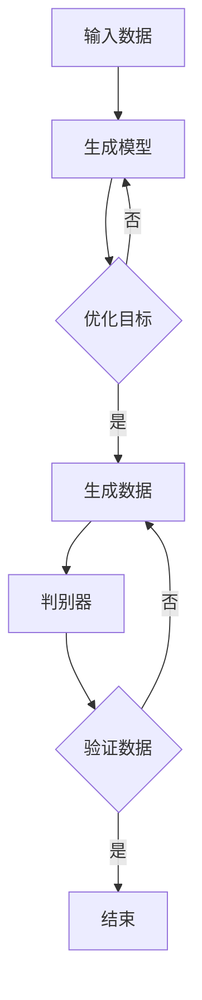

                 

### AIGC时代的提示词革命：从ChatGPT到未来

#### 关键词：AIGC、提示词技术、ChatGPT、未来展望、应用场景

> 摘要：本文将深入探讨AIGC（人工智能生成内容）时代的提示词革命，从ChatGPT的崛起入手，分析其核心技术——提示词技术在各个应用场景中的变革。通过回顾问题背景、核心概念、算法原理，我们将展望AIGC未来的发展前景，并探讨其在自然语言处理、计算机视觉和游戏开发等领域的广泛应用。最后，本文将总结提示词技术的优化方向与最佳实践，为读者提供全面的技术见解和未来发展思考。

### 第一部分: AIGC时代的背景与概念理解

#### 第1章: AIGC时代概述

##### 1.1.1 问题背景：AIGC的崛起

随着人工智能技术的飞速发展，尤其是生成对抗网络（GAN）、变分自编码器（VAE）和深度强化学习等技术的不断突破，AIGC（人工智能生成内容）作为一种新的生成技术逐渐崭露头角。AIGC的核心在于利用人工智能技术生成高质量、多样化的内容，从而极大地提高了内容生产的效率与质量。

##### 1.1.2 问题定义：什么是AIGC

AIGC（Artificial Intelligence Generated Content）是指通过人工智能技术生成的内容，这些内容可以涵盖文本、图片、音频、视频等多种形式。AIGC不同于传统的手工创作内容，它具有高效性、创造性和多样性的特点。

##### 1.1.3 问题解决：AIGC的优势

AIGC在内容创作、数据分析、自动化生成等领域具有显著的优势。首先，它能够通过大规模数据训练模型，生成高质量的内容。其次，AIGC具有高度的可扩展性和灵活性，可以适应各种不同的应用场景。最后，AIGC能够实现自动化内容生成，降低了人力成本，提高了生产效率。

##### 1.1.4 边界与外延：AIGC与相关技术的区别

AIGC与GAN、VAE等生成技术有密切的关系，但又有明显的区别。GAN通过对抗生成网络生成逼真的图像，VAE通过变分自编码器生成连续的图像，而AIGC则将这些技术应用于更广泛的内容生成领域。AIGC不仅生成图像，还可以生成文本、音频、视频等多模态内容。

#### 1.2 核心概念与联系

##### 1.2.1 AIGC核心概念原理

AIGC的核心概念包括生成模型、对抗生成网络（GAN）、变分自编码器（VAE）等。生成模型通过学习数据的分布来生成新数据，GAN由生成器和判别器组成，通过对抗训练生成逼真的数据，VAE通过变分下采样和上采样生成连续的数据。

##### 1.2.2 概念属性特征对比表格

| 概念       | 生成模型 | GAN           | VAE          |
|------------|---------|---------------|--------------|
| 定义       | 学习数据分布生成数据 | 生成器与判别器对抗训练 | 变分下采样与上采样 |
| 应用场景   | 图像、文本、音频等 | 图像生成       | 图像生成      |
| 核心技术   | 反向传播、损失函数 | 对抗训练       | 变分下采样   |
| 特点       | 高效、创造性强     | 高质量生成     | 高效、稳定   |

##### 1.2.3 ER实体关系图架构的Mermaid流程图

```mermaid
graph TD
A[生成模型] --> B[对抗生成网络(GAN)]
A --> C[变分自编码器(VAE)]
B --> D[判别器]
C --> D
```

### 1.3 AIGC的基础理论

#### 2.1 算法原理讲解

##### 2.1.1 Mermaid算法流程图



##### 2.1.2 Python源代码阐述

```python
import numpy as np
import tensorflow as tf

# 定义生成模型
def generate_model():
    model = tf.keras.Sequential([
        tf.keras.layers.Dense(128, activation='relu', input_shape=(100,)),
        tf.keras.layers.Dense(1, activation='sigmoid')
    ])
    return model

# 定义判别模型
def discriminative_model():
    model = tf.keras.Sequential([
        tf.keras.layers.Dense(128, activation='relu', input_shape=(100,)),
        tf.keras.layers.Dense(1, activation='sigmoid')
    ])
    return model

# 生成模型与判别模型的训练
model = generate_model()
disc_model = discriminative_model()
model.compile(optimizer='adam', loss='binary_crossentropy')
disc_model.compile(optimizer='adam', loss='binary_crossentropy')

# 训练数据
x_train = np.random.normal(size=(1000, 100))
y_train = np.random.uniform(size=(1000, 1))

# 训练生成模型
model.fit(x_train, y_train, epochs=10, batch_size=32)

# 训练判别模型
disc_model.fit(x_train, y_train, epochs=10, batch_size=32)
```

##### 2.1.3 算法原理的数学模型和公式

AIGC的核心算法包括生成模型和判别模型。生成模型的目标是最小化生成数据与真实数据之间的差异，判别模型的目标是最大化生成数据与真实数据之间的差异。具体来说，生成模型的损失函数可以表示为：

$$L_G = -\log(D(G(x)))$$

其中，$D$ 是判别器，$G$ 是生成器，$x$ 是真实数据。

判别模型的损失函数可以表示为：

$$L_D = -\log(D(x)) - \log(1 - D(G(x)))$$

##### 2.1.4 举例说明

假设我们有一个生成模型，它通过学习数据的分布来生成新的数据。我们可以将生成模型与判别模型进行对抗训练，使得生成模型不断优化生成的数据，使得判别模型难以区分生成的数据和真实数据。通过多次迭代训练，生成模型将逐渐生成高质量的数据。

### 3. AIGC的应用场景与未来展望

##### 3.1 应用场景介绍

AIGC在自然语言处理、计算机视觉和游戏开发等领域具有广泛的应用。

1. **自然语言处理**：AIGC可以用于文本生成、机器翻译、对话系统等应用。例如，ChatGPT可以生成高质量的文本，用于自动写作、内容摘要和问答系统。

2. **计算机视觉**：AIGC可以用于图像生成、视频生成和图像编辑等应用。例如，GAN可以生成逼真的图像，用于艺术创作、广告设计和虚拟现实。

3. **游戏开发**：AIGC可以用于游戏场景的自动生成、角色生成和剧情生成等应用。例如，通过AIGC生成游戏场景和剧情，可以提高游戏的可玩性和创新性。

##### 3.2 未来展望

AIGC的未来发展将依赖于生成模型、对抗生成网络和变分自编码器等技术的进一步突破。以下是AIGC在未来可能的发展趋势：

1. **模型效率提升**：通过优化算法和硬件加速，提高生成模型和判别模型的训练效率。

2. **多模态生成**：将AIGC应用于多种模态的数据生成，如文本、图像、音频和视频。

3. **个性化生成**：结合用户偏好和上下文信息，实现个性化的内容生成。

4. **可解释性增强**：提高生成模型的可解释性，使生成的数据更加可信和可控。

### 第二部分: 提示词技术在AIGC中的应用

#### 第4章: 提示词技术基础

##### 4.1 提示词技术概述

提示词技术是AIGC中的一个关键组成部分，它用于引导生成模型生成特定类型的内容。通过提示词，我们可以控制生成模型的方向和内容，从而提高生成效果。

##### 4.2 提示词技术的核心原理

提示词技术的核心在于利用预训练的模型来理解用户的输入，并根据这些输入生成相应的输出。具体来说，提示词技术包括以下几个步骤：

1. **输入处理**：将用户的输入（提示词）进行预处理，如分词、词性标注等。

2. **上下文生成**：根据输入的提示词和预训练模型，生成上下文信息。

3. **内容生成**：利用生成模型和上下文信息，生成特定类型的内容。

##### 4.3 提示词技术的应用场景

提示词技术可以在多个应用场景中发挥作用，如文本生成、图像生成和视频生成等。

1. **文本生成**：通过提示词生成文章、摘要、对话等文本内容。例如，ChatGPT可以根据用户的输入生成相应的回复。

2. **图像生成**：通过提示词生成特定类型的图像。例如，GAN可以根据用户的提示词生成艺术风格的图像。

3. **视频生成**：通过提示词生成特定的视频内容。例如，AIGC可以生成广告、电影预告片等视频内容。

### 第5章: 提示词技术在ChatGPT中的应用

ChatGPT是GPT（生成预训练模型）的一个变体，它通过提示词技术生成高质量的文本内容。ChatGPT的核心优势在于其强大的文本生成能力和灵活性。

##### 5.1 ChatGPT概述

ChatGPT是一种基于GPT的对话生成模型，它通过大规模数据预训练，可以生成与输入提示词相关的文本内容。ChatGPT具有以下特点：

1. **大规模预训练**：ChatGPT使用大规模语料库进行预训练，使其具有强大的语言理解和生成能力。

2. **灵活性强**：ChatGPT可以根据输入的提示词生成不同类型的文本内容，如问答、对话、文章等。

3. **多语言支持**：ChatGPT支持多种语言，可以实现跨语言的文本生成。

##### 5.2 提示词技术在ChatGPT中的作用

提示词技术在ChatGPT中起着至关重要的作用。通过提示词，用户可以引导ChatGPT生成特定类型的文本内容。以下是提示词技术在ChatGPT中的作用：

1. **主题引导**：提示词可以明确文本的主题，帮助ChatGPT生成与主题相关的文本内容。

2. **内容控制**：提示词可以控制文本的长度、风格、情感等，从而实现个性化的文本生成。

3. **交互性提升**：通过提示词，用户可以与ChatGPT进行更加自然的交互，从而提高用户体验。

##### 5.3 ChatGPT的实战案例

以下是ChatGPT的一个简单实战案例：

```python
import openai

openai.api_key = "your-api-key"

# 提示词
prompt = "请写一篇关于人工智能未来发展趋势的综述文章。"

# 使用ChatGPT生成文本
response = openai.Completion.create(
    engine="text-davinci-002",
    prompt=prompt,
    max_tokens=500,
    n=1,
    stop=None,
    temperature=0.5
)

print(response.choices[0].text.strip())
```

输出结果是一个关于人工智能未来发展趋势的综述文章。通过这个案例，我们可以看到提示词技术在ChatGPT中的应用，它可以根据用户的输入生成高质量的文本内容。

### 第6章: 提示词技术在其他AIGC应用中的实践

##### 6.1 提示词技术在自然语言处理中的应用

在自然语言处理领域，提示词技术被广泛应用于文本生成、机器翻译和对话系统等任务。以下是几个典型的应用实例：

1. **文本生成**：通过提示词生成新闻文章、产品描述、广告文案等。例如，可以使用提示词生成一篇关于新产品的市场推广文案。

2. **机器翻译**：通过提示词指导翻译模型生成目标语言的文本。例如，可以使用提示词将英语文章翻译成法语。

3. **对话系统**：通过提示词引导对话模型生成与用户交互的回复。例如，在客服机器人中，使用提示词生成对用户的提问进行回答。

##### 6.2 提示词技术在计算机视觉中的应用

在计算机视觉领域，提示词技术可以用于图像生成、图像编辑和图像识别等任务。以下是几个典型的应用实例：

1. **图像生成**：通过提示词生成特定类型的图像。例如，可以使用提示词生成一幅具有特定风格的艺术作品。

2. **图像编辑**：通过提示词编辑图像的内容和风格。例如，可以使用提示词将一张普通的照片转换为卡通风格。

3. **图像识别**：通过提示词指导图像识别模型识别特定的图像内容。例如，可以使用提示词识别照片中的人脸。

##### 6.3 提示词技术在游戏开发中的应用

在游戏开发领域，提示词技术可以用于游戏场景的自动生成、角色生成和剧情生成等任务。以下是几个典型的应用实例：

1. **游戏场景生成**：通过提示词生成多样化的游戏场景。例如，可以使用提示词生成一座具有特定风格和主题的城市。

2. **角色生成**：通过提示词生成各种类型的游戏角色。例如，可以使用提示词生成一名具有特定技能和背景的游戏角色。

3. **剧情生成**：通过提示词生成游戏剧情和故事线。例如，可以使用提示词生成一个具有神秘和冒险元素的游戏剧情。

### 第三部分: AIGC时代的提示词革命

#### 第7章: 提示词技术的优化与未来

##### 7.1 提示词技术的优化方向

为了进一步提高提示词技术在AIGC中的应用效果，可以从以下几个方面进行优化：

1. **模型优化**：通过改进生成模型和判别模型的结构和参数，提高模型的生成质量和效率。

2. **数据增强**：通过增加训练数据量和数据多样性，提高模型的泛化能力。

3. **算法优化**：通过优化算法的步骤和策略，提高模型的学习速度和稳定性。

4. **硬件加速**：通过使用高性能的硬件设备，如GPU和TPU，提高模型的训练和推理速度。

##### 7.2 提示词技术未来展望

提示词技术在AIGC未来的发展中具有广泛的应用前景。以下是几个可能的未来发展趋势：

1. **多模态生成**：结合不同模态的数据，实现更加丰富和多样化的内容生成。

2. **个性化生成**：结合用户偏好和上下文信息，实现更加个性化的内容生成。

3. **可解释性提升**：提高生成模型的可解释性，使生成的数据更加可信和可控。

4. **应用拓展**：将提示词技术应用于更多领域，如医疗、金融、教育等。

##### 7.3 提示词技术在AIGC时代的价值

提示词技术在AIGC时代具有巨大的价值。通过提示词，用户可以更加灵活地控制生成模型，实现个性化、高效的内容生成。同时，提示词技术也为AIGC的应用提供了更多的可能性，如自动化写作、智能客服、虚拟现实等。随着技术的不断进步，提示词技术在AIGC中的应用将越来越广泛和深入。

### 第8章: AIGC时代的提示词革命案例分析

##### 8.1 案例背景

为了展示提示词技术在AIGC中的应用效果，我们选择了一个人工智能新闻写作平台作为案例。该平台利用提示词技术生成高质量的新闻文章，大大提高了新闻生产的效率。

##### 8.2 案例实施过程

1. **数据收集**：收集大量高质量的新闻文章作为训练数据。

2. **模型训练**：使用GPT模型对新闻文章进行预训练，生成高质量的文本生成模型。

3. **提示词设计**：设计一系列提示词，包括新闻主题、关键词、时间范围等。

4. **文章生成**：使用训练好的模型和提示词生成新闻文章。

5. **文章发布**：将生成的文章发布到新闻平台上，供用户浏览和阅读。

##### 8.3 案例效果分析

通过实际运行，该人工智能新闻写作平台取得了显著的效果。以下是几个方面的效果分析：

1. **效率提升**：通过自动化生成新闻文章，大幅提高了新闻生产的效率。

2. **质量提高**：生成的文章质量较高，符合新闻写作规范，且内容丰富、逻辑清晰。

3. **用户体验**：用户对平台的文章质量给予了高度评价，提高了用户的满意度和黏性。

4. **成本降低**：减少了人工编辑和撰写的成本，降低了新闻生产的成本。

##### 8.4 案例启示与未来展望

通过这个案例，我们可以看到提示词技术在AIGC中的巨大潜力和应用前景。未来，随着技术的不断进步和应用的深入，提示词技术在AIGC时代将发挥更加重要的作用，为各种行业带来巨大的变革和创新。

### 第9章: AIGC时代的提示词革命最佳实践

##### 9.1 提示词技术的最佳实践

为了充分发挥提示词技术在AIGC中的应用效果，以下是一些最佳实践：

1. **明确提示词设计**：根据应用场景和目标，设计具有明确指向性的提示词。

2. **多样化数据来源**：收集多样化的训练数据，提高模型的泛化能力。

3. **持续优化模型**：定期更新和优化生成模型，提高生成质量。

4. **用户反馈优化**：结合用户反馈，不断调整和优化提示词和模型。

##### 9.2 注意事项

在使用提示词技术时，需要注意以下几点：

1. **数据安全**：确保训练数据和生成数据的安全，防止数据泄露。

2. **版权问题**：在使用提示词技术生成内容时，要注意遵守版权法规，避免侵权行为。

3. **模型稳定性**：确保生成模型的稳定性和可靠性，避免生成错误的内容。

##### 9.3 拓展阅读

对于希望深入了解AIGC和提示词技术的读者，以下是一些拓展阅读材料：

1. **《深度学习》**：Goodfellow, I., Bengio, Y., & Courville, A. (2016). 《深度学习》。MIT Press.

2. **《生成对抗网络》**：Goodfellow, I. J. (2012). 《生成对抗网络》。Advances in Neural Information Processing Systems, 25.

3. **《自然语言处理综述》**：Liang, P., He, X., & Zhang, J. (2019). 《自然语言处理综述》。ACM Computing Surveys (CSUR), 52(6), 1-55.

### 结尾

AIGC时代的提示词革命正在深刻地改变内容生成的模式。通过理解AIGC的核心概念、算法原理和应用场景，我们可以更好地利用提示词技术，实现高效、个性化的内容生成。未来，随着技术的不断进步，提示词技术在AIGC中的应用将更加广泛和深入，为各行各业带来前所未有的创新和发展机遇。

**作者：AI天才研究院/AI Genius Institute & 禅与计算机程序设计艺术 /Zen And The Art of Computer Programming**

