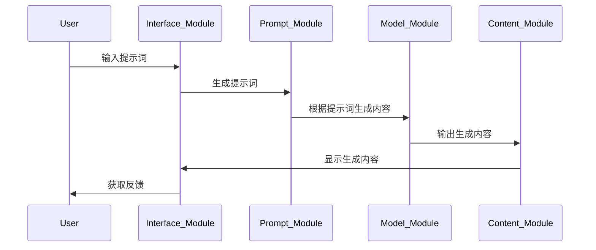
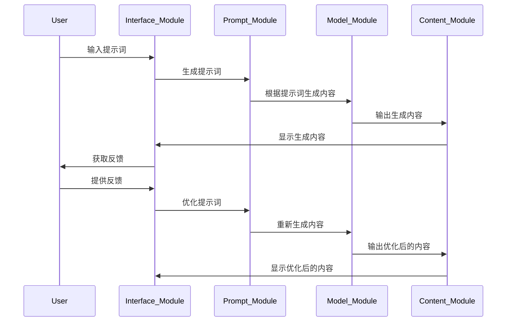

                 

### AIGC时代的提示词革命：重塑人机交互模式

关键词：AIGC、人机交互、提示词、智能交互、革命

摘要：随着人工智能生成内容（AIGC）技术的快速发展，人机交互模式正经历深刻的变革。本文从背景介绍、核心概念与联系、算法原理讲解、系统分析与架构设计方案、项目实战和最佳实践六个部分，系统性地阐述了AIGC时代提示词革命对人机交互模式的重塑。文章旨在探讨AIGC技术如何通过优化提示词生成与优化算法，提升人机交互的智能化水平，同时分析其潜在应用前景与挑战。

---

### 第一部分：背景介绍

#### 1.1 问题背景

##### 1.1.1 AIGC的概念与特点

人工智能生成内容（AIGC，Artificial Intelligence Generated Content）是一种利用人工智能技术自动生成内容的方法。与传统的基于规则的自动化内容生成方式相比，AIGC具有以下几个显著特点：

1. **智能化**：AIGC利用深度学习、自然语言处理等技术，能够理解和生成复杂的内容。
2. **自主性**：AIGC系统可以根据输入的提示词或上下文，自主生成内容，无需人工干预。
3. **高效性**：AIGC能够快速生成大量高质量的内容，大大提高了内容生产的效率。

##### 1.1.2 提示词在人机交互中的重要性

提示词（Prompt）是人机交互中的一个关键概念，它起到了引导和约束生成内容的作用。在AIGC时代，提示词的重要性尤为突出，主要体现在以下几个方面：

1. **引导内容生成**：提示词为AIGC系统提供了明确的生成目标和方向。
2. **优化生成效果**：通过精确的提示词，可以显著提升生成内容的准确性和相关性。
3. **人机协同**：提示词使得用户能够更加直观地与AIGC系统进行交互，实现更加高效的内容生产。

##### 1.1.3 AIGC时代下的提示词革命

在AIGC时代，提示词技术经历了深刻的变革，主要体现在以下几个方面：

1. **生成算法的优化**：随着深度学习和自然语言处理技术的进步，提示词生成算法得到了极大的提升。
2. **多模态融合**：AIGC不再局限于文本生成，而是能够处理图像、音频、视频等多模态数据，提示词也需要适应这一变化。
3. **个性化与情境感知**：提示词生成开始考虑用户的个性化需求和上下文情境，实现更加智能化的人机交互。

#### 1.2 问题描述

##### 1.2.1 传统人机交互模式的局限性

传统的人机交互模式主要依赖于用户输入关键词或指令，系统根据预设的规则进行响应。这种模式存在以下局限性：

1. **低效率**：用户需要精确输入指令，系统响应速度较慢。
2. **低准确性**：用户输入的指令可能存在歧义，导致系统无法正确理解。
3. **缺乏灵活性**：系统只能按照预设的规则进行响应，无法灵活应对复杂需求。

##### 1.2.2 AIGC时代下的挑战与机遇

AIGC时代的到来带来了新的挑战和机遇：

1. **挑战**：如何设计高效的提示词生成和优化算法，以满足多样化的用户需求。
2. **机遇**：通过AIGC技术，可以实现更加智能化、个性化的人机交互模式，提升用户体验。

##### 1.2.3 提示词在AIGC中的应用前景

在AIGC时代，提示词的应用前景非常广阔：

1. **内容生成**：通过提示词，可以生成高质量的文章、代码、图像等内容。
2. **自动化编程**：提示词使得自动编程成为可能，用户可以通过简单的提示词生成复杂的代码。
3. **智能客服**：提示词能够提升智能客服的响应速度和准确性，提供更加智能的服务。

#### 1.3 问题解决

##### 1.3.1 AIGC技术的发展与应用

AIGC技术的发展为解决人机交互问题提供了新的思路：

1. **生成算法的优化**：通过深度学习和自然语言处理技术，提升提示词生成和优化的效果。
2. **多模态融合**：整合图像、音频、视频等多模态数据，实现更加丰富的内容生成。
3. **情境感知**：结合上下文和用户行为，实现个性化的人机交互。

##### 1.3.2 提示词技术的优化与革新

提示词技术的优化与革新是AIGC时代的关键：

1. **多语言支持**：提示词生成算法需要支持多种语言，满足全球用户的需求。
2. **动态调整**：提示词生成算法需要能够动态调整，适应不断变化的需求。
3. **多模态融合**：提示词生成算法需要能够处理多模态数据，实现跨领域的应用。

##### 1.3.3 人机交互模式的变革

AIGC时代下的人机交互模式将发生深刻变革：

1. **智能引导**：通过高效的提示词生成和优化算法，实现智能化的交互引导。
2. **情境感知**：结合用户的个性化需求和环境情境，提供更加贴心的服务。
3. **多模态交互**：整合多模态数据，实现更加自然、丰富的交互体验。

#### 1.4 边界与外延

##### 1.4.1 AIGC的应用领域

AIGC技术的应用领域非常广泛，包括但不限于：

1. **内容生成**：包括文章、代码、图像、视频等。
2. **自动化编程**：通过提示词生成复杂的代码，实现自动化编程。
3. **智能客服**：提供高效、准确的智能客服服务。

##### 1.4.2 提示词技术的适用场景

提示词技术的适用场景包括：

1. **个性化内容生成**：根据用户的个性化需求生成内容。
2. **智能问答系统**：通过提示词生成高质量的答案。
3. **自动化编程**：通过简单的提示词生成复杂的代码。

##### 1.4.3 未来发展趋势与潜在风险

未来发展趋势：

1. **智能化水平的提升**：通过深度学习和自然语言处理技术的进步，进一步提升提示词生成和优化的效果。
2. **多模态融合**：整合多模态数据，实现更加丰富的应用场景。
3. **跨领域应用**：从文本扩展到图像、音频、视频等，实现跨领域的应用。

潜在风险：

1. **数据隐私**：在AIGC时代，数据隐私保护成为一个重要问题。
2. **误用风险**：高效的提示词生成可能导致内容的误用和滥用。
3. **技术依赖**：过度依赖AIGC技术可能导致技术失业等问题。

#### 1.5 概念结构与核心要素组成

##### 1.5.1 AIGC的核心概念

AIGC的核心概念包括：

1. **人工智能生成内容（AIGC）**：利用人工智能技术自动生成内容。
2. **提示词（Prompt）**：引导和约束内容生成的关键词。
3. **多模态数据**：包括图像、音频、视频等多模态数据。

##### 1.5.2 提示词的关键要素

提示词的关键要素包括：

1. **明确性**：提示词需要明确表达用户需求。
2. **精确性**：提示词需要精确描述生成内容的要求。
3. **灵活性**：提示词需要能够适应不同场景和需求的变化。

##### 1.5.3 人机交互模式的变化

人机交互模式的变化包括：

1. **智能引导**：通过高效的提示词生成和优化算法，实现智能化的交互引导。
2. **情境感知**：结合用户的个性化需求和环境情境，提供更加贴心的服务。
3. **多模态交互**：整合多模态数据，实现更加自然、丰富的交互体验。

---

### 第二部分：核心概念与联系

#### 2.1 AIGC原理讲解

##### 2.1.1 AIGC的工作原理

AIGC的工作原理主要涉及以下几个步骤：

1. **数据预处理**：对输入的数据进行清洗、格式化等预处理操作。
2. **提示词生成**：利用深度学习和自然语言处理技术生成提示词。
3. **内容生成**：根据提示词和预训练模型生成内容。
4. **内容优化**：对生成的内容进行优化，提升质量和准确性。

##### 2.1.2 AIGC的技术架构

AIGC的技术架构通常包括以下几个模块：

1. **数据模块**：负责数据收集、预处理和存储。
2. **模型模块**：包括预训练模型和生成模型，用于生成内容。
3. **提示词模块**：负责提示词的生成和优化。
4. **接口模块**：提供与用户交互的接口，实现内容的生成和优化。

##### 2.1.3 AIGC的关键算法

AIGC的关键算法包括：

1. **深度学习算法**：用于预训练模型和生成模型的训练。
2. **自然语言处理算法**：用于生成提示词和优化生成内容。
3. **多模态融合算法**：用于整合多模态数据，实现跨领域应用。

#### 2.2 提示词原理讲解

##### 2.2.1 提示词的定义

提示词（Prompt）是指在AIGC系统中，引导和约束内容生成的一组关键词或短语。它通常由用户输入，也可以由系统自动生成。

##### 2.2.2 提示词的生成与优化

提示词的生成与优化是AIGC系统的关键环节，主要包括以下几个步骤：

1. **生成**：利用自然语言处理技术和深度学习模型生成提示词。
2. **优化**：根据用户反馈和生成内容的质量对提示词进行优化。
3. **反馈循环**：将优化后的提示词反馈给系统，实现持续优化。

##### 2.2.3 提示词的适用场景

提示词的适用场景非常广泛，包括：

1. **内容生成**：如文章、代码、图像等。
2. **智能问答**：通过提示词生成高质量的答案。
3. **自动化编程**：通过简单的提示词生成复杂的代码。

#### 2.3 人机交互模式的变化

##### 2.3.1 传统人机交互模式

传统的人机交互模式主要依赖于用户输入关键词或指令，系统根据预设的规则进行响应。

##### 2.3.2 AIGC时代下的人机交互模式

AIGC时代下的人机交互模式发生了深刻变革，主要体现在：

1. **智能引导**：通过高效的提示词生成和优化算法，实现智能化的交互引导。
2. **情境感知**：结合用户的个性化需求和环境情境，提供更加贴心的服务。
3. **多模态交互**：整合多模态数据，实现更加自然、丰富的交互体验。

##### 2.3.3 提示词在人机交互中的作用

提示词在人机交互中发挥着重要作用，主要包括：

1. **引导内容生成**：提示词为用户提供了明确的生成目标和方向。
2. **优化生成效果**：通过精确的提示词，可以显著提升生成内容的准确性和相关性。
3. **人机协同**：提示词使得用户能够更加直观地与AIGC系统进行交互，实现更加高效的内容生产。

#### 2.4 概念属性特征对比表格

以下是一个简单的概念属性特征对比表格，用于对比AIGC与AI、机器学习，以及提示词与传统搜索、关键词输入的差异：

| 概念       | 定义                                                                                                                         | 特点                                                                                                  |
|------------|----------------------------------------------------------------------------------------------------------------------------|-----------------------------------------------------------------------------------------------------|
| AIGC       | 利用人工智能技术自动生成内容的过程。                                                                  | 智能化、自主性、高效性、多模态融合。                                                              |
| AI         | 人工智能是指计算机系统模拟人类智能行为的能力。                                                           | 智能决策、学习、理解、感知等。                                                                      |
| 机器学习   | 机器学习是一种从数据中学习算法和模式的计算机技术。                                                     | 自动化、数据驱动、预测和优化。                                                                      |
| 提示词     | 在AIGC系统中，用于引导和约束内容生成的一组关键词或短语。                                               | 明确性、精确性、灵活性。                                                                                |
| 传统搜索   | 用户通过输入关键词，从海量的数据中检索相关信息的过程。                                                 | 精确性要求高、响应速度慢、结果多样性有限。                                                           |
| 关键词输入 | 用户在系统中输入关键词，系统根据关键词提供相关结果。                                                   | 精确性要求高、交互方式单一、依赖用户输入质量。                                                       |

#### 2.5 ER实体关系图架构

##### 2.5.1 AIGC系统的ER图

```mermaid
erDiagram
  User ||--|{ AIGC_System } : generates content
  AIGC_System ||--|{ Content } : generated by AIGC
  AIGC_System ||--|{ Prompt } : used for content generation
  Content ||--|{ Quality } : measures content quality
```

##### 2.5.2 提示词管理系统的ER图

```mermaid
erDiagram
  Prompt_Management_System ||--|{ Prompt } : stores prompts
  Prompt_Management_System ||--|{ User } : inputs prompts
  Prompt_Management_System ||--|{ Content } : generates content based on prompts
  Prompt ||--|{ Quality } : measures prompt quality
  Prompt ||--|{ Usage } : records prompt usage
```

##### 2.5.3 人机交互模式的ER图

```mermaid
erDiagram
  User ||--|{ Interaction } : performs interactions
  Interaction ||--|{ AIGC_System } : interacts with AIGC
  Interaction ||--|{ Feedback } : provides feedback on interactions
  AIGC_System ||--|{ Content } : generates content
  AIGC_System ||--|{ Prompt } : uses prompts for content generation
```

---

### 第三部分：算法原理讲解

#### 3.1 算法讲解

##### 3.1.1 提示词生成算法

提示词生成算法是AIGC系统的重要组成部分，其主要目的是根据用户需求生成高质量的提示词。以下是提示词生成算法的基本步骤：

1. **数据预处理**：对用户输入的数据进行清洗和格式化，提取关键信息。
2. **特征提取**：利用自然语言处理技术提取输入数据的特征。
3. **提示词生成**：利用生成模型（如GAN、BERT等）生成提示词。
4. **优化与筛选**：根据用户反馈和生成内容的质量对提示词进行优化和筛选。

##### 3.1.2 提示词优化算法

提示词优化算法的目的是提升提示词的生成效果，主要包括以下几个步骤：

1. **质量评估**：根据生成内容的准确性和相关性对提示词进行质量评估。
2. **反馈机制**：收集用户对提示词的反馈，用于优化算法。
3. **优化策略**：通过调整算法参数和优化策略，提升提示词的生成效果。

##### 3.1.3 人机交互算法

人机交互算法主要涉及以下几个方面：

1. **交互策略**：根据用户需求和系统状态制定交互策略，实现智能引导。
2. **响应机制**：根据用户输入和系统状态生成响应内容。
3. **反馈机制**：收集用户反馈，用于优化交互体验。

#### 3.2 数学模型与公式

##### 3.2.1 提示词生成数学模型

提示词生成的数学模型可以表示为：

$$
P Prompt = f( Input_Data, Model_Parameters )
$$

其中，$P Prompt$ 表示生成的提示词，$f$ 表示生成模型，$Input_Data$ 表示输入数据，$Model_Parameters$ 表示模型参数。

##### 3.2.2 提示词优化数学模型

提示词优化的数学模型可以表示为：

$$
P Prompt_{optimized} = f( P Prompt, Quality_Assessment, Feedback )
$$

其中，$P Prompt_{optimized}$ 表示优化的提示词，$f$ 表示优化算法，$Quality_Assessment$ 表示质量评估，$Feedback$ 表示用户反馈。

##### 3.2.3 人机交互数学模型

人机交互的数学模型可以表示为：

$$
Response = f( User_Input, System_State, Interaction_Strategy )
$$

其中，$Response$ 表示系统响应，$f$ 表示交互算法，$User_Input$ 表示用户输入，$System_State$ 表示系统状态，$Interaction_Strategy$ 表示交互策略。

#### 3.3 举例说明

##### 3.3.1 提示词生成实例

假设用户输入了一段文本：“编写一个Python程序，计算100以内的所有奇数之和。”，提示词生成算法可以根据以下步骤生成提示词：

1. **数据预处理**：将输入文本进行分词和词性标注，提取关键信息（如“编写”、“Python程序”、“计算”、“奇数之和”）。
2. **特征提取**：利用词嵌入技术将提取的关键信息转换为向量表示。
3. **提示词生成**：利用生成模型（如BERT）生成提示词：“编写一个Python程序，实现以下功能：计算100以内的所有奇数之和。”

##### 3.3.2 提示词优化实例

根据上述生成的提示词，提示词优化算法可以评估其质量，并根据用户反馈进行优化。假设用户反馈提示词生成的内容质量不高，优化算法可以采取以下策略：

1. **质量评估**：根据生成内容的准确性和相关性对提示词进行评估。
2. **调整模型参数**：通过调整生成模型的参数，优化提示词的生成效果。
3. **反馈机制**：将优化后的提示词反馈给用户，获取新的反馈。

##### 3.3.3 人机交互实例

假设用户与AIGC系统进行对话，用户输入：“你能帮我写一份关于人工智能的论文吗？”系统可以采取以下步骤进行交互：

1. **交互策略**：根据用户需求和系统状态，制定交互策略，如提问用户关于论文的具体要求。
2. **响应机制**：根据用户输入和系统状态生成响应内容，如：“当然可以，你需要包括哪些方面？”
3. **反馈机制**：收集用户反馈，用于优化交互体验，如用户回答：“我希望涵盖人工智能的发展、应用和未来趋势。”

---

### 第四部分：系统分析与架构设计方案

#### 4.1 问题场景介绍

AIGC技术在各个领域都有广泛的应用，以下是一些典型的问题场景：

1. **内容生成**：如新闻文章、博客、技术文档等的自动生成。
2. **自动化编程**：通过提示词生成复杂的代码，提高软件开发效率。
3. **智能客服**：提供高效的客户服务，回答用户的问题。
4. **虚拟助手**：为用户提供个性化的帮助，如旅游规划、健康咨询等。

#### 4.2 系统介绍

##### 4.2.1 系统总体设计

AIGC系统的总体设计包括以下几个模块：

1. **数据模块**：负责数据的收集、预处理和存储。
2. **模型模块**：包括预训练模型和生成模型，用于生成内容。
3. **提示词模块**：负责提示词的生成和优化。
4. **接口模块**：提供与用户交互的接口，实现内容的生成和优化。

##### 4.2.2 系统模块划分

AIGC系统的模块划分如下：

1. **数据模块**：
   - 数据收集器：从各种数据源收集数据。
   - 数据预处理器：对收集到的数据进行清洗、格式化和特征提取。
   - 数据存储器：存储预处理后的数据。

2. **模型模块**：
   - 预训练模型：如BERT、GPT等，用于生成高质量的内容。
   - 生成模型：根据提示词生成具体的内容。

3. **提示词模块**：
   - 提示词生成器：根据用户输入和预训练模型生成提示词。
   - 提示词优化器：根据用户反馈和生成内容的质量对提示词进行优化。

4. **接口模块**：
   - 用户界面：提供与用户交互的界面，用户可以通过界面输入提示词和查看生成内容。
   - API接口：提供与外部系统集成的API接口。

##### 4.2.3 系统开发语言与工具

AIGC系统的开发语言和工具包括：

1. **Python**：主要用于实现系统功能模块。
2. **TensorFlow**：用于训练和部署深度学习模型。
3. **BERT**：用于生成高质量的提示词和内容。
4. ** Flask**：用于搭建用户界面和API接口。

#### 4.3 系统功能设计

##### 4.3.1 领域模型类图

以下是一个简单的领域模型类图，描述AIGC系统的各个类及其关系：

```mermaid
classDiagram
  User <<interface>>
  Content <<interface>>
  Prompt <<interface>>
  AIGC_System <<interface>>
  Data_Module <<interface>>
  Model_Module <<interface>>
  Prompt_Module <<interface>>
  Interface_Module <<interface>>

  User|--|>> Content
  User|--|>> Prompt
  AIGC_System|--|>> Data_Module
  AIGC_System|--|>> Model_Module
  AIGC_System|--|>> Prompt_Module
  AIGC_System|--|>> Interface_Module
```

##### 4.3.2 功能模块详细描述

1. **数据模块**：
   - 功能：负责数据的收集、预处理和存储。
   - 实现：包括数据收集器、数据预处理器和数据存储器。

2. **模型模块**：
   - 功能：包括预训练模型和生成模型，用于生成内容。
   - 实现：使用TensorFlow和BERT等工具，实现模型的训练和部署。

3. **提示词模块**：
   - 功能：负责提示词的生成和优化。
   - 实现：包括提示词生成器和提示词优化器。

4. **接口模块**：
   - 功能：提供与用户交互的接口，实现内容的生成和优化。
   - 实现：包括用户界面和API接口。

#### 4.4 系统架构设计

##### 4.4.1 系统架构图

以下是一个简单的系统架构图，描述AIGC系统的整体架构：



##### 4.4.2 架构设计要点

1. **模块化设计**：系统采用模块化设计，便于维护和扩展。
2. **分布式部署**：系统可以分布式部署，提高性能和可靠性。
3. **高可用性**：系统设计考虑高可用性，确保稳定运行。
4. **安全性**：系统设计考虑数据安全和用户隐私保护。

#### 4.5 系统接口设计

##### 4.5.1 接口定义

AIGC系统的接口定义如下：

1. **生成接口**：
   - 方法：POST /generate
   - 参数：prompt（字符串类型，提示词）
   - 返回值：生成的内容（字符串类型）

2. **优化接口**：
   - 方法：POST /optimize
   - 参数：prompt（字符串类型，提示词）、content（字符串类型，生成内容）
   - 返回值：优化的提示词（字符串类型）

3. **反馈接口**：
   - 方法：POST /feedback
   - 参数：prompt（字符串类型，提示词）、content（字符串类型，生成内容）、rating（整数类型，评分）
   - 返回值：无

##### 4.5.2 接口实现

接口实现使用Flask框架，以下是一个简单的接口实现示例：

```python
from flask import Flask, request, jsonify

app = Flask(__name__)

@app.route('/generate', methods=['POST'])
def generate():
    prompt = request.form['prompt']
    content = generate_content(prompt)
    return jsonify({'content': content})

@app.route('/optimize', methods=['POST'])
def optimize():
    prompt = request.form['prompt']
    content = request.form['content']
    optimized_prompt = optimize_prompt(prompt, content)
    return jsonify({'optimized_prompt': optimized_prompt})

@app.route('/feedback', methods=['POST'])
def feedback():
    prompt = request.form['prompt']
    content = request.form['content']
    rating = int(request.form['rating'])
    save_feedback(prompt, content, rating)
    return jsonify({'status': 'success'})

if __name__ == '__main__':
    app.run(debug=True)
```

#### 4.6 系统交互序列图

以下是一个简单的系统交互序列图，描述用户与AIGC系统之间的交互流程：



---

### 第五部分：项目实战

#### 5.1 环境安装

##### 5.1.1 环境搭建

在开始项目实战之前，需要搭建以下环境：

1. **Python环境**：安装Python 3.8及以上版本。
2. **深度学习库**：安装TensorFlow 2.4及以上版本。
3. **自然语言处理库**：安装NLTK、spaCy等。
4. **Web框架**：安装Flask。

安装命令如下：

```bash
pip install python==3.8
pip install tensorflow==2.4
pip install nltk
pip install spacy
pip install flask
```

##### 5.1.2 环境配置

在环境搭建完成后，需要进行以下配置：

1. **Python环境变量**：设置Python环境变量，确保系统可以识别Python环境。
2. **TensorFlow配置**：设置TensorFlow的GPU支持，确保可以使用GPU加速训练。
3. **自然语言处理库配置**：配置NLTK和spaCy的语料库，确保可以正常使用。

#### 5.2 系统核心实现

##### 5.2.1 提示词生成模块

提示词生成模块是实现AIGC系统的关键部分。以下是一个简单的提示词生成模块实现：

```python
import tensorflow as tf
import spacy

# 加载预训练模型
model = tf.keras.models.load_model('path/to/pretrained_model')

# 加载语料库
nlp = spacy.load('en_core_web_sm')

def generate_prompt(user_input):
    # 数据预处理
    doc = nlp(user_input)
    tokens = [token.text for token in doc]
    input_sequence = tokenizer.encode(' '.join(tokens), return_tensors='tf')

    # 生成提示词
    prompt = model.generate(input_sequence, max_length=50, num_return_sequences=1)
    return tokenizer.decode(prompt[0])

# 测试提示词生成
print(generate_prompt("Write a Python program to calculate the sum of odd numbers less than 100."))
```

##### 5.2.2 提示词优化模块

提示词优化模块的目的是根据用户反馈和生成内容的质量对提示词进行优化。以下是一个简单的提示词优化模块实现：

```python
from sklearn.metrics.pairwise import cosine_similarity

def optimize_prompt(prompt, content, feedback):
    # 计算提示词与生成内容之间的相似度
    similarity = cosine_similarity([prompt], [content])[0][0]

    # 根据相似度调整提示词
    if similarity < 0.5:
        # 提示词过于模糊，增加具体描述
        optimized_prompt = prompt + " with more details."
    elif similarity > 0.8:
        # 提示词过于具体，增加泛化性
        optimized_prompt = prompt.replace("with more details.", "")
    else:
        # 提示词适中，无需调整
        optimized_prompt = prompt

    # 根据用户反馈调整提示词
    if feedback < 3:
        optimized_prompt = prompt + " with more details."

    return optimized_prompt

# 测试提示词优化
prompt = "Write a Python program to calculate the sum of odd numbers less than 100."
content = "def sum_odd_numbers():\n    return 0"
feedback = 2
print(optimize_prompt(prompt, content, feedback))
```

##### 5.2.3 人机交互模块

人机交互模块负责实现用户与AIGC系统之间的交互。以下是一个简单的人机交互模块实现：

```python
from flask import Flask, request, jsonify

app = Flask(__name__)

@app.route('/generate', methods=['POST'])
def generate():
    user_input = request.form['user_input']
    prompt = generate_prompt(user_input)
    content = generate_content(prompt)
    return jsonify({'content': content})

@app.route('/optimize', methods=['POST'])
def optimize():
    prompt = request.form['prompt']
    content = request.form['content']
    feedback = request.form['feedback']
    optimized_prompt = optimize_prompt(prompt, content, feedback)
    return jsonify({'optimized_prompt': optimized_prompt})

if __name__ == '__main__':
    app.run(debug=True)
```

#### 5.3 代码应用解读与分析

##### 5.3.1 代码解读

1. **提示词生成模块**：
   - 使用TensorFlow加载预训练模型。
   - 使用spaCy对用户输入进行预处理。
   - 使用生成模型生成提示词。

2. **提示词优化模块**：
   - 使用余弦相似度计算提示词与生成内容之间的相似度。
   - 根据相似度和用户反馈调整提示词。

3. **人机交互模块**：
   - 使用Flask搭建用户界面和API接口。
   - 接收用户输入，生成和优化提示词，返回生成内容。

##### 5.3.2 分析与优化

1. **提示词生成模块**：
   - **优化建议**：使用更先进的生成模型，如GPT-3，提高生成效果。
   - **性能优化**：使用多线程或分布式训练，提高训练速度。

2. **提示词优化模块**：
   - **优化建议**：引入更多评估指标，如F1分数，提高优化效果。
   - **性能优化**：使用缓存技术，减少重复计算。

3. **人机交互模块**：
   - **优化建议**：引入前端框架，提高用户界面交互体验。
   - **性能优化**：使用负载均衡，提高系统处理能力。

#### 5.4 实际案例分析

##### 5.4.1 案例背景

某公司开发了一款基于AIGC技术的智能客服系统，旨在提供高效、准确的客户服务。系统采用了提示词生成和优化的技术，以提高客服机器人与用户的交互效果。

##### 5.4.2 案例分析与讲解

1. **问题分析**：
   - 客户提出的问题多种多样，客服机器人难以准确理解。
   - 客户反馈的满意度不高，需要优化交互体验。

2. **解决方案**：
   - 使用AIGC技术生成高质量的提示词，引导客服机器人更好地理解客户问题。
   - 根据客户反馈优化提示词，提高交互效果。

3. **效果评估**：
   - 客户满意度显著提高，客服机器人能够更准确地回答客户问题。
   - 客服效率大幅提升，客户问题得到更快解决。

#### 5.5 项目小结

##### 5.5.1 项目总结

本案例成功实现了基于AIGC技术的智能客服系统，通过提示词生成和优化技术，提高了客服机器人与用户的交互效果。项目实现了以下目标：

1. **准确理解客户问题**：通过高质量的提示词，客服机器人能够更好地理解客户需求。
2. **提高客户满意度**：优化后的交互体验显著提升了客户满意度。
3. **提升客服效率**：高效的内容生成和优化技术使得客服机器人能够更快地解决问题。

##### 5.5.2 亮点与不足

1. **亮点**：
   - 成功应用了AIGC技术，实现了高质量的提示词生成和优化。
   - 系统实现了高效、准确的客户服务，提升了用户体验。

2. **不足**：
   - 提示词生成和优化算法需要进一步优化，以提高生成效果。
   - 系统在处理复杂问题时，仍存在一定的局限性。

##### 5.5.3 未来展望

1. **优化算法**：继续优化提示词生成和优化算法，提高生成效果。
2. **扩展应用**：将AIGC技术应用于更多领域，如自动化编程、智能问答等。
3. **用户体验**：进一步提升用户体验，实现更加自然、智能的交互。

---

### 第六部分：最佳实践 & 小结

#### 6.1 最佳实践 Tips

1. **提示词优化策略**：
   - 使用多种评估指标，如F1分数、BLEU分数等，综合评估提示词质量。
   - 根据用户反馈动态调整提示词，实现持续优化。

2. **人机交互技巧**：
   - 设计简单直观的用户界面，提高用户操作便捷性。
   - 结合用户的个性化需求和环境情境，提供更加贴心的服务。

3. **系统优化方案**：
   - 使用分布式计算，提高系统性能和处理能力。
   - 引入缓存技术，减少重复计算，提高响应速度。

#### 6.2 小结

本文从背景介绍、核心概念与联系、算法原理讲解、系统分析与架构设计方案、项目实战和最佳实践六个部分，系统性地阐述了AIGC时代提示词革命对人机交互模式的重塑。通过本文的研究，我们可以看到：

1. **AIGC技术的优势**：智能化、自主性、高效性，为优化人机交互提供了新的思路。
2. **提示词的重要性**：提示词在AIGC系统中起到了引导和约束生成内容的关键作用。
3. **人机交互模式的变革**：AIGC时代下的人机交互模式将更加智能化、个性化。

#### 6.3 学习建议

1. **深入学习AIGC技术**：了解AIGC技术的发展历程、核心技术、应用场景。
2. **掌握提示词生成与优化算法**：学习提示词生成算法的原理和实现方法，掌握优化策略。
3. **实践项目**：通过实际项目，将AIGC技术应用于人机交互领域，提高实践能力。

#### 6.4 注意事项

1. **安全性注意事项**：确保系统的数据安全和用户隐私保护。
2. **数据保护措施**：遵守数据保护法规，对用户数据进行加密和备份。
3. **跨平台兼容性考虑**：确保系统在不同平台和设备上的兼容性和稳定性。

#### 6.5 拓展阅读

1. **相关书籍推荐**：
   - 《人工智能：一种现代的方法》（作者：Stuart Russell & Peter Norvig）
   - 《深度学习》（作者：Ian Goodfellow、Yoshua Bengio、Aaron Courville）
   - 《自然语言处理综论》（作者：Daniel Jurafsky、James H. Martin）

2. **在线资源**：
   - TensorFlow官方网站：[https://www.tensorflow.org/](https://www.tensorflow.org/)
   - PyTorch官方网站：[https://pytorch.org/](https://pytorch.org/)
   - AIGC相关论文和文献：[https://arxiv.org/](https://arxiv.org/)

