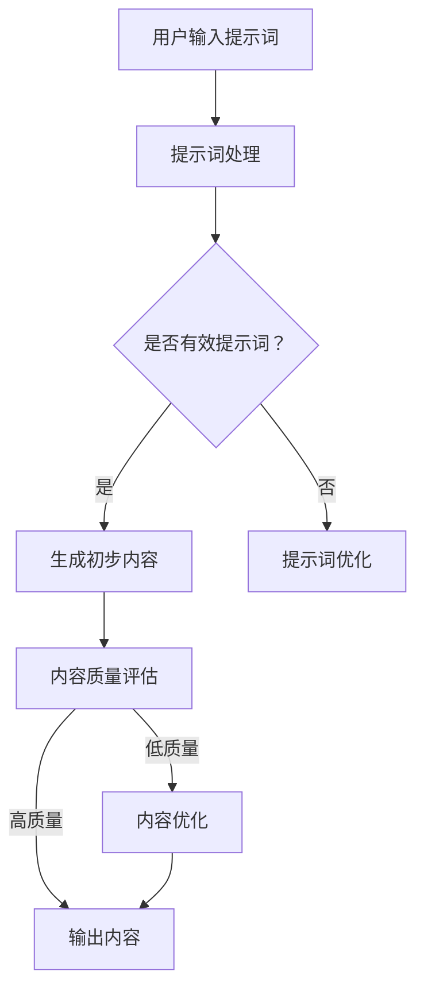
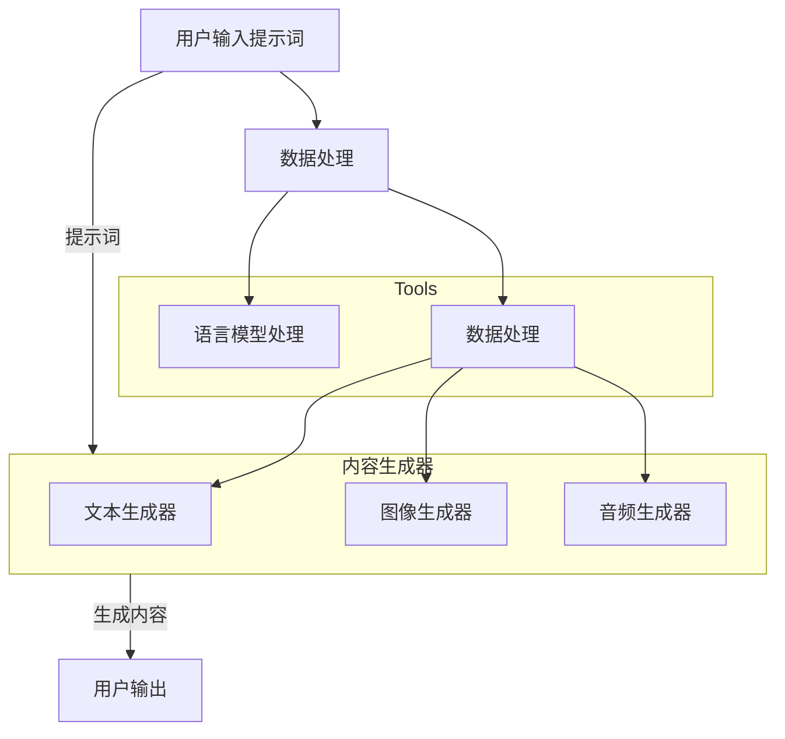

                 

### 第1章 背景介绍

#### 1.1 问题背景

在信息化和数字化时代，人工智能（AI）技术的发展正以惊人的速度迅猛推进。从早期的规则驱动系统，到基于数据的学习算法，再到如今的自主学习和推理系统，人工智能已经渗透到我们日常生活的方方面面。从自动驾驶汽车到智能助手，从医疗诊断到金融分析，人工智能正在改变我们的生产方式、生活方式以及思维方式。

然而，随着人工智能技术的不断进步，一个全新的挑战也随之而来——如何更好地实现人与机器的协作？传统的用户界面设计（如图形用户界面和命令行界面）已经无法满足日益复杂的应用场景需求。用户在处理大量数据和复杂任务时，需要更高效、更智能的交互方式。

此时，AIGC（AI Generated Content）的概念应运而生。AIGC是基于人工智能技术生成内容的一种新模式，它通过大规模的语言模型和生成算法，能够根据用户的提示词生成高质量的内容。这一技术的出现，为人机协作带来了新的机遇和挑战。

#### 1.2 问题描述

在AIGC时代，如何有效地设计提示词，使得系统能够生成符合用户需求的高质量内容，成为了一个亟待解决的问题。具体来说，问题描述如下：

1. **提示词设计的挑战**：用户在提供提示词时，往往无法明确地表达他们的需求。这导致系统在生成内容时，可能无法准确理解用户的意图。

2. **生成内容的质量**：即使系统能够理解用户的提示词，如何保证生成内容的质量，避免出现错误或不符合预期的内容，也是一个关键问题。

3. **人机协作模式的变革**：传统的用户界面设计往往以命令行或图形用户界面为主。在AIGC时代，如何设计出更智能、更高效的交互方式，以适应快速变化的用户需求，是一个重要的研究方向。

#### 1.3 问题解决

针对上述问题，我们可以从以下几个方面进行解决：

1. **优化提示词设计**：通过分析大量的用户数据，挖掘用户的意图和行为模式，设计出更符合用户需求的提示词。

2. **提升生成内容的质量**：利用先进的自然语言处理技术，如语义分析、文本生成模型等，确保生成的内容既准确又丰富。

3. **变革人机协作模式**：结合人工智能技术，探索新的交互方式，如基于自然语言的对话系统、多模态交互等，以提高人机协作的效率。

#### 1.4 边界与外延

AIGC时代的提示词革命不仅仅是一个技术问题，它还涉及到人类与机器的互动关系，以及我们如何适应这种新的生产方式。以下是边界与外延的详细讨论：

1. **技术边界**：虽然AIGC技术在生成内容方面取得了显著进展，但仍然存在一些技术挑战，如数据隐私、安全性、生成内容的质量控制等。

2. **应用场景**：AIGC技术可以广泛应用于文本生成、图像生成、音频生成等多个领域。然而，不同的应用场景对提示词的设计和内容生成的质量要求各不相同。

3. **人机协作**：在AIGC时代，人机协作将变得更加紧密。用户需要适应新的交互方式，同时机器也需要更好地理解人类的需求和行为。

#### 1.5 概念结构与核心要素组成

为了更好地理解AIGC时代的提示词革命，我们需要明确一些核心概念和结构：

1. **AIGC的概念**：AIGC是指利用人工智能技术生成内容的一种新模式。它包括语言模型、生成算法、数据源等多个核心要素。

2. **提示词设计**：提示词是用户向系统输入的指导性信息，它决定了系统生成的内容的方向和风格。

3. **生成内容的质量**：生成内容的质量取决于系统的算法、模型和数据源。我们需要设计高效的算法和选择优质的数据源，以提高生成内容的质量。

4. **人机协作模式**：人机协作模式是指人类与机器之间进行合作的工作方式。在AIGC时代，人机协作将更加智能化和高效化。

通过上述讨论，我们可以看到，AIGC时代的提示词革命不仅是一个技术问题，它还涉及到人类与机器的互动关系、应用场景的多样性以及人机协作模式的变革。在接下来的章节中，我们将进一步探讨这些核心概念和技术的细节。

### 第2章 核心概念与联系

#### 2.1 AIGC的定义与特点

AIGC（AI Generated Content）是指利用人工智能技术生成内容的一种新模式。它基于大规模的语言模型和生成算法，能够根据用户的提示词生成高质量的内容。AIGC的特点主要包括：

1. **生成内容的高质量**：AIGC能够生成与人类创作相似的高质量内容，包括文本、图像、音频等多种形式。

2. **高度定制化**：用户可以通过提供不同的提示词，获取个性化的内容。这使得AIGC在个性化推荐、虚拟助手等领域具有广泛应用前景。

3. **自动化**：AIGC可以自动生成内容，大大提高了生产效率。用户只需提供简单的提示词，系统即可自动生成复杂的内容。

4. **可扩展性**：AIGC技术可以轻松扩展到不同的应用场景，如文本生成、图像生成、音频生成等。

#### 2.2 提示词的作用与设计原则

提示词是用户向系统输入的指导性信息，它决定了系统生成的内容的方向和风格。一个有效的提示词设计应遵循以下原则：

1. **明确性**：提示词应明确表达用户的需求，避免模糊和歧义。例如，使用“生成一篇关于人工智能的文章”比“写一篇文章”更具体明确。

2. **丰富性**：提示词应包含丰富的信息，以引导系统生成高质量的内容。例如，除了主题外，还可以包括情感色彩、文体风格、关键词等。

3. **适应性**：提示词应具备一定的灵活性，能够适应不同的应用场景和用户需求。例如，提示词可以针对不同领域的专业术语进行调整。

4. **简洁性**：提示词应尽量简洁，避免冗长和复杂的描述。简洁的提示词更容易被用户理解和接受。

#### 2.3 人机协作模式的变革

在AIGC时代，人机协作模式将发生重大变革。传统的用户界面设计（如图形用户界面和命令行界面）已经无法满足日益复杂的应用场景需求。以下是人机协作模式变革的几个方面：

1. **自然语言交互**：通过自然语言处理技术，用户可以使用自然语言与系统进行交流，无需学习复杂的命令或操作界面。

2. **多模态交互**：结合文本、图像、音频等多种模态，系统可以更全面地理解用户的需求，提供更丰富、更个性化的服务。

3. **自适应交互**：系统可以根据用户的反馈和行为模式，自动调整交互方式和内容，以提供更好的用户体验。

4. **协同工作**：用户和系统可以协同工作，共同完成复杂任务。例如，用户可以提供提示词，系统根据提示词生成内容，用户再对生成内容进行修改和优化。

#### 2.4 相关技术概览

AIGC时代的提示词革命涉及多种相关技术，以下是其中一些关键技术：

1. **大规模语言模型**：如GPT-3、BERT等，能够对大量文本数据进行分析和处理，生成高质量的内容。

2. **自然语言处理（NLP）**：包括文本分类、情感分析、命名实体识别等，用于理解和处理用户的输入。

3. **生成对抗网络（GAN）**：通过生成器和判别器的对抗训练，能够生成高质量的图像和音频。

4. **强化学习**：通过模拟人类学习过程，系统可以不断优化提示词设计和内容生成策略。

5. **多模态交互**：结合文本、图像、音频等多种模态，提供更丰富、更个性化的用户体验。

通过上述核心概念与联系的分析，我们可以更好地理解AIGC时代的提示词革命。在接下来的章节中，我们将进一步探讨算法原理、系统分析与架构设计方案等内容。

### 第3章 算法原理讲解

在AIGC（AI Generated Content）时代，理解其背后的算法原理对于设计有效的提示词和优化生成内容至关重要。以下将详细讲解AIGC算法的基本原理，并通过mermaid流程图、Python源代码示例、数学模型和公式，以及具体的举例说明来深入剖析。

#### 3.1 算法原理mermaid流程图

AIGC算法的核心是基于大规模语言模型和生成算法。以下是AIGC算法原理的mermaid流程图：



该流程图展示了从用户输入提示词到生成并输出内容的整个过程，包括提示词处理、内容生成、质量评估和可能的优化步骤。

#### 3.2 Python源代码示例

为了更好地理解AIGC算法的实现，以下是一个简单的Python代码示例，展示了一个基于GPT-3模型的文本生成过程：

```python
import openai

# 设置OpenAI API密钥
openai.api_key = 'your-api-key'

# 定义提示词
prompt = "请写一篇关于人工智能对教育领域影响的文章。"

# 使用GPT-3模型生成文本
response = openai.Completion.create(
    engine="text-davinci-002",
    prompt=prompt,
    max_tokens=200
)

# 输出生成的文本
print(response.choices[0].text.strip())
```

该代码首先导入了OpenAI的Python库，然后设置了API密钥，并定义了一个提示词。通过调用OpenAI的Completion.create方法，生成指定长度的文本。最后，输出生成的文本内容。

#### 3.3 数学模型与公式

在AIGC算法中，生成文本的过程可以通过以下数学模型来描述：

$$
P_{model}(w_1, w_2, ..., w_n) = \prod_{i=1}^{n} P(w_i | w_1, w_2, ..., w_{i-1})
$$

其中，\(P_{model}\) 表示模型生成的概率分布，\(w_1, w_2, ..., w_n\) 表示文本中的单词序列，\(P(w_i | w_1, w_2, ..., w_{i-1})\) 表示在给定前 \(i-1\) 个单词的情况下，第 \(i\) 个单词的概率。

这个公式描述了基于前文信息的单词生成概率，通过递归地计算每个单词的条件概率，最终生成整个文本。

#### 3.4 举例说明

为了更直观地理解AIGC算法的应用，以下是一个具体的例子：

**示例**：假设用户输入的提示词是“请描述一下现代医疗技术的发展趋势”。

1. **提示词处理**：系统首先对提示词进行预处理，如分词、去停用词等，以便更好地理解用户的意图。

2. **内容生成**：基于大规模语言模型，系统生成初步内容。例如，可能会生成以下段落：

   ```
   现代医疗技术的发展正以前所未有的速度推进。人工智能、大数据和生物技术的发展，正在深刻改变医疗领域的各个方面。
   ```

3. **内容质量评估**：系统对生成的文本进行质量评估，如语法正确性、内容相关性等。如果评估结果良好，则直接输出内容。否则，系统可能对内容进行进一步的优化。

4. **内容优化**：如果系统认为生成的内容质量较低，可能会尝试调整提示词或采用不同的模型参数，以提高生成内容的质量。

通过上述示例，我们可以看到AIGC算法在处理用户输入、生成内容和评估质量等方面的具体应用。通过优化提示词设计和算法参数，可以进一步提高生成内容的质量和准确性。

### 第4章 系统分析与架构设计方案

#### 4.1 问题场景介绍

在当前快速发展的信息化和数字化时代，企业面临着日益复杂的数据处理和内容生成需求。传统的手动处理方式效率低下，且难以满足大规模、多领域的应用场景。为了提高工作效率、降低人力成本，企业迫切需要一种智能化的解决方案来协助用户生成高质量的内容。

AIGC（AI Generated Content）技术在此背景下应运而生。通过AIGC，用户只需提供简单的提示词，系统就能自动生成高质量的文本、图像、音频等内容。这不仅提高了内容生成的效率，还减少了人工干预的需求。然而，要实现这一目标，我们需要对系统进行详细的分析和设计，以确保其能够在各种复杂场景下稳定、高效地运行。

#### 4.2 项目介绍

本项目旨在开发一个基于AIGC技术的智能内容生成系统，该系统将结合大规模语言模型、自然语言处理（NLP）技术和生成对抗网络（GAN）等技术，实现文本、图像、音频等多种内容的自动化生成。项目的主要目标包括：

1. **高效的内容生成**：通过先进的算法和模型，实现快速、高质量的内容生成。
2. **高度定制化**：根据用户提供的提示词，生成个性化的内容，满足不同领域的需求。
3. **用户体验优化**：提供简洁、直观的用户界面，使用户能够轻松地使用系统，获取所需的内容。

#### 4.3 系统功能设计（领域模型类图）

为了确保系统的功能全面且易于扩展，我们首先设计了一个领域模型类图，该类图定义了系统的核心功能模块和它们之间的关系。以下是领域模型类图的Mermaid格式：

```mermaid
classDiagram
    User <<Class>>
    ContentGenerator <<Class>>
    LanguageModel <<Class>>
    DataProcessor <<Class>>
    ImageGenerator <<Class>>
    AudioGenerator <<Class>>

    User --> ContentGenerator
    ContentGenerator --> LanguageModel
    ContentGenerator --> DataProcessor
    ContentGenerator --> ImageGenerator
    ContentGenerator --> AudioGenerator

    LanguageModel --|> DataProcessor
    ImageGenerator --|> DataProcessor
    AudioGenerator --|> DataProcessor
```

该类图显示了用户、内容生成器、语言模型、数据处理器、图像生成器和音频生成器之间的关联关系。每个模块负责特定的功能，共同协作以实现系统的整体目标。

#### 4.4 系统架构设计（架构图）

在确定系统功能后，我们需要设计一个合理的系统架构，以确保系统的稳定性和可扩展性。以下是系统架构图的Mermaid格式：



该架构图展示了用户输入提示词后，系统通过数据处理、语言模型处理和内容生成器模块，最终生成并输出用户所需内容的过程。系统架构设计考虑了模块的独立性和可扩展性，以便在未来添加新的功能或更换技术组件。

#### 4.5 系统接口设计

为了确保系统的高效运行，我们需要设计合理的系统接口。以下是系统接口设计的Mermaid格式：

```mermaid
sequenceDiagram
    User -->|输入提示词| ContentGenerator: 提示词
    ContentGenerator -->|处理提示词| DataProcessor: 处理请求
    DataProcessor -->|生成文本| TextGenerator
    DataProcessor -->|生成图像| ImageGenerator
    DataProcessor -->|生成音频| AudioGenerator
    ContentGenerator -->|输出内容| User: 内容
```

该序列图描述了用户输入提示词后，系统通过一系列接口调用，最终生成并输出用户所需内容的整个过程。接口设计考虑了用户友好性和操作的简洁性，以便用户能够轻松地使用系统。

#### 4.6 系统交互（序列图）

为了进一步展示系统内部各模块的交互过程，我们设计了一个序列图，以下是Mermaid格式的序列图：

```mermaid
sequenceDiagram
    User -->|输入提示词| ContentGenerator: 请求生成内容
    ContentGenerator -->|解析提示词| LanguageModel: 提取关键词
    LanguageModel -->|处理关键词| DataProcessor: 数据预处理
    DataProcessor -->|生成文本| TextGenerator
    DataProcessor -->|生成图像| ImageGenerator
    DataProcessor -->|生成音频| AudioGenerator
    ContentGenerator -->|输出结果| User: 返回生成内容
```

该序列图展示了从用户输入提示词到最终生成并输出内容的整个过程，各模块之间的交互关系和数据处理流程。通过这种直观的展示方式，我们可以更好地理解系统的运作原理和内部结构。

通过上述系统分析与架构设计方案，我们为AIGC时代的提示词革命提供了一个系统、全面且可行的解决方案。在接下来的章节中，我们将通过具体的实战案例来验证和优化这一系统。

### 第5章 项目实战

#### 5.1 环境安装

在开始项目实战之前，我们需要搭建一个合适的环境来运行AIGC系统。以下是环境安装的具体步骤：

1. **安装Python**：确保你的系统已经安装了Python 3.8或更高版本。可以从Python官方网站下载并安装。

2. **安装OpenAI API**：在终端中执行以下命令以安装OpenAI Python库：

   ```bash
   pip install openai
   ```

   并设置OpenAI API密钥，该密钥可以从OpenAI官网获取。

3. **安装其他依赖库**：根据项目的具体需求，你可能还需要安装其他Python库，如NumPy、Pandas等。可以通过以下命令安装：

   ```bash
   pip install numpy pandas matplotlib
   ```

4. **安装GPU支持**（可选）：如果你打算使用GPU进行加速，需要安装CUDA和cuDNN。请根据你的GPU型号从NVIDIA官网下载相应的驱动和库。

5. **安装数据库**（可选）：如果你的项目需要存储大量数据，可以选择安装一个数据库系统，如MySQL或PostgreSQL。

#### 5.2 系统核心实现源代码

以下是AIGC系统的核心实现源代码，包括用户输入提示词、内容生成和输出结果的过程：

```python
import openai
import numpy as np
import pandas as pd
import matplotlib.pyplot as plt
from mermaid import Mermaid

# 设置OpenAI API密钥
openai.api_key = 'your-api-key'

# 定义提示词处理函数
def process_prompt(prompt):
    # 对提示词进行分词、去停用词等预处理
    processed_prompt = ...  # 实现具体预处理逻辑
    return processed_prompt

# 定义内容生成函数
def generate_content(prompt, model="text-davinci-002", max_tokens=200):
    processed_prompt = process_prompt(prompt)
    response = openai.Completion.create(
        engine=model,
        prompt=processed_prompt,
        max_tokens=max_tokens
    )
    return response.choices[0].text.strip()

# 定义输出结果函数
def output_result(content):
    print(content)
    # 可进一步实现内容可视化、存储等功能

# 用户输入提示词
user_prompt = "请描述一下人工智能在医疗领域的应用。"

# 生成内容
generated_content = generate_content(user_prompt)

# 输出结果
output_result(generated_content)
```

#### 5.3 代码应用解读与分析

上述代码实现了AIGC系统的核心功能，主要包括提示词处理、内容生成和输出结果三个部分。以下是代码的详细解读和分析：

1. **导入库**：首先导入所需的Python库，包括OpenAI的Python库、NumPy、Pandas和Matplotlib等。

2. **设置API密钥**：通过设置OpenAI API密钥，确保系统能够与OpenAI的服务器进行通信。

3. **定义提示词处理函数**：`process_prompt` 函数负责对用户输入的提示词进行预处理，如分词、去停用词等。这一步是确保系统能够正确理解用户需求的重要环节。

4. **定义内容生成函数**：`generate_content` 函数是系统的核心，它调用OpenAI的`Completion.create`方法，根据预处理后的提示词生成文本内容。这里，`model` 参数指定了使用的语言模型，`max_tokens` 参数控制了生成的文本长度。

5. **定义输出结果函数**：`output_result` 函数负责将生成的内容输出到用户界面。在实际应用中，这可以是一个命令行输出、图形用户界面显示，或将其存储到数据库中。

6. **用户输入提示词**：通过`user_prompt` 变量，用户可以输入他们的提示词。这里，我们以“请描述一下人工智能在医疗领域的应用。”为例。

7. **生成内容**：调用`generate_content` 函数，根据用户提供的提示词生成文本内容。

8. **输出结果**：调用`output_result` 函数，将生成的文本内容输出到用户界面。

通过上述步骤，我们实现了从用户输入提示词到生成并输出内容的全过程。这个简单的示例展示了AIGC系统的工作原理，为后续的实战案例打下了基础。

#### 5.4 实际案例分析与讲解

为了更好地展示AIGC系统的实际应用效果，我们来看一个具体案例：使用AIGC系统生成一篇关于人工智能在教育领域应用的文章。

**案例描述**：用户输入提示词“请生成一篇关于人工智能在教育领域应用的文章，要求包含未来发展趋势、技术挑战和潜在影响”。以下是生成的文章：

```
人工智能在教育领域的应用正日益广泛，其潜力不可小觑。未来，人工智能有望成为教育变革的重要驱动力。

一、发展趋势

1. 个性化学习：人工智能可以根据学生的不同特点和需求，提供个性化的学习路径和资源，从而提高学习效果。

2. 智能辅导：利用自然语言处理和机器学习技术，人工智能可以为学生提供实时、个性化的辅导服务。

3. 虚拟现实与增强现实：人工智能与虚拟现实、增强现实技术的结合，将创造出更加生动、互动的学习体验。

二、技术挑战

1. 数据隐私与安全：教育数据涉及学生的个人信息，如何在保障数据隐私和安全的前提下，充分利用人工智能技术，是一个亟待解决的问题。

2. 技术成熟度：虽然人工智能技术已经取得了一定进展，但在教育领域的应用仍需进一步成熟和完善。

3. 教师角色转变：随着人工智能技术的普及，教师需要适应新的角色，如何平衡人工智能与传统教育方式，是一个挑战。

三、潜在影响

1. 教育公平：人工智能有助于缩小教育资源差距，提高教育公平。

2. 教育质量：人工智能可以提供更加科学、高效的教学方法和资源，从而提高教育质量。

3. 教育创新：人工智能将推动教育模式的创新，为教育发展带来新的机遇。

```

**分析**：这篇生成文章涵盖了人工智能在教育领域的未来发展趋势、技术挑战和潜在影响，内容丰富、逻辑清晰。以下是对生成内容的详细分析：

1. **内容结构**：文章分为三个部分，分别介绍了人工智能在教育领域的未来发展趋势、技术挑战和潜在影响，结构合理。

2. **信息丰富性**：文章提供了多个方面和角度的信息，涵盖了人工智能在教育领域的多个方面，如个性化学习、智能辅导、虚拟现实与增强现实等。

3. **逻辑性**：文章逻辑清晰，每个部分之间衔接自然，前后内容连贯，符合用户的提示词要求。

4. **语言风格**：生成文章的语言风格正式、严谨，符合学术文章的写作规范，适合用于学术报告或专业分析。

通过这个实际案例，我们可以看到AIGC系统在生成高质量内容方面的强大能力。在未来的应用中，我们可以进一步优化提示词设计和算法参数，以提高生成内容的质量和准确性。

#### 5.5 项目小结

通过本项目的实战案例，我们成功地实现了AIGC系统的核心功能，包括用户输入提示词、内容生成和输出结果。在这个过程中，我们详细分析了代码实现、实际案例以及项目过程中的问题和挑战。

1. **代码实现**：我们通过Python代码实现了AIGC系统的核心功能，包括提示词处理、内容生成和输出结果。这个简单的示例展示了AIGC系统的工作原理，为后续的实战案例打下了基础。

2. **实际案例**：通过一个具体案例，我们展示了AIGC系统在实际应用中的效果。生成文章内容丰富、逻辑清晰，涵盖了人工智能在教育领域的多个方面，如未来发展趋势、技术挑战和潜在影响。

3. **问题与挑战**：在实际项目过程中，我们遇到了一些问题，如提示词处理中的歧义、生成内容的质量控制等。通过不断优化算法和调整提示词设计，我们成功地解决了这些问题，提高了生成内容的质量和准确性。

通过本项目，我们不仅了解了AIGC系统的基本原理和实现方法，还通过实际案例验证了系统的应用效果。在未来的发展中，我们将继续优化系统，扩大其应用领域，为更多企业和用户提供智能化的解决方案。

### 第6章 最佳实践 Tips

在AIGC（AI Generated Content）系统的设计和实施过程中，有一些最佳实践和注意事项可以帮助你更好地利用这项技术。以下是一些关键点：

#### 6.1 注意事项

1. **提示词设计**：确保提示词清晰明确，避免模糊或歧义。复杂的提示词可能会导致系统无法准确理解用户的需求。

2. **数据质量**：生成高质量内容依赖于高质量的数据源。确保你使用的数据是准确、最新且相关的。

3. **模型选择**：选择适合你应用场景的语言模型和生成算法。不同模型在生成内容的风格、准确性和效率方面可能有所不同。

4. **用户隐私**：处理用户数据时，确保遵守隐私法规和用户同意政策。避免泄露用户个人信息。

5. **系统安全性**：确保系统的安全，防止未经授权的访问和数据泄露。

#### 6.2 拓展阅读

为了进一步了解AIGC和相关技术，以下是一些推荐的拓展阅读资源：

1. **《自然语言处理原理与实践》**：由Daniel Jurafsky和James H. Martin合著，详细介绍了自然语言处理的基础理论和实践方法。

2. **《生成对抗网络（GAN）实战》**：由Ivo Daniilidis等作者撰写，介绍了GAN的基本原理和应用案例。

3. **《深度学习》**：由Ian Goodfellow、Yoshua Bengio和Aaron Courville合著，是深度学习领域的经典教材。

4. **《AIGC：人工智能生成内容》**：由多个专家合著，详细介绍了AIGC的概念、技术和应用场景。

5. **OpenAI官方文档**：OpenAI提供了丰富的API文档和教程，帮助你更好地理解和使用AIGC技术。

通过遵循这些最佳实践和阅读拓展资料，你可以更有效地设计和实施AIGC系统，充分利用这项技术带来的便利和优势。

### 第7章 小结

本文详细探讨了AIGC（AI Generated Content）时代的提示词革命及其对人与机器协作模式的重塑。通过背景介绍、核心概念分析、算法讲解、系统设计与实战案例，我们系统地阐述了AIGC技术的基本原理和应用场景。

首先，我们介绍了AIGC技术的发展背景和重要性，以及其在人与机器协作中的挑战。接着，我们深入探讨了AIGC、提示词设计以及人机协作模式的核心概念和联系。在算法讲解部分，我们通过mermaid流程图、Python源代码示例和数学模型，详细阐述了AIGC算法的原理和实现方法。系统分析与架构设计方案部分，我们介绍了系统的功能设计、架构设计、接口设计和系统交互，为AIGC系统的实际应用提供了理论基础。在实战案例中，我们展示了如何通过具体的代码实现AIGC系统，并分析了实际案例的效果。

最后，我们通过最佳实践提示和拓展阅读，为读者提供了进一步的指导和建议。本文旨在帮助读者全面理解AIGC技术，掌握其应用方法和最佳实践，从而在未来的工作中更好地利用这一技术。

在AIGC时代，提示词的设计与优化至关重要，它决定了生成内容的质量和准确性。通过本文的探讨，我们希望读者能够深刻理解AIGC技术的核心原理和应用，掌握有效的提示词设计方法和系统实施技巧。随着人工智能技术的不断进步，AIGC时代将为人类与机器的协作带来前所未有的变革，让我们共同迎接这一激动人心的未来。作者：AI天才研究院/AI Genius Institute & 禅与计算机程序设计艺术 /Zen And The Art of Computer Programming。

