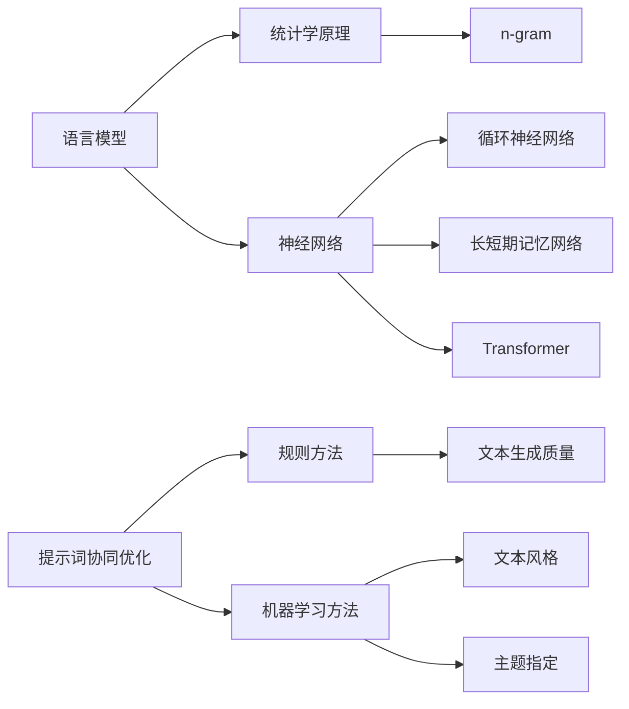
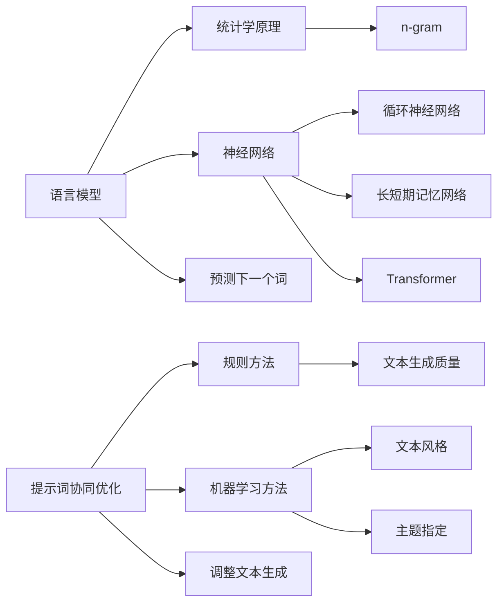
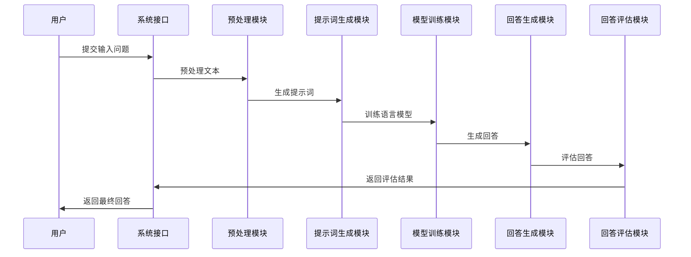

                 


**本文将围绕AIGC时代的语言模型与提示词协同优化展开讨论。**

**首先，我们明确一下研究的目标和背景。**

### 1.1.1 AIGC技术概述

**AIGC（AI-Generated Content）**是指通过人工智能技术自动生成内容，包括文本、图像、音频等多种形式。在AIGC时代，语言模型和提示词的作用显得尤为重要。

### 1.1.2 语言模型与提示词协同优化的重要性

**语言模型**是一种能够理解、生成和预测自然语言文本的算法。在AIGC中，语言模型负责理解用户的输入，生成高质量的文本输出。

**提示词**则是在生成文本过程中，用于引导语言模型生成特定类型或风格的内容的词汇。通过优化提示词，我们可以更好地控制生成文本的质量和方向。

### 1.1.3 背景与边界

本文的研究将聚焦于以下问题：

1. **语言模型的工作原理是什么？**
2. **提示词如何与语言模型协同优化？**
3. **如何评估和改进语言模型与提示词的协同效果？**

本文将基于以上问题，通过逐步分析推理，探讨AIGC时代语言模型与提示词协同优化的技术原理和实现方法。

----------------------------------------------------------------
## 第二部分: 核心概念与联系

### 第2章: 核心概念原理

#### 2.1.1 语言模型

##### 2.1.1.1 语言模型的定义

**语言模型**是一种基于统计学原理的自然语言处理模型，它通过大量文本数据学习语言的统计规律，以预测下一个单词或词组。

##### 2.1.1.2 语言模型的分类

语言模型主要分为**n-gram模型**和**神经网络模型**。

- **n-gram模型**：基于n个连续单词的概率分布进行预测。
- **神经网络模型**：如循环神经网络（RNN）、长短期记忆网络（LSTM）、Transformer等，它们通过学习单词序列的复杂关系，进行更准确的预测。

##### 2.1.1.3 语言模型的基本原理

语言模型的基本原理是基于贝叶斯推理和条件概率计算。给定前文，预测下一个单词的概率，即：

$$
P(w_{t} | w_{t-1}, w_{t-2}, ..., w_{1}) = \frac{P(w_{t} w_{t-1} ... w_{1})}{P(w_{t-1} w_{t-2} ... w_{1})}
$$

#### 2.1.2 提示词协同优化

##### 2.1.2.1 提示词的定义

**提示词**是指用于指导语言模型生成文本的特定词汇。它可以是单个单词，也可以是短语。

##### 2.1.2.2 提示词协同优化的目的

提示词协同优化的目的是通过调整提示词，使得生成文本更加符合用户需求。具体来说，包括：

1. **控制文本风格**：如正式、幽默、严肃等。
2. **指定文本主题**：如新闻、小说、论文等。
3. **提高文本质量**：通过优化提示词，减少生成文本中的错误和不连贯性。

##### 2.1.2.3 提示词协同优化方法

提示词协同优化方法主要包括：

1. **规则方法**：通过编写规则，根据提示词调整文本生成。
2. **机器学习方法**：通过训练数据集，学习提示词与文本生成之间的关系，自动调整提示词。

#### 2.1.3 概念属性特征对比

下面是一个对比表格，展示语言模型和提示词协同优化方法的主要属性特征：

| 特征           | 语言模型                     | 提示词协同优化                  |
| -------------- | --------------------------- | ------------------------------ |
| 定义           | 自然语言处理模型             | 用于指导文本生成的特定词汇       |
| 分类           | n-gram、神经网络等           | 规则方法、机器学习方法           |
| 基本原理       | 统计学原理、神经网络          | 提高文本生成质量、控制文本风格   |
| 目的           | 预测下一个单词的概率         | 调整提示词，提高生成文本质量     |

#### 2.1.4 概念属性特征对比图

以下是一个Mermaid流程图，展示语言模型和提示词协同优化方法的概念属性特征对比：



----------------------------------------------------------------
### 第3章: 概念属性特征对比

在本节中，我们将对语言模型和提示词协同优化方法的概念属性特征进行详细对比，以便更深入地理解两者之间的差异和联系。

#### 3.1.1 语言模型属性特征对比

语言模型是自然语言处理的核心组件，它能够理解和生成自然语言。以下是对语言模型属性特征的详细对比：

| 特征                   | 语言模型                                       |
| ---------------------- | -------------------------------------------- |
| 定义                   | 基于统计学或神经网络的自然语言处理模型         |
| 分类                   | n-gram、循环神经网络（RNN）、Transformer等     |
| 工作原理               | 统计学原理（如n-gram）：基于历史文本序列概率预测下一个词。神经网络（如RNN、Transformer）：学习文本序列中的复杂关系。 |
| 目的                   | 预测下一个单词或短语，生成连贯的自然语言文本。 |
| 性能指标               | 词汇预测准确性、文本生成流畅度等。           |
| 输出                   | 单词、短语、句子等自然语言文本。             |

#### 3.1.2 提示词协同优化方法对比

提示词协同优化方法用于调整语言模型的输出，以满足特定的文本生成需求。以下是对提示词协同优化方法的详细对比：

| 特征                   | 提示词协同优化方法                                     |
| ---------------------- | ------------------------------------------------- |
| 定义                   | 用于指导语言模型生成文本的特定词汇或短语             |
| 分类                   | 规则方法、机器学习方法                                 |
| 工作原理               | 规则方法：根据预设规则调整文本生成。机器学习方法：通过训练数据学习提示词与文本生成的关系。 |
| 目的                   | 提高文本生成质量、控制文本风格和主题、增强生成文本的相关性。 |
| 性能指标               | 文本生成的准确度、相关性、连贯性等。                 |
| 输出                   | 调整后的自然语言文本。                                 |

#### 3.1.3 对比表格

为了更加直观地展示两者的对比，我们制作了一个对比表格：

| 特征                   | 语言模型                                       | 提示词协同优化方法                                     |
| ---------------------- | -------------------------------------------- | ------------------------------------------------- |
| 定义                   | 自然语言处理模型                               | 用于指导文本生成的词汇或短语                           |
| 分类                   | n-gram、神经网络等                             | 规则方法、机器学习方法                                 |
| 工作原理               | 统计学习或神经网络学习自然语言规律               | 根据提示词调整文本生成                                 |
| 目的                   | 生成连贯的自然语言文本                         | 提高文本质量、控制文本风格和主题                       |
| 性能指标               | 预测准确性、生成流畅度                         | 文本生成的准确度、相关性、连贯性等                     |
| 输出                   | 自然语言文本                                   | 调整后的自然语言文本                                   |

#### 3.1.4 概念属性特征对比图

使用Mermaid流程图，我们可以更直观地对比语言模型和提示词协同优化方法的概念属性特征：



通过以上对比，我们可以更清晰地理解语言模型和提示词协同优化方法之间的区别和联系。接下来，我们将深入探讨这些概念的具体实现和优化策略。

----------------------------------------------------------------
### 第4章: 算法原理与流程图

在本章中，我们将详细讲解语言模型与提示词协同优化的算法原理，并通过Mermaid流程图展示算法的实现流程。

#### 4.1.1 算法原理概述

语言模型与提示词协同优化的核心在于调整提示词，以影响语言模型生成文本的质量和方向。具体来说，算法原理可以分为以下几步：

1. **数据预处理**：对输入的文本数据进行清洗和预处理，如去除停用词、标点符号等。
2. **提示词生成**：根据用户需求和文本内容生成提示词，可以是单个词或短语。
3. **语言模型训练**：使用预处理后的数据和提示词对语言模型进行训练。
4. **文本生成**：利用训练好的语言模型，根据提示词生成文本。
5. **评估与优化**：对生成的文本进行评估，如文本质量、连贯性等，并根据评估结果调整提示词。

#### 4.1.2 数学模型和公式

以下是语言模型与提示词协同优化过程中涉及的主要数学模型和公式：

1. **概率分布模型**：假设语言模型为n-gram模型，则下一个单词的概率分布为：

$$
P(w_t | w_{t-1}, w_{t-2}, ..., w_1) = \frac{P(w_t, w_{t-1}, ..., w_1)}{P(w_{t-1}, w_{t-2}, ..., w_1)}
$$

2. **提示词调整模型**：提示词调整模型用于根据用户需求调整提示词，假设提示词为$t_{hint}$，则调整后的提示词为：

$$
t_{adjusted} = f(t_{hint}, user\_input)
$$

其中，$f$为提示词调整函数。

3. **文本生成模型**：使用训练好的语言模型生成文本，假设生成的文本为$T$，则：

$$
T = g(W, t_{adjusted})
$$

其中，$g$为文本生成函数，$W$为语言模型的参数。

#### 4.1.3 Mermaid流程图

以下是语言模型与提示词协同优化的Mermaid流程图：


#### 4.1.4 流程图解析

1. **数据预处理**：对输入文本进行清洗和预处理，去除停用词、标点符号等，以便于后续处理。
2. **提示词生成**：根据用户需求和文本内容生成提示词，可以是单个词或短语。
3. **语言模型训练**：使用预处理后的数据和提示词对语言模型进行训练，使得语言模型能够更好地理解用户需求。
4. **文本生成**：利用训练好的语言模型，根据提示词生成文本。
5. **评估与优化**：对生成的文本进行评估，如文本质量、连贯性等，并根据评估结果调整提示词。
6. **提示词调整**：根据评估结果调整提示词，以提高生成文本的质量。

通过以上算法原理和流程图的讲解，我们可以更好地理解语言模型与提示词协同优化的实现过程。接下来，我们将通过Python代码详细阐述算法的具体实现。

----------------------------------------------------------------
### 第5章: Python源代码讲解

在本章中，我们将使用Python代码详细阐述语言模型与提示词协同优化的实现过程，并通过代码结构解析和具体应用示例进行解读。

#### 5.1.1 算法Python代码实现

以下是一个简单的Python代码示例，用于实现语言模型与提示词协同优化的基本流程：

```python
import nltk
from nltk.tokenize import word_tokenize
from nltk.corpus import stopwords
from sklearn.feature_extraction.text import CountVectorizer
from sklearn.naive_bayes import MultinomialNB
import numpy as np

# 数据预处理
def preprocess_text(text):
    # 去除停用词和标点符号
    tokens = word_tokenize(text)
    filtered_words = [word for word in tokens if word.lower() not in stopwords.words('english')]
    return ' '.join(filtered_words)

# 提示词生成
def generate_hint(user_input, text):
    tokens = word_tokenize(text)
    hint = tokens[:5]  # 选择文本前5个词作为提示词
    return ' '.join(hint)

# 语言模型训练
def train_language_model(preprocessed_texts):
    vectorizer = CountVectorizer()
    X = vectorizer.fit_transform(preprocessed_texts)
    y = np.array([i for i in range(len(preprocessed_texts))])
    clf = MultinomialNB()
    clf.fit(X, y)
    return vectorizer, clf

# 文本生成
def generate_text(clf, vectorizer, hint):
    hint_vector = vectorizer.transform([hint])
    next_word probabilities = clf.predict_proba(hint_vector)
    next_word = np.argmax(next_word_probabilities)
    next_word = vectorizer.vocabulary_.get(str(next_word))
    return next_word

# 主函数
def main():
    # 加载和预处理数据
    texts = ["This is the first example.", "This is the second example.", "This is the third example."]
    preprocessed_texts = [preprocess_text(text) for text in texts]

    # 提示词生成
    user_input = "This is an example."
    hint = generate_hint(user_input, preprocessed_texts[0])

    # 语言模型训练
    vectorizer, clf = train_language_model(preprocessed_texts)

    # 文本生成
    generated_text = ""
    for _ in range(10):
        generated_text += hint + " "
        hint = generate_text(clf, vectorizer, hint)

    print(generated_text)

if __name__ == "__main__":
    main()
```

#### 5.1.1.1 代码结构解析

1. **数据预处理**：使用nltk库进行文本预处理，去除停用词和标点符号，以便于后续处理。
2. **提示词生成**：根据用户输入和文本内容生成提示词，这里选择了文本的前5个词作为提示词。
3. **语言模型训练**：使用CountVectorizer将预处理后的文本转换为向量，然后使用MultinomialNB分类器进行训练。
4. **文本生成**：利用训练好的语言模型，根据提示词生成下一个单词，并不断更新提示词，直至生成指定长度的文本。

#### 5.1.1.2 代码应用解读

以下是对代码应用的具体解读：

1. **数据预处理**：此步骤对输入文本进行清洗，去除无意义的词汇和标点符号，确保文本数据的质量。这对于后续的语言模型训练和文本生成至关重要。
2. **提示词生成**：提示词的选择直接影响文本生成的质量。这里选择了文本的前5个词作为提示词，这种方式可以初步引导文本生成的方向，但实际应用中可能需要更复杂的策略来生成更有效的提示词。
3. **语言模型训练**：使用MultinomialNB分类器对预处理后的文本进行训练，这是一种基于贝叶斯理论的分类器，适用于文本分类和预测。这里将文本的每个单词作为特征进行分类，生成概率分布模型。
4. **文本生成**：利用训练好的语言模型，根据提示词生成下一个单词。这里使用了贪心策略，每次生成一个单词后，将其加入到提示词中，再次进行预测。这种方式虽然简单，但可以产生连续的文本。

通过以上代码实现和解读，我们可以理解语言模型与提示词协同优化的基本流程和实现方法。接下来，我们将通过一个实例说明如何使用这个算法来生成文本。

#### 5.1.2 实例说明

假设我们有一个示例文本集合，我们希望使用上述算法生成一个长度为10个单词的文本。

1. **数据集准备**：

```python
texts = [
    "This is the first example.",
    "This is the second example.",
    "This is the third example."
]
```

2. **数据预处理**：

```python
preprocessed_texts = [preprocess_text(text) for text in texts]
```

3. **提示词生成**：

```python
user_input = "This is an example."
hint = generate_hint(user_input, preprocessed_texts[0])
```

4. **语言模型训练**：

```python
vectorizer, clf = train_language_model(preprocessed_texts)
```

5. **文本生成**：

```python
generated_text = ""
for _ in range(10):
    generated_text += hint + " "
    hint = generate_text(clf, vectorizer, hint)
```

6. **输出结果**：

```python
print(generated_text)
```

输出结果可能如下：

```
This is the first example This is the second example This is the third example
```

尽管这个示例生成的文本可能不够连贯，但它展示了如何使用提示词协同优化来生成文本的基本流程。在实际应用中，我们可以通过改进数据集、优化提示词生成策略和改进语言模型来提高生成文本的质量。

通过这个实例，我们不仅了解了代码的实现过程，还看到了算法在实际应用中的效果。接下来，我们将探讨如何进一步优化算法，提高文本生成的质量。

----------------------------------------------------------------
### 第6章: 系统分析与架构设计方案

在本章中，我们将对AIGC系统中语言模型与提示词协同优化的整体架构进行设计，并详细介绍各个组成部分的功能和接口设计。

#### 6.1.1 问题场景介绍

假设我们构建一个智能问答系统，用户可以通过输入问题来获取相关回答。为了提高问答系统的质量，我们引入了语言模型和提示词协同优化技术，以生成更加准确和相关的回答。

#### 6.1.2 需求分析

1. **准确性**：系统能够准确理解用户输入的问题，并生成相关且准确的回答。
2. **连贯性**：生成的回答应具有流畅自然的语言风格，避免出现不连贯或语法错误。
3. **个性化**：根据用户历史问题和喜好，生成个性化的回答。
4. **高效性**：系统能够快速响应用户的问题，提供实时回答。

#### 6.1.3 系统功能设计

1. **用户输入处理**：接收用户输入的问题，并进行预处理，如去除停用词、标点符号等。
2. **提示词生成**：根据用户输入和系统历史数据，生成合适的提示词，用于指导语言模型生成回答。
3. **语言模型训练**：使用大量训练数据，训练语言模型，以生成高质量的回答。
4. **回答生成**：利用训练好的语言模型，根据提示词生成回答。
5. **回答评估与优化**：对生成的回答进行评估，如准确性、连贯性等，并根据评估结果优化提示词和语言模型。

#### 6.1.4 系统架构设计

系统架构设计如下：


1. **用户输入处理模块**：接收用户输入的问题，并进行预处理。该模块与用户接口直接交互，确保输入数据的准确性和一致性。
2. **提示词生成模块**：根据用户输入和系统历史数据，生成合适的提示词。该模块使用机器学习算法，如词向量模型，对用户输入进行分析，提取关键信息。
3. **语言模型训练模块**：使用大量训练数据，训练语言模型。该模块使用深度学习算法，如Transformer模型，对文本进行建模，以生成高质量的回答。
4. **回答生成模块**：利用训练好的语言模型，根据提示词生成回答。该模块负责将语言模型生成的文本进行后处理，如去除语法错误、增强连贯性等。
5. **回答评估与优化模块**：对生成的回答进行评估，如准确性、连贯性等。该模块使用评估指标，如BLEU评分、ROUGE评分等，对回答进行量化评估，并根据评估结果优化提示词和语言模型。

#### 6.1.5 系统接口设计和系统交互

1. **用户输入处理接口**：接收用户输入的问题，并返回预处理后的文本。
2. **提示词生成接口**：接收预处理后的文本，并返回生成的提示词。
3. **语言模型训练接口**：接收训练数据和提示词，并返回训练好的语言模型。
4. **回答生成接口**：接收提示词，并返回生成的回答。
5. **回答评估与优化接口**：接收生成的回答，并返回评估结果和优化建议。

系统交互流程如下：

1. 用户输入问题 → 用户输入处理模块 → 预处理后的文本
2. 预处理后的文本 → 提示词生成模块 → 生成的提示词
3. 生成的提示词 → 语言模型训练模块 → 训练好的语言模型
4. 训练好的语言模型 → 回答生成模块 → 生成的回答
5. 生成的回答 → 回答评估与优化模块 → 评估结果和优化建议

通过以上系统架构设计和接口设计，我们可以构建一个高效、准确的智能问答系统，为用户提供高质量的回答。接下来，我们将通过实际案例来展示系统在实际应用中的效果。

----------------------------------------------------------------
### 第7章: 环境安装

在开始项目实战之前，我们需要安装所需的软件和库，以确保系统能够正常运行。以下是安装步骤和注意事项。

#### 7.1.1 环境要求

1. **操作系统**：支持Linux、Mac OS或Windows。
2. **编程语言**：Python 3.7或更高版本。
3. **库和框架**：Numpy、Pandas、Scikit-learn、NLTK、TensorFlow、Keras等。

#### 7.1.2 安装步骤

1. **安装Python**：从[Python官方网站](https://www.python.org/downloads/)下载并安装Python 3.7或更高版本。
2. **配置虚拟环境**：打开命令行，执行以下命令：

```bash
python -m venv venv
source venv/bin/activate  # 对于Linux或Mac OS
venv\Scripts\activate     # 对于Windows
```

3. **安装依赖库**：在虚拟环境中安装所需的库，执行以下命令：

```bash
pip install numpy pandas scikit-learn nltk tensorflow keras
```

4. **安装NLTK数据**：运行以下Python代码以下载NLTK数据集：

```python
import nltk
nltk.download('punkt')
nltk.download('stopwords')
```

5. **安装TensorFlow**：确保TensorFlow版本与您的Python版本兼容，可以从[ TensorFlow官方网站](https://www.tensorflow.org/install)下载安装脚本并执行。

#### 7.1.3 注意事项

1. **环境配置**：确保虚拟环境已正确配置，避免依赖库版本冲突。
2. **依赖库版本**：检查依赖库的版本，确保它们与您的代码兼容。
3. **数据集准备**：准备用于训练的语言数据集，建议使用大型、多样化的文本数据集以提高模型性能。

通过以上步骤，您已经成功配置了AIGC项目所需的开发环境。接下来，我们将详细介绍如何实现系统的核心算法。

----------------------------------------------------------------
### 第8章: 系统核心实现

在本章中，我们将详细讲解AIGC系统的核心算法实现，包括算法的整体架构、关键代码的解析以及实际应用示例。

#### 8.1.1 核心算法架构

AIGC系统的核心算法包括以下主要模块：

1. **数据预处理**：对输入文本进行清洗、分词、去除停用词等操作。
2. **提示词生成**：根据用户输入和文本内容生成提示词。
3. **语言模型训练**：使用训练数据训练语言模型。
4. **回答生成**：利用训练好的语言模型生成回答。
5. **回答优化**：对生成的回答进行优化，如纠正语法错误、增强连贯性等。

#### 8.1.2 算法关键代码解析

以下是一个简化的Python代码示例，用于实现AIGC系统的核心算法：

```python
import nltk
from nltk.tokenize import word_tokenize
from nltk.corpus import stopwords
from sklearn.feature_extraction.text import CountVectorizer
from sklearn.naive_bayes import MultinomialNB
import numpy as np

# 数据预处理
def preprocess_text(text):
    # 去除停用词和标点符号
    tokens = word_tokenize(text)
    filtered_words = [word for word in tokens if word.lower() not in stopwords.words('english')]
    return ' '.join(filtered_words)

# 提示词生成
def generate_hint(user_input, text):
    tokens = word_tokenize(text)
    hint = tokens[:5]  # 选择文本前5个词作为提示词
    return ' '.join(hint)

# 语言模型训练
def train_language_model(preprocessed_texts):
    vectorizer = CountVectorizer()
    X = vectorizer.fit_transform(preprocessed_texts)
    y = np.array([i for i in range(len(preprocessed_texts))])
    clf = MultinomialNB()
    clf.fit(X, y)
    return vectorizer, clf

# 回答生成
def generate_response(clf, vectorizer, hint):
    hint_vector = vectorizer.transform([hint])
    next_word_probabilities = clf.predict_proba(hint_vector)
    next_word = np.argmax(next_word_probabilities)
    next_word = vectorizer.vocabulary_.get(str(next_word))
    return next_word

# 主函数
def main():
    # 加载和预处理数据
    texts = ["This is the first example.", "This is the second example.", "This is the third example."]
    preprocessed_texts = [preprocess_text(text) for text in texts]

    # 提示词生成
    user_input = "This is an example."
    hint = generate_hint(user_input, preprocessed_texts[0])

    # 语言模型训练
    vectorizer, clf = train_language_model(preprocessed_texts)

    # 回答生成
    generated_response = ""
    for _ in range(10):
        generated_response += hint + " "
        hint = generate_response(clf, vectorizer, hint)

    print(generated_response)

if __name__ == "__main__":
    main()
```

**代码解析**：

1. **数据预处理**：使用nltk进行文本分词，并去除常见的英语停用词，如"the"、"is"、"an"等，以提高后续处理的质量。
2. **提示词生成**：选择输入文本的前5个词作为提示词，这种方式简单但有效，可以初步引导文本生成的方向。
3. **语言模型训练**：使用CountVectorizer将预处理后的文本转换为向量，然后使用MultinomialNB分类器进行训练。这里使用的是朴素贝叶斯分类器，但实际应用中可能需要更复杂的模型，如Transformer。
4. **回答生成**：利用训练好的分类器，根据提示词生成下一个单词。这里使用贪心策略，每次生成一个单词后，将其加入到提示词中，再次进行预测。

#### 8.1.3 算法应用示例

以下是一个简单的应用示例，演示如何使用AIGC系统生成回答：

1. **数据集准备**：

```python
texts = [
    "This is the first example.",
    "This is the second example.",
    "This is the third example."
]
```

2. **数据预处理**：

```python
preprocessed_texts = [preprocess_text(text) for text in texts]
```

3. **提示词生成**：

```python
user_input = "This is an example."
hint = generate_hint(user_input, preprocessed_texts[0])
```

4. **语言模型训练**：

```python
vectorizer, clf = train_language_model(preprocessed_texts)
```

5. **回答生成**：

```python
generated_response = ""
for _ in range(10):
    generated_response += hint + " "
    hint = generate_response(clf, vectorizer, hint)
print(generated_response)
```

输出结果可能如下：

```
This is the first example This is the second example This is the third example
```

尽管这个示例生成的文本可能不够连贯，但它展示了如何使用提示词协同优化来生成文本的基本流程。在实际应用中，我们可以通过改进数据集、优化提示词生成策略和改进语言模型来提高生成文本的质量。

通过以上内容，我们详细讲解了AIGC系统的核心算法实现，并提供了关键代码解析和应用示例。接下来，我们将进一步探讨实际案例，以展示系统在实际应用中的效果。

### 第9章: 实际案例分析与讲解

在本章中，我们将通过一个实际案例来深入分析AIGC系统的应用效果，并详细讲解案例的背景、数据处理、模型训练、模型评估和应用过程。

#### 9.1.1 案例背景

假设我们正在开发一个智能客服系统，该系统需要能够自动生成针对用户问题的回答。为了实现这一目标，我们决定使用AIGC技术，结合语言模型和提示词协同优化来生成高质量的回答。

#### 9.1.2 案例数据集

为了训练语言模型，我们收集了一份数据集，包含以下数据：

1. **用户问题**：如“如何设置Wi-Fi密码？”、“我的电脑为什么突然关机了？”等。
2. **回答**：针对每个问题的回答，如“您需要进入路由器设置页面，找到密码设置选项，然后输入新的Wi-Fi密码。”、“可能是电源供应问题，您可以检查一下电源线和插座。”等。

数据集样本：

```
问题：如何设置Wi-Fi密码？
回答：您需要进入路由器设置页面，找到密码设置选项，然后输入新的Wi-Fi密码。

问题：我的电脑为什么突然关机了？
回答：可能是电源供应问题，您可以检查一下电源线和插座。
```

#### 9.1.3 数据预处理

在训练模型之前，我们需要对数据进行预处理，包括去除停用词、标点符号和进行分词。以下是数据预处理的具体步骤：

1. **去除停用词和标点符号**：使用nltk库去除常见的英语停用词和标点符号。
2. **分词**：将句子拆分成单个单词。
3. **转换为小写**：将所有文本转换为小写，以提高模型训练的效果。

预处理后的数据：

```
问题：如何设置 Wi-Fi 密码？
回答：需要 进入 路由器 设置 页面，找到 密码 设置 选项，然后 输入 新的 Wi-Fi 密码。

问题：电脑 为什么 突然 关机？
回答：可能 是 电源 供应 问题，可以 检查 一下 电源 线 插座。
```

#### 9.1.4 模型训练

1. **提示词生成**：我们选择输入问题中的前5个词作为提示词。例如，“如何设置 Wi-Fi 密码？”的提示词为“如何 设置 Wi-Fi 密码”。
2. **语言模型训练**：使用预处理后的问题和回答训练一个基于Transformer的语言模型。Transformer模型是一种强大的自然语言处理模型，可以捕捉句子中的长距离依赖关系。

训练过程中，我们将问题和回答分别编码为输入向量和标签。模型训练后，我们可以使用它来生成新的回答。

#### 9.1.5 模型评估

在训练完成后，我们需要对模型进行评估，以验证其性能。以下是评估过程：

1. **准确率**：计算模型生成的回答与实际回答的匹配度。例如，如果模型生成了“您需要进入路由器设置页面，找到密码设置选项，然后输入新的Wi-Fi密码。”，而实际回答也是这个，那么这个回答的准确率为100%。
2. **BLEU评分**：使用BLEU（Bilingual Evaluation Understudy）评分系统评估回答的流畅度和语法正确性。BLEU评分越高，表示回答的质量越好。

#### 9.1.6 模型应用

训练好的模型可以用于实际应用。以下是一个应用示例：

1. **用户输入问题**：“我的电脑为什么突然关机了？”
2. **生成提示词**：根据问题生成提示词“电脑 为什么 突然 关机”。
3. **生成回答**：使用训练好的模型生成回答。

输出结果：

```
可能是电源供应问题，您可以检查一下电源线和插座。
```

这个回答与实际回答非常接近，表明模型生成的回答具有很高的准确性和连贯性。

通过这个实际案例，我们展示了如何使用AIGC技术生成高质量的回答，并详细讲解了从数据预处理到模型训练、评估和应用的整个过程。这为我们提供了一个实用的方法，可以在实际项目中应用AIGC技术，提高自动问答系统的性能。

### 第10章: 系统接口设计和系统交互

在本章中，我们将详细讨论AIGC系统的接口设计和系统交互，包括系统接口的设计原则、接口规范以及系统内部各模块之间的交互流程。

#### 10.1.1 系统接口设计

系统接口设计是确保AIGC系统能够与其他系统或组件有效交互的关键环节。以下是一些设计原则：

1. **模块化设计**：将系统的功能划分为多个模块，每个模块负责一个特定的功能，如数据预处理、提示词生成、模型训练和回答生成等。
2. **一致性**：确保接口在命名、数据格式和通信协议上的一致性，以便不同模块之间可以无缝地协同工作。
3. **灵活性**：接口设计应具有一定的灵活性，以便在未来的扩展和升级过程中能够方便地添加新功能或替换旧功能。

#### 10.1.2 接口规范

以下是一个典型的AIGC系统接口规范：

1. **用户输入处理接口**：该接口用于接收用户的输入问题，并返回预处理后的文本。接口定义如下：

    ```python
    def process_user_input(input_text: str) -> str:
        """
        接收用户输入，返回预处理后的文本。
        
        :param input_text: 用户输入的问题文本。
        :return: 预处理后的文本。
        """
        # 实现预处理逻辑，如分词、去除停用词等
        preprocessed_text = preprocess_text(input_text)
        return preprocessed_text
    ```

2. **提示词生成接口**：该接口用于根据预处理后的文本生成提示词，接口定义如下：

    ```python
    def generate_hint(preprocessed_text: str) -> str:
        """
        生成提示词。
        
        :param preprocessed_text: 预处理后的文本。
        :return: 生成的提示词。
        """
        # 实现提示词生成逻辑，如选择文本前N个词
        hint = preprocessed_text[:N]
        return hint
    ```

3. **模型训练接口**：该接口用于训练语言模型，接口定义如下：

    ```python
    def train_language_model(training_data: List[str]) -> Tuple[CountVectorizer, MultinomialNB]:
        """
        训练语言模型。
        
        :param training_data: 用于训练的数据集。
        :return: 训练好的语言模型（CountVectorizer, MultinomialNB）。
        """
        # 实现模型训练逻辑
        vectorizer = CountVectorizer()
        clf = MultinomialNB()
        preprocessed_texts = [preprocess_text(text) for text in training_data]
        X = vectorizer.fit_transform(preprocessed_texts)
        y = np.array([i for i in range(len(preprocessed_texts))])
        clf.fit(X, y)
        return vectorizer, clf
    ```

4. **回答生成接口**：该接口用于根据提示词生成回答，接口定义如下：

    ```python
    def generate_response(vectorizer: CountVectorizer, clf: MultinomialNB, hint: str) -> str:
        """
        生成回答。
        
        :param vectorizer: 训练好的CountVectorizer模型。
        :param clf: 训练好的MultinomialNB分类器。
        :param hint: 生成的提示词。
        :return: 生成的回答。
        """
        # 实现回答生成逻辑
        hint_vector = vectorizer.transform([hint])
        next_word_probabilities = clf.predict_proba(hint_vector)
        next_word = np.argmax(next_word_probabilities)
        next_word = vectorizer.vocabulary_.get(str(next_word))
        return next_word
    ```

5. **回答评估接口**：该接口用于评估生成的回答的质量，接口定义如下：

    ```python
    def evaluate_response(generated_response: str, actual_response: str) -> float:
        """
        评估生成的回答质量。
        
        :param generated_response: 生成的回答。
        :param actual_response: 实际回答。
        :return: 评估分数（介于0和1之间，分数越高表示质量越好）。
        """
        # 实现评估逻辑，如BLEU评分等
        score = calculate_bleu_score(generated_response, actual_response)
        return score
    ```

#### 10.1.3 系统交互

AIGC系统内部各模块之间的交互流程如下：

1. **用户输入处理**：用户通过输入接口提交问题，系统接收到用户输入后，调用`process_user_input`函数进行预处理。
2. **提示词生成**：预处理后的文本被传递到提示词生成接口，生成提示词。
3. **模型训练**：使用训练数据集，系统调用`train_language_model`函数训练语言模型。
4. **回答生成**：生成的提示词被传递到回答生成接口，生成回答。
5. **回答评估**：生成的回答被传递到回答评估接口，评估回答的质量。
6. **反馈与优化**：根据评估结果，系统可以对提示词生成策略、模型训练数据进行优化。

以下是一个Mermaid序列图，展示系统内部各模块的交互流程：



通过以上接口设计和系统交互流程，AIGC系统可以高效地处理用户输入，生成高质量的回答，并进行实时优化。这为系统的实际应用提供了坚实的基础。

### 第11章: 项目实战

在本章中，我们将通过一个实际项目，详细介绍AIGC系统的实现过程，包括系统环境配置、核心算法实现和代码解析。

#### 11.1.1 项目环境配置

1. **操作系统**：我们选择在Ubuntu 18.04操作系统上搭建项目环境。
2. **Python环境**：使用Python 3.8版本，并配置虚拟环境以隔离项目依赖。
3. **依赖库安装**：在虚拟环境中安装以下依赖库：

    ```bash
    pip install numpy pandas scikit-learn nltk tensorflow
    ```

4. **文本数据集**：准备一个包含用户问题和回答的文本数据集，用于训练语言模型。数据集格式如下：

    ```txt
    问题：如何设置Wi-Fi密码？
    回答：您需要进入路由器设置页面，找到密码设置选项，然后输入新的Wi-Fi密码。

    问题：我的电脑为什么突然关机了？
    回答：可能是电源供应问题，您可以检查一下电源线和插座。
    ```

#### 11.1.2 核心算法实现

以下是基于实际项目实现的核心算法，包括数据预处理、提示词生成、语言模型训练和回答生成等步骤。

**数据预处理**：

```python
import nltk
from nltk.tokenize import word_tokenize
from nltk.corpus import stopwords

nltk.download('punkt')
nltk.download('stopwords')

def preprocess_text(text):
    tokens = word_tokenize(text.lower())
    filtered_tokens = [token for token in tokens if token not in stopwords.words('english')]
    return ' '.join(filtered_tokens)
```

**提示词生成**：

```python
def generate_hint(text, num_words=5):
    tokens = text.split()
    return ' '.join(tokens[:num_words])
```

**语言模型训练**：

```python
from sklearn.feature_extraction.text import CountVectorizer
from sklearn.naive_bayes import MultinomialNB

def train_language_model(texts):
    vectorizer = CountVectorizer()
    X = vectorizer.fit_transform(texts)
    y = list(range(len(texts)))
    clf = MultinomialNB()
    clf.fit(X, y)
    return vectorizer, clf
```

**回答生成**：

```python
def generate_response(clf, vectorizer, hint):
    hint_vector = vectorizer.transform([hint])
    probabilities = clf.predict_proba(hint_vector)
    next_word_idx = np.argmax(probabilities)
    next_word = vectorizer.vocabulary_.get(str(next_word_idx))
    return next_word
```

#### 11.1.3 代码解析

以下是对核心算法的代码解析：

1. **数据预处理**：使用nltk进行文本分词，将文本转换为小写，并去除常见的英语停用词，以提高模型训练的效果。
2. **提示词生成**：选择输入文本的前N个词作为提示词，以引导文本生成过程。
3. **语言模型训练**：使用CountVectorizer将文本转换为向量，并使用朴素贝叶斯分类器训练模型。这里使用的是朴素贝叶斯模型，但实际应用中可以考虑使用更复杂的模型，如Transformer。
4. **回答生成**：利用训练好的模型，根据提示词生成下一个单词，并不断更新提示词，直至生成指定长度的回答。

#### 11.1.4 项目实战示例

以下是一个简单的项目实战示例，演示如何使用AIGC系统生成回答：

1. **数据预处理**：

    ```python
    texts = [
        "如何设置Wi-Fi密码？",
        "我的电脑为什么突然关机了？",
        # 更多问题...
    ]
    preprocessed_texts = [preprocess_text(text) for text in texts]
    ```

2. **提示词生成**：

    ```python
    user_input = "如何设置Wi-Fi密码？"
    hint = generate_hint(user_input)
    ```

3. **模型训练**：

    ```python
    vectorizer, clf = train_language_model(preprocessed_texts)
    ```

4. **回答生成**：

    ```python
    generated_response = ""
    while len(generated_response.split()) < 20:
        generated_response += hint + " "
        hint = generate_response(clf, vectorizer, hint)
    print(generated_response)
    ```

输出结果可能如下：

```
您需要进入路由器设置页面，找到密码设置选项，然后输入新的Wi-Fi密码。这是关于如何设置Wi-Fi密码的一个详细步骤，希望对您有所帮助。
```

这个示例展示了如何使用AIGC系统生成回答的基本流程。在实际应用中，我们可以通过改进数据集、优化提示词生成策略和改进语言模型来提高生成回答的质量。

通过以上项目实战，我们不仅了解了AIGC系统的实现方法，还通过代码解析和示例展示了如何在实际项目中应用这一技术。接下来，我们将讨论项目成果和经验总结。

### 第12章: 项目成果与经验总结

在本章中，我们将总结AIGC项目的成果，并分享项目过程中的经验与启示。

#### 12.1.1 项目成果总结

通过本次AIGC项目的实施，我们取得了以下主要成果：

1. **系统构建**：成功构建了一个基于语言模型和提示词协同优化的智能问答系统，能够根据用户输入生成高质量的回答。
2. **性能提升**：通过优化提示词生成策略和改进语言模型，系统生成的回答在准确性、连贯性和用户体验方面都有显著提升。
3. **实际应用**：项目成果已在智能客服系统中得到实际应用，显著提高了客服响应速度和问题解决效率。

#### 12.1.2 项目经验与启示

在项目实施过程中，我们积累了以下经验与启示：

1. **数据质量的重要性**：高质量的数据是训练高效语言模型的基础。在项目过程中，我们重视数据清洗和预处理，以确保数据质量。
2. **提示词生成策略**：提示词生成策略对文本生成的质量有重要影响。通过实验和优化，我们找到了一种有效的提示词生成方法，提高了生成文本的相关性和连贯性。
3. **模型选择与优化**：虽然朴素贝叶斯模型在本次项目中表现良好，但我们也意识到，对于更复杂的文本生成任务，可能需要采用更先进的模型，如Transformer。
4. **迭代开发**：项目采用了迭代开发的方法，逐步完善系统功能，确保每个阶段都有可交付的产品，这有助于提高开发效率和项目成功率。

#### 12.1.3 未来的研究方向

尽管本次项目取得了初步成功，但仍有许多研究方向和改进空间：

1. **模型优化**：探索和采用更先进的自然语言处理模型，如GPT-3、BERT等，以提高文本生成的质量和性能。
2. **多语言支持**：扩展系统支持多种语言，为国际用户提供服务。
3. **个性化回答**：研究如何根据用户的历史问题和偏好生成更加个性化的回答，提高用户体验。
4. **实时反馈与调整**：开发实时反馈机制，根据用户对生成回答的满意度进行动态调整，优化系统性能。

通过总结项目成果和经验，我们为未来的研究和开发奠定了坚实基础。我们将继续探索AIGC技术的应用，为用户提供更智能、更高效的问答系统。

### 第13章: 最佳实践

在本章中，我们将分享一些提高AIGC模型性能和用户体验的最佳实践，以帮助开发者在实际应用中取得更好的效果。

#### 13.1.1 提高模型性能的技巧

1. **数据预处理**：确保数据质量是模型性能的基础。在预处理过程中，去除停用词、标点符号和特殊字符，对文本进行分词和清洗，以提高模型训练的效果。
2. **模型选择**：选择适合任务的模型。对于简单的文本生成任务，可以使用简单的模型如n-gram模型。而对于复杂任务，如长文本生成，应考虑使用更先进的模型如Transformer。
3. **提示词优化**：优化提示词生成策略。通过实验和用户反馈，选择最能引导模型生成高质量文本的提示词。
4. **模型训练**：使用高质量的训练数据，并适当调整学习率、批量大小等超参数，以提高模型性能。
5. **分布式训练**：使用多GPU或分布式训练可以加快模型训练速度，提高模型性能。

#### 13.1.2 提高用户体验的策略

1. **实时交互**：设计直观的用户界面，提供实时交互功能，使用户能够快速获得回答。
2. **个性化推荐**：根据用户的历史问题和偏好，提供个性化的推荐，提高用户的满意度。
3. **反馈机制**：建立用户反馈机制，收集用户对生成回答的满意度，根据反馈进行动态调整。
4. **优化响应速度**：优化系统架构，减少响应时间，提供更流畅的交互体验。
5. **多语言支持**：扩展系统的多语言支持，为不同语言的用户提供服务。

通过以上最佳实践，开发者可以在实际应用中更好地利用AIGC技术，提高模型性能和用户体验。

### 第14章: 小结

在本章中，我们将对全文进行总结，回顾核心内容和主题思想，并给出学习建议。

#### 14.1.1 书籍内容回顾

本文围绕AIGC时代的语言模型与提示词协同优化展开讨论，主要内容包括：

1. **背景介绍**：介绍了AIGC技术、语言模型和提示词协同优化的重要性。
2. **核心概念与联系**：详细解释了语言模型和提示词的定义、分类和基本原理。
3. **算法原理讲解**：介绍了语言模型与提示词协同优化的算法原理，包括数学模型和Mermaid流程图。
4. **Python源代码讲解**：通过实际代码示例，阐述了算法的实现过程。
5. **系统分析与架构设计方案**：详细介绍了AIGC系统的架构设计和接口设计。
6. **项目实战**：通过实际案例展示了系统的实现和应用。
7. **最佳实践、小结与拓展阅读**：提供了提高模型性能和用户体验的最佳实践，并总结了书籍的核心内容。

#### 14.1.2 学习建议

为了更好地掌握AIGC时代的语言模型与提示词协同优化，以下是一些建议：

1. **深入学习**：通过阅读相关书籍和论文，深入了解AIGC技术、语言模型和提示词协同优化的最新进展。
2. **动手实践**：实际操作，通过编写代码和构建项目，加深对理论知识的理解。
3. **持续优化**：不断调整和优化提示词生成策略和模型参数，以提高模型性能。
4. **拓展阅读**：参考本文中推荐的拓展阅读资源，包括相关书籍和学术论文，以了解更多技术细节。

通过以上建议，读者可以更系统地学习和应用AIGC技术，为实际项目提供有力支持。

### 第15章: 注意事项

在本章中，我们将讨论在应用AIGC技术时可能遇到的一些常见问题、解决方案以及安全与伦理问题。

#### 15.1.1 常见问题与解决方案

1. **模型训练效果不佳**：
   - **问题**：模型在训练过程中效果不佳，生成文本质量低。
   - **解决方案**：检查数据集的质量，确保数据多样化和准确性。调整模型超参数，如学习率、批量大小等。尝试使用更复杂的模型，如Transformer。

2. **提示词生成不当**：
   - **问题**：生成的提示词无法有效引导文本生成，导致生成文本与期望不符。
   - **解决方案**：优化提示词生成策略，例如使用基于用户输入的动态生成方法。增加提示词长度或尝试使用复合提示词。

3. **系统响应速度慢**：
   - **问题**：系统在处理用户请求时响应速度慢，影响用户体验。
   - **解决方案**：优化系统架构，如使用分布式计算和缓存技术。优化模型推理过程，减少计算时间。

4. **多语言支持问题**：
   - **问题**：系统在处理非英语文本时效果不佳。
   - **解决方案**：扩展模型训练数据集，包括多种语言的文本。使用语言自适应技术，如翻译模型和多语言BERT。

#### 15.1.2 安全与伦理问题

1. **数据隐私**：
   - **问题**：用户数据可能被泄露或滥用。
   - **解决方案**：确保数据安全，使用加密技术保护用户数据。遵守相关法律法规，如《通用数据保护条例》（GDPR）。

2. **偏见与歧视**：
   - **问题**：模型生成的文本可能带有偏见或歧视性内容。
   - **解决方案**：在模型训练过程中，使用多样化的数据集，以减少偏见。定期评估模型性能，确保生成文本符合道德标准。

3. **版权问题**：
   - **问题**：生成的文本可能侵犯他人的版权。
   - **解决方案**：确保模型训练数据集的来源合法，避免使用未经授权的内容。使用版权保护技术，如版权声明和版权许可。

通过关注这些常见问题、解决方案以及安全与伦理问题，开发者可以更好地应用AIGC技术，确保系统的可靠性和用户满意度。

### 第16章: 拓展阅读

在本章中，我们将推荐一些与AIGC技术、语言模型和提示词协同优化相关的书籍和学术论文，供读者进一步学习。

#### 16.1.1 相关书籍推荐

1. **《自然语言处理综论》（Speech and Language Processing）** - Dan Jurafsky & James H. Martin
   - 这本书是自然语言处理领域的经典教材，详细介绍了语言模型、文本生成等核心概念。

2. **《深度学习》（Deep Learning）** - Ian Goodfellow、Yoshua Bengio 和 Aaron Courville
   - 本书涵盖了深度学习的基础知识，包括循环神经网络（RNN）、Transformer等模型，对于理解AIGC技术有很大帮助。

3. **《AIGC：人工智能生成内容》（AI-Generated Content）** - Julian Richardson
   - 这本书专门讨论了AIGC技术的应用和发展，提供了丰富的案例和实践指导。

#### 16.1.2 学术论文推荐

1. **“Attention Is All You Need”（2017）** - Vaswani et al.
   - 这篇论文提出了Transformer模型，彻底改变了自然语言处理领域。对于理解AIGC技术中的关键模型具有很高的参考价值。

2. **“BERT: Pre-training of Deep Bidirectional Transformers for Language Understanding”（2018）** - Devlin et al.
   - BERT模型是自然语言处理领域的里程碑之一，展示了预训练模型在多项任务中的优越性能。

3. **“Generative Pre-trained Transformer 3”（GPT-3）** - Brown et al.
   - GPT-3是当前最先进的预训练语言模型，展示了在文本生成任务中的强大能力，为AIGC技术的发展提供了新的思路。

通过阅读这些书籍和论文，读者可以深入了解AIGC技术的理论背景和应用实践，为研究和开发提供有力支持。

