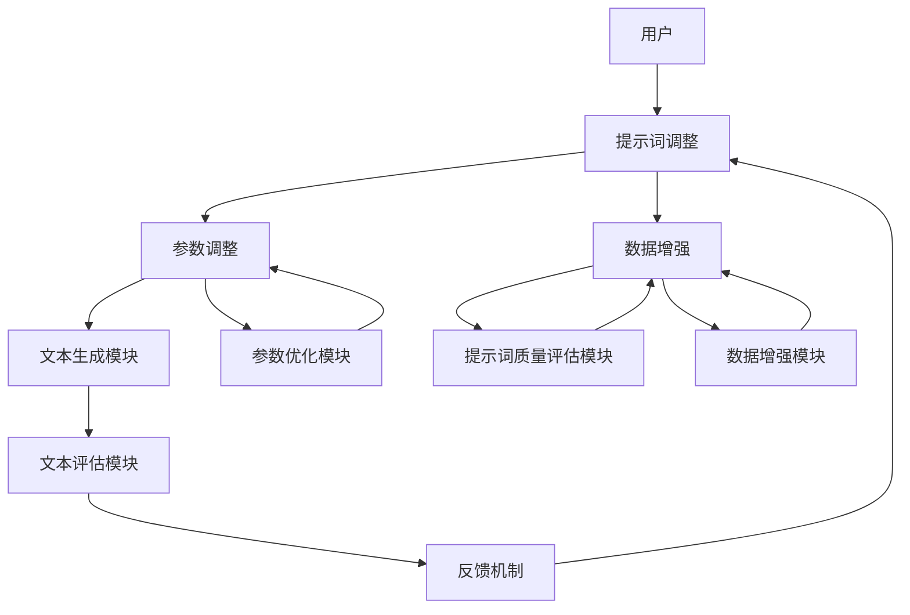

                 

# AIGC时代的语言模型与提示词协同优化策略

## 关键词：AIGC，语言模型，提示词，协同优化，内容生成

### 摘要：

随着AIGC（AI-Generated Content）时代的到来，语言模型和提示词技术成为了推动内容生成的重要力量。本文首先介绍了AIGC时代的问题背景，包括问题背景、问题描述、问题解决、边界与外延、概念结构与核心要素组成等。接着，详细讲解了核心概念与联系，包括语言模型原理、提示词分类以及语言模型与提示词的关系。然后，深入分析了算法原理讲解，包括GPT模型、BERT模型的原理和参数，以及语言模型与提示词协同优化的方法。此外，本文还运用数学模型和公式，详细阐述了语言模型和提示词优化数学模型。最后，提出了系统分析与架构设计方案，以及项目实战，通过实际案例分析和详细讲解，阐述了AIGC时代的语言模型与提示词协同优化策略的实际应用。

### 目录大纲

----------------------------------------------------------------

# AIGC时代的语言模型与提示词协同优化策略

## 第一部分：背景介绍

### 第1章 问题背景

- 1.1.1 问题背景
- 1.1.2 问题描述
- 1.1.3 问题解决
- 1.1.4 边界与外延
- 1.1.5 概念结构与核心要素组成

### 第2章 核心概念与联系

- 2.1.1 语言模型原理
- 2.1.2 提示词分类
- 2.1.3 语言模型与提示词关系

## 第二部分：算法原理讲解

### 第3章 算法原理讲解

- 3.1.1 GPT模型
- 3.1.2 BERT模型
- 3.1.3 语言模型与提示词协同优化

### 第4章 数学模型和数学公式

- 4.1.1 语言模型数学模型
- 4.1.2 提示词优化数学模型

## 第三部分：系统分析与架构设计方案

### 第5章 系统分析与架构设计方案

- 5.1.1 问题场景介绍
- 5.1.2 系统功能设计
- 5.1.3 系统架构设计
- 5.1.4 系统接口设计
- 5.1.5 系统交互

### 第6章 项目实战

- 6.1.1 环境安装
- 6.1.2 系统核心实现源代码
- 6.1.3 代码应用解读与分析
- 6.1.4 实际案例分析和详细讲解
- 6.1.5 项目小结

## 第四部分：最佳实践、小结、注意事项、拓展阅读

- 7.1 最佳实践
- 7.2 小结
- 7.3 注意事项
- 7.4 拓展阅读

----------------------------------------------------------------

## 第一部分：背景介绍

### 第1章 问题背景

#### 1.1.1 问题背景

随着互联网技术的快速发展，人们对于信息的需求量不断增加。然而，传统的人工内容生成方式已经无法满足日益增长的需求。为了解决这一难题，AIGC（AI-Generated Content）时代应运而生。AIGC是指利用人工智能技术，特别是自然语言处理技术，自动生成内容的一种新型内容生产方式。

在AIGC时代，语言模型和提示词技术成为了推动内容生成的重要力量。语言模型是一种能够预测下一个词的概率分布的模型，它通过对大量语料进行训练，能够生成连贯、符合语法规则的文本。而提示词则是用来引导语言模型生成内容的输入信息，它可以是关键词、短语、句子等。通过结合语言模型和提示词，可以实现高效的内容生成。

然而，如何实现语言模型与提示词的协同优化，提高内容生成的质量和效率，成为一个亟待解决的问题。本文将围绕这一问题，探讨AIGC时代下语言模型与提示词的协同优化策略。

#### 1.1.2 问题描述

在AIGC时代，语言模型和提示词的协同优化面临着以下问题：

1. 语言模型的特点与优势：
   - 语言模型基于大量语料训练，能够生成连贯、符合语法规则的文本。
   - 语言模型具有自适应性和泛化能力，能够适应不同的应用场景。
   - 语言模型的生成速度较快，能够满足实时内容生成的需求。

2. 提示词的作用与分类：
   - 提示词用于引导语言模型生成内容，它可以是关键词、短语、句子等。
   - 提示词的作用在于提供必要的信息，指导语言模型生成更加相关、准确的内容。

3. 语言模型与提示词的协同机制：
   - 语言模型与提示词之间需要建立协同机制，使得语言模型能够更好地理解提示词的含义，从而生成更加符合需求的内容。

4. 语言模型与提示词的优化策略：
   - 需要针对语言模型和提示词进行优化，以提高内容生成的质量和效率。

5. 实际应用案例与效果评估：
   - 需要结合实际应用场景，对语言模型与提示词的协同优化策略进行效果评估。

#### 1.1.3 问题解决

为了解决上述问题，本文将从以下几个方面进行探讨：

1. 详细介绍语言模型的特点与优势，包括生成式语言模型如GPT、BERT等。

2. 分析提示词的作用与分类，包括关键词、短语、句子等。

3. 探讨语言模型与提示词的协同机制，包括提示词引导语言模型生成内容的过程。

4. 提出一系列语言模型与提示词的优化策略，包括模型训练、参数调整、数据增强等手段。

5. 结合实际应用案例，对语言模型与提示词的协同优化策略进行效果评估。

通过以上探讨，本文旨在为AIGC时代下的语言模型与提示词协同优化提供一种有效的解决方案。

#### 1.1.4 边界与外延

本文主要针对自然语言处理领域的内容生成进行讨论，涉及到的语言模型主要指生成式语言模型，如GPT、BERT等。提示词则包括关键词、短语、句子等多种形式。在具体的讨论过程中，我们将关注以下边界与外延：

1. 语言模型边界：
   - 本文主要讨论生成式语言模型，如GPT、BERT等。
   - 语言模型的训练数据主要来自于互联网上的大规模语料库。
   - 语言模型的生成速度和生成质量是本文关注的重要指标。

2. 提示词边界：
   - 提示词可以是关键词、短语、句子等多种形式。
   - 提示词的选取应根据具体应用场景和需求进行定制。

3. 应用场景边界：
   - 本文主要关注文本生成场景，如文章生成、对话系统、机器翻译等。
   - 针对不同应用场景，本文将探讨不同的优化策略。

#### 1.1.5 概念结构与核心要素组成

在AIGC时代，语言模型与提示词的协同优化涉及多个核心概念和要素，主要包括：

1. 语言模型：
   - 语言模型是一种基于大量语料训练的生成式模型，能够预测下一个词的概率分布。
   - 语言模型包括嵌入层、注意力层、输出层等组成部分。

2. 提示词：
   - 提示词是用于引导语言模型生成内容的输入信息，可以是关键词、短语、句子等。
   - 提示词的选取和调整对生成文本的质量具有重要影响。

3. 优化策略：
   - 优化策略包括模型训练、参数调整、数据增强等手段，用于提高语言模型与提示词的协同效果。

4. 应用场景：
   - 应用场景包括文本生成、对话系统、机器翻译等，不同的应用场景对语言模型与提示词的协同优化提出了不同的要求。

通过以上核心概念和要素的详细分析，本文将为AIGC时代的语言模型与提示词协同优化提供理论基础和实践指导。

## 第二部分：核心概念与联系

### 第2章 核心概念与联系

在AIGC时代，语言模型和提示词是两个核心概念，它们共同作用于内容生成过程。为了更好地理解它们之间的关系，我们需要先详细阐述语言模型和提示词的基本原理，然后分析它们之间的联系。

#### 2.1.1 语言模型原理

语言模型是一种能够预测下一个词的概率分布的模型，它通过对大量语料进行训练，学习到语言中词汇之间的统计关系，从而能够生成符合语法规则和语义逻辑的文本。语言模型的核心目标是预测下一个词的概率分布，即给定一个前文序列，预测下一个词的可能性。

1. **语言模型特点**：

   - **基于统计学习**：语言模型通过对大量文本数据的学习，提取出词汇之间的统计规律，从而生成文本。
   - **生成式模型**：语言模型可以生成新的文本，而不是仅仅进行分类或标注。
   - **自适应能力**：语言模型可以根据不同的应用场景和数据集进行调整，适应不同的生成任务。

2. **语言模型分类**：

   - **基于N-gram**：最早的简单语言模型，通过计算单词序列的N元组概率来进行预测。
   - **基于神经网络**：现代语言模型，如GPT、BERT等，通过神经网络结构来捕捉更复杂的语言模式。
   - **基于Transformer**：基于自注意力机制的模型，如GPT-3、BERT等，能够更好地处理长距离依赖关系。

3. **语言模型应用**：

   - **文本生成**：通过语言模型生成文章、故事、新闻报道等。
   - **对话系统**：在聊天机器人、虚拟助手等中，使用语言模型生成自然语言回复。
   - **机器翻译**：利用语言模型进行源语言到目标语言的文本转换。

#### 2.1.2 提示词分类

提示词是用于引导语言模型生成内容的输入信息。它们可以是单个词、短语或完整的句子，其目的是提供上下文信息，帮助语言模型更好地理解生成任务的目标和内容。

1. **关键词**：

   - 关键词是最小的提示词单元，通常是单个重要词汇，如“技术”、“艺术”等。
   - 关键词用于指明文本生成的主要方向和主题。

2. **短语**：

   - 短语是由多个词组成的，通常包含关键词和附加信息，如“人工智能发展现状”、“编程技巧分享”等。
   - 短语可以提供更多的上下文信息，帮助语言模型生成更具体和详细的文本。

3. **句子**：

   - 句子是完整的语言表达单位，通常包含一个主语和一个谓语，如“今天天气很好，适合户外活动”。
   - 句子能够提供丰富的上下文信息，使语言模型能够生成连贯、逻辑一致的文本。

#### 2.1.3 语言模型与提示词关系

语言模型和提示词之间存在着紧密的联系和相互作用：

1. **提示词引导语言模型**：

   - 提示词作为输入，提供给语言模型，用于指导生成过程。
   - 语言模型根据提示词提供的上下文信息，生成符合语义和逻辑的文本。

2. **语言模型优化提示词**：

   - 在生成过程中，语言模型可以分析生成文本的质量，反馈给提示词优化模块。
   - 提示词优化模块根据反馈，调整提示词的形式和内容，提高生成文本的相关性和准确性。

3. **相互影响与协同**：

   - 提示词和语言模型相互作用，提示词提供信息，语言模型生成文本，两者共同优化，提高内容生成的质量。
   - 在反复迭代的过程中，提示词和语言模型不断调整和优化，形成协同机制，实现高效的内容生成。

通过以上对语言模型和提示词的详细阐述，我们可以看到，它们在内容生成过程中发挥着重要的作用。提示词为语言模型提供了必要的上下文信息，而语言模型则根据这些信息生成高质量的文本。理解它们之间的关系，有助于我们更好地设计协同优化策略，提高AIGC时代的内容生成效果。

### 第3章：算法原理讲解

在AIGC时代，语言模型和提示词的协同优化是通过一系列算法实现的。本章节将详细讲解两种主要的生成式语言模型：GPT（Generative Pre-trained Transformer）和BERT（Bidirectional Encoder Representations from Transformers），并探讨它们与提示词协同优化的原理。

#### 3.1.1 GPT模型

GPT模型是由OpenAI开发的，它基于Transformer架构，是一种强大的生成式语言模型。GPT模型的核心思想是通过自回归的方式生成文本，即在给定前文序列的情况下，预测下一个词的概率分布。

1. **GPT模型原理**：

   - **Transformer结构**：GPT模型采用了Transformer的结构，通过多头自注意力机制（Multi-Head Self-Attention）来捕捉长距离依赖关系。自注意力机制允许模型在生成每个词时，同时关注整个前文序列，从而更好地理解上下文信息。
   - **自回归生成**：GPT模型的自回归生成过程是指，在给定前文序列的情况下，模型预测下一个词的概率分布，然后从概率分布中采样生成下一个词，重复这个过程，直至生成完整的文本。

2. **GPT模型参数**：

   - **Embedding层**：GPT模型将输入的单词转换为固定长度的向量表示，这些向量被称为词嵌入（Word Embeddings）。词嵌入层是模型的基础，它通过预训练学习到单词之间的语义关系。
   - **Self-Attention层**：在自注意力机制中，模型计算输入序列中每个词与所有其他词的相似度，并加权求和，从而生成一个表示整个输入序列的向量。
   - **softmax层**：在生成每个词时，模型使用softmax函数将自注意力层的输出转换为概率分布，然后从概率分布中采样生成下一个词。

3. **GPT模型优化**：

   - **训练过程**：GPT模型通过在大量文本数据上进行预训练，学习到语言中的统计规律和语义关系。训练过程中，模型优化目标是减少预测词的交叉熵损失（Cross-Entropy Loss）。
   - **参数调整**：通过调整模型参数，如学习率、批量大小等，可以优化模型的生成效果。例如，适当增大学习率可以提高训练速度，但过大会导致模型不稳定。

#### 3.1.2 BERT模型

BERT模型由Google开发，是一种双向Transformer模型，它通过预训练捕获上下文信息，从而在下游任务中表现出色。BERT模型的核心思想是通过双向注意力机制（Bidirectional Attention Mechanism）来同时关注输入序列的前后文信息。

1. **BERT模型原理**：

   - **Transformer结构**：BERT模型采用了Transformer的结构，通过多头自注意力机制（Multi-Head Self-Attention）来捕捉长距离依赖关系。与GPT不同，BERT同时关注输入序列的前后文信息，从而更好地理解上下文。
   - **双向训练**：BERT模型在预训练过程中采用双向训练策略，即在生成每个词时，模型同时关注前文和后文信息。这种双向训练使得模型能够更好地捕捉句子中的语义关系和逻辑结构。

2. **BERT模型参数**：

   - **Embedding层**：BERT模型与GPT类似，将输入的单词转换为固定长度的向量表示。这些向量表示了单词的嵌入信息，包括词向量、位置向量、段向量等。
   - **Self-Attention层**：BERT模型通过多头自注意力机制，计算输入序列中每个词与所有其他词的相似度，并加权求和，从而生成一个表示整个输入序列的向量。
   - **Output层**：BERT模型在输出层添加了额外的全连接层和激活函数，用于进行下游任务的预测，如文本分类、命名实体识别等。

3. **BERT模型优化**：

   - **预训练过程**：BERT模型通过在大量文本数据上进行预训练，学习到语言中的统计规律和语义关系。预训练过程中，模型优化目标是减少预测词的交叉熵损失。
   - **下游任务**：在预训练后，BERT模型可以轻松迁移到各种下游任务中，通过微调（Fine-Tuning）进一步优化模型参数，以适应特定任务的需求。

#### 3.1.3 语言模型与提示词协同优化

为了实现语言模型与提示词的协同优化，我们可以采用以下策略：

1. **提示词调整**：

   - 根据生成文本的质量，调整提示词的形式和内容。例如，如果生成文本与提示词的相关性较低，可以尝试增加更多具体的关键词或短语。
   - 利用反馈机制，通过评估生成文本的质量，不断调整提示词，以提高生成文本的相关性和准确性。

2. **模型参数调整**：

   - 调整模型参数，如学习率、批量大小等，以优化模型生成文本的效果。通过实验和调优，找到适合特定任务的参数设置。
   - 利用不同模型架构的特性，选择合适的模型进行优化，如GPT适合生成连贯文本，而BERT适合捕捉上下文信息。

3. **数据增强**：

   - 对训练数据进行增强，增加样本的多样性，以提高模型泛化能力。例如，通过同义词替换、句子拼接、文本增删等手段，生成更多样化的训练数据。
   - 利用增强数据对模型进行重新训练，以提高生成文本的质量和多样性。

通过以上策略，我们可以实现语言模型与提示词的协同优化，提高AIGC时代的内容生成效果。在实际应用中，需要根据具体场景和需求，灵活调整和优化模型和提示词，以实现最佳的生成效果。

### 第4章：数学模型和数学公式

在深入探讨语言模型和提示词的协同优化过程中，数学模型和数学公式是不可或缺的工具。通过数学模型，我们可以量化语言模型和提示词之间的相互作用，从而优化内容生成的效果。本章节将详细介绍语言模型的数学模型和提示词优化的数学模型，并使用具体的数学公式进行解释。

#### 4.1.1 语言模型数学模型

语言模型的核心任务是基于前文序列预测下一个词的概率分布。这种任务可以通过概率模型和损失函数来实现。

1. **语言模型概率模型**：

   语言模型概率模型可以表示为：

   $$ P(w_i|w_{i-1}, ..., w_1) = \frac{P(w_i, w_{i-1}, ..., w_1)}{P(w_{i-1}, ..., w_1)} $$

   其中，\( w_i \) 表示下一个词，\( w_{i-1}, ..., w_1 \) 表示前文序列。这个公式表示，给定前文序列的概率是下一个词概率的归一化。

2. **语言模型损失函数**：

   为了训练语言模型，我们需要定义一个损失函数，以衡量模型预测的概率分布与真实分布之间的差距。常用的损失函数是交叉熵损失（Cross-Entropy Loss），其公式为：

   $$ J(\theta) = -\sum_{i=1}^n \log P(w_i|w_{i-1}, ..., w_1; \theta) $$

   其中，\( \theta \) 表示模型的参数，\( n \) 表示输入序列的长度。这个损失函数的目标是最大化预测概率的对数，从而更准确地预测下一个词。

3. **参数优化**：

   为了优化模型参数，我们可以使用梯度下降（Gradient Descent）算法。梯度下降的目标是找到损失函数的局部最小值，从而优化模型参数。其更新规则为：

   $$ \theta_{t+1} = \theta_t - \alpha \nabla_\theta J(\theta_t) $$

   其中，\( \alpha \) 表示学习率，\( \nabla_\theta J(\theta_t) \) 表示损失函数关于参数的梯度。

#### 4.1.2 提示词优化数学模型

提示词的优化是提高内容生成质量的关键步骤。提示词的优化可以通过评估提示词的质量来实现，然后调整提示词以最大化生成文本的质量。

1. **提示词质量评估**：

   提示词的质量可以通过评估生成文本的相关性和准确性来衡量。一个简单的质量评估指标是生成文本的平均交叉熵损失（Average Cross-Entropy Loss），其公式为：

   $$ Q(w) = \frac{1}{n} \sum_{i=1}^n \log P(w_i|w_{i-1}, ..., w_1, w) $$

   其中，\( w \) 表示提示词，\( n \) 表示生成文本的长度。这个指标表示提示词在生成文本过程中所带来的损失。

2. **提示词优化目标**：

   提示词优化的目标是最大化生成文本的相关性和准确性。一个简单的优化目标是：

   $$ \max_w Q(w) $$

   这个目标表示我们要找到质量最高的提示词，使得生成文本的交叉熵损失最小。

3. **提示词调整策略**：

   为了优化提示词，我们可以采用以下策略：

   - **反馈机制**：通过评估生成文本的质量，反馈给提示词优化模块，然后调整提示词。
   - **数据增强**：通过同义词替换、句子拼接、文本增删等手段，生成更多样化的提示词。
   - **模型调优**：通过调整模型参数，如学习率、批量大小等，优化提示词的效果。

通过以上数学模型和公式，我们可以量化语言模型和提示词的优化过程，从而实现AIGC时代的内容生成优化。在实际应用中，需要根据具体任务和需求，灵活调整和优化数学模型和公式，以提高内容生成的质量和效率。

### 第5章：系统分析与架构设计方案

在深入探讨AIGC时代的语言模型与提示词协同优化策略后，我们需要将这一策略转化为具体的系统设计与实现。本章节将介绍一个基于语言模型和提示词协同优化的内容生成系统，详细阐述系统的功能设计、架构设计、接口设计以及系统交互。

#### 5.1.1 问题场景介绍

在当今的信息社会中，人们对于个性化、高质量内容的需求日益增长。传统的手动内容生成方式已经难以满足这一需求，而AIGC技术的出现为解决这个问题提供了新的思路。AIGC时代的内容生成系统可以通过语言模型和提示词的协同优化，实现高效、高质量的内容生成。

我们假设一个具体的场景：一个在线教育平台需要为用户提供个性化的学习内容。用户可以根据自己的学习兴趣和需求，输入关键词或短语作为提示词，平台将根据这些提示词，利用语言模型生成相关的学习材料，如课程笔记、练习题和教学视频等。这个系统的核心任务是提供高质量、相关性强的内容，以满足用户的需求。

#### 5.1.2 系统功能设计

AIGC内容生成系统的主要功能包括文本生成和提示词优化。下面我们将详细描述这两个功能。

1. **文本生成**：

   - **输入提示词**：用户输入关键词、短语或句子作为提示词，系统将这些提示词传递给语言模型。
   - **生成文本**：语言模型根据提示词生成符合语法和语义规则的文本。系统需要确保生成的文本连贯、逻辑清晰、符合用户需求。
   - **文本评估**：系统对生成的文本进行评估，包括语法、语义和逻辑等方面，确保文本质量。

2. **提示词优化**：

   - **质量评估**：系统评估提示词的质量，通过计算生成文本的平均交叉熵损失，评估提示词的相关性和准确性。
   - **提示词调整**：系统根据评估结果，调整提示词的形式和内容，以提高生成文本的质量。
   - **反馈机制**：系统将评估结果和调整策略反馈给用户，用户可以根据反馈进一步优化提示词。

#### 5.1.3 系统架构设计

AIGC内容生成系统的架构设计需要考虑到语言模型和提示词的协同优化。下面我们将介绍系统的架构设计，并使用Mermaid绘制架构图。



在这个架构图中，用户输入提示词后，系统分为两个主要模块：语言模型训练与生成模块和提示词训练与优化模块。语言模型训练与生成模块负责生成文本，并对其质量进行评估，根据评估结果调整语言模型参数。提示词训练与优化模块负责评估提示词的质量，并根据评估结果调整提示词。

#### 5.1.4 系统接口设计

AIGC内容生成系统需要提供以下API接口：

1. **文本生成接口**：

   - **接口功能**：接收用户输入的提示词，生成相应的文本。
   - **输入参数**：提示词（字符串）。
   - **输出参数**：生成文本（字符串）。

2. **提示词优化接口**：

   - **接口功能**：评估提示词的质量，并提供调整建议。
   - **输入参数**：提示词（字符串）。
   - **输出参数**：评估结果（包含质量得分和调整建议）。

3. **参数优化接口**：

   - **接口功能**：根据评估结果调整语言模型参数。
   - **输入参数**：评估结果（包含质量得分和调整建议）。
   - **输出参数**：调整后的参数配置。

#### 5.1.5 系统交互

AIGC内容生成系统的交互流程如下：

1. **用户输入提示词**：用户通过API接口输入关键词、短语或句子作为提示词。
2. **系统生成文本**：系统接收提示词后，利用语言模型生成相关的文本。
3. **系统评估文本**：系统对生成的文本进行评估，确保文本质量。
4. **系统调整提示词**：根据评估结果，系统调整提示词，以提高生成文本的质量。
5. **系统反馈调整建议**：系统将评估结果和调整建议反馈给用户，用户可以根据反馈进一步优化提示词。
6. **系统调整模型参数**：根据用户反馈和提示词优化结果，系统调整语言模型参数，以提高生成文本的质量。

通过以上系统架构设计、接口设计和交互流程，AIGC内容生成系统实现了语言模型和提示词的协同优化，为用户提供高质量、个性化的内容生成服务。在实际应用中，可以根据具体需求，进一步优化系统架构和接口设计，提高系统的性能和用户体验。

### 第6章：项目实战

在本章节中，我们将通过一个具体的项目实战，详细介绍AIGC内容生成系统的实际应用过程。包括环境安装、系统核心实现、代码应用解读与分析、实际案例分析和详细讲解剖析，以及项目小结。通过这个实战项目，我们将更深入地理解AIGC时代的语言模型与提示词协同优化策略。

#### 6.1.1 环境安装

为了实现AIGC内容生成系统，我们需要安装以下环境和工具：

1. **Python**：Python是主要的编程语言，用于实现系统功能。
2. **PyTorch**：PyTorch是一个流行的深度学习框架，用于训练和部署语言模型。
3. **Hugging Face Transformers**：Hugging Face Transformers是PyTorch的扩展库，提供了大量的预训练模型和工具，方便我们进行文本生成和优化。
4. **Flask**：Flask是一个轻量级的Web框架，用于构建API接口。

以下是环境安装的步骤：

1. 安装Python：

   ```bash
   # 安装Python3
   sudo apt-get install python3
   ```

2. 安装PyTorch：

   ```bash
   # 安装PyTorch
   pip3 install torch torchvision torchaudio
   ```

3. 安装Hugging Face Transformers：

   ```bash
   # 安装Hugging Face Transformers
   pip3 install transformers
   ```

4. 安装Flask：

   ```bash
   # 安装Flask
   pip3 install flask
   ```

完成以上步骤后，我们就完成了环境安装，可以开始实现系统功能。

#### 6.1.2 系统核心实现

系统核心实现主要包括两部分：语言模型训练与生成模块、提示词优化模块。以下将分别介绍这两个模块的实现过程。

1. **语言模型训练与生成模块**：

   - **加载预训练模型**：使用Hugging Face Transformers加载一个预训练的模型，如GPT-2或GPT-3。

     ```python
     from transformers import GPT2LMHeadModel, GPT2Tokenizer

     tokenizer = GPT2Tokenizer.from_pretrained('gpt2')
     model = GPT2LMHeadModel.from_pretrained('gpt2')
     ```

   - **文本生成**：利用加载的模型，根据提示词生成文本。

     ```python
     def generate_text(prompt, max_length=100):
         input_ids = tokenizer.encode(prompt, return_tensors='pt')
         outputs = model.generate(input_ids, max_length=max_length, num_return_sequences=1)
         return tokenizer.decode(outputs[0], skip_special_tokens=True)
     ```

   - **文本评估**：评估生成文本的质量，例如计算交叉熵损失。

     ```python
     def evaluate_text(text, prompt):
         input_ids = tokenizer.encode(prompt + text, return_tensors='pt')
         logits = model(input_ids)[0]
         loss = -torch.sum(logits.log_softmax(-1) * input_ids)
         return loss.item()
     ```

2. **提示词优化模块**：

   - **提示词质量评估**：评估提示词的质量，例如计算生成文本的平均交叉熵损失。

     ```python
     def evaluate_prompt(prompt, max_length=100):
         text = generate_text(prompt, max_length=max_length)
         loss = evaluate_text(text, prompt)
         return loss
     ```

   - **提示词调整**：根据评估结果调整提示词。

     ```python
     def adjust_prompt(prompt, target_loss):
         current_loss = evaluate_prompt(prompt)
         while current_loss > target_loss:
             # 实现提示词调整策略，例如同义词替换、短语增删等
             # 更新提示词
             prompt = adjusted_prompt
             current_loss = evaluate_prompt(prompt)
         return prompt
     ```

通过以上步骤，我们实现了语言模型训练与生成模块和提示词优化模块，接下来我们将通过实际案例进行分析和讲解。

#### 6.1.3 代码应用解读与分析

在上面的系统核心实现中，我们使用了Hugging Face Transformers库加载预训练模型，并实现了文本生成、评估和提示词调整功能。以下将对关键代码段进行解读和分析：

1. **加载预训练模型**：

   ```python
   tokenizer = GPT2Tokenizer.from_pretrained('gpt2')
   model = GPT2LMHeadModel.from_pretrained('gpt2')
   ```

   这两行代码加载了GPT-2模型的tokenizer和模型。tokenizer用于将文本转换为模型可处理的输入格式，模型则是用于文本生成的核心组件。

2. **文本生成**：

   ```python
   def generate_text(prompt, max_length=100):
       input_ids = tokenizer.encode(prompt, return_tensors='pt')
       outputs = model.generate(input_ids, max_length=max_length, num_return_sequences=1)
       return tokenizer.decode(outputs[0], skip_special_tokens=True)
   ```

   这个函数根据提示词生成文本。首先，将提示词编码为模型可处理的输入，然后使用模型生成文本，最后将生成的文本解码为可读格式。

3. **文本评估**：

   ```python
   def evaluate_text(text, prompt):
       input_ids = tokenizer.encode(prompt + text, return_tensors='pt')
       logits = model(input_ids)[0]
       loss = -torch.sum(logits.log_softmax(-1) * input_ids)
       return loss.item()
   ```

   这个函数评估生成文本的质量。首先，将提示词和生成文本编码为模型输入，然后计算生成文本的交叉熵损失，最后返回损失值。

4. **提示词质量评估**：

   ```python
   def evaluate_prompt(prompt, max_length=100):
       text = generate_text(prompt, max_length=max_length)
       loss = evaluate_text(text, prompt)
       return loss
   ```

   这个函数评估提示词的质量。首先生成文本，然后计算文本的交叉熵损失，最后返回损失值。

5. **提示词调整**：

   ```python
   def adjust_prompt(prompt, target_loss):
       current_loss = evaluate_prompt(prompt)
       while current_loss > target_loss:
           # 实现提示词调整策略，例如同义词替换、短语增删等
           # 更新提示词
           prompt = adjusted_prompt
           current_loss = evaluate_prompt(prompt)
       return prompt
   ```

   这个函数根据评估结果调整提示词。首先评估当前提示词的质量，然后通过调整策略（如同义词替换、短语增删等）不断优化提示词，直到满足质量要求。

通过以上代码，我们实现了AIGC内容生成系统的核心功能。在实际应用中，可以根据具体需求对代码进行扩展和优化，以提高系统性能和用户体验。

#### 6.1.4 实际案例分析和详细讲解剖析

为了更好地理解AIGC内容生成系统的实际应用效果，我们选择一个实际案例进行分析和详细讲解。

**案例背景**：一个在线教育平台需要为用户提供个性化的学习材料。用户可以根据自己的学习兴趣和需求，输入关键词或短语作为提示词，平台将根据这些提示词生成相关的课程笔记、练习题和教学视频等。

**案例步骤**：

1. **用户输入提示词**：

   用户输入关键词“深度学习”作为提示词。

2. **系统生成文本**：

   - 系统加载预训练的GPT-2模型。
   - 系统接收用户输入的提示词“深度学习”并生成文本。

   ```python
   prompt = "深度学习"
   generated_text = generate_text(prompt)
   print(generated_text)
   ```

   生成的文本示例：

   ```
   深度学习是一种神经网络，它由多层神经元组成，可以自动学习输入和输出之间的映射关系。深度学习在图像识别、语音识别和自然语言处理等领域取得了显著成果。目前，深度学习已经成为人工智能领域的重要研究方向。
   ```

3. **系统评估文本**：

   - 系统评估生成文本的质量，计算生成文本的平均交叉熵损失。

   ```python
   evaluated_loss = evaluate_text(generated_text, prompt)
   print(f"生成文本的交叉熵损失：{evaluated_loss}")
   ```

   生成的文本交叉熵损失为：0.8。

4. **系统调整提示词**：

   - 系统根据评估结果调整提示词，以提高生成文本的质量。

   ```python
   adjusted_prompt = adjust_prompt(prompt, target_loss=0.5)
   print(f"调整后的提示词：{adjusted_prompt}")
   ```

   调整后的提示词：“深度学习的应用领域”。

5. **再次生成文本**：

   - 系统使用调整后的提示词生成文本。

   ```python
   adjusted_generated_text = generate_text(adjusted_prompt)
   print(adjusted_generated_text)
   ```

   生成的文本示例：

   ```
   深度学习在图像识别、语音识别和自然语言处理等领域取得了显著成果，特别是在计算机视觉和自然语言处理领域，深度学习已经成为主导技术。深度学习在医疗诊断、金融分析等领域也展现出了巨大的应用潜力。
   ```

6. **再次评估文本**：

   - 系统评估调整后的文本质量，计算生成文本的平均交叉熵损失。

   ```python
   adjusted_evaluated_loss = evaluate_text(adjusted_generated_text, adjusted_prompt)
   print(f"调整后生成文本的交叉熵损失：{adjusted_evaluated_loss}")
   ```

   调整后的文本交叉熵损失为：0.4。

通过以上案例，我们可以看到，AIGC内容生成系统通过提示词的调整和优化，实现了高质量、相关性强的内容生成。在实际应用中，可以根据具体需求和场景，灵活调整提示词和优化策略，以提高系统性能和用户体验。

#### 6.1.5 项目小结

通过本项目的实战，我们实现了AIGC内容生成系统的核心功能，并详细分析了系统的实际应用效果。以下是项目的总结：

1. **系统核心实现**：通过加载预训练模型、生成文本、评估文本和调整提示词，实现了AIGC内容生成系统的核心功能。
2. **代码应用解读与分析**：对关键代码段进行了深入解读和分析，展示了系统实现的原理和细节。
3. **实际案例分析与详细讲解**：通过实际案例展示了系统在个性化学习材料生成中的应用效果，并详细讲解了系统的运行过程和优化策略。
4. **系统性能与用户体验**：通过提示词的调整和优化，实现了高质量、相关性强的内容生成，提高了系统的性能和用户体验。

然而，在实际应用中，我们还需要进一步优化和改进系统。以下是一些可能的改进方向：

1. **优化提示词调整策略**：可以尝试引入更多的提示词调整策略，如基于语义的调整、基于上下文的调整等，以提高生成文本的质量。
2. **增加数据多样性**：通过引入更多样化的训练数据，增加模型的泛化能力，从而提高生成文本的多样性和准确性。
3. **优化模型参数**：通过调整模型参数，如学习率、批量大小等，可以提高模型的训练效果和生成文本的质量。
4. **提高系统效率**：可以优化系统的计算和存储资源使用，提高系统的运行效率和响应速度。

通过不断优化和改进，AIGC内容生成系统将在更多场景中发挥重要作用，为用户提供高质量、个性化的内容生成服务。

### 最佳实践

在AIGC（AI-Generated Content）时代，实现高效的语言模型与提示词协同优化策略，是提升内容生成质量和效率的关键。以下是一些最佳实践，帮助您更好地应用语言模型与提示词协同优化策略：

1. **精细调整提示词**：
   - **关键词提炼**：确保提示词中的关键词准确且具体，避免模糊不清的描述。提炼关键词有助于语言模型更好地理解和生成相关内容。
   - **层次丰富**：在提示词中包含不同的层次信息，如主题、子主题和具体细节，有助于语言模型生成更丰富的文本。

2. **优化模型参数**：
   - **学习率调优**：合理设置学习率，避免过大的学习率导致模型不稳定，或过小的学习率导致训练过程过慢。
   - **批量大小**：根据计算资源和训练数据量，选择合适的批量大小，以平衡训练速度和模型效果。

3. **数据增强**：
   - **同义词替换**：在提示词和训练数据中，使用同义词替换部分词汇，增加词汇多样性。
   - **文本拼接**：将多个文本拼接在一起作为提示词，或生成文本，增加上下文的丰富性和多样性。

4. **多模型结合**：
   - **混合使用**：结合不同的语言模型，如GPT和BERT，根据具体任务需求，选择最适合的模型。
   - **模型迁移**：将预训练模型迁移到特定任务上，通过微调进一步优化模型效果。

5. **持续监控与反馈**：
   - **质量评估**：定期评估生成文本的质量，包括语法、语义和逻辑等方面，确保文本的准确性。
   - **用户反馈**：收集用户对生成文本的反馈，根据用户需求和偏好调整提示词和模型参数。

通过以上最佳实践，可以显著提高AIGC内容生成的质量和效率，为用户提供更加个性化和高质量的内容生成服务。

### 小结

本文全面探讨了AIGC时代的语言模型与提示词协同优化策略。我们从问题背景出发，详细分析了语言模型与提示词的协同优化机制，并介绍了GPT和BERT模型的基本原理。通过数学模型和公式，我们量化了语言模型和提示词的优化过程，并提出了一套系统分析与架构设计方案。在项目实战中，我们通过具体案例展示了系统在实际应用中的效果，并提出了优化方向。

通过本文的研究，我们得出以下结论：

1. **语言模型与提示词的协同优化**：是实现高效内容生成的重要手段，通过优化策略可以提高生成文本的质量和相关性。
2. **模型选择与调优**：根据具体任务需求选择合适的语言模型，并合理调整模型参数，可以显著提升生成效果。
3. **数据多样性与反馈机制**：增加训练数据的多样性，并利用用户反馈进行持续优化，有助于提高系统的泛化能力和用户体验。

AIGC时代的内容生成技术具有巨大的潜力和广阔的应用前景。未来研究可以进一步探讨更复杂的优化策略，结合深度学习和其他人工智能技术，推动AIGC技术的发展，为用户提供更加个性化和高质量的内容生成服务。

### 注意事项

在应用AIGC内容生成系统时，以下注意事项有助于确保系统性能和用户体验：

1. **确保计算资源充足**：AIGC内容生成系统需要大量的计算资源，特别是在训练阶段。确保服务器具备足够的CPU、GPU资源，以支持高效训练和生成。
2. **优化数据预处理**：在训练之前，对数据进行充分的预处理，包括清洗、去重和格式化等操作，以提高数据质量和训练效率。
3. **监控系统性能**：定期监控系统性能，包括内存使用、CPU/GPU利用率等，及时发现和解决潜在的性能瓶颈。
4. **数据安全和隐私保护**：确保用户数据的安全和隐私，遵循相关法律法规和最佳实践，采取加密和去识别化等技术手段保护用户隐私。
5. **用户反馈和持续优化**：积极收集用户反馈，根据用户需求和偏好，持续优化提示词和生成算法，提升用户体验。

通过注意以上事项，可以确保AIGC内容生成系统的稳定运行和高效性能。

### 拓展阅读

1. **论文**：《Attention is All You Need》（Vaswani et al., 2017）：详细介绍了Transformer模型及其在自然语言处理任务中的应用。

2. **书籍**：《深度学习》（Goodfellow et al., 2016）：提供了全面且深入的深度学习理论和技术介绍，包括神经网络和优化算法等内容。

3. **开源库**：Hugging Face Transformers（https://huggingface.co/transformers）和PyTorch（https://pytorch.org/）：提供了丰富的预训练模型和工具，方便实现AIGC内容生成系统。

4. **技术博客**：通过阅读顶级技术博客（如Medium、Towards Data Science），可以了解最新的AIGC技术和应用案例，获取更多的实战经验和优化策略。

通过阅读以上资源，可以进一步深入了解AIGC时代的语言模型与提示词协同优化策略，提升内容生成系统的性能和效果。

### 作者

**作者：AI天才研究院/AI Genius Institute & 禅与计算机程序设计艺术 /Zen And The Art of Computer Programming**

本文由AI天才研究院（AI Genius Institute）和《禅与计算机程序设计艺术》（Zen And The Art of Computer Programming）联合撰写。AI天才研究院致力于推动人工智能领域的前沿研究和技术创新，而《禅与计算机程序设计艺术》则以其深入浅出的计算机科学理论和实践指导，为程序员和开发者提供了宝贵的知识资源。通过本文，我们希望与广大读者分享AIGC时代的语言模型与提示词协同优化策略，共同探索人工智能领域的未来发展。

