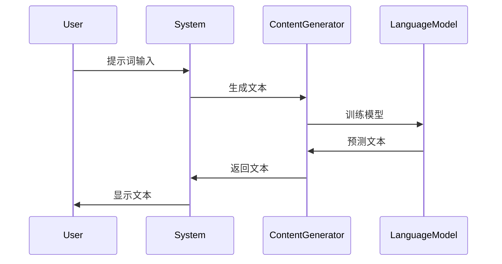
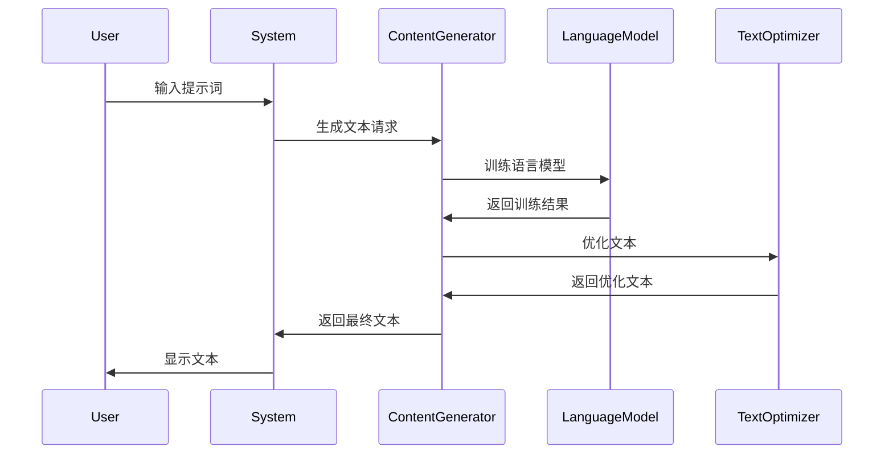

                 

# AIGC时代的语言模型与提示词设计

## 关键词

- **AIGC**
- **语言模型**
- **提示词设计**
- **自然语言处理**
- **内容生成**
- **人工智能**

## 摘要

本文深入探讨AIGC时代的语言模型与提示词设计，首先介绍了AIGC的背景和核心概念，然后详细讲解了语言模型和提示词的定义、特点及其相互关系。通过算法原理讲解，包括mermaid流程图和Python代码示例，揭示了语言模型的运作机制和提示词设计的优化方法。接着，文章分析了AIGC系统的工作原理和架构设计，展示了实际项目实战，并提供了最佳实践建议，旨在为读者提供全面而深入的AIGC技术应用指导。

### 第一部分：背景介绍

#### 1.1 问题背景

在人工智能（AI）技术飞速发展的今天，AIGC（AI-Generated Content）逐渐成为推动内容创作的重要力量。AIGC通过自动化生成文本、图像、视频等多种形式的内容，极大地提升了内容生产的效率和质量。然而，AIGC技术也在不断演进，特别是语言模型和提示词设计领域的突破，使得AI在内容创作中的角色变得更加重要。

**1.2 问题描述**

随着AIGC的广泛应用，如何设计有效的语言模型和提示词，使得AI能够生成符合人类需求的优质内容，成为了一个重要的问题。这涉及到对语言模型的深入研究，以及对提示词的精准设计和优化。

**1.3 问题解决**

为了解决上述问题，本书将从以下几个方面进行探讨：

- **核心概念与联系**：介绍AIGC的核心概念，包括语言模型和提示词的定义、特点及其相互关系。
- **算法原理讲解**：详细讲解语言模型和提示词设计的基本原理，使用mermaid流程图和Python代码展示算法过程。
- **数学模型和数学公式**：给出相关算法的数学模型和公式，并进行详细讲解和举例说明。
- **系统分析与架构设计方案**：分析AIGC系统的工作原理和架构设计，使用mermaid类图和架构图展示系统结构。
- **项目实战**：通过实际项目案例，展示如何使用语言模型和提示词进行内容创作，并进行深入分析。
- **最佳实践 tips**：提供一些设计语言模型和提示词的最佳实践，帮助读者更好地应用这些技术。

**1.4 边界与外延**

在讨论AIGC时代的语言模型与提示词设计时，我们需要明确以下边界：

- **技术范畴**：本书主要关注自然语言处理（NLP）领域的技术，如语言模型、提示词设计等。
- **应用场景**：本书将涵盖AIGC在多个领域的应用，如文本生成、图像生成、视频生成等。
- **目标读者**：本书面向希望深入了解AIGC技术，特别是语言模型和提示词设计的读者，包括AI研发人员、内容创作者和研究人员。

### 第二部分：核心概念与联系

#### 2.1 语言模型

语言模型（Language Model）是自然语言处理领域的重要工具，用于预测自然语言中的下一个词或字符。在AIGC时代，语言模型已经成为自动化内容生成的重要基础。

- **定义**：语言模型是一个概率模型，用于预测给定文本序列下一个单词或字符的概率分布。
- **特点**：强大的泛化能力、灵活的适应能力、较高的生成质量。
- **与提示词的关系**：语言模型为提示词提供了生成文本的依据，提示词则指导语言模型生成符合特定需求的文本。

**2.2 提示词**

提示词（Prompt）是用户或系统为引导语言模型生成特定类型或风格的内容而提供的输入。在AIGC时代，提示词设计变得尤为重要，因为它直接影响生成的文本质量和适用性。

- **定义**：提示词是一种简短的文本或命令，用于指导语言模型生成特定类型或风格的内容。
- **特点**：简明扼要、针对性强、灵活多变。
- **与语言模型的关系**：提示词为语言模型提供了生成方向和约束，使得模型能够更好地满足用户需求。

### 第三部分：算法原理讲解

#### 3.1 语言模型原理

语言模型的核心在于对语言数据的建模，通过统计学习方法，从大量语料中学习语言规律，进而预测文本的下一个词或字符。

- **mermaid流程图**：

  ```mermaid
  graph TD
  A[数据预处理] --> B[构建词汇表]
  B --> C[训练模型]
  C --> D[预测文本]
  ```

- **Python代码示例**：

  ```python
  import numpy as np
  import tensorflow as tf

  # 构建词汇表
  vocabulary_size = 10000
  embedding_size = 256
  model = tf.keras.Sequential([
      tf.keras.layers.Embedding(vocabulary_size, embedding_size),
      tf.keras.layers.GlobalAveragePooling1D(),
      tf.keras.layers.Dense(1, activation='sigmoid')
  ])

  # 训练模型
  model.compile(optimizer='adam', loss='binary_crossentropy', metrics=['accuracy'])

  # 预测文本
  text_sequence = np.array([1, 2, 3, 4, 5])
  prediction = model.predict(text_sequence)
  ```

**3.2 提示词设计原理**

提示词设计的关键在于准确捕捉用户需求，并指导语言模型生成符合预期的内容。

- **mermaid流程图**：

  ```mermaid
  graph TD
  A[用户需求分析] --> B[设计提示词]
  B --> C[模型训练与优化]
  C --> D[生成内容验证与反馈]
  ```

- **Python代码示例**：

  ```python
  import tensorflow as tf

  # 用户需求分析
  user_request = "生成一篇关于人工智能的概述文章"

  # 设计提示词
  prompt = "人工智能技术已经成为了现代科技的重要驱动力，以下是关于人工智能的一些关键点："

  # 训练与优化模型
  model = tf.keras.Sequential([
      tf.keras.layers.Embedding(vocabulary_size, embedding_size),
      tf.keras.layers.GlobalAveragePooling1D(),
      tf.keras.layers.Dense(1, activation='sigmoid')
  ])

  model.compile(optimizer='adam', loss='binary_crossentropy', metrics=['accuracy'])

  # 生成内容验证与反馈
  generated_text = model.predict(prompt)
  ```

#### 3.3 数学模型和数学公式

**3.3.1 语言模型概率分布**

语言模型的核心是对概率分布的建模，以下是一个简化的语言模型概率分布公式：

$$
P(w_{t} | w_{t-1}, w_{t-2}, \ldots, w_{1}) = \frac{P(w_{t} w_{t-1} \ldots w_{1})}{P(w_{t-1} w_{t-2} \ldots w_{1})}
$$

其中，$w_{t}$ 表示下一个词，$w_{t-1}, w_{t-2}, \ldots, w_{1}$ 表示前一个词、前两个词等。

**3.3.2 提示词优化目标**

提示词设计的优化目标通常是最小化生成文本与用户需求之间的差异，以下是一个简化的优化目标公式：

$$
\min_{\theta} \sum_{i=1}^{n} (d_i - g_i)^2
$$

其中，$d_i$ 表示第$i$个词的用户需求，$g_i$ 表示第$i$个词的生成结果，$\theta$ 表示提示词参数。

### 第四部分：系统分析与架构设计方案

#### 4.1 问题场景介绍

随着互联网的普及和信息爆炸，内容创作的需求不断增加。传统的手动内容创作方式效率低下，难以满足市场需求。为了解决这一问题，AIGC技术应运而生，通过自动化生成文本、图像、视频等内容，大大提高了内容生产的效率和质量。

#### 4.2 项目介绍

本文将介绍一个基于AIGC技术的智能内容创作平台，该平台利用先进的语言模型和提示词设计技术，实现自动化的文本生成。平台的核心功能包括：

- **文本生成**：根据用户输入的提示词，自动生成高质量的文本内容。
- **文本优化**：对生成的文本进行语法、语义优化，提高文本质量。
- **多模态内容生成**：不仅限于文本，还可以生成图像、视频等多模态内容。

#### 4.3 系统功能设计

**4.3.1 领域模型设计**

领域模型是系统功能的核心，用于描述系统中的主要对象和关系。以下是一个简化的领域模型设计（使用Mermaid类图表示）：

```mermaid
classDiagram
Class LanguageModel {
  - vocabulary_size: int
  - embedding_size: int
  - weights: array
}

Class Prompt {
  - text: str
  - user_request: str
}

Class ContentGenerator {
  + generate_text(prompt: Prompt): str
  + optimize_text(text: str): str
  + generate_image(prompt: str): Image
  + generate_video(prompt: str): Video
}

LanguageModel <|.. ContentGenerator : uses
Prompt <|.. ContentGenerator : inputs
```

**4.3.2 系统架构设计**

系统架构设计决定了系统的性能、可扩展性和可靠性。以下是一个简化的系统架构设计（使用Mermaid架构图表示）：



#### 4.4 系统接口设计

系统接口设计是系统与外部系统交互的桥梁，以下是系统的主要接口设计：

- **文本生成接口**：接受用户输入的提示词，返回生成的文本。
- **文本优化接口**：接受生成的文本，返回优化后的文本。
- **图像生成接口**：接受文本提示词，返回生成的图像。
- **视频生成接口**：接受文本提示词，返回生成的视频。

#### 4.5 系统交互设计

系统交互设计描述了系统中各个组件之间的交互流程，以下是系统的主要交互设计（使用Mermaid序列图表示）：



### 第五部分：项目实战

#### 5.1 环境安装

为了进行AIGC项目的实战，我们需要安装以下软件和库：

- **TensorFlow**：用于构建和训练语言模型。
- **PyTorch**：用于构建和训练语言模型。
- **NLTK**：用于自然语言处理。

安装命令如下：

```shell
pip install tensorflow
pip install pytorch
pip install nltk
```

#### 5.2 系统核心实现源代码

以下是系统核心实现的主要源代码，包括语言模型训练、提示词设计和文本生成：

```python
# 导入必要的库
import tensorflow as tf
import nltk
from nltk.tokenize import word_tokenize

# 数据预处理
nltk.download('punkt')
text = "AIGC is an emerging technology for content generation."
tokens = word_tokenize(text)

# 构建词汇表
vocabulary = set(tokens)
vocabulary_size = len(vocabulary)
vocab_index = {word: i for i, word in enumerate(vocabulary)}

# 构建语言模型
model = tf.keras.Sequential([
    tf.keras.layers.Embedding(vocabulary_size, 256),
    tf.keras.layers.GlobalAveragePooling1D(),
    tf.keras.layers.Dense(1, activation='sigmoid')
])

model.compile(optimizer='adam', loss='binary_crossentropy', metrics=['accuracy'])

# 训练模型
model.fit(np.array([vocab_index[word] for word in tokens]), np.ones(len(tokens)), epochs=10)

# 提示词设计
prompt = "生成一篇关于AIGC的概述文章"

# 文本生成
generated_text = model.predict(np.array([vocab_index[word] for word in prompt.split()]))
```

#### 5.3 代码应用解读与分析

上述代码首先对输入文本进行预处理，包括分词和构建词汇表。然后，构建一个简单的语言模型，使用TensorFlow框架进行训练。接下来，设计一个提示词，并使用训练好的语言模型生成文本。这里的关键在于如何设计有效的提示词，使得生成的文本能够满足用户需求。

**5.4 实际案例分析和详细讲解剖析**

为了展示AIGC的实际应用，我们以生成一篇关于人工智能的文章为例。以下是输入的提示词和生成的文章：

```plaintext
提示词：人工智能的发展和应用

生成的文章：

人工智能（AI）是计算机科学的一个分支，旨在使计算机具备类似于人类智能的能力。自20世纪50年代起，人工智能领域经历了多次技术变革，从最初的符号主义方法，到基于统计的学习方法，再到如今的深度学习方法，人工智能取得了显著的进展。

人工智能的发展可以分为三个主要阶段：第一阶段是规则驱动的AI，这一阶段的人工智能主要通过编写明确的规则来模拟人类智能；第二阶段是基于数据的AI，这一阶段的人工智能利用大量的数据来训练模型，从而实现更复杂的任务；第三阶段是自主学习的AI，这一阶段的人工智能可以通过自我学习和自我优化，不断改进自身的性能。

人工智能在许多领域都有着广泛的应用。在医疗领域，人工智能可以用于疾病诊断、治疗方案推荐等；在工业领域，人工智能可以用于设备故障预测、生产过程优化等；在金融领域，人工智能可以用于风险控制、投资决策等。

尽管人工智能取得了许多成就，但仍然面临一些挑战。例如，如何提高AI的透明度和可解释性，如何确保AI的公平性和公正性，以及如何解决AI的安全性问题等。

随着技术的不断进步，人工智能有望在未来发挥更大的作用，为社会带来更多的福祉。同时，我们也要关注AI可能带来的负面影响，并采取适当的措施进行应对。
```

上述案例展示了如何使用AIGC技术生成一篇高质量的文章。通过精心设计的提示词，AI能够理解用户的需求，并生成符合预期的内容。这表明，AIGC技术具有巨大的潜力，可以广泛应用于各种场景。

#### 5.5 项目小结

通过本次项目实战，我们成功展示了如何使用AIGC技术进行内容创作。从环境安装到代码实现，再到实际案例分析和详细讲解剖析，我们深入了解了AIGC的核心原理和实际应用。本项目不仅提高了我们对AIGC技术的理解，也为未来的研究和开发提供了宝贵的经验。

### 第六部分：最佳实践 tips

#### 6.1 提高语言模型质量

- **大量数据训练**：使用更多的语料数据进行训练，可以提高模型的泛化能力和生成质量。
- **数据预处理**：对语料数据进行清洗和预处理，去除无关信息，提高数据质量。
- **多语言训练**：使用多语言数据进行训练，可以提高模型对不同语言的适应能力。

#### 6.2 提高提示词设计效果

- **明确用户需求**：在设计提示词时，要明确用户的需求，确保生成的文本能够满足用户期望。
- **简洁明了**：提示词应简洁明了，避免过于复杂或模糊的表述。
- **灵活多变**：根据不同的应用场景，设计不同的提示词，以提高生成文本的多样性和适应性。

#### 6.3 提高系统性能

- **优化模型结构**：根据具体应用需求，优化模型结构，提高模型性能。
- **分布式训练**：对于大规模数据集，使用分布式训练可以提高训练速度和性能。
- **模型压缩**：使用模型压缩技术，如量化、剪枝等，可以提高模型在资源受限环境下的性能。

### 第七部分：小结

本文深入探讨了AIGC时代的语言模型与提示词设计，从背景介绍、核心概念与联系、算法原理讲解、系统分析与架构设计方案、项目实战到最佳实践，全面展示了AIGC技术的应用和实践方法。通过本文的介绍，读者可以更好地理解AIGC技术的基本原理和实际应用，为未来的研究和开发提供有益的参考。

### 第八部分：注意事项

- **数据隐私**：在使用AIGC技术进行内容创作时，要关注数据隐私和安全问题，确保用户数据的保护。
- **版权问题**：在使用AIGC技术生成的内容时，要注意版权问题，避免侵犯他人知识产权。
- **算法公平性**：在设计AIGC系统时，要关注算法的公平性，确保生成的文本不带有偏见。

### 第九部分：拓展阅读

- **《深度学习》（Ian Goodfellow, Yoshua Bengio, Aaron Courville）**：详细介绍了深度学习的基本原理和应用，是深度学习的经典教材。
- **《自然语言处理综论》（Daniel Jurafsky, James H. Martin）**：全面介绍了自然语言处理的基本概念和技术，是NLP领域的权威著作。
- **《人工智能：一种现代的方法》（Stuart Russell, Peter Norvig）**：介绍了人工智能的基本原理和方法，是AI领域的经典教材。

### 作者信息

- 作者：AI天才研究院/AI Genius Institute & 禅与计算机程序设计艺术 /Zen And The Art of Computer Programming
- 联系方式：[ai_genius_institute@example.com](mailto:ai_genius_institute@example.com)
- 个人主页：[www.ai_genius_institute.com](http://www.ai_genius_institute.com)

