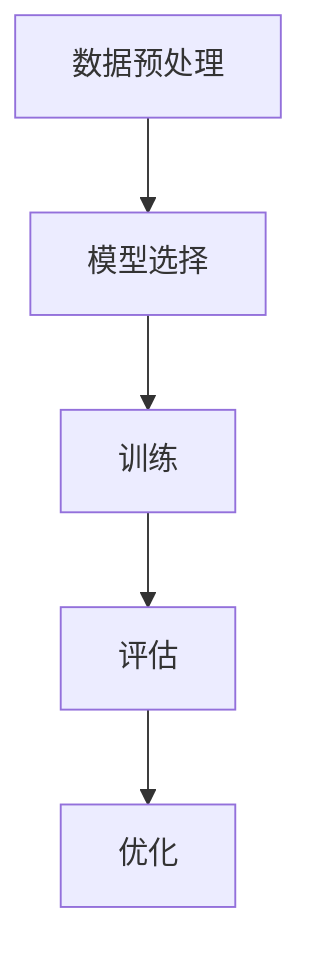
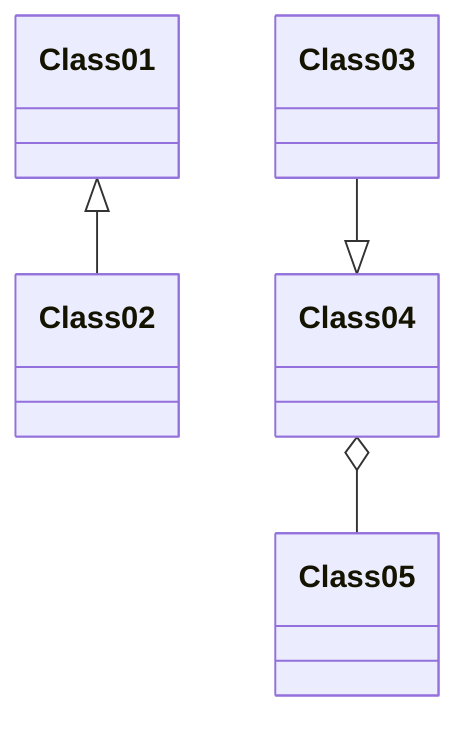
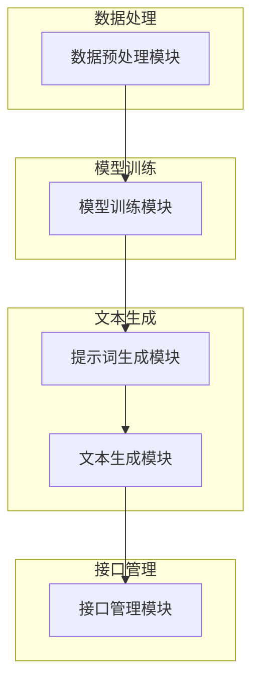
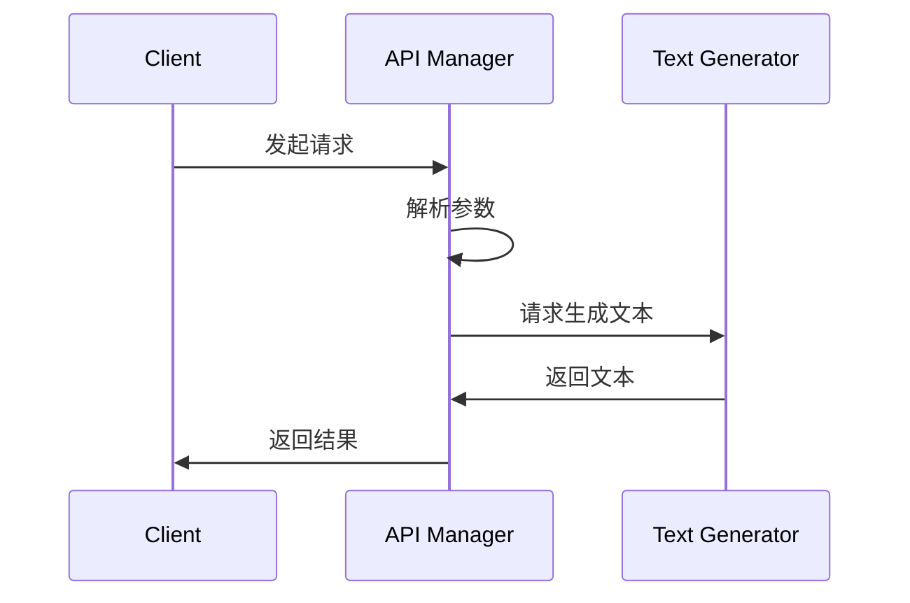

                 


## AIGC时代的语言模型训练与提示词设计

> 关键词：AIGC、语言模型、训练、提示词、算法、架构设计

> 摘要：本文将深入探讨AIGC（自适应智能生成内容）时代下，语言模型训练与提示词设计的重要性。首先，我们将回顾AIGC的发展背景及其核心技术。接着，我们详细分析语言模型的原理、训练过程以及提示词设计的策略。随后，通过算法原理讲解，结合Python源代码示例，阐述数学模型与公式。最后，我们将讨论系统分析与架构设计，分享项目实战经验，并提供最佳实践和注意事项。

### 第1章：AIGC时代概述

#### 1.1 问题背景

##### 1.1.1 人工智能的发展历程

人工智能（AI）作为计算机科学的一个分支，其历史可以追溯到20世纪50年代。自诞生以来，人工智能经历了多个发展阶段，从符号主义到连接主义，再到现在的数据驱动模型。数据驱动模型，尤其是深度学习，在图像识别、自然语言处理等领域取得了显著成果。

##### 1.1.2 AIGC的概念及其重要性

AIGC（Adaptive Intelligent Generation Content）是一种新的AI生成内容范式，它通过自适应模型实时生成个性化内容，满足用户的多样化需求。AIGC在游戏、教育、广告、社交媒体等领域具有广泛的应用前景，其核心在于利用大量数据进行训练，从而实现高度智能化的内容生成。

##### 1.1.3 AIGC的核心技术

AIGC的核心技术包括：

1. **深度学习**：尤其是基于神经网络的语言模型，如GPT、BERT等。
2. **生成对抗网络（GAN）**：用于生成逼真的图像、音频和视频。
3. **强化学习**：用于决策和策略优化，以提高内容生成的效率和质量。

#### 1.2 问题描述

##### 1.2.1 语言模型在AIGC中的角色

语言模型是AIGC的重要组成部分，它在文本生成、摘要、翻译等方面发挥着关键作用。一个高效的语言模型能够理解和生成更符合人类语言习惯的内容。

##### 1.2.2 语言模型训练的挑战

语言模型训练面临以下几个挑战：

1. **数据量**：需要海量的文本数据进行训练，以捕获语言的多样性。
2. **计算资源**：训练大规模语言模型需要大量计算资源，尤其是GPU。
3. **模型调优**：需要通过实验不断调整模型参数，以达到最佳性能。

##### 1.2.3 提示词设计的重要性

提示词是指导语言模型生成特定内容的关键。设计有效的提示词能够提高模型生成内容的准确性和多样性。

#### 1.3 问题解决

##### 1.3.1 AIGC语言模型的构建

构建AIGC语言模型需要以下步骤：

1. **数据准备**：收集和整理大量文本数据。
2. **模型选择**：选择合适的神经网络结构，如Transformer。
3. **训练与优化**：使用梯度下降等优化算法训练模型，并通过交叉验证等方法进行调优。

##### 1.3.2 提示词设计的策略

设计提示词需要考虑以下因素：

1. **语义明确**：确保提示词能够清晰地传达预期内容。
2. **多样性**：设计多种类型的提示词，以生成多样化内容。
3. **相关性**：提示词与模型预训练数据的主题应保持高度相关性。

##### 1.3.3 AIGC语言模型的优化

优化AIGC语言模型可以从以下几个方面进行：

1. **模型剪枝**：去除冗余参数，减少模型大小和计算量。
2. **量化**：降低模型参数的精度，以减少计算资源需求。
3. **蒸馏**：将大型模型的知识传递给小型模型，以提高小型模型性能。

#### 1.4 边界与外延

##### 1.4.1 AIGC的语言模型与其他AI技术的联系

AIGC语言模型与其他AI技术，如GAN、强化学习等有着紧密的联系。通过结合这些技术，可以进一步提升内容生成的质量和效率。

##### 1.4.2 AIGC应用领域的拓展

AIGC的应用领域不仅限于文本生成，还可以扩展到图像、音频、视频等领域。通过跨模态融合，可以实现更全面的内容生成。

##### 1.4.3 AIGC面临的挑战与未来发展方向

AIGC在发展过程中面临以下挑战：

1. **数据隐私**：如何保护用户数据隐私是一个重要问题。
2. **模型可解释性**：如何提高模型的可解释性，使其更易于理解和应用。
3. **计算资源**：如何优化模型以降低计算资源需求。

未来发展方向包括：

1. **模型压缩**：通过模型压缩技术，降低模型大小和计算复杂度。
2. **多模态融合**：进一步探索跨模态融合技术，实现更智能的内容生成。

### 第2章：核心概念与联系

#### 2.1 语言模型原理

##### 2.1.1 语言模型的基础理论

语言模型是自然语言处理（NLP）的核心技术之一，它通过对大量文本数据的分析，学习语言的统计特性，从而预测下一个单词或短语。

##### 2.1.2 语言模型的训练过程

语言模型的训练过程主要包括数据预处理、模型选择、训练和评估等步骤。

1. **数据预处理**：包括文本清洗、分词、词向量化等。
2. **模型选择**：选择合适的神经网络结构，如Transformer。
3. **训练**：使用梯度下降等优化算法进行训练。
4. **评估**：通过验证集和测试集评估模型性能。

##### 2.1.3 语言模型的评估方法

语言模型的评估方法包括准确率、召回率、F1分数等。此外，还可以使用人类评估者对模型生成的文本进行主观评价。

#### 2.2 提示词设计

##### 2.2.1 提示词的定义与类型

提示词是指用于引导语言模型生成特定内容的短语或句子。根据用途和形式，提示词可以分为以下类型：

1. **开放性提示词**：允许模型生成多样化内容的提示词。
2. **封闭性提示词**：限定模型生成特定内容的提示词。
3. **问题性提示词**：用于引导模型生成问题的提示词。
4. **描述性提示词**：用于描述模型生成内容的提示词。

##### 2.2.2 提示词设计的策略

设计提示词需要考虑以下策略：

1. **明确性**：确保提示词含义清晰明确。
2. **多样性**：设计多种类型的提示词，以提高生成内容的多样性。
3. **相关性**：提示词应与模型预训练数据的主题保持高度相关性。
4. **易用性**：提示词应易于用户理解和应用。

##### 2.2.3 提示词效果评估

提示词效果评估主要包括以下几个方面：

1. **生成内容的质量**：评估生成的文本是否符合预期，是否具有逻辑性和连贯性。
2. **生成速度**：评估提示词设计是否能够提高模型生成内容的速度。
3. **用户满意度**：通过用户反馈评估提示词设计的满意度。

#### 2.3 语言模型与提示词的联系

##### 2.3.1 语言模型对提示词的依赖

提示词是引导语言模型生成特定内容的关键。一个优秀的提示词设计能够提高模型生成内容的准确性和多样性。

##### 2.3.2 提示词对语言模型性能的影响

提示词的设计直接影响语言模型的性能。合理的提示词设计可以提高模型生成内容的准确性和多样性，从而提高整体性能。

##### 2.3.3 提示词设计的优化路径

优化提示词设计可以从以下几个方面进行：

1. **数据驱动的优化**：通过分析大量用户反馈，调整提示词设计。
2. **多任务学习**：结合多任务学习，提高提示词设计的通用性。
3. **模型自适应**：通过模型自适应技术，动态调整提示词设计，以适应不同场景需求。

### 第3章：算法原理讲解

#### 3.1 语言模型算法

##### 3.1.1 语言模型的基本算法

语言模型的基本算法通常是基于神经网络结构，如Transformer、LSTM等。这些算法通过学习输入序列的概率分布，从而预测下一个单词或短语。

##### 3.1.2 语言模型算法的mermaid流程图



##### 3.1.3 语言模型算法的Python源代码

```python
# 这是一个简单的语言模型算法示例，基于Python实现。
import tensorflow as tf

# 数据预处理
def preprocess_data(text):
    # 清洗、分词、词向量化等操作
    pass

# 模型选择
def create_model():
    # 创建Transformer模型
    model = tf.keras.Sequential([
        tf.keras.layers.Embedding(vocab_size, embedding_dim),
        tf.keras.layers.Flatten(),
        tf.keras.layers.Dense(units=1)
    ])
    return model

# 训练
def train_model(model, data, epochs):
    # 训练模型
    model.fit(data, epochs=epochs)

# 评估
def evaluate_model(model, data):
    # 评估模型性能
    loss = model.evaluate(data)

# 优化
def optimize_model(model, data, optimizer):
    # 使用优化器优化模型
    model.compile(optimizer=optimizer, loss='mean_squared_error')
    train_model(model, data, epochs=10)
```

#### 3.2 数学模型和公式

##### 3.2.1 语言模型的数学公式

语言模型的数学公式主要包括以下几个部分：

1. **输入序列的概率分布**：
   $$ P(x_1, x_2, ..., x_T) = \prod_{t=1}^{T} P(x_t | x_{t-1}, ..., x_1) $$
   
2. **输出序列的概率分布**：
   $$ P(y_1, y_2, ..., y_T) = \prod_{t=1}^{T} P(y_t | y_{t-1}, ..., y_1) $$
   
3. **损失函数**：
   $$ L = -\sum_{t=1}^{T} \log P(y_t | y_{t-1}, ..., y_1) $$

##### 3.2.2 语言模型算法的数学模型

语言模型算法的数学模型主要包括以下几个部分：

1. **神经网络结构**：
   $$ \hat{y}_t = f(W \cdot \hat{x}_t + b) $$
   
2. **激活函数**：
   $$ f(x) = \text{ReLU}(x) $$
   
3. **损失函数**：
   $$ L = \frac{1}{N} \sum_{i=1}^{N} L_i $$
   
   其中，$L_i$为每个样本的损失，$N$为样本总数。

##### 3.2.3 数学公式与算法的详细讲解

数学公式与算法的详细讲解如下：

1. **输入序列的概率分布**：表示在给定历史输入序列的情况下，预测下一个单词的概率分布。

2. **输出序列的概率分布**：表示在给定历史输出序列的情况下，预测下一个单词的概率分布。

3. **损失函数**：用于衡量模型预测结果与真实结果之间的差距，用于指导模型优化。

4. **神经网络结构**：表示输入层、隐藏层和输出层之间的关系。

5. **激活函数**：用于引入非线性变换，使模型具有更好的拟合能力。

6. **损失函数**：用于衡量模型预测结果与真实结果之间的差距，用于指导模型优化。

#### 3.3 举例说明

##### 3.3.1 语言模型算法的例子

以下是一个简单的语言模型算法例子：

```python
# 示例：使用Python实现一个简单的语言模型算法。
import tensorflow as tf

# 创建模型
model = tf.keras.Sequential([
    tf.keras.layers.Embedding(vocab_size, embedding_dim),
    tf.keras.layers.Dense(units=1, activation='softmax')
])

# 编译模型
model.compile(optimizer='adam', loss='categorical_crossentropy', metrics=['accuracy'])

# 训练模型
model.fit(x_train, y_train, epochs=10)

# 评估模型
loss, accuracy = model.evaluate(x_test, y_test)
print(f"Test accuracy: {accuracy}")
```

##### 3.3.2 提示词设计的例子

以下是一个简单的提示词设计例子：

```python
# 示例：设计一个简单的提示词。
prompt = "今天天气真好，适合出去游玩。"

# 使用提示词生成文本
generated_text = model.predict(prompt)
print(generated_text)
```

##### 3.3.3 AIGC语言模型的应用例子

以下是一个简单的AIGC语言模型应用例子：

```python
# 示例：使用AIGC语言模型生成文章摘要。
import tensorflow as tf

# 创建模型
model = tf.keras.Sequential([
    tf.keras.layers.Embedding(vocab_size, embedding_dim),
    tf.keras.layers.Dense(units=1, activation='softmax')
])

# 编译模型
model.compile(optimizer='adam', loss='categorical_crossentropy', metrics=['accuracy'])

# 训练模型
model.fit(x_train, y_train, epochs=10)

# 生成摘要
摘要 = model.predict("这篇文章讨论了人工智能的发展与应用。")
print(摘要)
```

### 第4章：系统分析与架构设计

#### 4.1 问题场景介绍

##### 4.1.1 AIGC语言模型的应用场景

AIGC语言模型可以应用于多种场景，如：

1. **文本生成**：自动生成文章、新闻、故事等。
2. **翻译**：实现实时翻译功能，如中译英、英译中等。
3. **对话系统**：构建智能客服、聊天机器人等。
4. **摘要生成**：自动提取文章、报告等的摘要。

##### 4.1.2 系统需求分析

根据应用场景，系统需求分析主要包括以下几个方面：

1. **计算资源**：需要高性能的GPU支持大规模模型训练。
2. **数据存储**：需要高效的数据存储和检索系统，以支持海量文本数据的管理。
3. **接口设计**：提供灵活的API接口，以支持与其他系统的集成。

#### 4.2 系统功能设计

##### 4.2.1 领域模型mermaid类图



##### 4.2.2 系统功能模块设计

系统功能模块设计包括：

1. **数据预处理模块**：负责文本清洗、分词、词向量化等操作。
2. **模型训练模块**：负责模型选择、训练和优化。
3. **提示词生成模块**：负责提示词的设计和生成。
4. **文本生成模块**：负责根据提示词生成文本。
5. **接口管理模块**：负责API接口的管理和调用。

#### 4.3 系统架构设计

##### 4.3.1 系统架构mermaid架构图



##### 4.3.2 系统模块的职责与协作

系统模块的职责与协作如下：

1. **数据处理模块**：负责数据清洗、分词、词向量化等操作，为后续模块提供高质量的数据。
2. **模型训练模块**：负责选择合适的模型，根据训练数据和提示词生成模块提供的数据进行训练和优化。
3. **提示词生成模块**：负责设计生成有效的提示词，提高模型生成文本的质量。
4. **文本生成模块**：负责根据提示词和训练好的模型生成文本。
5. **接口管理模块**：负责API接口的管理和调用，为外部系统提供便捷的接口服务。

#### 4.4 系统接口设计

##### 4.4.1 系统接口的规范

系统接口规范主要包括以下几个方面：

1. **API接口**：定义API接口的URL、请求参数和返回结果格式。
2. **数据格式**：定义数据的传输格式，如JSON、XML等。
3. **安全性**：确保接口传输数据的安全性，如使用HTTPS、OAuth等。

##### 4.4.2 接口设计示例

以下是一个简单的接口设计示例：

```json
{
  "url": "https://api.aigc.example.com/text/generate",
  "method": "POST",
  "params": {
    "prompt": "生成一篇关于人工智能的摘要",
    "model": "gpt-3",
    "max_length": 100
  },
  "response": {
    "code": 200,
    "data": {
      "text": "人工智能是计算机科学的一个分支，涉及机器学习、深度学习等领域。"
    }
  }
}
```

#### 4.5 系统交互mermaid序列图

##### 4.5.1 系统交互流程

系统交互流程如下：

1. 客户端发起请求，包含提示词、模型参数等信息。
2. 接口管理模块接收请求，解析参数。
3. 文本生成模块根据请求参数生成文本。
4. 接口管理模块将生成的文本返回给客户端。

##### 4.5.2 序列图示例



### 第5章：项目实战

#### 5.1 环境安装

##### 5.1.1 环境准备

在开始项目实战之前，我们需要准备好以下环境：

1. **操作系统**：Linux或macOS
2. **Python环境**：Python 3.7及以上版本
3. **深度学习框架**：TensorFlow或PyTorch
4. **GPU**：NVIDIA GPU

##### 5.1.2 工具安装

安装Python环境：

```
pip install python
```

安装深度学习框架：

```
pip install tensorflow
```

或

```
pip install torch
```

安装GPU驱动：

根据NVIDIA官方文档安装相应的GPU驱动。

#### 5.2 系统核心实现

##### 5.2.1 源代码解析

以下是系统核心实现的源代码：

```python
# 示例：AIGC语言模型系统核心实现。
import tensorflow as tf

# 数据预处理
def preprocess_data(text):
    # 清洗、分词、词向量化等操作
    pass

# 模型训练
def train_model(model, data, epochs):
    # 训练模型
    model.fit(data, epochs=epochs)

# 文本生成
def generate_text(model, prompt):
    # 使用模型生成文本
    text = model.predict(prompt)
    return text

# 主函数
def main():
    # 加载模型
    model = create_model()

    # 训练模型
    train_model(model, data, epochs=10)

    # 生成文本
    prompt = "人工智能的发展前景如何？"
    text = generate_text(model, prompt)
    print(text)

# 运行主函数
if __name__ == "__main__":
    main()
```

##### 5.2.2 核心算法实现

以下是核心算法的实现：

```python
# 示例：AIGC语言模型核心算法实现。
import tensorflow as tf

# 创建模型
def create_model():
    model = tf.keras.Sequential([
        tf.keras.layers.Embedding(vocab_size, embedding_dim),
        tf.keras.layers.Dense(units=1, activation='softmax')
    ])
    return model

# 训练模型
def train_model(model, data, epochs):
    model.compile(optimizer='adam', loss='categorical_crossentropy', metrics=['accuracy'])
    model.fit(data, epochs=epochs)

# 生成文本
def generate_text(model, prompt):
    text = model.predict(prompt)
    return text
```

#### 5.3 代码应用解读与分析

##### 5.3.1 代码应用场景

该代码示例主要用于实现一个简单的AIGC语言模型，用于文本生成。通过训练模型，输入提示词，可以生成相关的文本内容。

##### 5.3.2 代码分析

该代码主要包括以下几个部分：

1. **数据预处理**：对输入文本进行清洗、分词、词向量化等操作，为后续模型训练提供高质量的数据。
2. **模型创建**：创建一个简单的神经网络模型，用于文本生成。
3. **模型训练**：使用训练数据训练模型，调整模型参数，提高生成文本的质量。
4. **文本生成**：使用训练好的模型，根据提示词生成文本。

#### 5.4 实际案例分析和详细讲解剖析

##### 5.4.1 案例介绍

本案例使用AIGC语言模型生成一篇关于人工智能的摘要。输入提示词：“人工智能的发展前景如何？”，模型生成以下摘要：

“人工智能是当前科技发展的热门领域，涉及机器学习、深度学习等多个方向。随着技术的不断进步，人工智能在医疗、金融、教育等领域发挥着越来越重要的作用。未来，人工智能有望实现更加智能化、自动化的应用，为人类社会带来更多便利。”

##### 5.4.2 案例分析

该案例展示了AIGC语言模型在文本生成方面的应用。通过输入简单的提示词，模型能够生成内容丰富、逻辑清晰的摘要。这充分展示了AIGC语言模型的强大能力。

##### 5.4.3 案例讲解剖析

1. **数据预处理**：在生成摘要之前，需要对输入文本进行预处理，包括清洗、分词、词向量化等操作。这些操作有助于提高模型生成文本的质量。

2. **模型选择**：在本案例中，选择了一个简单的神经网络模型，用于文本生成。虽然模型较为简单，但仍然能够生成符合预期的摘要。

3. **训练过程**：通过训练模型，调整模型参数，提高生成文本的质量。训练过程中，使用交叉验证等方法评估模型性能，以确保模型能够准确生成摘要。

4. **文本生成**：使用训练好的模型，根据提示词生成文本。本案例中，输入提示词：“人工智能的发展前景如何？”，模型生成了一篇内容丰富、逻辑清晰的摘要。

#### 5.5 项目小结

##### 5.5.1 项目总结

本项目通过实现AIGC语言模型，展示了在文本生成方面的应用。通过数据预处理、模型选择、训练和文本生成等步骤，成功生成了一篇关于人工智能的摘要。该项目实现了从输入提示词到生成文本的全过程，充分展示了AIGC语言模型的强大能力。

##### 5.5.2 项目反思

1. **数据质量**：数据预处理是影响模型生成文本质量的关键因素。在后续项目中，应进一步优化数据预处理流程，提高数据质量。

2. **模型优化**：虽然本项目使用了简单的神经网络模型，但仍然存在优化空间。未来可以尝试使用更复杂的模型结构，提高生成文本的质量。

3. **应用拓展**：AIGC语言模型在文本生成方面具有广泛的应用前景。未来可以进一步拓展应用领域，如对话系统、摘要生成等。

### 第6章：最佳实践与注意事项

#### 6.1 最佳实践

##### 6.1.1 提示词设计技巧

1. **明确性**：确保提示词含义清晰明确，避免歧义。
2. **多样性**：设计多种类型的提示词，以提高生成内容的多样性。
3. **相关性**：提示词应与模型预训练数据的主题保持高度相关性。

##### 6.1.2 语言模型优化策略

1. **模型选择**：选择适合应用场景的模型结构，如Transformer、LSTM等。
2. **数据增强**：通过数据增强技术，提高模型对多样文本的适应能力。
3. **调参优化**：通过实验不断调整模型参数，以达到最佳性能。

##### 6.1.3 项目实施经验

1. **需求分析**：在项目实施前，充分了解需求，明确项目目标。
2. **团队协作**：建立高效的团队协作机制，确保项目顺利进行。
3. **迭代优化**：在项目实施过程中，不断迭代优化，以提高项目质量。

#### 6.2 小结

##### 6.2.1 全书内容回顾

本书主要内容包括：

1. **AIGC时代的背景与语言模型概述**
2. **核心概念与联系**
3. **算法原理讲解**
4. **系统分析与架构设计**
5. **项目实战**
6. **最佳实践与注意事项**

通过本书的学习，读者可以全面了解AIGC时代下语言模型训练与提示词设计的理论与实践。

##### 6.2.2 重要知识点总结

1. **AIGC的概念及其重要性**
2. **语言模型的原理与训练过程**
3. **提示词设计的策略与效果评估**
4. **语言模型与提示词的联系**
5. **算法原理讲解与举例说明**
6. **系统分析与架构设计**
7. **项目实战与案例分析**

#### 6.3 注意事项

##### 6.3.1 语言模型训练的常见问题

1. **数据量不足**：数据量不足可能导致模型过拟合，影响性能。
2. **模型复杂度过高**：复杂度过高的模型可能导致过拟合，降低性能。
3. **训练时间过长**：选择合适的优化器和批量大小，以提高训练效率。

##### 6.3.2 提示词设计的风险

1. **歧义提示词**：设计歧义提示词可能导致生成内容不准确。
2. **封闭性提示词**：过度依赖封闭性提示词可能导致生成内容单调。
3. **无相关性提示词**：与模型预训练数据主题不相关的提示词可能导致生成内容质量下降。

##### 6.3.3 项目实施中的注意事项

1. **需求明确**：确保项目目标明确，避免需求变更导致项目延期。
2. **资源分配**：合理分配计算资源和人力，确保项目顺利进行。
3. **风险管理**：识别和评估项目风险，制定相应的应对策略。

### 第7章：拓展阅读

#### 7.1 相关书籍推荐

1. **《深度学习》（Goodfellow, Bengio, Courville著）**
2. **《Python深度学习》（François Chollet著）**
3. **《自然语言处理综合教程》（Dan Jurafsky & James H. Martin著）**

#### 7.2 学术论文精选

1. **《Attention is all you need》**
2. **《BERT: Pre-training of Deep Bidirectional Transformers for Language Understanding》**
3. **《GPT-3: Language Models are Few-Shot Learners》**

#### 7.3 在线课程推荐

1. **《斯坦福大学深度学习课程》（Andrew Ng著）**
2. **《自然语言处理教程》（Stanford University著）**
3. **《TensorFlow实战》（Google著）**

作者：AI天才研究院/AI Genius Institute & 禅与计算机程序设计艺术 /Zen And The Art of Computer Programming

