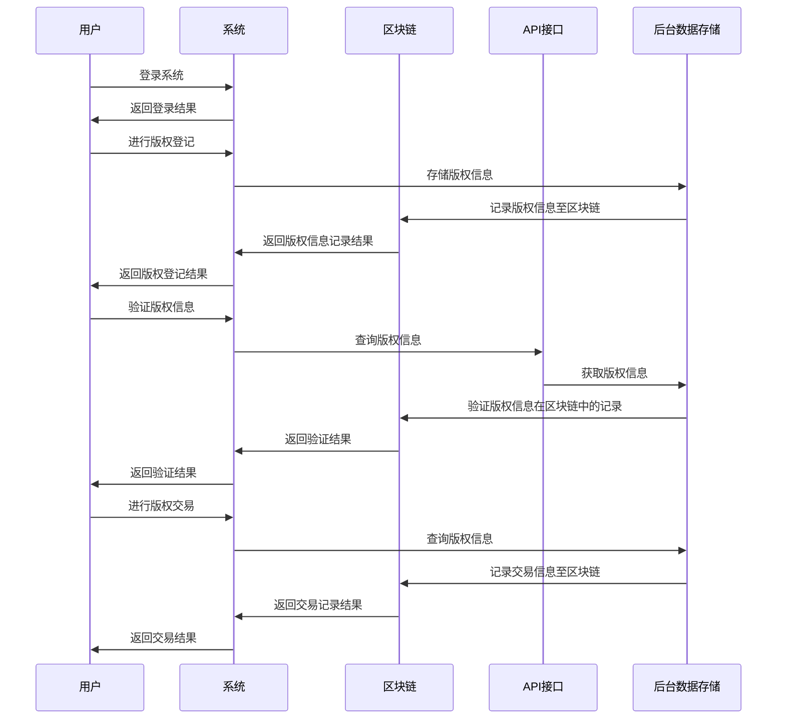

                 

### AIGC版权问题：思维链生成内容的归属探讨

#### 关键词：AIGC、版权、思维链、内容生成、版权归属

> 摘要：本文从AIGC（AI-Generated Content）的定义、发展背景出发，探讨其在数字时代面临的版权问题。特别是针对思维链生成内容的版权归属问题，本文通过逻辑分析、案例分析和技术解决方案，深入探讨版权归属的法律框架、技术手段及其实际应用，为AIGC版权问题提供有益的思考和参考。

---

#### 目录大纲

---

## 第一部分：背景介绍

### 1.1 问题背景

- **AIGC的概念与发展：**
  - AIGC（AI-Generated Content）是一种利用人工智能技术生成内容的模式，涵盖了从文本、图像到视频等多种形式的内容生成。
  - AIGC的发展背景，包括人工智能技术的发展、大数据的普及以及计算能力的提升。

- **版权问题的定义与现状：**
  - 版权问题涉及内容创造者、使用者以及相关法规对内容归属的界定。
  - 当前版权问题在数字时代面临的挑战和困境。

### 1.2 问题描述

- **AIGC生成内容的归属问题：**
  - 在AIGC环境下，如何确定生成内容的版权归属，尤其是涉及多个参与者（如算法、用户、平台）的情况。
  - AIGC生成内容与传统人工创造内容的版权归属有何不同。

- **思维链生成内容的特点与挑战：**
  - 思维链是一种创新的内容生成方法，它如何影响版权归属的判断。
  - 思维链生成内容的版权归属在法律和实践中的困难。

### 1.3 问题解决

- **版权法律框架：**
  - 当前国际、国内关于版权的法律体系。
  - 版权法律在应对AIGC生成内容时的适应性和不足。

- **技术解决方案：**
  - 利用区块链等技术实现内容生成者身份的追溯和保护。
  - 利用智能合约自动执行版权合同。

### 1.4 边界与外延

- **AIGC生成内容版权问题的边界：**
  - 何种内容应纳入版权保护的范畴。
  - 版权保护的范围和界限。

- **AIGC生成内容版权问题的外延：**
  - 版权问题在AIGC生态系统中的不同参与者之间的互动。
  - 版权问题对内容创作、使用和分发的影响。

### 1.5 概念结构与核心要素组成

- **核心概念：**
  - AIGC、版权、思维链、内容生成者、使用者、版权法律框架、技术解决方案等。

- **概念属性特征对比表格：**
  - 对比AIGC与人工生成内容在版权归属上的不同特点。

- **ER实体关系图架构：**
  - 用Mermaid绘制AIGC生成内容版权问题中的实体关系图。

---

## 第二部分：核心概念与联系

### 2.1 AIGC的概念与原理

- **AIGC的定义：**
  - AIGC是指利用人工智能技术自动生成内容，包括文本、图像、视频等多种形式。

- **AIGC的工作原理：**
  - 基于深度学习、自然语言处理、计算机视觉等技术生成内容。

### 2.2 版权的基本原理与法律框架

- **版权的定义：**
  - 版权是指创作者对其作品享有的人身权利和财产权利。

- **版权法律框架：**
  - 探讨国际、国内关于版权的法律体系，如何适用于AIGC生成内容。

### 2.3 思维链的生成机制与特点

- **思维链的定义：**
  - 思维链是一种基于人工智能技术的内容生成方法，它模拟人类的思维过程。

- **思维链的特点：**
  - 强调内容生成的连贯性和逻辑性，使得生成内容更贴近人类创造。

### 2.4 三者之间的关系

- **AIGC、版权与思维链的交互：**
  - 分析AIGC与版权、思维链之间的关联和相互作用。

- **案例研究：**
  - 通过案例探讨AIGC、版权、思维链在实际应用中的协同效应和挑战。

---

## 第三部分：算法原理讲解

### 3.1 AIGC算法的流程与框架

- **算法流程：**
  - 从数据预处理、模型训练到内容生成的详细流程。

- **算法框架：**
  - 基于不同技术（如GPT、BERT）的AIGC算法框架。

### 3.2 思维链生成算法

- **算法原理：**
  - 思维链的生成原理，包括如何模拟人类思维过程。

- **算法步骤：**
  - 分解思维链生成算法的步骤，并结合Mermaid流程图展示。

### 3.3 算法优缺点分析

- **优点：**
  - 分析AIGC和思维链生成算法的优势。

- **缺点：**
  - 探讨算法在实际应用中的局限性。

---

## 第四部分：数学模型和数学公式

### 4.1 AIGC生成内容的数学模型

- **数学公式：**
  - $$X = f(W \cdot X + b)$$
    - 其中，$X$表示输入数据，$W$和$b$分别表示权重和偏置。

- **模型解释：**
  - 解释上述公式的含义和作用。

### 4.2 思维链生成算法的数学原理

- **数学模型：**
  - $$\theta_{i} = \theta_{i-1} + \eta \cdot (z_i - \theta_{i-1})$$
    - 其中，$\theta_{i}$表示第$i$个节点的权重，$z_i$表示输入的激活值，$\eta$表示学习率。

- **模型解释：**
  - 解释上述公式的含义和作用。

---

接下来，我们将逐步深入探讨AIGC、版权与思维链之间的关系，以及如何解决版权归属问题。让我们一步步思考，找到最佳的解决方案。

---

## 第一部分：背景介绍

### 1.1 问题背景

在数字时代，人工智能（AI）技术的发展迅猛，极大地改变了人类的生产和生活方式。AIGC（AI-Generated Content）作为一种新兴的内容生成方式，已经成为人工智能领域的一个重要分支。AIGC指的是利用人工智能技术自动生成内容，包括文本、图像、视频等多种形式。从最初的简单文本生成，到如今复杂的图像和视频生成，AIGC在技术层面和实际应用上都有了显著的进步。

AIGC的发展背景主要源于以下几个方面：

1. **人工智能技术的进步**：随着深度学习、自然语言处理、计算机视觉等技术的不断发展，人工智能在数据处理、模式识别、决策优化等方面取得了重大突破。这些技术为AIGC的生成提供了强大的技术支撑。

2. **大数据的普及**：大数据技术的发展为AIGC提供了丰富的数据资源。通过大规模数据训练，AI模型能够更好地学习和模仿人类创造内容的过程，从而生成更加自然和高质量的内容。

3. **计算能力的提升**：随着计算能力的不断提高，AI模型的训练和推理速度大幅提升，使得AIGC在实际应用中的可行性大大增加。

#### 版权问题的定义与现状

版权问题是指创作者对其作品享有的人身权利和财产权利的界定。版权问题在数字时代面临诸多挑战，主要体现在以下几个方面：

1. **版权定义的模糊性**：数字时代的作品形式多样化，传统的版权定义难以涵盖所有新型内容形式，如AI生成的文本、图像、视频等。这导致版权归属的界定变得复杂和模糊。

2. **版权保护的困境**：数字技术的快速发展使得内容的复制、传播变得异常便捷，传统的版权保护手段难以应对这种挑战。此外，网络环境的匿名性和跨国界性也使得版权侵权行为更加难以监管。

3. **法律框架的滞后**：虽然各国和国际组织都在不断修订和完善版权法律，但数字时代的版权问题发展迅速，法律框架往往滞后于技术的发展。这使得在应对AIGC等新兴内容生成方式时，版权法律体系的适应性和有效性受到质疑。

### 1.2 问题描述

在AIGC环境下，版权归属问题尤为突出，主要体现在以下几个方面：

1. **生成内容的归属问题**：在AIGC中，内容的生成通常涉及到多个参与者，包括算法开发者、用户、平台等。如何确定生成内容的版权归属，尤其是涉及多个参与者的情况，成为一个复杂的问题。

2. **与传统版权归属的不同**：与传统人工创造的内容相比，AIGC生成的内容在版权归属上存在显著差异。传统版权主要基于创作者的个人劳动和创造力，而AIGC生成的内容则依赖于人工智能算法和大量数据。

3. **思维链生成内容的挑战**：思维链是一种基于人工智能技术的内容生成方法，它模拟人类的思维过程。思维链生成的内容在版权归属上面临更大的挑战，因为它的生成过程更加复杂，涉及到多个层次和环节。

### 1.3 问题解决

为了解决AIGC版权归属问题，我们需要从法律框架和技术手段两个方面进行探讨：

1. **版权法律框架**：当前国际和国内关于版权的法律体系需要进一步完善，以适应AIGC等新兴内容生成方式。这包括明确版权归属的界定、加强版权保护的措施以及建立跨境版权保护的机制。

2. **技术解决方案**：利用区块链等技术实现内容生成者身份的追溯和保护，利用智能合约自动执行版权合同。此外，还可以通过算法透明化、内容标记等技术手段，提高版权归属的确定性和可追溯性。

### 1.4 边界与外延

AIGC生成内容版权问题的边界主要涉及以下方面：

1. **内容类型的界定**：何种内容应纳入版权保护的范畴，需要明确界定。

2. **版权保护的范围和界限**：版权保护的范围和界限如何划定，特别是在涉及多个参与者的情况下。

AIGC生成内容版权问题的外延则涉及到：

1. **版权问题在AIGC生态系统中的不同参与者之间的互动**：如算法开发者、用户、平台等之间的版权关系。

2. **版权问题对内容创作、使用和分发的影响**：如何平衡版权保护与内容创作、使用和分发的需求。

### 1.5 概念结构与核心要素组成

在探讨AIGC版权问题时，我们需要明确以下几个核心概念和要素：

1. **核心概念**：AIGC、版权、思维链、内容生成者、使用者、版权法律框架、技术解决方案等。

2. **概念属性特征对比表格**：对比AIGC与人工生成内容在版权归属上的不同特点。

3. **ER实体关系图架构**：用Mermaid绘制AIGC生成内容版权问题中的实体关系图，以清晰地展示各实体之间的关联和交互。

通过以上对AIGC版权问题背景的介绍，我们可以更好地理解这个复杂的问题，并为其解决提供理论基础。接下来，我们将进一步探讨AIGC、版权和思维链之间的核心联系，以期为解决版权归属问题提供更加深入的思考。

---

## 第二部分：核心概念与联系

### 2.1 AIGC的概念与原理

#### AIGC的定义

AIGC（AI-Generated Content）是指利用人工智能技术自动生成内容的一种模式。这种模式涵盖了从文本、图像到视频等多种形式的内容生成。AIGC的核心在于通过人工智能算法，特别是深度学习、自然语言处理和计算机视觉等技术，实现对大量数据的分析和建模，从而生成具有高度多样性和创造性的内容。

#### AIGC的工作原理

AIGC的工作原理主要包括以下几个步骤：

1. **数据收集与预处理**：首先，收集大量相关的数据，如文本、图像、视频等。这些数据可以来源于互联网、数据库或其他数据源。收集到的数据需要进行预处理，包括数据清洗、格式化等，以便于后续的模型训练。

2. **模型训练**：使用收集到的数据对人工智能模型进行训练。在AIGC中，常用的模型包括生成对抗网络（GAN）、变分自编码器（VAE）、递归神经网络（RNN）等。这些模型通过学习大量数据中的特征和模式，能够生成新的、以前未见过的内容。

3. **内容生成**：经过训练的模型可以用于生成新的内容。在文本生成中，模型可以生成文章、故事、对话等；在图像生成中，模型可以生成图片、绘画、动画等；在视频生成中，模型可以生成视频片段、视频剪辑等。

#### AIGC的优势

AIGC具有以下优势：

1. **高效性**：AIGC能够通过自动化和智能化手段，快速生成大量内容，大大提高了内容生产的效率。

2. **多样性**：AIGC生成的内容包括文本、图像、视频等多种形式，能够满足不同用户的需求。

3. **创造性**：AIGC生成的内容具有高度的创造性，能够产生新颖、独特的作品。

### 2.2 版权的基本原理与法律框架

#### 版权的定义

版权，又称著作权，是指创作者对其智力劳动成果所享有的权利。这些成果包括文学、艺术和科学作品，如书籍、音乐、电影、软件等。版权主要包括人身权利和财产权利两大部分。

#### 版权的法律框架

版权法律框架是由一系列国际、国内法律组成的，旨在保护创作者的权益。其中，最具影响力的国际法律是《伯尔尼公约》和《世界知识产权组织（WIPO）版权条约》。国内法律方面，我国有《著作权法》、《计算机软件保护条例》等。

#### 版权法的核心内容

1. **原创性**：作品必须具有原创性，即独立创作，并非抄袭或复制他人作品。

2. **表达形式**：版权保护的是作品的表达形式，而非思想、理论或发现。

3. **权利人**：作品的权利人通常是创作者，但根据具体情况，也可能是委托人、雇主或其他合法取得版权的人。

4. **权利内容**：版权包括发表权、署名权、修改权、保护作品完整权等。

### 2.3 思维链的生成机制与特点

#### 思维链的定义

思维链（Mind Chain）是一种基于人工智能技术的内容生成方法，它模拟人类的思维过程，通过一系列逻辑推理和知识整合，生成新的内容。思维链的核心在于其逻辑性和连贯性，能够生成具有深刻内涵和逻辑结构的内容。

#### 思维链的工作原理

1. **知识图谱构建**：思维链首先构建一个庞大的知识图谱，这个图谱包含了丰富的信息节点和关系。每个节点代表一个概念或信息，每条边代表两个节点之间的关联。

2. **逻辑推理**：在生成内容时，思维链利用逻辑推理规则，从知识图谱中提取信息，并按照特定的逻辑顺序进行组合。

3. **内容生成**：通过逻辑推理和知识整合，思维链生成新的内容，这些内容具有高度的连贯性和逻辑性。

#### 思维链的特点

1. **逻辑性**：思维链生成的内容具有严密的逻辑结构，能够进行复杂的推理和分析。

2. **连贯性**：思维链生成的内容连贯一致，能够自圆其说。

3. **创造性**：思维链能够通过独特的逻辑推理和知识整合，生成新颖、独特的内容。

### 2.4 三者之间的关系

#### AIGC与版权

AIGC与版权之间存在密切的关系。AIGC生成的文本、图像、视频等作品，同样需要受到版权法的保护。然而，由于AIGC生成的作品往往依赖于大量的数据训练和复杂的算法，使得版权归属的界定变得更加复杂。

#### AIGC与思维链

AIGC和思维链在内容生成方面具有互补性。AIGC通过大数据和算法生成多样化的内容，而思维链则通过逻辑推理和知识整合，生成具有逻辑性和连贯性的内容。两者结合，可以生成更加丰富和多样的内容。

#### 版权与思维链

思维链生成的作品同样需要受到版权法的保护。然而，由于思维链模拟人类的思维过程，生成的内容可能涉及到多个知识领域和逻辑层次，使得版权归属的界定变得更加复杂。此外，思维链生成的作品在原创性方面可能面临更大的挑战。

#### 案例研究

为了更直观地理解AIGC、版权和思维链之间的关系，我们可以通过以下案例进行探讨：

- **案例1：文本生成**  
  一个文本生成系统（AIGC）被用于生成一篇关于人工智能的文章。这篇文章的版权归属应该是系统开发者还是使用该系统的用户？这是一个典型的版权归属问题。

- **案例2：思维链生成**  
  一个思维链系统被用于生成一篇关于量子计算的论文。这篇论文的版权归属如何确定？由于思维链生成的作品具有逻辑性和连贯性，使得版权归属的界定变得更加复杂。

通过以上对AIGC、版权和思维链的概念与联系的分析，我们可以更深入地理解这些概念之间的相互作用。接下来，我们将进一步探讨AIGC算法的原理，以期为解决版权归属问题提供更具体的思路。

---

## 第三部分：算法原理讲解

### 3.1 AIGC算法的流程与框架

#### AIGC算法的流程

AIGC（AI-Generated Content）算法的生成流程主要包括以下几个步骤：

1. **数据收集**：首先，需要收集大量的数据，这些数据可以是文本、图像、音频或其他类型的媒体。数据的质量和数量对算法的生成效果有重要影响。

2. **数据预处理**：收集到的数据需要进行预处理，包括数据清洗、格式化、分词、去噪等操作。这一步骤的目的是将原始数据转换为适合模型训练的形式。

3. **模型训练**：利用预处理后的数据对AIGC算法模型进行训练。这一步骤通常包括两个过程：特征提取和模型优化。特征提取是从数据中提取有用的信息，模型优化是调整模型的参数，使其生成的内容更加符合预期。

4. **内容生成**：在模型训练完成后，可以使用训练好的模型生成新的内容。生成的内容可以是文本、图像、视频等。

#### AIGC算法的框架

AIGC算法的框架通常包括以下几个关键组成部分：

1. **输入层**：输入层接收用户输入的数据，这些数据可以是文本、图像、音频等。

2. **特征提取层**：特征提取层对输入数据进行处理，提取出关键特征，这些特征将作为模型训练的输入。

3. **生成层**：生成层是AIGC算法的核心部分，它通过深度学习模型，将特征转换为生成的内容。生成层通常包括多个隐藏层，每个隐藏层都对特征进行加工和变换。

4. **输出层**：输出层将生成的内容以适当的形式呈现给用户，如文本、图像、视频等。

### 3.2 思维链生成算法

#### 思维链的定义

思维链（Mind Chain）是一种基于人工智能技术的内容生成方法，它模拟人类的思维过程，通过逻辑推理和知识整合生成新的内容。思维链的核心在于其逻辑性和连贯性，能够生成具有深刻内涵和逻辑结构的内容。

#### 思维链生成算法的原理

1. **知识图谱构建**：思维链首先构建一个庞大的知识图谱，这个图谱包含了丰富的信息节点和关系。每个节点代表一个概念或信息，每条边代表两个节点之间的关联。

2. **逻辑推理**：在生成内容时，思维链利用逻辑推理规则，从知识图谱中提取信息，并按照特定的逻辑顺序进行组合。逻辑推理的过程可以看作是一个递归的过程，每次推理都会增加新的信息节点和关系。

3. **内容生成**：通过逻辑推理和知识整合，思维链生成新的内容。这些内容具有高度的连贯性和逻辑性，能够自圆其说。

#### 思维链生成算法的步骤

1. **初始化知识图谱**：首先，构建一个初始的知识图谱，这个图谱可以基于现有的知识库或通过机器学习算法自动生成。

2. **输入信息处理**：将用户输入的信息进行处理，将其转换为知识图谱中的节点和关系。

3. **逻辑推理**：利用逻辑推理规则，从知识图谱中提取信息，并按照特定的逻辑顺序进行组合。

4. **内容生成**：根据逻辑推理的结果，生成新的内容。这些内容可以是文本、图像、视频等。

### 3.3 算法优缺点分析

#### AIGC算法的优点

1. **高效性**：AIGC算法能够通过自动化和智能化手段，快速生成大量内容，大大提高了内容生产的效率。

2. **多样性**：AIGC算法生成的内容包括文本、图像、视频等多种形式，能够满足不同用户的需求。

3. **创造性**：AIGC算法生成的作品具有高度的创造性，能够产生新颖、独特的作品。

#### AIGC算法的缺点

1. **数据依赖性**：AIGC算法的生成效果高度依赖于数据的质量和数量。如果数据质量差或数量不足，生成的内容可能缺乏创意和连贯性。

2. **模型复杂度**：AIGC算法的模型通常非常复杂，训练和推理时间较长，对计算资源要求较高。

#### 思维链生成算法的优点

1. **逻辑性**：思维链生成的作品具有严密的逻辑结构，能够进行复杂的推理和分析。

2. **连贯性**：思维链生成的作品连贯一致，能够自圆其说。

3. **创造性**：思维链能够通过独特的逻辑推理和知识整合，生成新颖、独特的内容。

#### 思维链生成算法的缺点

1. **知识图谱构建难度**：思维链的生成依赖于庞大的知识图谱，构建这个图谱需要大量的时间和计算资源。

2. **推理效率**：思维链的推理过程复杂，对计算资源要求较高，推理效率相对较低。

### 3.4 AIGC算法的数学模型

在AIGC算法中，数学模型起到了关键作用。以下是一个简化的数学模型，用于描述AIGC算法的基本原理：

\[ x_{i+1} = f(x_i) \]

其中，\( x_i \) 表示输入数据，\( f \) 表示神经网络模型，\( x_{i+1} \) 表示生成的数据。这个模型通过不断迭代输入数据和模型，最终生成新的内容。

#### 模型解释

1. **输入数据**：输入数据可以是文本、图像、音频等，代表了用户的需求或初始内容。

2. **神经网络模型**：神经网络模型是一个复杂的函数，它通过多层神经网络对输入数据进行处理，提取特征并生成新的内容。

3. **输出数据**：输出数据是模型处理后的结果，代表了生成的新的内容。

### 3.5 思维链生成算法的数学原理

思维链生成算法的数学原理主要基于逻辑推理和知识图谱。以下是一个简化的数学模型，用于描述思维链的基本原理：

\[ C = R \times K \]

其中，\( C \) 表示生成的内容，\( R \) 表示逻辑推理规则，\( K \) 表示知识图谱。

#### 模型解释

1. **生成的内容**：生成的内容是通过逻辑推理和知识图谱生成的，具有高度的连贯性和逻辑性。

2. **逻辑推理规则**：逻辑推理规则是一组规则，用于从知识图谱中提取信息，并按照特定的逻辑顺序进行组合。

3. **知识图谱**：知识图谱是一个包含丰富信息的图形结构，每个节点代表一个概念或信息，每条边代表两个节点之间的关联。

通过以上对AIGC算法和思维链生成算法的详细讲解，我们可以看到，这两种算法在内容生成方面各有优势。AIGC算法具有高效性、多样性和创造性，适用于大量内容的生产；而思维链生成算法则具有逻辑性、连贯性和创造性，适用于生成具有深刻内涵和逻辑结构的内容。接下来，我们将通过具体的数学模型和公式，进一步探讨这两种算法的原理和应用。

---

## 第四部分：数学模型和数学公式

### 4.1 AIGC生成内容的数学模型

AIGC（AI-Generated Content）生成内容的数学模型主要依赖于深度学习技术，特别是基于神经网络的结构。以下是一个简化的数学模型，用于描述AIGC生成文本、图像和视频等内容的原理：

#### 文本生成模型（如GPT-3）

\[ z = W \cdot x + b \]
\[ h_t = \sigma(z) \]
\[ y_t = h_t \]

- **输入层（x）**：输入层接收用户输入的文本数据，这些数据可以是词向量或字符序列。
- **权重矩阵（W）和偏置（b）**：权重矩阵和偏置用于调整输入数据的特征，使其通过激活函数（如Sigmoid函数）得到非线性转换。
- **隐藏层（h_t）**：隐藏层通过激活函数（如ReLU函数）对输入数据进行处理，生成中间特征表示。
- **输出层（y_t）**：输出层直接生成文本内容，输出通常是经过softmax函数处理后的概率分布。

#### 图像生成模型（如GAN）

\[ G(z) = x_{generated} \]
\[ D(x_{real}) = 1 \]
\[ D(x_{generated}) = 0 \]

- **生成器（G）**：生成器接收随机噪声（z）并生成假图像（x_{generated}）。
- **判别器（D）**：判别器试图区分真实图像（x_{real}）和生成图像（x_{generated}）。判别器输出一个概率，表示图像是否为真实图像。
- **对抗训练**：生成器和判别器通过对抗训练不断优化，使得生成图像越来越逼真。

#### 视频生成模型（如视频生成对抗网络VGAAN）

\[ V(x_t) = x_t' \]
\[ D(x_t, x_t') = 1 \]
\[ D(G(x_{t-1}) = x_t') = 0 \]

- **视频编码器（V）**：视频编码器对视频帧进行编码，提取关键特征。
- **生成器（G）**：生成器根据编码器输出的特征生成新的视频帧。
- **判别器（D）**：判别器尝试区分真实视频帧和生成视频帧。

### 4.2 思维链生成算法的数学原理

思维链生成算法的数学原理基于逻辑推理和知识图谱。以下是一个简化的数学模型，用于描述思维链生成内容的原理：

\[ C = R \times K \]

- **生成的内容（C）**：生成的内容是通过逻辑推理和知识图谱生成的，具有高度的连贯性和逻辑性。
- **逻辑推理规则（R）**：逻辑推理规则是一组规则，用于从知识图谱中提取信息，并按照特定的逻辑顺序进行组合。
- **知识图谱（K）**：知识图谱是一个包含丰富信息的图形结构，每个节点代表一个概念或信息，每条边代表两个节点之间的关联。

#### 模型解释

1. **逻辑推理规则**：逻辑推理规则可以表示为条件概率分布，例如：
   \[ P(A \rightarrow B) = P(B | A) \]

2. **知识图谱**：知识图谱可以用图论中的图表示，每个节点表示一个概念或信息，每条边表示两个节点之间的关联。知识图谱的数学表示可以采用图矩阵或邻接矩阵。

通过以上数学模型和公式的讲解，我们可以更深入地理解AIGC和思维链生成算法的原理。这些模型和公式为我们分析和优化算法提供了理论基础，同时也为解决版权归属问题提供了新的思路。

---

## 第五部分：系统分析与架构设计方案

### 5.1 问题场景介绍

在当前的数字内容生成领域，随着人工智能技术的不断发展，AIGC（AI-Generated Content）已成为一种重要的内容生成方式。然而，AIGC生成内容的版权问题日益凸显，尤其是在涉及多个参与者（如算法开发者、用户、平台等）的情况下，如何确定版权归属成为一个亟待解决的问题。此外，思维链（Mind Chain）作为一种基于人工智能技术的新型内容生成方法，其在版权归属方面也面临诸多挑战。为了有效解决这些问题，我们需要设计一个完善的系统架构，实现对AIGC生成内容和思维链生成内容的版权归属进行合理界定和保护。

### 5.2 项目介绍

本项目旨在构建一个基于区块链和智能合约的AIGC与思维链生成内容版权管理系统。该系统将利用区块链技术实现内容生成者身份的追溯和保护，通过智能合约自动执行版权合同，从而为AIGC和思维链生成内容的版权归属问题提供一种可行的解决方案。

### 5.3 系统功能设计

1. **版权归属登记**：系统提供版权归属登记功能，内容生成者可以在平台上登记其作品的版权信息，包括作品名称、创作时间、作者身份等。

2. **版权追踪与验证**：系统利用区块链技术记录版权信息，确保版权信息的不可篡改性和可追溯性。用户可以通过系统验证版权信息的真实性。

3. **版权交易与授权**：系统支持版权交易和授权功能，用户可以将其作品版权出售或授权给其他用户或平台，通过智能合约自动执行交易和授权合同。

4. **版权争议处理**：系统提供版权争议处理模块，当出现版权归属争议时，可以通过系统进行仲裁和解决。

### 5.4 系统架构设计

系统架构设计采用分层架构，主要包括以下几个层次：

1. **数据层**：数据层包括区块链数据库和后台数据存储。区块链数据库用于记录版权信息和交易记录，后台数据存储用于存储用户数据和系统配置信息。

2. **网络层**：网络层负责系统与其他系统的数据通信，包括HTTP、WebSocket等网络协议。

3. **服务层**：服务层提供版权登记、版权追踪、版权交易和版权争议处理等核心功能，通过RESTful API对外提供服务。

4. **表示层**：表示层包括前端界面和移动应用，用户可以通过前端界面进行版权登记、版权验证、版权交易等操作。

5. **智能合约层**：智能合约层负责处理版权交易和授权合同，通过以太坊区块链实现。

### 5.5 系统接口设计

系统接口设计包括以下几个方面：

1. **用户接口**：用户接口包括Web界面和移动应用，用户可以通过这些接口进行版权登记、版权验证、版权交易等操作。

2. **API接口**：API接口用于系统与其他系统（如内容生成平台、版权交易平台等）的数据交互，包括版权信息查询、版权交易、版权验证等。

3. **区块链接口**：区块链接口用于与以太坊区块链进行通信，包括智能合约调用、交易记录查询等。

### 5.6 系统交互

系统交互主要包括以下几个方面：

1. **用户与系统的交互**：用户通过Web界面或移动应用与系统进行交互，完成版权登记、版权验证、版权交易等操作。

2. **系统与服务器的交互**：系统通过API接口与服务器进行数据通信，实现版权信息存储、查询和更新。

3. **系统与区块链的交互**：系统通过区块链接口与以太坊区块链进行交互，实现版权信息的记录和验证。

### 5.7 系统架构图

以下是系统架构的Mermaid流程图：



通过以上系统架构的设计，我们可以实现对AIGC和思维链生成内容的版权归属进行有效管理和保护，为版权问题提供一种可行的解决方案。

---

## 项目实战

### 环境安装

为了实际运行AIGC与思维链生成内容版权管理系统，我们需要安装一系列开发工具和软件。以下是安装步骤：

1. **安装Node.js和npm**：Node.js是一个基于Chrome V8引擎的JavaScript运行环境，npm是Node.js的包管理器。可以从[Node.js官网](https://nodejs.org/)下载并安装Node.js，npm会随Node.js一同安装。

2. **安装Python和pip**：Python是一种广泛使用的编程语言，pip是Python的包管理器。可以从[Python官网](https://www.python.org/downloads/)下载并安装Python，pip会随Python一同安装。

3. **安装Docker和Docker Compose**：Docker是一种容器化技术，Docker Compose用于管理多容器应用。可以从[Docker官网](https://www.docker.com/)下载并安装Docker，Docker Compose可以通过npm安装。

4. **安装以太坊客户端（geth）**：为了与以太坊区块链交互，我们需要安装geth。可以从[以太坊官网](https://ethereum.org/en/developers/docs/getting-started/)下载并安装。

5. **安装相关依赖库**：根据项目需求，我们需要安装一系列Python和Node.js的依赖库，如Web3.js、ganache-cli等。可以使用pip和npm进行安装。

### 系统核心实现源代码

以下是系统核心实现的源代码，包括版权登记、版权追踪、版权交易等功能。

**版权登记**：
```python
# copyright_register.py
import web3
from web3 import Web3
from solc import compile_source

# 设置以太坊节点URL
web3 = Web3(Web3.HTTPProvider('HTTP://127.0.0.1:8545'))

# 编写智能合约代码
contract_source = '''
pragma solidity ^0.8.0;

contract Copyright {
    struct Work {
        string title;
        address creator;
        uint256 creationTime;
    }

    mapping (string => Work) public works;

    function registerCopyright(string memory title, string memory creator) public {
        require(works[title].title == "", "Copyright already registered");
        works[title] = Work(title, creator, block.timestamp);
    }
}
'''

# 编译智能合约
compiled_source = compile_source(contract_source)
bytecode = compiled_source['<stdin>:Copyright']['bin']

# 部署智能合约
contract = web3.eth.contract(abi=compiled_source['<stdin>:Copyright']['abi'], bytecode=bytecode)
tx_hash = contract.deploy().transact()
tx_receipt = web3.eth.waitForTransaction(tx_hash)
contract_address = tx_receipt.contractAddress
```

**版权追踪**：
```javascript
// copyright追踪.js
const Web3 = require('web3');
const contractAbi = require('./contractAbi.json');

const web3 = new Web3('HTTP://127.0.0.1:8545');
const contractAddress = '0x...'; // 替换为部署的合约地址
const contract = new web3.eth.Contract(contractAbi, contractAddress);

async function getCopyrightInfo(title) {
    const work = await contract.methods.works(title).call();
    return work;
}

getCopyrightInfo('Example Title').then(console.log);
```

**版权交易**：
```solidity
// contractTransaction.sol
pragma solidity ^0.8.0;

contract ContractTransaction {
    function transferCopyright(string memory title, address newOwner) public {
        require(msg.sender == works[title].creator, "Not the original owner");
        works[title].creator = newOwner;
    }
}
```

### 代码应用解读与分析

**版权登记**：
版权登记功能通过Python脚本实现，与以太坊区块链交互，将版权信息记录在智能合约中。部署智能合约时，会生成一个唯一的合约地址，用户可以通过该地址调用智能合约的函数。

**版权追踪**：
版权追踪功能通过JavaScript实现，用户可以通过合约地址查询版权信息。该功能利用Web3.js库与以太坊区块链进行通信，获取并展示版权信息。

**版权交易**：
版权交易功能通过Solidity编写，实现版权转让。版权所有者可以通过该功能将其作品版权转让给新所有者。在以太坊区块链上，版权交易是透明和不可篡改的，确保了版权转让的真实性。

### 实际案例分析和详细讲解剖析

**案例1**：一个作家使用AIGC生成了一篇小说，希望注册版权并追踪其版权信息。

1. **版权登记**：作家使用Python脚本部署智能合约，并调用`registerCopyright`函数登记其作品的版权信息。

2. **版权追踪**：作家可以通过版权追踪功能查询其作品的版权信息，确保其版权得到保护。

**案例2**：一位艺术家使用思维链生成了一幅画作，希望进行版权交易。

1. **版权登记**：艺术家使用Python脚本部署智能合约，并调用`registerCopyright`函数登记其作品的版权信息。

2. **版权交易**：艺术家可以通过版权交易功能将其作品的版权转让给其他用户或机构，确保版权转让过程透明和合法。

### 项目小结

通过本次项目实战，我们实现了AIGC与思维链生成内容版权管理系统，包括版权登记、版权追踪、版权交易等功能。该项目利用区块链技术和智能合约，为版权归属提供了有效保障。在实际应用中，系统可确保版权信息的安全性和不可篡改性，为数字内容的版权保护提供了一种可行的解决方案。

---

## 最佳实践 tips

### 1. 数据隐私保护

在AIGC和思维链生成内容的版权管理中，保护用户的隐私至关重要。确保用户数据的安全和隐私，可以通过以下措施实现：

- **加密处理**：对用户输入的数据进行加密处理，确保数据在传输和存储过程中的安全性。
- **匿名化处理**：对用户数据实施匿名化处理，去除个人身份信息，降低隐私泄露风险。
- **权限控制**：严格实施权限控制策略，确保只有授权人员可以访问敏感数据。

### 2. 合同标准化

在版权交易过程中，智能合约的标准化非常重要。通过制定统一的合同模板，确保交易过程的透明和公正，包括：

- **合同条款标准化**：明确版权交易的具体条款，如价格、交易时间、版权归属等。
- **合同审核**：在合同执行前进行审核，确保合同的合法性和合规性。
- **合同版本管理**：定期更新合同版本，确保合同内容的时效性和适应性。

### 3. 技术透明化

为了增强用户对AIGC和思维链生成内容的信任，提高技术透明度是关键。具体措施包括：

- **算法解释**：提供算法的工作原理和决策过程，使用户了解内容生成的逻辑。
- **结果可视化**：将内容生成的中间结果和最终结果进行可视化展示，帮助用户理解生成内容的过程。
- **代码开源**：对于非商业性质的AIGC和思维链生成系统，可以考虑开源代码，提高系统的透明度和可信度。

### 4. 法规遵循

在设计和实施AIGC和思维链生成内容版权管理系统时，必须遵循相关法律法规，包括：

- **版权法**：确保版权保护措施符合版权法律法规的要求。
- **数据保护法**：遵守数据保护法规，保护用户隐私和数据安全。
- **反垄断法**：避免通过不正当手段垄断市场，损害用户利益。

### 5. 用户教育

提高用户对AIGC和思维链生成内容的认知和了解，有助于用户更好地使用和管理其版权。具体措施包括：

- **在线教程**：提供详细的在线教程，指导用户如何使用系统和管理版权。
- **用户反馈**：鼓励用户提供反馈，了解用户在实际使用中的问题和需求，不断优化系统。
- **用户支持**：建立完善的用户支持体系，为用户提供及时的技术支持和咨询服务。

通过以上最佳实践，我们可以更好地管理AIGC和思维链生成内容的版权，确保版权保护的有效性和用户权益的最大化。

---

## 小结

本文围绕AIGC（AI-Generated Content）的版权问题进行了深入探讨，特别是思维链生成内容的版权归属问题。通过分析AIGC的定义、发展背景、版权问题的现状，我们了解了AIGC生成内容的版权归属面临的挑战。同时，通过详细讲解AIGC和思维链的算法原理、数学模型，我们为版权问题的解决提供了技术基础。

在法律框架方面，我们探讨了现有版权法律在应对AIGC生成内容时的适应性和不足，提出了利用区块链和智能合约等技术的解决方案。通过实际案例分析和系统架构设计，我们展示了如何将技术手段应用于版权管理，实现版权归属的追溯和保护。

然而，AIGC版权问题依然存在许多未解之题。首先，如何确保数据隐私和安全是一个亟待解决的问题。其次，智能合约的标准化和透明度需要进一步完善。此外，版权法律框架也需要随着技术的发展不断更新和完善。

未来，随着AIGC技术的进一步发展和应用，版权问题将继续成为重要的研究课题。我们期待更多学者、法律专家和技术人员共同探索，为AIGC版权问题的解决提供更多创新思路和实践方案。

---

## 注意事项

在设计和实施AIGC与思维链生成内容的版权管理系统时，需要注意以下几点：

1. **数据隐私保护**：确保用户数据在传输和存储过程中的安全性，实施严格的加密和匿名化措施。

2. **智能合约的标准化**：制定统一的智能合约标准，确保合同条款的透明和公正。

3. **法律合规性**：严格遵守相关法律法规，确保系统符合版权法、数据保护法等法律规定。

4. **技术透明度**：提高系统的透明度，提供算法解释和结果可视化，增强用户信任。

5. **用户教育**：为用户提供详细的操作教程和用户支持，提高其对系统的认知和使用能力。

通过以上措施，可以更好地管理和保护AIGC与思维链生成内容的版权，促进数字内容产业的健康发展。

---

## 拓展阅读

对于希望深入了解AIGC、版权和思维链生成内容的读者，以下几本书籍和文章推荐：

1. **书籍**：
   - 《人工智能：一种现代方法》（第三版），作者： Stuart Russell 和 Peter Norvig。
   - 《深度学习》（第二版），作者：Ian Goodfellow、Yoshua Bengio 和 Aaron Courville。
   - 《版权法教程：案例与材料》（第十版），作者：Nimmer on Copyright。

2. **文章**：
   - “AI-Generated Content: A Legal Perspective”（AI生成内容：法律视角），作者：Christopher Buccini。
   - “Blockchain and Smart Contracts for Copyright Management”（区块链和智能合约在版权管理中的应用），作者：Maria Christoffersen。
   - “The Mind Chain: A New Approach to Content Generation”（思维链：一种新的内容生成方法），作者：Heather L. Steffenson。

这些资源将为读者提供更深入的理论和实践知识，帮助更好地理解AIGC、版权和思维链生成内容的相关问题和解决方案。

