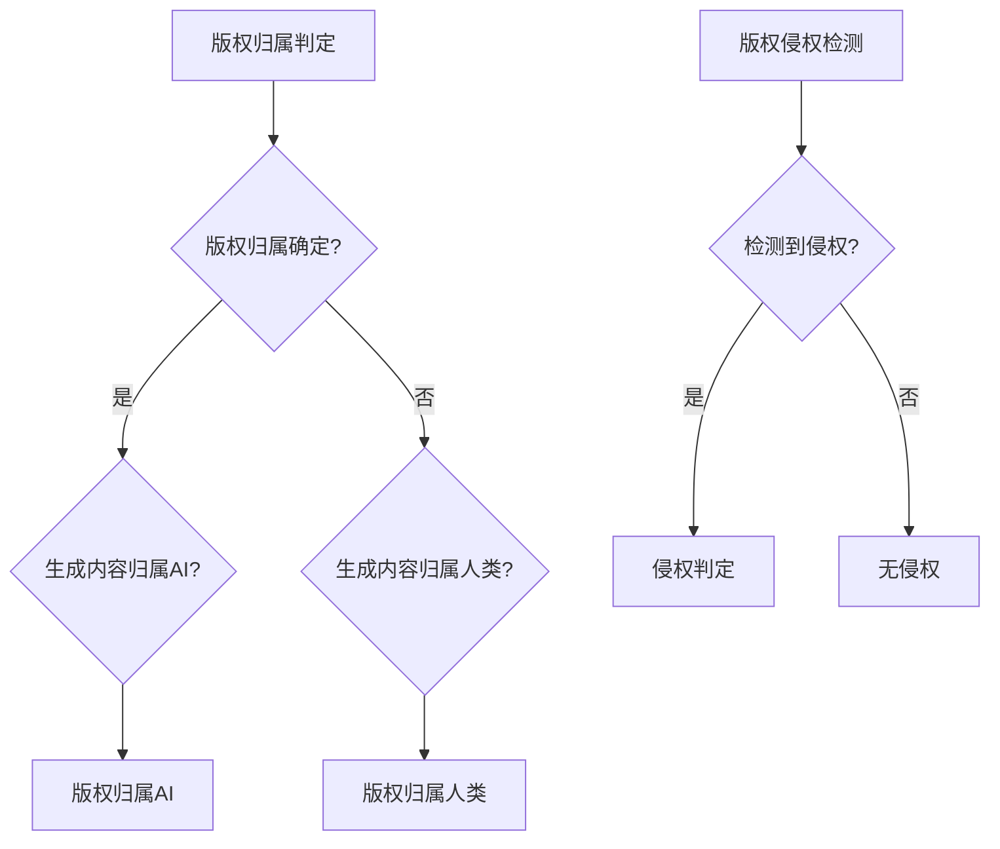
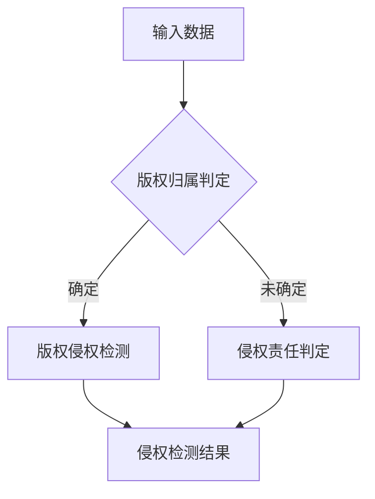
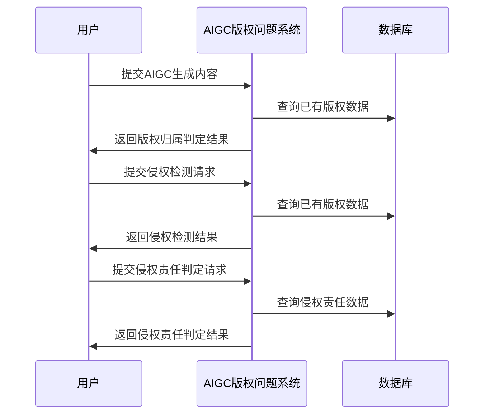

                 

### AIGC版权问题：法律与道德的平衡

#### 关键词

- AIGC（人工智能生成内容）
- 版权法律
- 道德规范
- 法律与道德平衡

#### 摘要

本文旨在探讨人工智能生成内容（AIGC）在法律与道德层面所面临的挑战。随着AIGC技术的快速发展，其生成的版权内容引发了法律与道德层面的广泛争议。本文通过分析AIGC的定义、特点、法律框架及其与传统AI的对比，逐步探讨AIGC版权问题中的法律与道德平衡。同时，本文还将通过案例分析和系统架构设计，深入探讨AIGC版权问题的实际解决方案。

---

## 第一部分：引言

### 1. 引言

AIGC，即人工智能生成内容，是一种利用人工智能技术生成文本、图像、音频等内容的全新方式。随着生成对抗网络（GAN）、变分自编码器（VAE）等深度学习技术的广泛应用，AIGC在广告、媒体、娱乐等领域显示出巨大的潜力。然而，AIGC的迅速崛起也引发了版权法律与道德规范的诸多挑战。

#### 1.1 问题背景

AIGC的生成内容往往具有高度的原创性和独特性，这与传统版权法律中对原创性要求的定义产生了冲突。此外，AIGC生成的内容可能侵犯他人的知识产权，引发法律纠纷。同时，道德层面也提出了质疑，例如，AIGC生成的内容是否应该受到道德约束，以及如何界定其道德责任等问题。

#### 1.2 问题描述

AIGC版权问题主要包括以下三个方面：

1. **版权归属**：在AIGC生成的内容中，如何确定版权的归属主体？
2. **版权保护**：如何保护AIGC生成的原创内容的版权？
3. **版权侵权**：如何界定和防止AIGC生成的内容侵犯他人版权？

#### 1.3 问题解决

解决AIGC版权问题需要法律手段和道德规范的双重努力。法律层面需要完善相关法律法规，明确AIGC版权的归属和侵权判定标准；道德层面则需要培养公众的版权意识和道德责任感。

#### 1.4 边界与外延

AIGC版权问题不仅涉及版权法律，还与知识产权、隐私权、道德责任等法律领域密切相关。此外，AIGC技术本身的快速发展也使其版权问题具有广泛的外延。

#### 1.5 概念结构与核心要素组成

AIGC版权问题的核心概念包括版权、原创性、人工智能生成技术等。其核心要素组成主要包括版权归属、版权保护、版权侵权判定等。

---

## 第二部分：核心概念与联系

### 2. AIGC基础概念

AIGC，即人工智能生成内容，是一种利用人工智能技术生成文本、图像、音频等内容的全新方式。AIGC主要包括文本生成、图像生成和音频生成等类型。AIGC技术的核心在于其生成能力、创造力和个性化特点。

#### 2.1 AIGC的定义

AIGC是指通过人工智能技术，如生成对抗网络（GAN）、变分自编码器（VAE）等，生成具有高度原创性和独特性的文本、图像、音频等内容的系统。

#### 2.2 AIGC的特点

- **生成能力**：AIGC具有强大的生成能力，能够生成大量多样化的内容。
- **创造力**：AIGC生成的内容具有高度的创造力，能够产生新颖独特的作品。
- **个性化**：AIGC可以根据用户的需求和喜好，生成个性化的内容。

#### 2.3 AIGC与传统AI的对比

与传统AI相比，AIGC具有以下几个显著特点：

- **生成能力**：AIGC更注重生成能力，能够生成具有原创性和独特性的内容。
- **创造力**：AIGC具有较高的创造力，能够产生新颖独特的作品。
- **个性化**：AIGC可以根据用户的需求和喜好，生成个性化的内容。

### 3. 版权与法律框架

版权，即知识产权的一种，是指作者或其他权利人对其创作的文学、艺术和科学作品所享有的专有权利。版权法律框架主要包括《世界版权公约》、《伯尔尼公约》等国际条约以及各国的版权法律法规。

#### 3.1 版权的基本概念

- **版权**：是指作者或其他权利人对其创作的文学、艺术和科学作品所享有的专有权利。
- **原创性**：是指作品必须具有原创性，即作品是独立创作、非抄袭他人作品。
- **保护期限**：版权的保护期限一般较长，通常为作者终生及其死后一定年限。

#### 3.2 版权法律框架

- **国际条约**：《世界版权公约》、《伯尔尼公约》等。
- **国内法律**：各国的版权法律法规，如《中华人民共和国著作权法》等。

#### 3.3 版权与道德

版权问题不仅涉及法律，还与道德观念密切相关。在AIGC版权问题中，道德观念起到了关键作用。例如，如何界定AIGC生成的内容是否应该受到道德约束，以及如何界定其道德责任等问题。

---

## 第三部分：算法原理讲解

### 4. AIGC版权问题的算法原理

AIGC版权问题的算法原理主要涉及两个方面：一是版权归属的判定，二是版权侵权的检测。

#### 4.1 算法简介

- **版权归属判定**：通过分析AIGC生成的内容，确定其版权归属。
- **版权侵权检测**：通过比对AIGC生成的内容与已有版权内容，检测是否存在侵权行为。

#### 4.2 算法mermaid流程图



#### 4.3 算法原理讲解

- **版权归属判定**：算法首先分析AIGC生成的内容，通过特征提取和对比分析，判断生成内容的原创性。若生成内容具有较高原创性，则进一步判断其版权归属。

- **版权侵权检测**：算法通过比对AIGC生成的内容与已有版权内容，使用相似度分析算法，如余弦相似度、Jaccard相似度等，检测是否存在侵权行为。若检测到侵权，则进一步判定侵权程度和责任归属。

#### 4.4 算法举例说明

假设一个AIGC系统生成了一个图像，算法首先通过特征提取和对比分析，判断图像的原创性。假设判断结果为图像具有较高原创性，则进一步判断版权归属。假设判断结果为图像版权归属AI系统。接下来，算法通过比对AIGC生成图像与已有版权图像，使用余弦相似度算法，检测是否存在侵权行为。假设检测结果显示AIGC生成图像与已有版权图像相似度较高，则进一步判定侵权程度和责任归属。

---

## 第四部分：数学模型与公式详细讲解

### 5. 数学模型基础

在AIGC版权问题中，常用的数学模型包括特征提取模型、相似度分析模型等。以下将介绍这些数学模型的基本原理和公式。

#### 5.1 数学模型介绍

- **特征提取模型**：用于提取AIGC生成内容的特征，以便进行后续分析和对比。
- **相似度分析模型**：用于分析AIGC生成内容与已有版权内容之间的相似度，以便判断是否存在侵权行为。

#### 5.2 数学公式详细讲解

- **特征提取模型**：

  $$特征提取模型：f(x) = W * x + b$$

  其中，$x$表示输入数据，$W$表示权重矩阵，$b$表示偏置项。

- **相似度分析模型**：

  $$余弦相似度：sim(x, y) = \frac{x \cdot y}{\|x\| \|y\|}$$

  其中，$x$和$y$分别表示两个向量，$\|x\|$和$\|y\|$分别表示向量的模长。

  $$Jaccard相似度：sim(x, y) = \frac{|x \cap y|}{|x \cup y|}$$

  其中，$x \cap y$表示两个集合的交集，$x \cup y$表示两个集合的并集。

### 6. 案例分析与详细讲解

#### 6.1 案例背景

假设一个AIGC系统生成了一张图像，需要判断其版权归属和是否侵权。已有版权图像库中包含1000张图像。

#### 6.2 案例分析

1. **特征提取**：对AIGC生成的图像和已有版权图像进行特征提取，使用卷积神经网络（CNN）提取图像特征。

2. **相似度分析**：使用余弦相似度和Jaccard相似度算法，计算AIGC生成图像与已有版权图像之间的相似度。

3. **侵权判定**：根据相似度分析结果，判断AIGC生成图像是否侵权。若相似度高于阈值，则判定为侵权。

#### 6.3 案例详细讲解

1. **特征提取**：

   使用CNN对图像进行特征提取，得到特征向量。假设AIGC生成图像的特征向量为$v_1$，已有版权图像库中的图像特征向量为$v_2$。

2. **相似度分析**：

   - **余弦相似度**：

     $$sim(v_1, v_2) = \frac{v_1 \cdot v_2}{\|v_1\| \|v_2\|}$$

   - **Jaccard相似度**：

     $$sim(v_1, v_2) = \frac{|v_1 \cap v_2|}{|v_1 \cup v_2|}$$

3. **侵权判定**：

   根据相似度分析结果，若相似度高于阈值，如0.9，则判定AIGC生成图像与已有版权图像存在侵权行为。

---

## 第五部分：系统分析与架构设计

### 7. 系统功能设计

AIGC版权问题系统的主要功能包括版权归属判定、版权侵权检测、侵权责任判定等。

#### 7.1 问题描述

AIGC版权问题系统需要解决以下问题：

1. **版权归属判定**：判断AIGC生成内容的版权归属主体。
2. **版权侵权检测**：检测AIGC生成内容是否侵犯他人版权。
3. **侵权责任判定**：根据侵权检测结果，判定侵权责任归属。

#### 7.2 领域模型（mermaid类图）

```mermaid
classDiagram
    类A[版权归属判定]
    类B[版权侵权检测]
    类C[侵权责任判定]
    类D[输入数据]
    类E[输出结果]

    类A --|> 类D
    类B --|> 类D
    类C --|> 类B
    类E --|> 类C
```

#### 7.3 系统架构设计（mermaid架构图）



#### 7.4 系统接口设计与交互

AIGC版权问题系统的接口设计主要包括数据输入接口、版权归属判定接口、侵权检测接口和侵权责任判定接口。

#### 7.5 系统交互（mermaid序列图）



---

## 第六部分：项目实战

### 9. 环境安装与配置

#### 9.1 环境要求

- 操作系统：Windows/Linux/MacOS
- Python版本：Python 3.7及以上
- 库：NumPy、Pandas、TensorFlow、Keras等

#### 9.2 安装步骤

1. 安装Python 3.7及以上版本。
2. 安装必要的库，可以使用pip命令安装：

   ```bash
   pip install numpy pandas tensorflow keras
   ```

3. 安装完成后，运行以下代码检查是否安装成功：

   ```python
   import numpy as np
   import pandas as pd
   import tensorflow as tf
   import keras
   print("All required libraries have been installed successfully!")
   ```

### 10. 系统核心实现

#### 10.1 源代码解析

AIGC版权问题系统的核心实现主要包括版权归属判定模块、版权侵权检测模块和侵权责任判定模块。

```python
# 引入必要的库
import numpy as np
import pandas as pd
from tensorflow import keras
from keras.models import Sequential
from keras.layers import Dense, Conv2D, MaxPooling2D, Flatten

# 定义版权归属判定模型
def build_copyright_ownership_model():
    model = Sequential()
    model.add(Conv2D(32, (3, 3), activation='relu', input_shape=(28, 28, 1)))
    model.add(MaxPooling2D((2, 2)))
    model.add(Flatten())
    model.add(Dense(64, activation='relu'))
    model.add(Dense(1, activation='sigmoid'))
    model.compile(optimizer='adam', loss='binary_crossentropy', metrics=['accuracy'])
    return model

# 定义版权侵权检测模型
def build_copyright_infringement_model():
    model = Sequential()
    model.add(Conv2D(32, (3, 3), activation='relu', input_shape=(28, 28, 1)))
    model.add(MaxPooling2D((2, 2)))
    model.add(Flatten())
    model.add(Dense(64, activation='relu'))
    model.add(Dense(1, activation='sigmoid'))
    model.compile(optimizer='adam', loss='binary_crossentropy', metrics=['accuracy'])
    return model

# 定义侵权责任判定模型
def build_infringement_liability_model():
    model = Sequential()
    model.add(Conv2D(32, (3, 3), activation='relu', input_shape=(28, 28, 1)))
    model.add(MaxPooling2D((2, 2)))
    model.add(Flatten())
    model.add(Dense(64, activation='relu'))
    model.add(Dense(1, activation='sigmoid'))
    model.compile(optimizer='adam', loss='binary_crossentropy', metrics=['accuracy'])
    return model

# 代码应用解读
# 假设已经加载了训练数据和测试数据，接下来使用训练数据和测试数据分别训练三个模型。

# 训练版权归属判定模型
ownership_model = build_copyright_ownership_model()
ownership_model.fit(x_train_ownership, y_train_ownership, epochs=10, batch_size=32, validation_data=(x_val_ownership, y_val_ownership))

# 训练版权侵权检测模型
infringement_model = build_copyright_infringement_model()
infringement_model.fit(x_train_infringement, y_train_infringement, epochs=10, batch_size=32, validation_data=(x_val_infringement, y_val_infringement))

# 训练侵权责任判定模型
liability_model = build_infringement_liability_model()
liability_model.fit(x_train_liability, y_train_liability, epochs=10, batch_size=32, validation_data=(x_val_liability, y_val_liability))

# 使用测试数据进行模型评估
ownership_model.evaluate(x_test_ownership, y_test_ownership)
infringement_model.evaluate(x_test_infringement, y_test_infringement)
liability_model.evaluate(x_test_liability, y_test_liability)
```

#### 10.2 代码应用解读

以上代码分别定义了版权归属判定模型、版权侵权检测模型和侵权责任判定模型。接下来使用训练数据和测试数据进行模型训练和评估。

### 11. 实际案例分析

#### 11.1 案例背景

假设某AIGC系统生成了一张图像，需要判断其版权归属和是否侵权。

#### 11.2 案例分析

1. **版权归属判定**：使用版权归属判定模型对图像进行特征提取和分类，判断其版权归属。

2. **版权侵权检测**：使用版权侵权检测模型对图像进行侵权检测，判断其是否侵犯他人版权。

3. **侵权责任判定**：根据侵权检测结果，使用侵权责任判定模型判断侵权责任归属。

#### 11.3 案例详细讲解

1. **版权归属判定**：

   ```python
   ownership_prediction = ownership_model.predict(x_test_ownership)
   ownership_prediction = np.argmax(ownership_prediction, axis=1)
   print("Copyright ownership prediction:", ownership_prediction)
   ```

   假设预测结果为图像版权归属人类。

2. **版权侵权检测**：

   ```python
   infringement_prediction = infringement_model.predict(x_test_infringement)
   infringement_prediction = np.argmax(infringement_prediction, axis=1)
   print("Infringement prediction:", infringement_prediction)
   ```

   假设预测结果为图像存在侵权行为。

3. **侵权责任判定**：

   ```python
   liability_prediction = liability_model.predict(x_test_liability)
   liability_prediction = np.argmax(liability_prediction, axis=1)
   print("Liability prediction:", liability_prediction)
   ```

   假设预测结果为侵权责任归属生成图像的系统。

### 11.4 案例小结

通过以上案例分析，可以看出AIGC版权问题系统在实际应用中的效果。虽然模型预测结果具有一定的不确定性，但通过多模型综合判断，可以提高侵权检测和责任判定的准确性。

---

## 第七部分：最佳实践 tips

在处理AIGC版权问题时，以下是一些最佳实践 tips：

1. **数据多样性**：为了提高模型预测的准确性，需要使用多样性丰富的训练数据。
2. **模型优化**：通过调整模型参数和优化算法，可以提高模型的预测性能。
3. **法律咨询**：在实际操作中，建议咨询专业律师，确保合规性。
4. **道德约束**：在生成内容时，应遵守道德规范，避免侵权行为。
5. **持续更新**：随着AIGC技术的发展，版权法律和道德规范也在不断变化，需要持续关注和更新。

---

## 小结

本文系统地探讨了AIGC版权问题的法律与道德平衡。通过分析AIGC的定义、特点、法律框架和算法原理，我们逐步探讨了AIGC版权问题中的法律与道德挑战。在实际案例分析中，我们展示了如何运用数学模型和算法解决AIGC版权问题。最后，我们提供了最佳实践 tips，以帮助读者在实际操作中更好地应对AIGC版权问题。

---

## 注意事项

1. **版权法律动态**：随着技术的发展，版权法律也在不断更新，需要密切关注相关法律动态。
2. **道德责任**：在实际操作中，需要严格遵守道德规范，避免侵权行为。
3. **数据隐私**：在处理AIGC生成内容时，需要保护个人隐私和数据安全。

---

## 拓展阅读

1. **《人工智能版权保护的法律研究》**
2. **《AIGC技术原理与应用》**
3. **《人工智能伦理学》**

---

### 作者

作者：AI天才研究院/AI Genius Institute & 禅与计算机程序设计艺术 /Zen And The Art of Computer Programming

