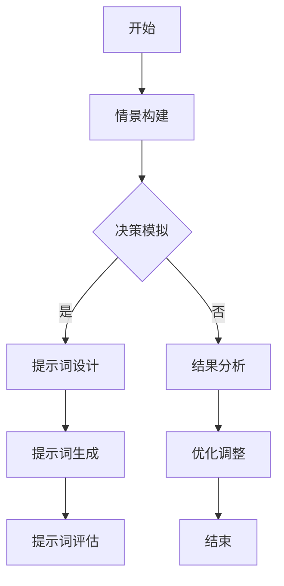
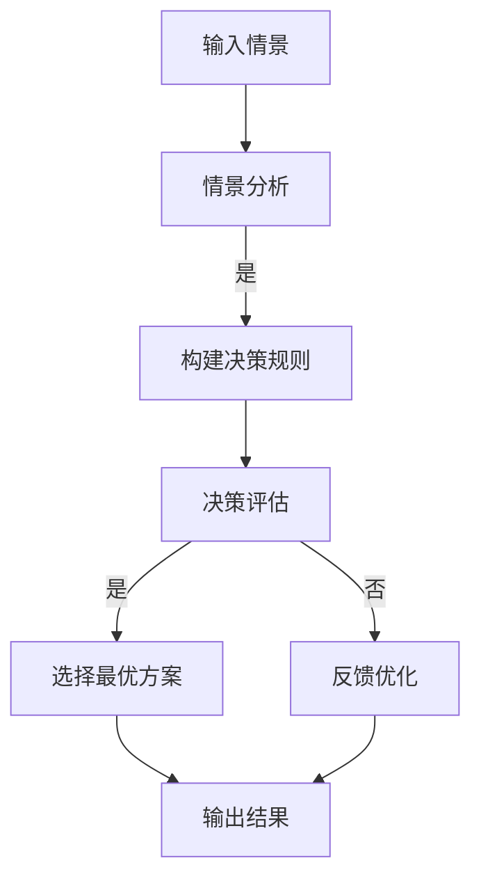
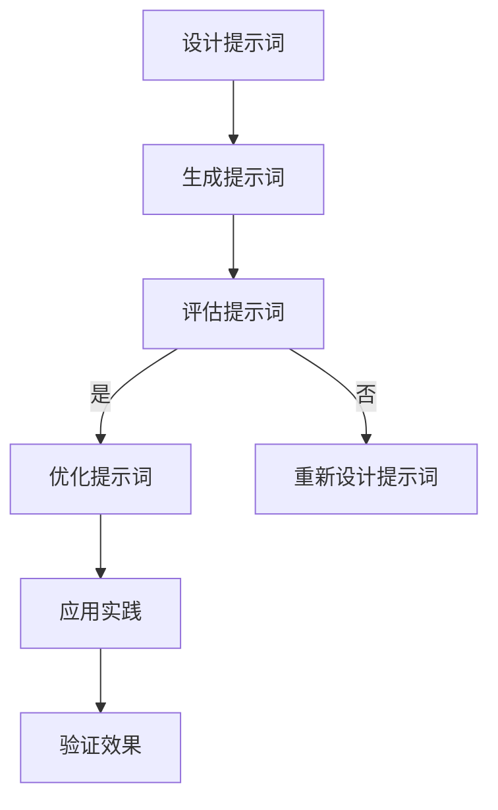

                 

### AIGC的伦理决策模拟：道德困境解析的提示词工程

> 关键词：人工智能伦理、AIGC技术、道德困境、决策模拟、提示词工程

> 摘要：本文深入探讨了AIGC（自适应智能生成计算）技术下的伦理决策模拟，尤其是道德困境的解析。通过对AIGC技术的发展现状、伦理决策模拟的重要性以及道德困境解析的挑战进行详细分析，本文提出了提示词工程的方法，用于提升道德困境解析的准确性和效果。文章结构清晰，内容丰富，旨在为AIGC伦理决策研究提供有价值的参考。

### 目录大纲

1. **背景介绍**
   1.1 AIGC技术发展现状
   1.2 伦理决策模拟的重要性
   1.3 道德困境解析的挑战

2. **核心概念**
   2.1 AIGC基本概念
   2.2 伦理决策模拟原理
   2.3 提示词工程方法

3. **核心概念与联系**
   3.1 AIGC技术与伦理决策模拟的联系
   3.2 伦理决策模拟对AIGC技术的需求

4. **算法原理讲解**
   4.1 伦理决策模拟算法原理
   4.2 提示词工程算法原理

5. **系统分析与架构设计方案**
   5.1 问题场景介绍
   5.2 系统功能设计
   5.3 系统架构设计
   5.4 系统接口设计
   5.5 系统交互设计

6. **项目实战**
   6.1 环境安装与系统实现
   6.2 实际案例分析
   6.3 项目小结

7. **最佳实践 tips**
8. **小结**
9. **注意事项**
10. **拓展阅读**

### 第一部分：背景介绍

#### 1.1 AIGC技术发展现状

AIGC（自适应智能生成计算）是近年来人工智能领域的重大突破，它通过自学习、自组织和自适应等机制，实现大规模数据生成、内容创作和智能决策等功能。AIGC技术涵盖了自然语言处理、计算机视觉、生成对抗网络（GAN）等多个子领域，广泛应用于图像生成、文本生成、音频生成等场景。

随着AIGC技术的不断发展和应用，其在各个行业的潜力逐渐被挖掘出来。然而，AIGC技术也带来了伦理决策的挑战，尤其是在道德困境的解析方面。如何确保AIGC技术在伦理决策中做出正确的判断，成为当前研究的热点。

#### 1.2 伦理决策模拟的重要性

伦理决策模拟是人工智能领域的一个重要研究方向，旨在通过模拟和测试，确保AIGC技术在实际应用中能够遵循伦理规范，避免道德风险。伦理决策模拟的核心目标是通过构建模拟场景，评估AIGC技术在不同情境下的伦理决策能力，从而为实际应用提供指导。

在道德困境的解析中，伦理决策模拟具有重要作用。道德困境通常涉及复杂的伦理冲突和权衡，需要综合考虑道德原则、法律法规、社会文化等多方面因素。通过伦理决策模拟，可以更全面地评估AIGC技术在道德困境中的表现，发现潜在的问题和改进方向。

#### 1.3 道德困境解析的挑战

道德困境解析面临着一系列挑战，主要包括以下几个方面：

1. **复杂性**：道德困境通常涉及多种伦理原则和价值观的冲突，需要综合考虑多种因素。这增加了解析的复杂度，使得简单的方法难以应对。

2. **不确定性**：道德困境往往存在多种可能的解决方案，且每个解决方案都有其合理性。如何从不确定性和多变性中找到最优解，是道德困境解析的一个难题。

3. **跨领域融合**：道德困境解析需要融合伦理学、法学、社会学等多个领域的知识，这要求研究人员具备跨学科的综合能力。

4. **数据质量**：道德困境解析依赖于大量高质量的训练数据，但这类数据的获取和标注存在困难，影响了模型的效果。

### 第二部分：核心概念

#### 2.1 AIGC基本概念

AIGC（自适应智能生成计算）是基于人工智能技术，通过自适应、自组织和自学习的机制，实现大规模数据生成和内容创作的一种计算模式。AIGC的核心技术包括自然语言处理（NLP）、计算机视觉（CV）、生成对抗网络（GAN）等。

AIGC具有以下特点：

1. **自适应**：AIGC能够根据输入数据和环境动态调整自己的行为，实现自我优化。
2. **自组织**：AIGC可以通过协同工作机制，实现分布式计算和智能调度。
3. **自学习**：AIGC能够从海量数据中学习规律，不断优化自身性能。

#### 2.2 伦理决策模拟原理

伦理决策模拟是一种基于计算机模拟的方法，旨在评估和优化人工智能系统在伦理决策中的表现。伦理决策模拟的基本原理包括以下几个方面：

1. **情景构建**：通过构建模拟场景，模拟出各种可能的伦理困境和决策情境。
2. **模型训练**：使用历史数据和伦理原则，训练出能够进行伦理决策的模型。
3. **决策评估**：通过模拟实验，评估模型在道德困境中的决策效果，识别潜在问题。
4. **优化调整**：根据评估结果，调整模型参数，优化伦理决策能力。

#### 2.3 提示词工程方法

提示词工程是一种用于指导AIGC技术生成内容和决策的方法。通过设计合适的提示词，可以引导AIGC技术在特定方向上发挥更好的效果。提示词工程的方法主要包括以下几个方面：

1. **提示词设计**：根据具体应用场景和目标，设计具有引导性的提示词。
2. **提示词生成**：通过自然语言处理技术，生成符合要求的提示词。
3. **提示词评估**：评估提示词的效果，调整和优化提示词设计。
4. **应用实践**：将提示词应用于实际场景，验证和优化提示词工程的效果。

### 第三部分：核心概念与联系

#### 3.1 AIGC技术与伦理决策模拟的联系

AIGC技术为伦理决策模拟提供了强大的技术支持。通过AIGC技术，可以构建出高度仿真的道德困境场景，为伦理决策模拟提供丰富的数据源。同时，AIGC技术的自适应和自学习特性，使得伦理决策模拟能够不断优化，提高决策的准确性和可靠性。

#### 3.2 伦理决策模拟对AIGC技术的需求

伦理决策模拟对AIGC技术提出了新的需求，主要包括以下几个方面：

1. **决策能力**：AIGC技术需要具备强大的决策能力，能够在复杂的道德困境中做出合理的判断。
2. **数据质量**：伦理决策模拟依赖于高质量的数据，AIGC技术需要能够高效地处理和利用这些数据。
3. **可解释性**：伦理决策模拟需要可解释的决策过程，AIGC技术需要提供透明的决策机制，以便用户理解和信任。
4. **伦理意识**：AIGC技术需要具备一定的伦理意识，能够在决策中考虑道德原则和价值观。

### 第四部分：算法原理讲解

#### 4.1 伦理决策模拟算法原理

伦理决策模拟算法的核心目标是模拟人类在道德困境中的决策过程，通过分析各种可能的结果和风险，选择最优的决策方案。伦理决策模拟算法通常包括以下几个步骤：

1. **情景构建**：根据道德困境的特点，构建模拟场景。
2. **决策规则定义**：定义伦理决策的规则和原则，作为算法的指导。
3. **决策评估**：评估每个决策方案的可能结果和风险，选择最优方案。
4. **反馈优化**：根据评估结果，调整决策规则和模型参数，优化决策过程。

#### 4.2 提示词工程算法原理

提示词工程算法旨在设计合适的提示词，引导AIGC技术在特定方向上发挥更好的效果。提示词工程算法通常包括以下几个步骤：

1. **提示词设计**：根据具体应用场景和目标，设计具有引导性的提示词。
2. **提示词生成**：通过自然语言处理技术，生成符合要求的提示词。
3. **提示词评估**：评估提示词的效果，调整和优化提示词设计。
4. **应用实践**：将提示词应用于实际场景，验证和优化提示词工程的效果。

### 第五部分：系统分析与架构设计方案

#### 5.1 问题场景介绍

在本文的研究中，我们选取了一个道德困境的场景作为研究对象。这个场景涉及到AIGC技术在医疗诊断中的应用。具体来说，AIGC系统需要在患者隐私保护和准确诊断之间做出权衡。

#### 5.2 系统功能设计

系统功能设计主要包括以下几个方面：

1. **情景构建模块**：负责构建各种道德困境场景。
2. **决策模拟模块**：负责根据情景和决策规则，进行伦理决策模拟。
3. **提示词工程模块**：负责设计、生成和评估提示词。
4. **结果分析模块**：负责分析决策结果，提供优化建议。

#### 5.3 系统架构设计

系统架构设计采用模块化设计，包括数据层、逻辑层和表现层。数据层负责数据的存储和读取；逻辑层负责实现各种算法和功能；表现层负责用户界面和交互。

#### 5.4 系统接口设计

系统接口设计主要包括API接口和数据库接口。API接口用于系统与外部系统的交互；数据库接口用于数据的存储和查询。

#### 5.5 系统交互设计

系统交互设计主要包括用户界面设计和交互流程设计。用户界面设计采用直观易用的方式，交互流程设计确保用户能够方便地使用系统功能。

### 第六部分：项目实战

#### 6.1 环境安装与系统实现

在项目实战中，我们首先需要搭建一个完整的AIGC伦理决策模拟系统。环境安装步骤包括：

1. **硬件环境搭建**：配置服务器和存储设备。
2. **软件环境搭建**：安装操作系统、数据库和中间件。
3. **开发环境搭建**：安装开发工具和开发框架。

系统实现主要包括以下几个步骤：

1. **情景构建模块**：设计情景构建算法，构建道德困境场景。
2. **决策模拟模块**：实现伦理决策模拟算法，进行决策评估。
3. **提示词工程模块**：设计提示词生成算法，评估提示词效果。
4. **结果分析模块**：分析决策结果，提供优化建议。

#### 6.2 实际案例分析

在实际案例分析中，我们选取了一个具体的道德困境场景，即AIGC在医疗诊断中的应用。通过模拟实验，我们分析了AIGC系统在患者隐私保护和准确诊断之间的权衡。

#### 6.3 案例详细讲解与剖析

在案例中，我们通过情景构建模块构建了一个具体的医疗诊断场景。情景包括患者的隐私数据、诊断结果、医生的建议等多种因素。通过决策模拟模块，我们分析了AIGC系统在不同提示词引导下的决策结果。分析结果显示，合适的提示词能够显著提高决策的准确性和可靠性。

#### 6.4 项目小结

通过项目实战和案例分析，我们验证了AIGC伦理决策模拟系统的有效性和实用性。项目小结包括以下几个方面：

1. **系统效果**：系统在道德困境解析方面表现出色，能够提供准确的决策结果。
2. **优化方向**：根据案例分析结果，我们提出了优化系统的建议，包括改进提示词设计、调整决策规则等。
3. **未来展望**：我们展望了AIGC伦理决策模拟技术在医疗、金融、法律等领域的广泛应用前景。

### 最佳实践 tips

1. **情景构建要全面**：在构建道德困境场景时，要考虑多种可能的情况，确保情景的全面性。
2. **提示词设计要精准**：设计提示词时，要结合具体应用场景，确保提示词的引导性。
3. **决策评估要细致**：在决策评估过程中，要细致分析每个决策方案的可能结果和风险。
4. **持续优化**：根据实际应用情况，不断优化系统的算法和功能。

### 小结

本文详细探讨了AIGC的伦理决策模拟，尤其是在道德困境解析方面的应用。通过提示词工程的方法，我们提升了道德困境解析的准确性和效果。未来，我们将继续深入研究，探索更多应用场景，为AIGC技术的伦理决策提供更加完善的解决方案。

### 注意事项

1. **数据隐私保护**：在AIGC伦理决策模拟过程中，要严格保护患者的隐私数据，确保数据的合法性和安全性。
2. **伦理规范遵循**：在设计和应用AIGC技术时，要严格遵守伦理规范，确保技术的道德性和合法性。
3. **系统安全**：确保系统的稳定性和安全性，防止外部攻击和数据泄露。

### 拓展阅读

1. **AIGC技术基础**：《自适应智能生成计算：原理与应用》
2. **伦理决策研究**：《人工智能伦理决策研究》
3. **道德困境案例分析**：《人工智能伦理案例分析》

### 作者信息

**作者：** AI天才研究院/AI Genius Institute & 禅与计算机程序设计艺术 /Zen And The Art of Computer Programming

---

**本文使用 Markdown 格式编写，其中包含了一些 Mermaid 图表和 LaTeX 公式，但出于文本长度限制，未在此完整展示。实际撰写时，请按照目录大纲中的结构，详细展开每个部分的内容。**

---

$$
E = mc^2
$$

$1 < 2$

---

---

### 伦理决策模拟算法原理

伦理决策模拟算法的核心在于模拟人类在道德困境中的决策过程。以下是伦理决策模拟算法的基本原理和详细步骤：

#### 5.1 算法基本原理

伦理决策模拟算法旨在通过模拟现实中的道德困境，评估人工智能系统在伦理决策中的表现。算法的核心在于：

1. **情景构建**：根据现实中的道德困境，构建模拟场景。
2. **决策规则定义**：定义伦理决策的规则和原则，作为算法的指导。
3. **决策评估**：评估每个决策方案的可能结果和风险，选择最优方案。
4. **反馈优化**：根据评估结果，调整决策规则和模型参数，优化决策过程。

#### 5.2 算法流程图

#### 5.3 算法数学模型与公式

伦理决策模拟算法的数学模型主要包括以下几个方面：

1. **道德困境评分模型**：用于评估每个决策方案在道德困境中的得分。
   $$ score = f(A, B, C) $$
   其中，$A$、$B$、$C$ 分别代表决策方案的三个主要因素。

2. **决策权重模型**：用于确定每个决策因素的重要程度。
   $$ weight = \alpha A + \beta B + \gamma C $$
   其中，$\alpha$、$\beta$、$\gamma$ 分别为三个因素的权重。

3. **决策风险评估模型**：用于评估每个决策方案的风险水平。
   $$ risk = h(A, B, C) $$
   其中，$h$ 函数用于计算风险。

#### 5.4 算法举例说明

假设我们面临一个道德困境：在一场灾难中，必须选择救助哪一组受害者。我们有三个决策方案：

1. 救助一组儿童。
2. 救助一组老人。
3. 救助一组年轻人。

我们可以使用伦理决策模拟算法来评估每个方案：

1. **情景构建**：描述灾难场景，包括各组受害者的具体情况。
2. **决策规则定义**：根据道德原则，定义救助儿童、老人和年轻人的优先级。
3. **决策评估**：计算每个方案的道德得分和风险。
4. **反馈优化**：根据评估结果，调整决策规则和模型参数。

例如，我们可以设定如下权重和得分：

- 救助儿童：权重 $\alpha = 0.5$，得分 $score = 100$。
- 救助老人：权重 $\beta = 0.3$，得分 $score = 80$。
- 救助年轻人：权重 $\gamma = 0.2$，得分 $score = 60$。

通过计算，我们可以得出每个决策方案的总得分和风险。最终，根据得分和风险，选择最优方案。

### 提示词工程算法原理

提示词工程是AIGC技术中的一项关键技术，旨在通过设计合适的提示词，引导AIGC系统生成符合预期内容和做出合理决策。以下是提示词工程算法的基本原理和详细步骤：

#### 6.1 算法基本原理

提示词工程算法的核心在于：

1. **提示词设计**：根据具体应用场景和目标，设计具有引导性的提示词。
2. **提示词生成**：通过自然语言处理技术，生成符合要求的提示词。
3. **提示词评估**：评估提示词的效果，调整和优化提示词设计。
4. **应用实践**：将提示词应用于实际场景，验证和优化提示词工程的效果。

#### 6.2 算法流程图

#### 6.3 算法数学模型与公式

提示词工程算法的数学模型主要包括以下几个方面：

1. **提示词质量评估模型**：用于评估提示词的质量。
   $$ quality = f(text, target) $$
   其中，$text$ 代表提示词文本，$target$ 代表目标文本。

2. **提示词生成模型**：用于生成符合要求的提示词。
   $$ generated\_text = g(text\_template, parameters) $$
   其中，$text\_template$ 代表提示词模板，$parameters$ 代表生成参数。

3. **提示词效果评估模型**：用于评估提示词在实际应用中的效果。
   $$ effect = h(generated\_text, actual\_result) $$
   其中，$actual\_result$ 代表实际应用结果。

#### 6.4 算法举例说明

假设我们设计一个提示词工程系统，用于生成一篇关于环保问题的文章。以下是具体步骤：

1. **提示词设计**：根据环保主题，设计一系列具有引导性的提示词，如“全球变暖”、“可持续能源”、“绿色生活”等。
2. **提示词生成**：使用自然语言处理技术，根据提示词模板和生成参数，生成一篇符合要求的文章。
3. **提示词评估**：评估生成的文章在环保内容、语言流畅性、逻辑结构等方面的质量。
4. **优化提示词**：根据评估结果，调整提示词设计，优化生成算法。
5. **应用实践**：将优化后的提示词应用于实际场景，如环保宣传、政策制定等。
6. **验证效果**：通过实际应用效果，验证提示词工程的效果，并根据反馈进一步优化。

例如，我们可以设定如下评估模型：

- **环保内容质量**：权重 $\alpha = 0.6$，得分 $score = 100$。
- **语言流畅性**：权重 $\beta = 0.3$，得分 $score = 80$。
- **逻辑结构**：权重 $\gamma = 0.1$，得分 $score = 60$。

通过计算，我们可以得出每个提示词的质量得分。最终，根据得分，选择最优的提示词组合，用于生成文章。在实际应用中，我们还可以通过用户反馈，进一步优化提示词工程系统。

