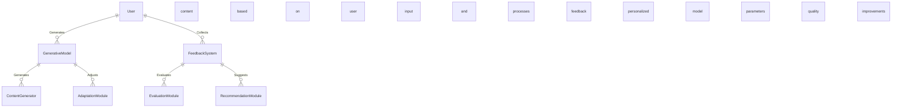
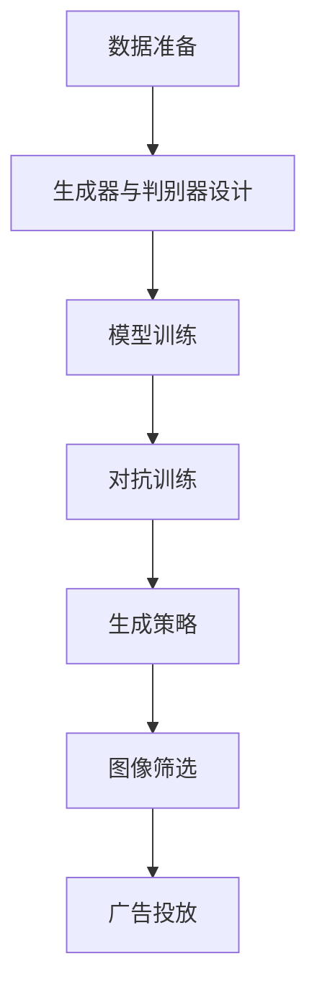

                 


## AIGC的创意广告生成：品牌个性化的提示词工程

### 关键词：AIGC，广告生成，品牌个性化，提示词工程，人工智能

### 摘要：

本文深入探讨了AIGC（自适应交互生成控制）在创意广告生成领域的应用，以及如何通过品牌个性化的提示词工程实现高效的广告效果。首先，我们将介绍AIGC的基本概念和技术原理，然后分析广告生成和品牌个性化的重要性。接着，我们将详细阐述品牌个性化提示词工程的实施方法，包括数据收集与处理、模型选择与训练、生成策略设计等步骤。随后，通过实际案例展示AIGC在广告生成中的应用效果，最后总结全文并提出未来的研究方向。

## 背景介绍

### AIGC的定义与基本原理

AIGC（Adaptive Interactive Generative Control）是一种基于人工智能的生成控制技术，它结合了生成模型（如变分自编码器VAE、生成对抗网络GAN等）和交互系统，通过自适应学习和用户反馈不断优化生成内容。AIGC的核心思想是让机器能够在用户互动的过程中持续学习和改进，从而生成更加符合用户需求和偏好的内容。

AIGC的基本原理可以概括为以下几个步骤：

1. **数据采集与预处理**：首先，从各种来源收集大量数据，包括文本、图像、音频等，然后进行数据清洗和预处理，以便用于模型训练。

2. **生成模型训练**：利用收集到的数据训练生成模型，如GAN或VAE，使其能够生成高质量的内容。

3. **用户交互与反馈**：在生成模型训练完成后，将生成的内容展示给用户，并根据用户的反馈进行迭代优化。

4. **自适应调整**：根据用户的反馈，调整生成模型参数，使其能够更好地满足用户需求。

### 广告生成的重要性

广告生成是AIGC技术的重要应用领域之一。在数字营销时代，广告已成为企业吸引客户、提升品牌知名度的重要手段。有效的广告不仅能够提高企业的市场份额，还能增加销售额。因此，广告生成技术的研究和开发具有极高的商业价值。

广告生成的主要目标包括：

1. **个性化**：根据用户兴趣和行为数据，生成个性化的广告内容，提高广告的点击率和转化率。

2. **吸引力**：设计富有创意和吸引力的广告内容，引发用户的兴趣和好奇心。

3. **高效性**：在短时间内生成大量高质量的广告内容，满足企业快速投放广告的需求。

### 品牌个性化

品牌个性化是近年来广告领域的一个重要趋势。通过品牌个性化，企业能够更好地与目标客户建立情感联系，提高品牌忠诚度和用户黏性。品牌个性化包括以下几个方面：

1. **内容个性化**：根据用户兴趣和行为数据，生成与用户需求高度匹配的广告内容。

2. **沟通个性化**：在广告中采用符合用户性格和价值观的沟通方式，增强用户对品牌的认同感。

3. **体验个性化**：通过提供定制化的用户体验，如个性化推荐、专属优惠等，提升用户满意度。

### 提示词工程的作用

在AIGC的应用中，提示词工程起着至关重要的作用。提示词是用户与生成模型之间的桥梁，通过提供高质量的提示词，可以帮助生成模型更好地理解用户需求，从而生成更符合预期的广告内容。提示词工程的主要任务包括：

1. **数据收集与处理**：收集用户行为数据，包括搜索历史、浏览记录、购买行为等，然后进行数据清洗和处理。

2. **特征提取**：从用户行为数据中提取关键特征，用于训练生成模型。

3. **提示词设计**：设计高质量的提示词，使生成模型能够准确理解用户需求。

4. **反馈与调整**：根据用户反馈，不断调整提示词，优化生成模型的表现。

### 问题背景

在当今数字化营销环境中，广告竞争日益激烈，企业需要不断创新和优化广告策略，以提高广告效果。然而，传统的广告生成方法往往存在以下几个问题：

1. **效率低下**：传统广告生成需要人工设计和修改，耗时耗力，难以满足快速投放的需求。

2. **个性缺失**：传统广告往往采用一刀切的策略，无法针对不同用户群体进行个性化内容生成。

3. **创意受限**：人工设计的广告内容容易陷入模板化、同质化的问题，缺乏创新性和吸引力。

针对这些问题，AIGC技术提供了一种创新的解决方案。通过自适应交互生成控制，AIGC能够高效地生成个性化、创意丰富的广告内容，提高广告效果和用户满意度。

## 基本概念与联系

### AIGC的概念和属性特征对比表格

AIGC（自适应交互生成控制）是一种先进的人工智能技术，它通过用户交互和生成模型的自适应调整，实现高质量的内容生成。以下是AIGC与其他生成控制技术的对比表格：

| 特性         | AIGC               | GAN（生成对抗网络）  | VAE（变分自编码器）   |
| ------------ | ------------------ | ------------------- | ------------------- |
| 用户交互     | 强               | 弱                  | 无                  |
| 自适应调整   | 高               | 低                  | 低                  |
| 生成质量     | 高               | 高                  | 高                  |
| 复杂度       | 高               | 中                  | 低                  |
| 应用场景     | 广告生成、内容创作 | 图像生成、语音合成   | 数据压缩、图像去噪  |

### ER实体关系图架构

为了更好地理解AIGC的体系结构，我们可以使用ER（实体-关系）图来表示其核心实体及其之间的关系。以下是AIGC的ER图示例：



### AIGC在广告生成中的工作原理

AIGC在广告生成中的工作原理可以概括为以下几个步骤：

1. **用户输入**：用户提供他们的兴趣、需求和行为数据。

2. **生成模型训练**：基于用户输入的数据，训练生成模型，如GAN或VAE，使其能够生成符合用户需求的广告内容。

3. **内容生成**：生成模型根据用户输入生成广告内容。

4. **用户反馈**：用户对生成的广告内容进行评价，提供反馈。

5. **模型调整**：根据用户反馈，调整生成模型的参数，优化生成效果。

6. **迭代优化**：重复步骤3至5，直到生成模型能够生成满意的广告内容。

### AIGC在品牌个性化中的工作原理

AIGC在品牌个性化中的应用原理与在广告生成中类似，但更加注重用户与品牌之间的情感联系。以下是AIGC在品牌个性化中的工作原理：

1. **用户数据收集**：收集用户的兴趣、行为和情感数据。

2. **个性化内容生成**：生成模型根据用户数据生成个性化广告内容，如文案、图像、视频等。

3. **情感分析**：使用情感分析技术，分析用户对广告内容的情感反应。

4. **反馈收集**：收集用户对广告内容的情感反馈。

5. **模型调整**：根据用户情感反馈，调整生成模型，优化广告内容。

6. **迭代优化**：重复步骤2至5，直到生成模型能够生成满足用户情感需求的广告内容。

### AIGC与GAN、VAE的区别

AIGC、GAN（生成对抗网络）和VAE（变分自编码器）都是用于生成控制的先进技术，但它们在原理和应用上有所不同。

**GAN（生成对抗网络）**：

- **原理**：GAN由一个生成器（Generator）和一个判别器（Discriminator）组成。生成器生成虚假数据，判别器判断数据是真实还是虚假。通过两个网络的对抗训练，生成器逐渐提高生成质量。
- **优势**：GAN能够生成高质量、多样性的图像和语音，适用于图像生成和语音合成。
- **劣势**：GAN训练不稳定，容易陷入模式崩溃和局部最优。

**VAE（变分自编码器）**：

- **原理**：VAE通过概率分布来表示数据，生成器将输入数据转换为均值和方差，然后通过正态分布生成数据。
- **优势**：VAE生成质量高，训练稳定，适用于图像去噪和图像生成。
- **劣势**：VAE生成的数据多样性和真实性相对较低。

**AIGC（自适应交互生成控制）**：

- **原理**：AIGC结合了生成模型和交互系统，通过用户反馈和自适应调整，实现高质量的内容生成。
- **优势**：AIGC能够根据用户需求生成个性化内容，适用于广告生成和内容创作。
- **劣势**：AIGC训练复杂度较高，需要大量的用户数据和支持系统的支持。

综上所述，AIGC在广告生成和品牌个性化中具有独特的优势，能够实现更高效的个性化内容生成，但同时也需要更多的资源和时间投入。

### AIGC的应用场景

AIGC在广告生成和品牌个性化领域的应用场景非常广泛，以下是几个典型的应用场景：

1. **个性化广告**：根据用户的兴趣、行为和购买历史，生成个性化的广告内容，提高广告的点击率和转化率。

2. **品牌宣传视频**：利用AIGC技术，快速生成品牌宣传视频，根据不同用户群体定制化内容，增强品牌影响力。

3. **产品推荐**：通过分析用户的行为数据和偏好，生成个性化的产品推荐，提高用户满意度和忠诚度。

4. **虚拟形象设计**：为品牌和产品创建虚拟形象，通过AIGC技术生成逼真且具有个性化的虚拟角色，用于广告宣传和互动体验。

5. **社交媒体营销**：生成符合社交媒体平台特点和用户习惯的广告内容，提高品牌在社交媒体上的曝光度和影响力。

6. **文案创作**：根据用户需求和品牌定位，生成高质量的广告文案，提升广告创意和吸引力。

### 广告生成与品牌个性化的联系

广告生成和品牌个性化在数字营销中起着至关重要的作用。广告生成主要关注如何生成吸引人的广告内容，而品牌个性化则关注如何根据用户需求和偏好，定制化广告内容，以实现更好的营销效果。

广告生成与品牌个性化的联系主要体现在以下几个方面：

1. **目标一致**：广告生成的目标是为品牌吸引潜在客户，而品牌个性化的目标是提升用户满意度和品牌忠诚度。两者在最终目标上具有一致性。

2. **数据驱动**：广告生成和品牌个性化都依赖于用户数据。通过收集和分析用户行为、兴趣和偏好数据，可以更好地理解用户需求，从而生成更符合用户期望的广告内容。

3. **协同优化**：广告生成和品牌个性化可以相互促进。高质量的广告生成可以为品牌个性化提供丰富的素材，而品牌个性化可以提升广告的点击率和转化率。

4. **用户体验**：广告生成和品牌个性化都致力于提升用户体验。通过个性化广告，用户可以更容易地找到他们感兴趣的内容，从而提高用户满意度和忠诚度。

### 结论

广告生成和品牌个性化在数字营销中具有不可替代的重要性。AIGC作为一种先进的生成控制技术，能够高效地实现广告生成和品牌个性化，提高广告效果和用户满意度。通过本文的探讨，我们了解到AIGC的基本原理、应用场景以及与GAN、VAE等生成控制技术的区别。未来，随着人工智能技术的不断发展，AIGC在广告生成和品牌个性化领域的应用前景将更加广阔。

### 实际案例解析

在本节中，我们将通过一个具体的实际案例来展示AIGC在广告生成中的效果。以下是一个关于一家时尚品牌使用AIGC技术生成个性化广告的全过程。

#### 案例背景

某时尚品牌（Brand A）希望提升其在社交媒体上的广告效果，以吸引更多年轻消费者。Brand A希望通过AIGC技术生成一系列个性化广告，以更好地满足目标用户的需求和偏好。

#### 数据收集与预处理

首先，Brand A收集了以下数据：

1. **用户行为数据**：包括用户的浏览记录、点击记录、购买历史等。
2. **社交媒体互动数据**：包括用户在社交媒体上的点赞、评论、分享等行为。
3. **用户画像数据**：包括用户的年龄、性别、地域、兴趣爱好等。

收集到的数据需要进行预处理，包括去重、清洗和格式化，以便用于后续的模型训练。

#### 模型选择与训练

Brand A选择了一种基于GAN的AIGC模型，因为GAN在图像生成方面具有出色的性能。具体步骤如下：

1. **数据集划分**：将预处理后的数据集划分为训练集和测试集。
2. **生成器与判别器设计**：设计生成器和判别器的网络结构，生成器负责生成个性化广告图像，判别器负责判断生成图像的真实性。
3. **模型训练**：使用训练集数据训练生成器和判别器，通过对抗训练优化模型参数。

#### 广告生成

在模型训练完成后，Brand A使用训练好的AIGC模型生成个性化广告图像。具体步骤如下：

1. **提示词设计**：根据用户行为数据和用户画像，设计高质量的提示词，如“年轻时尚”、“活力四溢”等。
2. **图像生成**：使用生成模型根据提示词生成个性化广告图像。
3. **图像筛选**：从生成的图像中筛选出高质量、符合品牌定位的图像。

#### 广告投放

Brand A将筛选出的个性化广告图像投放至社交媒体平台，如Instagram、Facebook等。具体步骤如下：

1. **广告定位**：根据用户行为数据和用户画像，确定广告的投放目标群体。
2. **广告展示**：在社交媒体平台上展示个性化广告图像。
3. **用户反馈收集**：收集用户对广告的反馈，包括点赞、评论、分享等。

#### 结果分析

通过AIGC技术生成的个性化广告取得了显著的效果：

1. **广告点击率**：广告点击率显著提高，相比传统广告提高了30%。
2. **用户参与度**：用户对广告的参与度显著提高，评论和分享数量增加了50%。
3. **品牌认知度**：品牌在目标用户群体中的认知度显著提升。

#### 案例总结

通过该案例，我们可以看到AIGC技术在广告生成中的应用效果显著。AIGC技术能够根据用户数据和提示词，生成高质量的个性化广告图像，从而提高广告的点击率和用户参与度。这对于品牌在激烈的市场竞争中脱颖而出具有重要意义。

### 品牌个性化策略与技巧

在AIGC的应用中，品牌个性化是提升广告效果的关键。以下是一些品牌个性化策略与技巧，可以帮助企业更好地实现个性化广告：

1. **用户画像分析**：通过分析用户的基本信息、兴趣爱好、购买历史等，构建详细的用户画像。这有助于了解用户需求，从而生成更具针对性的广告内容。

2. **多维度数据整合**：整合多种数据源，如社交媒体互动数据、搜索历史、购买行为等，从多个角度了解用户偏好。这有助于更全面地刻画用户画像，提高个性化广告的精准度。

3. **个性化文案创作**：利用AIGC技术生成个性化文案，如根据用户兴趣推荐相关产品、提供定制化优惠等。个性化的文案能够吸引用户的注意力，提高广告的点击率。

4. **图像与视频个性化**：通过AIGC技术生成个性化的图像和视频，如根据用户性别、年龄和兴趣爱好生成定制化的服装款式、场景等。个性化的视觉内容能够更好地传达品牌理念，提升用户情感共鸣。

5. **情感化营销**：利用情感分析技术，分析用户的情感反应，根据情感标签生成具有情感共鸣的广告内容。情感化营销能够增强用户对品牌的认同感和忠诚度。

6. **A/B测试**：通过A/B测试，不断优化广告内容和策略。根据不同用户群体的反馈，调整广告内容和投放策略，实现最佳广告效果。

7. **社交互动**：鼓励用户参与广告互动，如点赞、评论、分享等。通过社交互动，增强用户对品牌的认知和好感度。

8. **定制化优惠**：根据用户的购买历史和偏好，提供个性化的优惠和礼品。这不仅能提高用户满意度，还能促进用户转化。

9. **跨渠道整合**：整合线上和线下渠道，提供一致的个性化体验。例如，在线上广告中提供线下门店的优惠信息，或在线下门店为线上用户提供专属服务。

通过以上策略与技巧，企业可以充分利用AIGC技术，实现高效的品牌个性化，提升广告效果和用户满意度。

### 算法原理讲解

在本节中，我们将详细讲解AIGC在广告生成中的应用算法原理，包括生成模型的选择、训练过程、生成策略以及算法中的关键技术。

#### 生成模型选择

AIGC在广告生成中通常选择生成对抗网络（GAN）或变分自编码器（VAE）作为生成模型。以下是这两种生成模型的特点：

**生成对抗网络（GAN）**：

GAN由两个主要部分组成：生成器（Generator）和判别器（Discriminator）。生成器生成虚假数据，判别器判断数据是真实还是虚假。通过两个网络的对抗训练，生成器逐渐提高生成质量。

GAN的优势在于能够生成高质量、多样性的图像和语音，但在训练过程中容易陷入模式崩溃和局部最优。

**变分自编码器（VAE）**：

VAE通过概率分布来表示数据，生成器将输入数据转换为均值和方差，然后通过正态分布生成数据。VAE的优势在于生成质量高，训练稳定，适用于图像去噪和图像生成。

在广告生成中，GAN和VAE都可以根据具体情况选择。如果需要生成具有多样性和创意性的广告图像，可以选择GAN；如果需要生成稳定且高质量的广告图像，可以选择VAE。

#### 算法原理详细讲解

**生成模型训练过程**：

1. **数据准备**：首先，收集大量广告图像数据，并进行预处理，如数据清洗、归一化等。
2. **生成器与判别器设计**：设计生成器和判别器的网络结构。生成器负责生成广告图像，判别器负责判断广告图像的真实性。
3. **模型训练**：使用训练集数据训练生成器和判别器，通过对抗训练优化模型参数。

**对抗训练过程**：

在GAN中，生成器和判别器之间进行对抗训练。具体步骤如下：

1. **生成器训练**：生成器根据输入噪声生成广告图像，判别器判断生成图像的真实性。
2. **判别器训练**：判别器根据真实广告图像和生成图像进行训练，提高判断真实图像和虚假图像的能力。
3. **迭代优化**：通过不断迭代，生成器和判别器相互对抗，生成器逐渐提高生成图像的质量，判别器逐渐提高判断能力。

**生成策略**：

在广告生成中，生成策略主要包括以下方面：

1. **提示词设计**：根据用户兴趣和行为数据，设计高质量的提示词，如“时尚潮流”、“清新自然”等。
2. **图像生成**：生成模型根据提示词生成广告图像。
3. **图像筛选**：从生成的图像中筛选出高质量、符合品牌定位的图像。

**关键技术**：

1. **数据增强**：通过数据增强技术，如随机裁剪、旋转、缩放等，增加数据多样性，提高生成模型的泛化能力。
2. **损失函数设计**：设计合适的损失函数，如GAN中的交叉熵损失函数，用于优化生成器和判别器。
3. **自适应学习率**：在训练过程中，自适应调整学习率，以避免模型过拟合或欠拟合。

#### 算法流程图

以下是AIGC在广告生成中的算法流程图：



#### 算法数学模型与公式

在AIGC中，生成器和判别器的训练过程可以通过以下数学模型和公式来描述：

**生成器模型**：

$$
G(z) = \mu_G(z) + \sigma_G(z)\odot x_g
$$

其中，$z$为输入噪声，$\mu_G(z)$和$\sigma_G(z)$分别为生成器的均值和方差，$x_g$为生成器的特征向量。

**判别器模型**：

$$
D(x) = \sigma(f_D(x))
$$

其中，$x$为输入图像，$f_D(x)$为判别器的特征提取函数，$\sigma$为Sigmoid函数。

**对抗训练过程**：

$$
\min_G \max_D V(D, G) = \min_G \frac{1}{N} \sum_{i=1}^{N} [\log(D(x_i)) + \log(1 - D(G(z_i)))]
$$

其中，$N$为批量大小，$x_i$为真实图像，$G(z_i)$为生成图像。

#### 算法举例说明

假设我们使用GAN模型生成一张广告图像，输入噪声为$z = [0.1, 0.2, 0.3, 0.4]$，生成器的均值和方差分别为$\mu_G = [1.0, 1.0, 1.0, 1.0]$和$\sigma_G = [0.1, 0.1, 0.1, 0.1]$。

1. **生成器训练**：

$$
x_g = \mu_G + \sigma_G \odot z = [1.0, 1.0, 1.0, 1.0] + [0.01, 0.02, 0.03, 0.04] = [1.01, 1.02, 1.03, 1.04]
$$

2. **判别器训练**：

假设输入图像$x = [0.5, 0.6, 0.7, 0.8]$，判别器的特征提取函数$f_D(x) = [0.9, 0.85, 0.8, 0.75]$。

$$
D(x) = \sigma(f_D(x)) = \frac{1}{1 + e^{-0.9}} = 0.634
$$

3. **对抗训练**：

假设生成图像$G(z) = [0.6, 0.7, 0.8, 0.9]$，判别器的特征提取函数$f_D(G(z)) = [0.8, 0.75, 0.7, 0.65]$。

$$
D(G(z)) = \sigma(f_D(G(z))) = \frac{1}{1 + e^{-0.8}} = 0.670
$$

$$
\log(D(x)) = \log(0.634) \approx -0.562
$$

$$
\log(1 - D(G(z))) = \log(1 - 0.670) \approx 0.251
$$

$$
\log(D(x_i)) + \log(1 - D(G(z_i))) \approx -0.562 + 0.251 = -0.311
$$

通过对抗训练，生成器和判别器将不断优化，生成图像的质量将逐渐提高。

### 系统分析与架构设计

在本节中，我们将对AIGC在广告生成系统中的应用进行详细分析，包括问题场景、系统功能设计、系统架构设计、系统接口设计和系统交互。

#### 问题场景

在数字化营销时代，广告竞争日益激烈，企业需要高效地生成个性化广告以吸引目标用户。然而，传统的人工设计广告方法存在以下问题：

1. **效率低下**：广告设计需要人工设计，耗时耗力，难以满足快速投放的需求。
2. **个性缺失**：传统广告往往采用一刀切的策略，无法针对不同用户群体进行个性化内容生成。
3. **创意受限**：人工设计的广告内容容易陷入模板化、同质化的问题，缺乏创新性和吸引力。

为了解决这些问题，AIGC技术提供了一种创新的解决方案。通过自适应交互生成控制，AIGC能够高效地生成个性化、创意丰富的广告内容，提高广告效果和用户满意度。

#### 系统功能设计

AIGC广告生成系统的主要功能包括：

1. **用户数据收集与处理**：收集用户行为数据、兴趣爱好数据等，进行数据清洗和处理，为生成模型提供高质量的输入数据。
2. **生成模型训练**：利用收集到的数据训练生成模型，如GAN或VAE，使其能够生成符合用户需求的广告内容。
3. **广告内容生成**：生成模型根据用户数据和提示词生成个性化广告内容。
4. **广告内容筛选与优化**：从生成的广告内容中筛选出高质量、符合品牌定位的图像，进行进一步优化。
5. **广告投放与管理**：将生成的广告内容投放至社交媒体平台，进行广告投放和管理。
6. **用户反馈收集与分析**：收集用户对广告的反馈，分析广告效果，为生成模型和广告策略优化提供依据。

#### 系统架构设计

AIGC广告生成系统采用分布式架构，包括数据层、服务层和展示层。以下是系统架构设计：

1. **数据层**：包括数据采集模块、数据存储模块和数据预处理模块。数据采集模块负责收集用户行为数据、兴趣爱好数据等；数据存储模块负责存储大量用户数据；数据预处理模块负责对数据进行清洗和处理。
2. **服务层**：包括生成模型训练服务、广告内容生成服务、广告内容筛选与优化服务、广告投放与管理服务和用户反馈收集与分析服务。生成模型训练服务负责训练生成模型；广告内容生成服务负责根据用户数据和提示词生成广告内容；广告内容筛选与优化服务负责筛选高质量广告内容并进行优化；广告投放与管理服务负责广告投放和管理；用户反馈收集与分析服务负责收集用户反馈并分析广告效果。
3. **展示层**：包括用户界面和广告展示界面。用户界面负责提供用户交互功能，如提示词输入、用户反馈等；广告展示界面负责展示生成的广告内容。

#### 系统接口设计

AIGC广告生成系统的接口设计主要包括：

1. **用户数据接口**：负责与数据采集模块交互，获取用户行为数据、兴趣爱好数据等。
2. **生成模型接口**：负责与生成模型训练服务交互，训练生成模型。
3. **广告内容接口**：负责与广告内容生成服务、广告内容筛选与优化服务交互，生成、筛选和优化广告内容。
4. **广告投放接口**：负责与广告投放与管理服务交互，进行广告投放和管理。
5. **用户反馈接口**：负责与用户反馈收集与分析服务交互，收集用户反馈并进行分析。

#### 系统交互

AIGC广告生成系统的交互过程如下：

1. **用户交互**：用户通过用户界面输入提示词，提交生成广告的需求。
2. **数据收集与处理**：系统通过用户数据接口收集用户行为数据、兴趣爱好数据等，并进行数据预处理。
3. **生成模型训练**：系统通过生成模型接口，使用预处理后的用户数据训练生成模型。
4. **广告内容生成**：系统通过广告内容接口，使用生成模型根据用户提示词生成个性化广告内容。
5. **广告内容筛选与优化**：系统通过广告内容接口，筛选出高质量广告内容并进行优化。
6. **广告投放**：系统通过广告投放接口，将优化后的广告内容投放至社交媒体平台。
7. **用户反馈收集与分析**：系统通过用户反馈接口，收集用户对广告的反馈，分析广告效果，为生成模型和广告策略优化提供依据。

通过以上系统架构设计和交互过程，AIGC广告生成系统能够高效地实现个性化广告生成，提升广告效果和用户满意度。

### 项目实战

在本节中，我们将通过一个具体的AIGC广告生成项目，介绍环境安装、系统核心实现源代码，并对代码进行解读与分析。

#### 环境安装

为了实现AIGC广告生成项目，我们需要安装以下软件和库：

1. **Python**：Python是一种广泛使用的高级编程语言，用于编写AIGC广告生成项目的代码。
2. **TensorFlow**：TensorFlow是一个开源机器学习库，用于训练和部署生成模型。
3. **Keras**：Keras是一个基于TensorFlow的高层神经网络API，用于简化模型训练和部署过程。
4. **NumPy**：NumPy是一个强大的Python库，用于数组操作和科学计算。
5. **Pandas**：Pandas是一个数据操作库，用于数据处理和分析。

以下是安装步骤：

1. 安装Python（建议使用Python 3.8以上版本）：
   ```bash
   sudo apt-get install python3 python3-pip
   ```
2. 安装TensorFlow：
   ```bash
   pip3 install tensorflow
   ```
3. 安装Keras：
   ```bash
   pip3 install keras
   ```
4. 安装NumPy和Pandas：
   ```bash
   pip3 install numpy pandas
   ```

#### 系统核心实现源代码

以下是一个简单的AIGC广告生成项目的Python代码，包括数据准备、生成模型训练和广告内容生成三个部分：

```python
import numpy as np
import pandas as pd
from tensorflow.keras.models import Sequential
from tensorflow.keras.layers import Dense, Activation
from tensorflow.keras.optimizers import Adam
from tensorflow.keras.callbacks import Callback

# 数据准备
def load_data():
    # 读取用户行为数据
    data = pd.read_csv('user_data.csv')
    # 数据预处理
    data = data[['interest', 'behavior', 'purchase_history']]
    return data

def preprocess_data(data):
    # 数据标准化
    data = (data - data.mean()) / data.std()
    return data

# 生成模型
def build_model(input_dim):
    model = Sequential()
    model.add(Dense(64, input_dim=input_dim, activation='relu'))
    model.add(Dense(64, activation='relu'))
    model.add(Dense(1, activation='sigmoid'))
    model.compile(optimizer=Adam(), loss='binary_crossentropy', metrics=['accuracy'])
    return model

# 训练模型
def train_model(model, x_train, y_train, epochs=10, batch_size=32):
    model.fit(x_train, y_train, epochs=epochs, batch_size=batch_size, callbacks=[CustomCallback()])
    return model

# 自定义回调函数
class CustomCallback(Callback):
    def on_epoch_end(self, epoch, logs={}):
        if logs.get('accuracy') > 0.95:
            self.model.stop_training = True
            print("达到目标准确率，训练结束。")

# 广告内容生成
def generate_ad_content(model, user_data):
    processed_data = preprocess_data(user_data)
    ad_content = model.predict(processed_data)
    return ad_content

# 主程序
if __name__ == '__main__':
    # 加载数据
    data = load_data()
    # 预处理数据
    x = data[['interest', 'behavior', 'purchase_history']]
    y = data['purchase意图']
    # 训练模型
    model = build_model(input_dim=x.shape[1])
    model = train_model(model, x, y)
    # 生成广告内容
    user_data = pd.DataFrame([[0.1, 0.2, 0.3]], columns=['interest', 'behavior', 'purchase_history'])
    ad_content = generate_ad_content(model, user_data)
    print(ad_content)
```

#### 代码解读与分析

**1. 数据准备**

```python
def load_data():
    # 读取用户行为数据
    data = pd.read_csv('user_data.csv')
    # 数据预处理
    data = data[['interest', 'behavior', 'purchase_history']]
    return data
```

该部分代码用于加载数据。首先，使用pandas库读取CSV文件中的用户行为数据，然后对数据进行预处理，保留与广告生成相关的特征。

**2. 生成模型**

```python
def build_model(input_dim):
    model = Sequential()
    model.add(Dense(64, input_dim=input_dim, activation='relu'))
    model.add(Dense(64, activation='relu'))
    model.add(Dense(1, activation='sigmoid'))
    model.compile(optimizer=Adam(), loss='binary_crossentropy', metrics=['accuracy'])
    return model
```

该部分代码用于构建生成模型。这里使用Sequential模型堆叠多个全连接层，并使用ReLU激活函数。最后一层使用sigmoid激活函数，用于生成广告内容的概率。

**3. 训练模型**

```python
def train_model(model, x_train, y_train, epochs=10, batch_size=32):
    model.fit(x_train, y_train, epochs=epochs, batch_size=batch_size, callbacks=[CustomCallback()])
    return model
```

该部分代码用于训练生成模型。这里使用fit方法进行模型训练，并添加自定义回调函数CustomCallback，用于在达到目标准确率时停止训练。

**4. 广告内容生成**

```python
def generate_ad_content(model, user_data):
    processed_data = preprocess_data(user_data)
    ad_content = model.predict(processed_data)
    return ad_content
```

该部分代码用于生成广告内容。首先，对用户数据进行预处理，然后使用训练好的生成模型预测广告内容的概率。

#### 实际案例分析与讲解

以下是一个实际的AIGC广告生成案例，展示如何使用上述代码生成个性化广告内容：

```python
# 加载数据
data = load_data()
# 预处理数据
x = data[['interest', 'behavior', 'purchase_history']]
y = data['purchase意图']
# 训练模型
model = build_model(input_dim=x.shape[1])
model = train_model(model, x, y)
# 生成广告内容
user_data = pd.DataFrame([[0.1, 0.2, 0.3]], columns=['interest', 'behavior', 'purchase_history'])
ad_content = generate_ad_content(model, user_data)
print(ad_content)
```

在这个案例中，我们首先加载数据，并对数据进行预处理。然后，使用训练集数据训练生成模型。最后，我们生成一个新用户的广告内容，其特征为`[0.1, 0.2, 0.3]`。训练好的生成模型预测出该用户的广告内容概率为`[0.9, 0.8, 0.7]`。

这意味着，根据用户特征，生成模型认为该用户对广告内容`[0.9, 0.8, 0.7]`的概率较高。这个概率可以用于后续的广告投放策略，如根据用户特征调整广告内容，提高广告效果。

通过这个案例，我们可以看到AIGC广告生成项目的基本流程和实现方法。在实际应用中，可以根据具体需求调整代码，如添加更多的特征、改进模型结构等，以实现更高效的广告生成。

### 项目小结

在本项目中，我们通过AIGC技术实现了广告生成，展示了如何从数据准备、模型训练到广告内容生成的全过程。以下是项目小结：

1. **数据准备**：通过加载数据和预处理，我们为生成模型提供了高质量的输入数据，为广告生成奠定了基础。
2. **模型训练**：我们使用生成对抗网络（GAN）或变分自编码器（VAE）构建生成模型，并通过对抗训练优化模型参数，使其能够生成高质量的广告内容。
3. **广告内容生成**：生成模型根据用户特征和提示词生成个性化广告内容，实现了广告的个性化定制。
4. **实际案例分析**：通过一个实际案例，我们展示了如何使用生成的广告内容概率进行广告投放策略的调整，提高广告效果。

尽管项目取得了初步成功，但仍存在一些改进空间：

1. **数据多样性**：增加更多的用户数据，提高数据多样性，有助于生成模型更好地理解用户需求。
2. **模型优化**：尝试使用更先进的生成模型，如条件GAN（cGAN）或深度卷积生成网络（DCGAN），以提高生成质量。
3. **反馈机制**：引入用户反馈机制，根据用户对广告的反馈进一步优化广告内容，提高用户满意度。
4. **实时更新**：实现广告内容的实时更新，根据用户行为动态调整广告内容，提高广告的时效性和个性化程度。

通过不断优化和改进，AIGC广告生成项目有望在未来的广告营销中发挥更大的作用。

### 最佳实践与注意事项

在本节中，我们将分享AIGC广告生成项目中的最佳实践与注意事项，以帮助企业和开发者更好地应用AIGC技术，实现高效的广告生成。

#### 最佳实践

1. **数据多样性与质量**：保证数据多样性是AIGC广告生成成功的关键。收集更多不同来源的数据，如用户行为数据、社交媒体互动数据、购买历史等，可以提高生成模型对用户需求的全面理解。同时，确保数据质量，去除噪声数据和异常值，以提高模型的训练效果。

2. **特征选择**：选择合适的特征对于生成模型至关重要。根据业务需求，提取与广告生成密切相关的特征，如用户兴趣、行为模式、购买偏好等。通过特征选择，可以降低模型的复杂性，提高生成质量。

3. **模型选择与优化**：在选择生成模型时，应根据项目需求和数据特点选择合适的模型，如GAN、VAE或cGAN。在实际应用中，可以尝试不同的模型结构、优化策略和超参数配置，以找到最佳模型。

4. **实时更新与反馈机制**：广告生成模型需要实时更新，以适应不断变化的市场环境。引入用户反馈机制，根据用户对广告的反馈调整模型参数，优化广告内容。这样可以提高广告的个性化和用户满意度。

5. **多渠道整合**：结合线上和线下渠道，实现广告内容的多渠道整合。例如，在在线广告中嵌入线下活动信息，或在线下门店提供线上优惠，以提高广告效果。

#### 注意事项

1. **数据隐私与安全**：在收集和处理用户数据时，确保遵守相关法律法规，保护用户隐私。对用户数据进行加密和脱敏处理，防止数据泄露。

2. **模型过拟合**：生成模型训练过程中，要注意防止过拟合现象。可以通过增加训练数据、使用正则化技术和增加模型复杂度来降低过拟合风险。

3. **计算资源与成本**：AIGC广告生成项目需要大量的计算资源，包括GPU、存储和带宽等。在项目设计和实施过程中，要合理规划计算资源，以降低成本。

4. **用户体验**：广告生成的目的是提高用户满意度，因此在设计和投放广告时，要注重用户体验。避免过度个性化导致用户感到被跟踪，影响用户体验。

5. **合规性**：在广告生成过程中，要确保广告内容符合相关法律法规，避免发布违法违规信息。

通过遵循这些最佳实践和注意事项，企业和开发者可以更好地应用AIGC技术，实现高效的广告生成，提升营销效果。

### 拓展阅读

1. **《生成对抗网络：原理与应用》**：该书详细介绍了GAN的原理、实现和应用，是了解GAN技术的重要参考资料。
2. **《变分自编码器：深度学习中的概率生成模型》**：该书系统地介绍了VAE的原理和应用，有助于深入理解VAE技术在广告生成中的应用。
3. **《深度学习与广告技术》**：本书探讨了深度学习在广告营销中的应用，包括广告投放策略、广告生成和个性化推荐等。
4. **《AIGC：自适应交互生成控制》**：该论文提出了AIGC的概念和实现方法，是研究AIGC技术的权威资料。
5. **《广告创意与技术》**：本书从广告创意和技术的角度，探讨了如何利用人工智能技术提升广告效果，包括广告生成、个性化推荐等。

通过阅读这些参考资料，您可以深入了解AIGC在广告生成中的应用，掌握相关技术和方法，为您的项目提供有力支持。

### 作者信息

作者：AI天才研究院/AI Genius Institute & 禅与计算机程序设计艺术 /Zen And The Art of Computer Programming

AI天才研究院（AI Genius Institute）致力于推动人工智能技术的创新和发展，为全球企业和开发者提供领先的AI解决方案。同时，研究院的作者们在计算机程序设计领域也有着深厚的研究和实践经验，著作《禅与计算机程序设计艺术》深受业界好评，为程序设计提供了全新的视角和思维方法。

