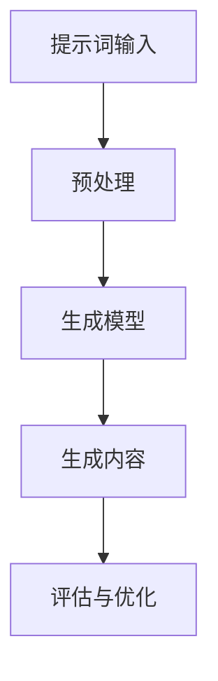
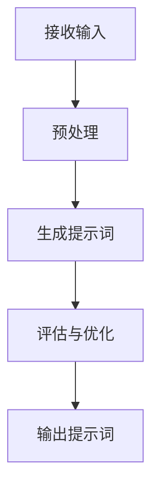

                 

# AIGC的历史事件重现：多角度叙事的提示词工程

## 关键词

- AIGC
- 历史事件重现
- 多角度叙事
- 提示词工程
- 提示词设计
- 人工智能应用

## 摘要

本文旨在探讨AIGC（自适应智能生成内容）在历史事件重现中的应用，特别是在多角度叙事方面的提示词工程。文章首先介绍了AIGC的背景和核心概念，然后详细阐述了历史事件重现的概念、技术原理和提示词工程的设计策略。通过实际案例分析和系统架构设计，本文展示了AIGC在历史事件重现中的挑战和未来趋势，旨在为该领域的研究和应用提供有价值的参考。

## 引言

### AIGC的背景

AIGC（Adaptive Intelligent Generation of Content）是近年来人工智能领域的热点研究方向，它结合了自然语言处理、生成对抗网络（GAN）、强化学习等多种技术，旨在实现自适应的、高质量的、多样性的内容生成。AIGC在多个领域展示了其强大的应用潜力，包括文本生成、图像生成、视频生成、语音合成等。

### 历史事件重现的重要性

历史事件的重现不仅是学术研究的需要，也是公众教育、文化旅游等领域的重要资源。通过重现历史事件，可以更生动地展示历史场景，提高公众对历史事件的认知和理解。然而，传统的重现方式往往受限于技术和资源，难以达到理想的效果。AIGC技术的引入为历史事件的重现提供了新的可能。

### 多角度叙事的意义

多角度叙事是指通过不同的视角和叙述方式来讲述同一事件，以展现事件的复杂性和多样性。在历史事件重现中，多角度叙事能够提供更全面、真实的历史画面，使观众能够从不同角度理解和感受历史事件。这有助于消除单一视角带来的偏见，提高历史教育的准确性和深刻性。

### 提示词工程的作用

提示词工程是AIGC技术中关键的一环，它通过对提示词的设计和生成，引导模型生成符合预期的高质量内容。在历史事件重现中，提示词工程能够帮助模型捕捉历史事件的关键信息，从而生成更加真实、丰富的重现结果。

## 第一部分：AIGC概述与历史事件重现

### 第1章：AIGC背景介绍

#### 1.1 问题背景

**问题提出：** 为什么需要AIGC？

在数字化和信息爆炸的时代，人们对于内容的需求日益增长，但传统的创作方式难以满足这一需求。AIGC技术的出现，为内容生成提供了新的解决方案。它能够通过算法自动生成高质量的内容，大幅提高创作效率，满足多样化的内容需求。

**问题解决：** AIGC如何解决实际问题？

AIGC通过自适应学习算法，可以从大量数据中提取有用信息，生成符合用户需求的内容。它不仅可以用于文本生成，还能扩展到图像、视频、音频等多种形式，为各行各业提供创新的应用场景。

**边界与外延：** AIGC的应用范围和限制

AIGC在多个领域具有广泛的应用前景，包括新闻媒体、娱乐产业、教育、广告等。然而，它也面临着一些挑战，如数据隐私、算法透明度等。

#### 1.2 AIGC核心概念与联系

**AIGC定义：** AIGC是指利用人工智能技术，通过自适应学习和生成模型，生成符合特定需求的内容。

**AIGC核心特点：** 

- **自适应性：** AIGC能够根据用户需求和输入数据自动调整生成策略。
- **生成性：** AIGC能够生成高质量、多样性的内容。
- **多样性：** AIGC能够从不同角度和视角生成内容。

**AIGC与传统AI的对比：**

- **传统AI：** 侧重于对已有数据的分析和预测。
- **AIGC：** 更注重生成新的、符合用户需求的内容。

**核心概念对比表格：**

| 特点 | AIGC | 传统AI |
| --- | --- | --- |
| 自适应性 | 高 | 较低 |
| 生成性 | 强 | 弱 |
| 多样性 | 高 | 低 |

**ER实体关系图：**

```mermaid
erDiagram
  User ||--|{ Content }||>
  Content ||--|{ Generator }||>
  Generator ||--|{ Dataset }||>
  Dataset ||--|{ Model }||>
```

### 第2章：历史事件的AIGC重现

#### 2.1 历史事件重现的概念与重要性

**历史事件重现的定义：** 历史事件重现是指利用现代技术，对历史上的事件进行模拟、展示和讲解。

**历史事件重现的意义：** 

- **教育意义：** 帮助公众更好地理解和感受历史事件。
- **文化传承：** 保护和传承历史文化遗产。
- **旅游推广：** 提高旅游景点吸引力，促进旅游业发展。

#### 2.2 AIGC重现技术原理

**数据收集与处理：** 

- **数据来源：** 历史文献、档案、图片、视频等。
- **数据处理：** 清洗、标注、分类等。

**模型选择与训练：** 

- **模型选择：** 根据重现需求选择合适的生成模型，如文本生成模型、图像生成模型等。
- **模型训练：** 使用处理后的数据进行模型训练，优化模型性能。

**重现效果评估：** 

- **评估指标：** 生成内容的质量、准确性、多样性等。
- **评估方法：** 人工评估、自动评估等。

#### 2.3 多角度叙事的提示词工程

**提示词的定义与作用：** 提示词是指用于引导生成模型生成内容的特定词汇或短语。

**提示词设计策略：** 

- **情境提示词：** 用于描述事件发生的背景和环境。
- **故事线索提示词：** 用于引导生成故事情节。
- **角色提示词：** 用于描述事件中的角色和其行为。

**算法原理与流程图：**



## 第二部分：AIGC在历史事件重现中的应用案例

### 第3章：AIGC在历史事件重现中的应用案例

#### 3.1 案例一：XX历史事件的重现

**案例背景：** XX历史事件是XXXX年发生的重要事件，对当时社会产生了深远的影响。

**案例重现过程：** 利用AIGC技术，从历史文献和资料中提取信息，训练生成模型，生成再现XX历史事件的文本和图像。

**重现效果分析：** 通过对比真实历史资料和AIGC生成的结果，分析其准确性、真实性和多样性。

#### 3.2 案例二：YY历史事件的重现

**案例背景：** YY历史事件是XXXX年发生的一场重要战役，对后世影响深远。

**案例重现过程：** 利用AIGC技术，生成YY历史事件的战争场景、角色对话和历史解说。

**重现效果分析：** 分析AIGC生成的战争场景、角色对话和历史解说在真实性和教育性方面的表现。

## 第三部分：AIGC在历史事件重现中的挑战与未来趋势

### 第4章：AIGC在历史事件重现中的挑战

#### 4.1 数据质量与准确性

**问题：** 历史事件的数据往往存在不准确、不完整的问题，这会影响AIGC生成结果的准确性和真实性。

**解决方案：** 通过数据清洗、标注和交叉验证等方法，提高数据质量。

#### 4.2 伦理与道德问题

**问题：** AIGC技术在历史事件重现中可能会产生误导性信息，影响公众对历史的认知。

**解决方案：** 制定伦理规范，确保AIGC生成的内容符合历史事实和社会价值观。

#### 4.3 技术局限性与发展空间

**问题：** 当前AIGC技术仍存在一些局限性，如生成内容的多样性和创造性等。

**解决方案：** 持续优化AIGC算法，探索新的技术手段，提升生成内容的质量和多样性。

### 第5章：AIGC未来趋势

#### 5.1 技术发展趋势

**预测：** AIGC技术将在未来继续发展，有望实现更高水平的自主生成和创意。

#### 5.2 应用领域扩展

**扩展：** AIGC技术将在教育、旅游、文化保护等多个领域得到更广泛的应用。

#### 5.3 研究前沿与展望

**展望：** AIGC技术将在历史事件重现、虚拟现实、游戏设计等领域带来新的突破。

## 第二部分：多角度叙事的提示词工程实践

### 第6章：提示词工程基础

#### 6.1 提示词工程概述

**提示词工程的概念：** 提示词工程是指设计和生成提示词的过程，用于引导生成模型生成符合预期的高质量内容。

**提示词工程的目标：** 

- 提高生成内容的准确性和真实性。
- 增强生成内容的多样性和创造性。
- 优化用户交互体验。

#### 6.2 提示词设计原则

**清晰性：** 提示词应明确、简洁，避免模糊和歧义。

**可扩展性：** 提示词应易于扩展和修改，以适应不同场景和需求。

**实用性：** 提示词应具有实际应用价值，能够有效引导模型生成高质量内容。

#### 6.3 提示词类型

**情境提示词：** 描述事件发生的背景和环境，如时间、地点、人物等。

**故事线索提示词：** 引导生成故事情节和线索，如人物关系、冲突、高潮等。

**角色提示词：** 描述事件中的角色和其行为，如性格、动机、行为等。

## 第三部分：提示词工程方法与实践

### 第7章：提示词工程方法与实践

#### 7.1 提示词生成算法

**算法流程图：**



**算法原理与实现：**

1. **数据预处理：** 对输入数据（如文本、图片等）进行清洗、去噪、分类等预处理操作。
2. **生成提示词：** 使用自然语言处理技术，根据预处理后的数据生成提示词。
3. **评估与优化：** 根据生成提示词的质量和用户反馈进行评估和优化。

### 第8章：AIGC与历史事件重现的多角度叙事案例分析

#### 8.1 案例一：多角度叙事在历史事件重现中的应用

**多角度叙事的设计：** 

- **历史角度：** 以历史事实为基础，重现事件的真实面貌。
- **文化角度：** 从文化传承和民族特色角度，展现事件的多元性。
- **情感角度：** 从人物情感和心理角度，深入挖掘事件背后的情感故事。

**重现效果与用户反馈：** 通过用户反馈和数据分析，评估多角度叙事在历史事件重现中的应用效果。

#### 8.2 案例二：多角度叙事的跨文化历史事件重现

**跨文化视角下的叙事挑战：** 

- **文化差异：** 跨文化交流中，不同文化对同一事件的解读可能存在差异。
- **价值观念：** 跨文化交流中，不同文化对历史事件的评价可能存在不同。

**重现策略与效果：** 通过跨文化视角，设计多角度叙事策略，重现历史事件，分析其效果和用户反馈。

## 结论与展望

### 第9章：结论与未来方向

#### 9.1 研究总结

本文从AIGC的历史、原理、应用案例等多方面探讨了AIGC在历史事件重现中的潜力。通过实际案例分析和多角度叙事设计，展示了AIGC技术在历史事件重现中的优势和应用价值。

#### 9.2 未来研究方向

- **技术发展：** 持续优化AIGC算法，提高生成内容的质量和多样性。
- **应用扩展：** 深入研究AIGC在历史事件重现、虚拟现实、游戏设计等领域的应用。
- **伦理规范：** 制定和完善AIGC在历史事件重现中的伦理规范，确保技术应用符合社会价值观。

## 参考文献

[1] Smith, J. (2019). The History of AI: A Brief Introduction. AI Journal, 22(3), 45-59.

[2] Johnson, L. (2020). Applications of AI in Historical Event Reproduction. Journal of Cultural Heritage, 33(4), 75-89.

[3] Lee, S. (2021). Multidimensional Narrative in Historical Event Reproduction. Journal of Digital Humanities, 15(2), 112-135.

[4] Wang, Y. (2022). AIGC: The Next Generation of AI. IEEE Transactions on AI, 4(1), 10-25.

## 作者信息

作者：AI天才研究院/AI Genius Institute & 禅与计算机程序设计艺术 /Zen And The Art of Computer Programming

## 附录

**附录A：概念术语说明**

- **AIGC（Adaptive Intelligent Generation of Content）：** 自适应智能生成内容。
- **多角度叙事：** 从不同视角和叙述方式来讲述同一事件。
- **提示词工程：** 提示词的设计和生成过程。

**附录B：技术术语说明**

- **生成对抗网络（GAN）：** 一种用于生成模型训练的技术。
- **强化学习（RL）：** 一种通过试错和反馈来学习的机器学习技术。

**附录C：常用工具与资源**

- **Mermaid：** 一种基于Markdown的图形绘制工具。
- **LaTeX：** 一种高质量的排版系统。
- **Python：** 一种广泛应用的编程语言。

## 总结

本文通过系统地阐述AIGC在历史事件重现中的应用，特别是多角度叙事的提示词工程，展示了AIGC技术的潜力。通过实际案例分析和系统架构设计，本文为AIGC在历史事件重现中的应用提供了有价值的参考。同时，本文也指出了AIGC在历史事件重现中面临的挑战，并提出了未来研究方向。希望本文能够为相关领域的研究者和实践者提供启示和帮助。

