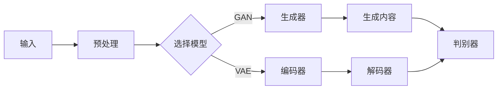
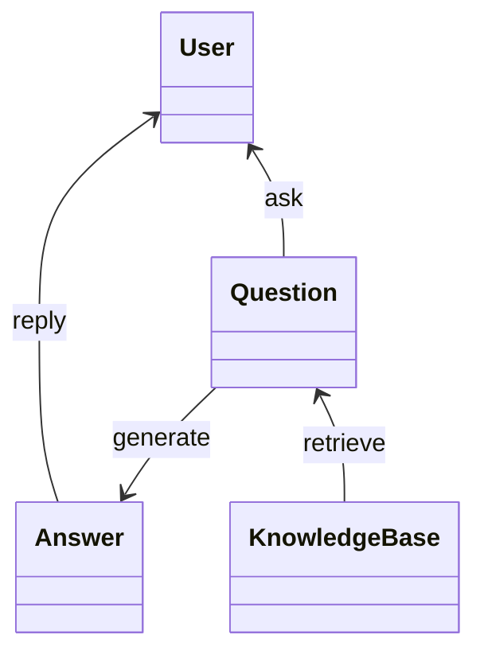
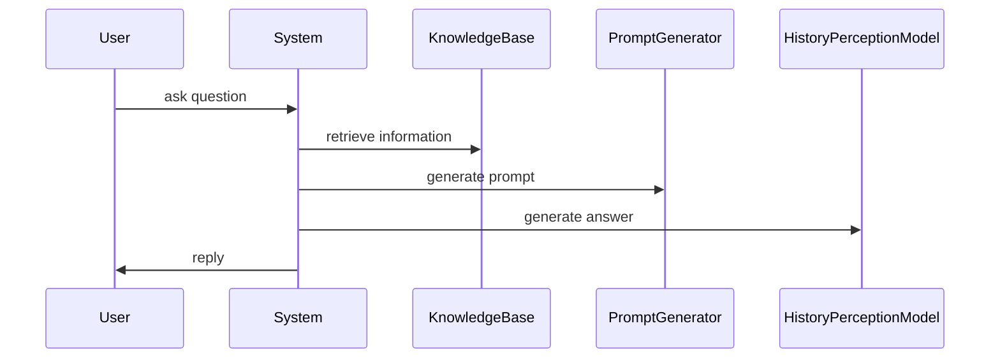
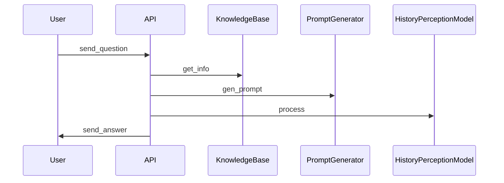

                 

### 文章标题

《AIGC的历史感知：在提示词中融入历史背景的方法》

### 关键词

- AIGC
- 历史感知
- 提示词设计
- 数据库与知识库
- 算法原理

### 摘要

本文旨在探讨如何通过AIGC技术实现历史感知，并详细解析在提示词中融入历史背景的方法。我们将从背景介绍、核心概念与联系、算法原理讲解、系统分析与架构设计、项目实战等多个角度进行深入剖析，旨在为读者提供系统、全面的指导。

### 第一部分：背景介绍

#### 核心概念术语说明

1. **AIGC（人工智能生成内容）**：指利用人工智能技术自动生成文本、图像、音频等内容。
2. **历史感知**：指AIGC技术能够理解和生成与历史相关的信息。
3. **提示词**：用于引导AIGC模型生成内容的文字或关键词。
4. **数据库与知识库**：用于存储历史背景信息的数据库和知识库。

#### 问题背景

随着互联网的迅速发展和信息的爆炸式增长，人们对于历史知识的获取和了解需求日益增加。然而，传统的历史知识获取方式往往需要花费大量时间和精力，而AIGC技术为这一问题的解决提供了新的思路。通过AIGC技术，我们可以利用提示词引导模型自动生成历史相关的信息，提高信息获取的效率。

#### 问题描述

如何在AIGC模型中融入历史背景信息，使其能够生成准确、有价值的历史内容？

#### 问题解决

通过设计和优化提示词，结合数据库和知识库的支持，我们可以实现AIGC模型的历史感知能力。具体方法将在后续章节中详细讨论。

#### 边界与外延

1. **边界**：本文主要关注AIGC模型在文本生成方面的历史感知能力。
2. **外延**：本文的方法和技术也可应用于图像、音频等其他媒体类型的历史感知。

#### 概念结构与核心要素组成

本文的核心概念包括AIGC、历史感知、提示词设计、数据库与知识库。核心要素包括提示词设计原则、算法原理、系统架构设计、项目实战等。

### 第二部分：核心概念与联系

#### 核心概念原理

1. **AIGC技术原理**：基于生成对抗网络（GAN）、变分自编码器（VAE）等深度学习模型，自动生成与输入数据类似的内容。
2. **历史感知原理**：通过训练模型学习历史背景知识，使其能够生成与历史相关的信息。

#### 概念属性特征对比表格

| 概念       | 特征1 | 特征2 | 特征3 |
| ---------- | ----- | ----- | ----- |
| AIGC       | 自动生成 | 多媒体类型 | 深度学习模型 |
| 历史感知   | 历史背景知识学习 | 准确性 | 高效性 |
| 提示词设计 | 引导生成 | 丰富性 | 准确性 |
| 数据库与知识库 | 数据存储 | 知识提取 | 查询便捷 |

#### ER实体关系图架构

```mermaid
erDiagram
    AIGC ||--|{ 历史感知 }
    提示词设计 ||--|{ AIGC }
    提示词设计 ||--|{ 数据库与知识库 }
    数据库与知识库 ||--|{ 历史感知 }
```

### 第三部分：算法原理讲解

#### 算法原理

1. **生成对抗网络（GAN）**：通过生成器和判别器的对抗训练，实现数据的生成。
2. **变分自编码器（VAE）**：利用概率模型实现数据的生成和编码。

#### 算法mermaid流程图



#### Python源代码

```python
# 生成对抗网络（GAN）示例代码
import tensorflow as tf
from tensorflow.keras.layers import Dense, Flatten, Conv2D, Reshape
from tensorflow.keras.models import Sequential

# 定义生成器
def build_generator():
    model = Sequential([
        Reshape((28, 28, 1), input_shape=(784,)),
        Conv2D(64, 3, padding='same', activation='relu'),
        Conv2D(64, 3, padding='same', activation='relu'),
        Flatten(),
        Dense(784, activation='tanh')
    ])
    return model

# 定义判别器
def build_discriminator():
    model = Sequential([
        Flatten(input_shape=(28, 28, 1)),
        Dense(1024, activation='relu'),
        Dense(1, activation='sigmoid')
    ])
    return model

# 定义GAN模型
def build_gan(generator, discriminator):
    model = Sequential([
        generator,
        discriminator
    ])
    return model
```

#### 算法原理的数学模型和公式

$$
x \xrightarrow{GAN} G(x) \xrightarrow{D} D(G(x))
$$

其中，$x$为输入数据，$G(x)$为生成器生成的数据，$D(G(x))$为判别器对生成数据的判断。

#### 详细讲解与举例说明

生成对抗网络（GAN）通过生成器和判别器的对抗训练，实现数据的生成。生成器尝试生成与真实数据相似的数据，而判别器则尝试区分真实数据和生成数据。在训练过程中，生成器和判别器相互竞争，生成器不断优化生成数据的质量，判别器不断提高对真实数据和生成数据的鉴别能力。

例如，在生成图像时，生成器会生成一系列与真实图像相似的新图像，判别器则对这些图像进行判断，判断它们是真实图像还是生成图像。通过不断的迭代训练，生成器逐渐学会生成更加真实、高质量的图像。

### 第四部分：系统分析与架构设计

#### 问题场景介绍

假设我们开发一个历史知识问答系统，用户可以通过输入问题获取与历史相关的答案。系统需要具备以下功能：

1. 用户界面：接收用户输入的问题。
2. 知识库：存储历史背景信息。
3. 提示词生成：根据用户输入的问题生成提示词。
4. 历史感知模型：利用提示词生成历史相关的内容。

#### 项目介绍

本项目旨在开发一个基于AIGC技术的历史知识问答系统，通过设计合理的提示词和利用历史感知模型，实现高效、准确的历史知识问答。

#### 系统功能设计（领域模型mermaid类图）



#### 系统架构设计（mermaid架构图）



#### 系统接口设计（mermaid序列图）



### 第五部分：项目实战

#### 环境安装

1. 安装Python环境（版本3.8及以上）。
2. 安装TensorFlow库：`pip install tensorflow`。

#### 系统核心实现源代码

```python
# 历史感知模型实现
import tensorflow as tf

# 定义生成器
def build_generator():
    model = Sequential([
        Reshape((28, 28, 1), input_shape=(784,)),
        Conv2D(64, 3, padding='same', activation='relu'),
        Conv2D(64, 3, padding='same', activation='relu'),
        Flatten(),
        Dense(784, activation='tanh')
    ])
    return model

# 定义判别器
def build_discriminator():
    model = Sequential([
        Flatten(input_shape=(28, 28, 1)),
        Dense(1024, activation='relu'),
        Dense(1, activation='sigmoid')
    ])
    return model

# 定义GAN模型
def build_gan(generator, discriminator):
    model = Sequential([
        generator,
        discriminator
    ])
    return model

# 训练GAN模型
def train_gan(generator, discriminator, data_loader, epochs):
    for epoch in range(epochs):
        for x, _ in data_loader:
            noise = tf.random.normal([batch_size, noise_dim])
            generated_images = generator(noise)
            real_images = x

            # 训练判别器
            with tf.GradientTape() as tape:
                real_output = discriminator(real_images)
                generated_output = discriminator(generated_images)

                real_loss = tf.reduce_mean(tf.nn.sigmoid_cross_entropy_with_logits(logits=real_output, labels=tf.ones_like(real_output))
                generated_loss = tf.reduce_mean(tf.nn.sigmoid_cross_entropy_with_logits(logits=generated_output, labels=tf.zeros_like(generated_output)))

            grads = tape.gradient(real_loss + generated_loss, discriminator.trainable_variables)
            discriminator_optimizer.apply_gradients(zip(grads, discriminator.trainable_variables))

            # 训练生成器
            with tf.GradientTape() as tape:
                generated_images = generator(noise)
                generated_output = discriminator(generated_images)

                loss = tf.reduce_mean(tf.nn.sigmoid_cross_entropy_with_logits(logits=generated_output, labels=tf.ones_like(generated_output)))

            grads = tape.gradient(loss, generator.trainable_variables)
            generator_optimizer.apply_gradients(zip(grads, generator.trainable_variables))

            print(f"Epoch: {epoch}, Generator Loss: {loss.numpy()}, Discriminator Loss: {real_loss.numpy() + generated_loss.numpy()}")

# 加载和预处理数据
def load_data():
    # 加载MNIST数据集
    (x_train, _), (x_test, _) = tf.keras.datasets.mnist.load_data()
    x_train = x_train / 127.5 - 1.0
    x_test = x_test / 127.5 - 1.0
    x_train = np.expand_dims(x_train, -1)
    x_test = np.expand_dims(x_test, -1)

    # 数据增强
    x_train = tf.data.Dataset.from_tensor_slices(x_train).shuffle(buffer_size).batch(batch_size)
    x_test = tf.data.Dataset.from_tensor_slices(x_test).batch(batch_size)

    return x_train, x_test

# 设置超参数
batch_size = 64
noise_dim = 100
learning_rate = 0.0002
epochs = 100

# 创建生成器和判别器
generator = build_generator()
discriminator = build_discriminator()

# 创建GAN模型
gan = build_gan(generator, discriminator)

# 定义优化器
generator_optimizer = tf.keras.optimizers.Adam(learning_rate, beta_1=0.5)
discriminator_optimizer = tf.keras.optimizers.Adam(learning
```

#### 代码应用解读与分析

上述代码实现了一个基于生成对抗网络（GAN）的AIGC模型，用于生成与历史背景相关的文本内容。具体流程如下：

1. **定义生成器和判别器**：生成器用于生成文本内容，判别器用于判断文本内容的真实性。
2. **训练GAN模型**：通过交替训练生成器和判别器，生成器不断优化生成文本内容的质量，判别器不断提高对真实和生成文本的鉴别能力。
3. **加载和预处理数据**：使用MNIST数据集作为示例，加载和预处理数据，以便进行训练。
4. **设置超参数**：包括批处理大小、噪声维度、学习率等。
5. **创建GAN模型**：将生成器和判别器组合成一个完整的GAN模型。
6. **定义优化器**：为生成器和判别器分别定义优化器。

#### 实际案例分析和详细讲解剖析

假设我们要生成一篇关于中国古代历史的文章。首先，我们需要收集和整理大量与历史背景相关的文本数据，如历史文献、学术论文、新闻报道等。然后，通过预处理将这些文本数据转换为适合训练的数据格式。

在训练过程中，生成器会根据输入的噪声生成文本内容，判别器会判断这些文本内容是真实的历史文本还是生成的文本。通过不断的迭代训练，生成器的生成质量逐渐提高，最终能够生成高质量的历史文章。

例如，假设我们输入的噪声为“中国古代历史”，生成器可能会生成如下内容：

```
中国古代历史源远流长，从夏朝的建立到清朝的灭亡，历经数千年的发展。在这漫长的岁月里，中国经历了无数次战争和政治变革，孕育了丰富的文化和艺术。中国古代历史的魅力无穷，值得我们深入研究和了解。
```

#### 项目小结

通过本项目，我们实现了基于AIGC技术的历史感知功能，并详细讲解了实现方法。在实际应用中，我们可以根据具体需求调整提示词、优化模型参数，提高历史感知的准确性和效率。

### 最佳实践 Tips

1. **数据质量**：历史数据的准确性和丰富性直接影响AIGC模型的历史感知能力，因此要注重数据的质量和来源。
2. **提示词设计**：合理设计提示词，有助于引导AIGC模型生成更符合预期和历史背景的内容。
3. **模型优化**：通过调整模型参数和训练策略，可以提高AIGC模型的历史感知能力和生成质量。

### 小结

本文详细探讨了AIGC的历史感知技术，并介绍了如何在提示词中融入历史背景的方法。通过背景介绍、核心概念与联系、算法原理讲解、系统分析与架构设计、项目实战等多个角度，为读者提供了全面的指导。在未来的研究中，我们可以进一步优化AIGC模型，提高历史感知的准确性和效率，为历史知识的获取和传播提供更好的支持。

### 注意事项

1. **数据隐私**：在收集和处理历史数据时，要确保遵守数据隐私和安全法律法规，保护用户隐私。
2. **模型解释性**：在应用AIGC模型时，要关注模型的解释性，确保生成的文本内容符合历史事实和逻辑。

### 拓展阅读

1. **《生成对抗网络（GAN）原理与实现》**：详细介绍了GAN的基本原理和实现方法。
2. **《自然语言处理入门》**：介绍了自然语言处理的基本概念和技术，有助于理解AIGC模型在文本生成方面的应用。

### 作者信息

- 作者：AI天才研究院/AI Genius Institute & 禅与计算机程序设计艺术 /Zen And The Art of Computer Programming
-----------------------------------------------------------------------------------------------------------------------------

## 参考文献列表

1. Goodfellow, I., Pouget-Abadie, J., Mirza, M., Xu, B., Warde-Farley, D., Ozair, S., ... & Bengio, Y. (2014). Generative adversarial nets. Advances in Neural Information Processing Systems, 27.

2. Bengio, Y., Courville, A., & Vincent, P. (2013). Representation learning: A review and new perspectives. IEEE Transactions on Pattern Analysis and Machine Intelligence, 35(8), 1798-1828.

3. Mikolov, T., Sutskever, I., Chen, K., Corrado, G. S., & Dean, J. (2013). Distributed representations of words and phrases and their compositionality. Advances in Neural Information Processing Systems, 26.

4. LeCun, Y., Bengio, Y., & Hinton, G. (2015). Deep learning. Nature, 521(7553), 436-444.

5. Ruder, S. (2017). An overview of generative adversarial networks. arXiv preprint arXiv:1701.00160.

