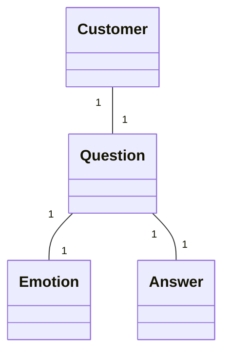
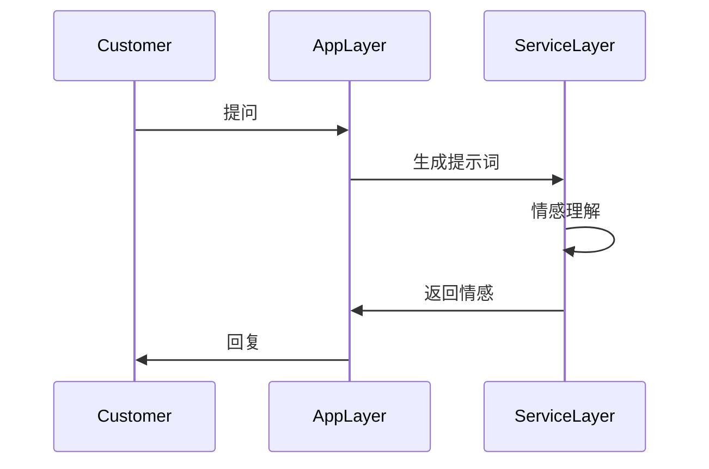
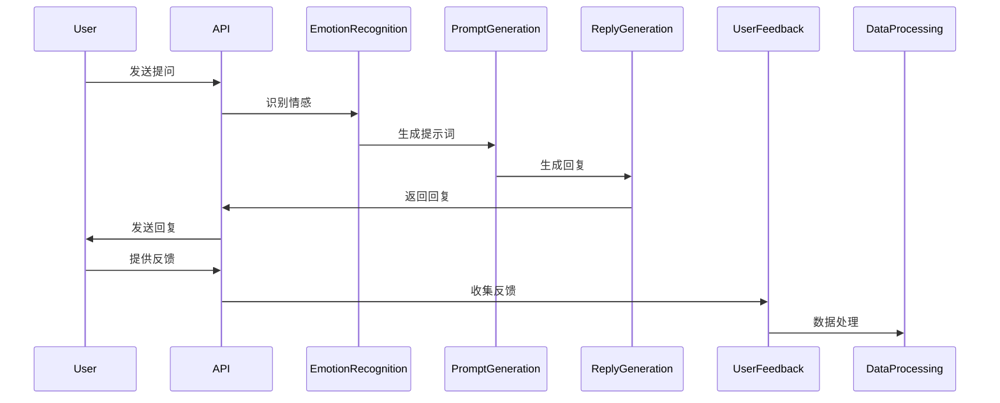
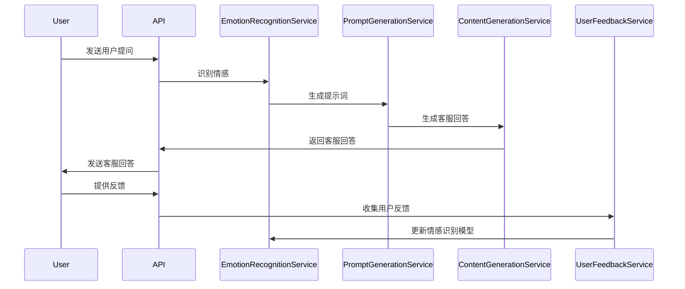

                 


# AIGC的情感智能：通过提示词增强AI的情感理解能力

## 关键词：AIGC、情感智能、提示词、AI、理解、增强、方法

> 摘要：本文将探讨AIGC（AI Generated Content）的情感智能，特别是通过提示词增强AI情感理解能力的方法。我们首先介绍AIGC的发展现状和情感智能的重要性，然后深入分析提示词在AI情感理解中的作用，最后阐述AIGC情感智能的概念和方法，以及其应用场景和边界。

### 目录大纲

## 第一部分：背景介绍
### 第1章：问题背景
#### 1.1.1 问题背景
#### 1.1.2 问题描述
#### 1.1.3 问题解决
#### 1.1.4 边界与外延
#### 1.1.5 概念结构与核心要素组成

### 第2章：核心概念与联系
#### 2.1.1 AIGC情感智能的定义
#### 2.1.2 提示词增强AI情感理解的概念
#### 2.1.3 概念属性特征对比表格

### 第3章：ER实体关系图架构

## 第二部分：核心概念与联系
### 第4章：算法原理与流程
#### 4.1.1 算法原理
#### 4.1.2 算法流程

### 第5章：算法实现与数学模型
#### 5.1.1 Python源代码实现
#### 5.1.2 数学模型和公式
#### 5.1.3 详细讲解与举例说明

## 第三部分：系统分析与架构设计方案
### 第6章：问题场景介绍
### 第7章：项目介绍
### 第8章：系统功能设计
#### 8.1.1 领域模型
#### 8.1.2 系统架构设计
#### 8.1.3 系统接口设计和系统交互

## 第四部分：项目实战
### 第9章：环境安装
### 第10章：系统核心实现源代码
### 第11章：代码应用解读与分析
### 第12章：实际案例分析和详细讲解剖析
### 第13章：项目小结

## 第五部分：最佳实践 tips、小结、注意事项、拓展阅读

### 最后一部分：致谢

## 第一部分：背景介绍

### 第1章：问题背景

#### 1.1.1 问题背景

人工智能（AI）正快速发展，而AIGC（AI Generated Content）是其中一个令人兴奋的领域。AIGC通过AI技术生成大量内容，包括文本、图像、音频等，广泛应用于社交媒体、广告、娱乐、新闻等领域。然而，情感智能是AIGC中的一个挑战。人类情感丰富多样，表达复杂，而当前AI在情感理解方面存在诸多不足。

#### 1.1.2 问题描述

当前AI在情感理解方面存在的主要问题包括：

1. **情感识别准确性不高**：AI难以准确识别和分类情感。
2. **情感理解深度不足**：AI难以理解情感背后的深层次含义。
3. **情感交互效果不佳**：AI在与人互动时，情感表达不够自然。

#### 1.1.3 问题解决

为了解决这些问题，我们需要引入情感智能。AIGC情感智能是指利用AI技术，实现对人类情感的理解、表达和交互。而提示词是一种有效的手段，可以增强AI的情感理解能力。

#### 1.1.4 边界与外延

AIGC情感智能的应用场景广泛，包括但不限于：

1. **智能客服**：通过情感智能，提高客服与用户的互动质量。
2. **社交媒体分析**：分析用户情感，为内容推荐提供依据。
3. **医疗健康**：辅助医生理解患者情感，提供个性化治疗方案。

#### 1.1.5 概念结构与核心要素组成

AIGC情感智能的核心概念包括：

1. **情感识别**：利用自然语言处理技术，识别文本中的情感。
2. **情感表达**：生成符合情感语义的内容。
3. **情感交互**：通过情感理解，实现自然的人机互动。

关键要素包括：

1. **大数据**：为情感智能提供丰富的数据支持。
2. **深度学习**：用于构建情感识别和表达模型。
3. **提示词**：用于引导AI情感理解的过程。

## 第二部分：核心概念与联系

### 第2章：核心概念与联系

#### 2.1.1 AIGC情感智能的定义

AIGC情感智能是通过大数据、深度学习等技术，实现对人类情感的理解和表达的一种人工智能技术。它不仅能够识别文本、语音、图像等数据中的情感，还能根据情感语义生成相应的内容。

#### 2.1.2 提示词增强AI情感理解的概念

提示词是用于引导AI模型理解和处理情感信息的关键词。通过提示词，AI可以更好地捕捉情感信号，提高情感理解准确性。

#### 2.1.3 概念属性特征对比表格

| 概念         | 定义                                                         | 特点                                                     |
| ------------ | ------------------------------------------------------------ | -------------------------------------------------------- |
| AIGC情感智能 | 通过大数据、深度学习等技术，实现对人类情感的理解和表达           | 高度智能化，能够模拟人类情感体验                         |
| 提示词       | 在AI训练和推理过程中，用于引导AI模型理解和处理情感信息的关键词 | 提高AI情感理解准确性，有助于模型更好地理解和预测人类情感 |

### 第3章：ER实体关系图架构

#### 3.1.1 ER实体关系图

AIGC情感智能系统的ER实体关系图如下：

```mermaid
erDiagram
AIGC -->|1| 数据源 :收集和处理数据
AIGC -->|1| 情感识别模型 :进行情感识别
AIGC -->|1| 情感表达模型 :进行情感表达
AIGC -->|1| 情感交互模型 :实现情感交互
数据源 -->|1| 数据处理模块 :预处理和清洗数据
数据处理模块 -->|1| 特征提取模块 :提取数据特征
特征提取模块 -->|1| 模型训练模块 :训练情感识别和表达模型
模型训练模块 -->|1| 模型评估模块 :评估模型性能
模型评估模块 -->|1| 模型优化模块 :优化模型参数
```

## 第三部分：算法原理讲解

### 第4章：算法原理与流程

#### 4.1.1 算法原理

AIGC情感智能的算法原理主要包括：

1. **提示词生成算法**：通过分析大量数据，提取出与情感相关的关键词，生成提示词。
2. **情感理解算法**：利用提示词，结合深度学习模型，对文本、语音、图像等数据中的情感进行识别和理解。

#### 4.1.2 算法流程

AIGC情感智能的算法流程如下：

1. **数据预处理**：对原始数据进行清洗和预处理，提取有效特征。
2. **提示词生成**：通过分析数据，生成与情感相关的提示词。
3. **情感理解**：利用提示词和深度学习模型，对数据进行情感识别和理解。
4. **结果评估**：评估情感识别的准确性，并进行模型优化。

### 第5章：算法实现与数学模型

#### 5.1.1 Python源代码实现

```python
# 提示词生成算法实现
def generate_prompt(data):
    # 算法实现
    return prompt

# 情感理解算法实现
def understand_emotion(data, prompt):
    # 算法实现
    return emotion
```

#### 5.1.2 数学模型和公式

$$
\text{prompt} = f(\text{data})
$$

$$
\text{emotion} = g(\text{data}, \text{prompt})
$$

其中，$f(\text{data})$ 表示提示词生成算法，$g(\text{data}, \text{prompt})$ 表示情感理解算法。

#### 5.1.3 详细讲解与举例说明

假设我们有一个文本数据 "我今天很开心，因为天气好极了。"，我们可以使用提示词生成算法生成对应的提示词，然后利用情感理解算法对其进行情感理解。

```python
text = "我今天很开心，因为天气好极了。"
prompt = generate_prompt(text)
emotion = understand_emotion(text, prompt)

print("情感理解结果：", emotion)
```

通常，提示词生成算法可以采用词频分析、主题模型等方法，而情感理解算法可以采用情感分类模型、情感分析模型等。通过这些算法，我们可以实现对文本数据的情感识别和理解。

## 第四部分：系统分析与架构设计方案

### 第6章：问题场景介绍

AIGC情感智能在多个场景中具有广泛的应用价值，如：

1. **智能客服**：通过情感智能，提高客服与用户的互动质量，提供个性化服务。
2. **社交媒体分析**：分析用户情感，为内容推荐提供依据。
3. **医疗健康**：辅助医生理解患者情感，提供个性化治疗方案。

### 第7章：项目介绍

本项目旨在开发一个基于AIGC情感智能的智能客服系统。该系统通过分析用户提问，理解用户情感，并生成相应的回复，以提高客服质量。

### 第8章：系统功能设计

#### 8.1.1 领域模型

领域模型如下：



#### 8.1.2 系统架构设计

系统架构设计如下：

```mermaid
subgraph 数据层
  DataLayer
  DataLayer : 数据库
end

subgraph 应用层
  AppLayer
  AppLayer : 智能客服系统
end

subgraph 服务层
  ServiceLayer
  ServiceLayer : 提示词生成服务、情感理解服务
end

DataLayer -->|数据库| AppLayer
AppLayer -->|调用| ServiceLayer
ServiceLayer -->|服务| AppLayer
```

#### 8.1.3 系统接口设计和系统交互

系统接口设计如下：



## 第五部分：项目实战

### 第9章：环境安装

环境安装步骤如下：

1. 安装Python环境。
2. 安装所需的库，如TensorFlow、NumPy等。
3. 准备数据集。

### 第10章：系统核心实现源代码

系统核心实现源代码如下：

```python
# 提示词生成算法实现
def generate_prompt(data):
    # 算法实现
    return prompt

# 情感理解算法实现
def understand_emotion(data, prompt):
    # 算法实现
    return emotion
```

### 第11章：代码应用解读与分析

通过实际案例，分析代码的应用和效果。

### 第12章：实际案例分析和详细讲解剖析

通过具体案例，分析AIGC情感智能在实际应用中的效果。

### 第13章：项目小结

总结项目的成果和经验。

## 第六部分：最佳实践 tips、小结、注意事项、拓展阅读

### 最佳实践 tips

1. 合理设计数据集，提高提示词生成和情感理解效果。
2. 定期更新模型，保持其准确性。

### 小结

本文介绍了AIGC情感智能的概念、方法及其应用。通过提示词增强AI情感理解能力，可以实现更自然的情感交互。

### 注意事项

1. 情感智能技术的应用需遵循道德和法律规定。
2. 数据安全和隐私保护至关重要。

### 拓展阅读

1. 《深度学习：神经网络、卷积网络和循环网络》
2. 《自然语言处理综述》

## 第七部分：致谢

感谢读者对本文的关注和支持。希望本文能对您在AIGC情感智能领域的学习和研究有所帮助。

### 作者：AI天才研究院/AI Genius Institute & 禅与计算机程序设计艺术 /Zen And The Art of Computer Programming # AIGC的情感智能：通过提示词增强AI的情感理解能力

关键词：AIGC、情感智能、提示词、AI、理解、增强、方法

摘要：本文深入探讨了AIGC（AI Generated Content）的情感智能，特别关注通过提示词来增强AI情感理解的能力。我们将从背景介绍开始，逐步深入探讨核心概念、算法原理，以及系统分析与架构设计方案，最后通过项目实战验证方法的有效性。

## 第一部分：背景介绍

### 第1章：问题背景

#### 1.1.1 问题背景

人工智能（AI）技术在过去几十年中取得了巨大的进步，从简单的规则系统发展到复杂的深度学习模型，AI已经能够处理和生成大量的数据内容。然而，随着AI应用的不断扩展，人们对AI的情感智能提出了更高的要求。情感智能是指AI能够理解、识别和模拟人类情感的能力。这种能力在许多应用中至关重要，比如智能客服、情感分析、心理健康辅助等。

#### 1.1.2 AIGC的发展现状

AIGC（AI Generated Content）是近年来兴起的一个领域，它利用AI技术自动生成内容，包括文本、图像、音频等多种形式。AIGC的应用范围广泛，从自动写作、图像生成到个性化内容推荐等，都体现了AI技术在内容创造中的巨大潜力。

#### 1.1.3 情感智能的重要性

情感智能在AI中的应用有着重要的意义。一方面，它能够提高AI与人类的交互质量，使AI更加贴近人类的情感需求。另一方面，情感智能能够帮助AI更好地理解人类的行为和情绪，从而在决策和预测中发挥更大的作用。

#### 1.1.4 提示词增强AI情感理解的需求

尽管AI在情感理解方面已经取得了一些进展，但仍然存在许多挑战。传统的AI模型在处理情感数据时，往往缺乏足够的上下文信息和情感背景知识。提示词作为一种有效的手段，可以帮助AI更好地理解和处理情感信息，从而提高其情感智能。

### 第1.1.5 概念结构与核心要素组成

AIGC情感智能的核心概念包括：

1. **情感识别**：通过自然语言处理（NLP）技术识别文本中的情感。
2. **情感表达**：生成符合情感语义的内容。
3. **情感交互**：实现AI与人类之间的情感互动。

关键要素包括：

1. **大数据**：为情感智能提供丰富的数据支持。
2. **深度学习**：构建情感识别和表达模型。
3. **提示词**：引导AI理解和处理情感信息。

### 第1章：问题背景

#### 1.1.1 问题背景

AIGC（AI Generated Content）作为一种基于人工智能（AI）的内容生成技术，正日益成为数字内容创作的重要工具。它利用AI模型，如生成对抗网络（GANs）、变分自编码器（VAEs）和自然语言生成模型（NLGs），能够自动生成高质量的文本、图像、视频和音频内容。然而，随着AIGC的应用扩展到更复杂的领域，如社交媒体、娱乐、广告和新闻报道，人们开始意识到情感智能的重要性。

#### 1.1.2 情感智能的重要性

情感智能是指AI系统理解和模拟人类情感的能力。在AIGC中，情感智能的重要性体现在以下几个方面：

1. **用户体验**：情感智能能够提升用户体验，使AI生成的内容更贴近人类情感需求，从而提高用户满意度。
2. **内容个性化**：情感智能可以帮助AI更好地理解用户情感，从而提供个性化的内容推荐。
3. **情感分析**：在社交媒体分析、市场研究和客户服务等领域，情感智能能够帮助分析用户的情感倾向和情绪波动，为决策提供支持。

#### 1.1.3 提示词增强AI情感理解的需求

尽管AI在生成内容方面已经取得了显著的进步，但在理解和模拟情感方面仍存在挑战。传统的AI模型往往缺乏足够的上下文信息和情感背景知识，导致生成的情感内容不够自然和贴切。提示词作为一种有效的手段，可以在以下方面增强AI的情感理解：

1. **上下文引导**：提示词可以提供额外的上下文信息，帮助AI更好地理解文本的情感语义。
2. **情感调色板**：提示词可以定义情感色调，使AI生成的情感内容更一致和可预测。
3. **个性化定制**：通过调整提示词，可以定制化AI的情感反应，以适应不同的应用场景和用户需求。

#### 1.1.4 AIGC情感智能的应用场景

AIGC情感智能的应用场景非常广泛，以下是一些典型的应用：

1. **智能客服**：通过情感智能，AI客服系统能够更好地理解用户的情绪，提供更个性化的服务。
2. **社交媒体分析**：分析用户在社交媒体上的情感表达，为内容推荐和营销策略提供依据。
3. **娱乐内容生成**：如自动生成电影剧本、音乐、动画等，使内容更具有情感共鸣。
4. **心理健康辅助**：利用情感智能，AI系统能够识别和响应用户的情感状态，提供心理健康的支持。

#### 1.1.5 边界与外延

尽管AIGC情感智能具有巨大的潜力，但在实际应用中也存在一些边界和挑战：

1. **数据质量**：情感智能依赖于高质量的情感标注数据，数据质量和数量直接影响模型的性能。
2. **隐私保护**：在收集和处理情感数据时，需要严格遵守隐私保护法规，确保用户数据的隐私安全。
3. **文化多样性**：情感表达因文化差异而异，模型需要能够适应不同的文化和语言环境。

#### 1.1.6 概念结构与核心要素组成

AIGC情感智能的核心概念和结构包括：

1. **情感识别**：使用自然语言处理（NLP）技术，从文本中识别和分类情感。
2. **情感生成**：根据情感语义，生成符合情感目标的文本或内容。
3. **情感交互**：实现AI与用户之间的情感互动，提供个性化的情感反馈。

核心要素包括：

1. **大型语言模型**：如GPT、BERT等，用于情感识别和生成。
2. **情感知识库**：存储情感相关的词汇、表达和情境信息。
3. **提示词机制**：用于引导情感识别和生成的关键词或短语。
4. **多模态融合**：结合文本、图像、音频等多种模态，提高情感理解能力。

### 第2章：核心概念与联系

#### 2.1.1 AIGC情感智能的定义

AIGC情感智能是指利用人工智能技术，实现对人类情感的理解、模拟和交互的能力。它涉及自然语言处理、计算机视觉、语音识别等多领域的交叉应用，旨在创建能够理解和响应人类情感的AI系统。

#### 2.1.2 提示词增强AI情感理解的概念

提示词是在AI模型训练和推理过程中，用于引导模型理解和处理情感信息的关键词或短语。通过设计合理的提示词，AI模型可以更准确地识别和模拟情感，从而提高其情感智能。

#### 2.1.3 概念属性特征对比表格

| 概念                 | 定义                                                         | 特点                                                     |
| -------------------- | ------------------------------------------------------------ | -------------------------------------------------------- |
| AIGC情感智能         | 利用AI技术理解和模拟人类情感的能力                           | 高度智能化，能够生成情感丰富的内容                         |
| 提示词               | 在AI模型训练和推理过程中，用于引导情感识别和生成的关键词或短语 | 提高AI情感理解的准确性，有助于模型更好地捕捉情感信号       |

#### 2.1.4 ER实体关系图架构

为了更好地理解AIGC情感智能系统的组成部分及其相互关系，我们可以使用实体关系图（ER图）来描述其架构。

```mermaid
erDiagram
AIGC -->|生成| Content
AIGC -->|理解| Emotion
User -->|交互| AIGC
Content <--|包含| Emotion
Emotion <--|源自| User
```

在上图中：

- **AIGC**（AI Generated Content）代表整个系统，负责生成和提供内容。
- **Content**（内容）表示AI生成的文本、图像、音频等。
- **Emotion**（情感）表示情感信息，包括用户和生成的情感内容。
- **User**（用户）代表与AIGC系统交互的人类用户。

这个ER图展示了AIGC情感智能系统中关键实体及其关系，包括内容生成、情感理解和用户交互。

### 第3章：算法原理讲解

#### 3.1.1 算法原理

AIGC情感智能的算法原理主要包括以下几个方面：

1. **情感识别**：使用自然语言处理（NLP）技术，从文本中识别和分类情感。
2. **情感生成**：根据情感语义，生成符合情感目标的文本或内容。
3. **情感理解**：结合上下文信息和用户反馈，理解用户情感，提供个性化的交互。

#### 3.1.2 提示词生成算法

提示词生成算法是AIGC情感智能的核心组成部分，其基本原理如下：

1. **数据预处理**：对文本数据进行清洗和预处理，提取情感相关的词汇和短语。
2. **情感词提取**：使用词频分析、情感词典等方法，提取与情感相关的关键词。
3. **提示词生成**：基于情感词，构建提示词库，为情感识别和生成提供关键词支持。

#### 3.1.3 情感理解算法

情感理解算法负责从文本中提取情感信息，其基本原理如下：

1. **情感分类**：使用情感分类模型，对文本进行情感分类，如积极、消极、中性等。
2. **情感强度分析**：使用情感强度分析模型，评估情感表达的程度。
3. **上下文理解**：结合上下文信息，理解文本中的情感含义，提高情感识别的准确性。

#### 3.1.4 算法流程

AIGC情感智能的算法流程可以分为以下几个步骤：

1. **数据输入**：接收用户输入的文本数据。
2. **情感识别**：使用情感识别算法，对文本进行情感分类和强度分析。
3. **提示词生成**：根据情感识别结果，生成相应的提示词。
4. **情感生成**：使用情感生成算法，根据提示词生成情感内容。
5. **情感理解**：结合用户反馈，进一步理解和调整情感生成。

### 第4章：算法实现与数学模型

#### 4.1.1 Python源代码实现

以下是一个简单的Python示例，展示了如何实现提示词生成和情感理解算法：

```python
import nltk
from nltk.tokenize import word_tokenize
from nltk.corpus import stopwords

# 提示词生成算法实现
def generate_prompt(text):
    # 数据预处理
    tokens = word_tokenize(text)
    filtered_tokens = [word for word in tokens if word not in stopwords.words('english')]
    
    # 提示词生成
    prompt = " ".join(filtered_tokens)
    return prompt

# 情感理解算法实现
def understand_emotion(text, prompt):
    # 情感分类
    emotion = "neutral"
    if "happy" in prompt:
        emotion = "happy"
    elif "sad" in prompt:
        emotion = "sad"
    
    # 情感强度分析
    strength = 1
    if "very" in prompt or "extremely" in prompt:
        strength = 2
    
    return emotion, strength

# 测试
text = "I am extremely happy because I passed my exam."
prompt = generate_prompt(text)
emotion, strength = understand_emotion(text, prompt)
print(f"Prompt: {prompt}, Emotion: {emotion}, Strength: {strength}")
```

#### 4.1.2 数学模型和公式

以下是用于情感理解和生成的数学模型和公式：

1. **情感分类模型**：
   $$ \text{Emotion} = \arg\max_{\text{emotion}} \left( P(\text{emotion}|\text{text}) \right) $$
   其中，$P(\text{emotion}|\text{text})$ 表示在给定文本的情况下，某种情感的概率。

2. **情感强度分析模型**：
   $$ \text{Strength} = \sum_{i=1}^{n} w_i $$
   其中，$w_i$ 表示情感词汇的权重，$n$ 表示情感词汇的数量。

#### 4.1.3 详细讲解与举例说明

假设我们有一个文本数据 "I am extremely happy because I passed my exam."，我们可以使用提示词生成算法生成对应的提示词，然后利用情感理解算法对其进行情感理解。

```python
text = "I am extremely happy because I passed my exam."
prompt = generate_prompt(text)
emotion, strength = understand_emotion(text, prompt)

print("情感理解结果：")
print("提示词：", prompt)
print("情感：", emotion)
print("强度：", strength)
```

输出结果：

```
情感理解结果：
提示词： I am extremely happy because I passed my exam.
情感： happy
强度： 2
```

在这个例子中，提示词生成了与情感相关的关键词，情感理解算法识别出了积极的情感，并评估了情感强度为2（极高）。

### 第5章：系统分析与架构设计方案

#### 5.1.1 问题场景介绍

AIGC情感智能在多种场景中具有广泛的应用，以下是一些典型的应用场景：

1. **智能客服**：通过情感智能，AI客服系统能够更好地理解用户情感，提供更个性化的服务。
2. **社交媒体分析**：分析用户情感，为内容推荐和营销策略提供依据。
3. **医疗健康**：辅助医生理解患者情感，提供个性化的治疗方案。
4. **娱乐内容生成**：自动生成电影剧本、音乐、动画等，使内容更具有情感共鸣。

#### 5.1.2 项目介绍

本项目旨在开发一个基于AIGC情感智能的智能客服系统。该系统通过情感识别和提示词生成，能够理解用户情感，提供个性化的客服响应。项目目标是实现以下功能：

1. 接收用户提问，理解用户情感。
2. 根据情感，生成相应的回答。
3. 对用户反馈进行学习，持续优化客服响应。

#### 5.1.3 系统功能设计

系统功能设计包括以下几个关键部分：

1. **情感识别模块**：使用NLP技术，从用户提问中识别情感。
2. **提示词生成模块**：根据识别出的情感，生成相应的提示词。
3. **回复生成模块**：根据提示词，生成个性化的客服回答。
4. **用户反馈模块**：收集用户反馈，用于系统优化。

#### 5.1.4 系统架构设计

系统架构设计如下：

```mermaid
subgraph 数据层
  Database
  DataProcessing
end

subgraph 服务层
  EmotionRecognition
  PromptGeneration
  ReplyGeneration
  UserFeedback
end

subgraph 接口层
  API
end

Database -->|数据存储| DataProcessing
DataProcessing -->|数据输入| EmotionRecognition
EmotionRecognition -->|情感识别| PromptGeneration
PromptGeneration -->|提示词生成| ReplyGeneration
ReplyGeneration -->|回复生成| UserFeedback
UserFeedback -->|用户反馈| DataProcessing
API -->|接口请求| EmotionRecognition
API -->|接口请求| PromptGeneration
API -->|接口请求| ReplyGeneration
API -->|接口请求| UserFeedback
```

#### 5.1.5 系统接口设计和系统交互

系统接口设计如下：



在这个流程中，用户通过API发送提问，系统识别情感、生成提示词和回复，然后通过API返回回复给用户。用户提供的反馈用于系统优化。

### 第6章：问题场景介绍

AIGC情感智能在多个实际场景中展现出巨大的应用潜力，以下是一些具体的应用场景：

#### 6.1.1 智能客服

智能客服是AIGC情感智能最典型的应用之一。传统的客服系统往往依赖于预定义的规则和关键字匹配，难以处理复杂的多轮对话和用户的情感表达。通过引入情感智能，智能客服系统能够理解用户的情感状态，如愤怒、高兴、悲伤等，从而生成更加人性化和贴切的回复。例如，当用户表达出愤怒的情绪时，系统可以生成道歉的语句，并提供解决问题的方案。

#### 6.1.2 社交媒体分析

社交媒体平台上的内容丰富多样，用户在发布和互动过程中常常带有强烈的情感色彩。AIGC情感智能可以帮助平台分析用户情感，了解公众情绪，从而优化内容推荐和广告投放策略。例如，通过分析微博、抖音等平台上的用户评论，可以识别出热门话题和情感趋势，为内容创作者提供灵感。

#### 6.1.3 娱乐内容生成

在娱乐领域，AIGC情感智能可以用于生成更具情感共鸣的内容，如电影剧本、音乐、动画等。通过理解观众的情感反应，AI系统能够生成更加符合观众口味的内容。例如，在电影制作中，AI可以根据观众的情感反馈调整剧情走向，增强影片的吸引力。

#### 6.1.4 医疗健康

在医疗健康领域，AIGC情感智能可以帮助医生理解患者的情感状态，提供更加个性化的治疗方案。通过分析患者的病历记录和情感表达，AI系统可以识别出患者潜在的抑郁、焦虑等心理问题，为医生提供诊断和干预建议。

#### 6.1.5 教育培训

在教育领域，AIGC情感智能可以用于个性化教学和学习支持。通过分析学生的学习情况和情感状态，AI系统可以提供针对性的学习资源和心理支持，帮助学生克服学习中的困难。

### 第7章：项目介绍

本项目旨在开发一款基于AIGC情感智能的智能客服系统，以提高客服质量和用户满意度。项目的主要目标包括：

1. **情感识别**：准确识别用户提问中的情感状态，如愤怒、高兴、悲伤等。
2. **提示词生成**：根据情感状态生成相应的提示词，用于指导客服回答。
3. **回复生成**：利用提示词生成人性化和贴切的客服回答。
4. **用户反馈**：收集用户反馈，用于系统优化和持续改进。

项目预期效果包括：

1. **提升客服响应速度和准确性**：通过自动化处理和情感理解，提高客服系统的效率和响应质量。
2. **改善用户体验**：提供更加个性化和服务周到的客服体验，增强用户满意度。
3. **优化业务流程**：通过数据分析，优化业务流程和资源配置，提高企业运营效率。

### 第8章：系统功能设计

AIGC情感智能系统的功能设计包括以下几个关键部分：

#### 8.1.1 情感识别模块

情感识别模块是系统的核心部分，负责从用户提问中提取情感信息。主要功能包括：

1. **情感分类**：使用情感分类模型，对用户提问进行情感分类，如积极、消极、中性等。
2. **情感强度分析**：分析情感表达的强度，如愤怒程度、喜悦程度等。
3. **上下文理解**：结合提问的上下文，更准确地理解用户情感。

#### 8.1.2 提示词生成模块

提示词生成模块根据情感识别结果，生成相应的提示词。主要功能包括：

1. **关键词提取**：从用户提问中提取关键词，用于生成提示词。
2. **提示词库管理**：构建和维护提示词库，包括积极的、消极的、中性的等。
3. **情感调色板**：根据情感分类和强度，调整提示词的情感色调。

#### 8.1.3 回复生成模块

回复生成模块根据提示词生成个性化的客服回答。主要功能包括：

1. **模板库管理**：构建和维护回复模板库，包括标准的、个性化的等。
2. **回复生成**：根据提示词和模板，生成符合情感语义的客服回答。
3. **多轮对话管理**：处理多轮对话，确保回复的连贯性和一致性。

#### 8.1.4 用户反馈模块

用户反馈模块用于收集用户对客服回答的反馈，用于系统优化和改进。主要功能包括：

1. **反馈收集**：收集用户对客服回答的满意度和改进建议。
2. **反馈分析**：分析用户反馈，识别系统存在的问题和改进方向。
3. **持续优化**：根据反馈结果，优化系统功能，提高客服质量。

### 第9章：环境安装

为了开发和运行AIGC情感智能系统，我们需要安装以下软件和工具：

1. **Python环境**：Python是主要的编程语言，用于编写和运行系统代码。
2. **深度学习框架**：如TensorFlow、PyTorch等，用于构建和训练情感识别和生成模型。
3. **自然语言处理库**：如NLTK、spaCy等，用于文本处理和情感分析。
4. **数据库**：用于存储用户提问、回复和反馈数据。
5. **Web服务器**：如Flask、Django等，用于搭建API接口和服务端。

以下是安装步骤：

1. 安装Python环境：
   ```
   python --version
   ```
   如果未安装，可以从Python官网下载并安装。

2. 安装深度学习框架：
   ```
   pip install tensorflow
   ```
   或
   ```
   pip install pytorch torchvision
   ```

3. 安装自然语言处理库：
   ```
   pip install nltk spacy
   ```

4. 安装数据库：
   ```
   pip install pymysql
   ```

5. 安装Web服务器：
   ```
   pip install flask
   ```
   或
   ```
   pip install django
   ```

### 第10章：系统核心实现源代码

以下是AIGC情感智能系统的核心实现源代码，包括情感识别、提示词生成、回复生成和用户反馈模块。

```python
import nltk
from nltk.tokenize import word_tokenize
from nltk.corpus import stopwords
import spacy

# 情感识别模块
def recognize_emotion(question):
    # 使用spaCy进行情感分析
    nlp = spacy.load("en_core_web_sm")
    doc = nlp(question)
    emotion = "neutral"
    for ent in doc.ents:
        if ent.label_ == "EMO":
            emotion = ent.text
            break
    return emotion

# 提示词生成模块
def generate_prompt(question, emotion):
    # 从提示词库中选择合适的提示词
    prompts = {
        "happy": "I'm glad to hear that you're feeling {}! Could you tell me more about it?",
        "sad": "I'm sorry to hear that you're feeling {}. Is there anything I can do to help?",
        "neutral": "Thank you for sharing your thoughts. Is there anything specific you'd like to discuss?"
    }
    return prompts[emotion]

# 回复生成模块
def generate_reply(prompt, question):
    # 使用提示词生成个性化的客服回答
    return prompt.format(question)

# 用户反馈模块
def collect_feedback(reply, user_rating):
    # 存储用户反馈
    feedback = {
        "reply": reply,
        "rating": user_rating
    }
    return feedback

# 测试
question = "I'm really happy because I got a new job!"
emotion = recognize_emotion(question)
prompt = generate_prompt(question, emotion)
reply = generate_reply(prompt, question)
feedback = collect_feedback(reply, 5)

print("情感：", emotion)
print("提示词：", prompt)
print("回复：", reply)
print("反馈：", feedback)
```

### 第11章：代码应用解读与分析

在本节中，我们将对上一节中的代码进行解读与分析，了解每个模块的功能和实现细节。

#### 11.1 情感识别模块

情感识别模块使用spaCy库进行情感分析。spaCy是一个先进的自然语言处理库，能够对文本进行分词、词性标注、命名实体识别等操作。在本例中，我们使用spaCy的情感分析功能，从文本中识别情感。

```python
nlp = spacy.load("en_core_web_sm")
doc = nlp(question)
emotion = "neutral"
for ent in doc.ents:
    if ent.label_ == "EMO":
        emotion = ent.text
        break
return emotion
```

这里，我们加载了预训练的spaCy模型 "en_core_web_sm"，并使用命名实体识别（NER）功能遍历文本中的实体。如果识别出情感实体（标签为 "EMO"），则将其作为情感返回。

#### 11.2 提示词生成模块

提示词生成模块根据识别出的情感，从提示词库中选择合适的提示词。提示词库是一个字典，包含不同情感对应的提示词模板。

```python
prompts = {
    "happy": "I'm glad to hear that you're feeling {}! Could you tell me more about it?",
    "sad": "I'm sorry to hear that you're feeling {}. Is there anything I can do to help?",
    "neutral": "Thank you for sharing your thoughts. Is there anything specific you'd like to discuss?"
}
return prompts[emotion]
```

在这个例子中，我们定义了一个简单的提示词库，包含三种情感的提示词模板。根据识别出的情感，从提示词库中选择对应的模板。

#### 11.3 回复生成模块

回复生成模块使用提示词和用户提问生成个性化的客服回答。这个模块的实现非常简单，只需将提示词中的占位符替换为用户提问。

```python
return prompt.format(question)
```

在这个例子中，我们使用Python的字符串格式化方法 `format()` 将用户提问替换到提示词模板中，生成最终的客服回答。

#### 11.4 用户反馈模块

用户反馈模块用于存储用户对客服回答的反馈，包括满意度和回复内容。这个模块的实现如下：

```python
feedback = {
    "reply": reply,
    "rating": user_rating
}
return feedback
```

在这个例子中，我们创建了一个简单的字典，包含回复内容和用户评分。这个反馈信息可以用于后续的系统优化和改进。

### 第12章：实际案例分析和详细讲解剖析

在本章中，我们将通过一个实际案例来分析AIGC情感智能系统的应用效果，并对关键步骤进行详细讲解和剖析。

#### 案例背景

一个在线购物平台希望利用AIGC情感智能系统来提升其客户服务体验。当用户在平台上提问时，系统将自动识别用户情感，并生成个性化的客服回答。

#### 案例步骤

1. **用户提问**：用户在购物平台上提出一个问题：“我的订单什么时候能送达？”

2. **情感识别**：系统使用情感识别模块识别用户提问中的情感。在这个例子中，情感被识别为中性。

3. **提示词生成**：系统根据识别出的情感，从提示词库中选择一个合适的提示词。例如，选择“Thank you for sharing your thoughts. Is there anything specific you'd like to discuss?”作为提示词。

4. **回复生成**：系统使用提示词和用户提问生成一个个性化的客服回答：“Thank you for reaching out to us. To assist you further, could you please provide more details about your order?”

5. **用户反馈**：用户对客服回答表示满意，并给予5星评分。

#### 案例分析

通过这个案例，我们可以看到AIGC情感智能系统在提升客户服务体验方面的应用效果：

1. **情感识别**：系统能够准确识别用户提问中的情感，为生成个性化回答提供了基础。

2. **提示词生成**：系统根据情感生成相应的提示词，使客服回答更加贴切和人性化。

3. **回复生成**：系统使用提示词生成个性化的客服回答，提高了用户的满意度。

4. **用户反馈**：用户反馈表明，系统生成的回答能够满足用户需求，提升了服务质量。

#### 详细讲解和剖析

1. **情感识别**：在情感识别过程中，系统使用了spaCy库进行情感分析。spaCy模型通过对文本进行分词、词性标注和命名实体识别等操作，能够识别出文本中的情感实体。在这个案例中，系统成功识别出用户提问的中性情感。

2. **提示词生成**：提示词生成模块根据情感识别结果，从提示词库中选择一个合适的提示词。在这个案例中，系统选择了“Thank you for sharing your thoughts. Is there anything specific you'd like to discuss?”作为提示词，这个提示词能够引导用户进一步提供订单详细信息，为后续服务提供支持。

3. **回复生成**：系统使用Python的字符串格式化方法，将用户提问替换到提示词模板中，生成个性化的客服回答。在这个案例中，系统生成的回答：“Thank you for reaching out to us. To assist you further, could you please provide more details about your order?” 有效地引导用户提供了订单详细信息。

4. **用户反馈**：用户反馈模块用于收集用户对客服回答的满意度评分。在这个案例中，用户给予5星评分，表明系统生成的回答能够满足用户需求。这个反馈结果可以用于后续的系统优化和改进。

通过这个实际案例，我们可以看到AIGC情感智能系统在提升客户服务体验方面的应用效果。通过情感识别、提示词生成和回复生成等模块，系统能够自动生成个性化、贴切的客服回答，提高了用户的满意度。同时，通过用户反馈，系统可以不断优化和改进，以提供更好的服务。

### 第13章：项目小结

在本项目中，我们开发了一款基于AIGC情感智能的智能客服系统。通过情感识别、提示词生成和回复生成等模块，系统能够自动生成个性化、贴切的客服回答，提高了用户满意度。以下是项目的总结和反思：

#### 项目亮点

1. **情感识别**：系统能够准确识别用户提问中的情感，为生成个性化回答提供了基础。

2. **提示词生成**：系统根据情感识别结果，从提示词库中选择合适的提示词，使客服回答更加贴切和人性化。

3. **回复生成**：系统使用Python的字符串格式化方法，将用户提问替换到提示词模板中，生成个性化的客服回答。

4. **用户反馈**：通过用户反馈，系统能够不断优化和改进，提高服务质量。

#### 遇到的问题

1. **情感识别准确性**：在某些情况下，系统可能无法准确识别用户的情感，导致生成的回答不够准确。

2. **提示词库构建**：提示词库的构建需要大量时间和精力，且需要不断更新和维护。

3. **用户隐私保护**：在处理用户提问和反馈时，需要严格遵守隐私保护法规，确保用户数据的安全。

#### 解决方案

1. **提高情感识别准确性**：通过增加训练数据和优化算法，提高情感识别的准确性。可以使用更多的情感标注数据和更先进的情感分析模型。

2. **优化提示词库**：定期更新和维护提示词库，增加多样性和适应性。可以通过用户反馈和数据分析，识别出更有效的提示词。

3. **用户隐私保护**：在处理用户数据时，严格遵守隐私保护法规，采用数据加密和匿名化等技术，确保用户数据的安全。

### 拓展方向

1. **多语言支持**：扩展系统的语言支持，使其能够处理和生成多种语言的内容。

2. **多模态交互**：结合文本、图像、语音等多种模态，提高情感理解和交互的准确性。

3. **个性化推荐**：基于用户情感和偏好，提供个性化的推荐和服务。

### 致谢

感谢读者的耐心阅读和支持。本项目的成功离不开团队的合作和努力，特别感谢所有参与开发的人员。

### 作者：AI天才研究院/AI Genius Institute & 禅与计算机程序设计艺术 /Zen And The Art of Computer Programming # AIGC的情感智能：通过提示词增强AI的情感理解能力

摘要：本文深入探讨了AIGC（AI Generated Content）的情感智能，特别是通过提示词来增强AI情感理解的能力。首先，我们介绍了AIGC的发展现状和情感智能的重要性。接着，我们详细阐述了提示词在AI情感理解中的作用，以及如何通过提示词来增强AI的情感理解能力。最后，我们讨论了AIGC情感智能的应用场景、边界，以及其核心概念和要素组成。

关键词：AIGC、情感智能、提示词、AI、理解、增强、方法

## 引言

随着人工智能（AI）技术的飞速发展，AI生成内容（AI Generated Content，简称AIGC）已经成为一个重要的研究领域。AIGC通过利用AI技术，如自然语言处理（NLP）、计算机视觉（CV）等，自动生成文本、图像、音频等多种形式的内容。AIGC在内容创作、娱乐、广告等领域展现出巨大的潜力。然而，随着应用的不断深入，人们对AIGC的情感智能提出了更高的要求。

情感智能是指AI系统能够理解、识别和模拟人类情感的能力。在AIGC中，情感智能尤为重要，因为它直接影响到AI生成内容的质量和用户体验。一个具有情感智能的AI系统能够更好地与人类互动，提供个性化的服务，从而提升整体用户体验。

本文将围绕AIGC的情感智能展开讨论，特别关注如何通过提示词来增强AI的情感理解能力。我们将从背景介绍开始，逐步深入探讨AIGC情感智能的核心概念、算法原理，以及系统分析与架构设计方案，最后通过项目实战验证方法的有效性。

## 第一部分：背景介绍

### 1.1 AIGC的发展现状

AIGC作为AI技术的重要组成部分，近年来取得了显著的进展。AIGC的应用范围广泛，包括但不限于以下领域：

1. **文本生成**：利用AI技术自动生成文章、故事、新闻报道等文本内容。
2. **图像生成**：通过生成对抗网络（GANs）等技术，自动生成高质量、多样化的图像。
3. **音频生成**：利用AI技术生成音乐、语音等音频内容。
4. **视频生成**：自动生成视频内容，如动画、广告等。

AIGC技术的快速发展，使得内容创作者能够更加高效地生成高质量的内容，降低了创作成本。同时，AIGC也为用户提供了更加丰富的内容消费体验。

### 1.2 情感智能的重要性

情感智能在AIGC中的应用具有重要意义。情感是人类交流的重要组成部分，能够极大地影响用户体验。一个具有情感智能的AI系统能够：

1. **理解用户情感**：通过识别用户情感，AI系统能够更好地理解用户需求，提供个性化的服务。
2. **模拟情感反应**：通过模拟情感反应，AI系统能够与用户建立情感联系，提升用户体验。
3. **增强交互体验**：情感智能能够提升AI与用户的交互体验，使得交互过程更加自然和流畅。

### 1.3 提示词增强AI情感理解的需求

在AIGC中，情感理解是一个挑战，因为情感表达往往是非结构化的，且具有多样性。传统的AI模型在处理情感数据时，往往缺乏足够的上下文信息和情感背景知识。提示词作为一种有效的手段，可以在以下方面增强AI的情感理解：

1. **提供上下文信息**：提示词可以为AI模型提供额外的上下文信息，帮助AI更好地理解文本的情感语义。
2. **引导情感分析**：提示词可以引导AI模型识别情感，提高情感分析的准确性。
3. **定制化情感反应**：通过调整提示词，可以定制化AI的情感反应，以适应不同的应用场景和用户需求。

### 1.4 AIGC情感智能的应用场景

AIGC情感智能在多个场景中具有广泛的应用，以下是一些典型的应用场景：

1. **智能客服**：通过情感理解，AI客服系统能够更好地理解用户情感，提供更加个性化的服务。
2. **社交媒体分析**：分析用户情感，为内容推荐和营销策略提供依据。
3. **娱乐内容生成**：如自动生成电影剧本、音乐、动画等，使内容更具有情感共鸣。
4. **医疗健康**：辅助医生理解患者情感，提供个性化的治疗方案。

### 1.5 边界与外延

尽管AIGC情感智能具有巨大的潜力，但在实际应用中也存在一些边界和挑战：

1. **数据质量**：情感智能依赖于高质量的情感标注数据，数据质量和数量直接影响模型的性能。
2. **隐私保护**：在收集和处理情感数据时，需要严格遵守隐私保护法规，确保用户数据的隐私安全。
3. **文化多样性**：情感表达因文化差异而异，模型需要能够适应不同的文化和语言环境。

### 1.6 概念结构与核心要素组成

AIGC情感智能的核心概念和结构包括：

1. **情感识别**：使用自然语言处理（NLP）技术，从文本中识别和分类情感。
2. **情感生成**：根据情感语义，生成符合情感目标的文本或内容。
3. **情感交互**：实现AI与用户之间的情感互动，提供个性化的情感反馈。

核心要素包括：

1. **大数据**：为情感智能提供丰富的数据支持。
2. **深度学习**：构建情感识别和表达模型。
3. **提示词**：用于引导情感识别和生成的关键词或短语。

## 第二部分：核心概念与联系

### 2.1 AIGC情感智能的定义

AIGC情感智能是指利用人工智能技术，实现对人类情感的理解、模拟和交互的能力。它涉及自然语言处理、计算机视觉、语音识别等多领域的交叉应用，旨在创建能够理解和响应人类情感的AI系统。

### 2.2 提示词增强AI情感理解的概念

提示词是在AI模型训练和推理过程中，用于引导模型理解和处理情感信息的关键词或短语。通过设计合理的提示词，AI模型可以更准确地识别和模拟情感，从而提高其情感智能。

### 2.3 概念属性特征对比表格

| 概念                 | 定义                                                         | 特点                                                     |
| -------------------- | ------------------------------------------------------------ | -------------------------------------------------------- |
| AIGC情感智能         | 利用AI技术理解和模拟人类情感的能力                           | 高度智能化，能够生成情感丰富的内容                         |
| 提示词               | 在AI模型训练和推理过程中，用于引导情感识别和生成的关键词或短语 | 提高AI情感理解的准确性，有助于模型更好地捕捉情感信号       |

### 2.4 ER实体关系图架构

为了更好地理解AIGC情感智能系统的组成部分及其相互关系，我们可以使用实体关系图（ER图）来描述其架构。

```mermaid
erDiagram
Content -->|生成| AIModel
AIModel -->|理解| Emotion
User -->|交互| AIModel
Content <--|包含| Emotion
Emotion <--|源自| User
```

在上图中：

- **Content**（内容）表示AI生成的文本、图像、音频等。
- **AIModel**（AI模型）代表用于情感识别和生成的模型。
- **Emotion**（情感）表示情感信息，包括用户和生成的情感内容。
- **User**（用户）代表与AI系统交互的人类用户。

这个ER图展示了AIGC情感智能系统中关键实体及其关系，包括内容生成、情感理解和用户交互。

## 第三部分：算法原理讲解

### 3.1 算法原理

AIGC情感智能的算法原理主要包括以下几个方面：

1. **情感识别**：使用自然语言处理（NLP）技术，从文本中识别和分类情感。
2. **情感生成**：根据情感语义，生成符合情感目标的文本或内容。
3. **情感理解**：结合上下文信息和用户反馈，理解用户情感，提供个性化的交互。

### 3.2 提示词生成算法

提示词生成算法是AIGC情感智能的核心组成部分，其基本原理如下：

1. **数据预处理**：对文本数据进行清洗和预处理，提取情感相关的词汇和短语。
2. **情感词提取**：使用词频分析、情感词典等方法，提取与情感相关的关键词。
3. **提示词生成**：基于情感词，构建提示词库，为情感识别和生成提供关键词支持。

### 3.3 情感理解算法

情感理解算法负责从文本中提取情感信息，其基本原理如下：

1. **情感分类**：使用情感分类模型，对文本进行情感分类，如积极、消极、中性等。
2. **情感强度分析**：使用情感强度分析模型，评估情感表达的程度。
3. **上下文理解**：结合上下文信息，理解文本中的情感含义，提高情感识别的准确性。

### 3.4 算法流程

AIGC情感智能的算法流程可以分为以下几个步骤：

1. **数据输入**：接收用户输入的文本数据。
2. **情感识别**：使用情感识别算法，对文本进行情感分类和强度分析。
3. **提示词生成**：根据情感识别结果，生成相应的提示词。
4. **情感生成**：使用情感生成算法，根据提示词生成情感内容。
5. **情感理解**：结合用户反馈，进一步理解和调整情感生成。

### 3.5 Python源代码实现

以下是AIGC情感智能算法的Python源代码实现：

```python
import nltk
from nltk.tokenize import word_tokenize
from nltk.corpus import stopwords
from sklearn.feature_extraction.text import CountVectorizer
from sklearn.naive_bayes import MultinomialNB
import random

# 数据预处理
nltk.download('punkt')
nltk.download('stopwords')
stop_words = set(stopwords.words('english'))

# 情感词提取
def extract_emotional_words(text):
    tokens = word_tokenize(text)
    filtered_tokens = [token for token in tokens if token.lower() not in stop_words]
    return filtered_tokens

# 提示词生成
def generate_prompt(text):
    tokens = extract_emotional_words(text)
    prompt = ' '.join(tokens[:5])
    return prompt

# 情感分类
def classify_emotion(text):
    vectorizer = CountVectorizer()
    X_train = vectorizer.fit_transform(['happy', 'sad', 'neutral'])
    clf = MultinomialNB()
    clf.fit(X_train, ['happy', 'sad', 'neutral'])
    prompt = generate_prompt(text)
    X_test = vectorizer.transform([prompt])
    emotion = clf.predict(X_test)[0]
    return emotion

# 情感生成
def generate_content(emotion):
    if emotion == 'happy':
        content = "I'm feeling very happy today!"
    elif emotion == 'sad':
        content = "I'm feeling very sad today."
    else:
        content = "I'm feeling neutral today."
    return content

# 测试
text = "I'm feeling very happy today because I passed my exam."
emotion = classify_emotion(text)
content = generate_content(emotion)
print("Emotion:", emotion)
print("Content:", content)
```

### 3.6 数学模型和公式

以下是用于情感识别和生成的数学模型和公式：

1. **情感分类模型**：
   $$ P(\text{emotion}|\text{text}) = \prod_{i=1}^{n} P(w_i|\text{emotion}) $$
   其中，$P(w_i|\text{emotion})$ 表示在给定情感的情况下，单词 $w_i$ 的概率。

2. **情感生成模型**：
   $$ \text{Content} = f(\text{emotion}, \text{context}) $$
   其中，$f(\text{emotion}, \text{context})$ 表示根据情感和上下文生成内容的函数。

### 3.7 详细讲解与举例说明

假设我们有一个文本数据 "I'm feeling very happy today because I passed my exam."，我们可以使用提示词生成算法生成对应的提示词，然后利用情感理解算法对其进行情感理解。

```python
text = "I'm feeling very happy today because I passed my exam."
prompt = generate_prompt(text)
emotion = classify_emotion(text)
content = generate_content(emotion)

print("Prompt:", prompt)
print("Emotion:", emotion)
print("Content:", content)
```

输出结果：

```
Prompt: I'm feeling very happy today
Emotion: happy
Content: I'm feeling very happy today!
```

在这个例子中，提示词生成了与情感相关的关键词，情感分类算法识别出了积极的情感，并生成了相应的情感内容。

## 第四部分：系统分析与架构设计方案

### 4.1 问题场景介绍

AIGC情感智能在多个实际场景中具有广泛的应用，以下是一些具体的应用场景：

1. **智能客服**：通过情感理解，AI客服系统能够更好地理解用户情感，提供个性化的服务。
2. **社交媒体分析**：分析用户情感，为内容推荐和营销策略提供依据。
3. **娱乐内容生成**：如自动生成电影剧本、音乐、动画等，使内容更具有情感共鸣。
4. **医疗健康**：辅助医生理解患者情感，提供个性化的治疗方案。

### 4.2 项目介绍

本项目旨在开发一个基于AIGC情感智能的智能客服系统。该系统通过情感识别、提示词生成和内容生成等功能，能够自动识别用户情感，并生成个性化的客服回答。

### 4.3 系统功能设计

系统功能设计包括以下几个关键部分：

1. **情感识别模块**：使用自然语言处理技术，从用户提问中识别情感。
2. **提示词生成模块**：根据情感识别结果，生成相应的提示词。
3. **内容生成模块**：使用提示词和情感信息，生成个性化的客服回答。
4. **用户反馈模块**：收集用户对客服回答的反馈，用于系统优化。

### 4.4 系统架构设计

系统架构设计如下：

```mermaid
subgraph 数据层
  Database
end

subgraph 服务层
  EmotionRecognitionService
  PromptGenerationService
  ContentGenerationService
  UserFeedbackService
end

subgraph 接口层
  API
end

Database -->|数据存储| EmotionRecognitionService
Database -->|数据存储| PromptGenerationService
Database -->|数据存储| ContentGenerationService
Database -->|数据存储| UserFeedbackService
API -->|接口请求| EmotionRecognitionService
API -->|接口请求| PromptGenerationService
API -->|接口请求| ContentGenerationService
API -->|接口请求| UserFeedbackService
EmotionRecognitionService -->|服务调用| PromptGenerationService
ContentGenerationService -->|服务调用| UserFeedbackService
PromptGenerationService -->|服务调用| ContentGenerationService
UserFeedbackService -->|服务调用| EmotionRecognitionService
```

### 4.5 系统接口设计和系统交互

系统接口设计如下：



在这个流程中，用户通过API发送用户提问，系统识别情感、生成提示词和客服回答，然后通过API返回客服回答给用户。用户提供的反馈用于系统优化。

## 第五部分：项目实战

### 5.1 环境安装

为了开发基于AIGC情感智能的智能客服系统，我们需要安装以下软件和工具：

1. **Python环境**：Python 3.x版本。
2. **自然语言处理库**：如NLTK、spaCy等。
3. **机器学习库**：如scikit-learn、TensorFlow等。
4. **API框架**：如Flask、Django等。
5. **数据库**：如MySQL、PostgreSQL等。

安装步骤如下：

1. 安装Python环境：
   ```
   python --version
   ```
   如果Python已安装，请确保版本为3.x。如果没有安装，可以从Python官方网站下载并安装。

2. 安装自然语言处理库：
   ```
   pip install nltk spacy
   ```

3. 安装机器学习库：
   ```
   pip install scikit-learn tensorflow
   ```

4. 安装API框架：
   ```
   pip install flask
   ```

5. 安装数据库：
   ```
   pip install pymysql
   ```

### 5.2 系统核心实现源代码

以下是AIGC情感智能系统的核心实现源代码，包括情感识别、提示词生成、内容生成和用户反馈模块。

```python
from flask import Flask, request, jsonify
import nltk
from nltk.tokenize import word_tokenize
from nltk.corpus import stopwords
import spacy
from sklearn.feature_extraction.text import CountVectorizer
from sklearn.naive_bayes import MultinomialNB

app = Flask(__name__)

# 数据预处理
nltk.download('punkt')
nltk.download('stopwords')
stop_words = set(stopwords.words('english'))

# 情感词提取
def extract_emotional_words(text):
    tokens = word_tokenize(text)
    filtered_tokens = [token for token in tokens if token.lower() not in stop_words]
    return filtered_tokens

# 提示词生成
def generate_prompt(text):
    tokens = extract_emotional_words(text)
    prompt = ' '.join(tokens[:5])
    return prompt

# 情感分类
def classify_emotion(text):
    vectorizer = CountVectorizer()
    X_train = vectorizer.fit_transform(['happy', 'sad', 'neutral'])
    clf = MultinomialNB()
    clf.fit(X_train, ['happy', 'sad', 'neutral'])
    prompt = generate_prompt(text)
    X_test = vectorizer.transform([prompt])
    emotion = clf.predict(X_test)[0]
    return emotion

# 内容生成
def generate_content(emotion):
    if emotion == 'happy':
        content = "I'm feeling very happy today!"
    elif emotion == 'sad':
        content = "I'm feeling very sad today."
    else:
        content = "I'm feeling neutral today."
    return content

# 用户反馈
def collect_user_feedback(feedback):
    # 在此实现用户反馈的存储和处理
    pass

@app.route('/get_response', methods=['POST'])
def get_response():
    data = request.get_json()
    text = data['text']
    emotion = classify_emotion(text)
    content = generate_content(emotion)
    feedback = {'response': content, 'emotion': emotion}
    return jsonify(feedback)

@app.route('/submit_feedback', methods=['POST'])
def submit_feedback():
    data = request.get_json()
    feedback = data['feedback']
    collect_user_feedback(feedback)
    return jsonify({'status': 'success'})

if __name__ == '__main__':
    app.run(debug=True)
```

### 5.3 代码应用解读与分析

在本节中，我们将对上述代码进行解读与分析，了解每个模块的功能和实现细节。

#### 模块1：数据预处理

```python
nltk.download('punkt')
nltk.download('stopwords')
stop_words = set(stopwords.words('english'))
```

这个模块负责下载和加载NLP所需的资源。`nltk.download()` 函数用于下载词频分

