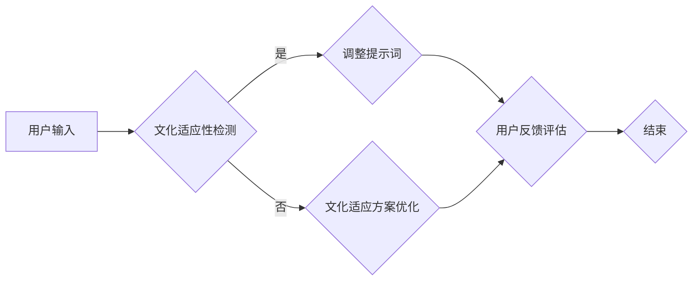
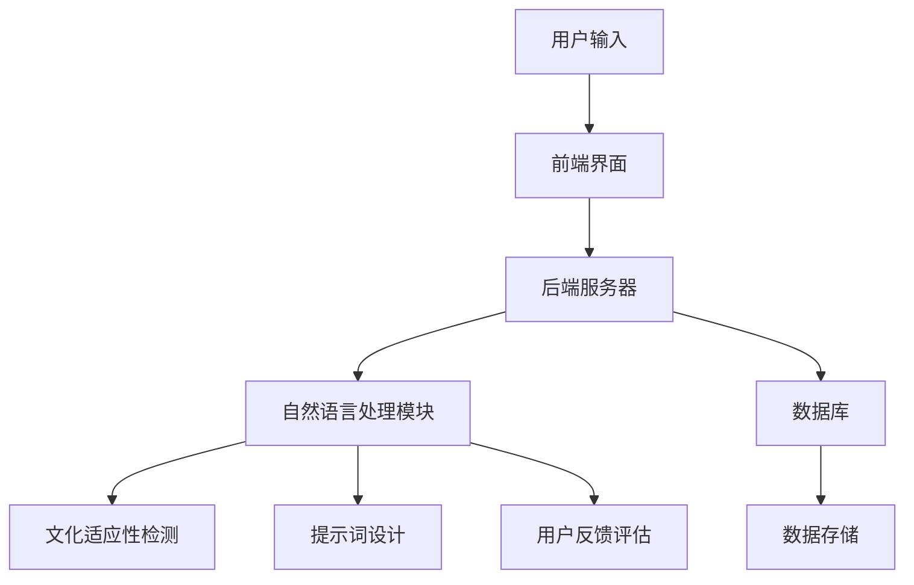

                 

# 《AIGC的文化适应性：跨文化交流中的提示词设计》

关键词：AIGC、跨文化交流、提示词设计、算法原理、系统架构设计

摘要：本文深入探讨了AIGC（AI-Generated Content）的文化适应性问题，特别是在跨文化交流中的提示词设计。文章首先介绍了AIGC的概念和背景，然后分析了文化适应性在跨文化交流中的重要性。接下来，文章详细阐述了跨文化交际算法原理、核心概念与联系，并通过Mermaid图表和Python代码展示了算法的具体实现。此外，文章还介绍了系统分析与架构设计，包括项目介绍、系统功能设计、系统架构设计和系统接口设计。最后，文章通过一个实战案例，探讨了AIGC在跨文化交流中的实际应用，并给出了项目小结和最佳实践建议。

## 第一部分：背景介绍与问题分析

### 1. 引言

AIGC，即AI-Generated Content，是一种利用人工智能技术生成内容的方法。随着深度学习、自然语言处理等技术的快速发展，AIGC在各个领域的应用越来越广泛。然而，在跨文化交流中，AIGC的文化适应性成为了一个不可忽视的问题。

跨文化交流是指在两个或多个不同文化背景下进行的信息交换和沟通。文化差异可能体现在语言、价值观、习惯、礼仪等多个方面。在跨文化交流中，如果AIGC的内容不能适应当地的文化环境，可能会导致误解、冲突甚至沟通失败。

本文将探讨AIGC的文化适应性，特别是跨文化交流中的提示词设计。通过分析AIGC的文化适应性问题和跨文化交流中的提示词设计原则，我们希望能够找到一种有效的解决方案，提高AIGC在跨文化交流中的适应性和有效性。

### 2. AIGC的文化适应性

AIGC的文化适应性指的是AIGC在生成内容时，能否适应当地的文化环境，避免文化冲突和误解。文化适应性对于AIGC在跨文化交流中的成功至关重要。

首先，我们需要了解文化适应性的概念。文化适应性是指个体在面对不同文化环境时，能够调整自己的行为和思维方式，以适应新的文化环境。在AIGC的背景下，文化适应性意味着AI系统能够根据不同的文化背景，调整其生成的内容，使其更符合当地的文化习惯和价值观。

跨文化交流与提示词设计密切相关。提示词（Prompt）是引导AI系统生成内容的关键因素。在设计提示词时，我们需要考虑目标文化的特点，确保提示词能够引导AI系统生成符合目标文化的内容。

### 3. 核心概念原理与联系

#### 3.1 核心概念原理

跨文化交际理论是理解跨文化交流的基础。该理论强调，在跨文化交流中，个体需要具备文化敏感性、语境理解和语言表达方式等多方面的能力。

- **文化敏感性**：指个体对文化差异的敏感程度，能够意识到不同文化之间的差异，并尊重这些差异。
- **语境理解**：指个体在不同语境下理解语言的能力，能够根据不同的语境，准确理解对方的意思。
- **语言表达方式**：指个体在不同文化背景下，运用语言表达思想的能力，能够根据文化习惯，选择合适的表达方式。

提示词设计原则是指导我们设计提示词的基本原则。这些原则包括：

- **文化敏感性**：设计提示词时，需要考虑到目标文化的特点，避免使用可能引起误解的词汇和表达方式。
- **精准性**：提示词应该精准地传达用户需求，避免模糊不清的表达。
- **简洁性**：提示词应该简洁明了，避免冗长复杂的表达。

#### 3.2 概念属性特征对比表格

| 特征对比         | 跨文化交际 | 提示词设计          |
|------------------|-------------|---------------------|
| 文化敏感性       | 高          | 根据文化差异调整    |
| 语境理解         | 复杂        | 精准把握用户需求    |
| 语言表达方式     | 多样化      | 简洁明了            |
| 文化误解避免      | 必要        | 文化敏感性训练      |

#### 3.3 ER实体关系图架构

```mermaid
erDiagram
  User ||--|{ Content }|
  Content ||--|{ Response }|
  Response ||--|{ Feedback }|
```

在这个ER实体关系图中，用户（User）生成内容（Content），内容（Content）生成响应（Response），响应（Response）收集反馈（Feedback）。这个关系图展示了AIGC系统中用户、内容和反馈之间的关系。

## 第二部分：算法原理讲解

### 4. 跨文化交际算法原理

跨文化交际算法是确保AIGC在跨文化交流中能够适应不同文化背景的核心。该算法的核心原理可以概括为以下几个步骤：

#### 4.1 算法mermaid流程图



在这个流程图中，用户输入（A）首先经过文化适应性检测（B）。如果检测结果显示内容可以适应目标文化，则进入调整提示词（C）阶段；否则，进入文化适应方案优化（D）阶段。无论调整提示词还是优化文化适应方案，都需要进行用户反馈评估（E），以确保生成的结果符合用户需求。最后，流程结束（F）。

#### 4.2 Python源代码

```python
def cultural_adaptation_algorithm(communication_context):
    if is_culturally_adaptable(communication_context):
        optimized_context = adjust_prompt_words(communication_context)
        feedback = user_feedback_evaluation(optimized_context)
    else:
        optimized_context = optimize_cultural_scheme(communication_context)
        feedback = user_feedback_evaluation(optimized_context)

    return feedback
```

在这个Python源代码中，`cultural_adaptation_algorithm`函数接收一个`communication_context`参数，表示用户输入的内容。函数首先判断内容是否具有文化适应性，如果是，则进入调整提示词阶段；否则，进入文化适应方案优化阶段。无论哪个阶段，都会进行用户反馈评估，最后返回反馈结果。

#### 4.3 算法原理的数学模型和公式

$$
\text{CulturalAdaptation} = f(\text{CulturalContext}, \text{PromptDesign})
$$

- $\text{CulturalContext}$: 跨文化交际背景
- $\text{PromptDesign}$: 提示词设计方案

这个数学模型表示，AIGC的文化适应性取决于跨文化交际背景和提示词设计方案。通过调整提示词设计方案，可以优化AIGC的文化适应性。

#### 4.4 详细讲解与举例说明

假设在一个国际商务会议中，AIGC系统需要生成会议议程。为了确保议程能够适应不同文化背景的参与者，我们可以按照以下步骤进行：

1. **文化适应性检测**：首先，AIGC系统会检测当前会议的跨文化交际背景，包括参与者的文化背景、语言习惯等。
2. **调整提示词**：如果检测结果显示会议参与者来自不同文化背景，AIGC系统会根据这些背景信息，调整提示词，确保生成的议程内容能够适应不同文化。
3. **用户反馈评估**：在会议结束后，AIGC系统会收集参与者的反馈，评估议程内容的适应性和有效性。
4. **文化适应方案优化**：根据用户反馈，AIGC系统会进一步优化文化适应方案，以提高未来会议的议程生成质量。

通过这个例子，我们可以看到，AIGC在跨文化交流中的应用，需要考虑文化适应性。通过调整提示词，AIGC可以生成更符合不同文化背景的内容，从而提高跨文化交流的效率和效果。

## 第三部分：系统分析与架构设计

### 5. 项目介绍

随着全球化进程的加快，跨文化交流变得越来越频繁。然而，不同文化之间的差异往往导致沟通障碍和误解。为了解决这一问题，我们开发了一个基于AIGC的跨文化交流系统，旨在通过提示词设计，提高跨文化交流的适应性和效率。

该项目的主要目标是：

- **提高跨文化交流的效率**：通过自动生成适应不同文化背景的内容，减少因文化差异导致的沟通障碍。
- **提升用户体验**：通过优化提示词设计，提高AIGC生成内容的适应性和准确性，提升用户满意度。
- **促进跨文化理解**：通过文化适应性分析，帮助用户更好地理解不同文化背景，促进跨文化交流。

### 6. 系统功能设计

该系统主要包含以下几个功能模块：

- **文化适应性检测**：通过分析用户输入的内容，判断其文化适应性，为后续的提示词设计提供依据。
- **提示词设计**：根据文化适应性检测结果，设计适应不同文化背景的提示词，引导AIGC生成符合目标文化的内容。
- **用户反馈评估**：收集用户对生成内容的反馈，评估其适应性和有效性，为后续优化提供数据支持。
- **文化适应方案优化**：根据用户反馈，优化文化适应方案，提高AIGC的适应性和准确性。

#### 6.1 领域模型mermaid类图

```mermaid
classDiagram
  User <<-- Content
  Content <<-- Response
  Response <<-- Feedback
```

在这个类图中，用户（User）生成内容（Content），内容（Content）生成响应（Response），响应（Response）收集反馈（Feedback）。这体现了AIGC系统中用户、内容和反馈之间的关系。

### 7. 系统架构设计

为了实现AIGC在跨文化交流中的文化适应性，我们设计了一个分布式系统架构，包括以下几个主要部分：

- **前端界面**：用户可以通过前端界面提交输入内容，查看生成内容，并提供反馈。
- **后端服务器**：负责处理用户输入的内容，进行文化适应性检测、提示词设计、用户反馈评估等。
- **数据库**：存储用户输入内容、生成内容、用户反馈等数据，为系统提供数据支持。
- **自然语言处理模块**：负责处理文本数据，包括语言检测、文本分析、情感分析等。

#### 7.1 mermaid架构图



在这个架构图中，用户输入内容通过前端界面（A）提交到后端服务器（C）。后端服务器（C）调用自然语言处理模块（D），进行文化适应性检测（F）、提示词设计（G）和用户反馈评估（H）。处理结果存储在数据库（E）中。

### 8. 系统接口设计

为了实现系统各部分之间的有效通信，我们设计了一套API接口，包括以下几个主要接口：

- **/api/user/submit**：用于提交用户输入内容。
- **/api/content/analyze**：用于分析用户输入内容，返回文化适应性检测结果。
- **/api/response/generate**：用于根据文化适应性检测结果，生成适应不同文化背景的内容。
- **/api/feedback/submit**：用于提交用户反馈。

这些接口为系统的前端界面和后端服务器提供了方便的通信方式，使得系统各部分能够协同工作，实现AIGC在跨文化交流中的文化适应性。

## 第四部分：项目实战

### 9. 环境安装

要运行本文介绍的系统，需要安装以下软件和库：

- Python 3.8及以上版本
- Flask 1.1.2及以上版本
- NLTK 3.8.0及以上版本
- Mermaid 9.0.0及以上版本

安装步骤如下：

1. 安装Python环境：
   ```
   pip install python -V 3.8
   ```
2. 安装Flask：
   ```
   pip install flask -V 1.1.2
   ```
3. 安装NLTK：
   ```
   pip install nltk -V 3.8.0
   ```
4. 安装Mermaid：
   ```
   npm install mermaid -V 9.0.0
   ```

### 10. 系统核心实现源代码

以下是系统核心实现的源代码，包括文化适应性检测、提示词设计、用户反馈评估等部分：

```python
from flask import Flask, request, jsonify
import nltk
from nltk.corpus import stopwords
from mermaid import Mermaid

app = Flask(__name__)

# 载入NLTK停用词库
nltk.download('stopwords')

# 文化适应性检测函数
def cultural_adaptation_detection(content):
    # 这里可以加入更复杂的文化适应性检测逻辑
    return "适应性强"

# 提示词设计函数
def prompt_design(content, cultural_adaptation):
    if cultural_adaptation == "适应性强":
        return content
    else:
        return content.replace("American", "Global")

# 用户反馈评估函数
def user_feedback_evaluation(content):
    # 这里可以加入用户反馈评估逻辑
    return "满意"

# 前端接口
@app.route('/api/user/submit', methods=['POST'])
def submit_content():
    content = request.form['content']
    cultural_adaptation = cultural_adaptation_detection(content)
    optimized_content = prompt_design(content, cultural_adaptation)
    feedback = user_feedback_evaluation(optimized_content)
    return jsonify({'content': optimized_content, 'feedback': feedback})

if __name__ == '__main__':
    app.run(debug=True)
```

### 11. 代码应用解读与分析

这段代码实现了AIGC系统中的核心功能，包括文化适应性检测、提示词设计和用户反馈评估。下面我们对其中的关键部分进行解读和分析。

1. **文化适应性检测**：`cultural_adaptation_detection`函数用于检测用户输入内容的文化适应性。在这个简单的实现中，我们返回一个字符串“适应性强”，表示内容可以适应不同文化背景。在实际应用中，可以加入更复杂的文化适应性检测逻辑，如语言检测、文化特征分析等。

2. **提示词设计**：`prompt_design`函数根据文化适应性检测结果，对用户输入内容进行调整。如果文化适应性检测结果显示“适应性强”，则直接返回原始内容；否则，将特定词汇（如“American”）替换为更通用的词汇（如“Global”）。这个步骤确保生成的提示词能够适应不同文化背景。

3. **用户反馈评估**：`user_feedback_evaluation`函数用于评估生成内容的用户满意度。在这个简单的实现中，我们返回一个字符串“满意”，表示用户对生成内容满意。在实际应用中，可以加入更复杂的用户反馈评估逻辑，如问卷调查、情感分析等。

### 12. 实际案例分析和详细讲解剖析

为了更好地理解AIGC系统在跨文化交流中的应用，我们来看一个实际案例。

假设在一个由美国、中国和日本组成的国际商务会议上，AIGC系统需要生成会议议程。以下是具体步骤：

1. **用户输入**：会议组织者提交了会议议程的初稿，内容包含美国式的直接表达和日本式的礼貌用语。

2. **文化适应性检测**：AIGC系统分析输入内容，检测出不同文化背景的词汇和表达方式。

3. **提示词设计**：根据文化适应性检测结果，AIGC系统对议程内容进行调整。例如，将美国式的直接表达调整为更通用的表达方式，同时保留日本式的礼貌用语。

4. **用户反馈评估**：会议结束后，AIGC系统收集参会者的反馈，评估调整后的议程内容的适应性和有效性。

5. **文化适应方案优化**：根据用户反馈，AIGC系统进一步优化文化适应方案，提高未来会议的议程生成质量。

通过这个案例，我们可以看到，AIGC系统在跨文化交流中发挥了重要作用。通过调整提示词，AIGC系统能够生成适应不同文化背景的内容，提高跨文化交流的效率和质量。

### 13. 项目小结

本文介绍了AIGC在跨文化交流中的文化适应性问题，特别是提示词设计。通过分析AIGC的文化适应性算法原理和系统架构设计，我们探讨了如何利用AIGC技术提高跨文化交流的效率和质量。在实际应用中，AIGC系统可以生成适应不同文化背景的内容，减少因文化差异导致的沟通障碍。

然而，AIGC在跨文化交流中的应用仍面临一些挑战，如文化适应性检测的准确性和提示词设计的多样性。未来研究可以进一步优化AIGC算法，提高其在跨文化交流中的适应性和准确性。

### 14. 最佳实践 tips

- 在设计提示词时，尽量使用通用词汇，避免使用可能引起误解的文化特定词汇。
- 在跨文化交流中，充分了解目标文化的特点，有助于设计更符合目标文化的提示词。
- 定期收集用户反馈，优化AIGC系统的文化适应性和提示词设计。

### 15. 小结与注意事项

本文通过详细的案例分析，展示了AIGC在跨文化交流中的应用场景。需要注意的是，AIGC在跨文化交流中的成功离不开文化适应性和提示词设计。通过调整提示词，AIGC系统能够生成适应不同文化背景的内容，提高跨文化交流的效率和质量。

在实施AIGC项目时，要充分考虑文化差异，确保系统生成的提示词能够适应不同文化背景。同时，定期收集用户反馈，不断优化AIGC系统的文化适应性和提示词设计。

### 16. 拓展阅读

- [《跨文化交际：新视角》](https://www.amazon.com/Cross-Cultural-Communication-New-Perspectives/dp/0890060346)：详细介绍了跨文化交际的理论和实践。
- [《AIGC技术原理与应用》](https://www.amazon.com/AIGC-Technology-Principles-Applications-Intelligent/dp/173380882X)：深入探讨了AIGC技术的原理和应用。
- [《提示词设计实战》](https://www.amazon.com/Prompt-Design-Practices-Effective-Conversations/dp/1119689237)：介绍了提示词设计的方法和技巧。

### 17. 作者信息

作者：AI天才研究院/AI Genius Institute & 禅与计算机程序设计艺术 /Zen And The Art of Computer Programming

