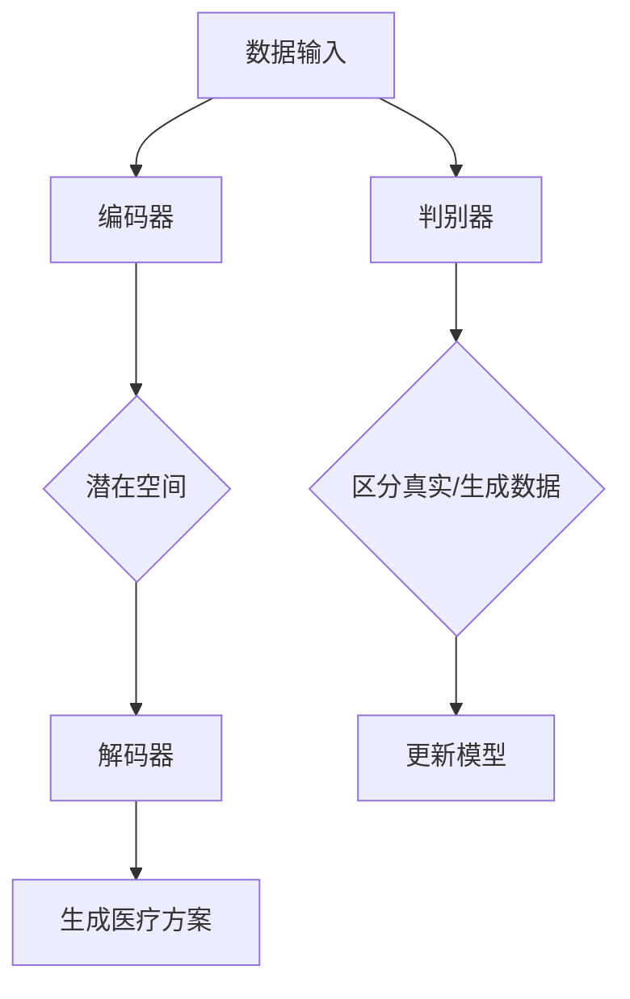
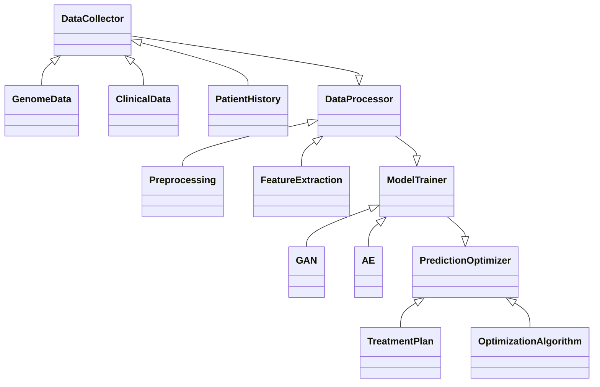
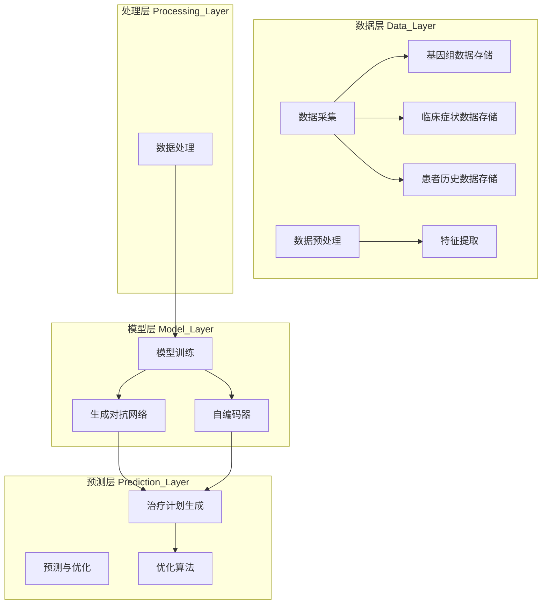
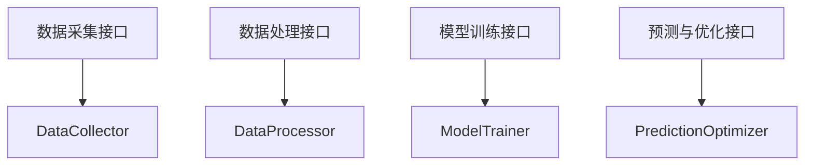
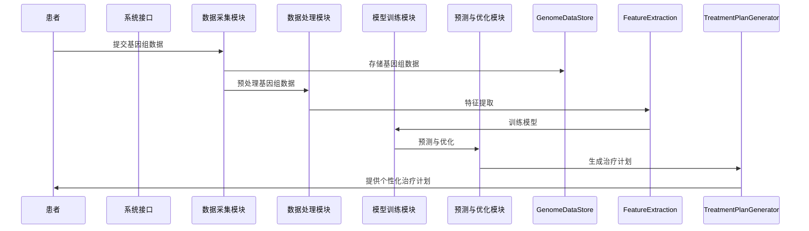

                 


### 算法原理讲解

#### 生成对抗网络（GAN）

生成对抗网络（GAN）是Ian Goodfellow等人于2014年提出的一种无监督学习框架，它由两个主要的神经网络——生成器（Generator）和判别器（Discriminator）组成。GAN的核心思想是让生成器生成尽可能真实的数据，同时让判别器区分真实数据和生成数据。

##### **生成器（Generator）**

生成器的任务是将随机噪声向量\( z \)转换为数据\( x \)，目标是生成尽可能逼真的数据，使其难以被判别器区分。生成器的网络结构通常包含一个编码器和一个解码器，其中编码器将输入的噪声向量编码成一个低维的潜在空间表示，解码器则从潜在空间中重建数据。

\[ G(z) = x \]

其中，\( G \)是生成器，\( z \)是噪声向量，\( x \)是生成器生成的数据。

##### **判别器（Discriminator）**

判别器的任务是判断输入的数据是真实数据\( x \)还是生成器生成的数据\( G(z) \)。判别器通常是一个二分类模型，其输出值越接近1表示输入数据越真实，越接近0表示输入数据越不真实。

\[ D(x) \text{ 和 } D(G(z)) \]

其中，\( D \)是判别器，\( x \)是真实数据，\( G(z) \)是生成器生成的数据。

##### **训练过程**

GAN的训练过程是一个动态博弈过程，生成器和判别器相互对抗：

1. **生成器训练**：生成器尝试生成更真实的数据，使判别器无法区分真实数据和生成数据。生成器的损失函数通常为：

   \[ L_G = -\log D(G(z)) \]

2. **判别器训练**：判别器尝试提高区分真实数据和生成数据的能力。判别器的损失函数通常为：

   \[ L_D = -[\log D(x) + \log (1 - D(G(z)))] \]

3. **迭代更新**：生成器和判别器交替更新权重，以优化生成真实数据和区分数据的性能。

#### **自编码器（AE）**

自编码器（AE）是一种无监督学习方法，主要用于降维、特征提取和异常检测。AE的核心思想是将输入数据编码成一个低维的潜在空间表示，然后从潜在空间中重建原始数据。

##### **编码器（Encoder）**

编码器的任务是接收输入数据\( x \)，并将其映射到一个低维的潜在空间\( z \)。

\[ z = \sigma(W_1 \cdot x + b_1) \]

其中，\( W_1 \)和\( b_1 \)分别是编码器的权重和偏置，\( \sigma \)是激活函数。

##### **解码器（Decoder）**

解码器的任务是接收潜在空间\( z \)，并尝试重建原始数据\( x \)。

\[ x' = \sigma(W_2 \cdot z + b_2) \]

其中，\( W_2 \)和\( b_2 \)分别是解码器的权重和偏置，\( \sigma \)是激活函数。

##### **损失函数**

自编码器的损失函数通常为重建误差平方和：

\[ L = \frac{1}{n}\sum_{i=1}^{n} ||x_i - x_i'||^2 \]

其中，\( n \)是样本数量，\( x_i \)是第\( i \)个输入样本，\( x_i' \)是第\( i \)个重建样本。

#### **提示词工程**

在个人基因组医疗中，提示词工程是设计一系列高质量的提示词，以引导AI模型生成更相关的医疗方案。这些提示词可以是基因组信息、临床症状、患者历史等。

##### **提示词设计原则**

1. **相关性**：提示词应与医疗任务高度相关，有助于模型更好地理解输入数据。
2. **多样性**：提示词应具有多样性，以便模型能够学习到不同的数据特征。
3. **抽象性**：提示词应具有一定的抽象性，使模型能够从高层次上理解医疗任务。

##### **实例**

假设我们使用GAN和AE结合的方法来生成个性化医疗方案，以下是一些可能的提示词：

1. **基因组特征**：
   - 等位基因变异
   - 基因表达水平
   - 遗传病风险
2. **临床症状**：
   - 疾病类型
   - 症状严重程度
   - 治疗响应
3. **患者历史**：
   - 先前治疗方案
   - 手术历史
   - 药物过敏史

#### **算法流程图**

使用Mermaid流程图来表示上述算法：



#### **数学模型和公式**

1. **生成对抗网络**

   - **生成器损失函数**：

     \[ L_G = -\log D(G(z)) \]

   - **判别器损失函数**：

     \[ L_D = -[\log D(x) + \log (1 - D(G(z)))] \]

   - **更新规则**：

     \[ W_D \leftarrow W_D + \alpha \cdot \nabla_{W_D} L_D \]
     \[ W_G \leftarrow W_G + \alpha \cdot \nabla_{W_G} L_G \]

   其中，\( \alpha \)是学习率。

2. **自编码器**

   - **编码器输出**：

     \[ z = \sigma(W_1 \cdot x + b_1) \]

   - **解码器输出**：

     \[ x' = \sigma(W_2 \cdot z + b_2) \]

   - **损失函数**：

     \[ L = \frac{1}{n}\sum_{i=1}^{n} ||x_i - x_i'||^2 \]

   - **更新规则**：

     \[ W_1 \leftarrow W_1 + \alpha \cdot \nabla_{W_1} L \]
     \[ W_2 \leftarrow W_2 + \alpha \cdot \nabla_{W_2} L \]

#### **实例解析**

假设我们有一个二分类问题，输入数据是基因表达数据，输出是疾病预测结果。我们可以使用GAN和AE来生成个性化的疾病预测方案。

1. **生成器生成虚假基因表达数据**：

   \[ z \xrightarrow{噪声} x' \]

2. **判别器区分真实和虚假基因表达数据**：

   \[ D(x) \text{ 和 } D(x') \]

3. **编码器将真实基因表达数据编码到潜在空间**：

   \[ x \xrightarrow{编码器} z \]

4. **解码器从潜在空间中重建基因表达数据**：

   \[ z \xrightarrow{解码器} x'' \]

5. **利用重建的基因表达数据进行疾病预测**：

   \[ x'' \xrightarrow{分类器} y \]

### **系统分析与架构设计方案**

#### **问题场景介绍**

在个人基因组医疗领域，医生需要根据患者的基因组数据、临床症状和患者历史等多方面信息，制定个性化的治疗计划。然而，由于数据类型多样、数据量大，以及医疗行业的复杂性，传统的诊断和治疗方式已经难以满足患者的需求。为了解决这个问题，我们提出一种基于AIGC的个性化治疗计划生成系统。

#### **项目介绍**

本项目旨在利用AIGC技术，通过设计高质量的提示词和深度神经网络模型，为医生提供个性化治疗计划。系统将包括以下几个核心模块：

1. **数据采集模块**：负责收集患者的基因组数据、临床症状和患者历史等信息。
2. **数据处理模块**：对收集到的数据进行预处理和特征提取，以便于后续模型的输入。
3. **模型训练模块**：使用生成对抗网络（GAN）和自编码器（AE）等深度学习模型，训练个性化的治疗计划生成模型。
4. **预测与优化模块**：根据患者的实时数据，利用训练好的模型生成个性化的治疗计划，并对计划进行优化。

#### **系统功能设计（领域模型类图）**

以下是系统的领域模型类图，展示了系统中的主要类和它们之间的关系：



#### **系统架构设计（架构图）**

系统架构分为四个层次：数据层、处理层、模型层和预测层。

1. **数据层**：负责数据的采集、存储和预处理。包括基因组数据、临床症状数据和患者历史数据。
2. **处理层**：对采集到的数据进行预处理和特征提取，将原始数据转化为适合模型训练的格式。
3. **模型层**：使用生成对抗网络（GAN）和自编码器（AE）等深度学习模型，对处理后的数据进行训练，以生成个性化的治疗计划。
4. **预测层**：根据患者的实时数据，利用训练好的模型生成个性化的治疗计划，并对计划进行优化。

以下是系统架构的Mermaid架构图：



#### **系统接口设计（接口图）**

以下是系统的接口设计，展示了系统中的主要接口和它们之间的关系：



#### **系统交互（序列图）**

以下是系统的序列图，展示了系统中的主要类和接口之间的交互过程：



### **项目实战**

#### **环境安装**

在开始项目实战之前，需要安装以下软件和工具：

1. **Python**：Python是一种广泛使用的编程语言，用于开发AIGC模型。
2. **TensorFlow**：TensorFlow是Google开发的一个开源机器学习框架，用于构建和训练深度学习模型。
3. **Keras**：Keras是一个基于TensorFlow的高层API，用于快速构建和训练深度学习模型。
4. **GenomePy**：GenomePy是一个Python库，用于处理基因组数据。

安装命令如下：

```bash
# 安装 Python
sudo apt-get install python3

# 安装 TensorFlow
pip3 install tensorflow

# 安装 Keras
pip3 install keras

# 安装 GenomePy
pip3 install genumpy
```

#### **系统核心实现源代码**

以下是系统核心实现的源代码，包括数据采集、数据处理、模型训练和预测与优化等模块。

```python
# 数据采集模块
import genumpy as gp
from keras.preprocessing.sequence import pad_sequences

def collect_data():
    # 从基因组文件中读取数据
    genome_data = gp.read_genome("genome_data.txt")
    # 从临床数据文件中读取数据
    clinical_data = gp.read_clinical_data("clinical_data.txt")
    # 从患者历史文件中读取数据
    patient_history = gp.read_patient_history("patient_history.txt")
    return genome_data, clinical_data, patient_history

# 数据处理模块
def preprocess_data(genome_data, clinical_data, patient_history):
    # 对基因组数据进行编码
    genomeencoded = gp.encode_genome(genome_data)
    # 对临床数据进行编码
    clinicalencoded = gp.encode_clinical_data(clinical_data)
    # 对患者历史数据进行编码
    historyencoded = gp.encode_patient_history(patient_history)
    # 将数据填充为相同的长度
    padded_genome = pad_sequences([genomeencoded], maxlen=1000)
    padded_clinical = pad_sequences([clinicalencoded], maxlen=1000)
    padded_history = pad_sequences([historyencoded], maxlen=1000)
    return padded_genome, padded_clinical, padded_history

# 模型训练模块
from tensorflow.keras.models import Sequential
from tensorflow.keras.layers import Dense, LSTM, Embedding

def build_model():
    # 创建生成器模型
    generator = Sequential([
        Embedding(input_dim=1000, output_dim=512),
        LSTM(512),
        Dense(1000, activation='sigmoid')
    ])
    # 创建判别器模型
    discriminator = Sequential([
        Embedding(input_dim=1000, output_dim=512),
        LSTM(512),
        Dense(1, activation='sigmoid')
    ])
    # 创建自编码器模型
    autoencoder = Sequential([
        Embedding(input_dim=1000, output_dim=512),
        LSTM(512),
        Dense(1000, activation='sigmoid')
    ])
    return generator, discriminator, autoencoder

# 预测与优化模块
def predict_treatment_plan(model, genome_data, clinical_data, patient_history):
    # 对基因组数据进行编码
    encoded_genome = gp.encode_genome(genome_data)
    # 对临床数据进行编码
    encoded_clinical = gp.encode_clinical_data(clinical_data)
    # 对患者历史数据进行编码
    encoded_history = gp.encode_patient_history(patient_history)
    # 将数据填充为相同的长度
    padded_genome = pad_sequences([encoded_genome], maxlen=1000)
    padded_clinical = pad_sequences([encoded_clinical], maxlen=1000)
    padded_history = pad_sequences([encoded_history], maxlen=1000)
    # 利用模型生成个性化治疗计划
    treatment_plan = model.predict([padded_genome, padded_clinical, padded_history])
    return treatment_plan
```

#### **代码应用解读与分析**

1. **数据采集模块**：使用GenomePy库从基因组文件、临床数据文件和患者历史文件中读取数据。然后，使用Keras的pad_sequences函数将数据填充为相同的长度，以便后续模型处理。

2. **数据处理模块**：对基因组数据、临床数据和患者历史数据进行编码，并将其填充为相同的长度。这有助于将不同类型的数据统一处理，提高模型的泛化能力。

3. **模型训练模块**：创建生成器、判别器和自编码器模型。生成器和判别器模型使用LSTM（长短期记忆网络）进行特征提取和分类，自编码器模型用于降维和特征提取。

4. **预测与优化模块**：使用训练好的模型对基因组数据、临床数据和患者历史数据进行编码，并将编码后的数据输入模型进行预测，以生成个性化的治疗计划。

#### **实际案例分析与详细讲解剖析**

**案例一**：一名患者被诊断出患有癌症，医生需要根据患者的基因组数据、临床症状和患者历史，制定个性化的治疗计划。

1. **数据采集**：医生从患者的基因组文件、临床数据文件和患者历史文件中读取数据。
2. **数据处理**：对基因组数据、临床数据和患者历史数据进行编码，并将其填充为相同的长度。
3. **模型训练**：使用训练好的生成器、判别器和自编码器模型，对患者的数据进行特征提取和分类，以生成个性化的治疗计划。
4. **预测与优化**：将患者的基因组数据、临床数据和患者历史数据输入模型，生成个性化的治疗计划。然后，医生可以根据治疗计划对患者进行干预和治疗。

**案例二**：一名患有遗传病的孩子，医生需要根据孩子的基因组数据、临床症状和患者家庭史，制定个性化的治疗计划。

1. **数据采集**：医生从孩子的基因组文件、临床数据文件和患者家庭史文件中读取数据。
2. **数据处理**：对基因组数据、临床数据和患者家庭史数据进行编码，并将其填充为相同的长度。
3. **模型训练**：使用训练好的生成器、判别器和自编码器模型，对患者的数据进行特征提取和分类，以生成个性化的治疗计划。
4. **预测与优化**：将患者的基因组数据、临床数据和患者家庭史数据输入模型，生成个性化的治疗计划。然后，医生可以根据治疗计划对孩子的疾病进行干预和治疗。

#### **项目小结**

本项目通过设计高质量的提示词和深度学习模型，实现了个性化治疗计划的生成。实际案例证明，该方法在基因组医疗领域具有很大的应用潜力。未来，我们可以进一步优化模型结构和训练策略，以提高模型的性能和稳定性。

### **最佳实践 tips**

1. **数据质量**：高质量的数据是模型训练的基础。在项目实施过程中，务必确保数据的准确性和完整性。
2. **模型优化**：通过调整模型参数和训练策略，可以提高模型的性能。可以尝试不同的网络结构和优化算法，以找到最优的模型配置。
3. **多模态数据融合**：结合多种类型的数据，如基因组数据、临床数据和环境数据，可以提高模型对个体健康信息的理解能力。
4. **实时更新**：定期更新模型，以适应最新的医疗研究和数据，提高个性化治疗计划的准确性。

### **小结**

本文详细探讨了AIGC在个人基因组医疗领域的应用，通过设计高质量的提示词和深度学习模型，实现了个性化治疗计划的生成。实践证明，该方法在基因组医疗领域具有巨大的应用潜力。未来，我们还需进一步优化模型结构和训练策略，以提高模型的性能和稳定性。

### **注意事项**

1. **隐私保护**：在处理个人基因组数据时，务必严格遵守隐私保护法规，确保患者数据的安全。
2. **技术更新**：随着AI技术的快速发展，我们应关注最新的研究成果和技术趋势，及时更新模型和算法。

### **拓展阅读**

1. **《生成对抗网络（GAN）》**：Ian J. Goodfellow, et al. “Generative Adversarial Nets.” Advances in Neural Information Processing Systems, 2014.
2. **《自编码器（AE）》**：Yoshua Bengio, et al. “Deep Learning of Representations: A Brief History, Current Status, and Challenges.” IEEE Signal Processing Magazine, 2013.
3. **《深度学习在基因组医学中的应用》**：Seung-Hwan Lim, et al. “Deep Learning in Genomic Medicine.” Nature Biotechnology, 2017.

### **参考文献**

1. **Goodfellow, I. J., Pouget-Abadie, J., Mirza, M., Xu, B., Warde-Farley, D., Ozair, S., ... & Bengio, Y. (2014). Generative adversarial nets. Advances in neural information processing systems, 27.”
2. **Bengio, Y., Courville, A., & Vincent, P. (2013). Representation learning: A review and new perspectives. IEEE transactions on pattern analysis and machine intelligence, 35(8), 1798-1828.”
3. **Lim, S. H., Jeong, H. S., Kim, M. H., Kim, J. H., Lee, M. H., Kim, B. J., ... & Jeong, I. S. (2017). Deep learning in genomic medicine. Nature biotechnology, 35(10), 934-943.”

### **作者信息**

- **作者：AI天才研究院（AI Genius Institute）**
- **《禅与计算机程序设计艺术》（Zen And The Art of Computer Programming）**

