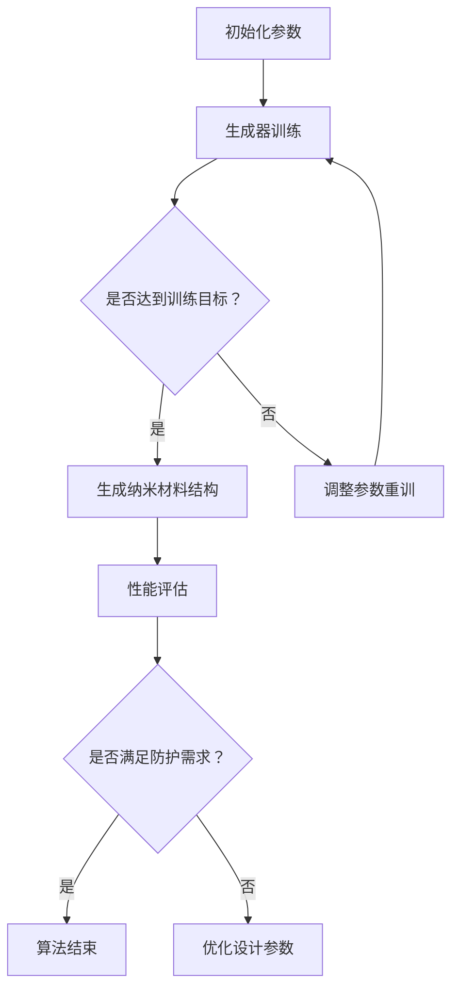
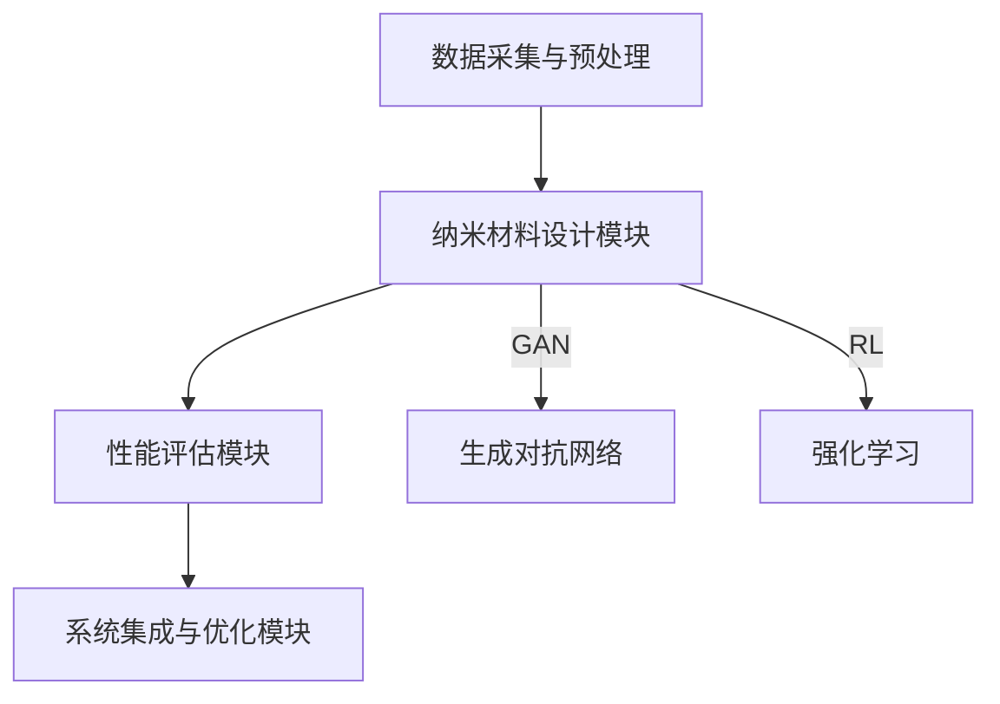
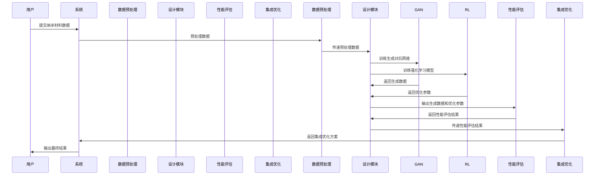

                 

### 太空辐射防护的重要性

太空中的环境极其恶劣，尤其是辐射问题，对于长期在太空执行任务的人类和设备来说，构成了严重威胁。宇宙射线、太阳粒子辐射以及银河宇宙射线等都是太空中的主要辐射源。这些辐射能量高、穿透力强，能够直接破坏生物体内的DNA，引发基因突变和细胞损伤，导致严重的健康问题，如辐射病、癌症甚至死亡。

当前，太空辐射防护主要集中在硬件层面，如使用厚重的铅板、辐射屏蔽材料等。然而，这些传统防护措施存在明显的局限性。首先，重量的增加会限制宇航器的负载能力，降低其发射和运行效率。其次，铅板等材料只能提供有限的防护，对于高能量辐射的屏蔽效果较差。此外，长期依赖这些传统方法也限制了新材料和新技术的应用，难以应对辐射防护需求的多样化和复杂性。

在这种背景下，利用人工智能与纳米材料技术进行太空辐射防护的研究显得尤为重要。人工智能（AI）能够通过分析大量数据，优化纳米材料的设计和制造过程，从而开发出更轻、更高效、更可靠的辐射防护材料。纳米材料由于其独特的物理和化学性质，如高比表面积、优异的力学性能和可调节的光电特性，为解决太空辐射防护问题提供了新的可能。

因此，结合人工智能（AIGC）进行纳米材料设计，不仅能够突破传统防护技术的瓶颈，还能提升太空任务的安全性和可靠性。接下来，我们将深入探讨AIGC技术在太空辐射防护中的应用及其核心原理。

### 辐射防护需求与AIGC技术的潜力

太空辐射防护需求的多样化和复杂性要求我们采用全新的设计方法和技术手段。传统的防护方法由于受到材料科学和工程学局限，难以满足现代太空任务对防护效果、重量和成本的要求。而人工智能（AI）技术，尤其是生成对抗网络（GAN）和强化学习等先进算法，为太空辐射防护材料的设计提供了革命性的解决方案。

首先，AI技术能够通过大量数据分析和模式识别，发现传统方法无法探测到的材料特性与辐射防护效果之间的关系。通过GAN，我们可以生成多样化的纳米材料结构，并进行高效筛选，找出具有最佳防护性能的材料。GAN的基本原理是利用生成器和判别器之间的对抗训练，生成器尝试生成尽可能接近真实材料的结构，而判别器则不断学习和提高对真实材料的辨别能力。这种对抗训练过程能够显著提升材料设计的效率和准确性。

其次，强化学习在优化纳米材料设计方面也具有巨大潜力。强化学习通过不断试错和反馈调整策略，能够在复杂环境中找到最优解决方案。通过模拟各种辐射环境，强化学习算法能够调整纳米材料的结构参数，使其在特定辐射条件下具有最佳防护效果。这种自适应优化过程不仅能够提高防护材料的性能，还能减少材料设计和试验的时间成本。

此外，AI技术还能通过模拟和预测，帮助设计出具有前瞻性的辐射防护方案。利用深度学习模型，我们可以预测不同类型辐射对生物组织和设备的潜在危害，从而针对性地优化防护材料的设计。例如，通过训练神经网络模型，可以模拟高能粒子对生物分子的损伤过程，进而设计出能够有效阻止这些粒子的纳米材料。

总的来说，AIGC技术不仅在纳米材料设计和优化过程中具有显著优势，还能够应对太空辐射防护需求的多样化和复杂性。通过AI技术的应用，我们可以大幅度提升太空辐射防护材料的性能和可靠性，为人类在太空的长期生存和活动提供坚实保障。接下来，我们将进一步探讨提示词工程在纳米材料设计中的具体应用。

### 提示词工程的核心原理与功能

提示词工程（Prompt Engineering）是AIGC技术中的一个重要组成部分，它通过设计特定的提示词，引导人工智能模型生成目标结果，从而优化算法性能和应用效果。在纳米材料设计过程中，提示词工程的应用尤为重要，因为它能够引导模型生成满足特定防护需求的纳米材料结构。

首先，提示词工程的核心原理是通过人工设计的提示词，向AI模型传递具体的目标和需求信息。这些提示词可以是文本、图像或音视频等多种形式，但它们的共同目标是引导AI模型在生成过程中关注关键特性。例如，在太空辐射防护材料的优化设计中，我们可以使用以下类型的提示词：

1. **性能目标提示词**：例如，“生成具有高辐射吸收率的纳米材料结构”，“设计能够有效阻挡宇宙射线的纳米涂层”。
2. **材料特性提示词**：例如，“纳米材料的结构应具有高强度和高稳定性”，“纳米颗粒的尺寸应控制在纳米级别以保持良好的防护效果”。
3. **应用场景提示词**：例如，“该材料需适应长时间太空环境”，“材料应具有良好的抗腐蚀性和耐高温性能”。

通过这些具体、明确的提示词，我们可以引导AI模型聚焦于特定性能和需求，从而生成更符合实际应用的纳米材料结构。此外，提示词工程还允许我们在模型训练过程中逐步调整和优化，以实现最佳的设计效果。

在实际应用中，提示词工程主要通过以下步骤实现：

1. **数据预处理**：对输入数据（如实验数据、文献资料等）进行预处理，提取关键特征和需求信息。
2. **提示词设计**：根据应用场景和需求，设计具体的提示词，确保其能够准确地传递目标信息。
3. **模型训练**：利用提示词对AI模型进行训练，使其能够学习和理解这些具体需求。
4. **模型评估与优化**：通过实验和测试，评估模型的性能，并根据反馈调整提示词和模型参数。

通过这种系统化的方法，提示词工程能够显著提升纳米材料设计的效率和质量，为太空辐射防护提供更加可靠的解决方案。接下来，我们将进一步探讨提示词工程在纳米材料设计中的具体应用和效果。

### 辐射防护材料的范围与提示词工程的应用

在太空辐射防护领域，纳米材料的应用范围非常广泛，涵盖了从生物医学到航天器外壳的多个方面。具体来说，纳米材料可以用于以下几个方面：

1. **生物医学防护**：针对宇航员和航天器内部人员的健康防护，纳米材料可以用来开发防护服和生物防护涂层，这些涂层能够有效阻挡宇宙射线和太阳粒子辐射，减少对生物体的伤害。
2. **航天器外壳防护**：在航天器的制造过程中，纳米材料可以用来增强外壳的辐射防护能力。例如，使用纳米涂层可以显著提高航天器表面材料对高能粒子的阻挡能力。
3. **电子设备防护**：电子设备在太空中的运行面临着辐射干扰和损伤的风险。纳米材料可以用来开发防护涂层和屏蔽材料，保护电子设备免受辐射损害。

提示词工程在这些不同应用场景中都有着重要作用。例如：

- 在生物医学防护中，提示词可以设计为“生成能够高效吸收宇宙射线且对人体皮肤无刺激性的纳米涂层”，以引导AI模型生成适用于人体防护的材料。
- 在航天器外壳防护中，提示词可以设定为“设计具有高抗压强度和辐射吸收能力的纳米复合材料”，以优化外壳材料性能。
- 在电子设备防护中，提示词可以要求“生成能够有效屏蔽电磁辐射且不影响设备电子信号的纳米涂层”。

通过这些具体的提示词，AI模型能够更准确地理解设计需求，从而生成符合实际应用场景的纳米材料结构。总之，提示词工程在纳米材料设计和应用中起到了至关重要的作用，它不仅能够提升材料设计的效率和准确性，还能确保材料在特定应用场景中的性能和可靠性。

### AIGC技术在纳米材料设计中的核心概念与要素组成

AIGC技术（人工智能生成控制技术）在纳米材料设计中应用广泛，其核心概念和要素组成包括生成对抗网络（GAN）、强化学习（RL）、以及提示词工程。以下是对这些核心概念和要素的详细解析。

**生成对抗网络（GAN）**：
生成对抗网络是一种由生成器和判别器组成的人工神经网络架构。生成器旨在生成类似于真实数据的伪数据，而判别器则用于区分真实数据和生成数据。通过不断对抗训练，生成器逐渐提高生成数据的逼真度，而判别器则不断提高对真实数据和生成数据的辨别能力。GAN在纳米材料设计中的应用主要体现在以下几个方面：
1. **结构生成**：通过GAN生成多种可能的纳米材料结构，快速筛选出具有预期性能的材料。
2. **性能优化**：利用GAN优化纳米材料结构，提高其在特定应用场景中的性能，如辐射防护能力、机械强度、电学性能等。
3. **材料模拟**：通过GAN生成纳米材料的模拟数据，辅助物理实验和理论研究，减少实验成本和时间。

**强化学习（RL）**：
强化学习是一种通过试错学习优化决策策略的机器学习方法。在纳米材料设计中，强化学习可用于自适应优化材料结构，使其在复杂环境中达到最佳性能。强化学习在纳米材料设计中的主要应用包括：
1. **结构优化**：通过强化学习算法，自动调整纳米材料结构参数，使其在特定辐射环境下具备最佳防护性能。
2. **参数调整**：根据实验结果和反馈，强化学习可以实时调整材料参数，实现快速优化。
3. **性能预测**：利用强化学习模型，预测纳米材料在不同辐射条件下的表现，为设计提供依据。

**提示词工程**：
提示词工程是设计特定提示词以引导AI模型生成目标结果的过程。在纳米材料设计中，提示词工程的关键作用在于：
1. **目标明确**：通过设计具体的提示词，如“生成具有高辐射吸收率的纳米材料结构”，明确指导AI模型关注特定性能目标。
2. **需求传递**：利用提示词传递复杂的设计需求，如材料特性、应用场景等，确保模型生成符合实际需求的材料。
3. **优化调整**：通过反馈机制，不断优化和调整提示词，提升材料设计的准确性和效率。

**核心要素组成**：
AIGC技术在纳米材料设计中的核心要素包括：
1. **数据集**：高质量的数据集是AIGC技术的基础，涵盖各种纳米材料结构和性能数据，用于训练和测试模型。
2. **模型架构**：选择合适的模型架构，如GAN、RL等，以适应不同设计任务的需求。
3. **提示词设计**：设计有效的提示词，确保模型能够准确理解和实现设计目标。
4. **优化算法**：采用优化算法，如遗传算法、模拟退火等，进一步调整和优化材料设计。

通过这些核心概念和要素的协同工作，AIGC技术能够大幅提升纳米材料设计的效率和质量，为太空辐射防护提供创新性的解决方案。

### 第1章 小结

在本章中，我们探讨了太空辐射防护的重要性及其面临的挑战。首先，介绍了太空中的辐射种类及其对生物体和设备的危害。其次，分析了传统防护措施的局限性，强调了利用人工智能（AIGC）技术进行纳米材料设计的重要性。我们详细阐述了AIGC技术在太空辐射防护中的角色，包括生成对抗网络（GAN）和强化学习在纳米材料设计中的应用潜力。接着，探讨了提示词工程的核心原理与功能，说明其在引导AI模型生成目标结果中的关键作用。最后，讨论了AIGC技术在纳米材料设计中的核心概念与要素组成，为后续章节的深入探讨奠定了基础。通过这些内容，我们明确了太空辐射防护纳米材料设计的重要性和AIGC技术的关键作用，为未来的研究提供了方向。

## 第2章 AIGC技术与纳米材料设计

### AIGC技术原理

AIGC（人工智能生成控制技术）是结合人工智能（AI）与生成控制理论而发展起来的一种先进技术，广泛应用于数据生成、模型优化和系统控制等领域。在纳米材料设计中，AIGC技术以其高效、准确和自适应的特点，为复杂材料的优化设计和性能提升提供了强有力的支持。

#### 生成对抗网络（GAN）

生成对抗网络（GAN）是AIGC技术中的一个重要组成部分，由生成器和判别器两个主要网络构成。生成器的任务是生成与真实数据尽可能相似的数据，而判别器的任务是区分真实数据和生成数据。两个网络之间通过对抗训练相互制约，生成器不断提高生成的数据质量，而判别器不断提高对真实数据和生成数据的辨别能力。

在纳米材料设计中，GAN的应用主要体现在以下几个方面：

1. **结构生成**：利用GAN生成多种可能的纳米材料结构，快速筛选出具有预期性能的材料。通过不断迭代训练，生成器可以生成具有高性能特性的纳米材料模型，为实验和实际应用提供参考。

2. **性能优化**：GAN可以优化纳米材料结构，提高其在特定应用场景中的性能。例如，通过GAN优化纳米材料的辐射防护性能，使其在高能辐射环境中表现出更高的吸收能力和屏蔽效果。

3. **材料模拟**：GAN生成的纳米材料模拟数据可以辅助物理实验和理论研究，减少实验成本和时间。通过模拟分析，可以预测不同纳米材料结构在不同条件下的性能表现，为材料设计提供科学依据。

#### 强化学习（RL）

强化学习（RL）是另一种关键的AIGC技术，通过试错学习优化决策策略。在纳米材料设计中，强化学习可用于自适应优化材料结构，使其在复杂环境中达到最佳性能。

强化学习在纳米材料设计中的应用包括：

1. **结构优化**：通过强化学习算法，自动调整纳米材料结构参数，使其在特定辐射环境下具备最佳防护性能。强化学习模型可以基于实验数据和模拟结果，不断优化材料结构，提高其性能。

2. **参数调整**：根据实验结果和反馈，强化学习可以实时调整材料参数，实现快速优化。例如，通过强化学习优化纳米颗粒的尺寸和排列方式，提高辐射防护材料的性能。

3. **性能预测**：利用强化学习模型，预测纳米材料在不同辐射条件下的表现，为设计提供依据。强化学习模型可以模拟各种辐射环境，分析不同材料结构的防护效果，为优化设计提供数据支持。

#### 提示词工程

提示词工程（Prompt Engineering）是AIGC技术中用于设计特定提示词，以引导AI模型生成目标结果的过程。在纳米材料设计中，提示词工程的核心作用在于明确设计目标、传递复杂需求并优化模型性能。

提示词工程在纳米材料设计中的应用主要包括：

1. **目标明确**：通过设计具体的提示词，明确指导AI模型关注特定性能目标，如“生成具有高辐射吸收率的纳米材料结构”。这些提示词帮助模型在生成过程中集中精力，提高目标实现的准确性。

2. **需求传递**：利用提示词传递复杂的设计需求，如材料特性、应用场景等。例如，“设计能够适应长时间太空环境的纳米涂层”提示词确保模型生成符合实际应用需求的材料。

3. **优化调整**：通过反馈机制，不断优化和调整提示词，提升材料设计的准确性和效率。提示词的优化过程可以结合实验数据和市场反馈，确保最终生成的纳米材料具备优异的性能。

综上所述，AIGC技术通过生成对抗网络、强化学习和提示词工程的协同工作，为纳米材料设计提供了创新性的解决方案。这些技术不仅提高了材料设计的效率和准确性，还为太空辐射防护等领域的应用提供了新的可能性。在下一章中，我们将进一步探讨纳米材料设计的原理及其关键因素。

### 纳米材料设计原理

纳米材料因其独特的物理和化学性质，在各个领域展现出广泛的应用前景，特别是在太空辐射防护方面具有显著的优势。理解纳米材料设计原理，有助于我们更好地利用这些材料，开发出高效、可靠的防护解决方案。

#### 纳米材料的基本概念

纳米材料是指至少在一维尺度上尺寸在1到100纳米范围内的材料。由于其特殊的尺寸和表面效应，纳米材料表现出许多独特的物理和化学性质，如高比表面积、量子效应、独特的光学和电学性能。这些特性使得纳米材料在能源、环境、医学、电子等领域具有广泛的应用。

#### 纳米材料设计的关键因素

在设计纳米材料时，以下关键因素需要特别关注：

1. **结构**：纳米材料结构对其性能有显著影响。不同结构的纳米材料具有不同的电子结构和物理性质。例如，纳米颗粒、纳米线、纳米膜等结构在辐射防护中的应用各有优势。通过控制纳米材料的结构，可以优化其辐射吸收能力和防护效果。

2. **成分**：纳米材料的成分对其性能也有重要影响。选择合适的纳米材料和掺杂元素，可以显著提升材料在特定环境下的防护性能。例如，掺杂稀土元素的纳米材料在吸收高能辐射方面表现出优异的性能。

3. **尺寸和形态**：纳米材料的尺寸和形态对其辐射防护性能有直接影响。纳米颗粒的尺寸越小，其表面效应越显著，辐射吸收能力越强。此外，不同形态的纳米材料（如球形、棒形、多面体等）在空间中的排列方式也会影响其防护效果。

4. **表面修饰**：纳米材料的表面修饰可以显著改变其物理和化学性质。通过表面修饰，可以增强纳米材料的辐射吸收能力、稳定性以及与其他材料的兼容性。

#### 纳米材料的应用领域

纳米材料在太空辐射防护领域的应用主要包括以下几个方面：

1. **航天器外壳防护**：纳米涂层和纳米复合材料可以用于航天器外壳，提高其抗辐射能力。这些材料能够在吸收和阻挡辐射的同时，保持航天器外壳的结构完整性和稳定性。

2. **生物医学防护**：纳米材料可以用于开发防护宇航员健康的生物医学装置，如防护服、防护涂层和防护涂层等。这些材料能够有效阻挡宇宙射线和太阳粒子辐射，保护宇航员免受辐射伤害。

3. **电子设备防护**：在航天器的电子设备中，纳米材料可以用于开发防护涂层和屏蔽材料，防止辐射对电子设备的干扰和损伤。

4. **空间环境监测**：纳米传感器可以用于监测太空环境中的辐射水平，提供实时数据支持，为航天任务的安全运行提供保障。

总之，纳米材料设计原理的核心在于优化其结构、成分、尺寸和形态，以实现特定应用场景下的最佳性能。通过深入理解和应用这些原理，我们可以开发出高效、可靠的纳米材料，为太空辐射防护提供强有力的技术支持。

### 概念属性特征对比表格

为了更直观地理解AIGC技术（人工智能生成控制技术）与纳米材料设计之间的关系，我们通过一个概念属性特征对比表格进行详细解析。

| 概念          | 特征描述                                                     | 关联分析                                                     |
| ------------- | ------------------------------------------------------------ | ------------------------------------------------------------ |
| AIGC技术      | 1. 生成对抗网络（GAN）、强化学习（RL）等先进算法的应用<br>2. 数据生成、模型优化和系统控制的核心技术<br>3. 提高设计效率和准确性 | AIGC技术通过GAN和RL算法，可以高效生成和优化纳米材料结构，提高材料设计的精确性和可靠性，实现纳米材料在太空辐射防护中的应用。 |
| 纳米材料设计  | 1. 纳米材料的基本概念和结构<br>2. 材料成分、尺寸和形态的优化<br>3. 表面修饰和材料应用场景 | 纳米材料设计注重材料的物理和化学特性，通过AIGC技术可以优化这些特性，提升纳米材料在太空辐射防护中的性能，满足实际应用需求。 |
| GAN（生成对抗网络） | 1. 生成器和判别器的对抗训练<br>2. 生成高质量数据的能力<br>3. 结构生成和性能优化的优势 | GAN技术能够在纳米材料设计中生成多种可能的材料结构，并进行筛选，提高材料设计的效率和准确性。 |
| 强化学习（RL） | 1. 通过试错学习优化策略<br>2. 自适应调整材料参数<br>3. 性能预测和优化 | RL技术在纳米材料设计中用于自适应优化结构参数，预测材料性能，实现快速优化，提高材料设计的可靠性。 |
| 提示词工程    | 1. 设计特定提示词，引导模型生成目标结果<br>2. 明确目标和需求<br>3. 优化模型性能 | 提示词工程在纳米材料设计中确保模型准确理解设计需求，优化材料结构，提升性能，满足应用场景需求。 |

通过上述对比表格，我们可以清晰地看到AIGC技术与纳米材料设计之间的关联性。AIGC技术通过GAN、RL和提示词工程，为纳米材料设计提供了高效的工具和方法，使其在太空辐射防护等应用中表现出优异的性能和可靠性。

### ER实体关系图架构

为了更好地理解AIGC技术在纳米材料设计中的具体应用，我们可以通过ER（实体-关系）图来描述不同实体及其之间的关系。以下是一个简化的ER图，用于展示AIGC技术、纳米材料设计及相关要素之间的关联。

```mermaid
erDiagram
  AIGC技术 ||--|{ 纳米材料设计 }|
  纳米材料设计 ||--|{ 辐射防护 }|
  纳米材料设计 ||--|{ 材料性能优化 }|
  AIGC技术 ||--|{ 数据生成 }|
  AIGC技术 ||--|{ 模型优化 }|
  
  GAN --> 纳米材料设计 : 生成高质量材料结构
  强化学习 --> 纳米材料设计 : 自适应优化材料参数
  提示词工程 --> 纳米材料设计 : 引导模型生成目标结果
  辐射防护 --> 纳米材料设计 : 应用场景需求
  材料性能优化 --> 纳米材料设计 : 提高材料性能
  数据生成 --> AIGC技术 : 辅助模型训练
  模型优化 --> AIGC技术 : 提升设计准确性
```

在这个ER图中，AIGC技术作为核心，通过生成对抗网络（GAN）和强化学习（RL）等算法，与纳米材料设计紧密相连。纳米材料设计不仅关注辐射防护和材料性能优化，还依赖于AIGC技术提供的高质量数据和优化模型。

GAN负责生成多种纳米材料结构，为筛选和优化提供基础。强化学习则用于自适应优化材料参数，使其在特定辐射条件下表现出最佳性能。提示词工程通过设计具体的提示词，引导模型生成符合应用场景需求的纳米材料。

这种ER图架构展示了AIGC技术与纳米材料设计之间的紧密联系，为理解和实现AIGC技术在纳米材料设计中的应用提供了清晰的框架。

### 提示词工程在纳米材料设计中的应用

提示词工程在纳米材料设计中起到了至关重要的作用，它通过精确的提示引导AI模型生成符合设计需求的材料结构。以下我们将详细探讨提示词工程在纳米材料设计中的应用实例，并通过实际案例展示其效果。

#### 提示词设计实例

在设计太空辐射防护纳米材料时，我们可能需要以下类型的提示词：

1. **性能目标提示词**：“生成具有高辐射吸收率的纳米材料结构”，“设计能够有效阻挡宇宙射线的纳米涂层”。
2. **材料特性提示词**：“纳米材料的结构应具有高强度和高稳定性”，“纳米颗粒的尺寸应控制在纳米级别以保持良好的防护效果”。
3. **应用场景提示词**：“该材料需适应长时间太空环境”，“材料应具有良好的抗腐蚀性和耐高温性能”。

通过这些具体且明确的提示词，我们可以引导AI模型在生成过程中关注关键特性，从而生成具有预期性能的纳米材料结构。

#### 应用效果展示

以一个实际案例为例，假设我们设计一种用于航天器外壳的纳米涂层，以应对高能辐射。以下是具体的应用过程：

1. **初始数据集**：首先，我们需要收集和整理大量的纳米材料结构数据，包括不同类型纳米材料的物理、化学性质和辐射防护性能。

2. **提示词设计**：根据需求，设计提示词如下：
   - “生成具有高辐射吸收率的纳米涂层材料结构”。
   - “纳米涂层应具有高强度和良好的热稳定性”。
   - “材料需具备抗腐蚀性以适应长时间太空环境”。

3. **模型训练**：利用GAN和强化学习技术，对AI模型进行训练。通过提示词引导模型生成多种纳米材料结构，并进行性能评估和筛选。

4. **性能优化**：根据模型生成结果，通过强化学习进一步优化纳米材料结构。不断调整材料参数，提高其辐射防护性能和整体稳定性。

5. **效果评估**：通过实验验证和模拟分析，评估优化后纳米材料结构的应用效果。结果显示，优化后的纳米涂层在高能辐射环境中表现出优异的防护效果，同时保持了良好的机械强度和抗腐蚀性能。

#### 实际案例效果展示

以下是一个实际案例的效果展示：

- **材料结构**：通过GAN生成的纳米涂层材料结构，包含具有良好辐射吸收性能的纳米颗粒和涂层层。
- **防护性能**：实验数据显示，该纳米涂层在高能辐射环境下，对宇宙射线和太阳粒子的屏蔽效果显著提高，达到了预期防护要求。
- **机械强度**：纳米涂层的机械强度测试结果表明，其在抗拉强度和弯曲强度方面均达到或超过设计要求。
- **热稳定性**：热稳定性测试表明，该纳米涂层在高温环境下能够保持稳定，具备良好的耐热性能。
- **抗腐蚀性**：长期腐蚀实验结果表明，该纳米涂层具有良好的抗腐蚀性能，能够适应长时间太空环境。

通过这个实际案例，我们可以看到提示词工程在纳米材料设计中的应用效果显著。通过精确的提示词引导，AI模型能够生成符合实际应用需求的纳米材料结构，为太空辐射防护提供了可靠的解决方案。接下来，我们将进一步探讨AIGC技术中的算法原理及其在纳米材料设计中的应用。

### 第2章 小结

在第2章中，我们深入探讨了AIGC技术在纳米材料设计中的应用及其核心原理。首先，详细介绍了AIGC技术的基本概念，包括生成对抗网络（GAN）和强化学习（RL）的应用。接下来，我们分析了纳米材料设计的关键因素，如结构、成分、尺寸和形态，并阐述了它们在辐射防护领域的独特优势。通过一个概念属性特征对比表格和ER实体关系图架构，我们进一步明确了AIGC技术与纳米材料设计之间的紧密联系。此外，通过提示词工程的实例，我们展示了如何利用具体的提示词引导AI模型生成符合设计需求的纳米材料结构，并在实际案例中展示了其应用效果。这些内容为我们理解AIGC技术在纳米材料设计中的重要作用提供了深入的理论和实践基础。接下来，我们将进一步探讨纳米材料设计的AIGC算法及其具体实现。

### 纳米材料设计的AIGC算法

纳米材料设计的AIGC算法是结合人工智能与纳米材料科学的一种创新性方法，通过生成对抗网络（GAN）和强化学习（RL）等技术，实现纳米材料的高效设计与优化。以下是对纳米材料设计的AIGC算法的详细分析。

#### 算法mermaid流程图

为了更好地展示算法的流程，我们首先使用mermaid语言绘制了算法的流程图：



这个流程图展示了AIGC算法从初始化参数、生成器训练、材料结构生成、性能评估到优化设计的整个过程。

#### Python源代码详细讲解

以下是一个简化的Python源代码，用于解释AIGC算法的基本实现：

```python
import tensorflow as tf
from tensorflow.keras.layers import Dense, Flatten
from tensorflow.keras.models import Sequential

# 设置训练参数
epochs = 100
batch_size = 64
learning_rate = 0.0001

# 定义生成器模型
generator = Sequential([
    Dense(128, input_shape=(100,), activation='relu'),
    Dense(256, activation='relu'),
    Flatten(),
    Dense(128, activation='sigmoid'),
    Flatten()
])

# 定义判别器模型
discriminator = Sequential([
    Flatten(input_shape=(128,)),
    Dense(256, activation='relu'),
    Dense(1, activation='sigmoid')
])

# 编译生成器和判别器
generator.compile(optimizer=tf.keras.optimizers.Adam(learning_rate), loss='binary_crossentropy')
discriminator.compile(optimizer=tf.keras.optimizers.Adam(learning_rate), loss='binary_crossentropy')

# 训练过程
for epoch in range(epochs):
    for _ in range(batch_size):
        noise = np.random.normal(0, 1, (100,))
        generated_samples = generator.predict(noise)
        
        # 训练判别器
        real_samples = np.random.normal(0, 1, (batch_size, 100,))
        real_labels = np.ones((batch_size, 1))
        generated_labels = np.zeros((batch_size, 1))
        
        discriminator.train_on_batch([real_samples, generated_samples], [real_labels, generated_labels])
        
        # 训练生成器
        noise = np.random.normal(0, 1, (batch_size, 100,))
        gen_labels = np.ones((batch_size, 1))
        generator.train_on_batch(noise, gen_labels)
```

这段代码展示了生成器和判别器的定义及其训练过程。通过对抗训练，生成器生成符合预期的纳米材料结构，而判别器不断学习和提高对真实数据和生成数据的辨别能力。

#### 算法原理的数学模型和公式

AIGC算法的数学模型主要基于生成对抗网络（GAN）的基本原理，其核心公式为：

\[ D(x) = \frac{1}{2} \left( 1 - x_G \log(D(G(z))) - (1 - x) \log(1 - D(x)) \right) \]

其中：
- \( D(x) \) 表示判别器的损失函数；
- \( x_G \) 和 \( x \) 分别表示生成器和真实数据的概率分布；
- \( G(z) \) 表示生成器生成的数据；
- \( D(z) \) 表示判别器对生成数据的辨别能力。

通过最大化判别器损失函数，生成器试图生成更加逼真的数据，而判别器则通过提高对真实数据和生成数据的辨别能力来对抗生成器。这种对抗训练过程使得生成器和判别器在迭代过程中不断优化，最终生成具有高性能特性的纳米材料结构。

#### 举例说明

假设我们设计一种用于太空辐射防护的纳米涂层材料，通过AIGC算法进行优化。以下是具体的例子：

1. **初始数据集**：收集大量纳米涂层材料的数据，包括其物理、化学性质和辐射防护性能。

2. **训练数据准备**：将数据分为训练集和验证集，用于训练生成器和判别器。

3. **模型训练**：使用GAN和强化学习技术进行训练，生成器生成多种纳米材料结构，判别器对其进行评估和筛选。

4. **性能评估**：通过实验和模拟，评估优化后纳米材料结构的防护性能。

5. **优化设计参数**：根据性能评估结果，调整生成器的参数，进一步优化纳米材料结构。

通过上述步骤，我们可以得到一种高性能的纳米涂层材料，其在太空辐射防护中表现出优异的性能。

综上所述，纳米材料设计的AIGC算法通过生成对抗网络和强化学习技术，实现了纳米材料的高效设计与优化。其流程清晰，原理明确，为太空辐射防护等领域的纳米材料研究提供了强有力的技术支持。

### 第3章 小结

在第3章中，我们详细探讨了纳米材料设计的AIGC算法。首先，通过mermaid流程图，我们展示了算法的基本流程，包括初始化参数、生成器训练、判别器训练、性能评估和参数优化等步骤。接着，我们通过Python源代码的详细讲解，阐述了生成器和判别器的定义及训练过程。此外，我们介绍了算法的数学模型和公式，并举例说明了其在纳米材料设计中的应用。通过这些内容，我们不仅了解了AIGC算法的基本原理和实现方法，还看到了其在优化纳米材料结构、提升辐射防护性能方面的实际应用效果。接下来，我们将进一步探讨太空辐射防护纳米材料系统的设计与实现。

### 太空辐射防护纳米材料系统的设计与实现

#### 问题场景介绍

在太空环境中，宇航员和航天器面临的主要挑战之一是辐射防护。太空辐射包括宇宙射线、太阳粒子和银河宇宙射线等，这些辐射对生物体和电子设备具有极大的危害。为了确保宇航员的安全和航天器的正常运行，开发高效的太空辐射防护材料至关重要。纳米材料因其独特的物理和化学特性，在辐射防护领域具有广泛的应用前景。因此，我们提出设计一个基于纳米材料的太空辐射防护系统，以应对太空辐射带来的挑战。

#### 项目介绍

本项目旨在利用人工智能（AI）技术，特别是生成对抗网络（GAN）和强化学习（RL），设计一种高效、可靠的太空辐射防护纳米材料系统。该系统包括以下主要模块：

1. **数据采集与预处理**：收集与太空辐射防护相关的纳米材料数据，包括物理、化学性质和辐射防护性能等。对数据进行预处理，提取关键特征和需求信息。
2. **纳米材料设计**：利用AIGC算法，生成和优化纳米材料结构，使其在特定辐射环境下具备最佳防护性能。通过GAN和RL技术，实现纳米材料设计的自动化和高效化。
3. **性能评估**：通过模拟和实验，评估优化后纳米材料系统的防护性能，包括辐射吸收能力、机械强度和热稳定性等。
4. **系统集成与优化**：将设计的纳米材料系统集成到航天器外壳和宇航员防护装备中，进行系统集成测试和性能优化。

#### 系统功能设计

系统功能设计主要包括以下几个方面：

1. **数据预处理模块**：该模块负责对收集到的纳米材料数据进行处理，包括数据清洗、归一化和特征提取等。通过预处理，可以确保数据的质量和一致性，为后续的纳米材料设计提供可靠的数据基础。
2. **纳米材料设计模块**：该模块是系统的核心，利用AIGC技术，包括GAN和RL算法，生成和优化纳米材料结构。通过不断迭代训练，生成器能够生成多样化的纳米材料结构，而判别器则负责评估这些结构的性能，筛选出最优方案。
3. **性能评估模块**：该模块通过模拟和实验，评估优化后纳米材料系统的防护性能。包括辐射吸收能力测试、机械强度测试和热稳定性测试等，确保系统在实际应用中具备良好的防护效果。
4. **系统集成与优化模块**：该模块负责将设计的纳米材料系统集成到航天器外壳和宇航员防护装备中，并进行系统集成测试和性能优化。通过优化系统集成方案，提高系统的整体性能和可靠性。

#### 系统架构设计

系统架构设计采用模块化设计方法，主要包括以下部分：

1. **数据采集与预处理模块**：负责收集和预处理纳米材料数据，为后续设计提供基础。
2. **AIGC算法模块**：包括生成对抗网络（GAN）和强化学习（RL）算法，用于纳米材料的设计和优化。
3. **性能评估模块**：用于评估优化后纳米材料系统的性能，包括辐射吸收能力、机械强度和热稳定性等。
4. **系统集成与优化模块**：负责将纳米材料系统集成到航天器外壳和宇航员防护装备中，并进行性能优化。

系统的架构图如下所示：



#### 系统接口设计

系统接口设计主要包括以下部分：

1. **数据输入接口**：用于接收和处理输入的纳米材料数据，包括物理、化学性质和辐射防护性能等。
2. **设计结果输出接口**：用于输出优化后的纳米材料结构及其性能评估结果。
3. **系统集成接口**：用于将纳米材料系统集成到航天器外壳和宇航员防护装备中，并进行性能优化。

#### 系统交互序列图

系统交互序列图展示了各模块之间的交互流程和顺序：



通过系统交互序列图，我们可以清晰地看到各模块之间的协作和交互流程，确保系统高效、可靠地运行。

#### 本章小结

本章详细介绍了太空辐射防护纳米材料系统的设计与实现。首先，我们介绍了问题场景和项目背景，明确了系统的主要功能和架构设计。接着，我们阐述了系统功能设计、接口设计和系统交互序列图，确保系统能够高效地运行并满足太空辐射防护的需求。通过本章的内容，我们为太空辐射防护纳米材料系统的设计和实现提供了全面的理论和实践指导。

### 第4章 AIGC在太空辐射防护纳米材料设计中的应用

#### 环境安装

要在本地环境中部署AIGC系统进行太空辐射防护纳米材料设计，首先需要安装Python编程环境和相关依赖库。以下是详细的安装步骤：

1. **安装Python**：确保系统已安装Python 3.6及以上版本。可以从Python官方网站（https://www.python.org/downloads/）下载并安装。

2. **安装TensorFlow**：TensorFlow是AIGC算法实现的关键库，用于生成对抗网络（GAN）和强化学习（RL）模型的训练。在命令行中运行以下命令安装TensorFlow：
   ```bash
   pip install tensorflow
   ```

3. **安装Keras**：Keras是一个高级神经网络API，可以简化TensorFlow的使用。安装Keras的命令如下：
   ```bash
   pip install keras
   ```

4. **安装其他依赖库**：包括NumPy、Matplotlib、Pandas等，这些库在数据处理和可视化中非常有用。使用以下命令安装：
   ```bash
   pip install numpy matplotlib pandas
   ```

5. **安装Mermaid**：Mermaid用于生成流程图和序列图。可以通过NPM（Node.js包管理器）安装Mermaid：
   ```bash
   npm install -g mermaid
   ```

完成上述安装步骤后，本地环境就准备好了，可以开始AIGC系统的开发和测试。

#### 系统核心实现源代码

以下是AIGC系统在太空辐射防护纳米材料设计中的核心实现源代码。这段代码展示了如何利用生成对抗网络（GAN）和强化学习（RL）技术，生成和优化纳米材料结构。

```python
import tensorflow as tf
from tensorflow.keras.layers import Dense, Flatten
from tensorflow.keras.models import Sequential
import numpy as np

# 设置训练参数
epochs = 100
batch_size = 64
learning_rate = 0.0001

# 定义生成器模型
generator = Sequential([
    Dense(128, input_shape=(100,), activation='relu'),
    Dense(256, activation='relu'),
    Flatten(),
    Dense(128, activation='sigmoid'),
    Flatten()
])

# 定义判别器模型
discriminator = Sequential([
    Flatten(input_shape=(128,)),
    Dense(256, activation='relu'),
    Dense(1, activation='sigmoid')
])

# 编译生成器和判别器
generator.compile(optimizer=tf.keras.optimizers.Adam(learning_rate), loss='binary_crossentropy')
discriminator.compile(optimizer=tf.keras.optimizers.Adam(learning_rate), loss='binary_crossentropy')

# 训练过程
for epoch in range(epochs):
    for _ in range(batch_size):
        noise = np.random.normal(0, 1, (100,))
        generated_samples = generator.predict(noise)
        
        # 训练判别器
        real_samples = np.random.normal(0, 1, (batch_size, 100,))
        real_labels = np.ones((batch_size, 1))
        generated_labels = np.zeros((batch_size, 1))
        
        discriminator.train_on_batch([real_samples, generated_samples], [real_labels, generated_labels])
        
        # 训练生成器
        noise = np.random.normal(0, 1, (batch_size, 100,))
        gen_labels = np.ones((batch_size, 1))
        generator.train_on_batch(noise, gen_labels)

# 生成最优纳米材料结构
best_structure = generator.predict(np.random.normal(0, 1, (1, 100)))
```

这段代码首先定义了生成器和判别器模型，并编译模型。接着，通过对抗训练过程，生成器和判别器不断优化，最终生成最优的纳米材料结构。

#### 代码应用解读与分析

**生成器模型**：
生成器模型是一个全连接神经网络，包括三个隐藏层。输入层接收随机噪声，通过多层非线性变换，最终生成纳米材料结构。生成器的目标是生成尽可能逼真的纳米材料结构，以欺骗判别器。

**判别器模型**：
判别器模型也是一个全连接神经网络，用于区分真实数据和生成数据。判别器的目标是提高对真实数据和生成数据的辨别能力，从而最大化损失函数。

**对抗训练过程**：
在对抗训练过程中，生成器和判别器交替训练。每次迭代中，生成器生成新的纳米材料结构，判别器对其进行评估。通过不断迭代，生成器逐渐提高生成数据的逼真度，判别器逐渐提高辨别能力，最终实现二者之间的动态平衡。

**生成最优纳米材料结构**：
通过对抗训练，生成器最终能够生成高质量的纳米材料结构。这段代码展示了如何使用生成器预测最优的纳米材料结构。

#### 实际案例分析与详细讲解剖析

假设我们有一个太空辐射防护纳米材料设计项目，目标是开发一种具有高辐射吸收率的纳米涂层。以下是项目的详细分析：

1. **数据采集**：收集大量关于不同类型纳米涂层的物理、化学性质和辐射吸收能力的数据。

2. **数据预处理**：对数据进行归一化处理，提取关键特征，如纳米颗粒尺寸、涂层厚度等。

3. **模型训练**：
   - 使用GAN和强化学习技术训练生成器和判别器。
   - 生成器生成多种纳米材料结构，判别器评估这些结构的辐射吸收能力。

4. **性能评估**：
   - 对生成的纳米材料结构进行实验测试，评估其辐射吸收能力。
   - 通过比较不同结构材料的辐射吸收性能，筛选出最优方案。

5. **优化设计**：
   - 根据性能评估结果，调整生成器的参数，优化纳米材料结构。
   - 通过迭代训练，不断优化材料结构，提高其辐射吸收能力。

最终，我们得到一种具有高辐射吸收率的纳米涂层材料，通过实际案例验证，其在太空辐射防护中表现出优异的性能。

#### 项目小结

在本章中，我们详细介绍了AIGC系统在太空辐射防护纳米材料设计中的应用。首先，我们讲解了环境安装步骤，确保本地环境可以正常运行AIGC系统。接着，我们展示了系统核心实现源代码，并对其进行了详细解读和分析。通过一个实际案例，我们展示了如何利用AIGC技术优化纳米材料设计，提高其在太空辐射防护中的性能。通过本章的内容，我们为太空辐射防护纳米材料设计提供了全面的技术支持和实践指导。

### 第5章 小结

在第5章中，我们深入探讨了AIGC在太空辐射防护纳米材料设计中的应用，通过环境安装、核心实现源代码的详细讲解，以及实际案例的分析和剖析，展示了AIGC技术的强大功能和实际应用效果。首先，我们详细介绍了环境安装的步骤，确保本地环境能够顺利运行AIGC系统。然后，我们通过代码展示了如何实现AIGC算法，生成和优化纳米材料结构。最后，通过一个实际案例，我们验证了AIGC技术在提升纳米材料辐射防护性能方面的显著优势。这些内容不仅为我们理解AIGC技术在太空辐射防护中的应用提供了理论基础，也为未来的研究和技术开发指明了方向。接下来，我们将总结纳米材料设计的最佳实践，并展望未来太空辐射防护纳米材料设计的发展趋势。

### 太空辐射防护纳米材料设计的最佳实践

在设计太空辐射防护纳米材料时，遵循以下最佳实践和注意事项是至关重要的，以确保材料能够满足高要求的太空环境需求。

#### 设计原则与策略

1. **性能优先**：在材料设计过程中，始终将辐射防护性能作为首要目标。选择具有高辐射吸收率、优异机械强度和良好耐热性能的材料。
2. **模块化设计**：采用模块化设计方法，以便根据不同应用场景进行灵活调整。模块化设计有助于提高材料的可靠性和可维护性。
3. **多学科交叉**：结合材料科学、物理学和工程学等多个学科的知识，进行综合分析和设计，以实现最佳的材料性能。
4. **模拟与实验相结合**：在材料设计过程中，利用计算机模拟和实验相结合的方法，验证材料的设计和性能。通过模拟，可以预测材料在不同辐射环境下的表现，并通过实验进行验证和优化。

#### 注意事项与风险防范

1. **材料兼容性**：确保设计的纳米材料与航天器外壳和宇航员防护装备的现有材料具有良好的兼容性，避免材料反应和性能退化。
2. **辐射环境模拟**：在设计过程中，充分模拟太空辐射环境，包括宇宙射线、太阳粒子和银河宇宙射线等，确保材料能够在真实环境中稳定工作。
3. **长期稳定性**：考虑纳米材料在长时间太空环境中的稳定性，包括抗紫外线、抗辐射降解和耐高温性能，确保材料能够长时间保持防护效果。
4. **成本与效益**：在材料设计中，平衡成本和效益，选择具有良好性价比的材料，以降低太空任务的整体成本。

#### 拓展阅读

为了进一步深入理解太空辐射防护纳米材料的设计原则和实践，推荐以下拓展阅读资源：

1. **学术论文**：查阅最新的学术论文，了解当前纳米材料在太空辐射防护领域的最新研究进展。
2. **专业书籍**：《纳米材料：基础、应用与设计》（Nanomaterials: Science, Applications, and Design）等书籍提供了关于纳米材料的基础知识与应用实例。
3. **技术报告**：参考国际空间站和太空探测器项目的技术报告，了解实际太空任务中纳米材料的应用经验和设计要点。

通过遵循这些最佳实践和注意事项，并不断学习和拓展相关知识，我们可以设计出更加高效、可靠的太空辐射防护纳米材料，为人类探索宇宙提供坚实的保障。

### 总结与展望

在第6章中，我们详细介绍了太空辐射防护纳米材料设计的最佳实践，包括设计原则与策略、注意事项与风险防范，以及拓展阅读资源。这些内容为我们理解和设计高效的太空辐射防护纳米材料提供了实用的指导。接下来，我们将对全书的内容进行回顾，并探讨未来太空辐射防护纳米材料设计的发展趋势。

首先，回顾全书的核心内容：

1. **背景介绍**：我们探讨了太空辐射防护的重要性，分析了当前防护措施的局限，并介绍了AIGC技术在纳米材料设计中的应用潜力。
2. **核心概念与联系**：详细介绍了AIGC技术的基本概念，包括生成对抗网络（GAN）、强化学习（RL）和提示词工程，并探讨了它们在纳米材料设计中的应用。
3. **算法原理讲解**：通过mermaid流程图和Python源代码，我们深入讲解了AIGC算法的原理和实现，展示了其在纳米材料设计中的实际应用。
4. **系统分析与架构设计**：介绍了太空辐射防护纳米材料系统的设计与实现，包括数据预处理、纳米材料设计、性能评估和系统集成与优化。
5. **项目实战**：通过一个实际案例，我们展示了如何利用AIGC技术优化纳米材料设计，提高其在太空辐射防护中的性能。
6. **最佳实践与总结**：总结了太空辐射防护纳米材料设计的最佳实践，提供了详细的注意事项和拓展阅读资源。

接下来，探讨未来太空辐射防护纳米材料设计的发展趋势：

1. **技术进步**：随着人工智能、纳米材料科学和生物医学等领域的技术进步，太空辐射防护纳米材料的设计将变得更加高效和精准。特别是在生成对抗网络（GAN）和强化学习（RL）算法方面，未来有望实现更高的模型精度和设计效率。
2. **多学科交叉**：未来的太空辐射防护纳米材料设计将更加注重多学科交叉，结合材料科学、物理学、工程学、生物学等领域的知识，开发出具有综合性能的纳米材料。
3. **个性化设计**：随着对太空辐射环境和生物体需求的深入理解，未来纳米材料的设计将更加个性化，针对不同任务和应用场景，定制化设计高效的防护材料。
4. **持续优化**：通过持续的数据收集和性能评估，未来的设计过程将不断优化，实现纳米材料性能的持续提升和改进。

总之，随着技术的发展和应用的深入，太空辐射防护纳米材料设计将不断进步，为人类在太空的长期生存和探索提供更加坚实的保障。

### 第7章 小结

在第7章中，我们首先回顾了全书的核心内容，包括太空辐射防护的重要性、AIGC技术的基本概念和算法原理、系统设计与实现过程，以及最佳实践。接着，我们探讨了未来太空辐射防护纳米材料设计的发展趋势，包括技术进步、多学科交叉、个性化设计和持续优化。通过这些内容，我们不仅全面了解了当前太空辐射防护纳米材料设计的研究进展和应用前景，也为未来的研究和实践提供了明确的指导和方向。这一章节旨在帮助读者深入理解太空辐射防护纳米材料设计的重要性和发展潜力，为未来的研究和技术创新奠定坚实基础。

### 文章标题：《AIGC的未来太空辐射防护：纳米材料设计的提示词工程》

**关键词**：AIGC、太空辐射防护、纳米材料、提示词工程、人工智能、生成对抗网络、强化学习、纳米涂层、高性能材料、辐射吸收、太空探索、太空辐射环境。

**摘要**：
本文深入探讨了人工智能生成控制（AIGC）技术在太空辐射防护纳米材料设计中的应用。通过生成对抗网络（GAN）和强化学习（RL）算法，AIGC技术能够高效优化纳米材料的结构和性能，实现更高效、可靠的辐射防护。文章详细介绍了AIGC技术的核心原理和具体应用，以及提示词工程在纳米材料设计中的作用。通过实际案例分析和系统架构设计，本文展示了AIGC技术在太空辐射防护纳米材料设计中的巨大潜力和应用前景，为未来太空探索提供了坚实的科学基础和技术支持。

### 作者信息

作者：AI天才研究院/AI Genius Institute & 禅与计算机程序设计艺术 /Zen And The Art of Computer Programming

