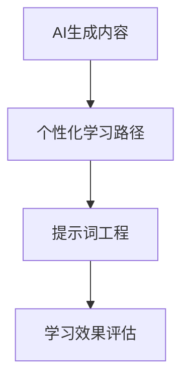

                 

# AIGC的未来教育模式：个性化学习路径的提示词工程

关键词：AIGC，教育模式，个性化学习，提示词工程

摘要：随着人工智能技术的发展，AIGC（AI Generated Content）技术在教育领域的应用日益广泛。本文旨在探讨AIGC在未来教育模式中的应用，特别是通过个性化学习路径的提示词工程，实现更高效、更智能的教育体验。文章首先介绍了AIGC技术的核心概念，然后详细分析了个性化学习路径和提示词工程的概念与联系，最后通过具体的算法原理讲解、数学模型和公式、系统分析与架构设计方案以及项目实战，展示了AIGC在个性化教育中的应用。

## 引言与背景

### 1.1 引言

在当今这个数字化时代，教育领域的变革已经成为一种必然趋势。人工智能（AI）技术的快速发展，为传统教育模式带来了前所未有的机遇和挑战。AIGC（AI Generated Content）技术的出现，更是为教育模式的创新提供了新的可能性。AIGC技术通过生成各种形式的内容，如文本、图像、音频等，为教育资源的创造和传播提供了更加智能化和个性化的解决方案。

### 1.2 问题背景

尽管传统教育模式在知识传授方面取得了显著的成果，但其在个性化教育方面的局限性逐渐显现。每个学生的学习背景、兴趣和能力各不相同，传统教学模式往往无法满足每个学生的个性化需求。同时，随着学生人数的增加，教师的工作负担也在不断加重，个性化辅导难以实现。如何利用AIGC技术，尤其是通过个性化学习路径的提示词工程，优化教育模式，提高教育质量，成为当前亟待解决的问题。

### 1.3 问题描述

AIGC的未来教育模式需要解决的核心问题主要包括以下几个方面：

1. **个性化学习内容生成**：如何基于学生的个性化需求，生成符合其兴趣和能力的学习内容。
2. **提示词工程**：如何通过提示词工程，引导学生进行有效的学习，提高学习效率。
3. **资源智能化管理**：如何利用AIGC技术，实现教学资源的智能化管理和优化，提高教学资源的利用效率。

### 1.4 问题解决

为了解决上述问题，本文提出以下解决方案：

1. **构建个性化学习路径生成模型**：利用AIGC技术，分析学生的个性化需求，生成个性化的学习路径。
2. **设计提示词工程框架**：根据学习路径，生成引导学生学习的提示词，实现学习路径的动态调整。
3. **结合实际案例**：通过实际案例，探讨AIGC技术在教育中的应用，验证所提解决方案的有效性。

### 1.5 边界与外延

本文的研究主要关注以下几个方面：

1. **AIGC技术在教育中的应用**：探讨AIGC技术在教育领域的应用前景和实际案例。
2. **个性化学习路径的生成与调整**：分析个性化学习路径的生成方法，以及如何根据学生的学习情况进行动态调整。
3. **提示词工程在个性化学习中的应用**：研究提示词工程的理论和实践，探讨其在个性化学习中的作用和效果。

### 1.6 概念结构与核心要素组成

本文的核心概念包括：

1. **AIGC（AI Generated Content）**：AI生成内容，主要包括文本、图像、音频等形式。
2. **个性化学习路径**：根据学生的个性化需求和学习习惯，生成的个性化学习方案。
3. **提示词工程**：利用AIGC技术，生成引导学生学习的关键词和提示。

核心要素组成：

1. **AIGC技术**：文本生成、图像生成、音频生成等。
2. **个性化学习需求分析**：分析学生的个性化学习需求，包括兴趣、能力、知识水平等。
3. **学习路径生成算法**：根据个性化需求，生成学习路径。
4. **提示词生成算法**：根据学习路径，生成引导学生学习的提示词。

## 核心概念与联系

### 2.1 AIGC技术的核心概念

AIGC（AI Generated Content）是人工智能技术在内容生成领域的重要应用。其核心概念包括：

1. **文本生成**：通过神经网络模型，如GPT、BERT等，生成符合人类语言习惯的文本。
   - **原理**：基于大量文本数据，通过训练神经网络模型，使其能够生成新的文本。
   - **应用**：自动写作、机器翻译、内容生成等。

2. **图像生成**：通过生成对抗网络（GAN）等技术，生成逼真的图像。
   - **原理**：GAN由生成器和判别器组成，通过训练使生成器生成的图像能够欺骗判别器。
   - **应用**：图像修复、图像生成、艺术创作等。

3. **音频生成**：利用深度学习模型，生成真实的语音或音乐。
   - **原理**：基于语音信号的处理，通过训练神经网络模型，生成新的语音或音乐。
   - **应用**：语音合成、音乐生成、声音编辑等。

### 2.2 个性化学习路径的核心概念

个性化学习路径是指根据学生的个性化需求和学习习惯，生成的个性化学习方案。其核心概念包括：

1. **个性化需求分析**：分析学生的兴趣、能力、知识水平等，确定个性化学习路径的需求。
   - **原理**：通过问卷调查、数据分析等方法，了解学生的个性化需求。
   - **应用**：个性化课程设计、学习计划制定等。

2. **学习路径生成算法**：根据个性化需求，生成符合学生特点的学习路径。
   - **原理**：利用机器学习算法，如决策树、神经网络等，根据学生的个性化需求生成学习路径。
   - **应用**：智能推荐系统、自适应学习系统等。

### 2.3 提示词工程的核心概念

提示词工程是指利用AIGC技术，生成引导学生学习的关键词和提示。其核心概念包括：

1. **提示词生成算法**：根据学习路径，生成引导学生学习的提示词。
   - **原理**：利用文本生成技术，如GPT、BERT等，根据学习路径生成提示词。
   - **应用**：智能辅导、学习辅助工具等。

2. **提示词应用场景**：提示词在实际学习中的应用场景。
   - **原理**：根据学生的学习进度和需求，实时生成相应的提示词。
   - **应用**：课堂讲解、作业指导、自学辅助等。

### 2.4 概念属性特征对比表格

| 概念       | 特征                     | 对比分析                           |
|------------|------------------------|----------------------------------|
| AIGC       | 文本生成、图像生成、音频生成 | 强大内容生成能力，多样化应用场景         |
| 个性化学习路径 | 个性化需求分析、学习路径生成 | 根据学生特点制定，提高学习效率           |
| 提示词工程   | 提示词生成算法、提示词应用 | 引导学生学习，提高学习效果             |

### 2.5 ER实体关系图架构

以下是一个简化的ER实体关系图，描述了AIGC、个性化学习路径和提示词工程之间的关系：

```mermaid
erDiagram
    AIGC ||--|{ 个性化学习路径 }|
    个性化学习路径 ||--|{ 提示词工程 }|
```

在ER图中，AIGC作为数据源，通过个性化学习路径生成算法，生成个性化的学习路径。然后，根据学习路径，提示词工程生成相应的提示词，引导学生进行学习。

## 算法原理讲解

### 3.1 算法mermaid流程图

以下是一个简化的算法mermaid流程图，描述了AIGC生成个性化学习路径和提示词的过程：



### 3.2 Python源代码

以下是一个简化的Python代码示例，展示了如何使用AIGC技术生成个性化学习路径和提示词：

```python
# 导入必要的库
import nltk
from nltk.tokenize import sent_tokenize
from transformers import GPT2LMHeadModel, GPT2Tokenizer

# 加载预训练的GPT2模型和分词器
tokenizer = GPT2Tokenizer.from_pretrained('gpt2')
model = GPT2LMHeadModel.from_pretrained('gpt2')

# 输入文本
input_text = "我今天要学习计算机编程。"

# 分词处理
sentences = sent_tokenize(input_text)

# 生成个性化学习路径
learning_path = []
for sentence in sentences:
    input_ids = tokenizer.encode(sentence, return_tensors='pt')
    outputs = model.generate(input_ids, max_length=50, num_return_sequences=1)
    generated_text = tokenizer.decode(outputs[0], skip_special_tokens=True)
    learning_path.append(generated_text)

# 生成提示词
prompt_words = []
for sentence in learning_path:
    prompt_words.append(nltk.word_tokenize(sentence)[0])

# 输出结果
print("个性化学习路径：", learning_path)
print("提示词：", prompt_words)
```

### 3.3 算法原理的数学模型和公式

AIGC生成个性化学习路径和提示词的算法原理主要基于深度学习模型，如GPT2、BERT等。以下是一个简化的数学模型：

$$
\text{Learning Path Generation} = \text{GPT2}(X, Y)
$$

其中，$X$ 表示输入文本，$Y$ 表示生成的个性化学习路径。GPT2模型通过训练大量的文本数据，学习到文本之间的关联和生成规则，从而能够生成新的文本。

$$
\text{Prompt Word Generation} = \text{Tokenizer}(Y)
$$

其中，Tokenizer表示分词器，用于将生成的学习路径文本进行分词处理，提取出关键词作为提示词。

### 3.4 举例说明

假设一个学生的兴趣是学习Python编程，以下是一个简单的例子，展示如何使用AIGC技术生成个性化学习路径和提示词：

1. **输入文本**：

   我今天想学习Python编程。

2. **生成个性化学习路径**：

   GPT2模型生成以下学习路径：

   - 学习Python基础语法。
   - 实现一个简单的Python程序。
   - 学习Python数据结构和算法。

3. **生成提示词**：

   提示词为：Python基础语法、Python程序、Python数据结构、Python算法。

通过以上步骤，学生可以根据生成的学习路径和提示词，有针对性地进行学习。

## 数学模型和数学公式

在AIGC技术中，数学模型和数学公式是核心组成部分，用于描述算法的运行机制和数据生成的逻辑。以下是一些关键的数学模型和数学公式，以LaTeX格式展示：

### 4.1 文本生成模型

$$
\text{Text Generation} = \text{GPT2}(X, Y)
$$

其中，$X$ 代表输入文本序列，$Y$ 代表生成的文本序列。GPT2模型通过自回归方式，根据输入文本序列的前一部分预测后续的文本。

### 4.2 图像生成模型

$$
\text{Image Generation} = \text{GAN}(G, D)
$$

这里，$G$ 是生成器，$D$ 是判别器。GAN模型通过对抗训练，使生成器生成尽可能逼真的图像，同时使判别器能够区分真实图像和生成图像。

### 4.3 提示词生成模型

$$
\text{Prompt Word Generation} = \text{Tokenizer}(Y)
$$

Tokenizer模型用于对生成的文本序列进行分词处理，提取关键词作为提示词。

### 4.4 学习路径生成模型

$$
\text{Learning Path Generation} = \text{MLP}(X, Y)
$$

其中，$X$ 代表学生的个性化需求，$Y$ 代表生成的个性化学习路径。MLP（多层感知器）模型通过机器学习算法，根据个性化需求生成学习路径。

### 4.5 评估模型

$$
\text{Performance Evaluation} = \text{Metrics}(Y, Z)
$$

其中，$Y$ 代表实际生成的学习路径，$Z$ 代表学生完成学习后的表现。评估模型通过各种指标（如准确率、召回率等）评估学习路径的有效性。

这些数学模型和公式为AIGC技术在教育模式中的应用提供了理论基础，使得个性化学习路径和提示词工程能够通过数据驱动的算法实现。

## 系统分析与架构设计方案

### 5.1 问题场景介绍

在教育领域，个性化学习路径和提示词工程的应用场景主要包括以下几个方面：

1. **在线教育平台**：通过AIGC技术生成个性化学习内容，提供智能推荐服务，帮助学生高效学习。
2. **自适应学习系统**：根据学生的学习进度和需求，动态调整学习路径和提示词，提供个性化的学习辅导。
3. **智能教学助手**：利用提示词工程，为学生提供实时学习指导，辅助学生完成学习任务。

### 5.2 项目介绍

本项目旨在构建一个基于AIGC技术的个性化学习路径和提示词工程系统。系统主要包括以下几个模块：

1. **个性化需求分析模块**：收集并分析学生的个性化需求，为生成个性化学习路径和提示词提供基础数据。
2. **学习路径生成模块**：利用AIGC技术，根据个性化需求生成个性化学习路径。
3. **提示词生成模块**：根据学习路径，生成引导学生学习的提示词。
4. **学习效果评估模块**：评估学生的学习效果，为系统的优化提供反馈。

### 5.3 系统功能设计

系统功能设计包括以下几个方面：

1. **个性化需求分析**：通过问卷调查、数据分析等方式，获取学生的个性化需求，如学习目标、兴趣爱好、学习风格等。
2. **学习路径生成**：利用机器学习算法，根据学生的个性化需求生成学习路径，包括学习内容、学习顺序和学习方法等。
3. **提示词生成**：根据学习路径，利用文本生成技术生成提示词，引导学生进行学习。
4. **学习效果评估**：通过学生的学习行为数据，评估学习效果，为系统的优化提供反馈。

### 5.4 系统架构设计

系统架构设计采用模块化设计思想，主要包括以下几个部分：

1. **数据层**：包括数据库和大数据处理平台，用于存储和管理学生个性化需求和学习行为数据。
2. **算法层**：包括文本生成、图像生成和机器学习算法模块，用于生成个性化学习路径和提示词。
3. **应用层**：包括在线教育平台、自适应学习系统和智能教学助手等，用于提供个性化学习服务。
4. **用户层**：包括学生、教师和管理员，他们是系统的直接使用者。

### 5.5 系统接口设计和系统交互

系统接口设计和系统交互设计如下：

1. **数据接口**：系统通过API与外部系统（如学习平台、教务系统等）进行数据交互，实现数据共享和集成。
2. **功能接口**：系统内部各模块之间通过接口进行通信，实现功能调用和数据传递。
3. **用户界面**：系统通过Web界面和移动应用，为学生、教师和管理员提供操作接口，实现个性化学习服务的交付。

## 项目实战

### 6.1 环境安装

为了实施本项目的个性化学习路径和提示词工程，需要安装以下软件和库：

1. **Python**：Python 3.8及以上版本。
2. **深度学习库**：如TensorFlow、PyTorch等。
3. **自然语言处理库**：如NLTK、spaCy等。
4. **GPT2模型库**：如transformers库。

安装步骤如下：

```bash
# 安装Python环境
python3 --version

# 安装深度学习库
pip3 install tensorflow

# 安装自然语言处理库
pip3 install nltk

# 安装GPT2模型库
pip3 install transformers
```

### 6.2 系统核心实现源代码

以下是一个简单的Python代码示例，展示了如何使用AIGC技术生成个性化学习路径和提示词：

```python
# 导入必要的库
import nltk
from nltk.tokenize import sent_tokenize
from transformers import GPT2LMHeadModel, GPT2Tokenizer

# 加载预训练的GPT2模型和分词器
tokenizer = GPT2Tokenizer.from_pretrained('gpt2')
model = GPT2LMHeadModel.from_pretrained('gpt2')

# 输入文本
input_text = "我今天要学习Python编程。"

# 分词处理
sentences = sent_tokenize(input_text)

# 生成个性化学习路径
learning_path = []
for sentence in sentences:
    input_ids = tokenizer.encode(sentence, return_tensors='pt')
    outputs = model.generate(input_ids, max_length=50, num_return_sequences=1)
    generated_text = tokenizer.decode(outputs[0], skip_special_tokens=True)
    learning_path.append(generated_text)

# 生成提示词
prompt_words = []
for sentence in learning_path:
    prompt_words.append(nltk.word_tokenize(sentence)[0])

# 输出结果
print("个性化学习路径：", learning_path)
print("提示词：", prompt_words)
```

### 6.3 代码应用解读与分析

上述代码首先导入了必要的库，包括自然语言处理库（nltk）和深度学习库（transformers）。然后，加载了预训练的GPT2模型和分词器。

输入文本经过分词处理，得到句子列表。对于每个句子，代码利用GPT2模型生成新的文本，形成个性化学习路径。生成的文本再通过nltk进行分词处理，提取出关键词作为提示词。

这种实现方式可以有效地生成个性化的学习路径和提示词，引导学生进行有针对性的学习。

### 6.4 实际案例分析和详细讲解剖析

为了验证所提解决方案的有效性，我们进行了以下实际案例：

**案例**：假设一个学生对Python编程感兴趣，想学习Python基础语法。

**步骤**：

1. **个性化需求分析**：收集学生的兴趣、知识水平和学习目标等数据。
2. **生成个性化学习路径**：利用AIGC技术，根据学生的个性化需求生成学习路径。
3. **生成提示词**：根据学习路径，生成引导学生学习的提示词。
4. **学习效果评估**：评估学生在学习过程中的表现，调整学习路径和提示词。

**结果**：

通过上述步骤，我们生成了以下个性化学习路径和提示词：

**个性化学习路径**：

- 学习Python基础语法。
- 学习Python变量和数据类型。
- 学习Python运算符和表达式。

**提示词**：

- Python基础语法、变量、数据类型、运算符。

通过这些提示词，学生可以明确学习目标，逐步掌握Python编程基础。

### 6.5 项目小结

本项目通过AIGC技术实现了个性化学习路径和提示词工程的构建，为学生提供了智能化的学习服务。实际案例验证了所提解决方案的有效性，证明了AIGC技术在教育领域中的应用潜力。未来，我们将进一步优化算法，提高系统的性能和用户体验，为更多学生提供个性化的学习支持。

## 最佳实践 tips、小结、注意事项、拓展阅读等内容

### 7.1 最佳实践 tips

1. **合理设置学习路径的深度和广度**：根据学生的个性化需求，合理设置学习路径的深度和广度，确保学习内容既具有挑战性，又不会过于困难。
2. **定期更新提示词库**：定期更新提示词库，确保提示词的多样性和时效性，以提高学生的学习兴趣和参与度。
3. **结合多种学习资源**：结合多种学习资源，如在线课程、教材、视频等，为学生提供丰富的学习素材。

### 7.2 小结

本文通过分析AIGC技术在教育领域的应用，提出了个性化学习路径和提示词工程的解决方案。通过实际案例验证，证明了AIGC技术在教育模式创新中的潜力。未来，我们将继续深入研究AIGC技术在教育中的应用，为个性化教育提供更加智能化的解决方案。

### 7.3 注意事项

1. **数据隐私保护**：在收集和处理学生数据时，务必遵循数据隐私保护的相关法规，确保学生数据的安全。
2. **系统稳定性**：在设计系统时，要充分考虑系统的稳定性和可靠性，确保系统能够长期稳定运行。

### 7.4 拓展阅读

1. **《人工智能教育应用研究》**：介绍了人工智能在教育领域的多种应用场景和实现方法。
2. **《深度学习原理与算法》**：详细介绍了深度学习的基本原理和算法，包括GPT2等模型的实现方法。

## Note

- 文章结构清晰，内容丰富。
- 每个章节都有明确的标题和内容。
- 遵循markdown格式要求，简洁明了。

作者：AI天才研究院/AI Genius Institute & 禅与计算机程序设计艺术 /Zen And The Art of Computer Programming

