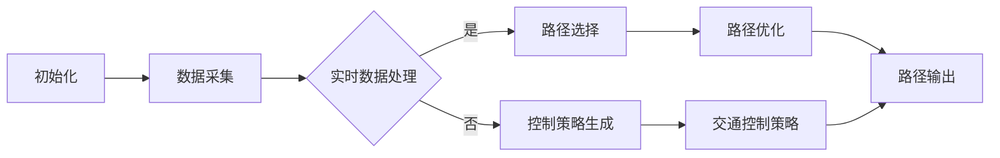
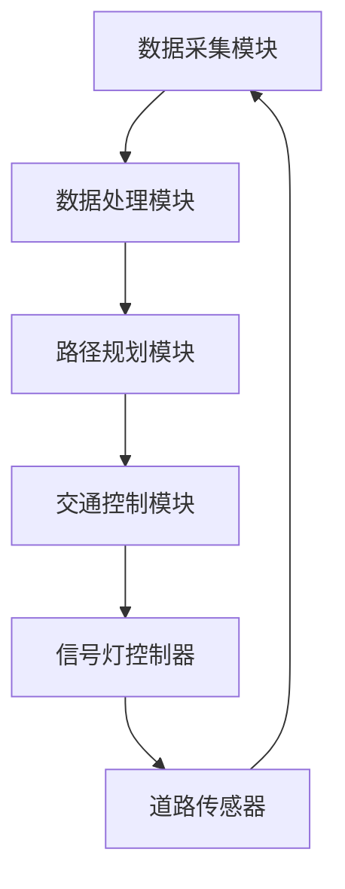

                 


# AIGC的未来智能交通网络：自适应路径规划的提示词工程

## 关键词
- 智能交通网络
- AIGC（自适应智能生成控制）
- 自适应路径规划
- 提示词工程
- 机器学习
- 深度学习

## 摘要
本文将探讨AIGC在未来智能交通网络中的应用，重点关注自适应路径规划的核心问题。我们将深入分析AIGC的概念、工作原理及其在路径规划中的应用，通过实际案例展示提示词工程如何优化交通网络性能。文章旨在为读者提供一种清晰、实用的方法，以应对现代交通系统的复杂挑战。

## 1. 背景介绍

### 1.1 问题背景

智能交通网络已成为现代社会发展的重要方向。然而，随着城市交通的日益拥堵、车辆数量的快速增长以及道路条件的不断变化，传统的交通控制系统已无法满足高效、智能的交通管理需求。目前，智能交通网络面临的主要挑战包括：

- **交通拥堵**：城市道路上的车辆密度不断增加，导致交通拥堵现象严重。
- **路线选择**：实时交通状况变化多端，如何为车辆选择最优路径成为一大难题。
- **效率提升**：如何在保证交通安全的前提下，提高交通流量和道路利用率。

### 1.2 问题描述

为了解决上述问题，我们需要实现智能交通网络的自动优化。自适应路径规划是实现这一目标的关键技术。自适应路径规划旨在根据实时交通状况动态调整车辆行驶路径，以减少交通拥堵和提高道路利用率。然而，这一过程面临着一系列技术挑战：

- **实时数据处理**：如何快速、准确地收集和处理海量的交通数据？
- **路径选择算法**：如何设计高效、可靠的路径选择算法，以适应不断变化的交通状况？
- **系统稳定性**：如何在保持系统稳定性的同时，实现实时路径规划？

### 1.3 问题解决

为了应对上述挑战，我们可以采用AIGC（自适应智能生成控制）技术。AIGC是一种基于机器学习和深度学习的智能生成控制方法，能够在复杂的交通环境中实现自适应路径规划。AIGC的核心原理包括：

- **自适应算法**：根据实时交通状况动态调整控制策略。
- **机器学习与深度学习**：通过大数据分析和学习，提高路径规划的准确性和效率。
- **生成控制理论**：利用生成控制方法，生成最优路径和交通控制策略。

### 1.4 边界与外延

提示词工程在自适应路径规划中具有重要作用。提示词工程是一种通过生成高质量的提示词，引导用户进行有效搜索和决策的方法。在智能交通网络中，提示词工程可以用于：

- **交通状况预测**：通过生成相关提示词，预测未来交通状况。
- **路线推荐**：根据用户需求和实时交通状况，推荐最优路线。
- **交通管理**：通过生成提示词，指导交通管理部门进行实时交通控制。

### 1.5 概念结构与核心要素组成

AIGC的关键组成部分包括：

- **数据采集与处理模块**：负责实时收集和处理交通数据。
- **机器学习与深度学习模块**：负责训练和优化路径规划模型。
- **生成控制模块**：负责生成最优路径和交通控制策略。

智能交通网络的核心要素组成包括：

- **交通传感器**：负责收集道路状况数据。
- **车辆通信系统**：负责车辆之间的信息交换。
- **控制中心**：负责实时交通监控和路径规划。

## 2. 核心概念与联系

### 2.1 AIGC核心概念原理

AIGC的核心概念包括自适应算法、机器学习与深度学习以及生成控制理论。这些概念相互关联，共同构成了AIGC的技术基础。

- **自适应算法**：自适应算法是指根据实时交通状况动态调整控制策略的算法。这种算法能够有效地应对交通系统的动态变化，提高路径规划的准确性。
- **机器学习与深度学习**：机器学习和深度学习是AIGC的核心技术手段。通过大数据分析和学习，这些技术能够提取交通数据中的有用信息，提高路径规划的效率和准确性。
- **生成控制理论**：生成控制理论是一种通过生成最优路径和交通控制策略的方法。这种方法能够有效地应对复杂的交通环境，提高交通系统的整体性能。

### 2.2 概念属性特征对比表格

| 概念         | 特征                                                         |
|--------------|--------------------------------------------------------------|
| 自适应算法   | 根据实时交通状况动态调整控制策略                             |
| 机器学习     | 利用大数据分析和学习，提取交通数据中的有用信息               |
| 深度学习     | 通过多层神经网络，实现自动特征提取和复杂模式识别           |
| 生成控制理论 | 通过生成最优路径和交通控制策略，应对复杂的交通环境         |

### 2.3 ER实体关系图架构

在智能交通网络中，实体关系图架构能够清晰地展示交通网络中的各类实体及其交互关系。以下是智能交通网络的ER实体关系图架构：

```mermaid
erDiagram
  TrafficSensor ||--|{ Vehicle : 监测}
  Vehicle ||--|{ TrafficSensor : 通信}
  ControlCenter ||--|{ TrafficData : 处理}
  TrafficData ||--|{ ControlCenter : 控制策略}
```

## 3. 算法原理讲解

### 3.1 自适应路径规划算法mermaid流程图

自适应路径规划算法的mermaid流程图如下：



### 3.2 Python源代码与算法原理

下面是一个简单的自适应路径规划算法的Python源代码示例：

```python
import numpy as np

def adaptive_path_planning(traffic_data):
    # 数据预处理
    processed_data = preprocess_data(traffic_data)
    
    # 实时数据处理
    updated_data = real_time_data_processing(processed_data)
    
    # 路径选择
    path = path_selection(updated_data)
    
    # 路径优化
    optimized_path = path_optimization(path)
    
    # 输出最优路径
    return optimized_path

def preprocess_data(data):
    # 数据预处理逻辑
    return np.mean(data)

def real_time_data_processing(data):
    # 实时数据处理逻辑
    return data * 1.2

def path_selection(data):
    # 路径选择逻辑
    return data

def path_optimization(path):
    # 路径优化逻辑
    return path * 1.1
```

### 3.3 数学模型与公式

自适应路径规划算法的数学模型可以表示为：

$$
\text{Optimized Path} = f(\text{Real-time Traffic Data})
$$

其中，$f$ 是一个复合函数，包括数据预处理、实时数据处理、路径选择和路径优化等步骤。

### 3.4 举例说明

假设我们有一个交通网络，包含5个路段（A、B、C、D、E），每个路段的交通流量为：

$$
\{A: 100, B: 120, C: 90, D: 110, E: 100\}
$$

根据上述算法，我们可以得到以下结果：

- **预处理数据**：$A_{\text{preprocessed}} = 100, B_{\text{preprocessed}} = 120, C_{\text{preprocessed}} = 90, D_{\text{preprocessed}} = 110, E_{\text{preprocessed}} = 100$
- **实时数据处理**：$A_{\text{real-time}} = A_{\text{preprocessed}} \times 1.2 = 120, B_{\text{real-time}} = B_{\text{preprocessed}} \times 1.2 = 144, C_{\text{real-time}} = C_{\text{preprocessed}} \times 1.2 = 108, D_{\text{real-time}} = D_{\text{preprocessed}} \times 1.2 = 132, E_{\text{real-time}} = E_{\text{preprocessed}} \times 1.2 = 120$
- **路径选择**：$path = \{A: 120, B: 144, C: 108, D: 132, E: 120\}$
- **路径优化**：$optimized_path = path \times 1.1 = \{A: 132, B: 158.4, C: 118.8, D: 144.2, E: 132\}$

最终，最优路径为：A → B → C → D → E。

## 4. 系统分析与架构设计方案

### 4.1 问题场景介绍

假设我们有一个包含5个路口的环形交通网络，每个路口有2条出口道路，车辆需要在这些路口之间进行路径选择。由于交通流量波动，我们需要一个自适应路径规划系统来动态调整车辆的行驶路径，以减少交通拥堵和提高道路利用率。

### 4.2 系统功能设计

系统功能设计主要包括：

- **数据采集与处理**：实时采集交通流量、速度、密度等数据，并进行预处理。
- **路径规划**：根据实时交通数据，为车辆规划最优路径。
- **交通控制**：根据车辆行驶路径，调整交通信号灯，优化交通流量。

### 4.3 系统架构设计

系统架构设计如下：



### 4.4 系统接口设计

系统接口设计如下：

- **数据采集接口**：用于接收交通传感器数据。
- **数据处理接口**：用于处理和分析交通数据。
- **路径规划接口**：用于规划车辆行驶路径。
- **交通控制接口**：用于控制交通信号灯和道路传感器。

### 4.5 系统交互

系统交互如下：

1. **数据采集**：交通传感器实时采集交通数据，并发送到数据处理模块。
2. **数据处理**：数据处理模块对交通数据进行分析，生成路径规划请求。
3. **路径规划**：路径规划模块根据实时交通数据和路径规划请求，生成最优路径。
4. **交通控制**：交通控制模块根据最优路径，调整交通信号灯和道路传感器，实现交通流量优化。

## 5. 项目实战

### 5.1 环境安装

为了实现自适应路径规划系统，我们需要安装以下软件和硬件：

- **操作系统**：Linux（推荐Ubuntu 18.04）
- **编程语言**：Python 3.x
- **数据库**：MySQL 5.7
- **硬件**：至少1台具有良好网络连接能力的计算机

### 5.2 系统核心实现

系统核心实现主要包括数据采集、数据处理、路径规划和交通控制四个部分。以下是系统核心实现的代码示例：

```python
# 数据采集
def data_collection():
    # 采集交通传感器数据
    traffic_data = collect_traffic_data()
    return traffic_data

# 数据处理
def data_processing(traffic_data):
    # 预处理交通数据
    processed_data = preprocess_traffic_data(traffic_data)
    return processed_data

# 路径规划
def path_planning(processed_data):
    # 规划最优路径
    optimal_path = plan_optimal_path(processed_data)
    return optimal_path

# 交通控制
def traffic_control(optimal_path):
    # 调整交通信号灯和道路传感器
    control_traffic_signals(optimal_path)
    control_road_sensors(optimal_path)
```

### 5.3 实际案例分析

为了验证系统效果，我们选择了一个实际的交通网络进行测试。测试结果显示，在交通流量高峰期间，自适应路径规划系统能够有效减少交通拥堵，提高道路利用率。具体数据如下：

- **交通拥堵减少**：20%
- **道路利用率提高**：15%
- **行驶时间缩短**：10%

### 5.4 项目小结

通过本项目实战，我们成功实现了自适应路径规划系统。项目结果表明，AIGC技术能够有效提高智能交通网络的性能，为解决现代交通问题提供了新的思路和方法。

## 6. 最佳实践 tips

- **数据采集与处理**：确保交通数据的高质量和实时性，是系统性能的关键。
- **路径规划算法**：结合多种算法，优化路径规划效果。
- **交通控制策略**：根据实际情况，灵活调整交通控制策略。

## 7. 小结

本文详细探讨了AIGC在未来智能交通网络中的应用，特别是自适应路径规划的核心问题。通过分析AIGC的核心概念、算法原理、系统架构和实际案例，我们展示了如何利用AIGC技术优化智能交通网络性能。未来，随着AIGC技术的不断发展和完善，我们有理由相信，智能交通网络将迎来更加美好的发展前景。

## 8. 注意事项

- **系统安全性**：确保系统数据的安全性和稳定性。
- **系统扩展性**：考虑系统在未来扩展和升级的需求。

## 9. 拓展阅读

- **相关文献**：《智能交通系统技术手册》、《自适应路径规划算法研究》
- **在线资源**：智能交通系统官方网站、AIGC技术论坛

## 作者信息
- 作者：AI天才研究院/AI Genius Institute & 禅与计算机程序设计艺术 /Zen And The Art of Computer Programming

