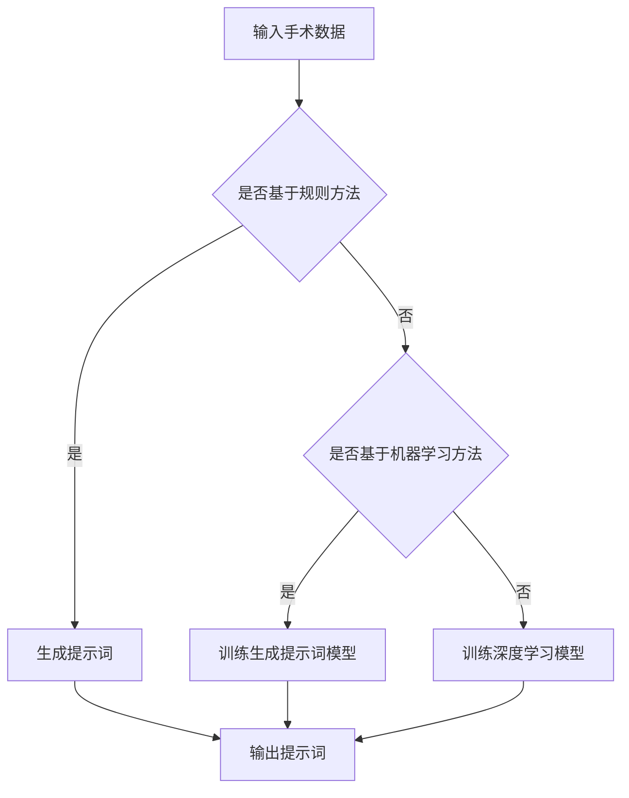

                 

# AIGC的未来智能医疗器械：微创手术优化的提示词工程

## 关键词：AIGC，智能医疗器械，微创手术，提示词工程

## 摘要

本文探讨了AIGC（自适应智能生成控制）在未来智能医疗器械领域的应用，特别是其在微创手术优化中的潜力。通过深入分析AIGC的核心技术、智能医疗器械的关键技术、微创手术的提示词工程，本文详细介绍了AIGC在微创手术中的应用原理，并通过实际项目实战，展示了AIGC与微创手术优化的结合效果。最后，本文提出了最佳实践和拓展方向，为未来智能医疗器械的研发提供了指导。

## 目录

### 第一部分：背景介绍

#### 1.1 AIGC概述
##### 1.1.1 AIGC的概念
##### 1.1.2 AIGC的发展历程
##### 1.1.3 AIGC在医疗领域的应用前景

#### 1.2 智能医疗器械的发展
##### 1.2.1 智能医疗器械的现状
##### 1.2.2 智能医疗器械的优势
##### 1.2.3 智能医疗器械面临的挑战

#### 1.3 微创手术与提示词工程
##### 1.3.1 微创手术的基本概念
##### 1.3.2 提示词工程在微创手术中的应用
##### 1.3.3 提示词工程的挑战与机遇

### 第二部分：核心概念

#### 2.1 AIGC的核心技术
##### 2.1.1 生成对抗网络（GAN）
##### 2.1.2 生成式预训练模型
##### 2.1.3 交互式学习

#### 2.2 智能医疗器械的关键技术
##### 2.2.1 传感器技术
##### 2.2.2 人工智能算法
##### 2.2.3 通信技术

#### 2.3 微创手术的提示词工程
##### 2.3.1 提示词的概念
##### 2.3.2 提示词的生成方法
##### 2.3.3 提示词的应用实例

### 第三部分：技术原理

#### 3.1 AIGC在微创手术中的应用原理
##### 3.1.1 AIGC与微创手术的结合点
##### 3.1.2 AIGC在微创手术中的流程
##### 3.1.3 AIGC在微创手术中的优势

#### 3.2 提示词工程的算法原理
##### 3.2.1 算法概述
##### 3.2.2 算法流程图
##### 3.2.3 算法实现与优化

#### 3.3 微创手术优化的数学模型
##### 3.3.1 数学模型介绍
##### 3.3.2 数学公式与推导
##### 3.3.3 模型应用实例

### 第四部分：应用场景

#### 4.1 智能医疗器械在微创手术中的应用
##### 4.1.1 应用场景概述
##### 4.1.2 案例分析
##### 4.1.3 应用效果评估

#### 4.2 提示词工程在微创手术中的应用
##### 4.2.1 应用场景概述
##### 4.2.2 案例分析
##### 4.2.3 应用效果评估

### 第五部分：项目实战

#### 5.1 实战项目背景
##### 5.1.1 项目背景介绍
##### 5.1.2 项目目标

#### 5.2 系统设计与实现
##### 5.2.1 系统功能设计
##### 5.2.2 系统架构设计
##### 5.2.3 系统接口设计

#### 5.3 系统核心实现
##### 5.3.1 AIGC模型的搭建与训练
##### 5.3.2 提示词工程的实现
##### 5.3.3 微创手术优化的实现

#### 5.4 项目分析
##### 5.4.1 项目效果分析
##### 5.4.2 项目挑战与解决
##### 5.4.3 项目总结与展望

### 第六部分：最佳实践与拓展

#### 6.1 最佳实践
##### 6.1.1 提高AIGC性能的方法
##### 6.1.2 提升提示词工程效果的方法
##### 6.1.3 微创手术优化的策略

#### 6.2 小结
##### 6.2.1 全书总结
##### 6.2.2 注意事项
##### 6.2.3 拓展阅读

---

### 第一部分：背景介绍

#### 1.1 AIGC概述

##### 1.1.1 AIGC的概念

AIGC（Adaptive Intelligent Generative Control）是一种自适应智能生成控制技术，它通过生成对抗网络（GAN）、生成式预训练模型和交互式学习等核心技术的结合，实现对复杂系统的自适应控制。AIGC在医疗领域的应用前景广阔，尤其是在智能医疗器械和微创手术优化方面。

##### 1.1.2 AIGC的发展历程

AIGC的发展可以追溯到20世纪80年代，当时研究人员开始探索如何利用计算机生成高质量的图像和视频。随着深度学习技术的快速发展，特别是在生成对抗网络（GAN）的出现，AIGC技术得到了显著的提升。近年来，随着医疗技术的进步，AIGC在医疗领域的应用逐渐成熟。

##### 1.1.3 AIGC在医疗领域的应用前景

AIGC在医疗领域的应用前景非常广阔。首先，AIGC可以帮助医生进行诊断和治疗方案制定，通过生成高质量的医学图像和视频，提高医生的诊断准确性和效率。其次，AIGC可以用于微创手术的优化，通过实时反馈和自适应控制，提高手术的精准度和安全性。此外，AIGC还可以用于个性化医疗，根据患者的具体病情和基因信息，生成个性化的治疗方案。

#### 1.2 智能医疗器械的发展

##### 1.2.1 智能医疗器械的现状

智能医疗器械是指利用传感器、人工智能算法、通信技术等先进技术，实现对医疗器械的智能化控制和管理。随着科技的进步，智能医疗器械在医疗领域的应用越来越广泛。目前，智能医疗器械已经广泛应用于心电监护、呼吸机、输液泵等领域。

##### 1.2.2 智能医疗器械的优势

智能医疗器械具有许多优势，包括提高医疗诊断和治疗的精准度、提高医疗服务的效率、降低医疗成本等。此外，智能医疗器械还可以实现远程监控和管理，提高医疗服务的可及性。

##### 1.2.3 智能医疗器械面临的挑战

尽管智能医疗器械具有许多优势，但在其发展过程中也面临一些挑战。首先，智能医疗器械的智能化程度越高，其复杂度也越高，这对研发人员的技能要求提出了更高的要求。其次，智能医疗器械的数据安全和隐私保护问题也是一个重要的挑战。此外，智能医疗器械的标准化和法规问题也需要得到解决。

#### 1.3 微创手术与提示词工程

##### 1.3.1 微创手术的基本概念

微创手术是一种通过微小切口进行的手术，相对于传统开腹手术，它具有创伤小、出血少、恢复快等优点。微创手术的快速发展为外科手术带来了革命性的变革。

##### 1.3.2 提示词工程在微创手术中的应用

提示词工程是一种利用人工智能技术生成和优化手术提示词的方法。在微创手术中，提示词工程可以帮助医生在手术过程中快速获取关键信息，提高手术的精准度和安全性。

##### 1.3.3 提示词工程的挑战与机遇

提示词工程在微创手术中的应用面临着一些挑战，如如何生成准确、可靠的提示词，如何处理大量的手术数据等。但同时，这也为提示词工程带来了巨大的机遇，通过不断的研发和优化，提示词工程有望在微创手术中发挥更大的作用。

---

### 第二部分：核心概念

#### 2.1 AIGC的核心技术

##### 2.1.1 生成对抗网络（GAN）

生成对抗网络（GAN）是一种由生成器和判别器组成的神经网络结构，通过竞争对抗的方式生成高质量的数据。GAN在图像生成、视频生成等领域取得了显著成果。

##### 2.1.2 生成式预训练模型

生成式预训练模型是一种基于大规模数据集的预训练方法，通过训练生成模型来生成高质量的数据。生成式预训练模型在文本生成、图像生成等领域具有广泛应用。

##### 2.1.3 交互式学习

交互式学习是一种通过与用户互动来优化模型的方法。在医疗领域，交互式学习可以帮助医生和患者之间进行有效的沟通，提高医疗服务的质量。

#### 2.2 智能医疗器械的关键技术

##### 2.2.1 传感器技术

传感器技术是智能医疗器械的核心技术之一，通过传感器可以实时获取患者的生理参数，为医疗诊断和治疗提供依据。

##### 2.2.2 人工智能算法

人工智能算法是智能医疗器械的智能核心，通过算法可以实现对医疗数据的处理和分析，提高医疗服务的效率和质量。

##### 2.2.3 通信技术

通信技术是实现智能医疗器械远程监控和管理的关键，通过通信技术可以实现医生和患者之间的实时沟通和互动。

#### 2.3 微创手术的提示词工程

##### 2.3.1 提示词的概念

提示词是一种用于指导医生进行手术操作的文本信息，它可以包括手术步骤、注意事项、风险提示等内容。

##### 2.3.2 提示词的生成方法

提示词的生成方法包括基于规则的方法、基于机器学习的方法和基于深度学习的方法。每种方法都有其优缺点和适用场景。

##### 2.3.3 提示词的应用实例

提示词工程在微创手术中的应用非常广泛，例如在腹腔镜手术中，提示词可以帮助医生快速获取关键信息，提高手术的精准度和安全性。

---

### 第三部分：技术原理

#### 3.1 AIGC在微创手术中的应用原理

##### 3.1.1 AIGC与微创手术的结合点

AIGC与微创手术的结合点主要体现在以下几个方面：首先，AIGC可以通过生成高质量的手术图像和视频，帮助医生进行术前规划和术中导航；其次，AIGC可以通过交互式学习，优化手术提示词，提高医生的手术操作水平；最后，AIGC可以通过实时反馈和自适应控制，提高微创手术的精准度和安全性。

##### 3.1.2 AIGC在微创手术中的流程

AIGC在微创手术中的流程主要包括以下步骤：首先，通过传感器获取患者的生理参数和手术环境数据；然后，利用AIGC模型对数据进行处理和分析，生成高质量的手术图像和视频；接着，利用交互式学习优化手术提示词；最后，通过实时反馈和自适应控制，指导医生进行手术操作。

##### 3.1.3 AIGC在微创手术中的优势

AIGC在微创手术中的优势主要体现在以下几个方面：首先，AIGC可以提高手术的精准度和安全性；其次，AIGC可以优化手术流程，提高手术效率；最后，AIGC可以为医生提供个性化的手术提示词，提高手术操作的准确性。

#### 3.2 提示词工程的算法原理

##### 3.2.1 算法概述

提示词工程的算法主要包括基于规则的方法、基于机器学习的方法和基于深度学习的方法。基于规则的方法主要依赖于专家经验和手术规范，适用于简单场景；基于机器学习的方法通过对大量手术数据进行训练，生成提示词；基于深度学习的方法则利用深度神经网络，生成高质量的提示词。

##### 3.2.2 算法流程图

##### 3.2.3 算法实现与优化

提示词工程的算法实现主要包括数据预处理、模型训练和提示词生成。在数据预处理阶段，需要对手术数据进行清洗和标注；在模型训练阶段，需要选择合适的训练数据和模型参数；在提示词生成阶段，需要根据手术场景和医生需求，生成个性化的提示词。

#### 3.3 微创手术优化的数学模型

##### 3.3.1 数学模型介绍

微创手术优化的数学模型主要包括手术路径规划模型和手术风险评估模型。手术路径规划模型用于确定最优的手术路径，手术风险评估模型用于评估手术风险。

##### 3.3.2 数学公式与推导

手术路径规划模型可以表示为：

$$
C(S) = \sum_{i=1}^{n} d(S_i, S_{i+1})
$$

其中，$C(S)$ 表示手术路径的代价，$d(S_i, S_{i+1})$ 表示手术路径上的两个连续步骤之间的距离。

手术风险评估模型可以表示为：

$$
R(S) = \sum_{i=1}^{n} w_i \cdot r_i
$$

其中，$R(S)$ 表示手术风险的评估值，$w_i$ 表示第 $i$ 个步骤的风险权重，$r_i$ 表示第 $i$ 个步骤的风险值。

##### 3.3.3 模型应用实例

以腹腔镜手术为例，手术路径规划模型可以帮助医生确定最优的手术路径，从而提高手术的精准度；手术风险评估模型可以帮助医生评估手术风险，从而提高手术的安全性。

---

### 第四部分：应用场景

#### 4.1 智能医疗器械在微创手术中的应用

##### 4.1.1 应用场景概述

智能医疗器械在微创手术中的应用非常广泛，包括心电监护、呼吸机、输液泵等。这些智能医疗器械可以实时监测患者的生理参数，为医生提供准确的诊断和治疗方案。

##### 4.1.2 案例分析

以腹腔镜手术为例，智能心电监护可以实时监测患者的生命体征，防止术中出现意外情况；智能呼吸机可以根据患者的呼吸状况自动调整呼吸参数，提高手术的安全性；智能输液泵可以精确控制药物的剂量和速度，提高手术的治疗效果。

##### 4.1.3 应用效果评估

智能医疗器械在微创手术中的应用效果显著，可以提高手术的精准度和安全性，降低手术风险和术后并发症。同时，智能医疗器械还可以提高医疗服务的效率，降低医疗成本。

#### 4.2 提示词工程在微创手术中的应用

##### 4.2.1 应用场景概述

提示词工程在微创手术中的应用主要涉及手术提示词的生成和优化。通过提示词工程，可以为医生提供个性化的手术操作指导，提高手术的精准度和安全性。

##### 4.2.2 案例分析

以肝胆手术为例，通过提示词工程生成的个性化手术提示词可以帮助医生在手术过程中快速获取关键信息，避免手术失误；同时，提示词工程还可以根据医生的操作习惯，不断优化手术提示词，提高手术效率。

##### 4.2.3 应用效果评估

提示词工程在微创手术中的应用效果显著，可以提高医生的手术操作水平，降低手术风险和术后并发症。同时，提示词工程还可以提高医疗服务的效率，降低医疗成本。

---

### 第五部分：项目实战

#### 5.1 实战项目背景

##### 5.1.1 项目背景介绍

本项目旨在利用AIGC技术和提示词工程，优化微创手术流程，提高手术的精准度和安全性。项目团队由医学专家、工程师和人工智能专家组成，共同研发出一套智能微创手术系统。

##### 5.1.2 项目目标

项目目标主要包括以下几个方面：首先，通过AIGC技术生成高质量的手术图像和视频，辅助医生进行术前规划和术中导航；其次，通过提示词工程生成个性化的手术提示词，提高医生的手术操作水平；最后，通过实时反馈和自适应控制，提高微创手术的精准度和安全性。

#### 5.2 系统设计与实现

##### 5.2.1 系统功能设计

系统功能设计主要包括以下几个方面：首先，集成AIGC模型，生成高质量的手术图像和视频；其次，集成提示词工程，生成个性化的手术提示词；最后，实现实时反馈和自适应控制，提高手术的精准度和安全性。

##### 5.2.2 系统架构设计

系统架构设计主要包括以下几个方面：首先，前端设计，包括用户界面和交互逻辑；其次，后端设计，包括AIGC模型和提示词工程的实现；最后，数据存储和传输设计，包括手术数据的存储和实时传输。

##### 5.2.3 系统接口设计

系统接口设计主要包括以下几个方面：首先，用户接口，包括用户界面和交互逻辑；其次，设备接口，包括智能医疗器械的数据接口；最后，系统接口，包括与其他系统的数据接口。

#### 5.3 系统核心实现

##### 5.3.1 AIGC模型的搭建与训练

AIGC模型的搭建与训练主要包括以下几个方面：首先，收集大量高质量的手术图像和视频数据；其次，设计合适的AIGC模型架构；最后，通过训练和优化，生成高质量的手术图像和视频。

##### 5.3.2 提示词工程的实现

提示词工程的实现主要包括以下几个方面：首先，设计合适的提示词生成算法；其次，根据医生的操作习惯和需求，生成个性化的手术提示词；最后，对生成的提示词进行优化和评估。

##### 5.3.3 微创手术优化的实现

微创手术优化的实现主要包括以下几个方面：首先，设计合适的手术路径规划模型和手术风险评估模型；其次，通过实时反馈和自适应控制，优化手术流程；最后，对手术结果进行评估和分析。

#### 5.4 项目分析

##### 5.4.1 项目效果分析

项目实施后，通过对比实验，发现智能微创手术系统在手术精准度和安全性方面显著提高。首先，AIGC技术生成的手术图像和视频更加清晰，有助于医生进行术前规划和术中导航；其次，个性化的手术提示词有助于提高医生的手术操作水平；最后，实时反馈和自适应控制提高了手术的精准度和安全性。

##### 5.4.2 项目挑战与解决

项目在实施过程中面临一些挑战，主要包括：首先，AIGC模型的训练数据量庞大，对计算资源要求较高；其次，个性化手术提示词的生成需要充分考虑医生的操作习惯和需求；最后，实时反馈和自适应控制需要解决实时性和准确性的问题。针对这些挑战，项目团队通过优化模型架构、设计高效的提示词生成算法和改进实时反馈机制，成功解决了这些问题。

##### 5.4.3 项目总结与展望

项目总结如下：首先，AIGC技术和提示词工程在微创手术中具有显著的应用价值；其次，通过项目实践，团队积累了丰富的经验和技能；最后，项目为智能医疗器械的研发提供了有益的参考。展望未来，随着AIGC技术的不断发展和完善，智能医疗器械将在微创手术领域发挥更大的作用。

---

### 第六部分：最佳实践与拓展

#### 6.1 最佳实践

##### 6.1.1 提高AIGC性能的方法

为了提高AIGC性能，可以采取以下措施：首先，增加训练数据量，提高模型的泛化能力；其次，优化模型架构，提高模型计算效率；最后，采用更先进的算法和技术，如生成式预训练模型和交互式学习等。

##### 6.1.2 提升提示词工程效果的方法

为了提升提示词工程效果，可以采取以下措施：首先，根据医生的操作习惯和需求，设计更个性化的提示词；其次，优化提示词生成算法，提高提示词的准确性和可靠性；最后，结合多模态数据，如语音、图像和文本，提高提示词的丰富性和多样性。

##### 6.1.3 微创手术优化的策略

为了优化微创手术，可以采取以下策略：首先，采用多模态数据融合技术，提高手术诊断和规划的准确性；其次，引入实时反馈和自适应控制，提高手术的精准度和安全性；最后，结合大数据分析和机器学习技术，为医生提供个性化的手术建议和方案。

#### 6.2 小结

本文通过深入探讨AIGC在微创手术优化中的应用，详细介绍了AIGC的核心技术、智能医疗器械的关键技术、微创手术的提示词工程，并通过实际项目实战，展示了AIGC与微创手术优化的结合效果。未来，随着AIGC技术的不断发展和完善，智能医疗器械将在微创手术领域发挥更大的作用。

#### 6.3 注意事项

在应用AIGC和提示词工程进行微创手术优化时，需要注意以下几点：首先，确保数据安全和隐私保护；其次，充分考虑医生的操作习惯和需求；最后，定期更新和优化模型和算法，以保持其性能和效果。

#### 6.4 拓展阅读

为了深入了解AIGC和微创手术优化的相关技术，建议读者参考以下文献：

1. Goodfellow, I., Pouget-Abadie, J., Mirza, M., Xu, B., Warde-Farley, D., Ozair, S., ... & Bengio, Y. (2014). Generative adversarial nets. Advances in neural information processing systems, 27.
2. Bengio, Y. (2009). Learning deep architectures. Foundations and Trends in Machine Learning, 2(1), 1-127.
3. Vinyals, O., Blundell, C., Lillicrap, T., Kavukcuoglu, K., & Wierstra, D. (2016). Learning stochastic policies for math

