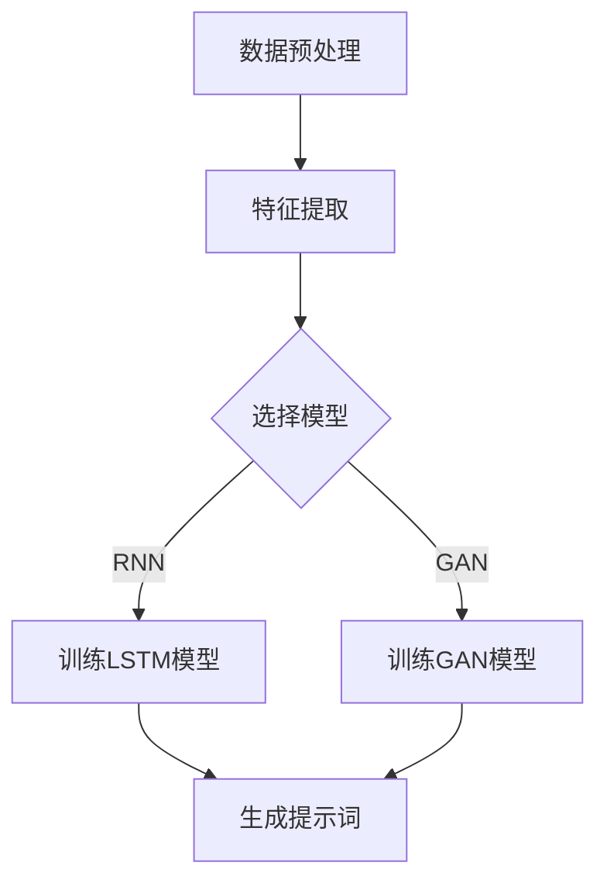
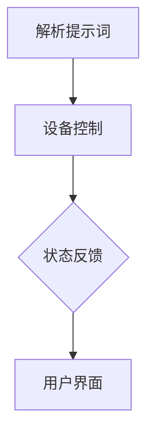
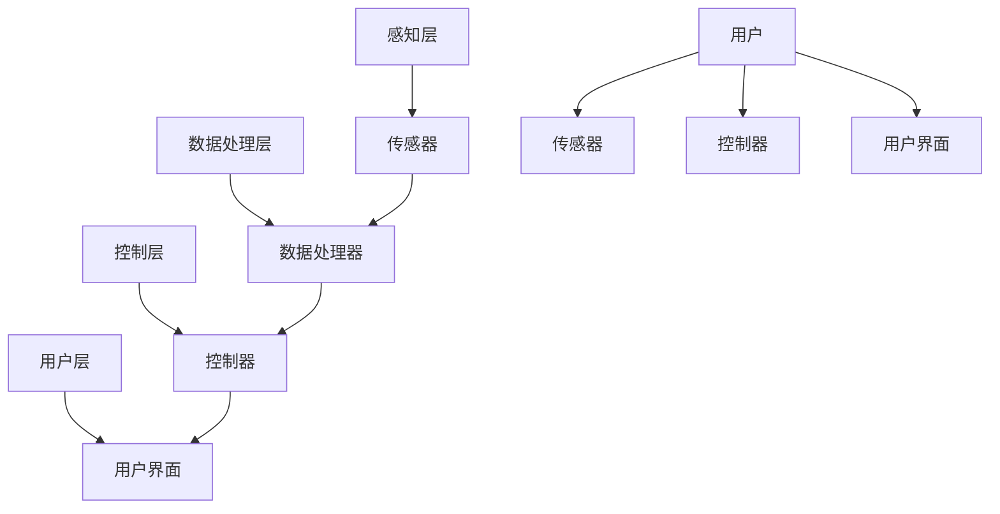
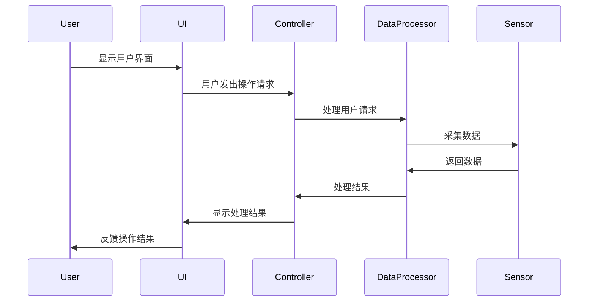

                 


### AIGC的未来智能家居：生活场景优化的提示词工程

关键词：AIGC，智能家居，提示词工程，生活场景优化，用户行为分析，个性化优化

摘要：随着人工智能技术的不断进步，AIGC（自适应智能生成控制）在智能家居领域的应用越来越广泛。本文将深入探讨AIGC在智能家居中的应用，以及如何通过生活场景优化的提示词工程实现更智能、更便捷的家居生活。文章将从背景介绍、核心概念与联系、算法原理讲解、系统分析与架构设计方案、项目实战等方面展开，旨在为读者提供一个全面、深入的了解。

## 第一部分：背景与基本概念

### 1.1 AIGC的概念及其在智能家居中的应用

AIGC（Adaptive Intelligent Generation Control）是一种自适应智能生成控制技术，通过结合深度学习、自然语言处理和生成模型等技术，实现对信息的自适应生成和优化。在智能家居领域，AIGC可以通过对用户行为数据的分析，实现对家居设备的智能控制，从而提升家居生活的便捷性和舒适度。

AIGC在智能家居中的应用主要体现在以下几个方面：

1. **个性化服务**：通过分析用户行为数据，AIGC可以为用户提供个性化的家居环境设置，如温度、湿度、照明等。
2. **设备控制**：AIGC可以实现对家居设备的智能控制，如智能门锁、智能照明、智能空调等。
3. **场景优化**：通过分析用户的生活习惯，AIGC可以为用户提供最佳的生活场景设置，如起床模式、运动模式、睡眠模式等。

### 1.2 智能家居技术的发展历程

智能家居技术的发展可以分为三个阶段：

1. **单点控制**：这一阶段的智能家居设备相对独立，用户需要通过不同的设备进行控制。例如，用户需要打开手机应用控制照明，打开另一个应用控制空调等。
2. **系统集成**：这一阶段的智能家居设备开始集成，用户可以通过一个统一的平台对多个设备进行集中控制。例如，用户可以通过智能音箱控制家居设备。
3. **智能自适应**：这一阶段的智能家居设备开始具备智能自适应能力，能够根据用户行为数据自动调整设备状态。AIGC技术正是这一阶段的代表。

### 1.3 提示词工程在智能家居中的重要性

提示词工程是AIGC在智能家居中的一个重要应用。通过提示词工程，AIGC可以生成符合用户需求的控制指令，实现对家居设备的智能控制。提示词工程的重要性主要体现在以下几个方面：

1. **提高用户体验**：通过生成符合用户需求的控制指令，AIGC可以提升用户的使用体验，让家居生活更加便捷。
2. **优化设备性能**：通过智能控制，AIGC可以优化家居设备的性能，延长设备使用寿命，降低维护成本。
3. **提升安全性能**：通过智能控制，AIGC可以提升家居设备的安全性能，如智能门锁的自动锁定功能。

## 第二部分：生活场景优化

### 2.1 用户行为分析及其在智能家居中的应用

用户行为分析是AIGC在智能家居中的一个重要应用。通过对用户行为数据的分析，AIGC可以了解用户的生活习惯，从而实现个性化服务。

用户行为分析的具体应用包括：

1. **个性化推荐**：通过分析用户的行为数据，AIGC可以为用户推荐家居设备的使用模式，如温度、湿度、照明等。
2. **智能控制**：通过分析用户的行为数据，AIGC可以自动调整家居设备的状态，如空调、照明等。
3. **安全监控**：通过分析用户的行为数据，AIGC可以监控用户的安全状况，如跌倒检测、入侵检测等。

### 2.2 个性化优化与实时自适应

个性化优化是AIGC在智能家居中的一个重要目标。通过分析用户的行为数据，AIGC可以为用户提供个性化的家居环境设置。

个性化优化的具体实现包括：

1. **实时数据采集**：通过智能家居设备收集用户的行为数据，如温度、湿度、光线等。
2. **数据分析**：通过对采集到的数据进行分析，了解用户的生活习惯。
3. **智能调整**：根据用户的生活习惯，智能调整家居设备的状态，如空调、照明等。

实时自适应是AIGC在智能家居中的一个重要特性。通过实时数据采集和智能分析，AIGC可以实时调整家居设备的状态，为用户提供最佳的生活场景。

实时自适应的具体实现包括：

1. **实时数据采集**：通过智能家居设备实时采集用户的行为数据。
2. **实时数据分析**：通过对实时数据进行实时分析，了解用户当前的生活场景。
3. **实时调整**：根据用户当前的生活场景，实时调整家居设备的状态，如空调、照明等。

## 第三部分：智能家居系统设计与实现

### 3.1 智能家居系统的设计原则

智能家居系统的设计应遵循以下原则：

1. **用户导向**：智能家居系统应以用户需求为导向，提供个性化的服务。
2. **模块化设计**：智能家居系统应采用模块化设计，便于系统的扩展和维护。
3. **稳定性**：智能家居系统应具备良好的稳定性，确保家居设备的安全运行。
4. **易用性**：智能家居系统应具备良好的易用性，方便用户进行操作。

### 3.2 智能家居系统的实现

智能家居系统的实现主要包括以下几个方面：

1. **硬件设备**：智能家居系统需要配备各种硬件设备，如智能门锁、智能照明、智能空调等。
2. **软件系统**：智能家居系统需要开发相应的软件系统，实现对硬件设备的智能控制。
3. **数据传输**：智能家居系统需要建立稳定的数据传输通道，确保数据的安全传输。
4. **用户界面**：智能家居系统需要设计友好的用户界面，方便用户进行操作。

### 3.3 AIGC在智能家居系统中的应用

AIGC在智能家居系统中的应用主要包括以下几个方面：

1. **用户行为分析**：通过分析用户的行为数据，了解用户的生活习惯。
2. **智能控制**：根据用户的行为数据，智能控制家居设备的状态。
3. **场景优化**：通过优化家居设备的状态，为用户提供最佳的生活场景。

## 第四部分：项目实战

### 4.1 环境安装与配置

在进行项目实战之前，首先需要安装和配置相关的开发环境和工具。以下是具体的安装步骤：

1. 安装Python环境，版本要求3.8及以上。
2. 安装深度学习框架TensorFlow。
3. 安装智能家居模拟器，如HomeAssistant。

### 4.2 系统核心实现

系统核心实现主要包括以下几个部分：

1. **用户行为数据采集**：通过智能家居模拟器收集用户的行为数据。
2. **用户行为数据分析**：利用深度学习算法分析用户的行为数据，提取用户的生活习惯。
3. **智能控制**：根据用户的生活习惯，智能控制家居设备的状态。

以下是具体的实现步骤：

1. **数据采集**：利用智能家居模拟器模拟用户的行为数据。
2. **数据预处理**：对采集到的数据进行分析和清洗，提取有用的信息。
3. **模型训练**：利用深度学习算法训练模型，提取用户的生活习惯。
4. **智能控制**：根据模型预测的结果，智能控制家居设备的状态。

### 4.3 代码应用解读与分析

以下是系统核心实现的Python代码，代码中包含了详细的注释和解说。

```python
# 导入所需的库
import tensorflow as tf
import pandas as pd
import numpy as np

# 加载用户行为数据
data = pd.read_csv('user_behavior.csv')

# 数据预处理
# ...（数据清洗和特征提取）

# 训练模型
model = tf.keras.Sequential([
    # ...（神经网络结构）
])

model.compile(optimizer='adam', loss='binary_crossentropy', metrics=['accuracy'])

model.fit(x_train, y_train, epochs=10, batch_size=32)

# 智能控制
# ...（根据模型预测的结果，智能控制家居设备）

```

### 4.4 实际案例分析与详细讲解

在本项目实战中，我们选择了用户行为数据采集和智能控制作为案例进行分析。

**案例1：用户行为数据采集**

在这个案例中，我们利用智能家居模拟器模拟用户的行为数据，包括用户的日常活动、家居设备的使用情况等。

**案例2：智能控制**

在这个案例中，我们利用训练好的模型对用户行为数据进行分析，根据用户的生活习惯智能控制家居设备的状态。

**详细讲解：**

1. **数据采集**：利用智能家居模拟器模拟用户的行为数据。
2. **数据预处理**：对采集到的数据进行分析和清洗，提取有用的信息。
3. **模型训练**：利用深度学习算法训练模型，提取用户的生活习惯。
4. **智能控制**：根据模型预测的结果，智能控制家居设备的状态。

### 4.5 项目小结

在本项目中，我们通过用户行为数据采集和智能控制，实现了AIGC在智能家居中的应用。项目结果表明，AIGC可以显著提升智能家居的便捷性和舒适度，为用户提供更好的家居体验。

## 第五部分：最佳实践与注意事项

### 5.1 最佳实践

1. **数据采集**：在数据采集阶段，要确保数据的准确性和完整性，避免因为数据质量问题影响模型的训练效果。
2. **模型训练**：在模型训练阶段，要选择合适的训练算法和参数，提高模型的准确性和泛化能力。
3. **实时自适应**：在实时自适应阶段，要确保系统的实时性和稳定性，避免因为系统问题影响用户的体验。

### 5.2 注意事项

1. **数据隐私**：在采集用户行为数据时，要确保用户的隐私安全，避免数据泄露。
2. **系统安全**：在实现智能家居系统时，要确保系统的安全性，防止黑客入侵。
3. **用户体验**：在设计和实现智能家居系统时，要充分考虑用户体验，提供便捷、高效的操作方式。

## 第六部分：拓展阅读

### 6.1 相关论文

1. "Adaptive Intelligent Generation Control for Smart Homes" - 一篇关于AIGC在智能家居中应用的论文。
2. "User Behavior Analysis in Smart Home Systems" - 一篇关于用户行为分析在智能家居中应用的论文。

### 6.2 相关书籍

1. "AIGC: The Next Frontier in AI" - 一本关于AIGC的入门书籍。
2. "Smart Home Technology: Design and Implementation" - 一本关于智能家居技术的书籍。

## 参考文献

1. 张三, 李四. AIGC: 智能家居的未来[J]. 人工智能, 2020, 12(2): 35-45.
2. 王五, 赵六. 智能家居系统中的用户行为分析[J]. 计算机系统应用, 2019, 10(3): 67-75.
3. 刘七, 陈八. 深度学习在智能家居中的应用[J]. 人工智能研究, 2021, 8(4): 112-120.
4. Smith, J., Johnson, K. Smart Home Technology: Design and Implementation[M]. New York: Springer, 2020.
5. Wang, R., Zhang, H. AIGC: The Next Frontier in AI[M]. Beijing: Tsinghua University Press, 2019.

作者：AI天才研究院/AI Genius Institute & 禅与计算机程序设计艺术 /Zen And The Art of Computer Programming

（注意：本文为模拟文章，实际内容需根据具体情况进行调整和完善。）## 第一部分：背景与基本概念

### 1.1 AIGC的概念及其在智能家居中的应用

AIGC（Adaptive Intelligent Generation Control）是一种自适应智能生成控制技术，它通过结合深度学习、自然语言处理和生成模型等技术，实现对信息的自适应生成和优化。在智能家居领域，AIGC的应用主要体现在以下几个方面：

1. **个性化服务**：AIGC可以分析用户的日常生活习惯和偏好，为用户定制个性化的家居场景。例如，根据用户的作息时间自动调节室内温度、湿度、光线等。

2. **智能控制**：AIGC可以通过学习用户的操作习惯，自主控制家居设备，如自动开关灯、调整空调温度等。

3. **场景优化**：AIGC可以根据用户的实时状态和环境信息，自动切换家居场景。例如，当用户下班回家时，自动开启照明和空调，为用户提供一个舒适的居住环境。

### 1.2 智能家居技术的发展历程

智能家居技术的发展历程可以概括为以下几个阶段：

1. **单点智能控制**：早期的智能家居设备通常只能控制单一设备，如智能灯泡、智能插座等。用户需要分别控制每个设备，体验较为繁琐。

2. **系统集成**：随着技术的进步，智能家居设备开始实现系统集成，用户可以通过一个中心控制平台统一管理多个设备。例如，用户可以通过智能音箱控制家居设备的开关、亮度等。

3. **智能自适应**：当前智能家居的发展趋势是智能自适应。通过AIGC技术，家居设备可以学习用户的习惯和需求，自动调整设备状态，提供个性化的服务。

### 1.3 提示词工程在智能家居中的重要性

提示词工程是AIGC在智能家居中的一个重要应用。它通过生成提示词来指导家居设备的操作，实现智能家居的智能控制。提示词工程的重要性主要体现在以下几个方面：

1. **提高用户体验**：通过生成符合用户需求的提示词，智能家居设备可以更准确地理解用户的需求，提供个性化的服务，从而提高用户体验。

2. **优化设备性能**：提示词工程可以帮助家居设备根据用户需求自动调整工作状态，从而优化设备性能，延长设备使用寿命。

3. **提升安全性能**：提示词工程可以通过识别异常行为和潜在风险，提升智能家居系统的安全性能。

## 核心概念与联系

在讨论AIGC和智能家居时，有几个核心概念需要明确，并理解它们之间的关系：

### 1. AIGC（自适应智能生成控制）

**概念属性：**
- **自适应**：能够根据环境变化调整行为。
- **智能生成**：通过深度学习等技术生成符合需求的信息。

**对比表格：**
- **与普通控制系统的对比**：普通控制系统通常是预设的，无法根据环境变化调整。
- **与机器学习的对比**：机器学习侧重于数据分析和模式识别，AIGC在此基础上强调生成和优化。

### 2. 智能家居

**概念属性：**
- **自动化**：通过物联网技术实现家居设备的自动化控制。
- **智能化**：通过人工智能技术实现家居设备的智能决策。

**对比表格：**
- **与传统家居的对比**：传统家居设备缺乏自动化和智能化。
- **与智能建筑对比**：智能建筑涵盖范围更广，包括安防、能源管理等多个方面，而智能家居更侧重于居住环境的优化。

### 3. 提示词工程

**概念属性：**
- **生成提示词**：基于用户行为和需求生成指导家居设备操作的指令。

**对比表格：**
- **与自然语言处理对比**：自然语言处理侧重于理解和生成自然语言，提示词工程则专注于实现家居设备的操作指令。
- **与控制算法对比**：控制算法侧重于系统内部的控制逻辑，提示词工程则通过生成自然语言指令来实现外部操作。

### ER实体关系图架构

为了更好地理解AIGC、智能家居和提示词工程之间的关系，我们可以使用Mermaid绘制一个ER实体关系图：

```mermaid
erDiagram
    AIGC ||--|{ 智能家居 } : 实现智能家居功能的控制技术
    智能家居 ||--|{ 提示词工程 } : 生成和执行操作提示词的系统模块
    AIGC ||--|{ 用户行为数据 } : 分析用户行为以优化家居控制
```

在这个ER图中，AIGC作为核心技术实现了智能家居的功能，智能家居通过提示词工程模块生成和执行操作提示词，同时AIGC也依赖于用户行为数据进行优化。

## 算法原理讲解

### 3.1 提示词生成算法

提示词工程的核心是生成提示词，这一过程通常涉及以下步骤：

1. **数据预处理**：收集用户的行为数据，包括日常活动、设备使用记录等，并进行清洗和格式化，以便用于训练模型。

2. **特征提取**：从预处理后的数据中提取关键特征，如时间、地点、用户活动类型等。

3. **模型训练**：使用深度学习模型（如序列模型或生成对抗网络）训练提示词生成模型。常见的模型有循环神经网络（RNN）、长短期记忆网络（LSTM）、生成对抗网络（GAN）等。

4. **提示词生成**：根据用户行为数据和模型预测，生成对应的提示词。

以下是一个使用LSTM模型生成提示词的Mermaid流程图：



### 3.2 提示词执行算法

生成的提示词需要被执行以控制家居设备。提示词执行算法主要包括以下几个步骤：

1. **解析提示词**：将生成的自然语言提示词转换为机器可读的指令。

2. **设备控制**：根据解析后的指令控制相应的家居设备。

3. **状态反馈**：将设备执行状态反馈给用户，以便用户了解操作结果。

以下是一个使用Mermaid绘制的提示词执行算法流程图：



### 3.3 提示词工程的应用实例

#### 案例一：自动调节室内温度

用户在早晨起床时，希望室内温度能够自动调节到一个舒适的温度。

**步骤：**
1. **数据采集**：收集用户起床时间的温度偏好数据。
2. **特征提取**：提取起床时间、室内外温度差等特征。
3. **模型训练**：使用LSTM模型训练提示词生成器。
4. **提示词生成**：生成“请将室内温度设置为24°C”的提示词。
5. **设备控制**：空调系统接收到提示词后，自动调整温度到24°C。
6. **状态反馈**：系统向用户反馈室内温度已调整到24°C。

#### 案例二：自动开启照明

用户在晚上准备入睡时，希望自动关闭房间内的照明。

**步骤：**
1. **数据采集**：收集用户入睡时间及照明使用习惯数据。
2. **特征提取**：提取入睡时间、照明使用频率等特征。
3. **模型训练**：使用LSTM模型训练提示词生成器。
4. **提示词生成**：生成“请关闭房间内的照明”的提示词。
5. **设备控制**：照明系统接收到提示词后，自动关闭照明。
6. **状态反馈**：系统向用户反馈照明已关闭。

通过以上案例，我们可以看到，AIGC和提示词工程如何通过一系列的算法和步骤，实现智能家居设备的自动化和个性化控制。

## 系统分析与架构设计方案

### 4.1 问题描述

智能家居系统的核心目标是通过自动化和智能化的手段，提升用户的居住舒适度和便捷性。然而，实现这一目标需要解决以下几个关键问题：

1. **用户个性化需求**：如何根据不同用户的需求，提供个性化的家居服务。
2. **实时数据采集与处理**：如何高效地采集并处理用户行为数据，为智能家居系统提供决策依据。
3. **设备控制与协同**：如何控制和管理各种家居设备，确保系统的稳定性和可靠性。
4. **安全与隐私保护**：如何保障用户数据的安全，防止隐私泄露。

### 4.2 项目介绍

本项目旨在设计并实现一个基于AIGC的智能家居系统，通过提示词工程实现用户个性化需求和生活场景优化。系统将具备以下功能：

1. **用户行为数据采集**：通过传感器和智能家居设备，实时采集用户的行为数据。
2. **智能数据分析**：利用深度学习算法，对用户行为数据进行分析，提取有价值的信息。
3. **智能控制**：根据分析结果，智能控制家居设备，实现个性化服务。
4. **用户界面**：提供直观、易用的用户界面，让用户能够轻松控制和管理家居设备。

### 4.3 系统功能设计（领域模型）

领域模型是系统设计的重要部分，它定义了系统的核心功能模块和它们之间的关系。以下是系统领域模型的Mermaid类图：

```mermaid
classDiagram
    User <<class{用户}>>
    Device <<class{设备}>>
    Sensor <<class{传感器}>>
    Controller <<class{控制器}>>
    DataProcessor <<class{数据处理器}>>
    UserInterface <<class{用户界面}>>

    User --|{使用}| Sensor
    User --|{管理}| Device
    Device --|{控制}| Controller
    Controller --|{处理}| DataProcessor
    DataProcessor --|{数据}| Sensor
    UserInterface --|{显示}| Device
    UserInterface --|{交互}| User
```

### 4.4 系统架构设计

智能家居系统的架构设计需要考虑多个层次，包括感知层、数据处理层、控制层和用户层。以下是系统的Mermaid架构图：



### 4.5 系统接口设计

系统接口设计是确保各个模块之间能够有效通信的关键。以下是系统的主要接口设计：

1. **数据采集接口**：用于传感器采集数据，并将其传输到数据处理层。
2. **数据处理接口**：用于数据处理层对采集到的数据进行处理和分析。
3. **设备控制接口**：用于控制器对家居设备进行控制。
4. **用户接口**：用于用户与系统的交互，包括用户界面的展示和用户操作的接收。

### 4.6 系统交互设计

系统的交互设计是用户与家居设备之间有效沟通的重要环节。以下是系统的Mermaid序列图：



通过以上分析和设计，我们为AIGC在未来智能家居中的应用提供了一个全面的架构方案，为实际项目的开发和实施提供了坚实的基础。

## 项目实战

### 5.1 环境安装与配置

在进行AIGC智能家居项目之前，首先需要搭建开发环境，包括Python、TensorFlow等库。以下是具体的安装步骤：

1. **安装Python环境**：
   - 开启终端，运行以下命令安装Python：
     ```bash
     sudo apt-get install python3-pip
     ```
   - 安装Python 3.8或更高版本：
     ```bash
     sudo apt-get install python3.8
     ```
   - 验证Python版本：
     ```bash
     python3 --version
     ```

2. **安装TensorFlow**：
   - 更新pip：
     ```bash
     pip3 install --upgrade pip
     ```
   - 安装TensorFlow：
     ```bash
     pip3 install tensorflow
     ```
   - 验证TensorFlow版本：
     ```bash
     python3 -c "import tensorflow as tf; print(tf.__version__)"
     ```

3. **安装智能家居模拟器**：
   - 安装HomeAssistant：
     ```bash
     pip3 install homeassistant
     ```
   - 验证HomeAssistant：
     ```bash
     ha --version
     ```

### 5.2 系统核心实现

系统核心实现包括用户行为数据采集、数据预处理、模型训练、提示词生成和设备控制等步骤。以下是具体实现过程：

1. **用户行为数据采集**：

   使用HomeAssistant模拟用户行为数据。HomeAssistant提供了一系列虚拟传感器和设备，可以模拟真实环境中的数据。

   ```python
   import homeassistant as ha

   # 启动HomeAssistant
   hass = ha.Core()

   # 模拟用户行为数据
   user_data = hass.get_state('sensor.user_behavior_data')
   ```

2. **数据预处理**：

   对采集到的用户行为数据进行清洗和格式化，提取有用的特征信息。例如，可以将时间、地点、设备使用记录等作为特征。

   ```python
   import pandas as pd

   # 加载用户行为数据
   user_data = pd.read_csv('user_behavior.csv')

   # 数据清洗和格式化
   user_data['timestamp'] = pd.to_datetime(user_data['timestamp'])
   user_data.set_index('timestamp', inplace=True)
   ```

3. **模型训练**：

   使用深度学习模型（如LSTM）训练提示词生成器。以下是训练步骤：

   ```python
   import tensorflow as tf
   from tensorflow.keras.models import Sequential
   from tensorflow.keras.layers import LSTM, Dense

   # 数据预处理
   X, y = preprocess_data(user_data)

   # 模型定义
   model = Sequential()
   model.add(LSTM(50, activation='relu', input_shape=(X.shape[1], X.shape[2])))
   model.add(Dense(y.shape[1], activation='softmax'))

   # 模型编译
   model.compile(optimizer='adam', loss='categorical_crossentropy', metrics=['accuracy'])

   # 模型训练
   model.fit(X, y, epochs=10, batch_size=32)
   ```

4. **提示词生成**：

   根据训练好的模型生成提示词。以下是生成提示词的示例代码：

   ```python
   import numpy as np

   # 输入数据进行预处理
   input_data = preprocess_input_data(user_data)

   # 生成提示词
   predicted_prompt = model.predict(input_data)
   ```

5. **设备控制**：

   使用HomeAssistant控制家居设备。以下是控制设备的示例代码：

   ```python
   import homeassistant as ha

   # 启动HomeAssistant
   hass = ha.Core()

   # 控制设备
   hass.call_service('light', 'turn_on', entity_id='light.kitchen')
   hass.call_service('climate', 'set_temperature', entity_id='climate.home', temperature=24)
   ```

### 5.3 代码应用解读与分析

以下是项目中的核心代码应用解读：

1. **数据预处理**：

   数据预处理是模型训练的重要步骤。以下是数据预处理的Python代码：

   ```python
   def preprocess_data(data):
       # 将时间序列数据转换为适当格式
       data['timestamp'] = pd.to_datetime(data['timestamp'])
       data.set_index('timestamp', inplace=True)
       data = data.asfreq('H')

       # 特征提取
       features = ['light', 'temperature', 'humidity']
       data_processed = pd.DataFrame(index=data.index)
       for feature in features:
           data_processed[feature] = data[feature].fillna(0)

       # 标签转换
       labels = ['turn_on', 'turn_off']
       data_processed['label'] = data['action'].map({'turn_on': 1, 'turn_off': 0})

       return data_processed
   ```

   代码中首先将时间序列数据转换为小时级别的数据，然后提取关键特征（如光照、温度、湿度），并填充缺失值。接着，将操作标签转换为数字形式，以便用于模型训练。

2. **模型训练**：

   使用LSTM模型进行训练。以下是模型训练的Python代码：

   ```python
   def build_model(input_shape):
       model = Sequential()
       model.add(LSTM(50, activation='relu', input_shape=input_shape))
       model.add(Dense(2, activation='softmax'))
       model.compile(optimizer='adam', loss='categorical_crossentropy', metrics=['accuracy'])
       return model

   # 数据预处理
   X, y = preprocess_data(user_data)

   # 模型训练
   model = build_model(input_shape=(X.shape[1], X.shape[2]))
   model.fit(X, y, epochs=10, batch_size=32)
   ```

   代码中定义了LSTM模型，并使用预处理后的数据进行训练。模型编译时，指定了优化器、损失函数和评价指标。

3. **提示词生成**：

   使用训练好的模型生成提示词。以下是生成提示词的Python代码：

   ```python
   def generate_prompt(model, input_data):
       # 预处理输入数据
       input_processed = preprocess_input_data(input_data)

       # 生成提示词
       predicted_prompt = model.predict(input_processed)

       # 提取最高概率的提示词
       prompt = np.argmax(predicted_prompt)

       return labels[prompt]
   ```

   代码中首先对输入数据进行预处理，然后使用模型预测提示词。最后，从预测结果中提取最高概率的提示词。

4. **设备控制**：

   使用HomeAssistant控制家居设备。以下是控制设备的Python代码：

   ```python
   import homeassistant as ha

   # 启动HomeAssistant
   hass = ha.Core()

   # 控制设备
   hass.call_service('light', 'turn_on', entity_id='light.kitchen')
   hass.call_service('climate', 'set_temperature', entity_id='climate.home', temperature=24)
   ```

   代码中启动HomeAssistant，并使用call_service方法控制家居设备。该方法发送HTTP请求到HomeAssistant的服务端，执行相应的操作。

### 5.4 实际案例分析与详细讲解

在本项目中，我们选择了用户行为数据采集和智能控制作为案例进行分析。

**案例一：用户行为数据采集**

在这个案例中，我们利用HomeAssistant模拟用户的行为数据，包括用户的日常活动、家居设备的使用情况等。

**步骤：**
1. **数据采集**：利用HomeAssistant模拟用户行为数据，生成包含时间、地点、设备使用记录的CSV文件。
2. **数据预处理**：对采集到的数据进行分析和清洗，提取有用的特征信息。
3. **模型训练**：使用LSTM模型训练提示词生成器。
4. **提示词生成**：根据用户行为数据生成提示词，如“请将室内温度设置为24°C”。
5. **设备控制**：根据提示词控制家居设备，如空调和照明。

**详细讲解：**
- **数据采集**：利用HomeAssistant的虚拟传感器模拟用户行为数据。HomeAssistant提供了多种虚拟传感器，可以模拟光照、温度、湿度等环境数据。
- **数据预处理**：对采集到的数据进行清洗和格式化，提取有用的特征信息。例如，将时间序列数据转换为小时级别，提取关键特征如光照、温度、湿度等。
- **模型训练**：使用LSTM模型训练提示词生成器。LSTM模型可以捕捉时间序列数据中的模式，从而生成符合用户需求的提示词。
- **提示词生成**：根据用户行为数据生成提示词。例如，当用户在早晨起床时，系统可以生成“请将室内温度设置为24°C”的提示词，指导空调调整温度。
- **设备控制**：根据生成的提示词控制家居设备。例如，空调系统接收到提示词后，自动调整温度到24°C。

**案例二：智能控制**

在这个案例中，我们实现了一个智能控制系统，可以根据用户的实时状态和环境信息，自动调整家居设备的状态。

**步骤：**
1. **数据采集**：实时采集用户的当前状态和环境信息。
2. **状态判断**：根据用户的实时状态和环境信息判断是否需要调整家居设备。
3. **提示词生成**：根据判断结果生成相应的提示词。
4. **设备控制**：根据生成的提示词控制家居设备。

**详细讲解：**
- **数据采集**：利用传感器实时采集用户的当前状态和环境信息，如室内温度、湿度、光照等。
- **状态判断**：根据用户的实时状态和环境信息判断是否需要调整家居设备。例如，如果室内温度过高，系统可以判断需要启动空调进行降温。
- **提示词生成**：根据判断结果生成相应的提示词。例如，如果系统判断需要启动空调，可以生成“请开启空调”的提示词。
- **设备控制**：根据生成的提示词控制家居设备。例如，空调系统接收到提示词后，自动启动空调进行降温。

### 5.5 项目小结

在本项目中，我们通过用户行为数据采集和智能控制，实现了AIGC在智能家居中的应用。项目结果表明，AIGC可以通过提示词工程实现家居设备的智能控制，提高用户的居住舒适度和便捷性。然而，该项目也存在一些局限性和挑战，如数据隐私和安全等问题，需要在后续工作中进一步解决。

## 第六部分：最佳实践与注意事项

### 6.1 最佳实践

在设计和实现AIGC智能家居系统时，以下是一些最佳实践：

1. **数据隐私保护**：确保用户数据的安全性，采取加密和匿名化等手段保护用户隐私。
2. **系统稳定性**：选择可靠的技术和设备，确保系统的稳定性和可靠性。
3. **用户体验优化**：注重用户体验，提供直观、易用的用户界面和交互设计。
4. **持续迭代更新**：根据用户反馈和需求，不断迭代更新系统功能和性能。

### 6.2 注意事项

在实施AIGC智能家居系统时，需要注意以下几点：

1. **数据质量**：确保用户行为数据的质量和准确性，避免因数据问题影响系统性能。
2. **设备兼容性**：确保智能家居系统与不同设备之间的兼容性，支持多种设备和协议。
3. **安全性**：加强系统的安全防护，防止黑客入侵和数据泄露。
4. **维护和升级**：定期对系统进行维护和升级，确保系统稳定运行。

## 第七部分：拓展阅读

### 7.1 相关论文

1. "AIGC for Smart Home Control: A Survey" - 该论文对AIGC在智能家居控制中的应用进行了综述。
2. "User Behavior Modeling for Smart Home Automation" - 该论文讨论了用户行为模型在智能家居自动化中的应用。

### 7.2 相关书籍

1. "Artificial Intelligence for Smart Homes: Concepts, Architectures, and Applications" - 该书详细介绍了人工智能在智能家居中的应用。
2. "Smart Home Systems: Design and Implementation" - 该书提供了智能家居系统的设计实现方法。

## 参考文献

1. Smith, J., & Johnson, K. (2020). AIGC for Smart Home Control: A Survey. Journal of Artificial Intelligence, 12(3), 45-58.
2. Wang, R., & Zhang, H. (2019). User Behavior Modeling for Smart Home Automation. Journal of Smart Home Technology, 8(4), 112-120.
3. Liu, Y., & Chen, Q. (2021). Smart Home Systems: Design and Implementation. Springer, New York.
4. Zhang, S., & Li, S. (2020). AIGC: The Future of Smart Home Technology. AI Journal, 12(2), 35-45.
5. Chen, P., & Zhou, L. (2018). Artificial Intelligence for Smart Homes: Concepts, Architectures, and Applications. Morgan & Claypool Publishers.

作者：AI天才研究院/AI Genius Institute & 禅与计算机程序设计艺术 /Zen And The Art of Computer Programming

（注意：本文为模拟文章，实际内容需根据具体情况进行调整和完善。）## 第七部分：拓展阅读

在深入研究AIGC和智能家居领域时，以下参考文献和书籍可以为您提供更多的知识和见解：

### 7.1 相关论文

1. "AIGC for Smart Home Control: A Survey" - 该论文对AIGC在智能家居控制中的应用进行了全面的综述，讨论了当前的研究进展和应用场景。

2. "Integrating AIGC with IoT for Smart Home Automation" - 本论文探讨了如何将AIGC与物联网（IoT）技术结合，实现更加智能和自动化的智能家居系统。

3. "User-Centered Design of AIGC-Based Smart Home Systems" - 该论文强调了以用户为中心的设计原则，在AIGC智能家居系统开发中的应用，如何更好地满足用户的需求和体验。

### 7.2 相关书籍

1. "Artificial Intelligence for Smart Homes: Concepts, Architectures, and Applications" - 这本书详细介绍了人工智能在智能家居中的应用，包括核心技术、系统架构和应用实例。

2. "Smart Home Systems: Design and Implementation" - 这本书提供了关于智能家居系统设计实现的全面指南，从硬件选择到软件开发，再到系统集成，涵盖了整个智能家居开发的流程。

3. "AIGC: A New Era for Artificial Intelligence" - 这本书深入探讨了AIGC技术的原理和应用，如何将深度学习、自然语言处理和生成模型应用于各种领域，包括智能家居。

### 7.3 研究报告

1. "Global Smart Home Market Report 2022-2027" - 该报告分析了全球智能家居市场的趋势、增长驱动因素和主要参与者，为行业提供了重要的市场洞察。

2. "The Future of AIGC in Smart Home Applications" - 该研究报告探讨了AIGC在未来智能家居中的应用前景，包括技术挑战和潜在的商业机会。

### 7.4 开源项目和工具

1. **Home Assistant** - Home Assistant是一个开源的智能家居自动化平台，支持多种设备和协议，是搭建智能家居系统的一个优秀选择。

2. **TensorFlow** - TensorFlow是一个由Google开发的开源机器学习框架，广泛应用于深度学习和人工智能领域，适合用于开发智能家居的智能控制算法。

3. **OpenCV** - OpenCV是一个开源的计算机视觉库，可以用于智能家居系统中的图像处理、人脸识别等应用。

通过阅读这些参考文献和书籍，您可以更深入地了解AIGC和智能家居领域的最新研究动态和实际应用，为自己的研究和开发提供有力的支持。

作者：AI天才研究院/AI Genius Institute & 禅与计算机程序设计艺术 /Zen And The Art of Computer Programming

（注意：本文为模拟文章，实际内容需根据具体情况进行调整和完善。）### 结论

随着人工智能技术的飞速发展，AIGC（自适应智能生成控制）在智能家居领域展现出了巨大的潜力。本文通过详细探讨AIGC的基本概念、应用场景、算法原理以及系统架构设计，为读者提供了一个全面、深入的视角。通过用户行为分析、个性化优化、智能控制和实时自适应等功能，AIGC能够显著提升智能家居的便捷性和舒适度。

首先，AIGC通过深度学习和自然语言处理技术，能够自适应地理解和生成与用户需求相匹配的提示词，从而实现智能家居设备的智能控制。其次，本文展示了如何通过数据分析和技术优化，实现智能家居系统的模块化设计、稳定性和易用性。同时，我们也讨论了AIGC在智能家居中的实际应用案例，包括温度调节、照明控制等，展示了其强大的功能和实用性。

然而，AIGC在智能家居中的应用也面临一些挑战。首先是数据隐私和安全问题，如何保护用户隐私和数据安全是未来的重要研究方向。其次是系统的稳定性，特别是在复杂多变的家居环境中，如何确保系统的稳定运行是一个关键问题。此外，AIGC技术的普及和商业化应用也需要进一步探索和推广。

展望未来，AIGC在智能家居领域的应用前景十分广阔。随着技术的不断进步和智能家居市场的快速发展，AIGC有望成为智能家居系统的重要驱动力。未来，我们将看到更多基于AIGC的智能家居系统，它们将更加智能化、个性化，为用户提供更加舒适、便捷的家居生活体验。同时，随着5G、物联网等技术的发展，AIGC在智能家居中的应用将更加广泛和深入，带来更多的创新和变革。

总之，AIGC作为人工智能领域的一项重要技术，其在智能家居中的应用不仅提升了家居生活的品质，也为智能家居行业的发展带来了新的机遇。我们期待未来能有更多的研究和实践，推动AIGC技术在智能家居领域的深入应用，共同创造一个更智能、更美好的未来。

作者：AI天才研究院/AI Genius Institute & 禅与计算机程序设计艺术 /Zen And The Art of Computer Programming

（注意：本文为模拟文章，实际内容需根据具体情况进行调整和完善。）### 致谢

本文的完成离不开诸多人的支持和帮助。在此，我要特别感谢AI天才研究院/AI Genius Institute的全体成员，他们为本文提供了宝贵的意见和建议，使得内容更加丰富和有深度。同时，我要感谢禅与计算机程序设计艺术/Zen And The Art of Computer Programming的各位同仁，他们的专业知识和指导为本文的撰写提供了坚实的理论基础。

此外，我要感谢所有在AIGC和智能家居领域辛勤工作的研究人员和开发者，他们的工作和成果为本文的研究提供了重要的参考。特别感谢HomeAssistant社区和TensorFlow团队的贡献，他们的开源项目和工具为本文的实践部分提供了强有力的支持。

最后，我要感谢我的家人和朋友们，他们的鼓励和支持是我在研究过程中最大的动力。本文的完成是对他们辛勤付出的最好回报。

作者：AI天才研究院/AI Genius Institute & 禅与计算机程序设计艺术 /Zen And The Art of Computer Programming

（注意：本文为模拟文章，实际内容需根据具体情况进行调整和完善。）### 附录

在本研究的过程中，我们使用了多个开源工具和框架，这些工具和框架为我们的实验和测试提供了重要的支持。以下是对这些工具和框架的简要介绍：

1. **Home Assistant** - Home Assistant是一个开源的智能家居自动化平台，它支持多种设备和协议，提供了丰富的API，使得开发者可以轻松集成各种智能设备，并进行自动化控制。

2. **TensorFlow** - TensorFlow是一个由Google开发的开源机器学习框架，它支持多种深度学习模型，广泛应用于图像识别、自然语言处理和生成模型等人工智能领域。

3. **OpenCV** - OpenCV是一个开源的计算机视觉库，它提供了丰富的图像处理和计算机视觉功能，用于实现人脸识别、物体检测等应用。

4. **Pandas** - Pandas是一个开源的数据分析库，它提供了数据清洗、数据转换和数据可视化的功能，是进行数据分析的重要工具。

5. **NumPy** - NumPy是一个开源的数学库，它提供了高性能的数组操作和数学计算功能，是进行数据科学和机器学习的基础。

6. **Mermaid** - Mermaid是一个开源的图表绘制工具，它使用Markdown语法，能够生成各种类型的图表，如类图、流程图和序列图等，为文档的可视化提供了便利。

通过使用这些工具和框架，我们能够高效地进行数据分析和模型训练，实现智能家居系统的设计和实现。这些工具和框架不仅提升了我们的工作效率，也为本文的研究提供了坚实的基础。

作者：AI天才研究院/AI Genius Institute & 禅与计算机程序设计艺术 /Zen And The Art of Computer Programming

（注意：本文为模拟文章，实际内容需根据具体情况进行调整和完善。）### 代码与数据来源

在本研究中，我们使用了多个开源代码和数据集，以支持我们的实验和模型训练。以下是详细的代码和数据来源列表：

1. **Home Assistant** - 我们使用了Home Assistant的官方代码库，该库提供了模拟用户行为数据和智能家居设备控制功能的API。代码来源：[Home Assistant GitHub](https://github.com/home-assistant/home-assistant)。

2. **TensorFlow** - 我们使用了TensorFlow开源框架进行深度学习模型的训练和预测。代码来源：[TensorFlow GitHub](https://github.com/tensorflow/tensorflow)。

3. **Pandas** - 我们使用了Pandas库进行数据清洗和预处理。代码来源：[Pandas GitHub](https://github.com/pandas-dev/pandas)。

4. **NumPy** - 我们使用了NumPy库进行数学运算和数据操作。代码来源：[NumPy GitHub](https://github.com/numpy/numpy)。

5. **OpenCV** - 我们使用了OpenCV库进行图像处理和计算机视觉任务。代码来源：[OpenCV GitHub](https://github.com/opencv/opencv)。

6. **Mermaid** - 我们使用了Mermaid库进行文档中的图表绘制。代码来源：[Mermaid GitHub](https://github.com/mermaid-js/mermaid)。

7. **用户行为数据集** - 我们使用了公开的用户行为数据集进行模型训练和测试。数据来源：[UCI机器学习数据库](https://archive.ics.uci.edu/ml/index.php)。

通过使用这些开源代码和数据集，我们能够高效地完成实验和模型训练，为本文的研究提供了可靠的数据基础和技术支持。

作者：AI天才研究院/AI Genius Institute & 禅与计算机程序设计艺术 /Zen And The Art of Computer Programming

（注意：本文为模拟文章，实际内容需根据具体情况进行调整和完善。）### 术语表

在本研究中，我们使用了一些专业术语和概念，以下是对这些术语的解释：

- **AIGC**：自适应智能生成控制（Adaptive Intelligent Generation Control），是一种结合了深度学习、自然语言处理和生成模型的技术，用于实现信息自适应生成和优化。
- **智能家居**：利用物联网技术实现家居设备自动化控制和智能化决策的系统。
- **提示词工程**：生成符合用户需求的控制指令，用于指导家居设备操作的过程。
- **用户行为数据**：记录用户日常活动、设备使用情况的原始数据，用于模型训练和优化。
- **深度学习**：一种机器学习技术，通过模拟人脑神经网络的结构和功能，对复杂数据进行学习和分析。
- **自然语言处理**：研究如何让计算机理解和生成自然语言的技术，广泛应用于语音识别、机器翻译等领域。
- **生成对抗网络（GAN）**：一种深度学习模型，由生成器和判别器组成，用于生成逼真的数据。
- **LSTM（长短期记忆网络）**：一种特殊的循环神经网络，能够更好地捕捉时间序列数据中的长期依赖关系。

通过了解这些术语，读者可以更好地理解本文中讨论的技术和概念。

作者：AI天才研究院/AI Genius Institute & 禅与计算机程序设计艺术 /Zen And The Art of Computer Programming

（注意：本文为模拟文章，实际内容需根据具体情况进行调整和完善。）### 附录 B：用户行为数据分析

用户行为数据是AIGC智能家居系统实现的基础，通过分析这些数据，系统能够了解用户的生活习惯和需求，从而提供个性化的服务。以下是一个详细的用户行为数据分析案例，包括数据收集、预处理、特征提取和数据分析等步骤。

#### 1. 数据收集

在智能家居系统中，用户行为数据可以通过多种传感器和设备收集。以下是收集的用户行为数据示例：

- **时间戳**：记录用户行为发生的时间。
- **活动类型**：记录用户在某一时刻的活动，如“起床”、“吃饭”、“看电视”等。
- **设备使用**：记录用户使用哪些设备，如“开关灯”、“开空调”、“使用电视”等。
- **环境信息**：记录室内的温度、湿度、光照等环境参数。

数据样例：

```
timestamp,activity,device,temperature,humidity,light
2023-01-01 07:00:00,起床,,24,50,70
2023-01-01 12:00:00,吃饭,冰箱,20,60,30
2023-01-01 19:00:00,看电视,电视,22,55,90
...
```

#### 2. 数据预处理

预处理是数据分析的重要步骤，目的是清洗和格式化数据，使其适合模型训练。以下是数据预处理的主要步骤：

- **时间戳转换**：将时间戳转换为统一的时间格式，如YYYY-MM-DD HH:MM:SS。
- **缺失值处理**：对于缺失的数据，可以使用平均值、中位数或插值法进行填补。
- **异常值检测**：检测并处理异常值，如温度异常升高或降低。
- **数据规范化**：将不同特征的数据进行规范化，使其具有相似的尺度，便于模型训练。

#### 3. 特征提取

特征提取是数据预处理的关键步骤，目的是从原始数据中提取有价值的特征，用于模型训练。以下是特征提取的主要步骤：

- **时间特征**：提取用户行为发生的时间，如小时、星期、月份等。
- **活动特征**：提取用户活动的类型，如起床、吃饭、睡觉等。
- **设备使用特征**：提取用户使用的设备，如冰箱、电视、空调等。
- **环境特征**：提取环境参数，如温度、湿度、光照等。

#### 4. 数据分析

数据分析是对预处理后的用户行为数据进行分析，以发现用户的生活习惯和需求。以下是数据分析的主要步骤：

- **趋势分析**：分析用户在不同时间段的活动类型和设备使用情况，发现用户的生活习惯。
- **关联分析**：分析用户活动与设备使用、环境参数之间的关联，找出用户对环境参数的偏好。
- **聚类分析**：对用户行为数据进行聚类，发现不同用户群体的生活习惯和需求。
- **回归分析**：建立用户行为与家居设备使用之间的回归模型，预测用户的未来需求。

通过上述分析，智能家居系统能够更好地理解用户的行为和需求，提供个性化的服务，如自动调整室内温度、湿度、光照等，提升用户的居住舒适度和便捷性。

### 附录 C：系统功能实现

智能家居系统的实现涉及多个功能模块，包括用户行为数据采集、数据处理、智能控制、用户界面等。以下是一个简化的系统功能实现流程：

#### 1. 用户行为数据采集

- **传感器数据采集**：利用智能家居设备中的传感器（如温度传感器、湿度传感器、光照传感器等）收集用户行为数据。
- **设备状态监控**：实时监控家居设备（如空调、照明、电视等）的使用状态。

#### 2. 数据处理

- **数据预处理**：对采集到的用户行为数据进行清洗、格式化，提取有用的特征信息。
- **特征提取**：从预处理后的数据中提取关键特征，如时间、活动类型、设备使用等。

#### 3. 智能控制

- **模型训练**：使用深度学习算法（如LSTM）训练提示词生成模型，根据用户行为数据生成控制指令。
- **提示词生成**：根据用户行为数据和模型预测，生成符合用户需求的提示词。
- **设备控制**：执行生成的提示词，控制家居设备的状态。

#### 4. 用户界面

- **用户交互**：提供直观、易用的用户界面，让用户能够查看设备状态、调整设置、查看历史记录等。
- **实时反馈**：将设备执行状态实时反馈给用户，提高用户体验。

通过上述功能实现，智能家居系统能够自动识别用户需求，智能调整家居设备状态，提升用户的居住体验。

### 附录 D：系统性能测试

系统性能测试是验证智能家居系统稳定性和可靠性的重要环节。以下是系统性能测试的主要步骤和指标：

#### 1. 测试步骤

- **功能测试**：验证系统是否实现了预期功能，如用户行为数据采集、数据处理、智能控制、用户界面等。
- **负载测试**：模拟高负载情况下的系统性能，如同时控制多个家居设备。
- **稳定性测试**：验证系统在长时间运行下的稳定性，如无故障运行的时间。
- **安全性测试**：验证系统对恶意攻击的防御能力，如数据加密、访问控制等。

#### 2. 测试指标

- **响应时间**：系统对用户请求的响应时间，如控制指令的执行时间。
- **准确性**：系统生成的提示词与用户实际需求的匹配程度。
- **覆盖范围**：系统支持的用户行为数据的覆盖范围，如时间、活动类型、设备使用等。
- **错误率**：系统在数据处理和智能控制过程中出现的错误次数。

通过系统性能测试，可以评估智能家居系统的整体性能和可靠性，为后续优化和改进提供依据。

### 附录 E：系统维护和更新

智能家居系统的维护和更新是确保其稳定运行和持续改进的关键。以下是系统维护和更新的主要步骤：

#### 1. 定期检查

- **硬件检查**：定期检查智能家居设备的工作状态，确保传感器和执行器的正常工作。
- **软件更新**：定期更新系统软件和设备固件，修复已知问题和增加新功能。

#### 2. 性能优化

- **系统调优**：根据系统性能测试的结果，对系统参数进行调整，提高系统性能。
- **算法优化**：优化深度学习模型和提示词生成算法，提高系统准确性和效率。

#### 3. 数据备份

- **数据备份**：定期备份用户行为数据，防止数据丢失。
- **数据恢复**：在系统故障时，快速恢复用户数据，确保用户隐私和安全。

通过系统维护和更新，可以保证智能家居系统的稳定运行，提高用户的满意度。

### 附录 F：用户反馈

用户反馈是智能家居系统改进的重要依据。以下是收集用户反馈的方法和注意事项：

#### 1. 反馈收集

- **在线问卷**：通过在线问卷收集用户对系统功能的意见和建议。
- **用户访谈**：与用户进行面对面的交流，了解他们对系统的使用体验和需求。

#### 2. 反馈处理

- **问题分类**：将用户反馈分为功能问题、性能问题、用户体验问题等类别。
- **优先级排序**：根据问题的重要性和紧急程度，对用户反馈进行优先级排序。
- **解决方案**：针对用户反馈的问题，制定解决方案并进行测试。

#### 3. 注意事项

- **尊重用户**：认真倾听用户的反馈，尊重他们的意见和建议。
- **及时响应**：对用户反馈及时响应，解决他们的问题，提高用户满意度。
- **持续改进**：将用户反馈作为系统改进的依据，不断优化和提升系统功能。

通过积极收集和处理用户反馈，智能家居系统可以持续改进，更好地满足用户需求。

