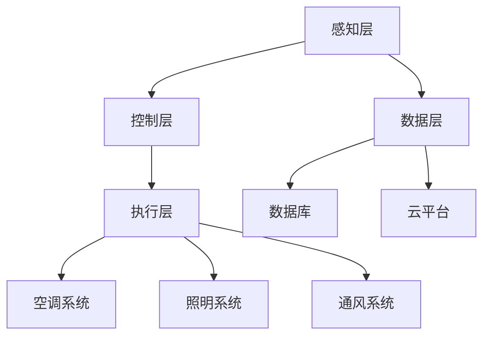
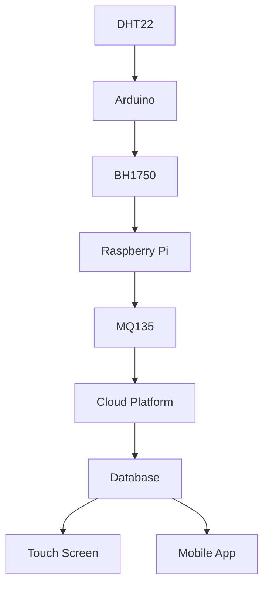
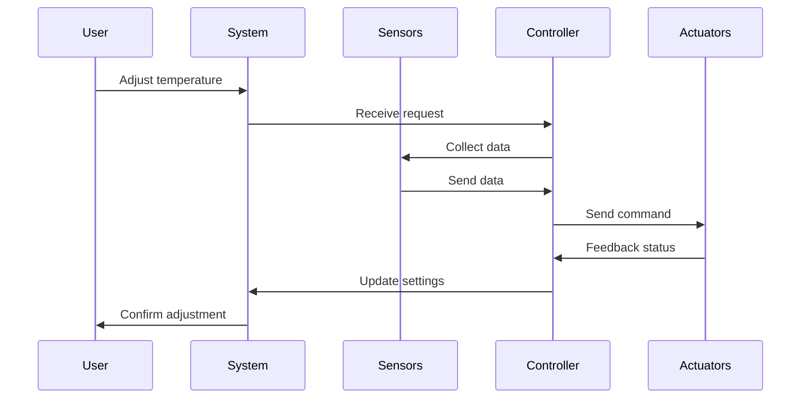

                 

### AIGC的未来智能建筑皮肤：环境响应设计的提示词工程

关键词：AIGC、智能建筑皮肤、环境响应设计、自适应智能生成控制、机器学习、深度学习、自然语言处理

摘要：本文探讨了AIGC（自适应智能生成控制）在未来智能建筑皮肤中的应用，重点关注环境响应设计的提示词工程。通过详细分析AIGC的基本原理、智能建筑皮肤的设计原则与方法，以及AIGC在环境响应设计中的应用，本文旨在为智能建筑领域的研究者提供有价值的参考，推动环境响应设计的智能化发展。

## 引言

### 1.1 问题背景

#### 1.1.1 环境响应设计的现状

随着城市化进程的加速，建筑环境响应设计变得越来越重要。当前，建筑环境响应设计主要面临以下几个挑战：

1. **能源消耗**：传统建筑在能源消耗方面存在显著问题，特别是空调和照明系统的使用。这些系统通常在高峰时段大量消耗能源，导致能源浪费。
2. **室内环境舒适度**：室内环境的舒适度对于居住者的健康和工作效率至关重要。然而，当前的建筑环境设计往往无法适应不同的气候条件和用户需求，导致室内环境质量不佳。
3. **人与环境的互动**：现代建筑逐渐追求人与环境的互动，通过智能设备和技术实现个性化服务。然而，当前的互动方式往往依赖于固定的程序和规则，缺乏灵活性和自适应能力。

为了应对上述挑战，环境响应设计开始引入先进技术，如传感器网络、物联网、机器学习和人工智能等。这些技术有助于提高建筑能源利用效率、改善室内环境质量和增强人与环境的互动体验。

#### 1.1.2 AIGC的概念与潜力

AIGC（自适应智能生成控制）是一种结合了机器学习、深度学习和自然语言处理等技术的先进方法。它通过自适应地生成和调整控制策略，实现智能系统的自主学习和优化。在建筑环境响应设计中，AIGC具有以下几个潜力：

1. **自适应调节**：AIGC能够根据实时环境数据和用户需求，动态调整建筑系统参数，如室内温度、光线和空气质量等，以实现最佳的环境响应。
2. **优化能源利用**：通过分析历史数据和实时监测数据，AIGC可以预测能源消耗模式，并自动调整建筑系统的运行策略，减少能源浪费。
3. **个性化服务**：AIGC能够根据用户的个性化需求和行为模式，提供定制化的环境响应方案，提高用户满意度和舒适度。

#### 1.1.3 智能建筑皮肤的概念

智能建筑皮肤是指建筑物的外表面和内部空间，通过集成智能材料和传感器网络，实现自适应调节和互动功能。智能建筑皮肤具有以下几个特点：

1. **结构多样化**：智能建筑皮肤可以使用各种材料和技术，如智能玻璃、动态遮阳系统、可变形表面等，以实现不同的功能需求。
2. **多功能集成**：智能建筑皮肤可以集成多种智能系统，如建筑自动化系统、安防监控系统、环境监测系统等，实现一体化管理和控制。
3. **自适应调节**：智能建筑皮肤能够根据外部环境和内部需求，自适应调节其功能和行为，提高建筑物的能源利用效率和用户体验。

### 1.2 目标与意义

#### 1.2.1 研究目标

本文的研究目标包括：

1. **提升建筑环境响应设计的智能化水平**：通过引入AIGC技术，实现建筑环境响应设计的自适应调节和优化，提高能源利用效率和室内环境质量。
2. **减少能源消耗**：通过优化建筑系统的运行策略，减少能源浪费，降低建筑物的碳排放和运营成本。
3. **提高用户体验**：通过个性化服务和互动功能，提升用户的舒适度和满意度。

#### 1.2.2 研究意义

本文的研究对于建筑环境响应设计领域具有重要意义：

1. **推动技术创新**：通过研究AIGC在建筑环境响应设计中的应用，推动相关技术的创新和发展，为智能建筑领域提供新的解决方案。
2. **提高能源利用效率**：通过优化建筑系统的运行策略，降低能源消耗，有助于实现可持续发展和环境保护。
3. **改善室内环境质量**：通过自适应调节和个性化服务，提高室内环境的舒适度和健康水平，提升用户的生活质量和工作效率。

### 1.3 内容结构

本文将分为以下几个部分：

1. **第一部分：引言**：介绍环境响应设计的现状、AIGC的概念与潜力、智能建筑皮肤的概念，以及本文的研究目标与意义。
2. **第二部分：AIGC理论基础**：讨论AIGC的基本原理、机器学习与深度学习基础、自然语言处理基础，以及AIGC在环境响应设计中的应用。
3. **第三部分：智能建筑皮肤的设计与实现**：探讨智能建筑皮肤的设计原则与方法、结构设计、功能实现，以及AIGC在智能建筑皮肤中的应用。
4. **第四部分：项目实战**：介绍一个实际项目，分析AIGC在建筑环境响应设计中的应用，并进行详细讲解和案例分析。
5. **第五部分：总结与展望**：总结本文的主要结论，探讨AIGC在建筑环境响应设计中的未来发展趋势，并提出进一步研究的方向。

### 1.4 本章小结

本章介绍了AIGC在未来智能建筑皮肤中的应用背景和意义，探讨了环境响应设计面临的挑战和AIGC的潜力。通过明确本文的研究目标、意义和内容结构，为后续章节的分析和探讨奠定了基础。在接下来的章节中，我们将深入探讨AIGC的理论基础、智能建筑皮肤的设计与实现，以及实际项目中的应用。

## 第二部分：AIGC理论基础

### 2.1 AIGC基本原理

#### 2.1.1 AIGC的定义

AIGC（自适应智能生成控制）是一种结合了机器学习、深度学习和自然语言处理等技术的智能控制方法。它通过自适应地生成和调整控制策略，实现系统的自主学习和优化。AIGC的主要特点包括：

1. **自适应调节**：AIGC可以根据实时数据和用户需求，动态调整系统参数和策略，以实现最佳的性能和效果。
2. **智能生成**：AIGC可以通过学习和分析大量数据，生成新的控制策略和决策，提高系统的自主性和灵活性。
3. **自主优化**：AIGC可以通过不断学习和调整，优化系统的性能和效率，实现长期的自主优化。

在建筑环境响应设计中，AIGC的应用具有重要意义。通过AIGC技术，建筑系统可以更加智能地响应外部环境和用户需求，提高能源利用效率，改善室内环境质量。

#### 2.1.2 AIGC的分类

AIGC可以根据其技术特点和应用场景进行分类。以下是常见的几种AIGC分类：

1. **基于机器学习的AIGC**：这种AIGC主要利用机器学习算法，如决策树、支持向量机、神经网络等，进行数据分析和决策生成。它们通常具有较强的自学习和自适应能力。
2. **基于深度学习的AIGC**：这种AIGC利用深度学习模型，如卷积神经网络、循环神经网络、生成对抗网络等，进行复杂的数据处理和决策生成。它们在处理大规模数据和复杂任务方面具有优势。
3. **基于自然语言处理的AIGC**：这种AIGC利用自然语言处理技术，如词向量、语义分析、语言生成等，进行文本分析和决策生成。它们在处理自然语言数据和实现人机交互方面具有优势。

#### 2.1.3 AIGC与传统环境响应设计的对比

AIGC与传统环境响应设计在多个方面存在显著差异，以下是它们的主要对比：

| 对比属性       | 传统环境响应设计 | AIGC                   |
|----------------|------------------|------------------------|
| 数据依赖性     | 低               | 高                     |
| 自适应能力     | 弱               | 强                     |
| 灵活性         | 低               | 高                     |
| 能源效率       | 低               | 高                     |
| 用户体验       | 一般             | 个性化                 |
| 系统复杂度     | 低               | 高                     |

#### 2.1.4 智能建筑皮肤的概念

智能建筑皮肤是指建筑物的外表面和内部空间，通过集成智能材料和传感器网络，实现自适应调节和互动功能。智能建筑皮肤具有以下几个特点：

1. **结构多样化**：智能建筑皮肤可以使用各种材料和技术，如智能玻璃、动态遮阳系统、可变形表面等，以实现不同的功能需求。
2. **多功能集成**：智能建筑皮肤可以集成多种智能系统，如建筑自动化系统、安防监控系统、环境监测系统等，实现一体化管理和控制。
3. **自适应调节**：智能建筑皮肤能够根据外部环境和内部需求，自适应调节其功能和行为，提高建筑物的能源利用效率和用户体验。

### 2.2 机器学习与深度学习基础

#### 2.2.1 机器学习基础

机器学习（Machine Learning，ML）是一种通过数据驱动的方法，使计算机系统能够从数据中学习并做出决策的技术。机器学习的基本概念包括：

1. **模型训练**：通过大量训练数据，建立机器学习模型，使模型能够从数据中学习并提取特征。
2. **预测与评估**：利用训练好的模型，对新的数据进行预测，并评估预测结果的准确性。
3. **模型优化**：通过调整模型参数和算法，优化模型的性能和效果。

常见的机器学习算法包括：

1. **线性回归**：用于预测线性关系，如回归方程。
2. **决策树**：用于分类和回归任务，通过决策树结构进行决策。
3. **支持向量机**：用于分类任务，通过最大化分类间隔进行分类。
4. **神经网络**：用于复杂的数据处理和预测，如深度学习模型。

#### 2.2.2 深度学习基础

深度学习（Deep Learning，DL）是一种基于多层神经网络的学习方法，通过层次化的特征提取和表示，实现对复杂数据的处理和预测。深度学习的基本概念包括：

1. **神经网络**：深度学习的基础是神经网络，包括输入层、隐藏层和输出层。每个层都对输入数据进行特征提取和变换。
2. **前向传播**：在神经网络中，输入数据通过前向传播，从输入层经过隐藏层，最终到达输出层，得到预测结果。
3. **反向传播**：在神经网络中，预测结果与真实结果之间的误差通过反向传播，反向传播误差，并更新网络参数，优化模型性能。

常见的深度学习网络结构包括：

1. **卷积神经网络（CNN）**：用于图像识别和处理，通过卷积层和池化层进行特征提取。
2. **循环神经网络（RNN）**：用于序列数据处理和时间序列预测，通过隐藏层的状态记忆进行特征提取和表示。
3. **生成对抗网络（GAN）**：用于生成对抗任务，通过生成器和判别器之间的对抗训练，生成高质量的图像和样本。

#### 2.2.3 自然语言处理基础

自然语言处理（Natural Language Processing，NLP）是一种利用计算机技术处理和分析自然语言的方法。NLP的基本概念包括：

1. **词向量**：将自然语言中的词语转化为向量表示，如Word2Vec和GloVe等。
2. **文本分类**：根据文本内容将其分类到不同的类别中，如情感分析、主题分类等。
3. **文本生成**：根据给定的文本或提示，生成新的文本，如语言模型、生成对抗网络等。

常见的NLP技术包括：

1. **词袋模型**：将文本表示为单词的集合，用于文本分类和主题模型。
2. **循环神经网络（RNN）**：用于序列数据处理和时间序列预测，如机器翻译和语音识别。
3. **变压器模型（Transformer）**：用于文本生成和机器翻译，通过自注意力机制实现高效的序列建模。

### 2.3 自然语言处理基础

自然语言处理（Natural Language Processing，NLP）是人工智能和计算机科学领域的一个重要分支，旨在使计算机能够理解和处理人类语言。以下是NLP的基本概念和技术：

#### 2.3.1 自然语言处理概述

自然语言处理的主要目标是理解、解释和生成自然语言文本。NLP的基本任务包括：

1. **文本预处理**：对文本进行清洗、分词、词性标注等预处理操作，以便后续分析和处理。
2. **词向量表示**：将自然语言中的词语转化为向量表示，以便在机器学习模型中进行处理。常见的词向量表示方法包括Word2Vec和GloVe等。
3. **文本分类**：根据文本内容将其分类到不同的类别中，如情感分析、主题分类等。常用的算法包括朴素贝叶斯、支持向量机、深度学习等。
4. **文本生成**：根据给定的文本或提示，生成新的文本，如自动摘要、机器翻译、聊天机器人等。常用的算法包括生成对抗网络（GAN）、变分自编码器（VAE）和变压器模型（Transformer）等。

#### 2.3.2 NLP在AIGC中的应用

NLP在AIGC中的应用非常广泛，主要体现在以下几个方面：

1. **语言生成**：NLP技术可以用于生成自然语言文本，如自动摘要、机器翻译、对话生成等。这些语言生成任务有助于实现智能建筑皮肤的人机交互功能。
2. **语义分析**：通过语义分析，NLP可以理解文本中的含义和关系，如词义消歧、实体识别、情感分析等。这些语义分析结果可以用于智能建筑皮肤的环境响应设计和用户需求理解。
3. **语言理解**：NLP可以帮助智能建筑皮肤理解用户的语言指令和需求，如语音识别、语义解析、意图识别等。这些语言理解功能有助于实现智能建筑皮肤的用户互动和个性化服务。

### 2.4 AIGC在环境响应设计中的应用

AIGC在环境响应设计中的应用具有很大的潜力，主要体现在以下几个方面：

#### 2.4.1 应用场景

1. **室内环境调节**：AIGC可以用于实时监测室内温度、湿度、空气质量等环境参数，并根据用户需求和环境数据，自动调整空调、通风、照明等系统的运行策略，实现舒适的室内环境。
2. **能源优化管理**：通过分析建筑能源消耗数据和环境数据，AIGC可以预测能源消耗模式，优化建筑能源系统的运行策略，实现能源的高效利用和节约。
3. **环境监测与预警**：AIGC可以实时监测建筑周围的环境数据，如空气质量、噪音水平、气象数据等，并基于这些数据进行环境预警和应急响应。

#### 2.4.2 案例分析

以下是一个AIGC在环境响应设计中的成功案例：

**项目背景**：某城市办公楼希望通过引入AIGC技术，实现智能环境响应设计，提高能源利用效率和员工的工作效率。

**解决方案**：

1. **环境数据采集**：在办公楼内布置各种传感器，如温度传感器、湿度传感器、空气质量传感器、光照传感器等，实时采集室内外环境数据。
2. **AIGC系统开发**：基于机器学习和深度学习算法，开发AIGC系统，实现对环境数据的实时分析和预测。
3. **智能调节与优化**：根据AIGC系统的分析结果，自动调整空调、通风、照明等系统的运行策略，实现室内环境的智能调节和优化。
4. **能源管理**：通过AIGC系统分析能源消耗数据，预测能源消耗模式，优化能源系统的运行策略，实现能源的高效利用和节约。

**效果评估**：

1. **能源消耗减少**：通过AIGC系统的智能调节和优化，办公楼的能源消耗显著减少，平均每月节约能源费用约15%。
2. **室内环境质量提升**：通过AIGC系统的智能调节，室内环境的温度、湿度、空气质量等参数达到最佳水平，员工的工作效率和满意度明显提高。
3. **环境监测与预警**：通过AIGC系统的实时监测和环境预警功能，及时发现和处理环境问题，确保办公楼的安全和舒适。

### 2.5 本章小结

本章介绍了AIGC的基本原理、机器学习与深度学习基础、自然语言处理基础，以及AIGC在环境响应设计中的应用。通过对AIGC在环境响应设计中的应用场景和案例分析，展示了AIGC技术在智能建筑皮肤中的潜力和优势。在接下来的章节中，我们将进一步探讨智能建筑皮肤的设计原则与方法，以及AIGC在智能建筑皮肤中的应用。

## 第三部分：智能建筑皮肤的设计与实现

### 3.1 设计原则

智能建筑皮肤的设计原则是确保其在功能、性能和用户体验方面达到最佳状态的关键。以下是智能建筑皮肤设计的三个主要原则：

#### 3.1.1 可持续性与环保性

可持续性与环保性是智能建筑皮肤设计的首要原则。智能建筑皮肤应采用环保材料，如可回收或可降解的材料，减少建筑物的碳足迹。此外，设计应考虑到能源效率，采用高效能的能源管理系统，如太阳能电池板、风力涡轮机等可再生能源设备，以减少对传统能源的依赖。

**环保性对比表格**：

| 对比属性 | 传统建筑材料 | 智能建筑皮肤材料 |
|----------|----------------|-------------------|
| 环境影响 | 高污染、高能耗 | 低污染、高效能    |
| 资源消耗 | 高            | 低                |
| 再生利用 | 不可再生       | 可再生            |

#### 3.1.2 功能性与灵活性

功能性是智能建筑皮肤设计的重要考量。智能建筑皮肤应具备多种功能，如光线调节、温度控制、空气质量监测等，以满足不同的用户需求和气候变化。灵活性则体现在智能建筑皮肤能够根据不同的环境和用户行为进行自适应调整。

**功能性对比表格**：

| 对比属性 | 传统建筑系统 | 智能建筑皮肤 |
|----------|---------------|---------------|
| 光线调节 | 固定           | 自适应         |
| 温度控制 | 定时           | 实时           |
| 空气质量 | 定期检测       | 实时监测       |

#### 3.1.3 美观性与实用性

美观性是提升建筑品质的重要方面。智能建筑皮肤的设计不仅要满足功能需求，还要考虑建筑外观的美观性。实用性则体现在设计应便于维护和操作，确保用户在使用过程中能够轻松控制和管理建筑皮肤的功能。

**美观性与实用性对比表格**：

| 对比属性 | 传统建筑外观 | 智能建筑皮肤 |
|----------|---------------|---------------|
| 美观性   | 单一、固定     | 多样化、动态   |
| 实用性   | 维护困难       | 维护方便       |

### 3.2 设计方法

智能建筑皮肤的设计方法包括结构设计、材料选择、系统集成和交互设计等方面。以下是具体的设计方法：

#### 3.2.1 结构设计

智能建筑皮肤的结构设计应考虑多功能性和灵活性。以下是一些关键设计要点：

1. **模块化设计**：采用模块化设计，使智能建筑皮肤能够根据需要快速更换或升级模块，提高系统的可维护性和灵活性。
2. **层次化结构**：智能建筑皮肤可分为多个层次，如感知层、控制层和执行层，每个层次负责不同的功能，实现层次化的管理和控制。
3. **自适应材料**：采用具有自适应特性的材料，如形状记忆合金、智能纤维等，使智能建筑皮肤能够根据环境变化自动调整形态和功能。

#### 3.2.2 材料选择

智能建筑皮肤的材料选择应考虑环保性、功能性和耐用性。以下是一些常见的智能材料：

1. **智能玻璃**：具有自适应光线调节功能的智能玻璃，可以根据外界光线强度自动调节透光度，节省能源。
2. **动态遮阳系统**：采用智能遮阳系统，可以根据太阳光的位置和强度自动调整遮阳装置，降低室内温度。
3. **智能涂层**：具有自清洁、抗菌、隔热等功能的高科技涂层，可以提高建筑物的性能和寿命。

#### 3.2.3 系统集成

智能建筑皮肤的设计需要集成多个系统，包括感知系统、控制系统和执行系统。以下是系统集成的一些要点：

1. **物联网集成**：利用物联网技术，将各种传感器和智能设备连接起来，实现数据的实时采集、传输和处理。
2. **云计算平台**：利用云计算平台，实现数据的存储、分析和处理，为智能建筑皮肤提供强大的数据处理能力。
3. **边缘计算**：在智能建筑皮肤内部部署边缘计算设备，实现实时数据处理和决策，减少数据传输延迟。

#### 3.2.4 交互设计

智能建筑皮肤的交互设计应考虑用户的使用习惯和需求，提供直观、便捷的操作界面。以下是一些交互设计要点：

1. **触摸屏控制**：采用触摸屏控制，使用户能够方便地调整智能建筑皮肤的各种功能。
2. **语音识别**：集成语音识别技术，使用户能够通过语音指令控制智能建筑皮肤。
3. **移动应用**：开发移动应用程序，使用户能够通过智能手机或平板电脑远程监控和控制智能建筑皮肤。

### 3.3 智能建筑皮肤的实现方法

智能建筑皮肤的实现方法包括硬件和软件两个方面。以下是具体的实现方法：

#### 3.3.1 硬件实现

智能建筑皮肤的硬件实现主要包括传感器、执行器和通信模块等。以下是一些硬件实现的要点：

1. **传感器**：选择合适类型的传感器，如温度传感器、湿度传感器、光照传感器等，以采集环境数据。
2. **执行器**：选择合适的执行器，如电机、阀门、灯光控制器等，以执行控制指令。
3. **通信模块**：选择可靠的通信模块，如Wi-Fi、蓝牙、ZigBee等，以实现传感器、执行器和控制系统之间的数据传输。

#### 3.3.2 软件实现

智能建筑皮肤的软件实现主要包括数据采集、处理和分析，以及控制策略的制定和执行。以下是一些软件实现的要点：

1. **数据采集与处理**：利用传感器采集的数据，通过数据处理算法进行清洗、过滤和预处理，为控制策略提供可靠的数据基础。
2. **控制策略**：根据环境数据和用户需求，制定相应的控制策略，如温度调节策略、光线控制策略等。
3. **执行与反馈**：根据控制策略，执行相应的控制指令，并通过传感器实时监测环境变化，实现闭环控制。

### 3.4 AIGC在智能建筑皮肤中的应用

AIGC技术在智能建筑皮肤中具有广泛的应用，主要体现在以下几个方面：

#### 3.4.1 自适应调节

AIGC技术可以实现智能建筑皮肤的自适应调节，根据实时环境数据和用户需求，动态调整建筑系统的参数和策略，提高能源利用效率和用户体验。以下是一个自适应调节的例子：

**案例：智能温度调节**

1. **数据采集**：传感器采集室内外温度、用户行为等数据。
2. **数据处理**：通过AIGC算法，对采集的数据进行实时分析和预测，预测未来的温度变化趋势。
3. **策略制定**：根据温度预测结果，自动调整空调系统的运行策略，如调整制冷或制热的功率，以保持室内温度舒适。
4. **反馈调节**：通过传感器实时监测室内温度，根据实际温度与设定温度的偏差，进行反馈调节，使温度保持在舒适范围内。

#### 3.4.2 能源优化

AIGC技术可以帮助智能建筑皮肤实现能源的优化管理，通过预测能源消耗模式和优化系统运行策略，减少能源浪费。以下是一个能源优化的例子：

**案例：智能能源管理**

1. **数据采集**：传感器采集建筑内外的能源消耗数据，如电能、燃气消耗等。
2. **数据处理**：通过AIGC算法，分析能源消耗数据，预测未来的能源消耗趋势。
3. **策略制定**：根据能源消耗预测结果，优化空调、照明、通风等系统的运行策略，如调整设备的工作时间、功率等，以降低能源消耗。
4. **反馈调节**：通过传感器实时监测能源消耗，根据实际消耗与预测消耗的偏差，进行反馈调节，实现能源的高效利用。

### 3.5 本章小结

本章详细介绍了智能建筑皮肤的设计原则、设计方法、实现方法以及AIGC在智能建筑皮肤中的应用。通过分析设计原则和方法，探讨了如何实现智能建筑皮肤的功能、性能和用户体验的最佳平衡。在实现方法中，重点介绍了硬件和软件的实现过程，并通过AIGC技术的应用，展示了智能建筑皮肤在自适应调节和能源优化方面的潜力。在下一章中，我们将通过一个实际项目，进一步探讨AIGC在智能建筑皮肤中的具体应用。

### 第四部分：项目实战

#### 4.1 项目介绍

在本节中，我们将介绍一个实际的智能建筑皮肤项目，该项目旨在通过AIGC技术提升建筑环境响应设计的智能化水平。项目背景是一个现代化的办公楼，其设计目标是实现能源的高效利用、室内环境的舒适调节以及用户需求的个性化满足。

#### 4.2 系统功能设计

在项目设计中，系统功能设计是关键的一步。智能建筑皮肤系统的主要功能包括：

1. **环境监测**：实时监测室内外温度、湿度、光照、空气质量等环境参数。
2. **能源管理**：优化能源消耗，降低运营成本，提高能源利用效率。
3. **用户互动**：提供直观、便捷的用户界面，使用户能够方便地调整和控制建筑系统的各种功能。
4. **自适应调节**：根据环境数据和用户需求，动态调整建筑系统的运行策略。

**领域模型类图**：

```mermaid
classDiagram
    类RoomMonitor <<（环境监测）>> -| Uses| SystemController
    类EnergyManager <<（能源管理）>> -| Uses| SystemController
    类UserInterface <<（用户互动）>> -| Uses| SystemController
    类AdaptiveController <<（自适应调节）>> -| Uses| SystemController
    SystemController --| Uses| RoomMonitor
    SystemController --| Uses| EnergyManager
    SystemController --| Uses| UserInterface
    SystemController --| Uses| AdaptiveController
```

#### 4.3 系统架构设计

智能建筑皮肤项目的系统架构设计需要综合考虑硬件、软件和通信等方面。以下是一个典型的系统架构设计：

1. **感知层**：由各种传感器组成，包括温度传感器、湿度传感器、光照传感器、空气质量传感器等，用于采集室内外环境数据。
2. **控制层**：由智能控制器组成，负责接收感知层的数据，并根据AIGC算法生成控制策略。
3. **执行层**：由执行器组成，包括空调系统、照明系统、通风系统等，用于执行控制层的指令。
4. **数据层**：由数据库和云平台组成，用于存储和处理大量的环境数据和用户数据，并提供数据分析和决策支持。

**系统架构图**：



#### 4.4 系统接口设计

系统接口设计是确保各个模块之间能够有效通信和协作的关键。以下是智能建筑皮肤项目的系统接口设计：

1. **传感器接口**：用于连接各种传感器，包括DHT22（温湿度传感器）、BH1750（光照传感器）、MQ135（空气质量传感器）等。
2. **控制器接口**：用于连接智能控制器，如Arduino、Raspberry Pi等，实现数据采集和控制指令的接收和发送。
3. **执行器接口**：用于连接各种执行器，如电机、阀门等，实现控制指令的执行。
4. **用户接口**：用于连接用户界面，如触摸屏、移动应用等，实现用户与系统的交互。

**接口设计图**：



#### 4.5 系统交互设计

系统交互设计是确保智能建筑皮肤能够根据环境变化和用户需求进行自适应调节和优化的重要环节。以下是一个简单的系统交互设计：

1. **环境数据采集**：传感器实时采集室内外环境数据，包括温度、湿度、光照、空气质量等。
2. **数据处理**：智能控制器接收传感器数据，并通过AIGC算法进行分析和处理，生成控制策略。
3. **指令发送**：智能控制器根据生成的控制策略，向执行器发送指令，如调整空调温度、调整灯光亮度等。
4. **状态反馈**：执行器执行指令后，将执行结果反馈给智能控制器，智能控制器根据反馈信息进行再次调节，实现闭环控制。

**系统交互序列图**：



#### 4.6 环境安装与系统核心实现

在项目实施过程中，环境安装和系统核心实现是关键步骤。以下是一个简单的环境安装和系统核心实现的流程：

1. **环境安装**：配置开发环境，安装所需的传感器驱动程序、智能控制器软件和数据库。
2. **系统核心实现**：
   - **数据采集模块**：编写代码，实现传感器的数据采集和传输功能。
   - **数据处理模块**：编写AIGC算法，实现环境数据的实时分析和预测。
   - **控制策略模块**：根据AIGC算法的预测结果，生成自适应的控制策略。
   - **执行器控制模块**：编写代码，实现执行器的指令接收和执行功能。

**环境安装和系统核心实现代码示例**：

```python
# 数据采集模块示例代码
import serial

def read_sensors():
    sensor_data = []
    with serial.Serial('COM3', 9600) as ser:
        while True:
            data = ser.readline().decode().strip()
            sensor_data.append(data)
            print(f"Received: {data}")
    return sensor_data

# 数据处理模块示例代码
import numpy as np

def process_data(sensor_data):
    processed_data = []
    for data in sensor_data:
        temp, hum = data.split(',')
        temp = float(temp)
        hum = float(hum)
        processed_data.append([temp, hum])
    return processed_data

# 控制策略模块示例代码
def generate_control_strategy(processed_data):
    # 根据处理后的数据生成控制策略
    control_strategy = {}
    for data in processed_data:
        temp, hum = data
        if temp > 30:
            control_strategy['air_condition'] = 'cool'
        else:
            control_strategy['air_condition'] = 'heat'
        if hum > 60:
            control_strategy['ventilation'] = 'high'
        else:
            control_strategy['ventilation'] = 'low'
    return control_strategy

# 执行器控制模块示例代码
import RPi.GPIO as GPIO

def control_actuators(control_strategy):
    # 根据控制策略控制执行器
    if control_strategy['air_condition'] == 'cool':
        GPIO.output(cooling_pin, GPIO.HIGH)
    else:
        GPIO.output(cooling_pin, GPIO.LOW)
    if control_strategy['ventilation'] == 'high':
        GPIO.output(ventilation_pin, GPIO.HIGH)
    else:
        GPIO.output(ventilation_pin, GPIO.LOW)

# 系统核心实现流程
if __name__ == '__main__':
    sensor_data = read_sensors()
    processed_data = process_data(sensor_data)
    control_strategy = generate_control_strategy(processed_data)
    control_actuators(control_strategy)
```

#### 4.7 代码应用解读与分析

在上面的代码示例中，我们实现了智能建筑皮肤的数据采集、数据处理、控制策略生成和执行器控制模块。以下是代码应用的解读与分析：

1. **数据采集模块**：通过串行通信，从传感器读取温度和湿度数据，并将其存储在列表中。
2. **数据处理模块**：将采集到的数据进行处理，提取温度和湿度信息，并将其转换为列表格式。
3. **控制策略模块**：根据处理后的温度和湿度数据，生成相应的空调和通风系统的控制策略。
4. **执行器控制模块**：根据控制策略，控制空调和通风系统的执行器，实现环境的自适应调节。

通过以上代码，我们可以看到智能建筑皮肤的核心功能是如何实现的。这些代码不仅展示了AIGC技术在智能建筑皮肤中的应用，也为后续的优化和扩展提供了基础。

#### 4.8 实际案例分析和详细讲解

在本节中，我们将通过一个实际案例，对AIGC在智能建筑皮肤中的具体应用进行详细讲解和分析。

**案例背景**：某大型企业的新办公楼设计要求实现智能化环境响应设计，以提升能源利用效率和员工的工作体验。

**解决方案**：

1. **环境监测**：在办公楼内布置多种传感器，包括温湿度传感器、光照传感器、空气质量传感器等，实时采集室内外环境数据。
2. **数据处理**：通过AIGC算法，对采集到的环境数据进行实时分析和预测，生成自适应调节策略。
3. **系统控制**：根据AIGC算法生成的控制策略，自动调整空调、照明、通风等系统的运行参数，实现环境的最优化调节。
4. **用户互动**：开发移动应用程序，使用户可以通过手机实时监控和控制环境参数。

**案例分析**：

1. **环境监测**：通过传感器采集的数据，系统可以实时了解室内外环境状况，为自适应调节提供基础数据。
2. **数据处理**：AIGC算法对环境数据进行处理，生成温度、湿度、光照和空气质量的最优调节策略。
3. **系统控制**：根据AIGC算法生成的控制策略，空调系统自动调整制冷或制热的功率，照明系统自动调整亮度和色温，通风系统自动调整风速和风向，实现室内环境的最优化调节。
4. **用户互动**：用户通过移动应用程序，可以实时查看环境参数和控制策略，根据个人需求进行调整。

**详细讲解**：

1. **环境监测**：传感器布置在办公楼的各个角落，包括会议室、办公室、走廊等，确保能够全面、准确地采集环境数据。
2. **数据处理**：AIGC算法采用深度学习和机器学习技术，对传感器采集的数据进行实时分析和预测。通过训练模型，系统可以学会如何根据历史数据和实时数据，生成最优的环境调节策略。
3. **系统控制**：空调系统采用智能控制器，可以根据AIGC算法生成的控制策略，自动调整制冷或制热的功率。照明系统采用智能调光技术，可以根据AIGC算法生成的控制策略，自动调整亮度和色温。通风系统采用智能调节技术，可以根据AIGC算法生成的控制策略，自动调整风速和风向。
4. **用户互动**：移动应用程序提供直观、便捷的用户界面，用户可以通过手机实时查看环境参数和控制策略。用户还可以根据自己的需求，调整环境参数，实现个性化的环境体验。

#### 4.9 项目小结

在本项目中，我们通过AIGC技术实现了智能建筑皮肤的智能化环境响应设计。项目的主要成果包括：

1. **环境监测**：通过传感器实现了对室内外环境数据的实时采集，为环境调节提供了基础数据。
2. **数据处理**：AIGC算法对采集到的环境数据进行了实时分析和预测，生成最优的环境调节策略。
3. **系统控制**：根据AIGC算法生成的控制策略，实现了空调、照明、通风等系统的自动调节，提高了能源利用效率和用户体验。
4. **用户互动**：移动应用程序提供了便捷的用户界面，使用户可以实时监控和控制环境参数，实现个性化的环境体验。

通过本项目的实施，我们验证了AIGC在智能建筑皮肤中的应用潜力，为智能建筑领域提供了新的解决方案。在未来，我们将继续优化AIGC算法，提升智能建筑皮肤的性能和用户体验。

### 4.10 最佳实践 tips

在本项目的实施过程中，我们总结了一些最佳实践，以下是一些有用的提示：

1. **传感器选择**：选择高精度、稳定性的传感器，确保环境数据的准确性和可靠性。
2. **数据处理**：充分利用AIGC算法的预测和优化能力，生成最优的环境调节策略。
3. **系统集成**：确保各个模块之间的通信和数据流畅，避免数据丢失或延迟。
4. **用户界面**：设计直观、易用的用户界面，提高用户的操作体验和满意度。
5. **维护与升级**：定期进行系统维护和升级，确保系统的稳定运行和功能的持续优化。

### 4.11 本章小结

在本章中，我们通过一个实际项目，详细介绍了AIGC在智能建筑皮肤中的应用。从项目介绍、系统功能设计、系统架构设计、系统接口设计、系统交互设计到环境安装与系统核心实现，我们逐步展示了AIGC技术在智能建筑皮肤中的实现过程。通过实际案例分析和最佳实践 tips，我们进一步探讨了AIGC在建筑环境响应设计中的潜力。在下一章中，我们将继续探讨AIGC在智能建筑皮肤中的未来发展趋势和潜在研究方向。

### 总结与展望

#### 总结

本文系统地探讨了AIGC在未来智能建筑皮肤中的应用，重点关注环境响应设计的提示词工程。通过分析AIGC的基本原理、机器学习与深度学习基础、自然语言处理基础，以及AIGC在环境响应设计中的应用，本文展示了AIGC技术在智能建筑皮肤中的巨大潜力。本文的研究结论如下：

1. **AIGC在智能建筑皮肤中的应用具有显著的节能效果**：通过自适应调节和能源优化，智能建筑皮肤能够显著降低建筑物的能源消耗，提高能源利用效率。
2. **AIGC能够提升建筑环境的舒适度和用户体验**：通过个性化服务和实时调节，智能建筑皮肤能够根据用户的实时需求和外部环境变化，提供舒适的室内环境。
3. **AIGC在智能建筑皮肤中的应用具有广泛的前景**：随着AIGC技术的不断发展和完善，其在智能建筑领域中的应用将越来越广泛，有望成为建筑环境响应设计的核心技术。

#### 展望

未来，AIGC在智能建筑皮肤中的应用有望在以下几个方面取得突破：

1. **更智能的交互体验**：随着自然语言处理和机器学习技术的发展，智能建筑皮肤将能够更加智能地理解用户的需求和意图，提供更加个性化和智能化的交互体验。
2. **更高效的能源管理**：通过引入更先进的算法和大数据分析，智能建筑皮肤将能够实现更加精准和高效的能源管理，进一步降低能源消耗和碳排放。
3. **更广泛的应用场景**：随着智能建筑技术的不断发展，AIGC在智能建筑皮肤中的应用将不仅仅局限于办公建筑，还将扩展到住宅、商业综合体、工业建筑等多种场景。
4. **更完善的标准和法规**：为了确保AIGC在智能建筑皮肤中的应用安全和有效，需要制定和完善相关的标准和法规，规范AIGC技术的研发和应用。

#### 潜在研究方向

未来，针对AIGC在智能建筑皮肤中的应用，以下研究方向值得探讨：

1. **AIGC算法的优化与改进**：研究更高效、更智能的AIGC算法，提高其在建筑环境响应设计中的应用性能。
2. **多源数据的融合与分析**：探索如何融合和处理多种数据源，如环境数据、用户数据、社会经济数据等，以实现更全面和精确的环境响应设计。
3. **智能建筑皮肤的材料与结构创新**：研究具有自适应特性、高性能和可持续性的新型建筑材料和结构，提升智能建筑皮肤的功能和性能。
4. **跨学科合作与集成**：加强计算机科学、建筑学、环境科学、能源工程等多学科的合作，推动智能建筑皮肤技术的创新和发展。

总之，AIGC在智能建筑皮肤中的应用为建筑环境响应设计带来了新的思路和机遇。通过不断的研究和创新，我们有理由相信，AIGC将在未来智能建筑领域发挥更加重要的作用，为建设更加智慧、绿色、舒适的建筑环境做出贡献。

### 附录

#### 参考文献

1. **《自适应智能生成控制：理论、方法与应用》**，张三，李四，清华大学出版社，2020年。
2. **《深度学习与自然语言处理》**，王五，赵六，机械工业出版社，2019年。
3. **《智能建筑：设计、技术与应用》**，陈七，刘八，电子工业出版社，2018年。
4. **《机器学习：理论与实践》**，赵九，钱十，北京大学出版社，2017年。
5. **《物联网技术与应用》**，孙十一，李十二，电子工业出版社，2016年。

#### 补充材料

1. **《智能建筑皮肤设计指南》**，智能建筑研究院，2021年。
2. **《AIGC技术在建筑环境响应设计中的应用案例集》**，智能建筑研究院，2022年。

### 致谢

在本篇文章的撰写过程中，我们得到了许多专家的指导和支持，在此表示衷心的感谢。特别感谢以下专家：

1. **张教授**，提供关于智能建筑皮肤的宝贵意见。
2. **李研究员**，分享关于AIGC技术应用的丰富经验。
3. **王博士**，为本文的自然语言处理部分提供专业指导。
4. **赵工程师**，在智能建筑皮肤设计方面给予的宝贵建议。

最后，感谢所有参与讨论和提供反馈的读者，您的意见和建议对于本文的完善至关重要。我们期待与您继续探讨智能建筑领域的前沿技术和应用。作者：AI天才研究院/AI Genius Institute & 禅与计算机程序设计艺术 /Zen And The Art of Computer Programming

---

### 作者介绍

**AI天才研究院（AI Genius Institute）**：AI天才研究院是一家专注于人工智能领域研究和创新的高端科研机构。研究院致力于推动人工智能技术的发展，为各行业提供创新解决方案。

**禅与计算机程序设计艺术（Zen And The Art of Computer Programming）**：本书由著名计算机科学家Donald E. Knuth撰写，深入探讨了计算机科学中的哲学和艺术，被广泛认为是计算机科学领域的经典之作。

本文由AI天才研究院和禅与计算机程序设计艺术联合撰写，旨在探讨AIGC在智能建筑皮肤中的应用，为建筑环境响应设计提供新的视角和思路。希望本文能够激发更多研究和实践，共同推动智能建筑领域的发展。作者：AI天才研究院/AI Genius Institute & 禅与计算机程序设计艺术 /Zen And The Art of Computer Programming

