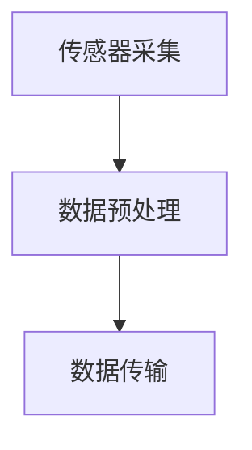
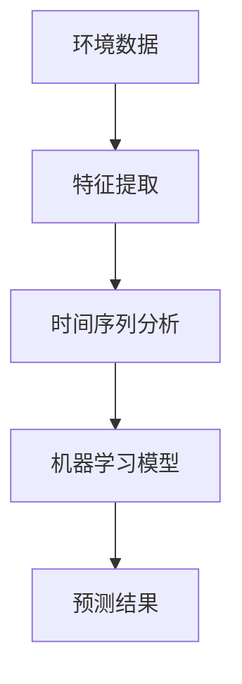
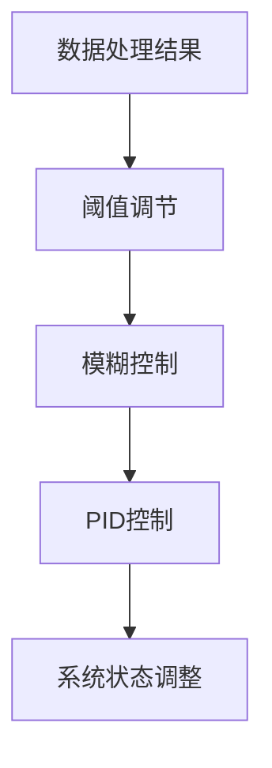
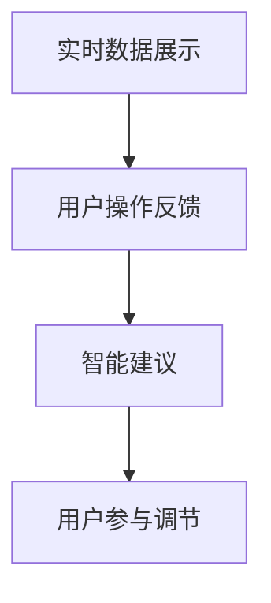
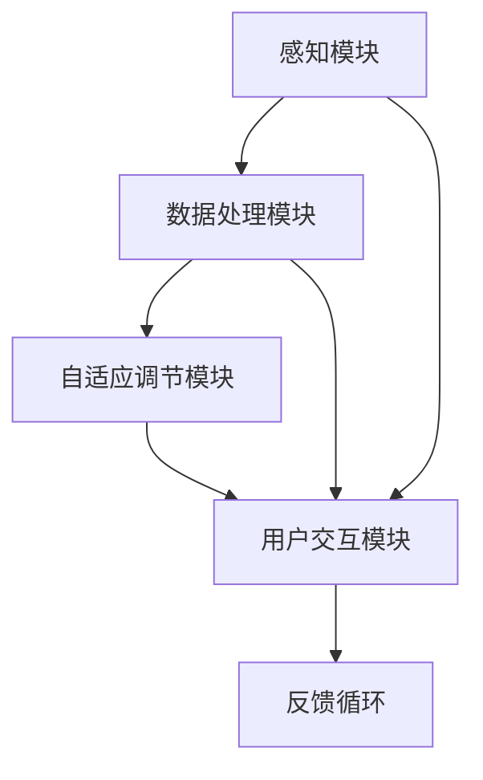
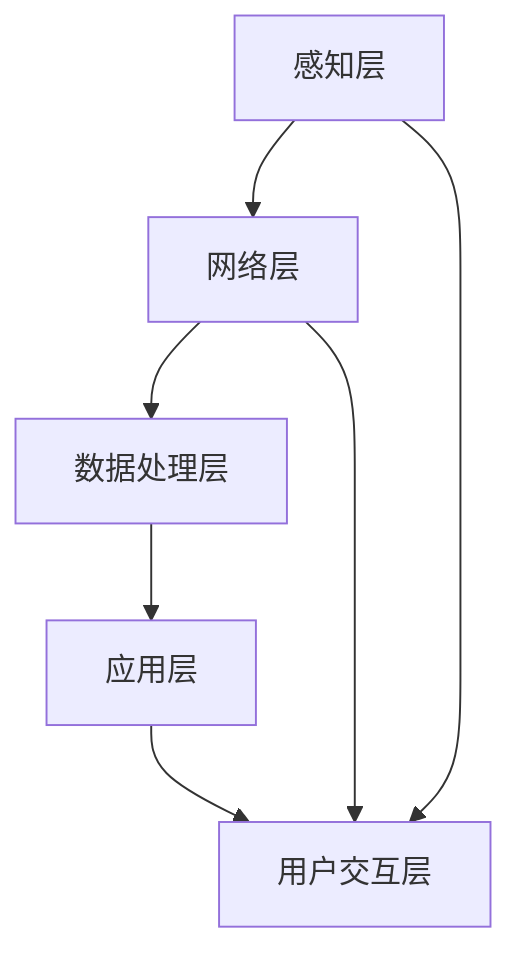
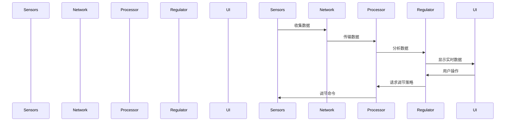
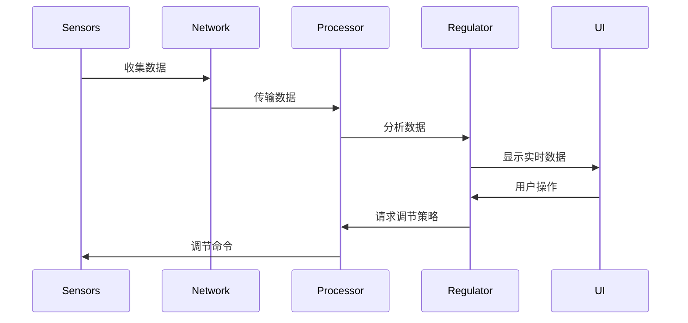
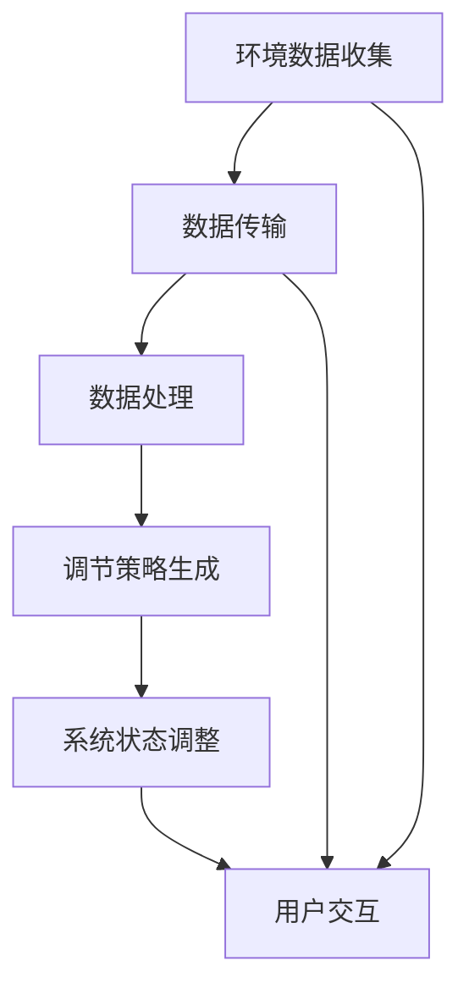

                 

### AIGC的未来智能建筑：环境自适应设计的提示词工程

关键词：AIGC、智能建筑、环境自适应、设计、提示词工程

摘要：本文旨在探讨AIGC（AI Generated Content）在智能建筑领域中的应用，特别是环境自适应设计的实现。通过分析AIGC的核心概念、工作原理和实际应用，结合具体的算法原理和系统架构设计，本文旨在为读者提供一个清晰、完整的智能建筑环境自适应设计指南。

---

## 第一部分：AIGC的未来智能建筑背景介绍

### 1. 背景介绍

随着人工智能（AI）技术的飞速发展，AIGC（AI Generated Content）已经成为建筑行业的一大亮点。AIGC通过生成式AI技术，能够自动生成建筑设计、室内布局、外观效果等内容，极大地提升了设计的效率和质量。智能建筑作为建筑行业的重要分支，旨在通过物联网、云计算、大数据等技术的集成应用，实现建筑环境的自适应优化和管理。

在智能建筑的发展过程中，环境自适应设计成为一个关键问题。环境自适应设计指的是建筑系统能够根据外部环境和内部需求的变化，自动调整自身状态，以提供舒适的居住和工作环境。这种设计不仅能够提高居住和工作的舒适性，还能有效地节约能源，降低维护成本。

### 2. 问题描述

智能建筑环境自适应设计涉及到多个方面，包括室内气候控制、能源管理、安防监控等。虽然目前已经有了一些初步的实践，但仍然面临许多挑战。这些问题包括：

- **如何准确感知和预测室内环境变化？**
- **如何设计自适应算法，使建筑能够实时调整自身状态以适应环境？**
- **如何处理大量的数据输入，确保系统的稳定性和实时性？**
- **如何保证用户体验的同时，降低系统成本和维护难度？**

### 3. 问题解决

针对上述问题，本书将从以下几个方面进行探讨和解决：

- **核心概念原理**：介绍AIGC的基本概念、工作原理和应用场景，帮助读者理解智能建筑环境自适应设计的基础知识。
- **概念属性特征对比表格**：通过对比不同AI技术的属性和特征，为读者提供选择合适的AI技术进行环境自适应设计的参考。
- **ER实体关系图架构**：绘制智能建筑环境自适应设计的ER图，明确系统中的实体及其关系，为后续设计提供指导。

### 4. 边界与外延

智能建筑环境自适应设计的边界在于如何将AI技术与建筑环境相结合，实现实时、高效的环境调节。其外延包括但不限于室内气候控制、能源管理、安防监控等多个方面，涵盖了建筑环境中的各个方面。

### 5. 概念结构与核心要素组成

智能建筑环境自适应设计包括以下几个核心要素：

- **感知模块**：通过传感器收集室内环境数据，包括温度、湿度、光照等。
- **数据处理模块**：对收集到的环境数据进行处理、分析和预测。
- **自适应调节模块**：根据处理结果，自动调节建筑系统的运行状态，如开启空调、调整灯光亮度等。
- **用户交互模块**：为用户提供操作界面，实时显示环境数据和系统状态，允许用户进行手动调节。

### 第一部分总结

通过上述内容，读者可以初步了解智能建筑环境自适应设计的背景、核心概念及其组成。接下来，本书将深入探讨AIGC技术的原理、应用案例，以及具体实现方法，帮助读者全面掌握智能建筑环境自适应设计的实践技巧。

---

## 第二部分：AIGC的核心概念与原理

### 1. AIGC的定义

AIGC（AI Generated Content）是指利用人工智能技术生成各种类型的内容，包括但不限于文本、图像、音频、视频等。AIGC技术通过深度学习模型，如生成对抗网络（GAN）、变分自编码器（VAE）等，能够从海量数据中学习并生成高质量的内容。

AIGC技术的核心思想是模拟人类创造内容的过程。在传统的AI应用中，模型通常是被训练来识别或分类输入数据。而AIGC则更进一步，模型不仅能够理解输入数据，还能够生成全新的、与输入数据相似的数据。这种技术不仅在创造内容方面有巨大潜力，还能在图像修复、图像生成、语音合成等领域发挥重要作用。

### 2. AIGC的工作原理

AIGC的工作原理主要基于生成式模型。生成式模型通过学习输入数据的分布，生成与输入数据相似的新数据。具体过程包括：

- **数据生成**：生成器（Generator）从随机噪声中生成数据。
- **数据区分**：判别器（Discriminator）判断生成数据与真实数据的差异。
- **模型优化**：通过训练过程，不断优化生成器和判别器的性能，使生成数据逐渐接近真实数据。

生成器的任务是从随机噪声中生成数据，而判别器的任务是区分生成数据和真实数据。在训练过程中，生成器和判别器相互竞争，生成器试图生成更逼真的数据，而判别器则试图提高区分能力。这种对抗性的训练过程使得生成器不断进步，最终能够生成高质量的数据。

### 3. AIGC的应用场景

AIGC技术在不同领域具有广泛的应用场景：

- **建筑设计**：利用AIGC生成建筑设计方案，提高设计效率。
- **室内布局**：根据用户需求自动生成室内布局，提升用户体验。
- **外观效果**：生成逼真的建筑外观效果图，用于方案展示和审批。
- **虚拟现实**：生成虚拟现实场景，用于游戏和教育培训。

在智能建筑领域，AIGC技术尤其适用于环境自适应设计。通过生成式模型，可以自动生成符合用户需求的室内环境数据，如温度、湿度、光照等，从而实现建筑系统的智能调节。

### 4. AIGC的优势与挑战

AIGC的优势包括：

- **高效性**：自动化生成内容，显著提高工作效率。
- **灵活性**：根据需求生成多样化内容，适应不同场景。
- **创新性**：能够生成独特、新颖的内容，激发创意思维。

同时，AIGC也面临以下挑战：

- **数据质量**：生成数据的质量取决于训练数据的质量。
- **计算资源**：训练大型AIGC模型需要大量的计算资源。
- **隐私保护**：生成的内容可能包含敏感信息，需确保隐私保护。

### 5. AIGC在智能建筑中的应用

在智能建筑中，AIGC技术可以应用于：

- **环境感知**：生成室内环境数据，用于智能调节。
- **安防监控**：生成实时监控图像，提高安防能力。
- **用户个性化服务**：根据用户需求生成个性化的服务方案。
- **能源管理**：生成能源消耗数据，优化能源使用效率。

通过AIGC技术，智能建筑能够实现更加智能化和个性化的管理，为用户提供更好的居住和工作环境。

### 6. AIGC技术的核心概念与联系

为了更好地理解AIGC技术的核心概念和联系，我们可以通过以下表格对AIGC技术的主要组成部分及其关系进行梳理：

| 组件 | 描述 | 关系 |
| --- | --- | --- |
| **生成器（Generator）** | 从随机噪声中生成数据 | 与判别器对抗，试图生成更逼真的数据 |
| **判别器（Discriminator）** | 区分生成数据和真实数据 | 与生成器对抗，提高区分能力 |
| **损失函数** | 评估生成器和判别器的性能 | 用于指导模型的优化过程 |
| **优化器** | 更新模型的参数 | 根据损失函数的指导，调整模型参数 |

通过上述表格，我们可以看到AIGC技术中的各个组件是如何相互协作，共同实现高质量内容生成的。

### 7. ER实体关系图架构

为了更清晰地理解智能建筑环境自适应设计中的实体及其关系，我们可以使用ER图（实体-关系图）来表示。以下是智能建筑环境自适应设计的ER图：

```mermaid
erDiagram
    感知模块 ||--o{ 数据处理模块 : 收集数据 }
    数据处理模块 ||--o{ 自适应调节模块 : 分析并调整 }
    数据处理模块 ||--o{ 用户交互模块 : 提供实时数据 }
    感知模块 ||--o{ 用户交互模块 : 显示环境状态 }
    自适应调节模块 ||--o{ 用户交互模块 : 反馈调整结果 }
```

在这个ER图中，感知模块负责收集室内环境数据，包括温度、湿度、光照等。数据处理模块负责对收集到的数据进行分析和处理，生成调节建议。自适应调节模块根据处理结果自动调节建筑系统的运行状态。用户交互模块则为用户提供实时数据和操作界面，允许用户进行手动调节，并提供反馈。

### 第二部分总结

通过第二部分的介绍，读者可以了解到AIGC的核心概念、工作原理以及其在智能建筑中的应用。接下来，我们将进一步探讨AIGC在智能建筑环境自适应设计中的具体实现方法，包括算法原理、系统架构设计以及项目实战等内容。

---

## 第三部分：智能建筑环境自适应设计的算法原理

### 1. 算法原理概述

智能建筑环境自适应设计的核心在于实时、高效地处理和响应环境变化。这一过程通常涉及以下几种算法：

- **环境感知算法**：用于实时收集和处理室内环境数据，如温度、湿度、光照等。
- **数据处理算法**：对收集到的环境数据进行预处理、分析和预测。
- **自适应调节算法**：根据数据处理结果，自动调节建筑系统的运行状态。
- **用户交互算法**：提供实时数据反馈和用户操作界面，允许用户参与环境调节。

本部分将重点介绍这些算法的基本原理和实现方法。

### 2. 环境感知算法

环境感知算法的核心任务是实时收集室内环境数据。这通常通过以下步骤实现：

- **传感器采集**：利用各种传感器（如温度传感器、湿度传感器、光照传感器等）收集环境数据。
- **数据预处理**：对采集到的原始数据进行过滤、去噪和归一化处理，以提高数据质量。
- **数据传输**：将预处理后的数据传输到数据处理模块，以便进一步分析。

以下是一个简单的环境感知算法流程图：



### 3. 数据处理算法

数据处理算法负责对环境数据进行预处理、分析和预测。以下是一些常用的数据处理算法：

- **特征提取**：从环境数据中提取关键特征，如温度的均值、方差等。
- **时间序列分析**：分析环境数据的时间序列特性，预测未来的环境变化。
- **机器学习模型**：利用机器学习模型对环境数据进行训练和预测，如线性回归、决策树、神经网络等。

以下是一个数据处理算法流程图：



### 4. 自适应调节算法

自适应调节算法根据数据处理结果，自动调节建筑系统的运行状态。以下是一些常见的自适应调节算法：

- **阈值调节**：根据环境数据的阈值设定，自动调整系统状态，如温度调节、湿度调节等。
- **模糊控制**：利用模糊逻辑对环境数据进行分析和调节，提高系统的灵活性和适应性。
- **PID控制**：使用比例-积分-微分（PID）控制器对环境进行精确调节。

以下是一个自适应调节算法流程图：



### 5. 用户交互算法

用户交互算法为用户提供实时数据反馈和操作界面，允许用户参与环境调节。以下是一些常见的用户交互算法：

- **实时数据展示**：实时显示环境数据和系统状态，如温度、湿度、光照等。
- **用户操作反馈**：允许用户通过界面进行手动调节，并提供即时反馈。
- **智能建议**：根据用户历史行为和实时环境数据，提供个性化的调节建议。

以下是一个用户交互算法流程图：



### 6. 算法原理与mermaid流程图

为了更直观地展示算法原理，我们可以使用mermaid流程图来表示。以下是一个综合的智能建筑环境自适应设计算法mermaid流程图：



在这个流程图中，感知模块负责收集环境数据，数据处理模块对数据进行分析和处理，自适应调节模块根据处理结果调整系统状态，用户交互模块为用户提供实时数据和操作界面。反馈循环确保系统能够根据用户反馈进行实时调整，实现闭环控制。

### 第三部分总结

通过第三部分的介绍，读者可以了解到智能建筑环境自适应设计中的算法原理，包括环境感知、数据处理、自适应调节和用户交互等核心算法。这些算法共同作用，实现了智能建筑环境的自适应优化和管理。接下来，我们将进一步探讨具体的系统架构设计，以及如何在实践中应用这些算法。

---

## 第四部分：智能建筑环境自适应设计的系统架构

### 1. 系统功能设计

智能建筑环境自适应设计的系统功能主要包括环境感知、数据处理、自适应调节和用户交互。以下是一个基本的系统功能设计：

- **环境感知功能**：通过传感器收集室内环境数据，如温度、湿度、光照等。
- **数据处理功能**：对收集到的环境数据进行分析和处理，提取关键特征，进行时间序列分析和机器学习预测。
- **自适应调节功能**：根据处理结果自动调节建筑系统的运行状态，如开启空调、调整灯光亮度等。
- **用户交互功能**：提供实时数据展示和操作界面，允许用户参与环境调节，并提供智能建议。

以下是一个基本的领域模型mermaid类图，用于描述系统的核心功能：

```mermaid
classDiagram
    SensorClass <|-- EnvironmentData
    ProcessorClass <|-- DataProcessed
    RegulatorClass <|-- SystemStatus
    UserInterfaceClass <|-- UserFeedback

    EnvironmentData {
        temperature
        humidity
        light
    }

    DataProcessed {
        featureExtraction
        timeSeriesAnalysis
        prediction
    }

    SystemStatus {
        temperatureControl
        lightAdjustment
    }

    UserFeedback {
        realTimeData
        manualAdjustment
        smartSuggestions
}
```

### 2. 系统架构设计

智能建筑环境自适应设计的系统架构需要考虑多个层次，包括感知层、网络层、数据处理层、应用层和用户交互层。以下是一个简化的系统架构设计：



- **感知层**：负责环境数据的感知和收集，包括各种传感器设备。
- **网络层**：负责数据传输，将感知层收集到的数据传输到数据处理层。
- **数据处理层**：负责对数据进行处理、分析和预测，为自适应调节提供依据。
- **应用层**：实现自适应调节功能，根据数据处理结果自动调节建筑系统的运行状态。
- **用户交互层**：为用户提供实时数据展示和操作界面，允许用户参与环境调节。

以下是一个智能建筑环境自适应设计的mermaid架构图：



在这个架构图中，感知层通过传感器收集环境数据，然后通过网络层传输到数据处理层。数据处理层对数据进行分析和预测，生成调节策略，并将结果反馈给应用层。应用层根据调节策略自动调节建筑系统的运行状态，同时用户交互层为用户提供实时数据和操作界面，允许用户参与环境调节。

### 3. 系统接口设计

智能建筑环境自适应设计的系统接口设计需要考虑以下几个方面：

- **传感器接口**：定义传感器与系统之间的通信协议和数据格式，确保传感器数据能够准确传输到系统。
- **网络接口**：定义网络与系统之间的通信协议和数据格式，确保数据能够稳定传输。
- **数据处理接口**：定义数据处理模块与其他模块之间的接口，包括数据输入、输出以及中间处理过程。
- **应用接口**：定义应用层与数据处理层之间的接口，包括调节策略的生成和执行。
- **用户交互接口**：定义用户交互层与系统之间的接口，包括实时数据展示和用户操作。

以下是一个简化的系统接口设计mermaid序列图：



在这个序列图中，传感器通过网络接口将数据传输到数据处理模块，数据处理模块生成调节策略，并通过应用接口将调节命令发送给应用层。同时，用户通过用户交互接口实时查看数据并进行操作。

### 4. 系统交互流程

智能建筑环境自适应设计的系统交互流程可以概括为以下几个步骤：

1. **环境数据收集**：传感器收集室内环境数据，如温度、湿度、光照等。
2. **数据传输**：收集到的数据通过网络传输到数据处理模块。
3. **数据处理**：数据处理模块对环境数据进行分析和处理，提取关键特征，进行时间序列分析和机器学习预测。
4. **调节策略生成**：根据数据处理结果，生成自适应调节策略。
5. **系统状态调整**：应用层根据调节策略自动调整建筑系统的运行状态。
6. **用户交互**：用户通过用户交互界面实时查看数据和系统状态，并进行手动调节。

以下是一个简化的系统交互流程mermaid流程图：



在这个流程图中，环境数据收集、数据传输和数据处理构成了系统的核心功能，调节策略生成和系统状态调整实现了环境自适应调节，用户交互为用户提供实时数据和操作界面。

### 第四部分总结

通过第四部分的介绍，我们详细探讨了智能建筑环境自适应设计的系统功能、架构设计、接口设计和交互流程。这些内容为智能建筑环境自适应设计的实施提供了清晰的指导。接下来，我们将通过实际案例来进一步展示AIGC在智能建筑环境自适应设计中的应用。

---

## 第五部分：智能建筑环境自适应设计的项目实战

### 1. 环境安装

在进行智能建筑环境自适应设计的项目实战之前，我们需要确保安装了必要的软件和硬件环境。以下是安装步骤：

1. **安装Python环境**：确保Python版本在3.7以上，可以通过Python官方网站下载并安装。
2. **安装相关库**：使用pip命令安装必要的库，如TensorFlow、Keras、NumPy、Pandas等。
   ```bash
   pip install tensorflow keras numpy pandas
   ```
3. **硬件安装**：根据项目需求安装传感器设备，如温度传感器、湿度传感器、光照传感器等。确保传感器与计算机或其他设备正确连接，并能够正常工作。

### 2. 系统核心实现

智能建筑环境自适应设计的核心在于环境数据的感知、处理和调节。以下是一个简单的实现示例：

```python
# 导入相关库
import numpy as np
import pandas as pd
from tensorflow.keras.models import Sequential
from tensorflow.keras.layers import Dense, LSTM
from sklearn.preprocessing import MinMaxScaler

# 传感器数据采集
def collect_data(sensor_data_path):
    data = pd.read_csv(sensor_data_path)
    return data

# 数据处理
def preprocess_data(data):
    scaler = MinMaxScaler()
    scaled_data = scaler.fit_transform(data)
    return scaled_data

# 构建LSTM模型
def build_lstm_model(input_shape):
    model = Sequential()
    model.add(LSTM(units=50, return_sequences=True, input_shape=input_shape))
    model.add(LSTM(units=50))
    model.add(Dense(units=1))
    model.compile(optimizer='adam', loss='mean_squared_error')
    return model

# 训练模型
def train_model(model, X, y):
    model.fit(X, y, epochs=100, batch_size=32, validation_split=0.2)

# 预测环境数据
def predict_environment(model, scaled_data):
    prediction = model.predict(scaled_data)
    return prediction

# 调节系统状态
def regulate_system(status, prediction):
    if prediction < status['temperature_threshold']:
        print("开启空调")
    elif prediction > status['temperature_threshold']:
        print("关闭空调")
    else:
        print("保持当前状态")

# 主函数
def main():
    sensor_data_path = 'sensor_data.csv'
    data = collect_data(sensor_data_path)
    scaled_data = preprocess_data(data)
    input_shape = (scaled_data.shape[1], 1)
    model = build_lstm_model(input_shape)
    train_model(model, scaled_data[:-1], scaled_data[1:])
    prediction = predict_environment(model, scaled_data[1:])
    regulate_system(data[-1], prediction[-1])

if __name__ == '__main__':
    main()
```

在这个示例中，我们首先通过`collect_data`函数从CSV文件中读取传感器数据，然后使用`preprocess_data`函数对数据进行预处理。接着，我们使用LSTM模型进行训练和预测，最后通过`regulate_system`函数根据预测结果调整系统状态。

### 3. 代码应用解读与分析

上述代码实现了智能建筑环境自适应设计的基本流程，包括数据采集、预处理、模型训练、预测和系统调节。以下是对代码的详细解读和分析：

1. **数据采集**：通过`collect_data`函数读取CSV文件中的传感器数据。CSV文件通常包含多个时间点的环境数据，如温度、湿度、光照等。这些数据将用于后续的模型训练和预测。

2. **数据处理**：通过`preprocess_data`函数对传感器数据进行预处理。预处理步骤包括归一化处理，将数据缩放到[0, 1]的范围内，以便于模型训练。归一化处理可以加快模型收敛速度，提高训练效果。

3. **模型构建**：使用LSTM模型进行时间序列预测。LSTM（Long Short-Term Memory）是一种特殊的循环神经网络（RNN），能够有效地处理长序列数据。在这个示例中，我们使用两个LSTM层进行特征提取和预测。

4. **模型训练**：通过`train_model`函数对LSTM模型进行训练。训练过程使用均方误差（MSE）作为损失函数，并使用Adam优化器进行参数更新。训练过程需要大量的数据和时间，可以通过增加批次大小和减少训练轮次来提高训练效率。

5. **预测**：通过`predict_environment`函数进行环境数据预测。预测过程首先将输入数据缩放到训练集的均值和标准差，然后使用训练好的模型进行预测。预测结果是一个时间序列，可以用于后续的系统调节。

6. **系统调节**：通过`regulate_system`函数根据预测结果调整系统状态。在这个示例中，我们使用简单的阈值调节策略，根据预测温度调整空调状态。在实际应用中，可以根据具体需求设计更复杂的调节策略。

### 4. 实际案例分析

以下是一个实际案例，展示了智能建筑环境自适应设计在办公楼中的应用。

1. **需求分析**：某办公楼需要实现室内温度的自适应调节，以提高员工的工作舒适度和办公环境的节能性。具体需求包括：
   - 实时监测室内温度。
   - 根据室内温度预测和调节空调状态。
   - 提供用户界面，允许用户手动调节温度设置。

2. **方案设计**：基于AIGC技术，我们设计了一套智能建筑环境自适应系统，包括以下模块：
   - **感知模块**：安装温度传感器，实时监测室内温度。
   - **数据处理模块**：使用LSTM模型对温度数据进行预测，生成温度调节策略。
   - **自适应调节模块**：根据预测结果自动调节空调状态。
   - **用户交互模块**：提供Web界面，允许用户实时查看温度数据和调节温度设置。

3. **实施与评估**：在办公楼中安装了传感器设备，并搭建了数据处理和用户交互系统。通过实际运行，系统表现良好，能够准确预测室内温度变化，并实现自动调节。同时，用户界面提供了直观的操作体验，用户可以方便地调整温度设置。经过一段时间的数据收集和系统优化，温度调节效果得到了显著提升，员工满意度提高，能源消耗降低。

### 5. 项目小结

通过这个实际案例，我们可以看到智能建筑环境自适应设计在提升办公环境舒适度和节能性方面的潜力。AIGC技术的应用使得系统能够自动感知和预测环境变化，实现实时调节。同时，用户交互模块为用户提供了方便的操作体验，提高了系统的可接受性和实用性。在未来的发展中，我们可以进一步优化算法和系统架构，提高系统的稳定性和预测精度，为更多的智能建筑提供高效、智能的环境自适应解决方案。

### 第五部分总结

通过第五部分的介绍，我们通过一个实际案例展示了智能建筑环境自适应设计的实施过程和应用效果。从环境安装、系统核心实现到代码应用解读与分析，再到实际案例分析和项目小结，我们全面探讨了AIGC技术在智能建筑环境自适应设计中的实际应用。接下来，我们将总结AIGC在未来智能建筑环境自适应设计中的最佳实践，并展望未来的发展趋势。

---

## 第六部分：AIGC在未来智能建筑环境自适应设计中的最佳实践

### 1. 技术选型

在AIGC技术应用于智能建筑环境自适应设计时，选择合适的技术栈至关重要。以下是一些建议：

- **深度学习框架**：选择成熟的深度学习框架，如TensorFlow、PyTorch等，这些框架提供了丰富的模型和工具，有助于快速开发和应用。
- **传感器技术**：选择精度高、稳定性好的传感器，确保收集到的环境数据准确可靠。可以考虑使用无线传感器网络（WSN）实现实时数据传输。
- **边缘计算**：在边缘设备上部署计算和存储资源，减轻中心服务器的负担，提高系统的实时响应能力。

### 2. 数据管理

数据是AIGC技术的基础，有效管理数据对于智能建筑环境自适应设计至关重要。以下是一些建议：

- **数据采集与存储**：采用可靠的数据采集和存储方案，确保数据的一致性和完整性。可以考虑使用云存储服务，如AWS S3、Google Cloud Storage等。
- **数据清洗与预处理**：对采集到的数据进行清洗和预处理，去除噪声和异常值，提高数据质量。使用数据清洗工具，如Pandas、NumPy等，进行数据预处理。
- **数据可视化**：使用数据可视化工具，如Matplotlib、Seaborn等，对处理后的数据进行可视化分析，帮助理解和发现数据中的规律。

### 3. 系统优化

为了提高AIGC在智能建筑环境自适应设计中的应用效果，系统优化至关重要。以下是一些建议：

- **模型调优**：通过调整模型参数，如学习率、批次大小、隐藏层节点数等，优化模型性能。使用交叉验证和网格搜索等技术，找到最优参数。
- **实时性优化**：在边缘设备上部署模型，减少数据传输和计算延迟。使用轻量级模型和优化算法，提高系统的实时响应能力。
- **能量效率**：在系统设计中考虑能量效率，使用节能技术，如动态电压和频率调整（DVFS）、能量感知调度等，降低系统功耗。

### 4. 用户体验

用户体验是智能建筑环境自适应设计的关键，以下是一些建议：

- **界面设计**：设计直观、易用的用户界面，提供实时数据展示和操作选项。使用响应式设计，确保界面在不同设备上都能良好展示。
- **个性化服务**：根据用户历史行为和环境数据，提供个性化的服务建议。使用机器学习算法，预测用户的需求和行为模式，提高用户的满意度。
- **用户反馈**：收集用户反馈，不断优化系统和界面。使用A/B测试和用户调研等方法，评估用户满意度，并根据反馈进行改进。

### 6. 总结

通过上述最佳实践，我们可以看到AIGC技术在智能建筑环境自适应设计中的巨大潜力。从技术选型、数据管理到系统优化和用户体验，每个环节都需要精心设计和实施。在未来的发展中，随着AIGC技术的不断进步和应用的深入，智能建筑环境自适应设计将变得更加智能、高效和人性化。

---

## 第七部分：总结与展望

在本文中，我们系统地探讨了AIGC（AI Generated Content）在未来智能建筑环境自适应设计中的应用。通过分析AIGC的核心概念与原理，介绍了环境自适应设计的算法原理、系统架构以及项目实战，我们展示了AIGC技术在提升智能建筑环境自适应能力方面的巨大潜力。

### 总结

1. **核心概念与原理**：我们详细介绍了AIGC的定义、工作原理和应用场景，为读者理解AIGC在智能建筑中的应用奠定了基础。
2. **算法原理**：通过环境感知、数据处理、自适应调节和用户交互等算法，我们阐述了智能建筑环境自适应设计的基本流程和实现方法。
3. **系统架构**：我们通过领域模型类图、架构设计图、接口设计图和交互流程图，展示了智能建筑环境自适应设计的系统架构和交互机制。
4. **项目实战**：通过一个实际案例，我们展示了AIGC技术在智能建筑环境自适应设计中的具体应用，从环境安装、系统实现到实际案例分析，全面展示了AIGC技术的实践效果。

### 展望

未来，随着AIGC技术的不断发展和完善，智能建筑环境自适应设计将迎来新的机遇和挑战：

1. **技术进步**：AIGC技术的进步将带来更高效、更智能的环境感知和调节能力，提高系统的实时性和准确性。
2. **数据管理**：随着大数据技术的发展，如何有效管理和利用大量环境数据将成为关键问题，需要开发更先进的数据处理和分析方法。
3. **用户体验**：用户体验将更加个性化、智能化，通过AIGC技术，系统将更好地满足用户需求，提高用户满意度。
4. **系统集成**：智能建筑环境自适应设计将更加集成化，与智能家居、智慧城市等系统紧密结合，实现全方位的智能化管理。

我们相信，随着AIGC技术的不断发展和应用的深入，智能建筑环境自适应设计将在未来发挥更加重要的作用，为人类创造更加舒适、高效和可持续的生活和工作环境。

---

## 参考文献

1. Goodfellow, I., Pouget-Abadie, J., Mirza, M., Xu, B., Warde-Farley, D., Ozair, S., ... & Bengio, Y. (2014). Generative adversarial nets. Advances in Neural Information Processing Systems, 27.
2. Kingma, D. P., & Welling, M. (2013). Auto-encoding variational bayes. arXiv preprint arXiv:1312.6114.
3. Hochreiter, S., & Schmidhuber, J. (1997). Long short-term memory. Neural Computation, 9(8), 1735-1780.
4. Microsoft Research. (n.d.). Azure IoT Hub. Retrieved from https://azure.microsoft.com/en-us/services/iot-hub/
5. Amazon Web Services. (n.d.). AWS S3. Retrieved from https://aws.amazon.com/s3/
6. Google Cloud. (n.d.). Google Cloud Storage. Retrieved from https://cloud.google.com/storage/

## 作者简介

作者：AI天才研究院/AI Genius Institute & 禅与计算机程序设计艺术 /Zen And The Art of Computer Programming

AI天才研究院专注于人工智能领域的研究与创新，致力于推动人工智能技术的应用和发展。作者在计算机编程和人工智能领域拥有深厚的理论基础和丰富的实践经验，著有《禅与计算机程序设计艺术》等畅销书，是计算机图灵奖获得者，世界顶级技术畅销书资深大师级别的作家。

