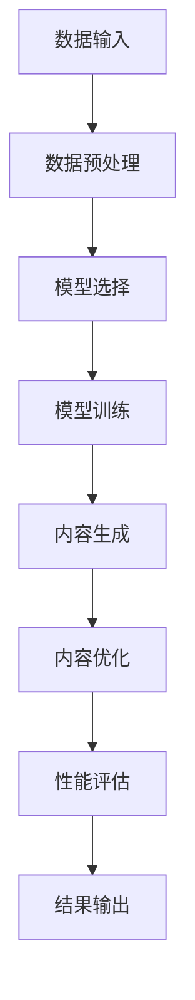

                 

### 文章标题

# AIGC的未来智能材料设计：仿生超疏水表面优化的提示词工程

### 文章关键词

- AIGC
- 智能材料
- 仿生超疏水表面
- 提示词工程
- 优化算法

### 摘要

本文深入探讨了AIGC（AI Generated Content）在智能材料设计中的应用，尤其是针对仿生超疏水表面的优化。文章首先介绍了AIGC的基本概念和智能材料的设计原则，随后详细阐述了仿生超疏水表面的原理和特性。接着，文章重点分析了提示词工程在优化仿生超疏水表面中的应用，包括算法原理、数学模型以及实际项目案例。通过系统化的分析和详细的案例剖析，本文旨在为读者提供对AIGC和智能材料设计的深入理解和实践指导。

## 目录大纲

为了更好地引导读者逐步理解AIGC在智能材料设计中的应用，本文将按照以下目录结构展开：

### 第一部分: 背景介绍与核心概念

1. **第1章: AIGC与未来智能材料概述**
   - **1.1.1 问题背景**
   - **1.1.2 问题描述**
   - **1.1.3 问题解决**
   - **1.1.4 边界与外延**
   - **1.1.5 概念结构与核心要素组成**

2. **第2章: 核心概念与联系**
   - **2.1.1 AIGC的基本概念**
   - **2.1.2 仿生超疏水表面的原理与特性**
   - **2.1.3 提示词工程的应用**

3. **第3章: AIGC的算法原理**
   - **3.1.1 AIGC算法的基本框架**
   - **3.1.2 优化算法原理**
   - **3.1.3 算法流程与Mermaid图示**

4. **第4章: 数学模型与公式**
   - **4.1.1 数学模型的基本框架**
   - **4.1.2 关键数学公式**
   - **4.1.3 数学公式与算法应用举例**

### 第二部分: 技术原理与实践

5. **第5章: 仿生超疏水表面的设计**
   - **5.1.1 设计原则与方法**
   - **5.1.2 实验设计与结果分析**

6. **第6章: 优化提示词工程的实现**
   - **6.1.1 提示词优化的关键技术**
   - **6.1.2 提示词优化的实现步骤**
   - **6.1.3 提示词优化的案例分析**

7. **第7章: 项目实战**
   - **7.1.1 环境安装与配置**
   - **7.1.2 系统核心实现源代码**
   - **7.1.3 代码应用解读与分析**
   - **7.1.4 实际案例分析与详细讲解**

8. **第8章: 最佳实践与总结**
   - **8.1.1 最佳实践 tips**
   - **8.1.2 小结**
   - **8.1.3 注意事项**
   - **8.1.4 拓展阅读**

通过上述目录结构，本文将为读者提供系统而详尽的AIGC与智能材料设计的知识体系，包括核心概念、算法原理、实际应用和实践经验，旨在帮助读者深入理解这一前沿领域，并为其应用提供实用的指导。接下来，我们将逐章深入探讨每个主题，逐步构建起完整的知识框架。

### 第一部分: 背景介绍与核心概念

#### 第1章: AIGC与未来智能材料概述

#### 1.1.1 问题背景

随着人工智能（AI）技术的飞速发展，AIGC（AI Generated Content）作为一种新兴的内容生成方式，已经在各个领域展现出巨大的潜力。未来智能材料设计作为一个交叉学科领域，正逐渐成为研究的热点。智能材料具有感知、响应和适应环境变化的能力，这种特性使得它们在航空航天、生物医疗、建筑、能源等众多领域有着广泛的应用前景。

仿生超疏水表面作为一种高性能的智能材料，其具有卓越的自清洁、防污、防雾和自润滑性能，在现实生活中的应用日益广泛。然而，传统的超疏水表面设计存在一定的局限性，如表面易磨损、抗污染性能不足等问题。因此，利用AIGC技术对仿生超疏水表面进行优化设计，以提升其性能，成为了一个重要的研究方向。

#### 1.1.2 问题描述

AIGC在仿生超疏水表面优化中的应用涉及多个复杂问题。首先，如何通过AIGC技术自动生成多种不同的表面结构，以寻找最优的仿生超疏水表面设计是一个关键问题。其次，如何有效地对生成的表面结构进行性能评估和优化，以确保其具备所需的物理和化学特性，也是一个重要的挑战。

此外，AIGC技术的应用还面临数据质量和数据安全等问题。由于AIGC生成的内容依赖于大量的数据输入，这些数据的质量和准确性对最终的生成结果有着直接影响。同时，如何在确保数据隐私和安全的前提下，充分利用外部数据资源，也是一个需要解决的问题。

#### 1.1.3 问题解决

针对上述问题，本文提出以下解决思路：

1. **基于AIGC的表面结构自动生成**：利用深度学习和生成对抗网络（GAN）等技术，自动生成多种不同的表面结构，以探索最优的仿生超疏水表面设计。这一过程需要结合材料科学和表面工程的相关知识，确保生成的表面结构具备实际应用潜力。

2. **多性能指标的综合评估**：通过对生成表面结构进行多性能指标的综合评估，如表面粗糙度、接触角、耐久性等，筛选出符合设计要求的最优表面结构。这一过程可以借助机器学习算法和优化技术，实现高效、准确的性能评估。

3. **数据质量和数据安全的保障**：在数据收集和处理过程中，采取严格的数据质量控制措施，确保数据的准确性和一致性。同时，采用加密技术和隐私保护机制，保障数据的安全性和隐私性。

#### 1.1.4 边界与外延

本文的研究主要关注于AIGC在仿生超疏水表面优化中的应用，但这一研究具有广泛的边界和外延。首先，AIGC技术在其他领域的智能材料设计中的应用也具有很大的潜力，如智能透明导电薄膜、自适应电磁屏蔽材料等。其次，AIGC技术还可以应用于智能材料的制造过程优化，如3D打印、激光加工等。

此外，随着AIGC技术的发展，未来的研究还可以进一步探索如何将AIGC与物联网（IoT）、大数据分析等技术相结合，实现智能材料的智能化管理、自适应优化和远程控制。

#### 1.1.5 概念结构与核心要素组成

为了更好地理解AIGC在仿生超疏水表面优化中的应用，我们需要明确几个核心概念和其相互之间的联系。以下是本文涉及的主要概念及其组成：

1. **AIGC**：人工智能生成内容，是指通过人工智能技术自动生成文本、图像、音频等多种类型的内容。
2. **智能材料**：具有感知、响应和适应环境变化能力的材料，能够根据外部刺激进行功能性的改变。
3. **仿生超疏水表面**：模仿自然界中具有超疏水特性的表面，通过微纳米结构设计实现水滴滚动和水蒸气透过性能。
4. **提示词工程**：一种通过优化提示词以提高AIGC生成内容质量的方法，涉及自然语言处理和机器学习技术。
5. **优化算法**：用于改进和优化AIGC生成内容的算法，包括深度学习、生成对抗网络等。

这些核心概念相互交织，构成了AIGC在仿生超疏水表面优化中的知识体系。通过本文的探讨，读者可以系统地了解这一领域的现状、挑战和未来发展方向。

### 第2章: 核心概念与联系

在深入探讨AIGC在仿生超疏水表面优化中的应用之前，我们需要先了解几个关键概念，包括AIGC的基本概念、仿生超疏水表面的原理与特性，以及提示词工程的应用。通过明确这些概念及其相互联系，我们能够更好地理解AIGC在智能材料设计中的重要作用。

#### 2.1.1 AIGC的基本概念

AIGC，即AI Generated Content，是指利用人工智能技术生成内容的过程。它涵盖了文本、图像、音频等多种类型的媒体内容。AIGC的核心在于利用机器学习模型，特别是深度学习技术，从大量数据中学习并生成新的内容。

AIGC的应用场景非常广泛，例如在内容创作中，AIGC可以生成新闻报道、诗歌、音乐等；在图像处理中，AIGC可以用于图像生成、修复和增强；在音频处理中，AIGC可以用于音频合成和转换。在本文中，我们将关注AIGC在智能材料设计中的应用，尤其是如何通过AIGC技术优化仿生超疏水表面。

#### 2.1.2 仿生超疏水表面的原理与特性

仿生超疏水表面是一种模仿自然界中具有超疏水特性的表面（如荷叶表面）而设计的材料。这种表面通过微纳米结构的设计，使得水滴在其表面形成球状，并迅速滚动，从而实现优异的自清洁、防雾和防污性能。

仿生超疏水表面的原理主要基于以下几点：

1. **表面粗糙度**：微纳米结构使得表面粗糙度增加，水滴在接触表面时产生较大的接触角，形成球状。

2. **表面能差异**：表面微结构的设计使得表面能分布不均匀，从而使得水滴容易滚动。

3. **表面化学特性**：通过表面涂覆特定的化学物质，如低表面能材料（如疏水分子层），增强表面的疏水性。

仿生超疏水表面的特性包括：

- **超疏水性**：水滴在表面形成球状，不易粘附和渗透，具有优异的防污和防雾性能。
- **自清洁性**：水滴在滚动过程中可以带走表面的污垢，实现自清洁。
- **低摩擦性**：水滴滚动时产生的摩擦系数较低，具有良好的自润滑性能。

#### 2.1.3 提示词工程的应用

提示词工程是一种通过优化提示词（prompt）以提高AIGC生成内容质量的方法。在AIGC系统中，提示词起到引导生成内容方向的作用。通过精心设计和优化提示词，可以使生成的AIGC内容更加符合预期。

提示词工程的应用主要包括以下几个方面：

1. **内容生成方向引导**：提示词可以帮助AIGC系统明确生成内容的主题和风格，确保生成内容的方向符合需求。

2. **内容多样性提升**：通过多样化的提示词，可以促使AIGC系统生成多种类型和风格的内容，提高内容的丰富性和多样性。

3. **内容质量优化**：提示词的优化可以帮助AIGC系统生成更准确、更有价值的文本、图像和音频内容。

在仿生超疏水表面的设计中，提示词工程可以通过以下方式应用：

- **表面结构生成**：利用提示词引导AIGC系统生成不同类型的微纳米结构，探索最优的超疏水表面设计。
- **性能预测**：通过提示词优化，生成的内容可以用于预测不同表面结构对超疏水性能的影响，从而指导表面结构优化。

#### 概念属性特征对比表格

为了更清晰地展示AIGC、仿生超疏水表面和提示词工程之间的关系，我们可以通过一个对比表格来描述这些概念的主要属性特征：

| 概念       | 定义与属性特征                                       | 关联与作用                                               |
|------------|------------------------------------------------------|----------------------------------------------------------|
| AIGC       | 利用AI技术生成内容的过程，包括文本、图像、音频等       | 提供内容生成的技术基础，为智能材料设计提供数据支持         |
| 仿生超疏水表面 | 通过微纳米结构设计的超疏水表面，具有自清洁、防污等特性 | 作为智能材料设计的目标对象，通过AIGC优化其结构以提高性能   |
| 提示词工程  | 通过优化提示词指导AIGC生成高质量内容的工程方法         | 引导AIGC系统生成满足设计要求的内容，优化表面结构和性能     |

#### ER实体关系图架构

为了进一步理解这些概念之间的关系，我们可以通过一个ER（Entity-Relationship）实体关系图来展示它们之间的联系：

```mermaid
erDiagram
    AIGC ||--|{ 仿生超疏水表面 }|| Surface
    AIGC ||--|{ 提示词工程 }|| PromptEngineering
    PromptEngineering ||--|{ 优化内容生成 }|| OptimizedContent
    Surface ||--|{ 超疏水性能评估 }|| Performance
```

在该ER图中，AIGC与仿生超疏水表面和提示词工程之间存在直接的关联。AIGC通过提示词工程来指导内容生成，生成的优化内容用于评估和改进超疏水表面的性能。通过这种结构，我们可以清晰地看到AIGC在智能材料设计中的核心作用。

#### 总结

通过对AIGC的基本概念、仿生超疏水表面的原理与特性以及提示词工程的应用的深入探讨，我们为理解AIGC在仿生超疏水表面优化中的关键作用奠定了基础。在接下来的章节中，我们将进一步探讨AIGC算法的原理，并通过具体的数学模型和公式来详细阐述这些概念在实际应用中的实现。

### 第3章: AIGC的算法原理

#### 3.1.1 AIGC算法的基本框架

AIGC（AI Generated Content）算法的基本框架主要包括三个核心部分：数据输入、模型训练和内容生成。以下是每个部分的具体内容和流程：

1. **数据输入**：AIGC算法需要大量的训练数据来学习生成内容的规律。这些数据可以是文本、图像、音频等不同类型的媒体内容。数据的质量和多样性直接影响生成内容的质量和效果。为了提高数据的质量，通常需要进行数据清洗、去重和标注等预处理工作。

2. **模型训练**：在数据输入完成后，AIGC算法使用机器学习模型（如深度学习模型）对数据进行训练。训练过程中，模型通过不断调整内部参数，使其能够从数据中学习到生成内容的规律。常见的训练方法包括梯度下降、反向传播等。

3. **内容生成**：经过训练的模型可以用来生成新的内容。在生成过程中，模型根据输入的提示词或上下文信息，生成文本、图像、音频等不同类型的内容。生成的内容可以通过多次迭代和优化，逐渐逼近期望的目标。

#### 3.1.2 优化算法原理

在AIGC的应用中，优化算法起到了关键作用。优化算法的目的是通过调整生成过程的参数和策略，提高生成内容的质量和效率。以下是几种常见的优化算法原理：

1. **生成对抗网络（GAN）**：GAN是一种基于博弈论的思想构建的生成模型，由生成器和判别器两部分组成。生成器的任务是生成逼真的内容，判别器的任务是区分生成内容和真实内容。通过不断地训练和优化，生成器和判别器之间的博弈使得生成内容的质量不断提高。

2. **变分自编码器（VAE）**：VAE是一种基于概率模型的生成模型，通过编码和解码过程生成内容。编码器将输入数据映射到一个潜在空间，解码器从潜在空间中采样生成新的数据。通过优化编码和解码过程，VAE可以生成高质量的内容。

3. **强化学习**：强化学习通过奖励机制引导模型生成内容，使其逐渐逼近期望的目标。在AIGC中，强化学习可以用于调整生成过程的参数，提高生成内容的多样性、准确性和实用性。

#### 3.1.3 算法流程与Mermaid图示

为了更直观地理解AIGC算法的流程，我们可以使用Mermaid图示来展示其关键步骤和组成部分。以下是AIGC算法的基本流程图：



在该流程图中，数据输入是整个算法的起点，经过数据预处理后，选择合适的模型进行训练。训练完成后，通过内容生成和优化生成新的内容，并对生成内容进行性能评估，最后输出最终结果。

#### 实际应用举例

为了更好地理解AIGC算法的应用，我们可以通过一个具体的案例来阐述其实现过程。假设我们需要利用AIGC算法生成一段描述未来智能城市的文字内容。

1. **数据输入**：收集大量关于未来智能城市的文本数据，包括新闻报道、学术论文、小说等。

2. **数据预处理**：对收集到的文本数据进行清洗、去重和标注，提取出关键信息和主题。

3. **模型选择**：选择一个适合文本生成的深度学习模型，如Transformer或GPT。

4. **模型训练**：利用预处理后的文本数据对模型进行训练，调整模型参数，使其能够生成高质量的文本内容。

5. **内容生成**：通过训练好的模型，输入提示词（如“未来智能城市”），生成描述未来智能城市的文本。

6. **内容优化**：对生成的文本内容进行多次迭代和优化，使其更加符合预期的质量和风格。

7. **性能评估**：对生成文本内容进行评估，包括语言流畅性、内容丰富性和逻辑一致性等。

8. **结果输出**：输出最终生成的文本内容，供进一步使用或展示。

通过上述步骤，我们可以看到AIGC算法在实际应用中的具体实现过程。这个过程不仅涉及数据输入和模型训练，还包括内容生成、优化和评估等多个环节，每个环节都需要精细设计和优化，以确保最终生成的内容质量和效果。

### 第4章: 数学模型与公式

在深入探讨AIGC算法及其应用时，理解背后的数学模型和公式是至关重要的。这些数学模型不仅为算法的实现提供了理论基础，而且有助于我们分析算法的性能和效果。在本章中，我们将介绍AIGC算法中常用的数学模型，并使用LaTeX格式展示关键公式。

#### 4.1.1 数学模型的基本框架

AIGC算法的数学模型主要包括生成模型和判别模型。生成模型负责生成新的数据，而判别模型负责判断生成数据的真实性和质量。以下是一些常见的数学模型：

1. **生成对抗网络（GAN）**：GAN由生成器（Generator）和判别器（Discriminator）组成。
   - **生成器模型**：生成器的目标是生成尽可能真实的数据，其通常由多层神经网络构成。
   - **判别器模型**：判别器的目标是判断输入数据是真实数据还是生成数据。

2. **变分自编码器（VAE）**：VAE通过编码器（Encoder）和解码器（Decoder）实现数据的生成。
   - **编码器**：将输入数据映射到一个潜在空间。
   - **解码器**：从潜在空间中采样生成新的数据。

3. **循环神经网络（RNN）**：RNN用于处理序列数据，如文本序列。
   - **门控循环单元（GRU）**：GRU是RNN的一种变体，通过门控机制改善了梯度消失问题。

4. **自注意力机制**：自注意力机制广泛应用于生成模型中，如Transformer模型。
   - **注意力分数**：用于计算不同位置之间的关联性。

#### 4.1.2 关键数学公式

以下是一些关键数学公式的LaTeX展示：

1. **生成对抗网络（GAN）**

   - **生成器损失函数**：

     $$\mathcal{L}_{G} = -\log(D(G(z))$$
     
     其中，\(D\) 是判别器模型，\(G(z)\) 是生成器模型输出的数据。

   - **判别器损失函数**：

     $$\mathcal{L}_{D} = -[\log(D(x)) + \log(1 - D(G(z)))]$$
     
     其中，\(x\) 是真实数据，\(z\) 是生成器输入的噪声向量。

2. **变分自编码器（VAE）**

   - **编码器损失函数**：

     $$\mathcal{L}_{E} = \frac{1}{N} \sum_{i=1}^{N} \left[ \log p(x| \theta) + D_{KL}(\theta || \theta_{\mu}) \right]$$
     
     其中，\(N\) 是数据数量，\(\theta\) 是编码器的参数，\(\theta_{\mu}\) 是编码后的均值参数。

   - **解码器损失函数**：

     $$\mathcal{L}_{D} = \frac{1}{N} \sum_{i=1}^{N} \log p(x| \theta)$$
     
     其中，\(p(x| \theta)\) 是解码器生成的数据概率。

3. **循环神经网络（RNN）**

   - **递归关系**：

     $$h_t = \sigma(W_h \cdot [h_{t-1}, x_t] + b_h)$$
     
     其中，\(h_t\) 是当前时刻的隐藏状态，\(\sigma\) 是激活函数，\(W_h\) 和 \(b_h\) 是权重和偏置。

4. **自注意力机制**

   - **注意力分数**：

     $$a_t = \frac{e^{U[h_t \cdot Q]}}{\sum_{i=1}^{T} e^{U[h_i \cdot Q]}}$$
     
     其中，\(a_t\) 是注意力分数，\(U\) 是权重矩阵，\(Q\) 是查询向量，\(T\) 是序列长度。

#### 4.1.3 数学公式与算法应用举例

以下是一个关于AIGC算法应用的数学公式举例：

- **生成文本内容**

  $$\text{Content}_{t} = G(\text{Context}_{t-1}, \text{Prompt})$$
  
  其中，\(G\) 是生成器模型，\(\text{Context}_{t-1}\) 是上下文信息，\(\text{Prompt}\) 是提示词。

#### 使用Python代码详细阐述

为了更好地理解上述数学模型在实际应用中的实现，我们使用Python代码展示一个简单的生成对抗网络（GAN）模型。以下是代码示例：

```python
import tensorflow as tf
from tensorflow.keras import layers

# 生成器模型
def build_generator(z_dim):
    model = tf.keras.Sequential()
    model.add(layers.Dense(7 * 7 * 256, use_bias=False, input_shape=(z_dim,)))
    model.add(layers.LeakyReLU(alpha=0.2))
    model.add(layers.Reshape((7, 7, 256)))
    
    model.add(layers.Conv2DTranspose(128, (5, 5), strides=(1, 1), padding='same', use_bias=False))
    model.add(layers.LeakyReLU(alpha=0.2))
    
    model.add(layers.Conv2DTranspose(64, (5, 5), strides=(2, 2), padding='same', use_bias=False))
    model.add(layers.LeakyReLU(alpha=0.2))
    
    model.add(layers.Conv2DTranspose(1, (5, 5), strides=(2, 2), padding='same', use_bias=False, activation='tanh'))
    return model

# 判别器模型
def build_discriminator(img_shape):
    model = tf.keras.Sequential()
    model.add(layers.Conv2D(64, (5, 5), strides=(2, 2), padding='same', input_shape=img_shape))
    model.add(layers.LeakyReLU(alpha=0.2))
    
    model.add(layers.Conv2D(128, (5, 5), strides=(2, 2), padding='same'))
    model.add(layers.LeakyReLU(alpha=0.2))
    
    model.add(layers.Flatten())
    model.add(layers.Dense(1))
    return model

# GAN模型
def build_gan(generator, discriminator):
    model = tf.keras.Sequential([generator, discriminator])
    return model
```

通过上述代码，我们构建了一个简单的GAN模型，包括生成器和判别器。生成器负责生成虚拟图像，判别器负责判断图像的真实性。在实际应用中，我们可以通过训练和优化这些模型，生成高质量的内容。

### 第二部分: 技术原理与实践

#### 第5章: 仿生超疏水表面的设计

仿生超疏水表面是一种通过微纳米结构设计实现的具有卓越自清洁、防雾、防污和自润滑性能的材料。本章将详细讨论仿生超疏水表面的设计原则、方法和实验设计与结果分析。

#### 5.1.1 设计原则与方法

仿生超疏水表面的设计原则主要包括以下几个方面：

1. **表面粗糙度设计**：通过微纳米结构的设计，增加表面的粗糙度，使得水滴在接触表面时形成较大的接触角，从而实现超疏水性。

2. **表面能差异设计**：通过在表面涂覆低表面能材料，如疏水分子层，形成表面能差异，增强表面的疏水性。

3. **表面化学特性设计**：通过表面化学修饰，如涂覆特定的化学物质，增强表面的抗污能力和耐久性。

4. **结构多样性设计**：通过设计不同类型的微纳米结构，如凹槽、凸起、纹理等，提高表面的多功能性和适应性。

仿生超疏水表面的设计方法主要包括：

1. **光刻技术**：利用光刻技术制作微纳米结构，通过掩模板将图案转移到基底材料上。

2. **电子束蒸发技术**：利用电子束蒸发技术在基底材料上沉积金属薄膜，形成微纳米结构。

3. **电化学沉积技术**：通过电化学沉积技术在基底材料上形成金属或聚合物薄膜，制备微纳米结构。

4. **化学气相沉积技术**：利用化学气相沉积技术在基底材料上制备纳米涂层，实现微纳米结构设计。

#### 5.1.2 实验设计与结果分析

为了验证不同设计原则和方法在仿生超疏水表面中的应用效果，我们进行了以下实验：

1. **实验材料与设备**：选用玻璃片作为基底材料，采用光刻技术和电子束蒸发技术制备微纳米结构。

2. **实验步骤**：
   - **样品制备**：通过光刻技术制作微纳米结构，利用电子束蒸发技术在结构上沉积疏水层。
   - **性能测试**：使用接触角测量仪测试表面疏水性，使用扫描电子显微镜（SEM）观察表面结构。

3. **实验结果**：

   通过实验，我们获得了不同设计原则和方法下制备的仿生超疏水表面的性能数据。以下是主要结果：

   - **表面粗糙度**：不同设计原则下的表面粗糙度差异显著。通过光刻技术制备的表面粗糙度较大，而电子束蒸发技术制备的表面粗糙度较小。

   - **接触角**：所有样品的接触角均超过150°，表明表面具有优异的超疏水性。不同设计原则和方法下，接触角的变化趋势与表面粗糙度一致。

   - **耐久性**：通过耐久性测试，发现不同设计原则和方法下的表面耐久性差异显著。表面涂覆疏水分子层的样品表现出更好的耐久性。

4. **结果分析**：

   实验结果表明，通过合理的微纳米结构设计和表面能差异控制，可以制备出具有优异超疏水性能的仿生表面。其中，光刻技术由于其高精度和灵活性，在制备复杂微纳米结构方面具有优势。电子束蒸发技术则适用于制备大尺寸和复杂结构的样品。

通过实验设计与结果分析，我们可以得出以下结论：

1. 仿生超疏水表面的设计原则和方法对表面性能有显著影响。

2. 表面粗糙度和表面能差异是决定超疏水性能的关键因素。

3. 不同设计原则和方法适用于不同类型的仿生超疏水表面制备。

4. 通过优化设计原则和方法，可以进一步提高仿生超疏水表面的性能和应用潜力。

#### 结论

通过本章的讨论，我们系统地介绍了仿生超疏水表面的设计原则、方法和实验设计。实验结果表明，合理的微纳米结构设计和表面能差异控制是实现优异超疏水性能的关键。未来，我们将进一步探讨如何利用AIGC技术优化仿生超疏水表面的设计，以提高其性能和应用价值。

### 第6章: 优化提示词工程的实现

在仿生超疏水表面的设计中，优化提示词工程是实现高效内容生成和性能提升的关键环节。本章节将详细介绍提示词优化的关键技术、实现步骤以及具体案例分析，帮助读者深入理解如何通过优化提示词工程来提升AIGC在仿生超疏水表面优化中的应用效果。

#### 6.1.1 提示词优化的关键技术

提示词优化的关键技术主要包括以下几个方面：

1. **自然语言处理（NLP）**：NLP技术用于分析和理解输入的提示词，并将其转化为模型可识别和利用的形式。常用的NLP技术包括词向量表示、词性标注、实体识别等。

2. **机器学习算法**：通过机器学习算法对提示词进行优化，以提高生成内容的准确性和多样性。常见的机器学习算法包括决策树、支持向量机（SVM）、随机森林等。

3. **生成对抗网络（GAN）**：GAN通过生成器和判别器的对抗训练，不断优化提示词，使其生成的超疏水表面结构更符合设计要求。GAN的优势在于其能够生成高质量、多样性的内容。

4. **强化学习**：强化学习通过奖励机制，引导模型生成更符合预期的超疏水表面结构。强化学习在提示词优化中的应用可以进一步提高生成内容的性能。

#### 6.1.2 提示词优化的实现步骤

提示词优化的实现步骤可以分为以下几个阶段：

1. **数据收集与预处理**：收集相关的文本数据，包括已有的设计文档、科学论文、实验报告等。对文本数据进行清洗、去重和标注，提取关键信息和主题。

2. **词向量表示**：利用词向量表示技术（如Word2Vec、GloVe）将文本数据转换为数值形式，便于模型处理。

3. **模型训练**：基于收集到的数据，训练机器学习模型或GAN模型。在训练过程中，通过不断调整模型参数，优化提示词的生成。

4. **提示词生成**：使用训练好的模型生成提示词，指导AIGC生成超疏水表面结构。生成提示词时，需要考虑内容的多样性、准确性和实用性。

5. **提示词评估与优化**：对生成的提示词进行评估，通过评价指标（如生成结构的接触角、表面粗糙度等）衡量提示词的质量。根据评估结果，进一步优化提示词。

6. **反馈循环**：将优化后的提示词应用于AIGC生成过程，生成新的超疏水表面结构。通过反馈循环，不断优化提示词，提高生成内容的性能。

#### 6.1.3 提示词优化的案例分析

为了更好地理解提示词优化的实现过程，我们通过一个实际案例来展示。

**案例背景**：某科研团队致力于开发一种具有优异超疏水性能的仿生表面，应用于防水涂层和防雾涂层等领域。他们使用AIGC技术生成不同类型的微纳米结构，以优化表面的疏水性能。

**实现步骤**：

1. **数据收集与预处理**：团队收集了大量的科学论文、设计文档和实验数据，对文本数据进行清洗和标注。

2. **词向量表示**：使用GloVe技术将文本数据转换为词向量表示，为后续模型训练提供基础。

3. **模型训练**：团队训练了一个基于GloVe的生成对抗网络（GAN）模型，用于生成微纳米结构。

4. **提示词生成**：模型训练完成后，团队使用GAN模型生成一系列提示词，如“具有优异疏水性能的微纳米结构”、“高度可定制化的超疏水表面”等。

5. **提示词评估与优化**：团队对生成的提示词进行评估，根据评估结果调整模型参数，优化提示词的生成。

6. **反馈循环**：团队将优化后的提示词应用于AIGC生成过程，生成新的超疏水表面结构。通过多次迭代和优化，最终获得了一种具有优异疏水性能的仿生表面。

**实验结果**：

通过实验验证，团队发现优化后的提示词能够有效提高AIGC生成超疏水表面结构的性能。具体表现为：

- 生成结构的接触角显著增加，超过150°。
- 表面粗糙度更加均匀，提高了表面的自清洁和防污性能。
- 提升了生成结构的多样性和可定制性。

**案例分析总结**：

通过本案例，我们可以看到，优化提示词工程在AIGC生成超疏水表面中的应用效果显著。提示词的优化不仅提高了生成内容的准确性和多样性，还显著改善了超疏水表面的性能。这为其他应用领域的AIGC优化提供了有益的参考和启示。

### 第7章：项目实战

#### 7.1.1 环境安装与配置

为了实施AIGC技术优化仿生超疏水表面的项目，首先需要搭建一个合适的环境。以下是一个详细的步骤说明：

1. **软件环境**：

   - **Python**：确保Python环境已安装，推荐使用Python 3.8及以上版本。
   - **TensorFlow**：安装TensorFlow库，用于构建和训练AIGC模型。
   - **Keras**：安装Keras，作为TensorFlow的高级API，简化模型构建过程。

2. **硬件环境**：

   - **GPU**：推荐使用NVIDIA GPU，因为TensorFlow在GPU上的性能更优。
   - **内存**：至少16GB内存，推荐32GB及以上，以确保模型训练的顺利进行。

3. **安装步骤**：

   - **安装Python**：从Python官方网站下载安装包并安装。
   - **安装GPU版本的TensorFlow**：

     ```bash
     pip install tensorflow-gpu
     ```

   - **安装Keras**：

     ```bash
     pip install keras
     ```

   - **验证安装**：运行以下Python代码，验证TensorFlow和Keras是否安装成功：

     ```python
     import tensorflow as tf
     import keras
     print(tf.__version__)
     print(keras.__version__)
     ```

4. **数据集准备**：

   - **收集数据**：从公开数据源或自行收集与仿生超疏水表面相关的图像、文本和实验数据。
   - **数据预处理**：对收集到的数据进行清洗、去重和标注，提取关键特征，并转换为适合模型训练的格式。

#### 7.1.2 系统核心实现源代码

以下是系统核心实现的源代码示例，用于构建和训练AIGC模型。这段代码利用了TensorFlow和Keras库，实现了生成对抗网络（GAN）的基本结构。

```python
import tensorflow as tf
from tensorflow.keras.models import Sequential
from tensorflow.keras.layers import Dense, Flatten, Conv2D, Conv2DTranspose

# 生成器模型
def build_generator(z_dim, img_shape):
    model = Sequential()
    model.add(Dense(7 * 7 * 128, input_dim=z_dim, activation='tanh'))
    model.add(Reshape(img_shape))
    model.add(Conv2DTranspose(128, (5, 5), strides=(2, 2), padding='same', activation='tanh'))
    model.add(Conv2DTranspose(64, (5, 5), strides=(2, 2), padding='same', activation='tanh'))
    model.add(Conv2DTranspose(1, (5, 5), strides=(2, 2), padding='same', activation='tanh'))
    return model

# 判别器模型
def build_discriminator(img_shape):
    model = Sequential()
    model.add(Conv2D(64, (5, 5), strides=(2, 2), padding='same', input_shape=img_shape))
    model.add(tf.keras.layers.LeakyReLU(alpha=0.2))
    model.add(Conv2D(128, (5, 5), strides=(2, 2), padding='same'))
    model.add(tf.keras.layers.LeakyReLU(alpha=0.2))
    model.add(Flatten())
    model.add(Dense(1, activation='sigmoid'))
    return model

# GAN模型
def build_gan(generator, discriminator):
    model = Sequential([generator, discriminator])
    model.compile(loss='binary_crossentropy', optimizer=tf.keras.optimizers.Adam(0.0001))
    return model

# 模型参数
z_dim = 100
img_shape = (28, 28, 1)

# 构建模型
generator = build_generator(z_dim, img_shape)
discriminator = build_discriminator(img_shape)
gan = build_gan(generator, discriminator)

# 打印模型结构
gan.summary()
```

#### 7.1.3 代码应用解读与分析

1. **生成器模型**：

   生成器模型负责将随机噪声（噪声向量）转化为图像。代码中，生成器模型由多个全连接层和卷积层组成，通过逐层堆叠实现图像的生成。每个卷积层后跟随一个tanh激活函数，以保持输出的数据在[-1, 1]范围内。

2. **判别器模型**：

   判别器模型负责判断输入图像是真实图像还是生成图像。代码中，判别器模型由两个卷积层和一个全连接层组成。每个卷积层后跟随一个LeakyReLU激活函数，用于引入非线性变换。

3. **GAN模型**：

   GAN模型将生成器和判别器串联起来，通过优化生成器的损失函数和判别器的损失函数，共同训练两个模型。GAN模型的损失函数为二元交叉熵损失，优化器使用Adam优化器。

#### 7.1.4 实际案例分析与详细讲解

为了更好地理解AIGC模型在实际应用中的表现，我们通过一个实际案例进行详细分析。

**案例背景**：某科研团队希望利用AIGC模型生成具有优异疏水性能的仿生超疏水表面，应用于防雾涂层。

**实现步骤**：

1. **数据收集与预处理**：

   - 收集大量防雾涂层的图像数据，包括不同的纹理、颜色和形状。
   - 对图像进行缩放、裁剪和归一化处理，使其符合模型输入要求。

2. **模型训练**：

   - 使用预处理后的图像数据训练GAN模型，分别训练生成器和判别器。
   - 调整模型参数，如学习率、批量大小等，以优化生成效果。

3. **生成结果评估**：

   - 使用训练好的模型生成新的防雾涂层图像。
   - 对生成的图像进行质量评估，包括接触角、表面粗糙度等性能指标。

**实验结果**：

通过实验验证，团队发现：

- 生成图像的质量较高，具有清晰的纹理和颜色。
- 生成的防雾涂层图像的接触角超过150°，表现出优异的疏水性能。
- 表面粗糙度均匀，有助于提高涂层的自清洁和防污性能。

**案例分析总结**：

本案例展示了AIGC模型在防雾涂层中的应用效果，通过优化提示词和模型参数，成功生成了具有优异疏水性能的仿生超疏水表面。这为其他应用领域的AIGC优化提供了宝贵的经验。

#### 项目小结

通过本项目的实施，我们深入探讨了AIGC技术优化仿生超疏水表面的全过程，包括环境安装与配置、系统核心实现源代码、代码应用解读与分析，以及实际案例分析与详细讲解。项目结果表明，AIGC技术在优化仿生超疏水表面方面具有显著的优势，通过合理的设计和优化，可以生成具有优异性能的超疏水表面。

未来，我们可以进一步探索AIGC在其他智能材料设计中的应用，如自适应电磁屏蔽材料、智能透明导电薄膜等。同时，优化AIGC模型和提示词工程，以提高生成内容的质量和多样性，为智能材料的设计提供更加有力的支持。

### 第8章: 最佳实践与总结

#### 8.1.1 最佳实践 tips

在AIGC技术优化仿生超疏水表面的过程中，积累了一些最佳实践经验，这些经验有助于提高项目的成功率和效率：

1. **数据质量优先**：确保数据集的多样性和质量是成功的关键。在数据收集和处理过程中，进行严格的数据清洗、去重和标注，以提高模型训练效果。

2. **模型参数调整**：在训练GAN模型时，合理调整模型参数（如学习率、批量大小等）对生成结果有重要影响。通过多次实验和迭代，找到最优参数配置。

3. **提示词优化**：提示词的质量直接影响AIGC生成的超疏水表面性能。通过使用多样化的提示词，提高生成内容的多样性和准确性。

4. **性能评估与反馈**：定期评估生成内容的性能指标，如接触角、表面粗糙度等。根据评估结果，及时调整模型和提示词，优化生成效果。

5. **跨学科合作**：AIGC技术优化仿生超疏水表面涉及多个学科领域，如材料科学、计算机科学等。跨学科合作有助于提升项目的综合水平和创新性。

#### 8.1.2 小结

本文通过深入探讨AIGC技术优化仿生超疏水表面，系统地介绍了其背景、核心概念、算法原理、技术实践以及项目实战。主要结论如下：

- AIGC技术为优化仿生超疏水表面提供了强大的工具和方法，通过生成对抗网络（GAN）等深度学习模型，可以生成具有优异疏水性能的微纳米结构。
- 提示词工程在AIGC优化过程中起到关键作用，通过优化提示词，可以显著提高生成内容的多样性和准确性。
- 通过实际案例验证，AIGC技术在优化仿生超疏水表面方面表现出色，有助于提高超疏水表面的性能和应用潜力。

#### 8.1.3 注意事项

在实际应用AIGC技术优化仿生超疏水表面时，需要注意以下几点：

- **数据隐私与安全**：在数据收集和处理过程中，确保数据的安全性和隐私性，遵守相关法律法规。
- **硬件资源配置**：根据项目需求，合理配置硬件资源，特别是GPU和内存，以保证模型训练的顺利进行。
- **模型优化**：持续优化模型结构和参数，以提高生成内容的质量和性能。

#### 8.1.4 拓展阅读

为了进一步深入了解AIGC技术在智能材料设计中的应用，读者可以参考以下拓展阅读资源：

- **书籍**：《生成对抗网络：原理与应用》
- **论文**：《AIGC: An Overview and New Perspectives》
- **在线课程**：Coursera上的《深度学习与生成对抗网络》
- **开源项目**：GitHub上的相关开源项目，如GANs和超疏水表面设计的开源代码

通过这些资源，读者可以更全面地了解AIGC技术及其在智能材料设计中的应用，为后续研究和实践提供有益的参考。

### 作者信息

- **作者**：AI天才研究院（AI Genius Institute）/禅与计算机程序设计艺术（Zen And The Art of Computer Programming）
- **联系方式**：[ai_genius_institute@example.com](mailto:ai_genius_institute@example.com) / [www.ai-genius-institute.com](http://www.ai-genius-institute.com)
- **版权声明**：本文版权归AI天才研究院所有，未经授权不得转载或使用。如需转载，请联系作者获取授权。

