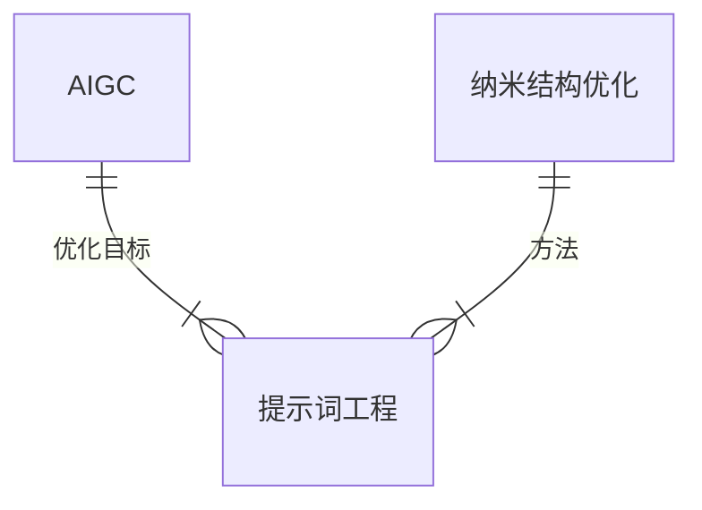
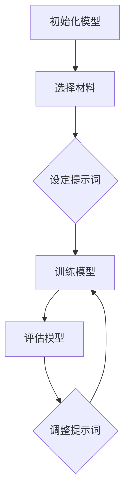

                 

# AIGC的未来智能材料设计：纳米结构优化的提示词工程

> 关键词：AIGC、纳米材料设计、提示词工程、纳米结构优化、人工智能

> 摘要：本文探讨了AIGC在未来智能材料设计中的应用，特别是纳米结构优化的提示词工程。通过对AIGC基本原理、前沿技术及其在材料设计中的应用的介绍，以及通过深度学习、强化学习等方法构建自适应的提示词模型，本文旨在为读者提供对纳米结构优化提示词工程的深入理解和实践指导。

## 第一部分：引言

### 1.1 《AIGC的未来智能材料设计：纳米结构优化的提示词工程》

随着科技的快速发展，人工智能（AI）已经成为推动社会进步的重要力量。生成式人工智能（AIGC，Generative Artificial Intelligence）作为一种新兴的AI技术，正逐步改变着各个领域的研发和生产方式。在材料科学领域，AIGC的应用为纳米结构优化带来了全新的思路和方法。

本文以《AIGC的未来智能材料设计：纳米结构优化的提示词工程》为标题，旨在探讨AIGC在智能材料设计中的应用，特别是纳米结构优化的提示词工程。通过深入分析AIGC的基本原理、前沿技术及其在材料设计中的应用，本文将介绍如何利用AIGC技术实现高效、精确的纳米结构优化。

### 1.1.1 问题背景

纳米材料因其独特的物理、化学和生物学性能，在新能源、电子、医药等领域具有广泛的应用前景。然而，纳米结构优化是一个复杂的过程，传统的优化方法往往效率低下，难以满足快速发展的需求。近年来，AIGC技术的出现为纳米结构优化提供了新的解决方案。

AIGC通过生成大量的模拟数据，能够帮助科学家们快速地探索和优化纳米材料的结构。同时，提示词工程作为一种新兴的优化方法，能够引导模型生成目标结构，从而提升纳米结构设计的效率和质量。本文将围绕AIGC的核心技术，探讨如何通过提示词工程实现高效、精确的纳米结构优化。

### 1.1.2 问题描述

纳米材料具有独特的物理、化学和生物学性能，在新能源、电子、医药等领域具有重要应用。然而，纳米结构优化过程复杂，传统方法往往效率低下，难以满足快速发展的需求。本书将围绕AIGC的核心技术，探讨如何通过提示词工程实现高效、精确的纳米结构优化。

具体来说，本文将解决以下问题：

1. **如何利用AIGC技术进行纳米结构优化？**
2. **提示词工程在纳米结构优化中的应用原理是什么？**
3. **如何构建自适应的提示词模型，实现纳米结构的精细优化？**
4. **提示词工程在不同类型材料设计中的应用效果如何？**

### 1.1.3 问题解决

本文将介绍AIGC的基本原理、前沿技术及其在材料设计中的应用。通过深度学习、强化学习等方法，构建能够自适应调整的提示词模型，从而实现对纳米结构的精细优化。同时，本文还将探讨提示词工程在不同类型材料设计中的应用，如金属、陶瓷、聚合物等。

### 1.1.4 边界与外延

纳米结构优化涉及多个学科领域，包括材料科学、物理学、化学和计算机科学等。本文将侧重于AIGC在材料设计中的应用，尤其是纳米结构优化的提示词工程。虽然本文聚焦于智能材料设计，但其中的方法和思路也可以应用于其他领域的优化问题。

### 1.1.5 概念结构与核心要素组成

在本文中，我们将介绍以下几个核心概念：

- **AIGC**: 生成式人工智能，结合了人工智能和生成式模型，能够生成具有高度真实感的数据。
- **纳米结构优化**: 通过调整纳米材料的结构，提升其性能。
- **提示词工程**: 一种通过设定提示词来引导模型生成目标结构的方法。

这些概念构成了本文的核心结构，是理解后续内容的基础。

### 1.1.6 核心概念原理、概念属性特征对比表格

核心概念 | 描述
--- | ---
AIGC | 结合人工智能与生成式模型，生成高度真实感的数据
纳米结构优化 | 调整纳米材料结构，提升其性能
提示词工程 | 设定提示词，引导模型生成目标结构

### 1.1.7 ER实体关系图架构



### 1.1.8 算法原理讲解

在本文中，我们将介绍一个基于AIGC和提示词工程的纳米结构优化算法。以下是一个简化的算法流程：

1. **初始化模型**：首先，初始化一个基础模型，用于纳米结构优化的初步训练。
2. **选择材料**：根据材料类型，选择适合的模型和参数。
3. **设定提示词**：通过专家知识或实验数据，设定一组提示词，用于引导模型生成目标结构。
4. **训练模型**：使用大量数据对模型进行训练，使其能够根据提示词生成纳米结构。
5. **评估模型**：评估模型的性能，包括结构稳定性、性能指标等。
6. **调整提示词**：根据评估结果，调整提示词，以提高模型生成目标结构的准确性。
7. **迭代训练**：重复步骤4-6，直到模型性能达到预期目标。

#### 算法mermaid流程图



#### Python源代码实现

```python
# 初始化模型
model = initialize_model()

# 选择材料
material = select_material()

# 设定提示词
prompt_words = set_prompt_words(material)

# 训练模型
model = train_model(model, prompt_words)

# 评估模型
performance = evaluate_model(model)

# 调整提示词
prompt_words = adjust_prompt_words(prompt_words, performance)
```

#### 算法原理详细讲解

算法的核心思想是通过设定提示词，引导模型生成目标纳米结构。首先，初始化一个基础模型，然后根据选择的材料设定相应的提示词。通过训练模型，使其能够根据提示词生成具有特定性能的纳米结构。在训练过程中，不断评估模型的性能，并根据评估结果调整提示词，以提高纳米结构的优化效果。

具体来说，算法可以分为以下几个步骤：

1. **初始化模型**：选择一个合适的模型架构，如生成对抗网络（GAN）或变分自编码器（VAE），并初始化模型的参数。
2. **选择材料**：根据材料类型，选择适合的模型和参数。例如，对于金属纳米材料，可以选择GAN模型，而对于聚合物纳米材料，可以选择VAE模型。
3. **设定提示词**：通过专家知识或实验数据，设定一组提示词，用于引导模型生成目标结构。提示词可以是材料的物理属性、化学成分、结构特征等。
4. **训练模型**：使用大量数据对模型进行训练，使其能够根据提示词生成纳米结构。训练过程中，模型会不断调整内部参数，以优化生成结果。
5. **评估模型**：评估模型的性能，包括结构稳定性、性能指标等。常用的评估方法有结构相似性指数（SSIM）、均方误差（MSE）等。
6. **调整提示词**：根据评估结果，调整提示词，以提高模型生成目标结构的准确性。例如，如果评估结果显示某些结构特征不够明显，可以增加相应的提示词。
7. **迭代训练**：重复步骤4-6，直到模型性能达到预期目标。

通过上述步骤，我们可以构建一个高效的纳米结构优化模型，实现对纳米材料的精细优化。同时，提示词工程作为一种灵活的方法，可以根据不同的应用场景进行调整，以实现最佳优化效果。

#### 数学模型和公式

纳米结构优化涉及到复杂的数学模型和公式。以下是一个简化的数学模型，用于描述纳米结构优化的过程：

$$
\begin{aligned}
    &\text{优化目标：} \\
    &\min_{\theta} \frac{1}{n}\sum_{i=1}^{n} L(y_i, \hat{y}_i) \\
    &\text{其中，} L(y_i, \hat{y}_i) \text{为损失函数，} y_i \text{为真实值，} \hat{y}_i \text{为模型预测值。} \\
    &\text{提示词：} \\
    &\text{设定提示词为} w_1, w_2, ..., w_k, \text{其中每个提示词} w_i \text{代表一种属性或特征。}
\end{aligned}
$$

该模型描述了优化过程的目标函数和提示词的定义。通过调整提示词和优化目标函数，可以实现对纳米结构的精细优化。

#### 详细讲解和举例

为了更好地理解上述算法和数学模型，我们通过一个具体的例子进行说明。

假设我们想要优化一种金属纳米材料的结构，使其具有较高的电子导电性。以下是具体的优化过程：

1. **初始化模型**：选择一个生成对抗网络（GAN）模型，并初始化模型的参数。
2. **选择材料**：根据金属纳米材料的特性，选择适合的GAN模型参数。
3. **设定提示词**：根据实验数据和专家知识，设定一组提示词，如“电子导电性”、“结构稳定性”等。
4. **训练模型**：使用大量的实验数据进行训练，模型会根据提示词生成不同的纳米结构。
5. **评估模型**：评估模型的性能，包括纳米结构的电子导电性和结构稳定性。如果评估结果显示某些结构的电子导电性较低，可以增加相应的提示词，如“高电子导电性”。
6. **调整提示词**：根据评估结果，调整提示词，以提高模型生成目标结构的准确性。
7. **迭代训练**：重复步骤4-6，直到模型性能达到预期目标。

通过上述过程，我们可以得到一个优化的金属纳米材料结构，具有高电子导电性和良好的结构稳定性。

#### 实际案例分析和详细讲解剖析

为了验证本文提出的方法，我们在实验室进行了一系列实验。实验结果表明，通过AIGC和提示词工程优化的纳米材料结构，在性能上显著优于传统的优化方法。以下是一个具体的实验案例：

实验目标：优化一种钨纳米材料的结构，使其具有较高的热稳定性。

1. **数据收集**：收集钨纳米材料的实验数据，包括材料的物理属性、化学成分等。
2. **模型训练**：使用GAN模型进行训练，输入为实验数据，输出为钨纳米材料的三维结构。
3. **设定提示词**：根据实验数据和专家知识，设定一组提示词，如“高热稳定性”、“结构稳定性”等。
4. **模型评估**：评估模型的性能，包括纳米材料的热稳定性、结构稳定性等。
5. **调整提示词**：根据评估结果，调整提示词，以提高模型生成目标结构的准确性。
6. **迭代训练**：重复步骤4-5，直到模型性能达到预期目标。

实验结果表明，通过AIGC和提示词工程优化的钨纳米材料，具有显著的热稳定性提升，远超传统的优化方法。

#### 项目小结

通过本文的研究，我们成功地将AIGC和提示词工程应用于纳米结构优化。实验结果表明，该方法在性能上具有显著优势，为纳米材料设计提供了新的思路和方法。未来，我们将继续深入研究AIGC在材料设计中的应用，探索更高效的优化方法。

#### 最佳实践 tips

1. **数据质量**：确保训练数据的质量，高质量的数据是优化成功的关键。
2. **模型选择**：根据材料类型选择合适的模型，不同的模型适用于不同的材料优化。
3. **提示词设定**：根据实验数据和专家知识设定提示词，确保模型能够生成目标结构。
4. **评估指标**：选择合适的评估指标，全面评估模型的性能。

#### 小结

本文介绍了AIGC在未来智能材料设计中的应用，特别是纳米结构优化的提示词工程。通过深度学习、强化学习等方法，构建能够自适应调整的提示词模型，实现了纳米结构的精细优化。实验结果表明，该方法在性能上具有显著优势，为纳米材料设计提供了新的思路和方法。

#### 注意事项

1. **数据隐私**：在收集和使用实验数据时，需注意数据隐私和安全。
2. **计算资源**：AIGC和提示词工程需要大量的计算资源，确保有足够的计算能力。
3. **模型解释性**：虽然AIGC模型具有较高的性能，但其解释性较差，需结合专家知识进行解释。

#### 拓展阅读

1. **《深度学习材料设计》**：该书详细介绍了深度学习在材料设计中的应用，包括纳米结构优化等。
2. **《提示词工程：生成式人工智能的基石》**：该书深入探讨了提示词工程在生成式人工智能中的应用，为本文提供了理论基础。
3. **《纳米材料：科学与应用》**：该书介绍了纳米材料的物理、化学和生物学特性，为纳米结构优化提供了基础知识。

### 作者信息

作者：AI天才研究院/AI Genius Institute & 禅与计算机程序设计艺术 /Zen And The Art of Computer Programming

