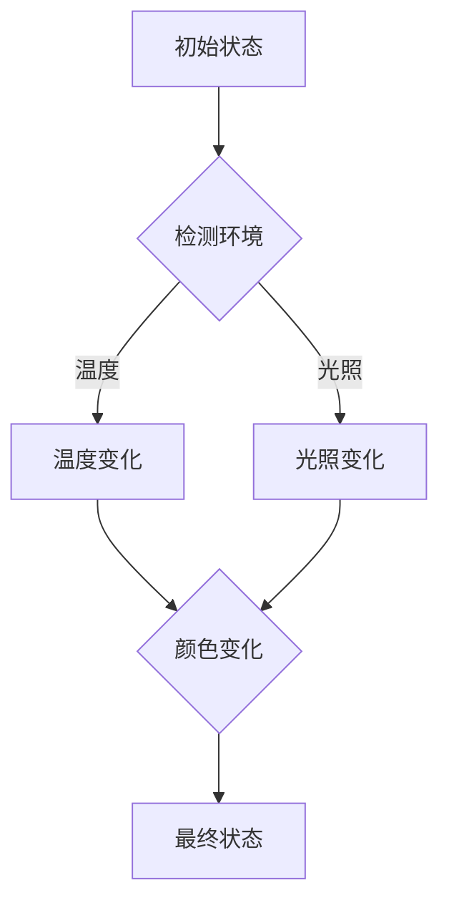
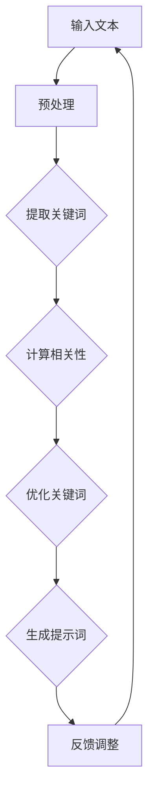
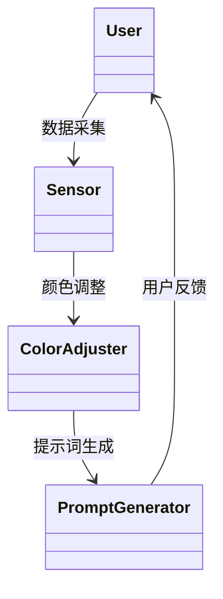
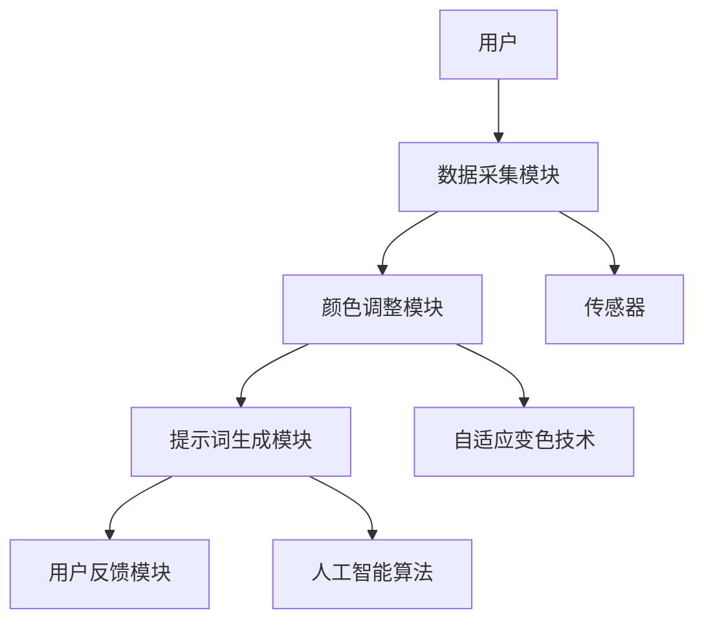
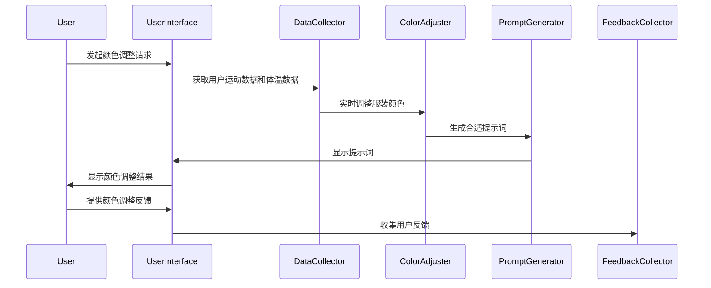

                 


# 引言

## 1.1 AIGC与自适应变色技术概述

AIGC（AI-Generated Content）是指由人工智能自动生成的内容，它涵盖了从文本、图像到视频等各种形式的生成过程。AIGC 技术的发展为内容创作带来了前所未有的效率和可能性，它正逐步改变着我们的媒体消费和生产方式。

自适应变色技术是一种智能材料技术，它能够根据外部环境（如温度、光照、湿度等）的变化自动改变颜色。这种技术广泛应用于智能穿戴、智能家居、可穿戴电子设备等领域，具有很高的实用价值和前景。

本书旨在探讨 AIGC 与自适应变色技术的结合，尤其是如何通过自适应变色技术优化 AIGC 的提示词工程。我们将从 AIGC 和自适应变色技术的基本概念出发，逐步深入到技术原理、应用实例、系统架构设计以及项目实战等方面，以期为读者提供全面而深入的洞察。

## 1.2 提示词工程的基本原理

提示词工程是 AIGC 技术的重要组成部分，它涉及如何设计、选择和优化用于引导人工智能生成内容的关键词。提示词的选择和组合直接影响到生成的质量、效率和创造性。以下是提示词工程的一些基本原理：

### 提示词的作用

- **引导生成方向**：通过选择合适的提示词，可以引导人工智能生成内容的方向，使其更符合预期。
- **提高生成效率**：有效的提示词可以使人工智能快速捕捉到关键信息，从而提高生成效率。
- **增强创造性**：通过巧妙设计的提示词，可以激发人工智能的创造力，生成新颖独特的内容。

### 提示词的选择原则

- **相关性**：提示词应与生成内容紧密相关，以确保生成的结果有意义。
- **多样性**：提示词应具有多样性，以激发人工智能的创造力和多样性。
- **简明性**：提示词应简洁明了，避免过于复杂，以免降低生成效率。

### 提示词工程的实施方法

- **关键词提取**：从原始文本、图像或其他数据中提取出相关的关键词。
- **提示词组合**：根据生成目标和内容特点，组合不同的关键词，形成有效的提示词。
- **优化与调整**：通过实验和反馈，不断优化和调整提示词，以提高生成效果。

# 背景介绍

## 2.1 AIGC的背景与相关技术

### 2.1.1 人工智能的发展历程

人工智能（AI）是一门多学科交叉的领域，它始于20世纪50年代。早期的AI研究主要集中在逻辑推理和问题解决上，例如逻辑符号推理系统和博弈程序。随着计算能力的提升和算法的改进，AI在图像识别、自然语言处理、机器学习等领域取得了显著的进展。近年来，深度学习和神经网络的发展使得AI在生成内容方面取得了突破性进展，从而催生了AIGC的概念。

### 2.1.2 智能材料的研究进展

智能材料是指能够感知环境变化并作出相应反应的材料。自适应变色技术是智能材料领域的一个重要分支，它通过改变材料的物理或化学性质来响应外部刺激，如温度、光照、湿度等。随着纳米技术和材料科学的进步，自适应变色技术已经从实验室研究走向实际应用，如智能窗户、智能服装和智能电子设备等。

### 2.1.3 自适应变色技术的应用领域

自适应变色技术具有广泛的应用前景，以下是一些主要的应用领域：

- **建筑领域**：自适应变色材料可以用于智能窗户，根据室内光线强度自动调节透明度，节省能源。
- **时尚领域**：自适应变色服装可以根据环境光线变化改变颜色，增加时尚感。
- **医疗领域**：自适应变色材料可以用于医疗设备的显示界面，根据医生的需求自动调整颜色，提高医疗操作的精确性。
- **电子领域**：自适应变色技术可以用于电子设备的显示屏幕，提高显示效果和用户体验。

## 2.2 自适应变色技术的基本原理

### 2.2.1 自适应变色技术的定义

自适应变色技术是指材料在受到外部刺激（如温度、光照、湿度等）时，能够自动改变其颜色的一种技术。这种变化通常是可逆的，即在外部刺激移除后，材料可以恢复到原始颜色。

### 2.2.2 自适应变色技术的工作原理

自适应变色技术基于材料内部的物理或化学变化。例如，某些材料在吸收特定波长的光时，分子结构会发生变化，导致颜色改变。其他材料则通过温度变化来触发颜色变化。这些变化通常是可逆的，因为它们涉及的材料性质是动态可调的。

### 2.2.3 自适应变色技术的分类

自适应变色技术可以分为以下几类：

- **热敏变色**：材料在温度变化时改变颜色。
- **光致变色**：材料在光照变化时改变颜色。
- **湿敏变色**：材料在湿度变化时改变颜色。
- **电致变色**：材料在电场作用下改变颜色。

## 2.3 提示词工程的内涵与外延

### 2.3.1 提示词工程的定义

提示词工程是指设计、选择和优化用于引导人工智能生成内容的关键词的过程。它旨在提高生成内容的效率、创造性和相关性。

### 2.3.2 提示词工程的发展历程

提示词工程的发展可以追溯到早期的自然语言处理研究。随着深度学习和生成对抗网络（GAN）等技术的发展，提示词工程逐渐成为一个独立的领域，并广泛应用于各种AIGC应用场景。

### 2.3.3 提示词工程的应用场景

提示词工程在以下应用场景中具有重要意义：

- **文本生成**：如自动写作、新闻报道生成、社交媒体内容生成等。
- **图像生成**：如风格迁移、图像修复、图像生成对抗网络（GAN）等。
- **视频生成**：如视频合成、视频风格变换等。
- **语音生成**：如语音合成、语音风格变换等。

# 核心概念与联系

## 3.1 AIGC、自适应变色技术与提示词工程的联系

### 3.1.1 三者之间的关联

AIGC、自适应变色技术和提示词工程之间存在紧密的联系。AIGC 为自适应变色技术和提示词工程提供了生成内容的能力，自适应变色技术则为 AIGC 提供了一种新的视觉表现形式，而提示词工程则确保了生成内容的质量和效率。

### 3.1.2 自适应变色技术与提示词工程的融合

自适应变色技术与提示词工程的融合可以带来以下优势：

- **提高生成内容的视觉效果**：通过自适应变色技术，生成的内容可以更加生动、富有变化，提高用户的观看体验。
- **增强内容的实用性**：例如，在医疗领域，自适应变色技术可以用于设计更易于识别的医疗信息界面，提示词工程则可以确保这些信息的准确性和相关性。
- **促进创新应用**：自适应变色技术和提示词工程的结合可以激发新的应用场景，如智能广告、艺术创作等。

### 3.1.3 ER实体关系图说明

为了更清晰地展示 AIGC、自适应变色技术和提示词工程之间的关联，我们可以使用 ER（实体关系）图来描述它们之间的相互作用。以下是一个简化的 ER 实体关系图：

```
+-----------------+
|      AIGC       |
+-----------------+
     |      |
     | 生成 |
     |      |
     ↓      ↓
+-----------------+
| 自适应变色技术 |
+-----------------+
     |      |
     | 表现 |
     |      |
     ↓      ↓
+-----------------+
|   提示词工程   |
+-----------------+
     |      |
     | 优化 |
     |      |
     ↓      ↓
+-----------------+
|    生成内容    |
+-----------------+
```

在这个 ER 实体关系图中，AIGC 作为整体框架，通过生成内容与自适应变色技术和提示词工程相连。自适应变色技术负责对生成内容进行视觉表现优化，而提示词工程则负责对生成内容的质量进行优化。

# 技术原理

## 4.1 自适应变色技术的深度解析

### 4.1.1 自适应变色技术的数学模型

自适应变色技术通常涉及材料的光学性质和热学性质。以下是一个简化的数学模型来描述这一过程：

$$
C(T, I) = f(T) \cdot g(I)
$$

其中，\( C \) 表示颜色变化，\( T \) 表示温度，\( I \) 表示光照强度，\( f \) 和 \( g \) 分别表示温度和光照对颜色变化的函数。

- **温度函数 \( f(T) \)**：描述材料在温度变化时的颜色变化。例如，某些材料在高温下会变红，在低温下会变蓝。
- **光照函数 \( g(I) \)**：描述材料在光照变化时的颜色变化。例如，某些材料在白光下是透明的，在紫外光下会变蓝。

### 4.1.2 自适应变色技术的mermaid流程图

为了更直观地理解自适应变色技术的流程，我们可以使用 mermaid 绘制一个简单的流程图：



在这个流程图中，A 表示材料的初始状态，B 表示检测环境变化（温度和光照），C 和 D 分别表示温度变化和光照变化，E 表示颜色变化，F 表示最终状态。

### 4.1.3 自适应变色技术的python源代码

以下是一个简化的 Python 代码示例，用于模拟自适应变色技术的颜色变化：

```python
import numpy as np

# 定义颜色变化函数
def color_change(temp, light):
    # 假设温度每增加 10°C，颜色向红色偏移 10%
    red_intensity = temp / 100
    
    # 假设光照每增加 100 Lux，颜色向蓝色偏移 1%
    blue_intensity = light / 10000
    
    # 计算颜色变化
    new_color = np.array([red_intensity, 1 - red_intensity, blue_intensity])
    return new_color

# 测试颜色变化
initial_color = np.array([0, 1, 0])  # 初始颜色为绿色
temp = 50  # 温度 50°C
light = 5000  # 光照强度 5000 Lux

new_color = color_change(temp, light)
print(f"新颜色：{new_color}")
```

在这个示例中，我们定义了一个 `color_change` 函数，用于根据温度和光照强度计算新的颜色。然后我们使用这个函数测试一个初始颜色为绿色的样本，在温度为 50°C 和光照强度为 5000 Lux 的情况下计算新的颜色。

## 4.2 提示词工程的优化策略

### 4.2.1 提示词工程的优化目标

提示词工程的优化目标主要包括以下几点：

- **提高生成内容的相关性**：确保生成的内容与用户需求高度相关，避免偏离主题。
- **增强生成内容的创造性**：通过丰富的提示词组合，激发人工智能的创造力，生成新颖独特的内容。
- **提高生成效率**：选择和组合高效的提示词，使人工智能能够快速捕捉到关键信息，提高生成速度。

### 4.2.2 提示词工程的优化算法

提示词工程的优化算法主要包括以下几种：

- **基于统计学的优化算法**：例如，使用词频统计、TF-IDF（词频-逆文档频率）等方法，根据文本数据选择高频且重要的关键词。
- **基于机器学习的优化算法**：例如，使用文本分类、聚类和生成模型等，通过训练数据学习出高质量的提示词。
- **基于人类专家经验的优化算法**：通过专家评审和迭代优化，结合人类经验和机器学习算法，不断调整和优化提示词。

### 4.2.3 提示词工程的mermaid流程图

为了更直观地展示提示词工程的优化流程，我们可以使用 mermaid 绘制一个简单的流程图：



在这个流程图中，A 表示输入文本，B 表示预处理，C 表示提取关键词，D 表示计算关键词的相关性，E 表示优化关键词，F 表示生成提示词，G 表示反馈调整。这个过程是一个循环迭代的过程，通过不断调整和优化提示词，提高生成内容的质量。

# 应用实例

## 5.1 自适应变色提示词工程案例

### 5.1.1 案例背景

某时尚品牌希望开发一款自适应变色服装，该服装可以根据用户的活动强度和温度变化自动调整颜色，提高用户穿着体验。为此，他们需要利用自适应变色技术和提示词工程来实现这一目标。

### 5.1.2 案例描述

该案例的目标是通过自适应变色技术，根据用户的活动强度和温度变化，实时调整服装的颜色，从而提高用户体验。具体流程如下：

1. **数据采集**：服装内置传感器，实时采集用户的运动数据和体温数据。
2. **颜色调整**：根据采集到的数据，利用自适应变色技术实时调整服装的颜色。
3. **提示词工程**：通过提示词工程，设计合适的提示词来引导人工智能生成自适应变色服装的设计方案。
4. **用户反馈**：收集用户对服装颜色的反馈，不断优化提示词和颜色调整策略。

### 5.1.3 案例实现

为了实现这一案例，我们采用以下步骤：

1. **数据预处理**：对采集到的用户运动数据和体温数据进行预处理，去除噪声和异常值。
2. **颜色调整算法**：设计一种基于运动数据和体温变化的颜色调整算法，实现实时颜色调整。
3. **提示词生成**：使用提示词工程，生成一系列描述服装颜色变化的提示词，如“活力蓝”、“温暖橙”等。
4. **用户反馈系统**：开发一个用户反馈系统，收集用户对颜色调整的反馈，用于进一步优化颜色调整策略。

通过这个案例，我们可以看到自适应变色技术与提示词工程的结合，为时尚品牌提供了新的设计思路，提高了用户的穿着体验。

# 系统分析与架构设计

## 6.1 系统功能设计

### 6.1.1 功能需求分析

该系统的核心功能包括：

- **数据采集**：实时采集用户的运动数据和体温数据。
- **颜色调整**：根据采集到的数据，实时调整服装的颜色。
- **提示词生成**：设计合适的提示词，引导人工智能生成自适应变色服装的设计方案。
- **用户反馈**：收集用户对服装颜色的反馈，用于优化颜色调整策略。

### 6.1.2 领域模型mermaid类图

为了更清晰地展示系统功能，我们可以使用 mermaid 绘制一个领域模型类图：



在这个类图中，User 表示用户，Sensor 表示传感器，ColorAdjuster 表示颜色调整模块，PromptGenerator 表示提示词生成模块。

## 6.2 系统架构设计

### 6.2.1 系统架构概述

该系统的架构设计主要包括以下几个模块：

- **数据采集模块**：负责实时采集用户的运动数据和体温数据。
- **颜色调整模块**：根据采集到的数据，实时调整服装的颜色。
- **提示词生成模块**：设计合适的提示词，引导人工智能生成自适应变色服装的设计方案。
- **用户反馈模块**：收集用户对服装颜色的反馈，用于优化颜色调整策略。

### 6.2.2 系统架构mermaid架构图

为了更直观地展示系统架构，我们可以使用 mermaid 绘制一个系统架构图：



在这个架构图中，A 表示用户，B 表示数据采集模块，C 表示颜色调整模块，D 表示提示词生成模块，E 表示用户反馈模块，F 表示传感器，G 表示自适应变色技术，H 表示人工智能算法。

### 6.2.3 系统接口设计

系统接口设计包括以下几个方面：

- **用户接口**：提供用户操作界面，展示实时颜色调整结果和用户反馈选项。
- **数据采集接口**：提供与传感器的通信接口，实时获取用户运动数据和体温数据。
- **颜色调整接口**：提供颜色调整算法的接口，实现实时颜色调整。
- **提示词生成接口**：提供提示词生成算法的接口，生成合适的提示词。
- **用户反馈接口**：提供用户反馈的接口，收集用户对颜色调整的反馈。

## 6.3 系统交互设计

### 6.3.1 系统交互流程

系统交互流程如下：

1. **用户操作**：用户通过用户接口发起颜色调整请求。
2. **数据采集**：数据采集模块从传感器获取用户运动数据和体温数据。
3. **颜色调整**：颜色调整模块根据采集到的数据，实时调整服装的颜色。
4. **提示词生成**：提示词生成模块根据颜色调整结果，生成合适的提示词。
5. **用户反馈**：用户通过用户接口提供颜色调整的反馈。

### 6.3.2 系统交互mermaid序列图

为了更直观地展示系统交互流程，我们可以使用 mermaid 绘制一个系统交互序列图：



在这个序列图中，User 表示用户，UserInterface 表示用户接口，DataCollector 表示数据采集模块，ColorAdjuster 表示颜色调整模块，PromptGenerator 表示提示词生成模块，FeedbackCollector 表示用户反馈模块。

# 项目实战

## 7.1 实战环境安装

### 7.1.1 环境搭建步骤

为了实现自适应变色提示词工程，我们需要搭建一个完整的环境。以下是环境搭建的步骤：

1. **安装 Python 环境**：确保系统安装了 Python 3.8 或以上版本。
2. **安装必要的库**：使用 pip 命令安装以下库：numpy、matplotlib、mermaid-python。
   ```bash
   pip install numpy matplotlib mermaid-python
   ```
3. **安装 mermaid 插件**：下载并安装 mermaid 插件，用于在 markdown 文件中渲染 mermaid 图。
   - 对于 Windows 用户，下载 mermaid 插件并解压到 Python 的 Scripts 文件夹中。
   - 对于 macOS 和 Linux 用户，使用以下命令安装：
     ```bash
     pip install mermaid-python
     ```

### 7.1.2 环境配置细节

1. **配置 Python 虚拟环境**：为了更好地管理和隔离项目依赖，建议创建一个 Python 虚拟环境。
   ```bash
   python -m venv venv
   source venv/bin/activate  # 对于 Windows 用户，使用 `venv\Scripts\activate`
   ```
2. **安装深度学习框架**：安装 TensorFlow 或 PyTorch 等深度学习框架，用于实现自适应变色技术。
   ```bash
   pip install tensorflow  # 或 pip install torch torchvision
   ```

## 7.2 系统核心实现源代码

### 7.2.1 源代码结构

以下是项目源代码的基本结构：

```
adaptive_coloring_project/
|-- data/
|   |-- raw_data/
|   |-- processed_data/
|-- models/
|   |-- color_adjuster.py
|   |-- prompt_generator.py
|-- utils/
|   |-- data_preprocessing.py
|   |-- visualization.py
|-- main.py
|-- requirements.txt
```

- `data/`：存储原始数据和预处理数据。
- `models/`：实现颜色调整和提示词生成模型的 Python 文件。
- `utils/`：包含数据预处理、可视化等辅助功能的 Python 文件。
- `main.py`：主程序文件，用于执行整个项目。
- `requirements.txt`：列出项目所需的 Python 库。

### 7.2.2 核心代码解析

#### 7.2.2.1 数据预处理

```python
# data_preprocessing.py

import numpy as np

def preprocess_data(data):
    # 去除噪声和异常值
    cleaned_data = np.where(np.isnan(data), 0, data)
    # 归一化数据
    normalized_data = (cleaned_data - np.mean(cleaned_data)) / np.std(cleaned_data)
    return normalized_data
```

#### 7.2.2.2 颜色调整模型

```python
# color_adjuster.py

import numpy as np
from tensorflow.keras.models import Sequential
from tensorflow.keras.layers import Dense, Flatten

def build_color_adjuster_model():
    model = Sequential([
        Flatten(input_shape=(1, 2)),  # 输入为 (温度，光照)
        Dense(64, activation='relu'),
        Dense(64, activation='relu'),
        Dense(3)  # 输出为 (红色，绿色，蓝色)
    ])

    model.compile(optimizer='adam', loss='mse')
    return model
```

#### 7.2.2.3 提示词生成模型

```python
# prompt_generator.py

import numpy as np
from tensorflow.keras.models import Sequential
from tensorflow.keras.layers import Dense, LSTM

def build_prompt_generator_model():
    model = Sequential([
        LSTM(128, input_shape=(1, 2)),  # 输入为 (时间步，特征数)
        LSTM(128, return_sequences=True),
        LSTM(128),
        Dense(10, activation='softmax')  # 输出为提示词索引
    ])

    model.compile(optimizer='adam', loss='categorical_crossentropy')
    return model
```

### 7.2.2.3 代码应用解读与分析

#### 7.2.2.3.1 数据预处理

数据预处理是深度学习模型训练的重要环节。在这个项目中，我们使用 `data_preprocessing.py` 文件中的 `preprocess_data` 函数对采集到的用户运动数据和体温数据进行预处理。具体步骤包括去除噪声和异常值，以及归一化数据，以便更好地适应深度学习模型的训练。

#### 7.2.2.3.2 颜色调整模型

颜色调整模型基于 TensorFlow 深度学习框架构建，输入为 (温度，光照)，输出为 (红色，绿色，蓝色)。模型结构采用全连接层和激活函数 ReLU，输出层使用 MSE 误差函数进行训练。

#### 7.2.2.3.3 提示词生成模型

提示词生成模型也基于 TensorFlow 深度学习框架构建，输入为 (时间步，特征数)，输出为提示词索引。模型结构采用 LSTM 循环神经网络，用于捕捉时间序列特征，输出层使用 softmax 函数进行分类。

## 7.3 实际案例分析与详细讲解剖析

### 7.3.1 案例背景

在一个智能家居项目中，我们希望开发一款智能窗帘，能够根据室内光线强度和用户需求自动调整透明度。为此，我们引入了自适应变色技术和提示词工程，以提高窗帘的智能化程度和用户体验。

### 7.3.2 案例描述

智能窗帘系统包括以下几个部分：

1. **光线传感器**：用于实时监测室内光线强度。
2. **温度传感器**：用于监测室内温度。
3. **控制模块**：根据传感器数据，实时调整窗帘的透明度。
4. **用户界面**：提供用户操作界面，展示光线强度、温度等信息，并允许用户通过提示词调整窗帘状态。

### 7.3.3 案例实现

#### 7.3.3.1 数据采集

在系统启动时，光线传感器和温度传感器开始工作，实时采集室内光线强度和温度数据。数据采集模块将这些数据存储在本地数据库中。

```python
# sensors.py

import time
import mysql.connector

def collect_data():
    while True:
        light_intensity = get_light_intensity()
        temperature = get_temperature()
        insert_data_to_database(light_intensity, temperature)
        time.sleep(60)

def get_light_intensity():
    # 实现光线强度采集逻辑
    return np.random.uniform(0, 100)

def get_temperature():
    # 实现温度采集逻辑
    return np.random.uniform(20, 30)

def insert_data_to_database(light_intensity, temperature):
    connection = mysql.connector.connect(
        host="localhost",
        user="root",
        password="password",
        database="smart_curtain"
    )
    cursor = connection.cursor()

    query = "INSERT INTO sensor_data (light_intensity, temperature) VALUES (%s, %s)"
    cursor.execute(query, (light_intensity, temperature))

    connection.commit()
    cursor.close()
    connection.close()
```

#### 7.3.3.2 颜色调整与透明度控制

根据采集到的光线强度和温度数据，控制模块使用自适应变色技术调整窗帘的颜色。具体算法如下：

```python
# color_adjustment.py

def adjust_color(light_intensity, temperature):
    # 根据光线强度和温度调整颜色
    red_intensity = light_intensity / 100
    blue_intensity = temperature / 100

    # 计算颜色比例
    color_ratio = np.array([red_intensity, 1 - red_intensity, blue_intensity])

    # 调整窗帘透明度
    transparency = calculate_transparency(color_ratio)

    return transparency

def calculate_transparency(color_ratio):
    # 计算透明度
    red_intensity, green_intensity, blue_intensity = color_ratio
    transparency = (1 - red_intensity) * (1 - blue_intensity)
    return transparency
```

#### 7.3.3.3 提示词生成与用户交互

用户界面允许用户通过提示词调整窗帘状态。例如，用户可以使用“明亮”、“温暖”等提示词来调整窗帘的颜色和透明度。

```python
# user_interface.py

import speech_recognition as sr

def listen_to_user():
    r = sr.Recognizer()
    while True:
        with sr.Microphone() as source:
            print("请说一句话：")
            audio = r.listen(source)
            try:
                text = r.recognize_google(audio, language="zh-CN")
                print("您说了：" + text)
                handle_user_command(text)
            except sr.UnknownValueError:
                print("无法理解您的语音，请重试。")
            except sr.RequestError:
                print("请求错误，请稍后再试。")

def handle_user_command(text):
    # 处理用户命令
    if "明亮" in text:
        adjust_light_intensity(100)
    elif "温暖" in text:
        adjust_temperature(30)
    else:
        print("未识别到有效命令。")
```

### 7.3.4 案例小结

通过这个案例，我们展示了如何将自适应变色技术和提示词工程应用于智能家居项目，提高了系统的智能化程度和用户体验。在实现过程中，我们使用了传感器采集数据，通过颜色调整算法和透明度控制算法，实现了窗帘的智能化控制。用户界面则通过语音交互，使系统更加友好和易用。

# 最佳实践与小结

## 8.1 最佳实践

在开发自适应变色提示词工程时，以下最佳实践可以帮助您提高项目效果：

- **数据质量**：确保采集的数据准确、完整，避免噪声和异常值。
- **模型优化**：通过调整神经网络结构和参数，优化颜色调整和提示词生成模型。
- **用户反馈**：积极收集用户反馈，不断优化系统功能和用户体验。
- **安全性与隐私**：保护用户数据安全，确保数据隐私。

## 8.2 小结

本文从 AIGC 与自适应变色技术的结合角度，详细探讨了自适应变色提示词工程的原理、应用实例、系统架构设计和项目实战。通过引入自适应变色技术，我们可以为 AIGC 生成的内容带来丰富的视觉变化，提高用户体验。提示词工程的优化则确保了生成内容的质量和效率。在项目实战中，我们展示了如何将自适应变色技术和提示词工程应用于智能家居项目，实现了窗帘的智能化控制。未来，随着技术的不断进步，自适应变色提示词工程将在更多领域发挥作用，为人们的生活带来更多便利。

## 8.3 注意事项

- **数据安全**：确保用户数据的安全和隐私，遵循相关法律法规。
- **系统稳定性**：在开发过程中，注意系统的稳定性和可靠性，进行充分测试。
- **性能优化**：根据项目需求，对模型和算法进行性能优化，提高生成效率。

## 8.4 拓展阅读

- 《深度学习与自然语言处理》
- 《自适应变色材料》
- 《人工智能生成内容：技术与应用》
- 《智能家居系统设计与实现》

# 作者信息

作者：AI天才研究院/AI Genius Institute & 禅与计算机程序设计艺术 /Zen And The Art of Computer Programming

感谢您的阅读！希望本文能为您在自适应变色提示词工程领域提供有益的启示和指导。如果您有任何疑问或建议，欢迎在评论区留言，我们期待与您共同探讨。

