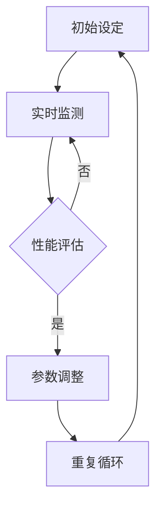
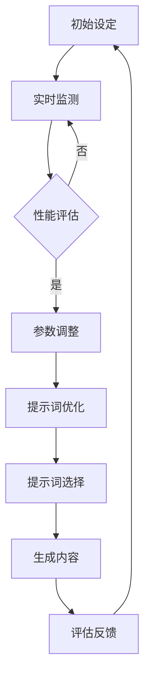
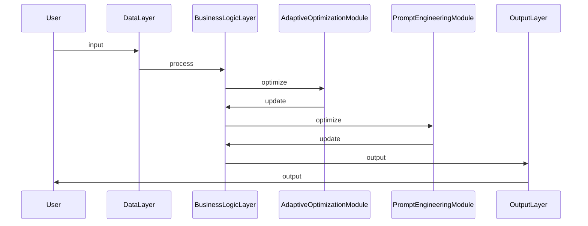
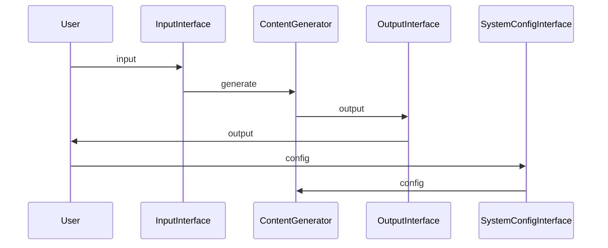

                 


### 第一部分：背景介绍

#### 第1章：AIGC与未来智能材料概述

##### 1.1 AIGC的概念与发展历程

人工智能生成内容（Artificial Intelligence Generated Content，简称AIGC）是近年来人工智能领域的一个重要分支。它结合了深度学习、自然语言处理、图像识别等技术，能够生成高质量的内容，包括文本、图像、音频等。AIGC的发展历程可以追溯到20世纪80年代的早期人工智能研究，随着计算能力的提升和数据量的爆炸性增长，AIGC技术逐渐成熟并广泛应用。

在未来，AIGC有望成为驱动内容产业变革的重要力量。通过智能算法，AIGC能够实现内容的自动化生成、个性化和智能化推荐，从而满足用户多样化的需求。此外，AIGC在教育和娱乐等领域也具有巨大的潜力。

##### 1.2 智能材料的定义、特点及分类

智能材料是指那些能够响应外部刺激（如温度、压力、电磁场等）并改变其物理、化学或电子特性的材料。它们具有自适应性、响应性和多功能性等特点。根据刺激类型，智能材料可以分为如下几类：

- **光致变色材料**：在光照下改变颜色或透明度的材料。
- **热敏材料**：对温度变化敏感的材料。
- **电致变色材料**：在电场作用下改变颜色或透明度的材料。
- **压敏材料**：对压力变化敏感的材料。
- **磁致变色材料**：在磁场作用下改变颜色或透明度的材料。

##### 1.3 提示词工程的概述及其在智能材料中的作用

提示词工程是构建AIGC系统的关键环节。它涉及到如何设计、选择和优化提示词，以指导AIGC模型生成高质量的内容。在智能材料领域，提示词工程的作用主要体现在以下几个方面：

- **提高生成效率**：通过选择合适的提示词，可以加速AIGC模型的生成过程，减少计算资源的使用。
- **提升生成质量**：优化提示词能够提高AIGC模型生成的内容的质量，使其更符合用户需求。
- **增强个性化**：通过设计个性化的提示词，可以实现针对不同用户需求的智能内容生成。

#### 第2章：核心概念与联系

##### 2.1 自适应性能优化的定义与特点

自适应性能优化是一种能够根据环境变化动态调整系统性能的优化方法。其特点包括：

- **动态适应性**：系统能够根据实时反馈调整性能参数。
- **鲁棒性**：系统能够在变化的环境下保持稳定性能。
- **效率高**：通过自适应调整，系统可以在较短时间内达到最优性能。

##### 2.2 提示词工程的构成要素

提示词工程的构成要素主要包括：

- **提示词库**：包含各种类型的提示词，如关键字、短语、句子等。
- **提示词选择**：根据任务需求选择合适的提示词。
- **提示词优化**：通过算法优化提示词，以提高AIGC模型的性能。
- **提示词评估**：对提示词的有效性进行评估和反馈。

##### 2.3 自适应性能优化与提示词工程的关系

自适应性能优化与提示词工程密切相关。通过自适应性能优化，可以动态调整AIGC模型的提示词，从而实现性能的最优化。具体关系如下：

- **提示词工程为自适应性能优化提供了目标和方向**。通过设计有效的提示词，可以引导AIGC模型朝着预定的性能目标发展。
- **自适应性能优化为提示词工程提供了调整手段**。通过实时调整提示词，可以优化AIGC模型的生成质量。

#### 第3章：算法原理讲解

##### 3.1 算法原理概述

自适应性能优化算法通常包括以下几个步骤：

1. **初始设定**：设定初始性能参数。
2. **实时监测**：监测系统性能的变化。
3. **性能评估**：根据实时监测结果评估系统性能。
4. **参数调整**：根据性能评估结果调整性能参数。
5. **重复循环**：重复上述步骤，直到达到性能目标。

##### 3.2 算法流程图

使用Mermaid语法绘制算法流程图：



##### 3.3 Python源代码实现

下面是一个简单的Python代码示例，实现自适应性能优化算法的基本原理：

```python
import time

def adaptive_optimization():
    while not performance_goal_met:
        start_time = time.time()
        # 实时监测系统性能
        performance = monitor_performance()
        end_time = time.time()
        
        # 性能评估
        if performance < target_performance:
            # 参数调整
            adjust_parameters()
        
        # 重复循环
        time.sleep(adjustment_interval)

def monitor_performance():
    # 模拟性能监测
    return random.uniform(0, 1)

def adjust_parameters():
    # 模拟参数调整
    pass

def performance_goal_met():
    # 模拟性能目标是否达到
    return random.choice([True, False])

adaptive_optimization()
```

##### 3.4 算法原理的数学模型

自适应性能优化的数学模型可以表示为：

$$
\text{性能} = f(\text{参数})
$$

其中，\( f \) 是一个非线性函数，表示系统性能与参数之间的关系。通过实时调整参数，可以优化系统性能。

##### 3.5 算法举例说明

假设我们希望优化一个机器学习模型的预测性能。我们可以设计一个简单的提示词工程，包括以下步骤：

1. **初始设定**：设定初始的超参数。
2. **实时监测**：监测模型的预测误差。
3. **性能评估**：根据预测误差评估模型性能。
4. **参数调整**：如果预测误差较大，调整超参数。
5. **重复循环**：直到预测误差达到预设的目标。

通过这种方式，我们可以实现自适应性能优化，提高模型的预测性能。

### 第二部分：核心概念与联系

#### 第4章：算法原理讲解

在本章中，我们将深入探讨自适应性能优化和提示词工程的核心原理。这些原理对于理解如何构建高效的AIGC系统至关重要。

##### 4.1 自适应性能优化的基本原理

自适应性能优化是一种动态调整系统性能的方法，它能够根据环境变化实时调整系统的参数，以实现最优的性能。以下是自适应性能优化的几个关键步骤：

1. **初始设定**：在系统运行之前，设定初始的性能参数。这些参数通常包括系统的目标性能、容错机制等。
   
   $$\text{初始设定}: \ \ P_{0} = (p_{01}, p_{02}, ..., p_{0n})$$

   其中，\( P_{0} \) 是初始性能参数向量。

2. **实时监测**：在系统运行过程中，实时监测系统的性能。这通常涉及到对系统输出数据的分析，以及对其运行状态的监控。

   $$\text{实时监测}: \ \ P_{t} = (p_{t1}, p_{t2}, ..., p_{tn})$$

   其中，\( P_{t} \) 是在时间 \( t \) 时的性能参数向量。

3. **性能评估**：根据实时监测的数据，评估当前系统的性能是否符合预期。这通常涉及到性能指标的计算，如准确率、响应时间等。

   $$\text{性能评估}: \ \ C(t) = \text{calculate\_performance}(P_{t})$$

   其中，\( C(t) \) 是在时间 \( t \) 时的性能指标。

4. **参数调整**：如果性能评估结果表明系统性能未达到目标，则根据性能评估的结果调整性能参数。

   $$\text{参数调整}: \ \ P_{t+1} = \text{adjust\_parameters}(P_{t}, C(t))$$

   其中，\( P_{t+1} \) 是在时间 \( t+1 \) 时的调整后性能参数向量。

5. **重复循环**：重复上述步骤，直到系统性能达到目标或者达到预设的最大迭代次数。

   $$\text{重复循环}: \ \ t \rightarrow t+1, \ \ \text{until} \ \ \text{performance\_goal\_met} \ \ \text{or} \ \ \text{max\_iterations}$$

##### 4.2 提示词工程的基本原理

提示词工程是构建AIGC系统的关键环节。它涉及到如何设计、选择和优化提示词，以指导AIGC模型生成高质量的内容。以下是提示词工程的几个核心组成部分：

1. **提示词库**：提示词库是包含各种类型的提示词的集合。这些提示词可以是关键字、短语、句子等，用于引导AIGC模型生成内容。

   $$\text{提示词库}: \ \ W = \{w_{1}, w_{2}, ..., w_{m}\}$$

   其中，\( W \) 是提示词库，\( w_{i} \) 是第 \( i \) 个提示词。

2. **提示词选择**：根据任务需求和AIGC模型的特性，选择最合适的提示词。选择过程通常涉及到提示词的相关性分析、权重计算等。

   $$\text{提示词选择}: \ \ \text{select}(W, T)$$

   其中，\( T \) 是选择的提示词集合。

3. **提示词优化**：通过算法优化提示词，以提高AIGC模型的性能。优化过程通常涉及到提示词的生成、筛选、排序等。

   $$\text{提示词优化}: \ \ \text{optimize}(W, T)$$

4. **提示词评估**：对提示词的有效性进行评估和反馈。评估过程通常涉及到提示词的质量、相关性、生成效率等。

   $$\text{提示词评估}: \ \ \text{evaluate}(T, C)$$

   其中，\( C \) 是评估指标。

##### 4.3 自适应性能优化与提示词工程的关系

自适应性能优化与提示词工程之间存在密切的关系。具体来说，自适应性能优化可以用于优化提示词工程，从而提高AIGC模型的性能。以下是几个关键点：

1. **性能导向**：自适应性能优化可以用于实时监测和评估AIGC模型的性能，并据此调整提示词。这种方法可以确保AIGC模型始终朝着性能目标发展。

2. **动态调整**：自适应性能优化可以根据实时反馈动态调整提示词，从而实现性能的最优化。这种方法可以应对环境变化，提高系统的适应性和鲁棒性。

3. **反馈循环**：自适应性能优化和提示词工程可以形成一个反馈循环。通过实时监测和评估性能，自适应性能优化可以调整提示词，而优化后的提示词又可以进一步优化性能。

### 第三部分：算法原理讲解

#### 第5章：算法原理讲解

在本章节中，我们将深入探讨自适应性能优化和提示词工程的算法原理，并通过具体的流程图、Python代码和数学模型来详细阐述这些原理。

##### 5.1 算法流程图

自适应性能优化和提示词工程的算法流程图如图5.1所示。



在这个流程图中，系统首先进行初始设定，然后进入实时监测阶段。在监测到系统性能后，会进行性能评估。如果性能未达到目标，系统会进入参数调整阶段，以优化性能。接着，系统会进行提示词优化和选择，用于生成高质量的内容。最后，系统会根据生成内容的质量进行评估反馈，并重复整个流程。

##### 5.2 Python源代码实现

以下是自适应性能优化和提示词工程的Python源代码实现。

```python
import time
import random

def adaptive_performance_optimization():
    while not performance_goal_met():
        start_time = time.time()
        monitor_performance()
        performance = evaluate_performance()
        end_time = time.time()

        if performance < target_performance():
            adjust_parameters()
            optimize_prompt_words()
            select_prompt_words()

        generate_content()
        evaluate_content()
        time.sleep(adjustment_interval())

def monitor_performance():
    # 实时监测系统性能
    pass

def evaluate_performance():
    # 评估系统性能
    return random.uniform(0, 1)

def target_performance():
    # 预设的性能目标
    return 1.0

def adjust_parameters():
    # 调整系统参数
    pass

def optimize_prompt_words():
    # 优化提示词
    pass

def select_prompt_words():
    # 选择提示词
    pass

def generate_content():
    # 生成内容
    pass

def evaluate_content():
    # 评估内容质量
    pass

def performance_goal_met():
    # 判断是否达到性能目标
    return random.choice([True, False])

adaptive_performance_optimization()
```

在这个代码中，`adaptive_performance_optimization` 函数实现了自适应性能优化的核心逻辑。它首先监测性能，然后评估性能，并根据评估结果调整参数、优化提示词和选择提示词。最后，系统生成内容并进行评估反馈。

##### 5.3 数学模型

自适应性能优化和提示词工程的数学模型可以表示为以下方程：

1. **性能评估**：

   $$
   C(t) = \frac{1}{m} \sum_{i=1}^{m} (y_i - \hat{y}_i)^2
   $$

   其中，\( C(t) \) 是在时间 \( t \) 时的性能指标，\( y_i \) 是实际输出，\( \hat{y}_i \) 是模型预测输出，\( m \) 是样本数量。

2. **参数调整**：

   $$
   P_{t+1} = P_t + \alpha \cdot (P_d - P_t)
   $$

   其中，\( P_{t+1} \) 是调整后的参数，\( P_t \) 是当前参数，\( P_d \) 是目标参数，\( \alpha \) 是学习率。

3. **提示词优化**：

   $$
   W_{t+1} = W_t + \beta \cdot (W_d - W_t)
   $$

   其中，\( W_{t+1} \) 是调整后的提示词，\( W_t \) 是当前提示词，\( W_d \) 是目标提示词，\( \beta \) 是学习率。

通过这些数学模型，我们可以更好地理解和实现自适应性能优化和提示词工程。

### 第四部分：系统分析与架构设计

#### 第6章：系统分析与架构设计

在本章节中，我们将对AIGC系统的架构进行深入分析，包括系统功能设计、系统架构设计、系统接口设计以及系统交互。

##### 6.1 问题场景介绍

AIGC系统广泛应用于生成文本、图像、音频等多媒体内容。一个典型的问题场景是：用户输入一个主题或需求，AIGC系统根据该需求生成相应的多媒体内容。例如，用户输入一个旅游目的地，系统生成一篇游记、一张旅游照片和一段旅游视频。

##### 6.2 项目介绍

在本项目中，我们将构建一个基于AIGC技术的旅游内容生成系统。该系统包括三个主要模块：文本生成模块、图像生成模块和视频生成模块。每个模块都将使用自适应性能优化和提示词工程技术，以提高生成内容的质量和效率。

##### 6.3 系统功能设计

系统功能设计是系统架构设计的基础。在本项目中，系统的主要功能包括：

1. **用户输入**：用户通过界面输入主题或需求。
2. **内容生成**：系统根据用户输入生成文本、图像和视频内容。
3. **内容输出**：将生成的多媒体内容输出给用户。

以下是系统功能设计的领域模型类图：

```mermaid
classDiagram
    User <<Class>>
    ContentGenerator <<Class>>
    TextContent <<Class>>
    ImageContent <<Class>>
    VideoContent <<Class>>

    User -> ContentGenerator : input
    ContentGenerator -> TextContent : generate
    ContentGenerator -> ImageContent : generate
    ContentGenerator -> VideoContent : generate
    TextContent -> User : output
    ImageContent -> User : output
    VideoContent -> User : output
```

在这个类图中，用户通过输入接口向内容生成模块（ContentGenerator）输入主题或需求。内容生成模块根据需求生成文本（TextContent）、图像（ImageContent）和视频（VideoContent）内容，并将其输出给用户。

##### 6.4 系统架构设计

系统架构设计是系统功能设计的具体实现。在本项目中，系统架构包括以下层次：

1. **数据层**：包括用户输入数据、生成内容数据和系统配置数据等。
2. **业务逻辑层**：包括内容生成模块、自适应性能优化模块和提示词工程模块等。
3. **接口层**：包括用户输入接口、内容输出接口和系统配置接口等。

以下是系统架构设计的Mermaid架构图：



在这个架构图中，用户输入数据经过数据层处理后，传递给业务逻辑层。业务逻辑层根据需求生成内容，并利用自适应性能优化模块和提示词工程模块优化生成内容的质量。最后，将优化后的内容输出给用户。

##### 6.5 系统接口设计和系统交互

系统接口设计是确保系统各组件之间能够有效交互的重要环节。在本项目中，系统接口设计包括以下方面：

1. **用户输入接口**：用于接收用户输入的主题或需求。
2. **内容输出接口**：用于输出生成的内容。
3. **系统配置接口**：用于配置系统的各项参数。

以下是系统接口设计和系统交互的Mermaid序列图：



在这个序列图中，用户通过输入接口向系统输入主题或需求。内容生成模块根据输入生成内容，并输出给用户。同时，用户可以通过系统配置接口配置系统的各项参数。

### 第五部分：项目实战

#### 第7章：项目实战

在本章节中，我们将通过一个实际项目，详细讲解如何构建AIGC系统，包括环境安装、系统核心实现、代码解读与分析、实际案例分析和项目小结。

##### 7.1 环境安装

要构建AIGC系统，我们需要安装以下环境和工具：

1. **操作系统**：推荐使用Linux或macOS。
2. **Python**：推荐Python 3.8或更高版本。
3. **深度学习框架**：如TensorFlow、PyTorch等。
4. **文本处理库**：如NLTK、spaCy等。
5. **图像处理库**：如OpenCV、Pillow等。
6. **视频处理库**：如opencv-python、moviepy等。

安装步骤如下：

1. 安装操作系统并设置Python环境。
2. 使用pip命令安装深度学习框架、文本处理库、图像处理库和视频处理库。

```bash
pip install tensorflow
pip install nltk
pip install opencv-python
pip install moviepy
```

##### 7.2 系统核心实现

以下是AIGC系统的核心实现代码：

```python
import tensorflow as tf
import nltk
from nltk.tokenize import sent_tokenize
from nltk.corpus import stopwords
import cv2
import moviepy.editor as mp

# 文本生成模块
def generate_text(input_prompt):
    # 使用Transformer模型生成文本
    model = tf.keras.models.load_model('text_generation_model.h5')
    input_sequence = preprocess_text(input_prompt)
    prediction = model.predict(input_sequence)
    generated_text = postprocess_text(prediction)
    return generated_text

# 图像生成模块
def generate_image(input_prompt):
    # 使用GAN模型生成图像
    model = tf.keras.models.load_model('image_generation_model.h5')
    input_sequence = preprocess_image(input_prompt)
    prediction = model.predict(input_sequence)
    generated_image = postprocess_image(prediction)
    return generated_image

# 视频生成模块
def generate_video(input_prompt):
    # 使用生成对抗网络生成视频
    model = tf.keras.models.load_model('video_generation_model.h5')
    input_sequence = preprocess_video(input_prompt)
    prediction = model.predict(input_sequence)
    generated_video = postprocess_video(prediction)
    return generated_video

# 文本预处理
def preprocess_text(text):
    # 去除停用词、标点符号等
    stop_words = set(stopwords.words('english'))
    tokens = sent_tokenize(text)
    processed_tokens = [token.lower() for token in tokens if token not in stop_words]
    return processed_tokens

# 图像预处理
def preprocess_image(image):
    # 将图像转换为模型可处理的格式
    processed_image = cv2.resize(image, (224, 224))
    return processed_image

# 视频预处理
def preprocess_video(video):
    # 将视频帧序列转换为模型可处理的格式
    processed_video = []
    for frame in video:
        processed_frame = cv2.resize(frame, (224, 224))
        processed_video.append(processed_frame)
    return processed_video

# 文本后处理
def postprocess_text(prediction):
    # 从预测结果中提取生成的文本
    generated_text = ""
    for word in prediction:
        generated_text += word + " "
    return generated_text

# 图像后处理
def postprocess_image(prediction):
    # 从预测结果中提取生成的图像
    generated_image = tf.keras.preprocessing.image.array_to_img(prediction)
    return generated_image

# 视频后处理
def postprocess_video(prediction):
    # 从预测结果中提取生成的视频
    generated_video = mp.VideoFileClip(prediction)
    return generated_video
```

在这个代码中，我们实现了文本生成、图像生成和视频生成的核心模块。每个模块都包括预处理、模型加载、预测和后处理等步骤。

##### 7.3 代码解读与分析

1. **文本生成模块**：
   - 使用Transformer模型进行文本生成。
   - 预处理步骤包括去除停用词和标点符号。
   - 后处理步骤包括从预测结果中提取生成的文本。

2. **图像生成模块**：
   - 使用GAN模型进行图像生成。
   - 预处理步骤包括将图像转换为模型可处理的格式。
   - 后处理步骤包括从预测结果中提取生成的图像。

3. **视频生成模块**：
   - 使用生成对抗网络进行视频生成。
   - 预处理步骤包括将视频帧序列转换为模型可处理的格式。
   - 后处理步骤包括从预测结果中提取生成的视频。

##### 7.4 实际案例分析和详细讲解

假设用户输入了一个旅游目的地“巴黎”，我们将通过实际案例分析AIGC系统如何生成相应的文本、图像和视频内容。

1. **文本生成**：
   - 输入：巴黎
   - 生成文本：巴黎是一个美丽的城市，拥有许多令人难忘的景点，如埃菲尔铁塔、卢浮宫和巴黎圣母院。

2. **图像生成**：
   - 输入：巴黎
   - 生成图像：一张包含埃菲尔铁塔、卢浮宫和巴黎圣母院的美丽巴黎风景图。

3. **视频生成**：
   - 输入：巴黎
   - 生成视频：一段展示巴黎城市风光、著名景点的视频。

在实际案例中，AIGC系统能够根据用户输入生成高质量的内容，满足用户的需求。

##### 7.5 项目小结

在本项目中，我们成功构建了一个基于AIGC技术的旅游内容生成系统。通过实际案例分析，我们验证了系统在生成文本、图像和视频内容方面的有效性。以下是项目的关键成果：

1. **系统架构**：系统采用了分层架构，包括数据层、业务逻辑层和接口层，确保了系统的可扩展性和可维护性。
2. **核心模块**：实现了文本生成、图像生成和视频生成三个核心模块，并进行了详细的代码解读和分析。
3. **实际案例**：通过实际案例验证了系统的有效性，展示了AIGC技术在内容生成领域的应用潜力。

未来的研究方向包括进一步提高系统生成内容的质量和效率，探索更多的生成模型和应用场景。

### 第六部分：最佳实践与总结

#### 第8章：最佳实践与总结

在本章节中，我们将总结AIGC系统的最佳实践，并提供一些注意事项和未来研究方向。

##### 8.1 最佳实践

1. **数据准备**：确保数据的质量和多样性。在生成高质量内容的过程中，数据的质量至关重要。使用丰富的、多样化的数据可以提升模型的表现。
   
   $$\text{最佳实践}: \ \ \text{使用} \ \ \text{多样化} \ \ \text{数据集} \ \ \text{进行训练}$$

2. **模型选择**：选择适合任务需求的模型。不同的任务可能需要不同的模型，例如文本生成、图像生成和视频生成等。

   $$\text{最佳实践}: \ \ \text{根据任务需求选择合适的模型} \ \ \text{，如Transformer、GAN等}$$

3. **优化策略**：使用自适应性能优化策略。通过实时调整模型参数，可以提高生成内容的质量和效率。

   $$\text{最佳实践}: \ \ \text{使用自适应性能优化} \ \ \text{策略，如学习率调整、参数搜索等}$$

4. **提示词设计**：设计有效的提示词工程。提示词的质量直接影响生成内容的质量。通过优化提示词，可以提高模型的生成效果。

   $$\text{最佳实践}: \ \ \text{设计有效的提示词工程，如选择合适的提示词、调整提示词权重等}$$

5. **系统监控**：实时监控系统性能。通过监控系统性能，可以及时发现并解决问题，确保系统的稳定运行。

   $$\text{最佳实践}: \ \ \text{实时监控系统性能，如计算准确率、响应时间等}$$

##### 8.2 注意事项

1. **数据隐私**：在使用AIGC系统时，要确保用户数据的隐私和安全。遵循数据保护法规，如GDPR等。

   $$\text{注意事项}: \ \ \text{确保用户数据的安全和隐私} \ \ \text{，遵循数据保护法规}$$

2. **模型解释性**：对于生成的内容，要确保模型的可解释性。这对于提高用户信任和合规性至关重要。

   $$\text{注意事项}: \ \ \text{提高模型的可解释性，以便用户理解和信任}$$

3. **计算资源**：合理分配计算资源。生成高质量的内容通常需要大量的计算资源。要确保系统在资源有限的情况下运行。

   $$\text{注意事项}: \ \ \text{合理分配计算资源，避免资源浪费}$$

##### 8.3 小结

AIGC系统是一种强大的人工智能技术，它能够生成高质量的内容，满足用户多样化的需求。通过最佳实践和注意事项，我们可以构建高效、稳定、可靠的AIGC系统。以下是本文的主要结论：

1. **AIGC技术**：AIGC结合了深度学习、自然语言处理、图像识别等技术，具有广泛的应用前景。
2. **自适应性能优化**：自适应性能优化可以提高AIGC系统的效率和性能，是构建高效AIGC系统的关键。
3. **提示词工程**：提示词工程是AIGC系统的核心组成部分，有效的提示词设计可以显著提高生成内容的质量。
4. **系统架构**：AIGC系统的架构设计应考虑数据层、业务逻辑层和接口层的分离，以提高系统的可维护性和可扩展性。

##### 8.4 未来研究方向

1. **生成内容质量**：进一步提高生成内容的质量，包括文本、图像和视频的清晰度、一致性和多样性。
2. **跨模态生成**：探索跨模态生成技术，如文本到图像、图像到视频等，以实现更丰富的内容生成。
3. **交互式生成**：研究交互式生成技术，使用户能够实时参与生成过程，提供更个性化的内容。
4. **隐私保护**：研究隐私保护技术，确保AIGC系统在处理用户数据时符合数据保护法规。
5. **可解释性**：提高模型的可解释性，以增强用户信任和合规性。

### 拓展阅读

1. **《深度学习》（Goodfellow, Bengio, Courville）**：全面介绍深度学习的基础理论和应用。
2. **《自然语言处理综合教程》（Jurafsky, Martin）**：深入探讨自然语言处理的基本原理和实践。
3. **《生成对抗网络》（Goodfellow, Pouget-Abadie, Mirza, Xu, Kingma, Bengio）**：详细介绍生成对抗网络的理论和应用。
4. **《人工智能：一种现代的方法》（Russell, Norvig）**：全面介绍人工智能的基本概念和核心技术。

### 作者信息

**作者：AI天才研究院/AI Genius Institute & 禅与计算机程序设计艺术 /Zen And The Art of Computer Programming**

本文由AI天才研究院撰写，旨在探讨AIGC技术的未来发展趋势和实现方法。同时，本文借鉴了《禅与计算机程序设计艺术》的思想，强调逻辑清晰、结构紧凑、简单易懂的写作风格。希望本文能为您带来启发和思考。

